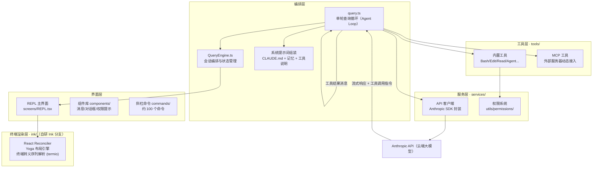
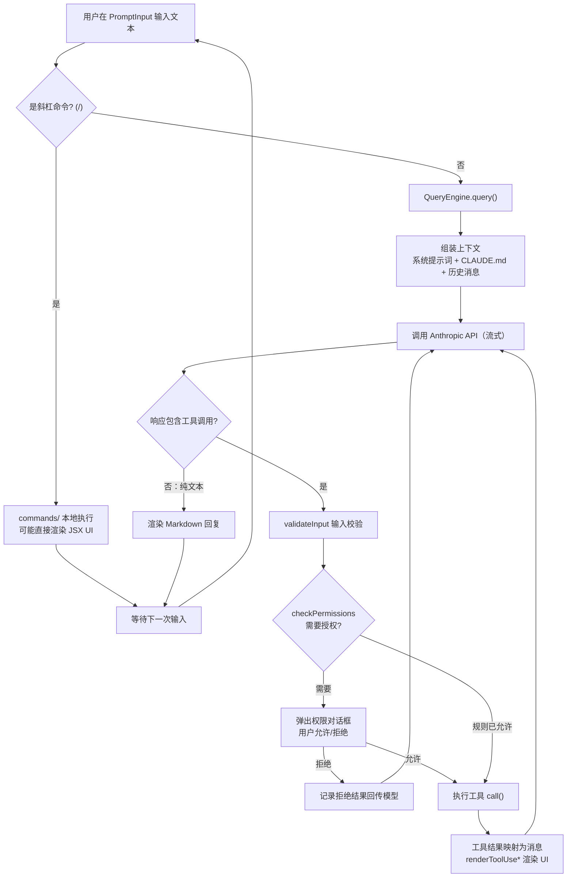

本页是整个代码库导览的起点。如果你是第一次接触这个项目，这一页将回答三个最基本的问题：**它是什么**（一个名为 Claude Code 的终端原生 AI 编程助手 CLI）、**它如何组织**（从入口到工具调用的五层架构）、以及**它为什么这样设计**（五大设计理念及其代码证据）。本页面向初学者，只建立心智地图，不深入任何子系统的实现细节——那些留给后续的深度解析页面。

## 它是什么：一个运行在终端里的"会动手"的编程助手

这个代码库是 **Claude Code** 的 CLI 实现——一个直接运行在终端（Terminal）中的 AI 编程助手。与"聊天问答"式的 AI 工具不同，它是**代理式的（agentic）**：用户用自然语言描述任务，模型通过调用一组"工具"（读文件、改代码、执行命令、搜索网络）自主完成多步骤工作，而不是只输出一段文字建议。产品身份可以从常量文件中得到印证——`PRODUCT_URL` 指向 `claude.com/claude-code`，同时集成了 claude.ai 的远程会话地址体系，支持生产、预发布（staging）和本地开发三种环境。

Sources: [product.ts](constants/product.ts#L1-L6)

从技术形态上看，它是一个 **TypeScript + React 的 Node/Bun 应用**：入口 `main.tsx` 长达 4684 行，负责 CLI 参数解析与初始化调度；界面不是网页，而是通过一个**自研的 Ink 分支**（`ink/` 目录，基于 React Reconciler）把 React 组件渲染成终端字符。值得注意的是入口文件对**启动性能的极致控制**——文件开头的注释明确说明：在执行任何重型模块导入之前，先并行启动 MDM（企业设备管理）子进程读取和 macOS 钥匙串预取，与后续约 135 毫秒的模块导入重叠执行。这种"毫秒必争"的意识贯穿整个代码库。

Sources: [main.tsx](main.tsx#L1-L20)

另一个鲜明的工程特征是**编译期特性门控**。代码通过 Bun 的 `bun:bundle` 模块引入 `feature()` 函数，在构建时决定哪些代码进入产物——例如 `feature('COORDINATOR_MODE')`（协调者模式）、`feature('KAIROS')`（助手模式）为假时，对应模块根本不会被 require，实现**死代码消除**。这意味着同一个源码库可以编译出面向不同用户群（如 Anthropic 内部 `ant` 用户与外部用户）的多形态产物。

Sources: [main.tsx](main.tsx#L21-L46)

## 整体架构鸟瞰

在深入细节之前，先建立一张全局地图。下图（Mermaid 流程图，从上到下表示依赖方向）展示了从终端到云端 API 的五层结构——**终端渲染层**是自研的 Ink 分支，负责把 React 组件变成终端字符；**界面层**承载 REPL 交互、组件库与斜杠命令；**编排层**是代理循环的心脏，负责会话状态与单轮查询；**工具层**提供模型可调用的能力；**服务层**处理 API 通信与权限决策。



这张图的核心信息是：**所有能力围绕一个循环组织**——用户输入进入 `QueryEngine`，由它调用 `query.ts` 发起单轮查询；模型返回的工具调用指令在本地经过权限检查后执行，执行结果再回传给模型，如此往复直到模型认为任务完成。`QueryEngine.ts` 的导入清单清晰地显示了这条主线：它直接导入 `query.js`（单轮循环）、`fetchSystemPromptParts`（系统提示词组装）、`processUserInput`（用户输入处理）以及 `Tool.js`（工具契约）。

Sources: [QueryEngine.ts](QueryEngine.ts#L35-L80)

## 五大设计理念

这个代码库的每一个角落都体现着一致的设计哲学。下表先给出总览，随后逐一展开。

| 设计理念 | 一句话概括 | 代码证据 |
|---|---|---|
| **终端原生** | 用 React 写终端 UI，而不是把 Web UI 搬进终端 | `ink/` 目录：自研 Reconciler、Yoga 布局、转义序列解析 |
| **代理式工具循环** | 模型的能力边界 = 工具集；工具是模型与真实世界之间的契约 | `Tool.ts` 统一接口契约 + `tools.ts` 注册表 |
| **权限与安全优先** | 每个有副作用的动作都要过权限闸门，且工具自我声明风险等级 | `checkPermissions` / `isReadOnly` / `isDestructive` |
| **UI 与工具合一** | 每个工具自己知道如何渲染自己的进度、结果与错误 | `renderToolUseMessage` 等渲染方法定义在 Tool 接口中 |
| **可扩展生态** | MCP、插件、Skills、Hooks、自定义 Agent 五条扩展通道 | `services/mcp/`、`plugins/`、`skills/`、`hooks/`、`agents/` |

### 理念一：终端原生

绝大多数终端工具用 ASCII 拼接或传统的 ncurses 式框架构建界面，而这个项目选择了**把整套 React 组件模型搬到终端里**。`ink/` 目录包含完整的 React Reconciler（`reconciler.ts`）、基于 Yoga 的布局引擎（`layout/`）、以及一套自研的终端 I/O 解析器 `termio/`（细分为 ansi、csi、osc、sgr 等转义序列处理模块）。这意味着开发者可以用熟悉的 JSX 组件、状态管理（`state/AppState.tsx`）来构建交互界面，代价则是必须维护一整套终端渲染基础设施。这是本项目最重的技术押注，也是"终端原生"理念最直接的证明——它不满足于"能用"，而要在终端里实现接近 GUI 的交互质量（虚拟滚动、模糊搜索、主题系统、Vim 模式）。

Sources: [REPL.tsx](screens/REPL.tsx#L12-L21)

### 理念二：代理式工具循环

`Tool.ts` 中的 `Tool` 类型是整个系统的**中央契约**——所有内置工具、MCP 工具、插件工具都实现同一接口。这个契约远不止"一个执行函数"：`inputSchema`（Zod 校验的输入模式）、`call`（执行逻辑）、`prompt`（告诉模型如何使用该工具的说明文本）、`description`（结果的人类可读描述）共同构成模型可调用的能力单元。更进一步，接口还包含大量**元能力声明**：`isConcurrencySafe`（能否并行执行）、`isReadOnly`（是否只读）、`isDestructive`（是否不可逆）、`interruptBehavior`（用户中途发消息时取消还是阻塞）、`shouldDefer`（是否延迟加载以节省上下文）。这份契约的存在使得编排层可以不关心具体工具，统一处理并发、权限与上下文预算。

Sources: [Tool.ts](Tool.ts#L362-L456)

工具注册表 `tools.ts` 则展示了**能力清单的动态性**。`getAllBaseTools()` 是所有工具的唯一权威清单，但清单中的工具是否真正可用取决于运行环境：`USER_TYPE === 'ant'`（Anthropic 内部）才启用 REPLTool 与 ConfigTool；`feature('AGENT_TRIGGERS')` 才启用定时任务三件套；工作树模式启用时才挂载 EnterWorktree/ExitWorktree。甚至有一个"极简模式"（`CLAUDE_CODE_SIMPLE`），只保留 Bash、Read、Edit 三件套。

Sources: [tools.ts](tools.ts#L193-L251)

下表按职能归纳核心内置工具，帮助你快速理解这个助手"会做什么"：

| 职能类别 | 工具 | 说明 |
|---|---|---|
| 文件操作 | Read / Edit / Write / NotebookEdit | 读、精确编辑、整文件写入、Notebook 编辑 |
| 代码检索 | Glob / Grep / ToolSearch | 文件名匹配、内容搜索、工具自检索（延迟加载机制） |
| 命令执行 | Bash / PowerShell | Shell 命令执行（跨平台双实现） |
| 网络访问 | WebFetch / WebSearch | 抓取网页、联网搜索 |
| 任务规划 | TodoWrite / Task 系列 / Plan 模式 | 待办清单、任务管理、计划审批 |
| 人机交互 | AskUserQuestion | 模型主动向用户提问 |
| 多智能体 | Agent / SendMessage / Team 系列 | 派生子代理、Swarm 团队协作 |
| 技能 | Skill | 触发可复用的技能包 |
| MCP 生态 | ListMcpResources / ReadMcpResource | 访问 MCP 服务器资源 |

Sources: [tools.ts](tools.ts#L202-L250)

### 理念三：权限与安全优先

在 `Tool` 契约中，`call` 之前有一道强制闸门：`validateInput`（静态校验输入合法性）与 `checkPermissions`（决定是否需要用户授权），且接口注释明确说明 **`checkPermissions` 只在 `validateInput` 通过之后才被调用**。权限上下文 `ToolPermissionContext` 定义了三种规则来源（允许、拒绝、询问）与多种模式（默认、计划模式、绕过模式等），工具注册表的 `getTools()` 甚至会在模型看到工具列表**之前**就把被"一票否决"规则封禁的工具整体过滤掉——安全检查发生在提示词组装阶段，而非调用时亡羊补牢。

Sources: [Tool.ts](Tool.ts#L489-L503)

一个容易忽略的细节体现了工程严谨性：`assembleToolPool()` 合并内置工具与 MCP 工具时，特意将内置工具排序为**连续前缀**，其注释解释了原因——服务端的系统提示词缓存策略在前缀匹配的最后一个内置工具后设置全局缓存断点，如果 MCP 工具插队排序，会使所有下游缓存键失效。**安全设计与性能设计在这里交汇**：权限过滤（deny 规则）与缓存稳定性必须同时成立。

Sources: [tools.ts](tools.ts#L345-L367)

### 理念四：UI 与工具合一

传统架构中"业务逻辑"与"展示层"分离，而这里的 `Tool` 接口把**渲染方法直接内嵌**：`renderToolUseMessage`（工具调用的展示，参数可能还在流式传输中就开始渲染）、`renderToolResultMessage`（结果展示）、`renderToolUseProgressMessage`（执行中的进度 UI）、`renderToolUseRejectedMessage`（用户拒绝时的自定义 UI，如展示被拒绝的 diff）、甚至 `renderGroupedToolUse`（并行工具调用的成组渲染）。每个工具最了解自己的输出长什么样，因此由它自己决定展示方式——例如 TodoWrite 的结果不进消息流而是更新待办面板。这是"本地命令"（斜杠命令用 JSX 直接渲染）与"模型工具"两种体系能无缝混排的关键。

Sources: [Tool.ts](Tool.ts#L566-L680)

### 理念五：可扩展生态与可演进的提示词

扩展能力有五条独立通道：**MCP 客户端**（`services/mcp/`，连接外部工具服务器）、**插件系统**（`plugins/`，含市场机制）、**Skills 技能**（`skills/`，内置十余个如 `verify`、`debug` 的技能包）、**Hooks**（`utils/hooks/`，生命周期钩子，支持 HTTP/Agent/Prompt 执行器）以及**自定义 Agent**（`tools/AgentTool/loadAgentsDir.ts`，用户可用文件定义子代理）。系统提示词的组装同样分层可定制：`buildEffectiveSystemPrompt` 的优先级注释列出了覆盖链——覆盖式提示词 > 协调者提示词 > 代理定义提示词 > 自定义提示词 > 默认提示词，外加始终追加的 `appendSystemPrompt`。用户的 `CLAUDE.md` 项目记忆文件、个人记忆目录（`memdir/`）都会在此时注入上下文。

Sources: [systemPrompt.ts](utils/systemPrompt.ts#L28-L55)

## 目录结构导览

下面是精简到一层的目录地图，标注了每个顶层目录的职责。完整的模块职责解析请参见专门的导览页。

```
cc-zread/
├── main.tsx            # CLI 入口：参数解析、初始化调度（4600+ 行）
├── QueryEngine.ts      # 会话编排：连接界面与单轮查询循环
├── query.ts            # 单轮 Agent Loop：流式响应、工具调度、错误恢复
├── Tool.ts             # ★ 工具契约：全系统最重要的接口定义
├── tools.ts            # 工具注册表：清单、条件加载、权限过滤
├── commands.ts         # 斜杠命令聚合入口
├── ink/                # ★ 自研终端渲染引擎（React + Yoga）
├── components/         # UI 组件库：消息、权限对话框、Diff 视图...
├── screens/            # 顶层界面：REPL 主屏、Doctor 诊断、恢复会话
├── commands/           # ~100 个斜杠命令实现（每个命令一个目录）
├── tools/              # ~40 个内置工具（每个工具一个目录）
├── services/           # 服务层：API 客户端、MCP、压缩、遥测、LSP...
├── utils/              # 工具函数海洋：权限、Bash 解析、Shell、设置...
├── state/              # 应用状态管理（AppState Store）
├── keybindings/        # 可配置键位绑定系统
├── plugins/            # 插件系统
├── skills/             # 技能体系（内置技能包）
├── memdir/             # 记忆系统（个人/团队记忆）
├── tasks/              # 后台任务框架（Shell、Agent、Teammate）
├── bridge/             # 远程控制桥（REPL Bridge，手机/Web 控制）
├── remote/             # 远程会话管理
├── entrypoints/        # 其他入口：SDK、MCP server、init
└── constants/          # 常量：产品、提示词、工具限制...
```

几个"体积异常"值得注意：`screens/REPL.tsx` 约 5000 行，是交互中枢；`utils/` 下有近 300 个文件，从 Bash AST 解析（`utils/bash/`）到安全存储（`utils/secureStorage/`）无所不包；`tools/` 与 `commands/` 都遵循"一个能力一个目录"的组织模式，目录内通常包含主实现、`UI.tsx`（渲染）、`prompt.ts`（模型说明）三件套——这正是理念四（UI 与工具合一）在文件组织上的投影。

Sources: [REPL.tsx](screens/REPL.tsx#L52-L69)

## 一次提问的生命周期

初学者最容易困惑的问题是："我敲下一句话后到底发生了什么？"下面的流程图（Mermaid）描绘了一次完整交互。注意其中有两个**循环**：内层是 Agent Loop（模型 ↔ 工具，直到任务完成），外层是 REPL Loop（等待下一次输入）。权限检查是工具执行前唯一可能"停下来等人"的环节。



这条链路中最关键的分界点在于：`query.ts` 承载内层循环（一次"提问-工具-回传"的完整往复），而 `QueryEngine.ts` 承载外层会话（维护消息历史、文件状态缓存、成本追踪、会话持久化）。`query.ts` 的导入已经暗示了它的全部职责——自动压缩（`services/compact/autoCompact`）、上下文折叠（`contextCollapse`）、消息规范化（`normalizeMessagesForAPI`）、附件管理（`utils/attachments`）都在这一层被编织进循环。

Sources: [query.ts](query.ts#L8-L64)

## 技术栈速查

| 维度 | 选型 | 说明 |
|---|---|---|
| 语言 | TypeScript（ESM） | 全库严格类型，Zod 做运行时校验 |
| UI 框架 | React + 自研 Ink 分支 | Reconciler 渲染到终端，Yoga 做布局 |
| 运行时/打包 | Bun（`bun:bundle` 特性标记） | 编译期死代码消除，产出多形态构建 |
| CLI 框架 | Commander（`@commander-js/extra-typings`） | 类型化参数解析 |
| AI SDK | `@anthropic-ai/sdk` | 流式消息、工具调用协议 |
| 扩展协议 | `@modelcontextprotocol/sdk` | MCP 工具/资源/elicitation |
| 状态管理 | 自研 Store（`state/`）+ React Context | AppState 单一来源 |

Sources: [main.tsx](main.tsx#L21-L29)

Sources: [Tool.ts](Tool.ts#L1-L10)

## 建议的阅读路线

理解了全局地图之后，推荐按以下顺序深入。**第一条路径适合想快速跑起来的读者**：

1. [快速启动：环境搭建、构建与运行 CLI](2-kuai-su-qi-dong-huan-jing-da-jian-gou-jian-yu-yun-xing-cli) —— 先让项目在你机器上转起来
2. [代码库结构导览：目录职责与模块地图](3-dai-ma-ku-jie-gou-dao-lan-mu-lu-zhi-ze-yu-mo-kuai-di-tu) —— 展开本页的目录速览
3. [构建体系与特性门控：Bun 编译期特性标记与死代码消除](4-gou-jian-ti-xi-yu-te-xing-men-kong-bun-bian-yi-qi-te-xing-biao-ji-yu-si-dai-ma-xiao-chu) —— 理解 `feature()` 背后的构建魔法

**第二条路径适合想理解核心引擎的读者**（本页五大理念的第一、二、四条在此展开）：

1. [启动引导流程：main.tsx 入口、CLI 参数解析与启动性能优化](5-qi-dong-yin-dao-liu-cheng-main-tsx-ru-kou-cli-can-shu-jie-xi-yu-qi-dong-xing-neng-you-hua)
2. [查询引擎 QueryEngine：会话编排、消息流转与状态管理](6-cha-xun-yin-qing-queryengine-hui-hua-bian-pai-xiao-xi-liu-zhuan-yu-zhuang-tai-guan-li)
3. [单轮查询循环：流式响应处理、工具调用与错误恢复](7-dan-lun-cha-xun-xun-huan-liu-shi-xiang-ying-chu-li-gong-ju-diao-yong-yu-cuo-wu-hui-fu)
4. [Tool 接口契约：输入校验、权限决策、进度回调与 Ink UI 渲染](10-tool-jie-kou-qi-yue-shu-ru-xiao-yan-quan-xian-jue-ce-jin-du-hui-tiao-yu-ink-ui-xuan-ran)

**第三条路径适合关注安全与扩展的读者**（对应理念三、五）：

1. [权限模型：模式切换、规则解析、Bash 分类器与自动模式](19-quan-xian-mo-xing-mo-shi-qie-huan-gui-ze-jie-xi-bash-fen-lei-qi-yu-zi-dong-mo-shi)
2. [命令安全分析：危险命令检测、只读校验、沙箱与路径保护](20-ming-ling-an-quan-fen-xi-wei-xian-ming-ling-jian-ce-zhi-du-xiao-yan-sha-xiang-yu-lu-jing-bao-hu)
3. [MCP 客户端集成：连接管理、传输层、OAuth 认证与 Elicitation](21-mcp-ke-hu-duan-ji-cheng-lian-jie-guan-li-chuan-shu-ceng-oauth-ren-zheng-yu-elicitation)
4. [插件系统：加载器、市场管理、安装校验与生命周期](22-cha-jian-xi-tong-jia-zai-qi-shi-chang-guan-li-an-zhuang-xiao-yan-yu-sheng-ming-zhou-qi)

无论选择哪条路径，记住本页确立的三个锚点：**`Tool.ts` 是全系统的中央契约**、**Ink 分支是终端原生的技术底座**、**权限闸门是所有副作用的必经之路**。带着这三个锚点阅读任何子系统的代码，你都能迅速定位它在全局中的位置。