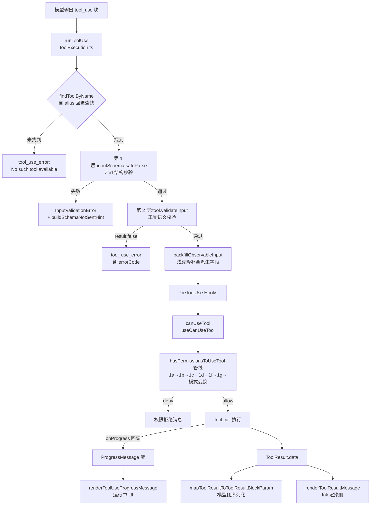

在 cc-zread 这套终端原生代理架构中，`Tool` 是横跨**模型 API 边界**与**终端 UI 边界**的核心抽象：同一个对象既向模型声明"我能接收什么输入、返回什么结果"，又向 Ink 渲染层声明"我该如何在终端里呈现调用过程"。本文页聚焦 [Tool.ts](Tool.ts) 定义的接口契约本身——输入校验的分层设计、权限决策的委托链路、进度回调的流式机制，以及六个 `render*` 方法的 UI 渲染职责——并沿 [toolExecution.ts](services/tools/toolExecution.ts) 的执行管线验证契约如何在运行时被逐项兑现。工具注册与懒加载机制属于[工具注册表](11-gong-ju-zhu-ce-biao-nei-zhi-gong-ju-qing-dan-lan-jia-zai-yu-xun-huan-yi-lai-zhi-li)页，执行编排与并发控制属于[工具执行编排](12-gong-ju-zhi-xing-bian-pai-streamingtoolexecutor-bing-fa-kong-zhi-yu-gong-ju-gou-zi)页，权限规则的完整解析属于[权限模型](19-quan-xian-mo-xing-mo-shi-qie-huan-gui-ze-jie-xi-bash-fen-lei-qi-yu-zi-dong-mo-shi)页，此处仅在契约交界处展开。

## 契约全景：一次工具调用的生命周期

先建立整体心智模型。下图展示从模型发出 `tool_use` 块开始，到最终消息落入会话历史的完整链路，以及 `Tool` 契约各成员在其中的介入点：

这个流程揭示了一个关键架构事实：**契约成员按消费方划分为三组**——模型侧成员（`inputSchema`/`mapToolResultToToolResultBlockParam`/`prompt`）、决策侧成员（`validateInput`/`checkPermissions`/`isReadOnly` 等）与渲染侧成员（六个 `render*` 方法加 `userFacingName`）。执行管线 `checkPermissionsAndCallTool` 严格按"校验 → 钩子 → 权限 → 执行"的顺序消费前两组，而第三组只在 Ink 组件树中被调用，两条数据流在 `ToolResult` 上汇合后分离。Sources: [toolExecution.ts](services/tools/toolExecution.ts#L599-L613)、[Tool.ts](Tool.ts#L362-L366)

## Tool 类型解剖：类型参数与契约成员

`Tool` 是一个以三个类型参数参数化的结构类型（非 class）：`Input extends AnyObject` 约束为输出对象结构的 Zod schema，`Output` 为执行结果类型，`P extends ToolProgressData` 为进度事件类型。这种设计使每个工具都能在其定义文件内推导出精确的输入/输出类型，而无需运行时继承。核心契约成员按职责归类如下：

| 分类 | 成员 | 签名要点 | 缺省策略（buildTool） |
|---|---|---|---|
| 标识 | `name` / `aliases` / `searchHint` | 只读；别名用于工具重命名后的旧会话兼容 | 必填 |
| 模型侧 | `inputSchema` / `inputJSONSchema` / `outputSchema` | Zod schema 或 MCP 原生 JSON Schema | 必填 |
| 模型侧 | `prompt()` / `description()` | 注入系统提示词的动态文本 | 必填 |
| 模型侧 | `mapToolResultToToolResultBlockParam` | `Output → ToolResultBlockParam` | 必填 |
| 决策侧 | `validateInput?` | 返回 `ValidationResult`（含 errorCode） | 省略即跳过 |
| 决策侧 | `checkPermissions` | 返回 `PermissionResult` | `allow` 透传 |
| 决策侧 | `isReadOnly` / `isDestructive` / `isConcurrencySafe` / `isOpenWorld` | 以 input 为参的谓词 | 全部 fail-closed |
| 决策侧 | `toAutoClassifierInput` | 供自动模式分类器的紧凑表示 | `''`（跳过分类器） |
| 执行侧 | `call(args, context, canUseTool, parentMessage, onProgress?)` | 返回 `Promise<ToolResult<Output>>` | 必填 |
| 执行侧 | `maxResultSizeChars` | 超限结果持久化到磁盘的阈值 | 必填 |
| 渲染侧 | `renderToolUseMessage` 等 6 个 render 方法 | 返回 `React.ReactNode` | 部分可选，带 Fallback |

三个值得注意的细节锚定了契约的工程精度。其一，`interruptBehavior()` 明确定义了工具运行中用户提交新消息时的语义——`'cancel'`（丢弃结果）或 `'block'`（阻塞新消息），缺省为 `'block'`，这为[单轮查询循环](7-dan-lun-cha-xun-xun-huan-liu-shi-xiang-ying-chu-li-gong-ju-diao-yong-yu-cuo-wu-hui-fu)的中断恢复提供了确定性。其二，`maxResultSizeChars` 设为 `Infinity` 是一种主动声明：例如 FileReadTool 的输出已被自身 token 预算约束，且持久化会产生"Read→文件→再 Read"的循环，因此显式豁免。其三，`shouldDefer`/`alwaysLoad` 这对互斥标记控制工具 schema 是否随首请求下发，配合 `ToolSearch` 实现 schema 按需加载。Sources: [Tool.ts](Tool.ts#L362-L455)、[Tool.ts](Tool.ts#L456-L524)、[Tool.ts](Tool.ts#L557-L695)

`ToolResult<T>` 是 `call` 的返回契约，比表面上的"数据包"丰富得多：`newMessages` 允许工具向会话注入额外消息（如 FileReadTool 读 PDF 时注入 base64 文档块），`contextModifier` 仅对**非并发安全**的工具生效——它可在工具执行后修改后续工具的 `ToolUseContext`（典型如 Bash 改变 cwd），`mcpMeta` 则为 MCP 工具透传结构化元数据。这个"结果 + 消息注入 + 上下文修改"的三合一设计，是工具能参与会话状态演进而非仅被动返回数据的根本机制。Sources: [Tool.ts](Tool.ts#L321-L336)

## ToolUseContext：贯穿契约的执行环境

`call` 与 `checkPermissions` 的第二参数 `ToolUseContext` 是理解契约行为的钥匙。它包含三层内容：`options`（tools、commands、mcpClients、thinkingConfig 等会话级配置）、状态访问器（`getAppState`/`setAppState`——注意注释明确指出子代理的 `setAppState` 是 no-op，故另设 `setAppStateForTasks` 供基础设施注册）、以及一批执行期回调（`setToolJSX` 用于工具接管全屏 UI，`setInProgressToolUseIDs` 驱动运行中标记，`updateFileHistoryState` 支撑文件回滚）。

两个字段的设计动机值得高级读者注意。`requireCanUseTool` 强制即使钩子自动放行也必须走 `canUseTool`，专用于投机执行场景下的文件路径重写校验；`contentReplacementState` 是按会话线程维护的工具结果预算替换状态，主线程由 REPL 一次性供给且永不重置（陈旧 UUID 键天然惰性），子代理默认克隆父级以保持缓存共享 fork 的决策一致性。`ToolUseContext` 因此不仅是参数传递器，更是**子代理上下文隔离策略的载体**。Sources: [Tool.ts](Tool.ts#L158-L300)

## 输入校验：Zod 结构层与 validateInput 语义层

执行管线在 `checkPermissionsAndCallTool` 中实施**两层校验**，二者职责严格分离。第一层用 `tool.inputSchema.safeParse(input)` 做结构校验——源码注释直言"surprisingly, the model is not great at generating valid input"。失败时经 `formatZodValidationError` 格式化，并尝试追加 `buildSchemaNotSentHint`：若该工具是 deferred（schema 未随请求下发）且消息历史中无其发现记录，提示文本会指导模型先调用 `ToolSearch` 加载 schema 再重试——把"模型没见过 schema 所以把数组输出成字符串"这类系统性错误转化为一次可自我修复的往返。校验失败统一包装为 `<tool_use_error>InputValidationError: ...</tool_use_error>` 并置 `is_error: true` 返回给模型。Sources: [toolExecution.ts](services/tools/toolExecution.ts#L614-L680)、[toolExecution.ts](services/tools/toolExecution.ts#L578-L597)

第二层 `tool.validateInput?.(parsedInput, toolUseContext)` 是可选的**语义校验**，返回 `ValidationResult` 判别联合：`{ result: true }` 或 `{ result: false, message, errorCode }`。errorCode 是有语义的稳定标识，FileReadTool 展示了这一层的典型用法——全部为**无 I/O 的前置检查**：pages 参数格式（errorCode 7）、页数范围超限（8）、权限 deny 规则命中（1）、二进制扩展名拒绝（4）、`/dev/zero` 等会挂起进程的设备文件路径（9），甚至对 Windows UNC 路径刻意放行（`{ result: true }`）以将文件系统操作推迟到用户授权之后，防止 NTLM 凭据泄漏。校验失败消息直接面向模型措辞（"It informs the model of why the tool use failed"），不渲染任何 UI——这是 `validateInput` 与后续权限链的本质区别。BashTool 的 `validateInput` 则展示了语义校验的另一种形态：拦截 `sleep N` 轮询模式（errorCode 10）并引导模型改用后台任务或 Monitor 工具。Sources: [Tool.ts](Tool.ts#L483-L492)、[FileReadTool.ts](tools/FileReadTool/FileReadTool.ts#L418-L495)、[BashTool.tsx](tools/BashTool/BashTool.tsx#L524-L538)

## 权限决策：从 checkPermissions 委托到 CanUseToolFn

契约的权限侧由三个角色协作完成。`tool.checkPermissions(input, context)` 是**工具特定逻辑**的入口——通用规则（模式、规则表）位于 `utils/permissions/permissions.ts`，契约方法只承载工具自有判定。FileReadTool 委托给 `checkReadPermissionForTool` 做读路径规则匹配；BashTool 委托 `bashToolHasPermission` 做子命令级规则分解。返回类型 `PermissionResult` 在标准三态 `allow`/`deny`/`ask` 之外增加了 **`passthrough`**——工具不置可否，交由通用管线继续，这是 `buildTool` 默认实现的行为（`{ behavior: 'allow', updatedInput }` 实质即放行至通用系统）。决策附带 `PermissionDecisionReason` 判别联合（`rule`/`mode`/`hook`/`classifier`/`safetyCheck` 等），为遥测归因与 UI 解释提供依据。Sources: [Tool.ts](Tool.ts#L494-L503)、[types/permissions.ts](types/permissions.ts#L174-L266)、[FileReadTool.ts](tools/FileReadTool/FileReadTool.ts#L398-L405)

`CanUseToolFn` 是契约与权限系统的**缝合点**，其类型签名统一了交互式 REPL 与 headless SDK 两种宿主。运行时管线 `hasPermissionsToUseTool` 按编号步骤推进：1a 整工具 deny 规则 → 1b 整工具 ask 规则（Bash 沙箱自动放行可穿透）→ 1c 调用 `tool.checkPermissions` → 1d 工具实现 deny → 1f 内容级 ask 规则 → 1g **bypass 免疫的 safetyCheck**（`.git/`、`.claude/`、shell 配置等敏感路径，即使 PreToolUse 钩子已放行也必须提示）。随后是模式变换层：`dontAsk` 把 ask 硬转为 deny；`auto` 模式先走 acceptEdits 快路径（跳过昂贵的分类器 API 调用，但 Agent/REPL 工具除外——其粘合代码可能含 VM 逃逸），再进入 YOLO 分类器，并配合**连续拒绝计数**在超限后回退到人工提示。交互式宿主中，`ask` 决策经 `handleCoordinatorPermission`/`handleSwarmWorkerPermission`/`handleInteractivePermission` 三级 handler 分发，最终弹出 Ink 权限对话框。Sources: [useCanUseTool.tsx](hooks/useCanUseTool.tsx#L27-L64)、[permissions.ts](utils/permissions/permissions.ts#L1169-L1229)、[permissions.ts](utils/permissions/permissions.ts#L1071-L1156)

补充契约的三个周边方法：`preparePermissionMatcher(input)` 将昂贵解析做一次、闭包匹配多次（如 FileReadTool 对 `file_path` 预编译通配符匹配器）；`backfillObservableInput(input)` 在观察者（SDK 流、transcript、hooks、canUseTool）看到输入前就地补全派生字段——例如把 `~` 相对路径扩展为绝对路径以防 hook 白名单被绕过，但**绝不触碰 API 绑定的原始输入**以保全 prompt cache；`toAutoClassifierInput` 为自动模式分类器提供紧凑表示（Bash 给命令、Read 给路径），返回 `''` 即在分类器 transcript 中跳过该工具。管线对 Bash 输入还有一道纵深防御：即使 schema 的 `strictObject` 已拒绝 `_simulatedSedEdit`，执行前仍显式剥离该内部字段，防止未来回归让模型借无害命令携带任意文件写入。Sources: [Tool.ts](Tool.ts#L508-L516)、[Tool.ts](Tool.ts#L474-L481)、[toolExecution.ts](services/tools/toolExecution.ts#L756-L793)

## 执行与进度回调：单一异步流上的双通道

`call` 的第五参数 `onProgress?: ToolCallProgress
` 是长时工具的生命线。签名 `(progress: ToolProgress
) => void` 中，`ToolProgress` 携带 `toolUseID` 与强类型 `data: P`；`P` 必须落在集中定义的 `ToolProgressData` 判别联合上（`BashProgress`、`AgentToolProgress`、`TaskOutputProgress`、`MCPProgress` 等），联合根类型与各工具的 re-export 都位于 `types/tools.js` 以斩断循环依赖。执行层用一个巧妙的 `Stream` 包装把"进度事件"与"最终结果"合并进单一 async iterable：`streamedCheckPermissionsAndCallTool` 内部调用回调式 `checkPermissionsAndCallTool`，其 `onToolProgress` 回调将进度 `enqueue` 进流，`tool.call` 内部的 `onProgress` 参数再被转发到同一出口。这意味着从 `runToolUse` 的视角，工具执行是一个可 `for await` 的消息流，与查询主循环的流式模型天然同构。Sources: [Tool.ts](Tool.ts#L302-L340)、[toolExecution.ts](services/tools/toolExecution.ts#L492-L570)、[toolExecution.ts](services/tools/toolExecution.ts#L1206-L1222)

TaskOutputTool 展示了进度回调最简洁的用法：阻塞等待任务完成前发出一次 `{ type: 'waiting_for_task', taskDescription, taskType }` 事件，让 UI 能在轮询期间显示"正在等待"。BashTool 则展示了最复杂形态：`runShellCommand` 被实现为 async generator，shell 执行器的 `onProgress(lastLines, allLines, totalLines, totalBytes)` 回调只更新本地变量并 resolve 一个 progress signal，唤醒 generator yield 出 `BashProgress` 数据；generator 的最终 `return` 值则是完整 `ExecResult`——**进度与结果在同一生成器上以不同通道分离**。Source: [TaskOutputTool.tsx](tools/TaskOutputTool/TaskOutputTool.tsx#L208-L282)、[BashTool.tsx](tools/BashTool/BashTool.tsx#L826-L898)

钩子阶段同样向该流注入 `hook_progress` 类型事件（`filterToolProgressMessages` 负责在 UI 侧把 hook 进度与工具进度分离），因此进度流实际承载三类事件：PreToolUse 钩子进度、权限阶段提示、工具执行进度。`ToolResult.data` 之外的输出通道也在此汇合：`newMessages` 数组会被管线转换为带 `sourceToolUseID` 标记的瞬态用户消息（`tagMessagesWithToolUseID` 防止"正在运行"提示在 UI 中重复渲染），仅在工具解析后才转为持久。Sources: [Tool.ts](Tool.ts#L312-L319)、[utils.ts](tools/utils.ts#L8-L25)

## Ink UI 渲染契约：六类 render 方法的职责矩阵

渲染侧契约的设计哲学是**生命周期全覆盖 + 全部可选带 Fallback**：调用进行中、调用被拒绝、调用出错、结果落地、运行中进度、并行分组，每个阶段都有对应方法，省略时落入通用 Fallback 组件（`FallbackToolUseRejectedMessage`/`FallbackToolUseErrorMessage`），仅当工具需要特化 UI 时才覆盖。

| 方法 | 调用时机 | input 形态 | 典型实现 |
|---|---|---|---|
| `renderToolUseMessage` | 工具调用开始即渲染 | **Partial**（参数可能尚未流完） | Read 渲染 `<FilePathLink>` + 行区间 |
| `renderToolUseProgressMessage` | 运行中（每次进度事件） | 完整 `ProgressMessage
[]` | Bash 的 `ShellProgressMessage` |
| `renderToolUseQueuedMessage` | 排队等待执行 | 无参 | 轻量占位 |
| `renderToolUseRejectedMessage` | 用户拒绝权限 | 完整 input + 进度历史 | Edit 展示被拒 diff |
| `renderToolUseErrorMessage` | `is_error` 结果 | `ToolResultBlockParam['content']` | Read 把 "File not found" 替代原始错误 |
| `renderToolResultMessage` | 结果落地 | `Output` + 样式选项 | Read 仅渲染 "Read N lines" 摘要 |

两个签名细节体现了对渲染时机与数据分层的精确把控。`renderToolUseMessage` 的 input 是 `Partial<z.infer<Input>>`——因为消息在**工具参数流式传输过程中**就尽早渲染，字段可能残缺；`renderToolResultMessage` 则接收 `progressMessagesForMessage`，允许结果渲染引用进度历史（如 Bash 结果里内嵌最终输出行）。选项中的 `style?: 'condensed'`、`verbose`、`isTranscriptMode` 构成三级展示粒度，供[组件体系](16-zu-jian-ti-xi-yu-she-ji-xi-tong-xiao-xi-xuan-ran-quan-xian-dui-hua-kuang-diff-shi-tu-yu-zhu-ti)页详述的紧凑/展开视图复用。Sources: [Tool.ts](Tool.ts#L599-L667)、[FileReadTool/UI.tsx](tools/FileReadTool/UI.tsx#L30-L65)、[FileReadTool/UI.tsx](tools/FileReadTool/UI.tsx#L77-L164)

模型侧序列化与渲染侧呈现是**刻意分离的两条数据通路**，`mapToolResultToToolResultBlockParam` 与 `renderToolResultMessage` 对同一 `Output` 产出完全不同的内容。FileReadTool 是最纯粹的例证：模型侧发送文件全文 + 行号前缀 + 安全提醒；UI 侧所有输出类型只渲染摘要横幅（"Read image (42KB)"、"Read 47 lines"、"Unchanged since last read"），从不渲染内容本身。`extractSearchText` 方法进一步固化这条纪律——它必须返回"transcript 模式下实际可见的文本"供会话搜索索引，Read 显式返回 `''` 并附上被 render-fidelity 测试捕捉回归的注释；源码明确区分"索引了但没渲染"（phantom，零容忍）与"渲染了但没索引"（漏计，可容忍）两类偏差。BashTool 同理：`persistedOutputPath` 的 `<persisted-output>` 包装仅存在于模型侧序列化，UI 直接消费 `data.stdout`。Sources: [FileReadTool/UI.tsx](tools/FileReadTool/UI.tsx#L77-L143)、[FileReadTool.ts](tools/FileReadTool/FileReadTool.ts#L409-L416)、[Tool.ts](Tool.ts#L581-L599)、[BashTool.tsx](tools/BashTool/BashTool.tsx#L555-L623)

辅助渲染成员完善了展示语义：`userFacingName(input)` 允许按输入变形工具名（Read 读计划文件时显示 "Reading Plan"，读代理输出文件时显示 "Read agent output"；Bash 的 sed 就地编辑被改标为文件编辑）；`getToolUseSummary`/`getActivityDescription` 分别服务紧凑视图与 spinner 动词（"Reading src/foo.ts"）；`renderToolUseTag` 渲染调用行后的元数据标签（超时、模型名、任务 ID）；`isResultTruncated` 门控全屏模式的点击展开——仅当 verbose 确实展示更多内容时才提供 hover/click 交互；`renderGroupedToolUse` 允许并行同类工具聚组渲染（仅非 verbose 模式，verbose 下各自归位），返回 `null` 回退独立渲染；`isTransparentWrapper` 供 REPL 这类包装工具声明"自身不显示任何内容，全部委托给内部调用的原生渲染"。Sources: [Tool.ts](Tool.ts#L524-L548)、[Tool.ts](Tool.ts#L609-L694)、[FileReadTool/UI.tsx](tools/FileReadTool/UI.tsx#L165-L184)

## buildTool：fail-closed 的默认值工厂

所有工具出口都应经 `buildTool(def)` 构造，它以 `{ ...TOOL_DEFAULTS, userFacingName: () => def.name, ...def }` 的展开合并七个可缺省方法，并用 `BuiltTool<D>` 类型在类型层精确镜像该展开——若 def 提供某方法则 def 类型胜出，否则默认填充。默认值的选择体现明确的**安全取向（fail-closed）**：`isEnabled → true`（可用性优先），但 `isConcurrencySafe → false`、`isReadOnly → false`、`isDestructive → false` 全部按最保守假设；`checkPermissions → allow 透传` 表示缺省时交由通用权限系统而非工具自裁；`toAutoClassifierInput → ''` 意味着未声明的工具**自动排除在安全分类器视野之外**——安全相关的工具必须主动覆写；`userFacingName → name` 兜底显示。这套默认使得新增工具的作者不可能"忘记"声明只读性而意外获得宽松待遇——不声明即按写操作、按不可并发处理。Sources: [Tool.ts](Tool.ts#L703-L755)、[Tool.ts](Tool.ts#L757-L792)

## 结语与延伸阅读

`Tool` 契约的精妙之处在于用单一对象收敛了三条传统上分属不同层的关注点：向模型的 schema 声明与结果序列化、向权限系统的语义自述与决策委托、向 Ink 的全生命周期渲染。`buildTool` 的 fail-closed 默认与 `types/tools.js`、`types/permissions.js` 的集中类型抽取，共同展示了大型 TS 代码库治理循环依赖与安全缺省的成熟范式。建议按以下顺序继续深入：工具实例如何被组装进注册表并懒加载，见[工具注册表：内置工具清单、懒加载与循环依赖治理](11-gong-ju-zhu-ce-biao-nei-zhi-gong-ju-qing-dan-lan-jia-zai-yu-xun-huan-yi-lai-zhi-li)；`runToolUse` 流如何被并发调度与钩子包裹，见[工具执行编排：StreamingToolExecutor、并发控制与工具钩子](12-gong-ju-zhi-xing-bian-pai-streamingtoolexecutor-bing-fa-kong-zhi-yu-gong-ju-gou-zi)；`render*` 方法产出的节点如何在自研 Ink 引擎上布局渲染，见[Ink 渲染引擎（自研分支）：React Reconciler、Yoga 布局与终端转义序列解析](15-ink-xuan-ran-yin-qing-zi-yan-fen-zhi-react-reconciler-yoga-bu-ju-yu-zhong-duan-zhuan-yi-xu-lie-jie-xi)；权限管线的规则解析与分类器细节，见[权限模型：模式切换、规则解析、Bash 分类器与自动模式](19-quan-xian-mo-xing-mo-shi-qie-huan-gui-ze-jie-xi-bash-fen-lei-qi-yu-zi-dong-mo-shi)。