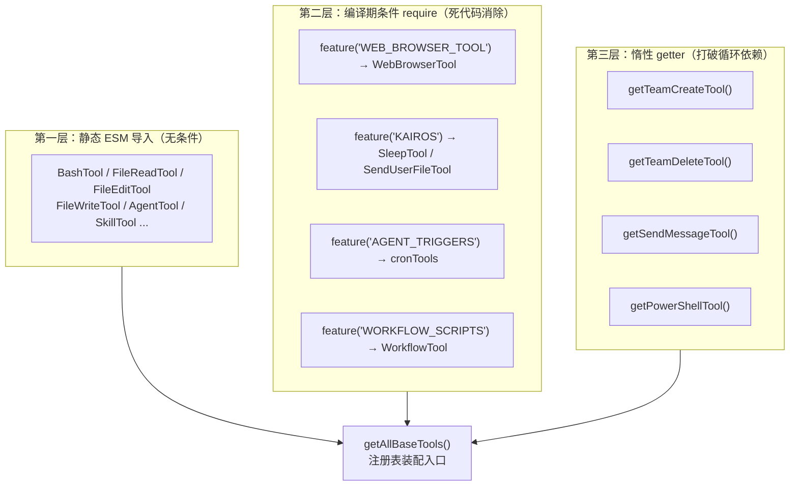
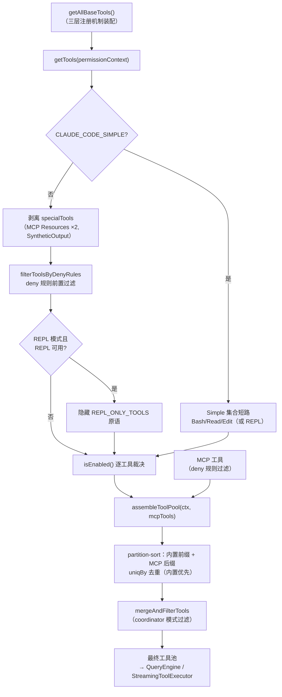
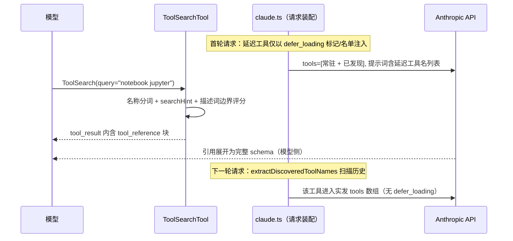

工具注册表（`tools.ts`）是整个工具系统的**单一事实来源**（source of truth）：它回答三个核心问题——当前构建里存在哪些工具、这些工具以何种顺序与何种条件进入模型上下文、以及如何在庞大且相互依赖的模块图中避免初始化死锁。本文聚焦注册表本身的装配逻辑、三层懒加载机制与循环依赖治理模式；工具的运行时行为（校验、权限、渲染契约）已在 [Tool 接口契约](10-tool-jie-kou-qi-yue-shu-ru-xiao-yan-quan-xian-jue-ce-jin-du-hui-tiao-yu-ink-ui-xuan-ran) 中详述，执行编排细节见 [工具执行编排](12-gong-ju-zhi-xing-bian-pai-streamingtoolexecutor-bing-fa-kong-zhi-yu-gong-ju-gou-zi)。

## 注册表的三层注册机制

打开 `tools.ts` 的导入区，可以观察到三种截然不同的模块引入方式，它们分别服务于不同的工程目标。第一层是**静态 ESM 导入**——Read、Edit、Write、Bash、Agent 等核心工具直接 import，无条件参与注册；第二层是**编译期条件 require**——配合 Bun 的 `feature()` 门控标记，非目标构建中被完全消除（dead code elimination），例如 `WebBrowserTool`、`CtxInspectTool`、`SnipTool` 等；第三层是**惰性 getter**——将 `require` 包裹在函数内，把模块加载推迟到首次调用，专门用于切断 `tools.ts → TeamCreateTool → ... → tools.ts` 这类循环依赖链。文件顶部的 biome-ignore 注释"ANT-ONLY import markers must not be reordered"暗示了这些导入顺序本身即是构建脚本的解析锚点，不可随意重排。

Sources: [tools.ts](tools.ts#L1-L53), [tools.ts](tools.ts#L61-L72), [tools.ts](tools.ts#L104-L135)

第二层与第三层在语法上都是 `require()`，但语义完全不同：第二层的条件是编译期常量（`feature()` 与 `process.env.USER_TYPE` 在构建时即被内联替换），Bundler 可将整个分支连同胞体一起消除；第三层的条件是**运行时函数**（如 `isAgentSwarmsEnabled()`），`require` 在函数体内执行意味着模块解析发生在首次调用 getter 时——此时 `tools.ts` 已完成初始化，循环引用导致的"拿到未完成模块"问题自然消解。理解这一区别是阅读注册表代码的关键前提。

Sources: [tools.ts](tools.ts#L14-L28), [tools.ts](tools.ts#L126-L156), [tools.ts](tools.ts#L228-L242)

## 内置工具清单：按门控维度分类

`getAllBaseTools()` 返回的数组就是完整的内置工具清单，每个条目都挂在一个明确的启用条件上。下表按门控维度归类（以当前代码库为准，feature 名称对应构建期标记）：

| 门控维度 | 条件 | 工具 |
|---|---|---|
| **无条件常驻** | 总是注册 | AgentTool、TaskOutputTool、BashTool、ExitPlanModeV2Tool、FileReadTool、FileEditTool、FileWriteTool、NotebookEditTool、WebFetchTool、TodoWriteTool、WebSearchTool、TaskStopTool、AskUserQuestionTool、SkillTool、EnterPlanModeTool、BriefTool |
| **嵌入搜索工具豁免** | `hasEmbeddedSearchTools()` 为 false 时注册 | GlobTool、GrepTool（ant 原生构建内嵌 bfs/ugrep 后，Bash 中的 find/grep 已被别名接管，专用工具移除） |
| **ant 用户专属** | `USER_TYPE === 'ant'` | ConfigTool、TungstenTool、REPLTool、SuggestBackgroundPRTool |
| **环境变量** | 运行时检查 | LSPTool（`ENABLE_LSP_TOOL`）、VerifyPlanExecutionTool（`CLAUDE_CODE_VERIFY_PLAN=true`）、TestingPermissionTool（`NODE_ENV=test`）、PowerShellTool（`isPowerShellToolEnabled()`） |
| **Todo V2 特性** | `isTodoV2Enabled()` | TaskCreateTool、TaskGetTool、TaskUpdateTool、TaskListTool |
| **Worktree 模式** | `isWorktreeModeEnabled()` | EnterWorktreeTool、ExitWorktreeTool |
| **Swarm 团队** | `isAgentSwarmsEnabled()` | TeamCreateTool、TeamDeleteTool（均经惰性 getter 引入）；SendMessageTool 无条件引入但同样走 getter |
| **编译期 feature 门控** | `feature()` 标记 | WebBrowserTool、OverflowTestTool、CtxInspectTool、TerminalCaptureTool、ListPeersTool、WorkflowTool、SnipTool、SleepTool（PROACTIVE/KAIROS）、CronCreate/Delete/List（AGENT_TRIGGERS）、RemoteTriggerTool、MonitorTool、SendUserFileTool、PushNotificationTool、SubscribePRTool |
| **工具搜索** | `isToolSearchEnabledOptimistic()` | ToolSearchTool（乐观检查，实际延迟决策推迟到请求时） |

值得注意的细节是**乐观注册**（optimistic registration）模式：`ToolSearchTool` 只要"可能启用"就进入基础清单，而真正的延迟决策（模型是否支持 `tool_reference`、延迟工具 token 是否超阈值）发生在每次 API 请求时——注册表只需要保证工具"在场"，不需要预知最终裁决。此外 `GlobTool/GrepTool` 的条件排除逻辑来自嵌入搜索工具机制：当 Bun 二进制内嵌了 bfs/ugrep 时，Bash 里的 `find`/`grep` 会被 shell 函数遮蔽为快速原生实现，专用工具的存在反而冗余。

Sources: [tools.ts](tools.ts#L193-L251), [utils/embeddedTools.ts](utils/embeddedTools.ts#L15-L21), [tools.ts](tools.ts#L247-L249)

## 从注册表到工具池：装配管道

注册表数组只是起点，真正的工具池要经过一条多级过滤管道。`getTools(permissionContext)` 是内置工具的第一道关口，其内部逻辑依次为：**Simple 模式短路**（`CLAUDE_CODE_SIMPLE` 时仅保留 Bash/Read/Edit，若 REPL 模式激活则替换为 REPLTool 单件）、**特殊工具剥离**（ListMcpResources、ReadMcpResource、SyntheticOutput 被移出常规池——它们要么由请求逻辑另行注入，要么属于结构化输出实现细节）、**deny 规则过滤**（`filterToolsByDenyRules` 使用与运行时权限检查相同的匹配器，使 `mcp__server` 前缀式整体拒绝在模型看到工具列表之前生效）、**REPL 原语隐藏**（REPL 模式启用时从直接调用面中隐藏 Read/Write/Edit/Glob/Grep/Bash/NotebookEdit/Agent，它们改经 REPL 的 VM 上下文访问）、以及最后的 **`isEnabled()` 逐工具裁决**。

Sources: [tools.ts](tools.ts#L253-L327), [tools.ts](tools.ts#L301-L326), [tools/REPLTool/constants.ts](tools/REPLTool/constants.ts#L33-L46)

内置工具与 MCP 工具的合流发生在 `assembleToolPool()`。该函数的设计有一个容易忽略但影响深远的约束——**prompt cache 稳定性排序**：内置工具与 MCP 工具各自按名称排序后拼接，内置工具始终保持为连续前缀。注释明确解释了原因：服务端的 `claude_code_system_cache_policy` 会在最后一个前缀匹配的内置工具后放置全局缓存断点，如果做扁平排序，任何名称恰好落在内置工具之间的 MCP 工具都会使全部下游缓存键失效。`uniqBy` 保持插入顺序的特性同时保证了名称冲突时内置工具获胜。

Sources: [tools.ts](tools.ts#L329-L367), [utils/toolPool.ts](utils/toolPool.ts#L55-L79)

交互式 REPL 路径经由 React hook `useMergedTools` 消费这条管道：`useMemo` 内部先调 `assembleToolPool`，再经 `mergeAndFilterTools` 合并初始工具并应用 coordinator 模式过滤。`mergeAndFilterTools` 刻意放在**无 React 依赖的纯文件** `toolPool.ts` 中，以便 `print.ts` 等无头路径能复用同一逻辑而不把 react/ink 拖入 SDK 模块图——这是另一个层面的依赖治理。coordinator 模式下工具面收窄到 `COORDINATOR_MODE_ALLOWED_TOOLS`（Agent/TaskStop/SendMessage/SyntheticOutput）加上 PR 订阅类 MCP 工具后缀匹配。主线程之外的消费方还有子代理：`filterToolsForAgent` 依据 `constants/tools.ts` 中定义的四组集合（`ALL_AGENT_DISALLOWED_TOOLS`、`CUSTOM_AGENT_DISALLOWED_TOOLS`、`ASYNC_AGENT_ALLOWED_TOOLS`、`IN_PROCESS_TEAMMATE_ALLOWED_TOOLS`）裁剪子代理可见的工具，防递归（禁 Agent/TaskOutput）与保护主线程抽象（禁 ExitPlanMode/TaskStop）是主要动机。

Sources: [hooks/useMergedTools.ts](hooks/useMergedTools.ts#L20-L44), [utils/toolPool.ts](utils/toolPool.ts#L35-L41), [constants/tools.ts](constants/tools.ts#L36-L112), [tools/AgentTool/agentToolUtils.ts](tools/AgentTool/agentToolUtils.ts#L70-L116)

无头路径（`--print`）在 `main.tsx` 中手工镜像了同一管道：先激活 proactive 模式（使 `SleepTool.isEnabled()` 通过）、再 `getTools()`、再应用 coordinator 过滤，最后将 `SyntheticOutputTool` 追加到过滤完成的数组**之后**——该工具在 `getTools` 内被 `specialTools` 集合显式排除，因为它是结构化输出的实现细节而非模型可自由使用的工具，只有当用户通过 `--json-schema` 显式请求时才动态构造注入。

Sources: [main.tsx](main.tsx#L1864-L1901), [tools.ts](tools.ts#L301-L305)

## 懒加载机制 I：编译期死代码消除

第一层懒加载已在 [构建体系与特性门控](4-gou-jian-ti-xi-yu-te-xing-men-kong-bun-bian-yi-qi-te-xing-biao-ji-yu-si-dai-ma-xiao-chu) 中从构建视角论述，这里补充注册表侧的消费契约。`feature('AGENT_TRIGGERS')` 等调用在构建期被 `bun:bundle` 的 `feature` 导入替换为字面量 `true`/`false`，随之三元表达式坍缩、`require` 分支连同目标模块从产物中消失。这带来两个注册表侧的纪律要求：其一，被 feature 门控的模块**只能**通过条件 require 引入（顶部静态导入会破坏消除）；其二，`constants/tools.ts` 这类被广泛引用的常量文件在引用 feature 时也遵循同一模式（如 `ALL_AGENT_DISALLOWED_TOOLS` 中的 `WORKFLOW_SCRIPT_NAME` 条件成员），确保常量文件本身不反向拖入门控模块。`WorkflowTool` 的初始化展示了该模式的进阶用法——IIFE 在 require 工具本体的同时先执行 `initBundledWorkflows()`，把副作用初始化内联进注册表达式。

Sources: [tools.ts](tools.ts#L16-L53), [tools.ts](tools.ts#L129-L134), [constants/tools.ts](constants/tools.ts#L44-L46), [tools.ts](tools.ts#L36-L52)

## 懒加载机制 II：lazySchema 延迟 Schema 构建

`lazySchema` 是一个仅 9 行的工具函数，却在几乎所有工具定义中出现：它返回一个记忆化的工厂闭包，把 Zod schema 的构造从**模块初始化时**推迟到**首次访问时**。这解决的是一个真实的启动性能问题——`tools.ts` 被入口模块早期加载，若每个工具的 `z.strictObject(...)` 都在模块顶层执行，60 余个工具的 schema 解析开销会全部计入冷启动时间。改造后的模式是：模块顶层仅声明 `const inputSchema = lazySchema(() => z.object({...}))`，`Tool` 接口的 `inputSchema` getter 在首次被读取（通常发生在首个 API 请求构建 schema 时）才触发闭包内的 `cached ??= factory()`。`SendMessageTool`、`ToolSearchTool`、`TeamCreateTool` 等均已采用该模式。

Sources: [utils/lazySchema.ts](utils/lazySchema.ts#L1-L9), [tools/ToolSearchTool/ToolSearchTool.ts](tools/ToolSearchTool/ToolSearchTool.ts#L21-L45), [tools/TeamCreateTool/TeamCreateTool.ts](tools/TeamCreateTool/TeamCreateTool.ts#L37-L50), [Tool.ts](Tool.ts#L322-L327)

## 懒加载机制 III：ToolSearch 延迟工具协议

最精密的懒加载发生在**工具定义进入模型上下文**这一层。当 MCP 服务器提供数十上百个工具时，全量内联 schema 会迅速膨胀系统提示词；ToolSearch 协议将这部分成本转为按需加载。判定哪些工具可延迟的逻辑集中在 `isDeferredTool()`：MCP 工具默认全部延迟（工作流特定，非每轮必需）；标注 `shouldDefer: true` 的内置工具延迟；而 `alwaysLoad: true`（MCP 工具经 `_meta['anthropic/alwaysLoad']` 设置）拥有最高优先级豁免。关键豁免还包括 ToolSearch 自身（模型靠它加载一切）、fork 实验开启时的 AgentTool（首轮就必须可用）、以及 Brief/SendUserFile 这类承担"模型与用户通信契约"的工具——其提示词必须首轮可见，不允许一次 ToolSearch 往返。

Sources: [tools/ToolSearchTool/prompt.ts](tools/ToolSearchTool/prompt.ts#L53-L108), [Tool.ts](Tool.ts#L437-L449)

启用决策分为两级。**乐观级** `isToolSearchEnabledOptimistic()` 供注册表使用：只要模式不是 `standard` 就返回 true（用于决定 ToolSearchTool 是否进入基础清单）；**裁决级** `isToolSearchEnabled()` 在每次 API 请求前运行完整检查——模型是否支持 `tool_reference` 块（默认仅 haiku 系列不支持，GrowthBook 可热更新模式表）、ToolSearchTool 是否仍在可用列表（可能被 `disallowedTools` 移除）、以及 `tst-auto` 模式下的阈值判定（默认上下文窗口的 10%，优先用 token 计数 API，不可用时回退到 2.5 字符/token 的启发式估算）。三种模式由 `ENABLE_TOOL_SEARCH` 环境变量驱动：`tst`（无条件延迟）、`tst-auto`（超阈值才延迟）、`standard`（禁用，全部内联）。

Sources: [utils/toolSearch.ts](utils/toolSearch.ts#L155-L198), [utils/toolSearch.ts](utils/toolSearch.ts#L239-L252), [utils/toolSearch.ts](utils/toolSearch.ts#L270-L320), [utils/toolSearch.ts](utils/toolSearch.ts#L385-L473), [utils/toolSearch.ts](utils/toolSearch.ts#L44-L49)

请求时的装配发生在 `claude.ts`：先经 `isToolSearchEnabled` 裁决，再用 `isDeferredTool` 预计算延迟工具名集合（注释特别指出该函数每次调用含 2 次 GrowthBook 查询，故缓存为 Set）；随后 `extractDiscoveredToolNames` 扫描消息历史中的 `tool_reference` 块（含压缩边界上快照的 `preCompactDiscoveredTools` 回读），只有已被发现或本就不延迟的工具才真正进入本次请求的 tools 数组；被延迟的工具在 `toolToAPISchema` 中打上 `defer_loading: true` 标记。模型侧的发现入口是 ToolSearchTool 本身：其 `call` 支持 `select:A,B,C` 精确选择、裸工具名快速路径、`+slack send` 必含词语法与纯关键词评分搜索（名称分词、searchHint、描述的词边界匹配加权计分），匹配结果经 `mapToolResultToToolResultBlockParam` 序列化为 `tool_reference` 块写回消息历史——API 在模型上下文中将这些引用展开为完整定义，下一轮请求 `extractDiscoveredToolNames` 即会将其纳入实发集合，闭环完成。

Sources: [services/api/claude.ts](services/api/claude.ts#L1118-L1172), [services/api/claude.ts](services/api/claude.ts#L1208-L1246), [utils/toolSearch.ts](utils/toolSearch.ts#L525-L592), [tools/ToolSearchTool/ToolSearchTool.ts](tools/ToolSearchTool/ToolSearchTool.ts#L358-L433), [tools/ToolSearchTool/ToolSearchTool.ts](tools/ToolSearchTool/ToolSearchTool.ts#L439-L470)

延迟工具的"名单告知"存在两种通道：默认（非 ant 且未开 GrowthBook 门）时在消息列表前部注入一条 `<available-deferred-tools>` 元消息；启用 delta 通道时（`isDeferredToolsDeltaEnabled`）改用持久化的 `deferred_tools_delta` 附件，由 `getDeferredToolsDelta` 对比已公告集合与当前池的增量（added/removed），避免每次池变动都击穿前缀缓存。

Sources: [services/api/claude.ts](services/api/claude.ts#L1330-L1345), [utils/toolSearch.ts](utils/toolSearch.ts#L624-L634), [utils/toolSearch.ts](utils/toolSearch.ts#L636-L706)

与之配套的还有 **schema 字节级缓存**：`toolToAPISchema` 将会话稳定的 base schema（name/description/input_schema/strict/eager_input_streaming）缓存于 `toolSchemaCache` 的叶模块 Map 中——GrowthBook 门翻转或 `tool.prompt()` 动态内容不再引发约 11K token 工具块及其下游的全部重算；`defer_loading` 与 `cache_control` 属于逐请求可变项，作为 overlay 在缓存副本上叠加而不污染缓存。缓存键在 `inputJSONSchema` 存在时拼接其序列化（同名不同 schema 的 SyntheticOutput 实例曾因纯名称键返回过期 schema，错误率从 5.4% 升至 51% 的教训直接写在注释里）。`CLAUDE_CODE_DISABLE_EXPERIMENTAL_BETAS` 则是所有 beta 字段的最后闸口：非白名单字段在 `toolToAPISchema` 这一唯一咽喉点被剥除，防代理网关 400。

Sources: [utils/api.ts](utils/api.ts#L119-L209), [utils/api.ts](utils/api.ts#L211-L266), [utils/toolSchemaCache.ts](utils/toolSchemaCache.ts#L3-L26)

## 循环依赖治理：四种已验证模式

大型 CLI 代码库中，`tools.ts` 位于依赖图的枢纽位置——它聚合所有工具，而工具又天然依赖查询引擎、任务框架、Swarm 协作等基础设施，后者反过来需要工具清单。代码库中沉淀出四种可复用的治理模式：

| 模式 | 实现载体 | 适用场景 |
|---|---|---|
| **惰性 require getter** | `getTeamCreateTool()` / `getSendMessageTool()` / `getPowerShellTool()` | 打破 `tools.ts → 工具 → ... → tools.ts` 的模块初始化环；require 推迟到 `getAllBaseTools()` 首次调用 |
| **类型集中化** | `Tool.ts` 从 `types/permissions.ts`、`types/tools.ts` 导入纯类型 | 注释明示"from centralized location to break import cycles"——把被环上多方引用的类型下沉到无依赖的叶子模块 |
| **叶模块下沉** | `toolSchemaCache.ts`（供 auth.ts 清缓存）、`toolPool.ts`（无 React 的纯函数） | 让副作用接口（缓存清理、纯过滤逻辑）脱离重依赖模块，`auth.ts → api.ts` 的环（plans→settings→file→growthbook→config→bridgeEnabled→auth）因此无需建立 |
| **内联替代导入** | `toolSearch.ts` 对 `compact_boundary` 消息做内联类型判断而非调用 `isCompactBoundaryMessage` | 环上仅剩一个符号时，宁可复制一行类型守卫也不反向 import |

惰性 getter 的注释直接记录了环的存在："Lazy require to break circular dependency: tools.ts -> TeamCreateTool/TeamDeleteTool -> ... -> tools.ts"。`ToolSearchTool/prompt.ts` 中的同类注释补充了环的另一条路径：`forkSubagent` 的静态导入会经 `coordinatorMode` 在模块初始化时形成经过 `constants/tools.ts` 的环，故改为 `require` 内联。而 `PowerShellTool` 的 getter 还叠加了运行时门控（`isPowerShellToolEnabled()` 不通过则根本不加载模块），懒加载与条件注册合二为一。这些 getter 全部带 `as typeof import(...)` 类型断言，保留完整类型安全——运行时延迟不牺牲编译期检查。

Sources: [tools.ts](tools/ts#L61-L72), [tools.ts](tools.ts#L150-L156), [tools/ToolSearchTool/prompt.ts](tools/ToolSearchTool/prompt.ts#L73-L81), [Tool.ts](Tool.ts#L41-L48), [utils/toolSchemaCache.ts](utils/toolSchemaCache.ts#L10-L12), [utils/toolSearch.ts](utils/toolSearch.ts#L549-L553)

## buildTool 工厂：注册表的反面——统一出口

如果说 `tools.ts` 是工具的统一入口，`buildTool` 就是统一出口：所有 60 余个工具经此构造，`TOOL_DEFAULTS` 将八个高频省略方法一次性补齐。默认值的选择体现了**fail-closed 原则**——`isConcurrencySafe` 默认 `false`（假定不可并发，宁可牺牲并行度也不冒状态竞争风险）、`isReadOnly` 默认 `false`（假定有写副作用，权限系统从严处理）、`toAutoClassifierInput` 默认空串（自动模式分类器跳过该工具，安全相关工具必须显式覆写才能被审查）。类型层的 `BuiltTool<D>` 精确镜像运行时 `{...TOOL_DEFAULTS, ...def}` 的展开语义，工具定义省略的字段在类型上仍存在。与注册表相关的新字段 `searchHint`（供 ToolSearch 关键词匹配的单行能力短语，3–10 词）与 `aliases`（重命名后的向后兼容别名，`toolMatchesName` 统一匹配）也定义在 `Tool` 类型上，由注册表与搜索协议共同消费。

Sources: [Tool.ts](Tool.ts#L757-L792), [Tool.ts](Tool.ts#L703-L755), [Tool.ts](Tool.ts#L367-L378), [Tool.ts](Tool.ts#L345-L353)

## 小结与延伸阅读

工具注册表的本质是一个**分层条件装配系统**：编译期 feature 消除定义"这个构建有什么"，运行时门控与权限过滤定义"这个会话看得到什么"，ToolSearch 延迟协议定义"这一轮请求真正发送什么"，而惰性 require 与类型集中化保证这个高度互连的模块图在初始化时不塌缩。三层懒加载（构建期消除 → schema 延迟构建 → 工具定义按需下发）分别对应代码体积、启动时间、上下文 token 三个成本维度；缓存纪律（schema 字节缓存、partition-sort 前缀稳定、delta 附件）则把装配结果对 prompt cache 的扰动压到最低。后续阅读建议：工具被装配后如何被并发执行与钩子拦截，见 [工具执行编排](12-gong-ju-zhi-xing-bian-pai-streamingtoolexecutor-bing-fa-kong-zhi-yu-gong-ju-gou-zi)；deny 规则与权限模式的完整语义，见 [权限模型](19-quan-xian-mo-xing-mo-shi-qie-huan-gui-ze-jie-xi-bash-fen-lei-qi-yu-zi-dong-mo-shi)；MCP 工具如何被规范化并汇入 `assembleToolPool`，见 [MCP 客户端集成](21-mcp-ke-hu-duan-ji-cheng-lian-jie-guan-li-chuan-shu-ceng-oauth-ren-zheng-yu-elicitation)；子代理工具裁剪的完整消费侧，见 [子代理与后台任务框架](25-zi-dai-li-yu-hou-tai-ren-wu-kuang-jia-agenttool-localagenttask-yu-ren-wu-zhuang-tai-jian-kong)。