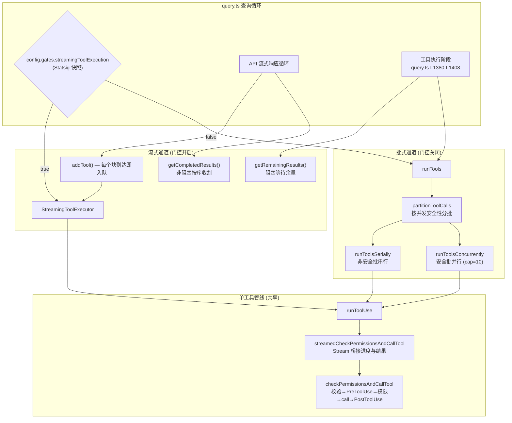
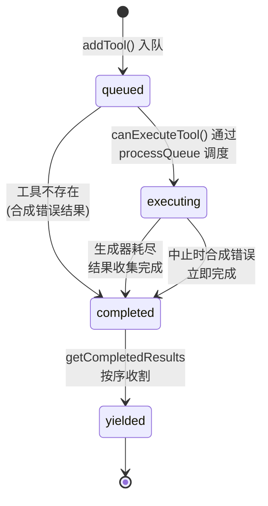
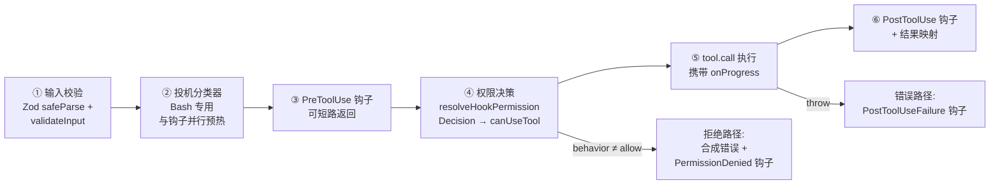

当模型在一次响应中流式吐出多个 `tool_use` 块时，系统必须在"尽早启动执行以压缩端到端延迟"与"维护结果顺序、权限语义与失败隔离"之间取得平衡。本文解析 `services/tools/` 目录下的四文件编排层——`StreamingToolExecutor`（流式执行通道）、`toolOrchestration`（批式执行通道）、`toolExecution`（单工具执行管线）与 `toolHooks`（钩子桥接层）——以及它们在查询循环中的接入方式、AbortController 中止树的级联设计、并发准入规则与 PreToolUse/PostToolUse 钩子如何嵌入权限决策流。本文假设读者已理解 [Tool 接口契约](10-gong-ju-jie-kou-qi-yue-shu-ru-xiao-yan-quan-xian-jue-ce-jin-du-hui-diao-yu-ink-ui-xuan-ran)中定义的工具接口。

## 架构总览：双通道与三层分工

工具执行编排存在**两条互斥的执行通道**，由 Statsig 特性门控 `tengu_streaming_tool_execution2` 在每次 `query()` 调用时快照决定：门控开启时构造 `StreamingToolExecutor`，模型流式响应中的每个 `tool_use` 块在到达时即被 `addTool` 投入执行；门控关闭时走传统路径，待整个响应流结束后由 `runTools` 批量执行。两条通道最终都汇聚到同一单工具执行管线 `runToolUse` → `checkPermissionsAndCallTool`，权限决策、钩子触发、遥测埋点在这条管线中完成，保证了无论哪条通道执行，语义完全一致。

图中实线外的关键细节：流式通道在 API 响应流**尚未结束**时就已经开始执行工具——`addTool` 在流式循环内被逐块调用，`getCompletedResults` 在每条消息处理后同步收割已就绪结果；这使模型还在生成后续文本时，靠前的工具可能已完成执行。批式通道则依赖 `partitionToolCalls` 将工具序列切分为"单个非并发安全工具"与"连续多个并发安全工具"两类批次，分别串行与并行执行。两者的选择通过 `toolUpdates = streamingToolExecutor ? streamingToolExecutor.getRemainingResults() : runTools(...)` 这一三元表达式在工具执行阶段统一消费。Sources: [query](query.ts#L561-L568) [query](query.ts#L1380-L1382) [config](query/config.ts#L15-L46)

## StreamingToolExecutor：流式并发执行器

### 核心数据模型与状态机

`StreamingToolExecutor` 的全部状态由 `TrackedTool[]` 数组承载，每个工具实例携带 `id`、原始 `ToolUseBlock`、来源 `AssistantMessage`、执行状态、并发安全标记、结果缓冲与上下文修改器。状态机为 `queued → executing → completed → yielded` 四态：`queued` 表示已入队等待调度，`executing` 表示 `runToolUse` 生成器正在消费中，`completed` 表示结果已收集完毕但尚未对外产出，`yielded` 是终态，表示结果已按序交付给查询循环。

值得注意的是 `addTool` 对**不存在的工具**的处理：直接以 `completed` 状态入队并附带合成错误消息，绕过整个调度流程，这样后续 `getCompletedResults` 收割时能保证该 `tool_use_id` 仍有对应的 `tool_result`，维护 API 协议要求的一一配对。Sources: [StreamingToolExecutor](services/tools/StreamingToolExecutor.ts#L14-L32) [StreamingToolExecutor](services/tools/StreamingToolExecutor.ts#L76-L102)

### 并发准入：isConcurrencySafe 的门卫逻辑

并发控制的核心是一个极简但严格的准入谓词 `canExecuteTool`：仅当**当前没有任何工具在执行**，或**新工具与所有执行中工具均为并发安全**时，才允许启动执行。这隐含着一条不变式——任何时刻，执行中工具要么全部是并发安全的，要么只有一个非安全工具独占执行。"并发安全"由 `Tool` 接口的 `isConcurrencySafe(input)` 方法按输入实例判定：只读工具如 `FileReadTool` 无条件返回 `true`；而 `BashTool` 委托给 `isReadOnly`，即只有通过只读约束检查的命令（如 `ls`、`git status`）才能并行执行，写操作命令自动降级为独占。`buildTool` 工厂为未实现该方法的所有工具提供 **fail-closed 默认值 `false`**——宁可牺牲并行度也不引入隐式写冲突。

`processQueue` 的调度策略同样体现顺序保守主义：顺序扫描队列，能执行则执行；遇到不能立即执行的**非并发安全**工具即 `break`——因为非安全工具必须保持接收顺序独占执行，不能越过它调度后续工具。并发安全工具则可以跳过等待继续扫描（只被 `continue` 跳过而不阻断扫描）。Sources: [StreamingToolExecutor](services/tools/StreamingToolExecutor.ts#L126-L151) [Tool](Tool.ts#L743-L765) [FileReadTool](tools/FileReadTool/FileReadTool.ts#L373-L378) [BashTool](tools/BashTool/BashTool.tsx#L434-L441)

### 结果顺序保持与进度旁路

工具可以乱序**完成**，但结果必须按接收顺序**产出**。`getCompletedResults` 的实现采用"顺序扫描 + 阻塞屏障"策略：遍历工具数组，跳过已 `yielded` 的，收割 `completed` 的；一旦遇到仍在 `executing` 的**非并发安全**工具即停止——它的结果必须先行产出，后续工具的结果（即使已完成）也不能越过它。并发安全工具之间则无此屏障，谁先完成谁先产出。

与最终结果不同，**进度消息走即时旁路通道**：`executeTool` 消费 `runToolUse` 生成器时，将 `progress` 类型消息推入 `tool.pendingProgress` 而非结果缓冲，并立即触发 `progressAvailableResolve` 唤醒潜在的等待者。`getCompletedResults` 无条件优先倾空所有工具的 `pendingProgress`——不受工具状态机约束。这个设计解耦了两个延迟需求：进度（如 Bash 命令的实时输出）需要亚秒级反映到 UI，而最终结果只需在下一轮 API 请求前就位。`getRemainingResults` 的等待循环用 `Promise.race([...executingPromises, progressPromise])` 同时监听"任一工具完成"与"任一进度到达"两类事件，避免进度到达时白等工具完成。Sources: [StreamingToolExecutor](services/tools/StreamingToolExecutor.ts#L407-L440) [StreamingToolExecutor](services/tools/StreamingToolExecutor.ts#L453-L490) [StreamingToolExecutor](services/tools/StreamingToolExecutor.ts#L366-L377)

## 失败级联与中止树设计

### 三层 AbortController 树

执行器在构造时创建**子控制器树**实现精细化的失败级联：顶层是查询循环的 `toolUseContext.abortController`（用户中断与轮次控制），其子为执行器持有的 `siblingAbortController`（兄弟工具失败扇出），每个工具执行时再派生 `toolAbortController`（单工具作用域）。`createChildAbortController` 的语义是**单向传播**——父中止级联到子，子中止不影响父，且通过 `WeakRef` 双向弱持有避免父级长期驻留已废弃的子控制器（防止内存泄漏与 `MaxListenersExceededWarning`）。

这一树形结构支撑三种互异的中止场景：**用户中断**从根控制器发起，逐层传播到所有执行中工具；**兄弟错误**（Bash 工具失败）调用 `siblingAbortController.abort('sibling_error')`，仅杀死同批兄弟工具而**不会**中止父控制器——查询循环本轮照常结束，模型看到各工具的错误结果后自行决策；**权限对话框拒绝**（`PermissionContext` 的 `cancelAndAbort`）中止 `toolAbortController`，此时子控制器的 abort 监听器检测到该中止非源于兄弟错误、非源于用户中断且执行器未被废弃，会**主动上抛**到根控制器——否则 `ExitPlanMode` 的"清空上下文 + 自动批准"流程会错误地向模型发送 REJECT_MESSAGE 而非中止轮次（代码注释标记的 #21056 回归修复）。Sources: [StreamingToolExecutor](services/tools/StreamingToolExecutor.ts#L44-L62) [StreamingToolExecutor](services/tools/StreamingToolExecutor.ts#L294-L318) [abortController](utils/abortController.ts#L55-L99)

### Bash 专属的兄弟取消语义

一个重要的不对称设计：**只有 Bash 工具的错误会触发兄弟取消**。`executeTool` 检测到错误结果后，若工具名为 `BASH_TOOL_NAME`，则置位 `hasErrored`、记录工具描述并中止 `siblingAbortController`；Read/WebFetch 等工具的失败不级联。注释给出了语义依据：Bash 命令间常存在隐式依赖链（如 `mkdir` 失败后后续命令毫无意义），而读取类工具彼此独立，单个失败不应"核弹式"清除其余结果。被取消的兄弟工具会收到 `Cancelled: parallel tool call <desc> errored` 的合成错误，使模型能理解级联原因。Sources: [StreamingToolExecutor](services/tools/StreamingToolExecutor.ts#L347-L364)

### 中断行为与合成错误矩阵

用户在工具执行期间提交新消息时，是否可中断由工具的 `interruptBehavior()` 决定（默认 `'block'`）：`'cancel'` 类工具被中止并收到 `REJECT_MESSAGE`（UI 显示"用户拒绝"而非"工具错误"）；`'block'` 类工具继续执行，新消息排队等待。`updateInterruptibleState` 在每次工具状态变化时向上下文上报"是否所有执行中工具均可中断"，供 UI 决定是否显示中断提示。`discard()` 方法服务于流式回退场景：API 流失败触发 fallback 重试时，查询循环废弃旧执行器并新建实例，防止携带旧 `tool_use_id` 的孤儿 `tool_result` 在重试响应后泄漏。

| 中止原因 | 触发条件 | 合成错误消息 | UI 呈现 |
|---|---|---|---|
| `user_interrupted` | 根控制器中止（非 interrupt-reason 的 block 工具除外） | `REJECT_MESSAGE` + 记忆修正提示 | "User rejected tool use" |
| `sibling_error` | `hasErrored` 为真（仅 Bash 错误设置） | `Cancelled: parallel tool call <desc> errored` | 标准错误块 |
| `streaming_fallback` | `discarded` 为真（流回退/模型 fallback） | `Streaming fallback - tool execution discarded` | 标准错误块 |

Sources: [StreamingToolExecutor](services/tools/StreamingToolExecutor.ts#L153-L205) [StreamingToolExecutor](services/tools/StreamingToolExecutor.ts#L207-L241) [StreamingToolExecutor](services/tools/StreamingToolExecutor.ts#L254-L260) [Tool](Tool.ts#L405-L416) [query](query.ts#L712-L741) [query](query.ts#L909-L919)

## runToolUse：单工具执行管线

### Stream 桥接：进度与结果的统一迭代

`runToolUse` 是两条通道共享的单工具入口。它先完成工具查找（含**别名回退**——旧会话记录中的废弃名如 `KillShell` 可经 `aliases` 映射到当前工具 `TaskStop`）、检查根级中止信号，然后委托给 `streamedCheckPermissionsAndCallTool`。后者解决一个结构性矛盾：`checkPermissionsAndCallTool` 是返回 `MessageUpdateLazy[]` 数组的 Promise 函数，无法中途产出进度；而编排层需要的是**单一 AsyncIterable** 混合输出进度与最终结果。方案是实例化自研的 `Stream` 队列类——`tool.call` 的 `onProgress` 回调将进度包装为 `progress` 消息立即 `enqueue`，最终结果数组在 Promise resolve 后逐条入队，`.finally` 中标记 `done()`。`Stream` 内部是经典的生产者-消费者模式：队列非空时 `next()` 同步返回，否则挂起等待 `readResolve`，实现单次迭代语义（`started` 标志防止二次消费）。Sources: [toolExecution](services/tools/toolExecution.ts#L337-L490) [toolExecution](services/tools/toolExecution.ts#L492-L570) [stream](utils/stream.ts#L1-L60)

### checkPermissionsAndCallTool 的六阶段流水

管线核心 `checkPermissionsAndCallTool` 按固定顺序执行六个阶段：

**阶段①双重校验**：先用工具的 Zod schema `safeParse` 做结构校验（模型生成的输入类型并不可靠），失败时除格式化 Zod 错误外，还可能附加 `buildSchemaNotSentHint`——当工具搜索（ToolSearch）启用且该工具未被"发现"（schema 未随请求发送）时，提示模型先调用 `ToolSearchTool` 加载 schema 再重试，解决延迟加载工具的参数被错误序列化为字符串的问题。随后调用工具自定义的 `validateInput` 做语义校验（如文件路径存在性）。**阶段②投机预热**：仅对 Bash 工具，在 PreToolUse 钩子与权限对话框准备期间并行启动允许分类器检查，摊平分类器延迟。**阶段⑤之前的输入汇聚**逻辑尤为精细：`backfillObservableInput` 在浅拷贝上回填派生字段（如 `file_path` 路径展开）供钩子与权限系统观察，但 `tool.call` 尽量使用模型原始输入——工具结果字符串逐字嵌入输入路径（如 "File created successfully at: {path}"），改变它会破坏会话转录与 VCR 固定装置的哈希稳定性；只有当钩子/权限系统**主动替换**输入时才收敛到新值。Sources: [toolExecution](services/tools/toolExecution.ts#L599-L680) [toolExecution](services/tools/toolExecution.ts#L734-L752) [toolExecution](services/tools/toolExecution.ts#L775-L793) [toolExecution](services/tools/toolExecution.ts#L1178-L1205)

## 工具钩子：嵌入权限决策的扩展点

### PreToolUse 钩子：七类产出的事件流

`runPreToolUseHooks` 是一个产出**判别联合类型**的异步生成器，将底层 `executePreToolHooks` 的原始结果转译为管线可消费的结构化事件：`message`（附件/进度消息）、`hookPermissionResult`（钩子权限决策）、`hookUpdatedInput`（无决策时的纯输入改写透传）、`preventContinuation`/`stopReason`（阻止后续轮次）、`additionalContext`（附加上下文附件）、`stop`（彻底短路，管线立即返回停止消息）。`blockingError`（退出码 2 或 JSON `decision:"block"`）被映射为 `behavior:'deny'` 的权限结果并标记 `decisionReason.type = 'hook'`，使拒绝路径能区分"用户拒绝"与"钩子拦截"两种来源。钩子执行耗时超过 2 秒记录慢日志，超过 500 毫秒（内部用户）在结果上方内联展示耗时摘要。Sources: [toolHooks](services/tools/toolHooks.ts#L435-L461) [toolHooks](services/tools/toolHooks.ts#L481-L563) [toolExecution](services/tools/toolExecution.ts#L795-L891) [toolExecution](services/tools/toolExecution.ts#L133-L137)

### resolveHookPermissionDecision：钩子与规则的优先级仲裁

钩子的 `allow` 决策**不能绕过** settings.json 中的 deny/ask 规则——这是 `resolveHookPermissionDecision` 封装的核心不变式。仲裁逻辑分四步：钩子 `allow` 时，若工具声明 `requiresUserInteraction` 且钩子未提供 `updatedInput`（钩子本身即用户交互的 headless 包装场景除外），或上下文要求 `requireCanUseTool`，仍走完整 `canUseTool` 流程；否则执行 `checkRuleBasedPermissions` 规则检查——deny 规则**覆盖**钩子允许，ask 规则强制弹窗，无规则命中时钩子允许直接跳过交互提示。钩子 `deny` 直接生效；钩子 `ask` 或无决策则进入常规 `canUseTool` 流程，钩子的 ask 消息作为 `forceDecision` 传入使对话框展示钩子的理由。该函数同时被主查询循环与 REPL 内部工具调用共享，确保两条路径权限语义一致。Sources: [toolHooks](services/tools/toolHooks.ts#L321-L433)

### PostToolUse 与失败路径钩子

工具成功执行后，`runPostToolUseHooks` 逐钩子处理结果：`preventContinuation` 产出 `hook_stopped_continuation` 附件并提前返回；`additionalContexts` 成为 `hook_additional_context` 附件；对 MCP 工具，钩子可通过 `updatedMCPToolOutput` **改写工具输出**。此处存在一个 MCP 与非 MCP 工具的**结果时序差异**：非 MCP 工具的结果消息在 PostToolUse 钩子**之前**产出（`addToolResult` 先行调用），MCP 工具则在钩子**之后**——因为 MCP 输出可被钩子修改，必须等待所有钩子完成才能确定最终输出。错误路径则触发 `runPostToolUseFailureHooks`，携带格式化错误与 `isInterrupt` 标记，产出与成功路径同构的附件类型。权限拒绝路径上还有条件触发的 **PermissionDenied 钩子**：自动模式分类器拒绝时执行，若钩子返回 `{retry: true}`，向模型注入"该命令已获批准，可重试"的元消息，形成人机协同的二次确认回路。Sources: [toolHooks](services/tools/toolHooks.ts#L35-L191) [toolHooks](services/tools/toolHooks.ts#L193-L319) [toolExecution](services/tools/toolExecution.ts#L1397-L1542) [toolExecution](services/tools/toolExecution.ts#L1476-L1542) [toolExecution](services/tools/toolExecution.ts#L1073-L1101)

## 批式通道：runTools 与并发原语

### 分批算法与并发上限

门控关闭时，`runTools` 接管执行。它先经 `partitionToolCalls` 将工具序列**线性切分**为批次：连续的并发安全工具合并为一批，每个非安全工具自成一批。切分逻辑对流式通道的准入谓词做镜像判定（`safeParse` + `isConcurrencySafe`，异常时保守降级为不安全）。安全批经 `runToolsConcurrently` 并行执行——它将每个工具包装为独立生成器，交给 `all` 组合子；非安全批经 `runToolsSerially` 严格串行，且逐个应用 `contextModifier` 更新上下文。安全批的上下文修改器被**缓冲**到批结束后统一应用（按 toolUseID 分组），因为并行执行期间上下文处于竞态窗口。并发上限由环境变量 `CLAUDE_CODE_MAX_TOOL_USE_CONCURRENCY` 控制，默认 **10**。

`all` 组合子是 `Promise.race` 驱动的生成器并发池：先启动不超过上限的初始批次，随后循环 `Promise.race` 等待任一生成器产出——未完成则重新 `next()` 继续参与竞争并立即 yield 其值，完成则从等待池移除并从后备队列补位。这实现了"到达序产出 + 上限并发"的语义。Sources: [toolOrchestration](services/tools/toolOrchestration.ts#L8-L12) [toolOrchestration](services/tools/toolOrchestration.ts#L19-L116) [toolOrchestration](services/tools/toolOrchestration.ts#L118-L177) [generators](utils/generators.ts#L31-L60)

### 双通道语义对比

| 维度 | StreamingToolExecutor（流式） | runTools（批式） |
|---|---|---|
| 启动时机 | `tool_use` 块流式到达即入队执行 | 整个 API 响应结束后启动 |
| 并发模型 | 安全工具即时并行，非安全独占 | 分批：安全批 cap=10 并行，非安全批串行 |
| 结果顺序 | 按接收顺序产出，非安全工具为顺序屏障 | 安全批到达序、非安全批接收序 |
| 兄弟失败 | Bash 错误级联取消兄弟（siblingAbortController） | 无级联，各工具独立失败 |
| 流式回退 | `discard()` + 重建执行器 | 不适用（尚未开始执行） |
| 进度消息 | pendingProgress 旁路即时产出 | 随结果一并产出 |
| 上下文修改器 | 仅非并发工具即时应用 | 安全批缓冲后统一应用 |
| 门控 | `tengu_streaming_tool_execution2`（Statsig） | 默认回退路径 |

两条通道在 `query.ts` 中的汇合点是工具执行阶段的统一消费循环：`for await (const update of toolUpdates)` 逐条 yield 消息、检测 `hook_stopped_continuation` 附件置位续行阻止、将用户型消息规范化后压入 `toolResults` 供下一轮 API 请求使用，并在 `newContext` 出现时更新 `ToolUseContext`。流式通道还有一条特殊的**中止兜底路径**：流结束后若检测到中止信号，必须完整消费 `getRemainingResults()` 使执行器为所有排队/执行中工具生成合成 `tool_result`——否则 `tool_use` 块将缺失配对结果，违反 API 协议。Sources: [query](query.ts#L1380-L1408) [query](query.ts#L1011-L1029) [StreamingToolExecutor](services/tools/StreamingToolExecutor.ts#L34-L39)

## 设计启示与延伸阅读

这一编排层最值得沉淀的模式有三：其一，**按输入实例的并发性判定**而非按工具类型的静态标记，使 Bash 这类双态工具在只读时获得并行度、在写操作时自动独占；其二，**单向子控制器树**将"兄弟失败扇出"、"用户中断全局传播"、"权限拒绝选择性上抛"三种粒度的中止统一在一种数据结构中，WeakRef 弱持有兼顾了内存安全；其三，**钩子决策与规则系统的仲裁层**（`resolveHookPermissionDecision`）确保扩展点不能削弱安全基线——钩子 allow 无法穿透 deny 规则，这是插件生态与权限模型共存的关键契约。

继续深入建议按此路径：[Shell 工具深度解析](13-shell-gong-ju-shen-du-jie-xi-bash-powershell-zhi-xing-ming-ling-jie-xi-yu-ast-fen-xi)详解 `isReadOnly` 背后的命令语义分析与 AST 解析（决定 Bash 并发准入）；[权限模型](19-quan-xian-mo-xing-mo-shi-qie-huan-gui-ze-jie-xi-bash-fen-lei-qi-yu-zi-dong-mo-shi)展开 `canUseTool` 内部的规则匹配、Bash 分类器与自动模式；[Hooks 生命周期钩子](24-hooks-sheng-ming-zhou-qi-gou-zi-pei-zhi-mo-shi-shi-jian-zhu-ce-yu-http-agent-prompt-zhi-xing-qi)覆盖 `executePreToolHooks` 之下的 HTTP/Agent/Prompt 三种执行器；而 [单轮查询循环](7-dan-lun-cha-xun-xun-huan-liu-shi-xiang-ying-chu-li-gong-ju-diao-yong-yu-cuo-wu-hui-fu)则从更高视角展示本层与流式响应处理、错误恢复的衔接。Sources: [query](query.ts#L1366-L1378) [query](query.ts#L999-L1010)