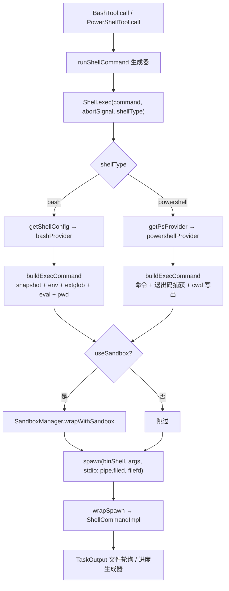

Shell 工具是本代码库中唯一直接与操作系统进程交互的工具家族：BashTool 与 PowerShellTool 负责执行命令，而它们身后的命令组装、AST 解析、语义校验三层基础设施，构成了整个权限模型（参见 [权限模型](19-quan-xian-mo-xing-mo-shi-qie-huan-gui-ze-jie-xi-bash-fen-lei-qi-yu-zi-dong-mo-shi) 与 [命令安全分析](20-ming-ling-an-quan-fen-xi-wei-xian-ming-ling-jian-ce-zhi-du-xiao-yan-sha-xiang-yu-lu-jing-bao-hu)）赖以决策的信号源。本页将沿"工具定义 → 执行管线 → 进程生命周期 → 命令解析 → 权限集成"的主线，逐层剖析这条链路。

Sources: [BashTool.tsx](tools/BashTool/BashTool.tsx#L420-L541), [PowerShellTool.tsx](tools/PowerShellTool/PowerShellTool.tsx#L272-L378)

## 双 Shell 架构：Tool 定义与平台路由

系统在 Tool 接口层面维护两种 Shell 类型：`bash` 与 `powershell`，二者通过统一的 `ShellType` 联合类型抽象（见 `utils/shell/shellProvider.ts` 的 `SHELL_TYPES` 常量）。BashTool 是跨平台的默认工具；PowerShellTool 则受运行时门控——仅在 Windows 平台启用，且默认策略为"内部用户默认开启（可 `CLAUDE_CODE_USE_POWERSHELL_TOOL=0` 退出），外部用户默认关闭（需显式 `=1` 开启）"。这个门控函数被工具注册表、`!` 命令路由和技能 frontmatter 路由三处共用，保证所有能触达 `PowerShellTool.call()` 的路径行为一致。

两个工具都通过 `buildTool()` 构造，实现的关键钩子高度对称：`isReadOnly`（并发安全判定）、`isSearchOrReadCommand`（UI 折叠分类）、`validateInput`（入口校验，如拦截裸 `sleep N` 提示改用 Monitor 工具）、`checkPermissions`（委托给各自的 permissions 模块）、`call`（异步生成器驱动的执行主流程）。值得注意的是 PowerShellTool 的 `isReadOnly` 存在已知局限：由于 `Tool.isReadOnly` 是同步接口而 PowerShell AST 解析是异步的，此处的只读判定仅基于同步正则启发式，真正的只读自动放行发生在异步的 `powershellToolHasPermission` 内部。

两个工具的输入 schema 都刻意从模型可见 schema 中剔除内部字段：BashTool 的 `_simulatedSedEdit` 是权限对话框预览 sed 编辑后注入的预计算结果，若暴露给模型，模型可以用"无害命令 + 任意文件写入"的组合绕过权限校验与沙箱，因此该字段仅在类型层面存在。

Sources: [shellProvider.ts](utils/shell/shellProvider.ts#L1-L33), [shellToolUtils.ts](utils/shell/shellToolUtils.ts#L8-L23), [BashTool.tsx](tools/BashTool/BashTool.tsx#L249-L264), [PowerShellTool.tsx](tools/PowerShellTool/PowerShellTool.tsx#L300-L316), [tools.ts](tools.ts#L150-L154)

## 执行管线：从 tool call 到子进程 spawn

整条执行链的核心枢纽是 `utils/Shell.ts` 的 `exec()` 函数。它接收命令字符串、中止信号、Shell 类型和执行选项（超时、进度回调、沙箱开关、自动后台化开关），然后按固定顺序完成七步工作：

1. **Provider 解析**：通过 `resolveProvider` 表（`bash → getShellConfig`、`powershell → getPsProvider`）获取 memoize 过的 ShellProvider；
2. **命令组装**：调用 `provider.buildExecCommand()`，产出包含 shell 初始化逻辑的完整命令串和工作目录跟踪文件路径；
3. **CWD 自愈**：`realpath()` 探测当前目录是否仍存在（命令可能删除了自己的 CWD），不存在则回退到会话初始目录；
4. **沙箱包装**：若启用沙箱，通过 `SandboxManager.wrapWithSandbox` 重写命令串并创建 `0o700` 权限的沙箱临时目录；
5. **输出文件准备**：非管道模式下以 `O_WRONLY|O_CREAT|O_APPEND|O_NOFOLLOW` 打开 TaskOutput 文件句柄（`O_NOFOLLOW` 防御沙箱进程的符号链接攻击；Windows 上刻意用 `'w'` 模式，因为 MSYS2/Cygwin 会探测继承句柄的写权限位，`'a'` 模式剥离 `FILE_WRITE_DATA` 后会导致 Git Bash 静默丢弃全部输出）；
6. **子进程 spawn**：`detached: true`（bash）或 `false`（PowerShell），注入 `SHELL`、`GIT_EDITOR: 'true'`、`CLAUDECODE: '1'` 等环境变量，stdout/stderr 直接指向输出文件 fd（零 JS 参与的高吞吐路径）；
7. **包装**：`wrapSpawn` 把 ChildProcess 包成 `ShellCommand` 对象并接管超时、中止、tree-kill。

Bash 的 shell 发现逻辑（`findSuitableShell`）优先级为：`CLAUDE_CODE_SHELL` 显式覆盖 → `SHELL` 环境变量（仅 bash/zsh）→ `which` 探测 + 固定路径列表，且按用户偏好排序 bash/zsh；找不到任何可用 shell 时直接抛错。



Sources: [Shell.ts](utils/Shell.ts#L181-L345), [Shell.ts](utils/Shell.ts#L73-L159), [bashPermissions.ts](tools/BashTool/bashPermissions.ts#L1829-L1843)

## Bash Provider：命令组装流水线

`createBashShellProvider` 返回的 `buildExecCommand()` 是理解 bash 执行语义的关键——每条用户命令都不是裸执行的，而是被组装成一条 `&&` 链：

```
source <snapshot文件> || true
&& <会话环境脚本>
&& shopt -u extglob 2>/dev/null || true
&& eval <引号包装后的命令>
&& pwd -P >| <cwd跟踪文件>
```

每个环节都有明确动机。**Snapshot 注入**：首次调用时通过 `createAndSaveSnapshot(shellPath)` 捕获一个登录 shell 的完整环境（含 PATH、别名、函数），后续命令 `source` 该快照即可复现环境，同时 `getSpawnArgs` 会因快照存在而省略 `-l` 登录 shell 标志，节省每次 spawn 的 profile 加载开销；若快照文件中途消失（tmpdir 清理），`access()` 探测会触发回退到登录 shell 模式。**extglob 禁用**是安全措施：bash 扩展 glob 可被恶意文件名利用，在安全校验之后展开改变命令语义。**eval 包装**解决别名时序问题——`source` 别名文件的同一命令行不会展开别名，因为 shell 在执行前已解析完整行，eval 强制第二次解析使别名生效。**pwd -P 写出**则把物理路径写入临时文件，供外层读取以跟踪 `cd` 带来的目录变化（`preventCwdChanges` 在子代理场景强制禁止）。

命令在进入 eval 前还会经历防御性重写：`rewriteWindowsNullRedirect` 把模型偶尔输出的 CMD 风格 `2>nul` 改写为 `2>/dev/null`（POSIX bash 中 `nul` 是保留设备名，会创建同名文件破坏 git）；含管道的命令会把 stdin 重定向移位到第一条子命令（`rearrangePipeCommand`），避免 `eval 'rg foo | wc -l' < /dev/null` 变形后 wc 读空导致 rg 永久阻塞在 spawn 的 stdin 管道上。`getEnvironmentOverrides` 还负责 tmux socket 隔离（覆盖 `TMUX` 指向 Claude 私有 socket，惰性初始化）和沙箱 `TMPDIR`/`TMPPREFIX` 注入。

Sources: [bashProvider.ts](utils/shell/bashProvider.ts#L39-L79), [bashProvider.ts](utils/shell/bashProvider.ts#L116-L198), [bashProvider.ts](utils/shell/bashProvider.ts#L200-L253), [ShellSnapshot.ts](utils/bash/ShellSnapshot.ts#L24-L59)

## PowerShell Provider：退出码语义与编码传输

PowerShell provider 面对两个 bash 不存在的问题，其解法颇具工程性。第一是**退出码语义**：PowerShell 5.1 中，原生命令向被 PS 重定向的 stderr 写入（如 `git push 2>&1`）会把 `$?` 置为 `$false`，即使 exe 实际返回 0。因此 provider 在命令尾部追加的 cwd 跟踪脚本采用 `$LASTEXITCODE` 优先策略——`$_ec = if ($null -ne $LASTEXITCODE) { $LASTEXITCODE } elseif ($?) { 0 } else { 1 }`，即"跑过原生 exe 就用其退出码，否则回退到 cmdlet 的 `$?`"，再 `exit $_ec`。注释中诚实记录了此取舍：`native-ok; cmdlet-fail` 组合现在会返回 0（旧逻辑返回 1），但比 git/npm/curl 的 stderr 误报罕见得多。

第二是**沙箱下的引号安全**：沙箱运行时会在 provider 产出的命令串外再做一次 POSIX `shellquote.quote()`，任何含单引号的字符串触发双引号模式后 `!` 会被转义为 `\!`，pwsh 解析即报错。解法是把整个 PowerShell 命令编码为 UTF-16LE Base64 通过 `-EncodedCommand` 传递——Base64 字符集 `[A-Za-z0-9+/=]` 不含任何可被引号层破坏的字符。沙箱路径下最终进程树是 `bwrap ... /bin/sh -c 'pwsh -NoProfile -NonInteractive -EncodedCommand <b64>'`，非沙箱路径则直接由 `buildPowerShellArgs` 提供 `['-NoProfile', '-NonInteractive', '-Command', cmd]` 标志集（该函数与 hooks 的 spawn 路径共享，保证标志集单一来源）。

两个 provider 的职责对比如下：

| 维度 | bashProvider | powershellProvider |
|---|---|---|
| detached | `true`（进程组隔离，支持 tree-kill） | `false` |
| 环境复现 | source shell 快照 + 会话环境脚本 | 无快照（`-NoProfile` 绕过 profile） |
| 环境加固 | `shopt -u extglob` / `setopt NO_EXTENDED_GLOB` | — |
| 命令包装 | `eval <quoted>` | 命令 + 退出码捕获 + cwd 写出 |
| cwd 跟踪 | `pwd -P >\| file`（链尾） | `(Get-Location).Path \| Out-File` |
| 沙箱兼容 | 命令串直接被沙箱包裹 | 预编码为 `-EncodedCommand` Base64 |
| 特殊 env 覆盖 | TMUX 隔离、TMPDIR、TMPPREFIX | TMPDIR（会话 env 变量先行，沙箱值优先） |

Sources: [powershellProvider.ts](utils/shell/powershellProvider.ts#L11-L101), [powershellProvider.ts](utils/shell/powershellProvider.ts#L103-L124)

## 进程生命周期：ShellCommand 与输出管理

`utils/ShellCommand.ts` 中的 `ShellCommandImpl` 是进程生命周期的统一管理者，存在**文件模式**与**管道模式**两种输出路径：bash 命令走文件模式，stdout/stderr 直接指向输出文件 fd，子进程流为 null，零 JS 介入，进度由轮询输出文件尾部提取；hooks 等需要实时检测的场景走管道模式，`StreamWrapper` 把流数据喂给 `TaskOutput` 的内存缓冲。类型上 `ShellCommand` 暴露 `background(taskId)`、`kill()`、`status`（running/backgrounded/completed/killed）、`cleanup()` 与 `result: Promise<ExecResult>`。

生命周期管理有几个精妙细节。**中止语义区分**：abort 信号的 `reason === 'interrupt'`（用户提交新消息）时故意不 kill，让调用方决定是否后台化，模型因此能看到部分输出。**超时自动后台化**：`shouldAutoBackground` 开启时超时触发 `onTimeout` 回调而非 SIGTERM。**尺寸看门狗**：后台任务的输出直接写文件、无 JS 参与，一个卡死的追加循环可能填满磁盘，因此每 5 秒轮询文件大小，超限即杀。**退出码归一**：null 退出码时 SIGTERM 映射为 144，与 SIGKILL=137、SIGTERM=143 常量配合。

BashTool 的 `call()` 把这一切包装成异步生成器：`runShellCommand` 每次 yield 一个进度事件（输出增量、耗时、行数字节数），工具层通过 `onProgress` 回调转发给 UI（`BashProgress` 事件流）；生成器 return 的 `ExecResult` 则进入结果处理。前台命令超过 2 秒才显示进度（`PROGRESS_THRESHOLD_MS`）；Kairos/assistant 模式下主代理的阻塞命令 15 秒后自动后台化（`ASSISTANT_BLOCKING_BUDGET_MS`）；显式 `run_in_background: true` 则直接 spawn 后台任务并立即返回任务 ID。大输出（超过内联上限）会被硬链接/复制到 tool-results 目录（上限 64 MB 截断），模型收到的是 `<persisted-output>` 包装的预览 + 文件路径。

Sources: [ShellCommand.ts](utils/ShellCommand.ts#L13-L47), [ShellCommand.ts](utils/ShellCommand.ts#L106-L200), [BashTool.tsx](tools/BashTool/BashTool.tsx#L624-L723), [BashTool.tsx](tools/BashTool/BashTool.tsx#L732-L753), [BashTool.tsx](tools/BashTool/BashTool.tsx#L900-L1001)

## 命令解析层：tree-sitter AST 与 fail-closed 设计

这是整条链路中安全密度最高的模块。`utils/bash/ast.ts` 的开篇注释阐明了设计哲学：**用显式节点类型白名单遍历 tree-sitter-bash 语法树，任何未白名单化的节点类型导致整条命令被归类为 `too-complex`，走正常权限提示流程**。核心属性是 fail-closed——绝不解释自己不理解的结构，无法产出可信 argv 时就让用户裁决。该模块明确声明自己不是沙箱，只回答一个问题："能否为字符串中每条简单命令产出可信的 `argv[]`？"

解析入口 `parseForSecurity` 委托给 `parser.ts` 的 `parseCommandRaw`，后者受 Bun 编译期特性门控（`TREE_SITTER_BASH` / `TREE_SITTER_BASH_SHADOW`，详见 [构建体系与特性门控](4-gou-jian-ti-xi-yu-te-xing-men-kong-bun-bian-yi-qi-te-xing-biao-ji-yu-si-dai-ma-xiao-chu)），命令超过 10000 字符直接返回 null。三态返回值是关键区分：`Node`（成功）、`null`（模块未加载/特性关闭/超长）、`PARSE_ABORTED` 哨兵（模块已加载但解析中止——对抗性输入如 `(( a[0][0]... ))` 约 2800 层下标可触发 50ms 解析超时或 50000 节点预算）。调用方必须把 `PARSE_ABORTED` 视为 fail-closed 的 too-complex 而非路由到 legacy 路径，否则 legacy 路径缺少 `EVAL_LIKE_BUILTINS` 检查会让 `trap`、`enable`、`hash` 漏网。

AST 产出三类结构化结果：`SimpleCommand[]`（argv 已解引号、envVars 前缀赋值、redirects 列表、源文本 span）、`too-complex`（附原因和节点类型）、`parse-unavailable`。树遍历只递归穿过四种**结构节点**（`program`/`list`/`pipeline`/`redirected_statement`），跳过七种**分隔符叶节点**（`&&`/`||`/`|`/`;`/`&`/`|&`/换行）。`$()` 命令替换被递归提取并以 `__CMDSUB_OUTPUT__` 占位符替代外层 argv（内层命令单独过权限规则），被前置 `VAR=val` 赋值追踪过的 `$VAR` 引用替换为 `__TRACKED_VAR__`——占位符防御是纵深式的：`containsAnyPlaceholder` 用子串检查捕获 `VAR="prefix$(cmd)"` 这类复合值，甚至防住用户手打字面占位符字符串的碰撞。

**预检查层**在 tree-sitter 之前运行，拦截已知的解析器差异：控制字符（CR 是 tree-sitter 的词分隔符但 bash IFS 不含 CR）、Unicode 不可见空白（NBSP、零宽空格、BOM——终端看不见但 bash 当字面字符）、空白前的反斜杠（tree-sitter 保留反斜杠而 bash 拼接词）、zsh 动态命名目录 `~[name]`（触发可执行任意代码的 hook）、zsh 等号扩展 `=cmd`（等价 `$(which cmd)`，tree-sitter 视为字面词导致 `Bash(curl:*)` 拒绝规则失效）、花括号+引号混淆结构（`{a'}',b}`）。花括号掩码函数 `maskBracesInQuotedContexts` 用逐字符 bash 引号状态机而非朴素正则——朴素正则对 `echo "it's" {a'}',b}` 会从 `it's` 的撇号错配到 `{a'}`，漏掉未引用的 `{` 造成假阴性。

Sources: [ast.ts](utils/bash/ast.ts#L1-L45), [ast.ts](utils/bash/ast.ts#L47-L96), [ast.ts](utils/bash/ast.ts#L236-L314), [ast.ts](utils/bash/ast.ts#L331-L371), [ast.ts](utils/bash/ast.ts#L375-L412), [parser.ts](utils/bash/parser.ts#L56-L120)

## 语义校验层：checkSemantics 与包装命令剥离

AST 给出干净的 argv 后，`checkSemantics` 执行"tokenize 得很好但按名字/参数内容很危险"的检查。其第一职责是**包装命令剥离**——`nohup`、`time`、`timeout`、`nice`、`env`、`stdbuf` 这类包装器会遮挡 argv[0]，必须剥到被包装的真实命令再检查（`nohup eval "..."` 要按 eval 审查）。每个包装器的处理都体现 fail-closed 原则的演化史：

- **timeout**：逐一识别已知的无值长标志（`--foreground` 等）、`=` 融合值标志、`-k DUR` 分离值标志、融合短标志（`-k5`、`-sTERM`），任何未知标志直接拒绝（"cannot be statically analyzed"）；时长参数不匹配 `^\d+(\.\d+)?[smhd]?$` 也拒绝——SAST 审查发现 GNU timeout 经 libc strtod 接受 `.5`、`5e-1`、`inf` 等形态，旧代码在此 fail-OPEN，`timeout .5 eval "id"` 配合 `Bash(timeout:*)` 规则会让 eval 逃过检查；
- **nice**：`nice $((0-5)) jq ...` 的算术展开会以 `$((0-5))` 原文出现在 argv，bash 展开为 `-5`（旧式语法）后执行 jq——检查命令名会看到 `$((0-5))` 而跳过 jq 的 system() 检查，因此含展开的参数一律拒绝；
- **env**：只放行 `VAR=val` 赋值和 `-i`/`-0`/`-v`/`-u NAME`，`-S`（argv 拆分的迷你 shell）、`-C`/`-P`（改 cwd/PATH）及其他未知标志整条拒绝；
- **stdbuf**：旧代码只剥一个标志，`stdbuf --output 0 eval` 剥完剩 `['0','eval']`，命令名变成 `0` 藏住 eval——现在迭代所有已知形态并 fail-closed。

剥离完成后是一组按名字拒绝的检查：`eval` 类内建、`/proc/*/environ` 读取（用 `.*` 而非 `[^/]*`，因为 procfs 会解析 `..`）、argv 元素中的"换行+井号"（下游按行重 tokenize 时会把后续参数当注释藏掉）、裸下标内建（`read`/`unset` 的 `[` 处理及 `-p/-d/-n/-N/-t/-u/-i` 数据标志的下一参数跳过）。

Sources: [ast.ts](utils/bash/ast.ts#L2206-L2360), [ast.ts](utils/bash/ast.ts#L2182-L2204)

## 权限决策集成：bashToolHasPermission 决策链

`bashToolHasPermission` 是把上述解析能力接入权限引擎的汇聚点，决策链按严格顺序展开（denial 优先级始终高于降级）：

1. **AST 解析**：先做环境禁用检查（`CLAUDE_CODE_DISABLE_COMMAND_INJECTION_CHECK`）与 GrowthBook 影子模式 killswitch，然后 `parseCommandRaw` 一次解析、`parseForSecurityFromAst` 消费；
2. **too-complex 分支**：先跑精确/前缀/wildcard 拒绝规则（有 `Bash(xxx:*)` deny 的用户应看到命令被拒而非降级为 ask），无拒绝命中才返回 `ask`，附带 `nodeTypeId` 遥测与 pendingClassifierCheck；
3. **simple 分支**：`checkSemantics` 失败走 `checkSemanticsDeny`（同样的拒绝规则优先逻辑），成功则把 tokenized 子命令、redirects、commands 暂存供下游（规则匹配、路径提取、cd 检测仍在字符串 span 上工作——注释承认下游重 tokenize 有已知 bug，但 checkSemantics 已拦截含换行的 argv，这些 bug 无法在此触发）；
4. **legacy 回退**：仅在 `parse-unavailable` 时跑 shell-quote 预检（`tryParseShellCommand`），解析失败直接 ask；
5. **沙箱自动放行** → **精确匹配** → **Haiku 分类器**（deny/ask 描述并行分类，auto 模式下跳过）→ **操作符检查**（`checkCommandOperatorPermissions` 递归处理 `&&`/`||`/`|`/重定向，管道段被剥离重定向单独检查后，若整体放行还要对原始命令补查重定向目标中的反引号/`$()`——除非 AST 子命令非空，因为那种结构在 tree-sitter 层早就是 too-complex 了）。

影子模式（`TREE_SITTER_BASH_SHADOW`）设计为纯观察：记录 tree-sitter 与 legacy `splitCommand` 的子命令分歧、too-complex 率、语义失败率到 `tengu_tree_sitter_shadow` 事件，然后强制 `parse-unavailable` 让 legacy 路径保持权威。防御工程上有两个硬约束被注释铭记：Bun 的 `feature()` 求值器有每函数复杂度预算，`import { X as Y }` 别名会把它推过阈值导致 `feature('BASH_CLASSIFIER')` 无法被证明为常量、三元表达式被静默求值为 false，所以别名必须用顶层 const 重绑定；复合命令拆分子命令数被限制在 50（`MAX_SUBCOMMANDS_FOR_SECURITY_CHECK`），因为拆分可能指数增长，每个子命令再跑 tree-sitter 解析 + 约 20 个校验器 + logEvent 会饿死事件循环造成 REPL 冻结。

Sources: [bashPermissions.ts](tools/BashTool/bashPermissions.ts#L81-L110), [bashPermissions.ts](tools/BashTool/bashPermissions.ts#L1663-L1810), [bashPermissions.ts](tools/BashTool/bashPermissions.ts#L1811-L1971), [bashPermissions.ts](tools/BashTool/bashPermissions.ts#L1973-L2009)

## Legacy 解析层与命令规格系统

tree-sitter 之外仍保留一条基于 shell-quote 的 legacy 路径（`utils/bash/commands.ts`）。`splitCommandWithOperators` 拆分复合命令时使用带随机盐的占位符防注入——恶意命令若能预知 `__SINGLE_QUOTE__` 字面量就能伪造参数注入，8 字节随机盐（16 hex 字符）使预测不可行。`isStaticRedirectTarget` 判定重定向目标是否为可安全剥离的静态路径，拒绝一切含空白、引号、`$`、反引号、glob 字符、`~`、`(`、`&`、`!`、`=`、`#` 前缀的目标——注释记录了一个具体差异硬化案例：`cat > out /etc/passwd` 经相邻字符串合并后目标是 `out /etc/passwd`，接受这个 blob 会让 pathValidation 看不到路径。

命令前缀提取（用于权限建议 `Bash(git push:*)` 这类规则）由 `utils/bash/prefix.ts` 的 `getCommandPrefixStatic` 完成，依赖 `utils/bash/registry.ts` 的规格系统：先查内置规格（pyright/timeout/sleep/alias/nohup/time/srun 七个手写 spec），未命中则动态加载 `@withfig/autocomplete` 的 Fig 规格（`isCommand` 标志标记包装命令参数位，递归深度限制 10、包装层数限制 2）。`utils/bash/treeSitterAnalysis.ts` 则提供面向安全校验器的结构化提取：单遍树遍历融合收集引号 span（原先 5 次独立遍历，融合后削减约 5 倍遍历成本），产出引号上下文、复合结构（操作符/管道/子 shell/命令组）、危险模式（命令替换/进程替换/参数展开/heredoc/注释）三类信号。

Sources: [commands.ts](utils/bash/commands.ts#L12-L81), [commands.ts](utils/bash/commands.ts#L85-L90), [prefix.ts](utils/bash/prefix.ts#L28-L70), [registry.ts](utils/bash/registry.ts#L30-L53), [specs/index.ts](utils/bash/specs/index.ts#L10-L19), [treeSitterAnalysis.ts](utils/bash/treeSitterAnalysis.ts#L21-L100)

## PowerShell 解析服务：进程外 AST 与缓存策略

PowerShell 没有等价的 tree-sitter 方案，解析走**进程外 pwsh 服务**：`utils/powershell/parser.ts` 构造一段 PowerShell 脚本调用 `System.Management.Automation.Language` 的 `ParseInput`，脚本经 UTF-16LE Base64 通过 `-NoProfile -NonInteractive -NoLogo -EncodedCommand` 传给 pwsh 子进程（execa spawn），stdout 的 JSON 被反序列化为映射 SMA AST 类型的结构（`CommandAst`/`PipelineChainAst`/`ScriptBlock`/`ExpandableString` 等）。工程细节处处是实战教训：命令长度按 **UTF-8 字节数**而非 `.length` 判定（CJK 字符 1 code unit 但 3 字节，低估 3 倍会导致 Windows argv 溢出、CreateProcess 失败、deny 规则退化）；超时做一次重试（高负载 CI 上 pwsh spawn + .NET JIT 偶超 5 秒，旧代码把 execa 杀进程后的 undefined exitCode 误报为 "exit code 1"）；LRU 记忆化缓存解析结果，但 `PwshSpawnError`/`PwshTimeout`/`EmptyOutput`/`InvalidJson` 等瞬态失败在 resolve 后即从缓存逐出以便重试，确定性失败（超长、语法错误）则保留缓存。危险 cmdlet 常量集中在 `dangerousCmdlets.ts`，按风险分类（FilePath 执行、脚本块执行、模块加载、网络、别名劫持、WMI/CIM 进程派生），被权限引擎校验器与 UI 建议门控双消费以避免列表漂移。

Sources: [powershell/parser.ts](utils/powershell/parser.ts#L1140-L1225), [powershell/parser.ts](utils/powershell/parser.ts#L1263-L1290), [dangerousCmdlets.ts](utils/powershell/dangerousCmdlets.ts#L17-L110)

## 语义解释与 UI 折叠分类

执行完成后，`interpretCommandResult`（`commandSemantics.ts`）对退出码做**按命令的语义解释**：grep/rg 退出 1 表示"无匹配"而非错误（`isError: exitCode >= 2`），find 退出 1 表示"部分目录不可访问"，diff 退出 1 表示"文件有差异"，test/`[` 退出 1 表示"条件为假"——这些消息直接回传给模型，避免模型把正常的"无匹配"当失败重试。UI 侧的折叠分类则由两组命令集合驱动：BashTool 维护搜索类（grep/rg/find/which 等）、读取类（cat/head/tail/jq/awk/sort 等）、列表类（ls/tree/du）与语义中性类（echo/printf/true/false/`:`）集合，`isSearchOrReadBashCommand` 要求管道/复合命令的所有段都属于搜索/读取/中性才折叠（`ls dir && echo "---" && ls dir2` 仍是只读），并处理 `||` 后中性命令作为回退段的情形；`isSilentBashCommand` 对 mv/cp/rm/mkdir 等静默命令族返回 `noOutputExpected`，UI 显示 "Done" 而非误导性的 "(No output)"。PowerShellTool 维护对应的 cmdlet 规范名集合（select-string/get-content/write-output 等）。

Sources: [commandSemantics.ts](tools/BashTool/commandSemantics.ts#L10-L99), [BashTool.tsx](tools/BashTool/BashTool.tsx#L59-L81), [BashTool.tsx](tools/BashTool/BashTool.tsx#L83-L217), [PowerShellTool.tsx](tools/PowerShellTool/PowerShellTool.tsx#L50-L120)

## 辅助子系统：快照、搜索工具注入与默认 Shell

Shell 快照（`ShellSnapshot.ts`）除捕获环境外还承担**嵌入式搜索工具注入**：ant 原生构建把 rg/bfs/ugrep 嵌入 bun 二进制，通过 ARGV0 分发技巧暴露——`createArgv0ShellFunction` 生成的 shell 函数按运行环境分派（zsh 用 `ARGV0=` 环境变量、bash 用 `exec -a`、Windows git bash 因 `exec -a` 不可用也用 ARGV0），使 `rg`/`find`/`grep` 命令透明地落到嵌入式二进制上，语义对齐原 GlobTool/GrepTool（如给 bfs 注入 `-regextype findutils-default` 以匹配 GNU find 的 emacs 正则风格）。输入框 `!` 命令的默认 shell 由 `resolveDefaultShell` 决定：`settings.defaultShell` 缺省即 `bash`——设计文档明确**不**因 Windows 就自动翻转为 PowerShell，那会破坏既有用户的 bash hooks。

Sources: [ShellSnapshot.ts](utils/bash/ShellSnapshot.ts#L24-L130), [resolveDefaultShell.ts](utils/shell/resolveDefaultShell.ts#L12-L15)

## 小结

Shell 工具族的架构可以概括为一个**分层信任模型**：执行层（Shell.ts / providers）假设命令可能危险，用快照复现、extglob 禁用、`O_NOFOLLOW`、tree-kill、尺寸看门狗做被动防御；解析层（ast.ts / powershell/parser.ts）不试图理解一切，只对能完整静态分析的结构给出可信 argv，其余全部 fail-closed；决策层（bashPermissions.ts）把解析结果与规则引擎、分类器、沙箱策略编织成确定性优先级链。贯穿始终的设计语言是：**每一个绕过路径都会在注释里留下自己的 CVE 编号或审查编号**——从 `2>nul` 重写（#4928）到 timeout 时长 fail-open（PR #21503），这份"考古地层"本身就是该模块安全演化的最佳文档。

继续阅读建议：权限规则的解析与分类器细节见 [权限模型：模式切换、规则解析、Bash 分类器与自动模式](19-quan-xian-mo-xing-mo-shi-qie-huan-gui-ze-jie-xi-bash-fen-lei-qi-yu-zi-dong-mo-shi)；危险命令检测与沙箱决策见 [命令安全分析：危险命令检测、只读校验、沙箱与路径保护](20-ming-ling-an-quan-fen-xi-wei-xian-ming-ling-jian-ce-zhi-du-xiao-yan-sha-xiang-yu-lu-jing-bao-hu)；后台任务框架见 [子代理与后台任务框架：AgentTool、LocalAgentTask 与任务状态监控](25-zi-dai-li-yu-hou-tai-ren-wu-kuang-jia-agenttool-localagenttask-yu-ren-wu-zhuang-tai-jian-kong)。