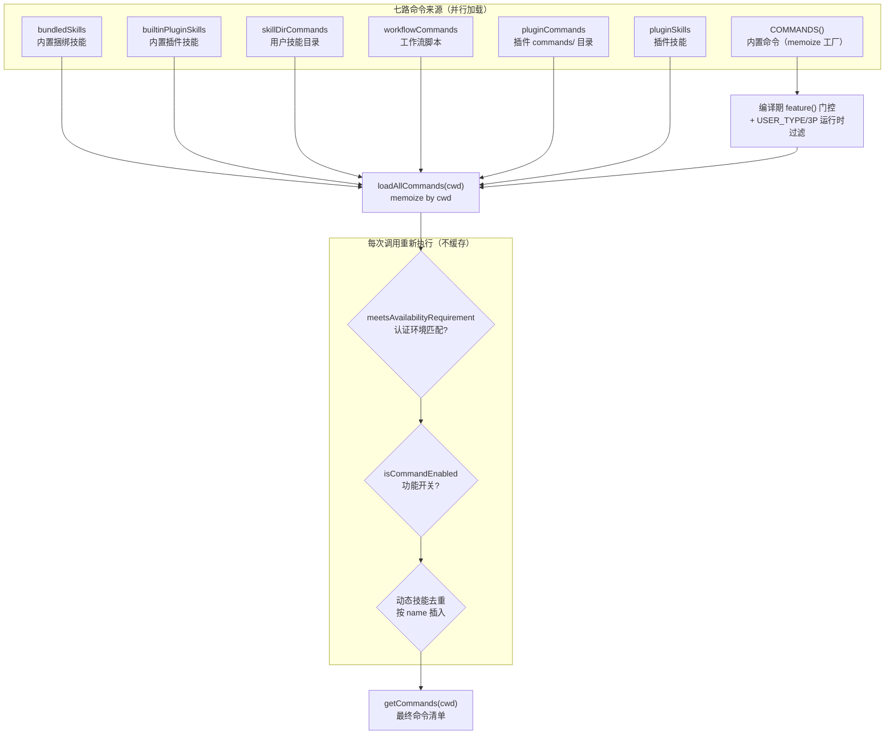
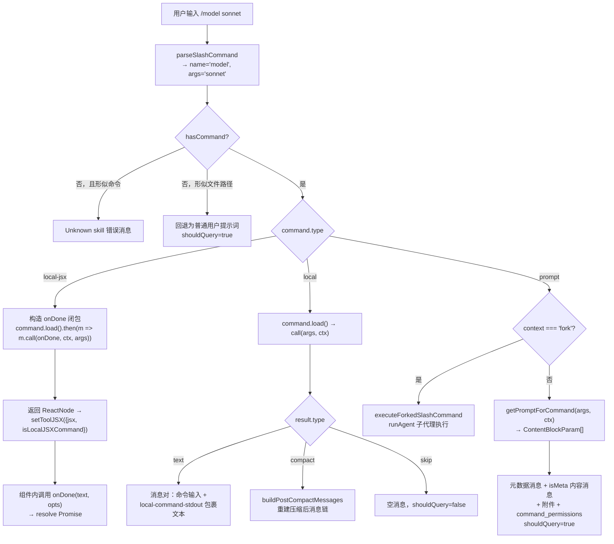

斜杠命令（slash command）是 CLI 中以 `/` 前缀触发的用户指令入口，它将"用户敲入的一行文本"路由到三种完全不同的执行形态：**展开为提示词发送给模型**（prompt 型）、**本地函数直接执行并返回文本**（local 型）、**渲染一个完整的 Ink/React 交互界面**（local-jsx 型）。本文自顶向下剖析这条链路：命令接口契约 → 注册表聚合 → 输入解析 → 三路分发 → JSX 渲染协议，并覆盖懒加载、特性门控、无头模式过滤与 MCP 命名空间等横切机制。理解本文需要读者对 TypeScript 判别联合（discriminated union）和 React 组件模型有基本认知。

## 命令接口契约：一个判别联合，三种执行形态

整个命令体系的类型基石位于 `types/command.ts`。核心定义是 `Command = CommandBase & (PromptCommand | LocalCommand | LocalJSXCommand)`——所有命令共享一份元数据基座 `CommandBase`，再通过 `type` 字段判别为三种互斥的执行形态。`CommandBase` 携带的元数据远不止 `name` 与 `description`：`aliases` 支持别名调用，`argumentHint` 在输入建议中提示参数格式，`isEnabled()`/`isHidden()` 控制动态可见性，`availability` 声明命令仅对特定认证环境（claude.ai 订阅者或 Console API 用户）开放，`immediate` 标记命令可在查询运行中立即执行而不排队，`isSensitive` 则会让参数在会话历史中被脱敏为 `***`。值得注意的是 `userFacingName?: () => string` 是一个函数而非字符串——因为插件命令的显示名可能需要在运行时剥离插件前缀，由辅助函数 `getCommandName()` 统一解析回退逻辑。[types/command.ts](types/command.ts#L175-L217)

三种执行形态的差异体现在各自的调用签名上。**PromptCommand** 通过 `getPromptForCommand(args, context)` 异步返回 `ContentBlockParam[]`，即命令的"内容"会在调用时动态生成为发给模型的消息块；它还携带 `allowedTools`（临时工具授权）、`model`（临时模型覆盖）、`context: 'inline' | 'fork'`（内联展开还是派生子代理）等模型侧配置。**LocalCommand** 与 **LocalJSXCommand** 则都暴露一个 `load()` 函数，返回真正的 `call` 实现——这是懒加载的关键设计，将在下文展开。local 型的 `call(args, context)` 返回 `LocalCommandResult`（`text` / `compact` / `skip` 三种结果），而 local-jsx 型的 `call(onDone, context, args)` 返回 `React.ReactNode`，通过回调 `onDone` 声明命令何时结束、结果如何展示。

Sources: [types/command.ts](types/command.ts#L25-L152)

| 维度 | `prompt` | `local` | `local-jsx` |
|---|---|---|---|
| 执行位置 | 模型（内容注入对话） | 本地函数 | 本地函数 + Ink 渲染 |
| 调用签名 | `getPromptForCommand(args, ctx)` | `call(args, ctx)` | `call(onDone, ctx, args)` |
| 返回值 | `ContentBlockParam[]` | `text/compact/skip` | `React.ReactNode` |
| 是否触发模型查询 | 是（`shouldQuery: true`） | 否 | 由 `onDone` 选项决定 |
| 交互界面 | 无（进度条提示） | 无 | 完整 Ink 组件树 |
| 懒加载 | 通常直接内联（轻量） | `load()` 动态导入 | `load()` 动态导入 |
| 无头模式（`-p`） | 默认支持，`disableNonInteractive` 可禁 | 需 `supportsNonInteractive: true` | **完全排除** |
| 典型例子 | `/review`（注入审查提示词） | `/vim`（切换编辑模式） | `/model`（模型选择器） |

判别联合的工程价值在于：分发层可以用一个 `switch (command.type)` 穷尽处理所有形态，TypeScript 编译器会强制每个分支访问各自专属的字段——例如只有 `local` 型有 `supportsNonInteractive`，只有 `prompt` 型有 `pluginInfo`，越界访问直接编译报错。这使得新增命令类型时的重构错误在编译期即被捕获。[types/command.ts](types/command.ts#L205-L206)

## 注册表与聚合管道：七路来源汇入单一清单

命令注册表 `commands.ts` 并非简单数组，而是一条**多源聚合管道**。最底层的 `COMMANDS()` 是一个 memoize 包装的工厂函数——注释明确说明这是刻意设计：命令对象的 getter（如 `/model` 的 description 动态显示当前模型名）会读取配置，而配置在模块初始化时尚未就绪，必须推迟到 `getCommands()` 被调用时才构造。聚合入口 `loadAllCommands(cwd)` 用 `Promise.all` 并行加载七个来源并按固定优先级拼接：内置捆绑技能（bundled skills）、内置插件技能、技能目录命令（用户的 `~/.claude/skills/` 等）、工作流命令、插件命令、插件技能，最后才是内置 `COMMANDS()`。任何单一来源的加载失败都被 catch 并降级为空数组，保证技能系统"非关键路径"的容错性。[commands.ts](commands.ts#L256-L346)

**编译期特性门控**是注册表的另一关键机制。顶部一批通过 `feature('XXX')`（来自 `bun:bundle`）守卫的 `require()` 调用，将 `proactive`、`bridge`、`voiceCommand`、`ultraplan` 等命令在非目标构建中折叠为 `null`，配合 Bun 的死代码消除在编译产物中物理剔除整个模块（该机制的系统性分析见[构建体系与特性门控](4-gou-jian-ti-xi-yu-te-xing-men-kong-bun-bian-yi-qi-te-xing-biao-ji-yu-si-dai-ma-xiao-chu)页）。运行时还有两道门：`USER_TYPE === 'ant'` 时才附加 `INTERNAL_ONLY_COMMANDS`（内部调试命令集），`isUsing3PServices()` 为真（Bedrock/Vertex 用户）时则裁剪掉 `login`/`logout`。此外 113KB 的 `/insights` 命令采用"声明即轻量、调用才加载"的 shim 模式——注册表中只放一个转发壳，真正的重型模块在 `getPromptForCommand` 内 `await import()`。[commands.ts](commands.ts#L59-L123)



可用性过滤的分层设计值得注意：`loadAllCommands` 的磁盘 I/O 与动态导入按 cwd 记忆化（昂贵操作），但 `getCommands()` 在每次调用时**重新执行** `meetsAvailabilityRequirement` 与 `isCommandEnabled` 过滤——因为认证状态可能在会话中途改变（例如用户执行 `/login`），缓存可用性判定会让命令列表过期。`meetsAvailabilityRequirement` 先于 `isEnabled()` 执行，确保供应商门控（Bedrock/Vertex 用户看不到 claude.ai 专属命令）不受功能开关状态影响。查找辅助函数 `findCommand` 按三重身份匹配：`name`、`userFacingName()` 或 `aliases` 任一命中即返回；`getCommand` 在未命中时抛出列出全部可用命令的 `ReferenceError`。[commands.ts](commands.ts#L417-L517)

## 双文件模式与懒加载：注册轻如羽毛，实现按需进场

观察 `commands/model/` 目录会发现命令普遍采用 **index.ts + 实现文件** 的双文件结构。`index.ts` 只包含元数据声明与一个 `load` 字段：

```typescript
export default {
  type: 'local-jsx',
  name: 'model',
  get description() {
    return `Set the AI model for Claude Code (currently ${renderModelName(getMainLoopModel())})`
  },
  argumentHint: '[model]',
  get immediate() { return shouldInferenceConfigCommandBeImmediate() },
  load: () => import('./model.js'),
} satisfies Command
```

`load: () => import('./model.js')` 是整个设计的关键——静态 `import()` 表达式让打包器将 `model.js` 及其依赖树（ModelPicker 组件、fastMode 工具、1M 上下文检查等）切分为独立 chunk，只有在用户真正输入 `/model` 时才加载。这直接服务于 CLI 的**启动性能**目标：注册表构造阶段（启动时必须完成，因为要渲染命令建议）只触碰轻量元数据，而 UI 组件、模型校验等重型依赖被推迟到调用瞬间。`description` 与 `immediate` 用 getter 而非静态值，保证每次读取都反映最新状态。[commands/model/index.ts](commands/model/index.ts#L1-L17)

最简对照是 `local` 型的 `/vim` 命令：`index.ts` 仅 12 行（含 `supportsNonInteractive: false` 声明），实现文件 `vim.ts` 的 `call` 是一个读取全局配置、切换 `editorMode`、返回 `{ type: 'text', value }` 的纯函数，全程不涉及任何 UI。而 `local-jsx` 型的 `/model` 实现 `model.tsx` 展示了该类型的完整三分支模式——info 参数（如 `?`）返回一个调用 `onDone` 后渲染 `null` 的 `ShowModelAndClose` 组件；help 参数直接调用 `onDone(msg, { display: 'system' })` 并返回 `undefined`（不渲染任何界面）；带位置参数（`/model sonnet`）返回 `SetModelAndClose`（在 `useEffect` 中完成校验后自动收尾）；无参数则返回完整交互组件 `ModelPickerWrapper`。同一命令在"查询态"与"对话态"间优雅切换，靠的正是 `call` 返回值的灵活性。[commands/vim/vim.ts](commands/vim/vim.ts#L8-L39)

Sources: [commands/model/model.tsx](commands/model/model.tsx#L271-L292)

## 输入解析：一行文本到结构化三元组

`utils/slashCommandParsing.ts` 是整个体系的解析起点，职责刻意收窄为将输入字符串拆解为 `{ commandName, args, isMcp }` 三元组。规则简洁：去除首尾空白后必须以 `/` 开头；以第一个空格为界切分命令名与参数串；特殊处理 MCP 命令——当第二个词恰好是 `(MCP)` 字面量时，命令名合并为 `xxx (MCP)` 并置 `isMcp: true`，参数从第三个词开始。这个 `(MCP)` 约定与后文 MCP 命令的 `userFacingName()` 产出格式严格对应，是解析层与注册层之间的一条隐式契约。[utils/slashCommandParsing.ts](utils/slashCommandParsing.ts#L25-L60)

解析失败与"看起来像命令但不存在"是两条不同的退化路径，由辅助函数 `looksLikeCommand` 区分：命令名字符集限定为 `[a-zA-Z0-9:\-_]`，若输入的"命令名"包含其他字符（如 `/var/log` 的路径斜杠），它更可能是被误识别的文件路径或普通提示词，应回退为普通用户消息继续发送给模型；反之若确实是命令形态但注册表中无此命令，则返回 `Unknown skill` 错误消息，并贴心地将已输入的参数以系统警告消息保留，方便用户复制重发。[utils/processUserInput/processSlashCommand.tsx](utils/processUserInput/processSlashCommand.tsx#L304-L361)

## 分发管线：processSlashCommand 的三路 switch

真正的分发发生在 `getMessagesForSlashCommand`（被外层入口 `processSlashCommand` 调用）。外层先完成解析、存在性检查与遥测脱敏（未注册的命令名在埋点中被归一化为 `custom`，防止任意用户输入污染分析维度），然后进入核心 `switch (command.type)`。三个分支的返回值统一为 `{ messages, shouldQuery, allowedTools, model, command, ... }`——**以消息数组而非副作用来表达命令结果**，这使得命令的输出天然进入统一的会话历史与压缩管线。



**local-jsx 分支**是三者中最精巧的。它返回一个手动构造的 `Promise`，resolve 的钥匙是 `onDone` 回调——命令实现拿到 `onDone` 后可以在任意时机（用户点击选择、按 Esc、校验完成）调用它来结束命令生命周期。`onDone` 的第二参数承载展示语义：`display: 'skip'` 完全不留痕（用于纯 UI 交互）；`display: 'system'` 以系统消息样式（不渲染为用户气泡）写入 transcript；默认 `'user'` 则生成一对消息——命令输入原文加 `<local-command-stdout>` 标签包裹的结果文本，这对消息用户可见但不注入模型上下文。`shouldQuery` 选项允许命令结束后主动触发一轮模型查询（例如 `/add-dir` 之后让模型感知新目录），`nextInput`/`submitNextInput` 则支持命令向输入框预填并自动提交下一跳指令。加载完成后的 JSX 通过 `setToolJSX({ jsx, shouldHidePromptInput: true, showSpinner: false, isLocalJSXCommand: true })` 交给 REPL 渲染；错误路径同样完备——`load()`/`call()` 抛异常且 `onDone` 未被调用时，外层 Promise 会永久悬挂导致队列死锁，因此 catch 分支显式 `resolve` 空结果并清理 JSX 覆盖层。[utils/processUserInput/processSlashCommand.tsx](utils/processUserInput/processSlashCommand.tsx#L549-L656)

**local 分支**相对直白：`isSensitive` 命令的参数在写入历史的用户消息中先被替换为 `***`，随后 `load()` → `call(args, context)`，按返回的判别联合处理三种结果。`compact` 结果（来自 `/compact`）最特殊——它携带完整的 `CompactionResult`，分发层将斜杠命令自身的消息追加进 `messagesToKeep` 后调用 `buildPostCompactMessages` 重建整个消息链，并重置微压缩状态。`text` 结果渲染为"命令输入 + stdout"消息对，异常则渲染 `<local-command-stderr>` 包裹的错误。**prompt 分支**首先检查 `context === 'fork'`：若命令声明为 fork 模式（作为子代理运行、隔离上下文与 token 预算），转入 `executeForkedSlashCommand`——在 KAIROS 助理模式下它甚至以 fire-and-forget 方式后台执行，结果通过隐藏的 `isMeta` 通知重新入队；常规路径则调用 `getPromptForCommand`，将返回的内容块包装为一条 `isMeta: true` 的用户消息（模型可见但对用户隐藏），前置一条 XML 元数据消息（`<command-message>`/`<command-name>`/`<command-args>` 标签），后置 `command_permissions` 附件消息以传递临时工具授权，最终 `shouldQuery: true` 驱动一轮新查询。[utils/processUserInput/processSlashCommand.tsx](utils/processUserInput/processSlashCommand.tsx#L657-L760)

## prompt 命令的参数替换：从 $ARGUMENTS 到命名参数

prompt 型命令（尤其是基于 Markdown 的技能）的内容模板支持一套占位符替换语法，由 `utils/argumentSubstitution.ts` 实现。`substituteArguments` 依次执行四轮替换：**命名参数**（frontmatter 中声明 `arguments: [foo, bar]` 后，模板里的 `$foo`/`$bar` 按位置映射到第 0/1 个实参）；**索引参数** `$ARGUMENTS[0]`；**简写** `$0`/`$1`；最后是整体替换的 `$ARGUMENTS`（完整参数串原样注入）。参数本身用 shell-quote 解析，因此 `foo "hello world"` 会正确产出带引号合并的二元数组，解析失败时降级为空白切分。若模板中不含任何占位符但用户确实传了参数，则在内容末尾追加 `ARGUMENTS: {args}` 段落，保证参数永不静默丢失。[utils/argumentSubstitution.ts](utils/argumentSubstitution.ts#L94-L145)

技能目录加载器 `skills/loadSkillsDir.ts` 将 `SKILL.md`（frontmatter + Markdown 正文）编译为标准 `Command` 对象的过程，本质是 prompt 命令的工厂化：frontmatter 中的 `allowed-tools`、`model`、`disable-model-invocation`、`user-invocable`、`context: fork` 等字段被逐一映射到 `PromptCommand` 的对应属性；`getPromptForCommand` 在返回前依次执行参数替换、`${CLAUDE_SKILL_DIR}` 与 `${CLAUDE_SESSION_ID}` 变量展开（前者让技能内联脚本能引用自身目录，Windows 下反斜杠会被规范化为正斜杠以免被 shell 解释为转义符）、以及 `executeShellCommandsInPrompt` 对正文中 `` !`command` `` 形式内联 shell 注入的执行。安全边界清晰：MCP 来源的技能（`loadedFrom === 'mcp'`）跳过 shell 注入执行——远程内容不可信，绝不允许其 markdown 主体在本机执行任意命令。[skills/loadSkillsDir.ts](skills/loadSkillsDir.ts#L344-L400)

插件命令走类似但独立的管线（详见[插件系统](22-cha-jian-xi-tong-jia-zai-qi-shi-chang-guan-li-an-zhuang-xiao-yan-yu-sheng-ming-zhou-qi)页）：`getPluginCommands()` 遍历启用插件的 `commands/` 目录与 manifest 声明的附加路径，将 `.md` 文件编译为 `source: 'plugin'` 的 prompt 命令，并携带 `pluginInfo`（manifest 与仓库标识）供分发层注入插件遥测字段。[utils/plugins/loadPluginCommands.ts](utils/plugins/loadPluginCommands.ts#L414-L463)

## REPL 渲染协议：toolJSX 状态与即时命令保护

local-jsx 命令返回的 ReactNode 最终在 `screens/REPL.tsx` 中落地。REPL 维护一个 `toolJSX` state，同时持有一个独立的 `localJSXCommandRef`——这个 ref 解决了一个微妙的覆盖竞争问题：**工具进度 UI 与本地命令 UI 共用同一个渲染槽位**，当命令（如 `/btw` 快速笔记）以 `immediate: true` 在查询运行期间弹出时，工具的进度渲染请求不应将其冲掉。`setToolJSX` 包装函数实现了保护协议：携带 `isLocalJSXCommand: true` 的调用写入 ref 并渲染；存在活跃本地命令时，工具发起的普通更新被直接忽略；只有 `onDone` 回调中显式携带 `clearLocalJSX: true` 的调用才能清除覆盖层。源码中的注释甚至给出了新增即时命令的三步操作清单，体现了这套协议的可维护性设计。[screens/REPL.tsx](screens/REPL.tsx#L1032-L1100)

## 可用性门控矩阵：无头模式与远程桥接

命令在不同运行环境下的可见性由三张清单严格控制。**无头模式**（`claude -p`）在 `main.tsx` 中以一条过滤表达式裁剪命令集：prompt 命令默认可用（除非声明 `disableNonInteractive`），local 命令必须显式声明 `supportsNonInteractive: true`，**local-jsx 命令被类型层面整体排除**——Ink 渲染依赖 TTY 交互，在管道模式下无意义。代码库中各命令的 `index.ts` 逐个标注了该标志：`/compact`、`/cost`、`/files`、`/context` 等支持无头执行，而 `/vim`、`/rewind`、`/stickers` 等交互命令明确为 `false`。[main.tsx](main.tsx#L2620-L2622)

**远程模式**（`--remote`）与**移动端桥接**是另外两道门。`REMOTE_SAFE_COMMANDS` 白名单限定只影响本地 TUI 状态、不依赖本地文件系统/git/shell 的命令（`/exit`、`/theme`、`/vim` 等十余个）；桥接安全判定 `isBridgeSafeCommand` 则按类型分层：`prompt` 命令天然安全（展开为文本发给模型），`local` 命令需进入 `BRIDGE_SAFE_COMMANDS` 显式白名单（如从手机触发 `/compact`），`local-jsx` 一律阻断——这条规则源于真实事故：iOS 端触发 `/model` 曾在本地弹出 Ink 选择器，PR #19134 因此先全面封禁再以白名单逐步放开。这种"类型即安全等级"的分层设计，使命令的安全审查从逐命令排查简化为类型确认加例外登记。[commands.ts](commands.ts#L619-L686)

| 运行环境 | prompt | local | local-jsx |
|---|---|---|---|
| 交互式 TUI | ✅ 全部 | ✅ 全部 | ✅ 全部 |
| 无头模式（`-p`） | ✅ 默认（`disableNonInteractive` 除外） | ⚠️ 需 `supportsNonInteractive: true` | ❌ 类型排除 |
| 远程模式（`--remote`） | 需入 `REMOTE_SAFE_COMMANDS` | 需入 `REMOTE_SAFE_COMMANDS` | 需入 `REMOTE_SAFE_COMMANDS` |
| 移动端桥接 | ✅ 类型天然放行 | ⚠️ 需入 `BRIDGE_SAFE_COMMANDS` | ❌ 一律阻断 |

## MCP 命令：双命名空间与 (MCP) 后缀协议

MCP 服务器暴露的 prompts 经 `fetchCommandsForClient` 转换为标准 `Command` 后汇入统一注册表，但持有**双命名空间**：程序内部名采用 `mcp__{server}__{prompt}` 格式（与 MCP 工具的 `mcp__server__tool` 命名约定一致，供模型与 SkillTool 稳定调用），而 `userFacingName()` 返回 `{server}:{prompt} (MCP)` 供用户输入。前文解析层的 `(MCP)` 后缀约定正是为此服务——用户敲入 `/server:prompt (MCP) arg1` 时，解析器将后缀并入命令名，`findCommand` 再通过 `userFacingName()` 匹配命中。`getPromptForCommand` 的实现是实时 RPC：按空格切分参数、与声明的 `argNames` zip 成键值对、调用 `client.getPrompt()` 拉取真实内容。命令过滤辅助（`isMcpCommand`）同时接受 `mcp__` 前缀与 `isMcp: true` 标志两种判据，覆盖命名与标记两代实现。MCP 连接管理细节属于[远程能力](21-mcp-ke-hu-duan-ji-cheng-lian-jie-guan-li-chuan-shu-ceng-oauth-ren-zheng-yu-elicitation)页范围，此处仅关注其命令形态。REPL 侧通过 `useMergedCommands` 用 `uniqBy(..., 'name')` 将 MCP 命令与初始命令清单去重合并，同名冲突时初始清单优先。[services/mcp/client.ts](services/mcp/client.ts#L2033-L2085)

Sources: [hooks/useMergedCommands.ts](hooks/useMergedCommands.ts#L5-L16)

## 架构要点小结

回望全链路，斜杠命令体系的设计哲学可归纳为三点。**其一，类型驱动的穷尽分发**：判别联合让三种执行形态在编译期即被区分，分发层的 switch 无需防御性类型断言，新增形态时编译器自动指出所有待更新分支。**其二，声明与实现的物理分离**：注册表中的轻量元数据保证启动零成本，`load()` 惰性导入让重型 UI 依赖只在调用时进场，这与[工具注册表](11-gong-ju-zhu-ce-biao-nei-zhi-gong-ju-qing-dan-lan-jia-zai-yu-xun-huan-yi-lai-zhi-li)页的懒加载策略一脉相承。**其三，结果即消息**：所有命令输出统一收敛为消息数组，无论是本地函数的 stdout 还是 prompt 展开的内容块，都天然获得会话持久化、压缩保留（`addInvokedSkill` 标记技能内容在压缩时优先保留）与遥测埋点的免费支持。

若要继续深入，建议按此顺序阅读：[Tool 接口契约](10-tool-jie-kou-qi-yue-shu-ru-xiao-yan-quan-xian-jue-ce-jin-du-hui-tiao-yu-ink-ui-xuan-ran)理解 local-jsx 命令渲染所依赖的 Ink 工具 UI 基础设施；[Skills 技能体系](23-skills-ji-neng-ti-xi-nei-zhi-ji-neng-mu-lu-jia-zai-yu-ji-neng-gong-ju-hua)展开 SKILL.md frontmatter 的完整字段规范与技能工具化路径；[插件系统](22-cha-jian-xi-tong-jia-zai-qi-shi-chang-guan-li-an-zhuang-xiao-yan-yu-sheng-ming-zhou-qi)与[MCP 客户端集成](21-mcp-ke-hu-duan-ji-cheng-lian-jie-guan-li-chuan-shu-ceng-oauth-ren-zheng-yu-elicitation)则分别覆盖插件命令与 MCP 命令两个外部来源的完整生命周期。