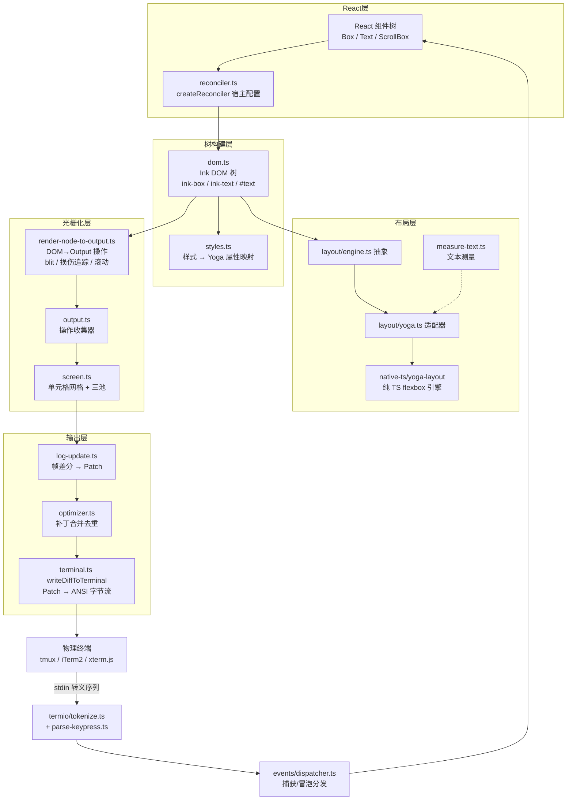
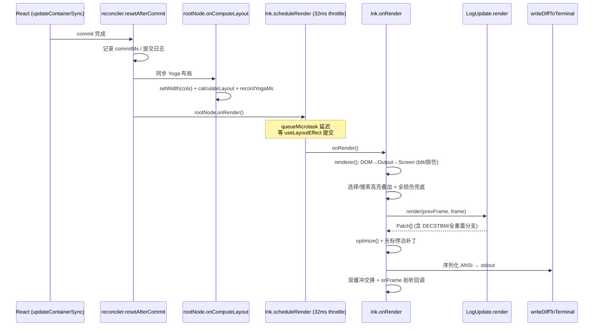

本文深入剖析本仓库内嵌的自研 Ink 渲染引擎——一个从 Vadim Demedes 的 Ink 演化而来、但已在架构层面彻底重构的终端 UI 渲染系统。与上游 Ink "React 树 → 每帧字符串 → ansi-escapes 全量拼接" 的模型不同，本分支引入了完整的**帧级双缓冲、单元格网格 Screen 缓冲、增量差分（diff）与硬件滚动指令生成**，并将 WASM 版 yoga-layout 替换为**纯 TypeScript 移植的 flexbox 引擎**，同时新增了受 ghostty/tmux/iTerm2 启发的**语义化 ANSI 解析器 termio**。全文按照数据流方向组织：从 React Reconciler 的宿主配置出发，经 Yoga 布局、Screen 光栅化、差分输出，直至终端转义序列的双向解析（写入生成与输入解析），覆盖引擎的事件分发、终端能力协商与自愈机制。

Sources: [ink.tsx](ink/ink.tsx#L1-L66), [reconciler.ts](ink/reconciler.ts#L1-L29)

## 架构总览：五层流水线与关键设计决策

整个引擎可以概括为一条五层单向数据流：**React 组件树 → Ink DOM 树 → Yoga 布局树 → Screen 单元格网格 → Patch 差分序列**。每一层之间通过明确的数据结构解耦，这使得上游 Ink 的 `renderToString` 式实现被替换为可增量计算的多阶段管线。核心入口是 `Ink` 类，它持有 React 的 `FiberRoot` 容器、前后两个 `Frame`（双缓冲）、`LogUpdate` 差分引擎、渲染器工厂以及三个池（`StylePool`/`CharPool`/`HyperlinkPool`）。

理解该引擎有三个不可回避的设计决策。**第一，布局计算被挂在 React 提交阶段**：`rootNode.onComputeLayout` 回调在 reconciler 的 `resetAfterCommit` 中同步执行 Yoga 布局，使 `useLayoutEffect` 能读到新鲜布局数据，而非像上游那样延迟到渲染阶段。**第二，渲染调度采用节流 + 微任务延迟**：`scheduleRender` 是 32ms（`FRAME_INTERVAL_MS`）的 lodash throttle，且 leading 回调经 `queueMicrotask` 延迟——因为 `resetAfterCommit` 先于 React 布局阶段（ref attach、useLayoutEffect）执行，若同步渲染，布局效果里设置的 `cursorDeclaration` 会滞后一帧。**第三，渲染被防御性地包裹在大量终端状态不变量中**：`prevFrameContaminated`（前帧缓冲被污染，禁止 blit 快路径）、`needsEraseBeforePaint`（resize 后在 BSU/ESU 原子块内先擦后画）、`altScreenActive` 门控等，这些都是对 tmux/iTerm2/sleep-wake 等真实终端乱象的工程化回应。

上图中逆向的输入链路同样重要：终端 stdin 的原始字节经 `termio` 的流式 tokenizer 切分边界后，由 `parse-keypress.ts` 解释为按键/鼠标/终端应答事件，再经事件分发器以捕获-冒泡两阶段送达 React 树。引擎因此是一个双向系统：输出方向生成转义序列，输入方向解析转义序列。

Sources: [ink.tsx](ink/ink.tsx#L180-L279), [ink.tsx](ink/ink.tsx#L203-L238), [reconciler.ts](ink/reconciler.ts#L247-L315), [frame.ts](ink/frame.ts#L12-L34)

## React Reconciler：宿主配置与提交钩子

`reconciler.ts` 通过 `react-reconciler` 的 `createReconciler` 定义了一套宿主配置，以 `ConcurrentRoot` 模式创建容器（`reconciler.createContainer(this.rootNode, ConcurrentRoot, ...)`），这意味着整个引擎运行在 React 19 的并发调度器之上。宿主节点类型系统非常克制——仅七种元素名：`ink-root`、`ink-box`、`ink-text`、`ink-virtual-text`、`ink-link`、`ink-progress`、`ink-raw-ansi`，外加 `#text` 文本节点。`createInstance` 中有一个关键的树形合法化逻辑：`<Box>` 不允许嵌套在 `<Text>` 内（直接抛错），而 `<Text>` 嵌套 `<Text>` 时会被**降级为 `ink-virtual-text`**——这种节点没有独立的 Yoga 节点，仅作为文本样式作用域存在。

提交阶段的钩子编排是理解引擎时序的钥匙。`resetAfterCommit`（每次 React commit 后同步调用）依次执行：Yoga 布局计算（`rootNode.onComputeLayout`）→ 测试环境走 `onImmediateRender` 同步渲染 / 生产环境走 `rootNode.onRender()`（即节流后的 `onRender`）。而 `commitUpdate` 采用**增量 diff 而非 updatePayload**：React 19 直接传入新旧 props，引擎用本地 `diff()` 函数逐键比较，把变更分为三路——`style` 走 `applyStyles` 更新 Yoga 节点、`textStyles` 走文本样式、事件处理器 prop 存入 `node._eventHandlers`（与普通属性分离，避免处理器身份变化触发 dirty 标记从而破坏 blit 快路径）。

`removeChild`/`removeChildFromContainer` 中的 `cleanupYogaNode` 展示了对 WASM 时代遗留问题的防御：虽然 TS 移植版已无内存释放问题，代码仍保留"先 `clearYogaNodeReferences` 清空引用、再 `freeRecursive`"的顺序，防止并发路径访问已释放节点。此外 `hideInstance`/`unhideInstance`（React `<Suspense>` 激活）通过切换 `LayoutDisplay.None`/`Flex` 实现"逻辑卸载"——节点仍在树上，但布局上不存在。最后，`dispatcher.discreteUpdates = reconciler.discreteUpdates.bind(reconciler)` 这一行刻意反转了依赖方向：dispatcher 不导入 reconciler，由 reconciler 主动注入，打破循环导入。

Sources: [reconciler.ts](ink/reconciler.ts#L224-L239), [reconciler.ts](ink/reconciler.ts#L331-L372), [reconciler.ts](ink/reconciler.ts#L426-L510), [ink.tsx](ink/ink.tsx#L260-L278)

## Ink DOM：宿主节点模型与 Yoga 双树同步

`dom.ts` 定义的 `DOMElement` 是一个"胖节点"——除了 `nodeName`、`attributes`、`childNodes` 等常规字段，它内联了完整的滚动状态机（`scrollTop`、`pendingScrollDelta`、`scrollClampMin/Max`、`stickyScroll`、`scrollAnchor`）、布局回调（`onComputeLayout`/`onRender`/`onImmediateRender`）、事件处理器表 `_eventHandlers`、脏标记 `dirty`，以及每个节点懒创建的 `yogaNode: LayoutNode`。**双树同步**是这里的核心复杂度：`appendChildNode`/`insertBeforeNode`/`removeChildNode` 必须同时维护 DOM childNodes 数组与 Yoga 子树，而 `insertBeforeNode` 中的注释点明了陷阱——部分节点（`ink-virtual-text`、`ink-link`、`ink-progress`）没有 Yoga 节点，DOM 索引与 Yoga 索引天然错位，因此插入前必须**重新计算 yogaIndex**（遍历前缀统计拥有 yogaNode 的兄弟数）。

文本节点的测量通过 Yoga 的 measure function 挂钩：`createNode` 为 `ink-text` 绑定 `measureTextNode`、为 `ink-raw-ansi` 绑定 `measureRawAnsiNode`。测量本体 `measure-text.ts` 是精心优化的单遍算法——一次迭代同时计算 `width`（各行 `lineWidth` 最大值，缓存于 line-width-cache）与 `height`（`Math.ceil(w / maxWidth)` 累加换行行数），用 `indexOf('\n')` 替代 `split` 避免数组分配，并对 `maxWidth <= 0 || !isFinite(maxWidth)` 的"无换行"情形提前短路（因 `Math.ceil(w / Infinity) = 0` 会产生错误高度）。

| 宿主节点 | Yoga 节点 | measure func | 职责 |
|---|---|---|---|
| `ink-root` | ✔ | — | 文档根，持 `focusManager`、渲染回调 |
| `ink-box` | ✔ | — | 布局容器（flexbox），可含滚动状态 |
| `ink-text` | ✔ | `measureTextNode` | 叶子文本块，参与布局测量 |
| `ink-virtual-text` | ✘ | — | 文本内嵌样式作用域（降级产物） |
| `ink-link` | ✘ | — | OSC 8 超链接标记 |
| `ink-progress` | ✘ | — | 进度指示占位 |
| `ink-raw-ansi` | ✔ | `measureRawAnsiNode` | 原生 ANSI 块，测量需解析转义 |

Sources: [dom.ts](ink/dom.ts#L110-L200), [dom.ts](ink/dom.ts#L31-L91), [measure-text.ts](ink/measure-text.ts#L8-L45)

## Yoga 布局：抽象层与纯 TypeScript 引擎

布局系统采用两层抽象。`layout/engine.ts` 仅 7 行——`createLayoutNode()` 直接委托 `createYogaLayoutNode()`，这个看似冗余的间接层是引擎可替换性的预留点（未来可换回 WASM 版或其他 flexbox 实现）。`layout/yoga.ts` 的 `YogaLayoutNode` 是适配器，把引擎无关的 `LayoutNode` 接口（`LayoutDisplay`、`LayoutEdge`、`LayoutFlexDirection` 等字符串枚举）翻译为具体引擎的枚举与调用，包括 `EDGE_MAP`/`GUTTER_MAP` 常量表和 `setFlexDirection`/`setJustifyContent` 等一整套 setter 映射。

真正的引擎在 `native-ts/yoga-layout/index.ts`——一个约 2500 行的**纯 TypeScript 移植版 yoga-layout**（对比上游仅 `CalculateLayout.cpp` 就约 2500 行）。文件头注释明确了移植范围策略：覆盖 Ink 实际使用的特性子集（flex-direction、grow/shrink/basis、align/justify、margin/padding/border/gap、尺寸约束、absolute 定位、measure 函数），并"为规范对齐"额外实现了 Ink 未用的特性（margin: auto、多行 flex-wrap、align-content、`display: contents`、baseline 对齐），明确不实现 aspect-ratio、content-box 与 RTL。选择 TS 移植而非 WASM 的收益写在 `yoga.ts` 尾部注释：**同步可用、无 WASM 加载、无线性内存增长，因此不需要预载/交换/重置机制**——Yoga 实例就是导入时可用的普通 JS 对象。

引擎内部有值得注意的性能工程。`Style` 类型用 9 元素 `Value[]` 数组表示 Yoga 的九边模型（left/top/right/bottom/start/end/horizontal/vertical/all），`resolveEdges4Into` 是显式标注的热路径——把四次 `resolveEdge` 调用合并为一次循环，提升共享的 Horizontal/Vertical/All/Start/End 回退读取，且**写入调用方提供的 `out` 数组而非每次分配新数组**；边解析优先级为"特定边 > horizontal/vertical > all > start/end"，start/end 在恒定 LTR 下映射到 left/right。引擎还导出 `getYogaCounters()`（visited/measured/cacheHits/live 四计数器），供提交日志与帧剖析读取，`live` 计数（创建减释放）用于监控节点泄漏。

| 维度 | 上游 Ink（WASM yoga-layout） | 本分支（TS 移植） |
|---|---|---|
| 初始化 | 异步 load，需预载 | 导入即同步可用 |
| 内存 | WASM 线性内存增长 | 普通 JS 堆 |
| 性能观测 | 无 | getYogaCounters 四计数器 |
| 特性面 | 完整 flexbox | Ink 子集 + 规范对齐项 |
| 释放 | freeRecursive 必须 | 保留同 API（防御性） |

Sources: [engine.ts](ink/layout/engine.ts#L1-L7), [yoga.ts](ink/layout/yoga.ts#L54-L104), [yoga.ts](ink/layout/yoga.ts#L299-L309), [native-ts/yoga-layout/index.ts](native-ts/yoga-layout/index.ts#L1-L39), [native-ts/yoga-layout/index.ts](native-ts/yoga-layout/index.ts#L265-L307)

## Screen 光栅化：单元格网格、三池与损伤追踪

光栅化的目标是把 DOM+Yoga 树转化为 `Screen`——一个字符网格，每格（cell）持有 `char`（CharPool 内整 ID）、`styleId`（StylePool ID）、`hyperlink` ID 及宽度标记（`CellWidth`，含宽字符的 `SpacerTail` 与换行 `SpacerHead`）。三个池全部采用**驻留（interning）策略**：`CharPool` 为 ASCII 单字符设 `Int32Array` 直接索引快速路径、非 ASCII 走 Map；`StylePool` 把 `AnsiCode[]` 风格栈整流为整数 ID 并缓存 `(fromId, toId)` 的转移字符串（`transitionCache`，暖机后零分配）；`HyperlinkPool` 每 5 分钟代际重置防无限增长。池跨 Screen 共享的意义在注释中点明：**内整 ID 跨屏有效，blitRegion 可直接复制 ID，diffEach 可按整数比较**。

`Output` 是操作收集器——`render-node-to-output` 递归遍历 DOM 树时累积 `WriteOperation`/`ClipOperation`/`BlitOperation`/`ShiftOperation` 等，最后 `get()` 一次性应用到 Screen。写入路径的每行文本先经 `@alcalzone/ansi-tokenize` 分词、`getGraphemeSegmenter()` 字素聚类，产出 `ClusteredChar`（值+预计算宽度+styleId+hyperlink），因此逐字符热循环只剩"属性读取 + setCellAt"，不再有 stringWidth 与风格内整。clip 采用矩形交集模型（`intersectClip`：undefined 表示无界，双方有界取更紧约束）。

性能的灵魂在**损伤追踪（damage tracking）与 blit 快路径**。`renderNodeToOutput` 接受可选 `prevScreen`：若某子树自上帧以来未变脏，直接从 prevScreen **块传送（blit）** 对应区域到新 Screen，跳过整棵子树的绘制——稳态帧（spinner 转动、时钟跳动、定高盒子里的文本追加）因此是 O(变更单元格) 而非 O(rows×cols)。快路径有三个失效条件，全部在 `renderer.ts` 汇聚：`absoluteRemoved`（绝对定位节点被移除——它可能盖写过非兄弟区域，prevScreen 已被"毒化"）、`prevFrameContaminated`（选择高亮叠加、帧重置、强制重绘），此时传 `prevScreen: undefined` 强制全量绘制。`didLayoutShift()` 则作为兜底信号：任一节点的 Yoga 位置/尺寸与缓存不符或有子节点被移除时，`onRender` 直接把 `frame.screen.damage` 置为全屏矩形，让 diff 只在受损区比较。滚动优化同样在此层酝酿——`ScrollHint`（DECSTBM 硬件滚动提示）与 `pendingScrollDelta` 的分帧排空（drain）逻辑，包括为 xterm.js 定制的自适应排空参数（`SCROLL_INSTANT_THRESHOLD=5` 等五常量）。

Sources: [screen.ts](ink/screen.ts#L15-L75), [screen.ts](ink/screen.ts#L80-L120), [output.ts](ink/output.ts#L28-L69), [renderer.ts](ink/renderer.ts#L114-L135), [render-node-to-output.ts](ink/render-node-to-output.ts#L26-L141)

## 帧差分与终端写入：LogUpdate、补丁优化与原子性

`Frame` 是渲染管线的交换单位：`screen`（网格）+ `viewport`（视口尺寸）+ `cursor`（虚拟光标）+ 可选 `scrollHint`/`scrollDrainPending`。`LogUpdate.render(prev, next, altScreen, decstbmSafe)` 负责把两帧的 Screen 差异转为 `Patch[]`——补丁是极简的判别联合：`stdout`（原始字节）、`clear`（N 行）、`cursorMove`/`cursorTo`、`hyperlink`、`styleStr`（预序列化风格转移串）等。

差分算法围绕一个核心约束展开：**引擎不知道物理光标的绝对位置，只能用相对操作**（主屏场景）。`VirtualScreen` 是一个虚拟光标模拟器，追踪每次补丁对光标的副作用，确保后续 `cursorMove` 的 dx/dy 计算正确。算法分多条路径，其中三条值得展开。**DECSTBM 滚动优化**：当 `next.scrollHint` 存在且 `decstbmSafe`（终端支持 DEC 2026 BSU/ESU 原子输出，tmux 不支持故传 false）时，先对 `prev.screen` 调 `shiftRows` 模拟硬件滚动，再发出 `setScrollRegion + CSI n S/T + RESET_SCROLL_REGION + CURSOR_HOME`，使 diff 循环自然只发现"滚入"的新行——以几十字节替代整视口重写。**scrollback 不可达检测**：主屏下若内容高度超过视口，旧行已进入终端回滚区而相对光标操作无法触达；引擎用 `cursorAtBottom && prev.screen.height >= prev.viewport.height` 判定，再用 `diffEach` 早退扫描"变更是否落在 scrollback 区间"，命中则触发 `fullResetSequence_CAUSES_FLICKER`（全清重画，代价是闪烁，因此仅在正确性必需时）。**收缩与增长**：高度收缩时发出 `clear(N)` + 上移光标；增长时新增行直接渲染。

产出的补丁经 `optimizer.ts` 合并去重，最终由 `writeDiffToTerminal` 序列化为 ANSI 字节流写出。`onRender` 尾部还有两处关键修饰：alt-screen 下 prepend `CURSOR_HOME`（CSI H）**把物理光标锚定到 (0,0)**，使所有相对移动从已知点计算——这是对"tmux 面板刷新等带外光标扰动导致内容逐帧上爬"的自愈；resize 后则 prepend `ERASE_SCREEN + CURSOR_HOME` 且放在 BSU/ESU 块内保证擦+画原子（同步擦会留 ~80ms 空白屏）。帧末尾的双缓冲交换 `this.backFrame = this.frontFrame; this.frontFrame = frame` 完成乒乓。

| 场景 | 路径 | 代价 |
|---|---|---|
| 稳态帧（spinner/时钟） | blit + 窄损伤 diff | O(变更单元格) |
| ScrollBox 滚动（支持 DEC 2026） | DECSTBM + SU/SD + 少量行 diff | ~200 字节 |
| 内容溢出视口且变更触达 scrollback | fullResetSequence | 全屏闪烁 |
| 选择高亮激活 / 布局位移 | 全屏 damage diff | O(rows×cols) 但无闪烁 |
| 非 TTY | renderFullFrame 整帧输出 | O(rows×cols) |

Sources: [frame.ts](ink/frame.ts#L12-L34), [frame.ts](ink/frame.ts#L96-L124), [log-update.ts](ink/log-update.ts#L123-L185), [log-update.ts](ink/log-update.ts#L187-L300), [ink.tsx](ink/ink.tsx#L585-L651), [ink.tsx](ink/ink.tsx#L593-L595)

## termio：语义化终端转义序列解析器

`termio/` 目录是一个受 ghostty、tmux、iTerm2 启发的 ANSI 解析子系统，分两层。**Tokenizer**（`tokenize.ts`）是八状态流式状态机（`ground`/`escape`/`escapeIntermediate`/`csi`/`ss3`/`osc`/`dcs`/`apc`），只负责转义序列的**边界检测**，产出 `text | sequence` 两类 token；它支持跨 feed 调用的缓冲（不完整序列留待下次输入补齐）、flush 强制吐出，以及仅限 stdin 启用的 `x10Mouse` 模式——注释明确警告 `\x1b[M` 在输出流中是 CSI DL（删行），错误启用会吞掉显示文本。**Parser**（`parser.ts`）在 token 边界之上做**语义解释**，产出结构化 `Action` 判别联合，而非字符串 token。

`types.ts` 定义的 Action 体系是整个子系统的语义中枢：`text`（带 `Grapheme[]` 字素数组与 `TextStyle`）、`cursor`（move/position/save/restore/style 等 11 种）、`erase`（display/line/chars）、`scroll`（up/down/setRegion）、`mode`（alternateScreen/bracketedPaste/mouseTracking/focusEvents）、`link`（OSC 8 start/end）、`title`、`tabStatus`（OSC 21337 每标签页元数据）、`sgr`、`bell`、`reset`、`unknown`。`TextStyle` 用 12 字段结构化描述（bold/dim/italic/underline 变体/blink/inverse/hidden/strikethrough/overline/fg/bg/underlineColor），`Color` 支持 named/indexed/rgb/default 四形态，`Grapheme` 携带 `width: 1 | 2`——宽度判定在 `parser.ts` 中由字素聚类器 + `isEmoji`/`isEastAsianWide` 码点区间判定（多码点字素直接记宽 2）。parse-keypress 则复用 tokenizer 做边界检测，叠加一组正则解释 kitty CSI u（`\x1b[13;2u` = Shift+Enter）、xterm modifyOtherKeys（参数顺序与 CSI u 相反）、DA1/DA2、DECRPM、XTVERSION 等终端应答。

```mermaid
stateDiagram-v2
    [*] --> ground
    ground --> ground : 可打印文本
    ground --> escape : ESC (0x1B)
    escape --> csi : '['
    escape --> osc : ']'
    escape --> dcs : 'P'
    escape --> apc : '_'
    escape --> escapeIntermediate : 中间字节
    escape --> ground : 最终字节
    csi --> csi : 参数 0-9 ; : 私有前缀 ?>=
    csi --> ground : 最终字节 64-126
    osc --> ground : BEL 或 ST (ESC \)
    dcs --> ground : ST
    apc --> ground : ST
```

termio 同时承担**输出方向的序列生成**：`csi.ts` 提供 `CURSOR_HOME`/`cursorMove`/`cursorPosition`/`ENABLE_KITTY_KEYBOARD` 等常量与构造器，`dec.ts` 提供 `ENTER_ALT_SCREEN`（`\x1b[?1049h`）、`ENABLE_MOUSE_TRACKING`、`DBP`/`DFE`（括号粘贴/焦点事件）等 DEC 私有模式序列，`osc.ts` 提供 OSC 8 超链接包装与 OSC 52 剪贴板写入（含 tmux DCS 透传包装）。

Sources: [termio.ts](ink/termio.ts#L1-L43), [tokenize.ts](ink/termio/tokenize.ts#L1-L90), [parser.ts](ink/termio/parser.ts#L1-L150), [types.ts](ink/termio/types.ts#L224-L237), [types.ts](ink/termio/types.ts#L51-L101), [parse-keypress.ts](ink/parse-keypress.ts#L11-L60)

## 事件系统：捕获-冒泡分发与 React 优先级映射

`events/dispatcher.ts` 实现了镜像 react-dom 的事件分发。`collectListeners` 沿 target→root 链收集监听器：capture 处理器 `unshift`（根优先）、bubble 处理器 `push`（目标优先），最终顺序为 `[root-cap, …, parent-cap, target-cap, target-bub, parent-bub, …, root-bub]`；`processDispatchQueue` 依序执行并支持 `stopPropagation`（同节点继续）/`stopImmediatePropagation`（立即中断）两级传播控制，且每个处理器调用前执行 `event._prepareForTarget(node)` 供事件子类做逐节点准备。分发器还负责**事件→React 调度优先级映射**（镜像 react-dom 的 `getEventPriority`），并通过模块底部的注入 `dispatcher.discreteUpdates = reconciler.discreteUpdates.bind(reconciler)` 把离散更新送入 reconciler——依赖反转避免 dispatcher 导入 reconciler 造成的循环。reconciler 侧的 `getCurrentUpdatePriority`/`resolveUpdatePriority`/`setCurrentUpdatePriority` 等 React 19 必需钩子全部委托给 dispatcher 的 `currentUpdatePriority` 与 `resolveEventPriority()`。

命中测试（`hit-test.ts` 的 `dispatchClick`/`dispatchHover`）与悬停追踪由 `Ink` 实例协作：`hoveredNodes: Set<DOMElement>` 保存当前指针下的节点集合，使 App 组件的鼠标处理保持无状态，dispatchHover 对该集合做差分并在原地变更。焦点管理（`focus.ts` 的 `FocusManager`）挂在 `ink-root` 上，任何节点可沿 `parentNode` 上溯到达（模拟浏览器 `getRootNode()`）；`tabIndex` 属性参与 Tab/Shift+Tab 循环，`autoFocus` 经 reconciler 的 `finalizeInitialChildren`→`commitMount` 钩子在挂载期调用 `handleAutoFocus`——注意这是布局提交阶段的同步焦点，而非 React 副作用。

Sources: [dispatcher.ts](ink/events/dispatcher.ts#L36-L114), [reconciler.ts](ink/reconciler.ts#L394-L403), [reconciler.ts](ink/reconciler.ts#L508-L512), [ink.tsx](ink/ink.tsx#L141-L153), [Box.tsx](ink/components/Box.tsx#L11-L46)

## 终端能力协商与自愈机制

引擎对终端状态的不可靠性采取了系统性防御，这部分逻辑集中在 `Ink` 类。**Kitty 键盘协议的栈平衡**是典型例子：`CSI >1u` 是栈式压入，若每次重新断言都 push 而退出只 pop 一次，深度会累积，最终 shell 残留 CSI u 模式导致 Ctrl+C/Ctrl+D 泄漏为转义序列——因此 `reassertTerminalModes` 一律"先 pop 再 push"（空栈上 pop 按规范是 no-op，重置后仍能恢复深度 0→1）。**外部 TUI 交接**（`enterAlternateScreen`/`exitAlternateScreen`）处理 git commit 编辑器类场景：进入时禁用 kitty/modifyOtherKeys（nano 不识别 CSI u 会刷"Unknown sequence"）、禁鼠标、进 alt 屏、清屏归位；退出时的注释解释了为何要**重入 alt 屏**——vim/nano/less 都会写自己的 smcup/rmcup，其 rmcup 已把我们抛回主屏，若直接 `2J` 会抹掉用户主屏回滚区。

自愈路径覆盖四类信号：`SIGCONT`（`handleResume`）、resize（`handleResize`，同步处理而非防抖——防抖窗口内 stdout.columns 新旧不一致会引发双重清屏闪烁）、**stdin 静默 >5s 后的下一份数据**（捕获 tmux detach→attach、ssh 重连、休眠唤醒——这些都不发信号但终端可能重置了 DEC 私有模式）、以及事件循环停顿检测器（真休眠唤醒时才允许破坏性的 alt 重入）。`resetFramesForAltScreen` 的注释展示了另一类微妙不变量：alt 屏下 prev 帧必须播种为 rows×cols **空白屏**而非 0×0——否则 log-update 看到 heightDelta>0 走"增长"路径，其末行的 CR+LF 会滚动 alt 屏，造成虚拟/物理光标永久错位 1 行；同时 `viewport.height = rows + 1` 配合 renderer 侧的同值伪造，使"内容恰好填满视口"不再触发 `shouldClearScreen` 的 offscreen 判定。卸载路径（`unmount`/`detachForShutdown`）则用 `writeSync(1, ...)` 无条件发送全部禁用序列——注释指出终端检测在 tmux/screen 下可能失效，而禁用序列在不支持的终端上是 no-op。

Sources: [ink.tsx](ink/ink.tsx#L875-L919), [ink.tsx](ink/ink.tsx#L351-L419), [ink.tsx](ink/ink.tsx#L280-L346), [ink.tsx](ink/ink.tsx#L969-L1009), [ink.tsx](ink/ink.tsx#L1455-L1499)

## 帧级性能剖析与可观测性

引擎内建了完整的帧剖析管线。`FrameEvent.phases` 把一帧拆为六个耗时相 + 六个 Yoga 计数：`renderer`（DOM→布局→Screen）、`diff`（Screen 差分，热路径）、`optimize`（补丁合并）、`write`（序列化→stdout）、`yoga`（calculateLayout，运行于 resetAfterCommit）、`commit`（React reconcile，scrollMutated→resetAfterCommit）；计数器为 `yogaVisited`（layoutNode 调用含缓存命中）、`yogaMeasured`（measureFunc 调用——昂贵部分）、`yogaCacheHits`（单槽 `_hasL` 缓存早退）、`yogaLive`（存活 Node 数，增长即泄漏）。这些数据经 `options.onFrame` 回调外送，`flickers` 数组则记录每次 `clearTerminal` 的原因（resize/offscreen）与期望/可用高度。调试通道有三条：环境变量 `CLAUDE_CODE_DEBUG_REPAINTS` 启用 `getOwnerChain`（沿 Fiber 的 `_debugOwner ?? return` 链收集组件名，跳过 Box/Text 宿主包装直达命名组件），配合 `findOwnerChainAtRow` 把全屏重置归因到具体 React 组件；`CLAUDE_CODE_COMMIT_LOG` 让 reconciler 在 gap>30ms / reconcile>20ms / creates>50 / SLOW_YOGA>20ms / SLOW_PAINT>10ms 时同步追加日志文件；`recordYogaMs`/`getLastCommitMs` 供 bench 脚本读取。

Sources: [frame.ts](ink/frame.ts#L38-L71), [reconciler.ts](ink/reconciler.ts#L179-L222), [reconciler.ts](ink/reconciler.ts#L146-L177), [ink.tsx](ink/ink.tsx#L735-L788)

## 结语与延伸阅读

本引擎的本质，是把浏览器渲染管线的分层思想（样式→布局→绘制→合成）移植到终端约束之下，并针对终端特有的不可靠性（带外光标扰动、模式重置、多路复用器语义差异）建立了一套不变量与自愈机制。对外 API 层（`ink.ts`）刻意保持精简——`render`/`createRoot` 自动包裹 `ThemeProvider`，并重导出 Box/Text/Button/Link、`useInput`/`useSelection`/`useTerminalViewport` 等 hook 与 `FocusManager`、事件类，使上层组件代码与宿主实现解耦。理解本文后，三个自然的延伸方向是：组件层如何在该引擎之上构建设计系统与消息渲染（见 [组件体系与设计系统：消息渲染、权限对话框、Diff 视图与主题](16-zu-jian-ti-xi-yu-she-ji-xi-tong-xiao-xi-xuan-ran-quan-xian-dui-hua-kuang-diff-shi-tu-yu-zhu-ti)）；虚拟滚动与 ScrollBox 如何利用本文的损伤追踪与 DECSTBM 机制（见 [应用状态管理：AppState Store、Selectors 与 React Context](17-ying-yong-zhuang-tai-guan-li-appstate-store-selectors-yu-react-context)）；以及引擎之上的文本输入与键位系统（见 [键位绑定与 Vim 模式：可配置快捷键与文本输入状态机](18-jian-wei-bang-ding-yu-vim-mo-shi-ke-pei-zhi-kuai-jie-jian-yu-wen-ben-shu-ru-zhuang-tai-ji)）。若需回溯渲染引擎的消费方，[Tool 接口契约：输入校验、权限决策、进度回调与 Ink UI 渲染](10-tool-jie-kou-qi-yue-shu-ru-xiao-yan-quan-xian-jue-ce-jin-du-hui-tiao-yu-ink-ui-xuan-ran)展示了工具 UI 如何以声明式 JSX 降落到这条管线。