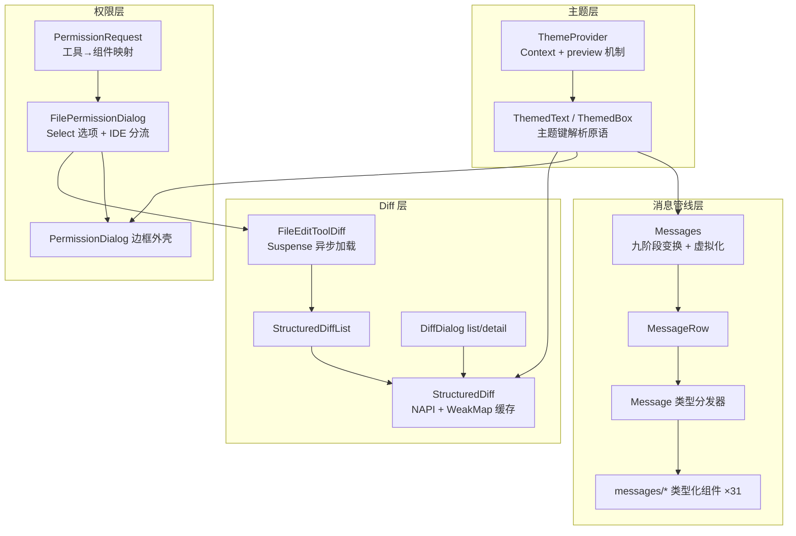
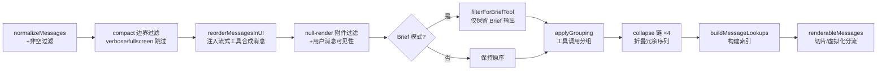

本文剖析该终端 AI 助手在自研 Ink 渲染引擎（见 [Ink 渲染引擎（自研分支）：React Reconciler、Yoga 布局与终端转义序列解析](15-ink-xuan-ran-yin-qing-zi-yan-fen-zhi-react-reconciler-yoga-bu-ju-yu-zhong-duan-zhuan-yi-xu-lie-jie-xi)）之上构建的完整组件层。四大支柱构成一个自底向上的分层体系：**主题系统**提供语义化颜色 token 与运行时切换能力；**设计系统**将其封装为 ThemedText/ThemedBox 主题感知原语；**消息渲染管线**通过九阶段变换将 API 消息流转化为约 31 个类型化组件；**权限对话框族与 Diff 视图**则在同一套设计系统之上实现两条独立但相互交织的交互路径——文件编辑审批对话框本身就内嵌 Diff 渲染组件。全篇遵循一条主线：颜色引用永远使用主题键（如 `"permission"`、`"subtle"`），而非硬编码色值，这使得同一组件树可在六套调色板间无缝切换。

Sources: [ink.ts](ink.ts#L12-L43)

## 架构总览：四层组件金字塔

在深入各子系统之前，先建立整体心智模型。下面的 Mermaid 图展示了一个典型的组件组合关系——从底层主题上下文到顶层的权限对话框，注意 `FileEditPermissionRequest` 同时消费了权限外壳与 Diff 渲染器两条支线（图的前提知识：每个节点是一个 React 组件，箭头表示"渲染包含"关系，虚线框表示分层边界）：

这一分层的核心设计决策体现在 `ink.ts` 外观模块中：**所有渲染入口自动包裹 `ThemeProvider`，并将 `Box`/`Text` 替换为 `ThemedBox`/`ThemedText` 重导出**。这意味着业务组件只需 `import { Box, Text } from '../ink.js'`，即可透明获得主题键解析能力——例如 `borderColor="subtle"` 会自动解析为当前主题的灰调颜色。Ink 引擎本身保持主题无关，主题注入发生在组件层边界。

Sources: [ink.ts](ink.ts#L12-L43)

## 主题系统：语义 Token、六套调色板与运行时预览

### Theme 类型与调色板矩阵

主题的定义位于 `utils/theme.ts`：`Theme` 类型声明了约 80 个**语义化颜色 token**，覆盖品牌色（`claude`）、场景色（`permission`、`planMode`、`bashBorder`）、语义色（`success`/`error`/`warning`）、Diff 专用色（`diffAdded`/`diffRemoved` 及词级高亮变体）、子代理八色（`*_FOR_SUBAGENTS_ONLY` 后缀明确其作用域）乃至 ultrathink 关键字的彩虹七色。所有 token 均为 `rgb()` 字符串而非 ANSI 序列，由底层 `colorize` 统一转换。

| 调色板 | 名称 | 设计目标 |
|---|---|---|
| `dark` / `light` | 默认深/浅色 | 使用显式 RGB 值，避免用户终端 ANSI 配色不一致 |
| `dark-daltonized` / `light-daltonized` | 色盲友好 | 绿/红语义替换为蓝/黄橙（如 `success` 用蓝色 `rgb(51,153,255)`） |
| `dark-ansi` / `light-ansi` | 仅 ANSI | 严格使用 16 色终端色，兼容老旧终端 |
| `auto`（设置值） | 跟随终端 | 运行时解析为上述六者之一 |

`getTheme()` 以简单 switch 将 `ThemeName` 映射到预构建的调色板常量对象——无动态计算，保证解析为 O(1)。类型层面区分了两个概念：`ThemeSetting`（用户配置，可为 `'auto'`）与 `ThemeName`（可渲染的具体调色板，"never 'auto'"）。

Sources: [theme.ts](utils/theme.ts#L4-L98), [theme.ts](utils/theme.ts#L598-L613)

### ThemeProvider：预览机制与 OSC 11 自动检测

`ThemeProvider` 是主题系统的运行时核心，其 Context 暴露的能力远超简单的读写对。**三态状态机**由 `themeSetting`（已保存偏好）、`previewTheme`（临时预览，null 表示无预览）与 `systemTheme`（终端实际深浅色）组成，解析规则为：`activeSetting = previewTheme ?? themeSetting`，再由 `currentTheme = activeSetting === 'auto' ? systemTheme : activeSetting` 得出最终渲染主题。

预览机制服务于 ThemePicker 的实时切换体验：焦点移动到某选项时调用 `setPreviewTheme` 立即生效，确认时 `savePreview` 提交到全局配置，Esc 则 `cancelPreview` 回滚。`auto` 模式通过两条路径检测终端深浅色：初始化时读取 `$COLORFGBG` 环境变量种子值，随后通过 OSC 11 查询序列（由 `systemThemeWatcher` 动态导入实现）实时跟踪终端主题变更——该 watcher 被 `feature('AUTO_THEME')` 编译期特性门控包裹，外部构建时死代码消除（构建体系详见 [构建体系与特性门控：Bun 编译期特性标记与死代码消除](4-gou-jian-ti-xi-yu-te-xing-men-kong-bun-bian-yi-qi-te-xing-biao-ji-yu-si-dai-ma-xiao-chu)）。

Sources: [ThemeProvider.tsx](components/design-system/ThemeProvider.tsx#L43-L116)

### ThemedText/ThemedBox：主题键解析原语

设计系统提供的两个基础原语共享同一套 `resolveColor` 规则：**以 `rgb(`、`#`、`ansi256(`、`ansi:` 前缀判断原始色值直接透传，否则视为 Theme 键查表解析**。`ThemedBox` 将 `borderColor` 等六个颜色 prop 的类型收窄为 `keyof Theme | Color` 联合类型，`ThemedText` 额外提供了 `TextHoverColorContext`——一个跨 Box 边界传播的悬停色上下文（注释明确说明 Ink 原生样式级联无法穿透 Box 边界，故用 React Context 补足）。配套的 `color.ts` 提供柯里化的命令式着色函数，服务于非 JSX 场景。

Sources: [ThemedText.tsx](components/design-system/ThemedText.tsx#L63-L100), [ThemedBox.tsx](components/design-system/ThemedBox.tsx#L39-L60), [color.ts](components/design-system/color.ts#L9-L30)

### ThemePicker：Diff 即主题预览

主题选择器的独特之处在于其预览载体不是色板，而是一段**真实的 `StructuredDiff` 示例代码**（硬编码的 `demo.js` hunk）。这使用户在切换主题时同步预览语法高亮与 Diff 增删色的组合效果。选项列表覆盖六套主题加特性门控的 Auto 项；语法高亮开关（`ctrl+t`）直接写入 `syntaxHighlightingDisabled` 设置并同步 AppState。组件同时展示语法主题名（通过 `getSyntaxTheme` 从 NAPI 查询）与环境变量禁用原因，三种状态构成完整的诊断反馈。

Sources: [ThemePicker.tsx](components/ThemePicker.tsx#L113-L139), [ThemePicker.tsx](components/ThemePicker.tsx#L173-L220), [ThemePicker.tsx](components/ThemePicker.tsx#L232-L269)

## 消息渲染管线：从 API 消息流到终端行

### 九阶段变换链

`Messages` 组件是整个 UI 的数据枢纽，其核心 `useMemo` 内聚了一条纯函数变换链，将原始 API 消息数组逐步转化为可渲染形态：

四个 collapse 变换按内向外顺序嵌套：`collapseReadSearchGroups`（连续读/搜索工具折叠为一行）→ `collapseTeammateShutdowns` → `collapseHookSummaries` → `collapseBackgroundBashNotifications`。变换产生的两个合成消息类型 `grouped_tool_use` 与 `collapsed_read_search` 是 UI 层独有的形态，不存在于 API 消息协议中。

Sources: [Messages.tsx](components/Messages.tsx#L486-L529)

### 渲染上限与虚拟化：UUID 锚点切片

非虚拟化路径存在一条精心设计的**内存安全防线**：`MAX_MESSAGES_WITHOUT_VIRTUALIZATION = 200` 条上限配合 `MESSAGE_CAP_STEP = 50` 的步进。注释中记录了残酷的现实数据——每条消息约 250KB RSS 的 fiber 树，2000 条消息即约 500MB，曾观测到 59GB RSS 的 GC 死亡螺旋。切片边界不用简单的 `slice(-200)`，而是维护一个 **UUID 锚点**（`SliceAnchor`）：计数切片在每次追加时都会移动头部导致滚动内容漂移，而 UUID 锚点仅在渲染数真正超过 `cap + step` 时前进，对压缩/折叠引起的长度抖动免疫；UUID 失效时回退到存储的索引值（截断保护）。

虚拟化路径由 `scrollRef` 的存在性触发——Fullscreen 模式下 REPL 传入 ScrollBox handle，`VirtualMessageList` 接管渲染，内存上界由挂载项数而非总量决定。此外 transcript 模式（ctrl+o）有独立的 30 条截断，`renderRange` 支持分块导出（实测 538 条会话切 20 块降低 55% 平台 RSS）。

Sources: [Messages.tsx](components/Messages.tsx#L276-L340), [Messages.tsx](components/Messages.tsx#L460-L543)

### 两级分发器：MessageRow → Message → 类型化组件

渲染路径经过两级分发。第一级 `MessageRow` 负责行级装饰（时间戳、分组折叠的活动状态计算），并导出 `hasContentAfterIndex`——一个向前扫描函数，用于判断折叠组后是否还有"真实"内容，决定加载指示器是否保持激活态。注释揭示了将其提出为独立函数并传布尔 prop 的原因：避免向每个 MessageRow 传递完整消息数组，React Compiler 会将历史版本数组钉在 fiber 的 memoCache 中，一个 7 轮会话可累积 1-2MB。

第二级 `Message` 组件按 `message.type` 六路 switch 分发到约 31 个类型化组件：`attachment`/`assistant`/`user`/`system` 四类基础消息，加上变换链合成的 `grouped_tool_use` 与 `collapsed_read_search`。Assistant 消息进一步将 content 数组逐块交给 `AssistantMessageBlock`，后者按块类型二次分发：`tool_use` → `AssistantToolUseMessage`、`text` → `AssistantTextMessage`、`thinking`/`redacted_thinking` 仅在 transcript 或 verbose 模式渲染、`server_tool_use`/`advisor_tool_result` 经 `isAdvisorBlock` 判定后交给 `AdvisorMessage`，无法识别的类型记录错误并返回 null（防御性降级）。custom 比较器 `areMessagePropsEqual` 实现了细粒度 memo 策略：`lastThinkingBlockId` 变化只重渲染实际含 thinking 内容的消息，`latestBashOutputUUID` 变化只重渲染状态翻转的两条消息——避免流式 thinking 开始/停止时整个回滚区重渲染。

Sources: [MessageRow.tsx](components/MessageRow.tsx#L40-L92), [Message.tsx](components/Message.tsx#L82-L120), [Message.tsx](components/Message.tsx#L433-L590), [Message.tsx](components/Message.tsx#L603-L619)

### 性能工程：React Compiler 输出与 memo 纪律

值得中级开发者注意的事实：仓库中的组件源码是 **React Compiler 编译后的产物**——随处可见的 `_c(n)` memoCache 数组与 `$[i]` 缓存槽读写即其痕迹。组件作者因此形成了双重纪律：`LogoHeader` 被 `React.memo` 包裹并仅依赖 `agentDefinitions`，注释解释了不这么做的话"seenDirtyChild 级联会禁用所有后续兄弟节点的 blit 优化，2800 条消息的会话中每帧 15 万次写入、CPU 100%"。理解这一背景有助于阅读任何组件源码：看似冗长的缓存槽比较代码，是编译器自动跳过未变 props 重渲染的机制，而组件级 `memo` 与 custom 比较器则是在其之上的手动补强。

Sources: [Messages.tsx](components/Messages.tsx#L47-L76)

## 权限对话框族：工具映射、三态决策与选项工程

### 入口分发器与 ToolUseConfirm 契约

`PermissionRequest` 是权限 UI 的唯一入口，其核心是 `permissionComponentForTool` 函数——一个以**工具类身份**（非名称字符串）为键的 switch 映射：`FileEditTool` → `FileEditPermissionRequest`、`BashTool` → `BashPermissionRequest`，只读三兄弟（`GlobTool`/`GrepTool`/`FileReadTool`）共享 `FilesystemPermissionRequest`，未匹配的工具降级到 `FallbackPermissionRequest`。三个实验性工具（ReviewArtifact/Workflow/Monitor）通过 `feature()` 门控的 require 动态引入，未启用时同样回落到 Fallback。TODO 注释表明长期方向是迁移到 `Tool.renderPermissionRequest` 接口（工具契约详见 [Tool 接口契约：输入校验、权限决策、进度回调与 Ink UI 渲染](10-tool-jie-kou-qi-yue-shu-ru-xiao-yan-quan-xian-jue-ce-jin-du-hui-tiao-yu-ink-ui-xuan-ran)）。

贯穿所有权限组件的核心数据契约是 `ToolUseConfirm`：携带工具输入、`permissionResult` 决策上下文，并暴露 `onAllow(updatedInput, permissionUpdates, feedback)` / `onReject(feedback)` / `recheckPermission()` 回调。值得注意的细节是 `onUserInteraction` 与 `classifierCheckInProgress` 字段——用户与对话框交互（方向键、Tab、输入）时触发回调，**防止异步自动审批机制（如 Bash 分类器，详见 [权限模型：模式切换、规则解析、Bash 分类器与自动模式](19-quan-xian-mo-xing-mo-shi-qie-huan-gui-ze-jie-xi-bash-fen-lei-qi-yu-zi-dong-mo-shi)）在用户正在操作时关闭对话框**。入口组件还统一挂载 `app:interrupt` 键位（Esc 触发三连拒绝回调）与超时系统通知。

Sources: [PermissionRequest.tsx](components/permissions/PermissionRequest.tsx#L47-L82), [PermissionRequest.tsx](components/permissions/PermissionRequest.tsx#L83-L127), [PermissionRequest.tsx](components/permissions/PermissionRequest.tsx#L146-L216)

### 视觉外壳与文件权限的完整实现

两个外壳组件形成鲜明对比：

| 维度 | `PermissionDialog` | 设计系统 `Dialog` |
|---|---|---|
| 定位 | 权限请求专用边框容器 | 通用对话框（/diff、设置等命令） |
| 视觉 | `borderStyle="round"` 仅上边框，默认 `permission` 主题色 | 标题/副标题/输入指南三段式，无边框 |
| 交互 | 无内建键位（由内容区 Select 管理） | 内建 `confirm:no` 取消 + Ctrl+C/D 双击退出 |
| 主题 | `color: keyof Theme` 可覆写 | 同左 |

文件类权限的完整实现在 `FilePermissionDialog/` 目录中拆为五个协作模块。主组件组合 `PermissionDialog` 外壳 + 调用方注入的 `content`（通常是 Diff）+ `Select` 选项列表，并处理三件事：**symlink 安全检查**（解析符号链接，工作目录外的目标以 `warning` 色警告）、**IDE Diff 分流**（`useDiffInIDE` 生效时整个对话框替换为 `ShowInIDEPrompt`，用户在 IDE 中修改的编辑通过 `ideDiffSupport.applyChanges` 回写工具输入）、**遥测埋点**（`usePermissionRequestLogging` 携带语言名与 completion 类型）。

`FileEditPermissionRequest` 是该体系的典型消费者：解析 Zod 输入后，将 `old_string`/`new_string` 包成单元素 edits 数组传给 `FileEditToolDiff` 渲染预览，再连同问题文案一起交给 `FilePermissionDialog`。

Sources: [PermissionDialog.tsx](components/permissions/PermissionDialog.tsx#L17-L71), [Dialog.tsx](components/design-system/Dialog.tsx#L11-L60), [FilePermissionDialog.tsx](components/permissions/FilePermissionDialog/FilePermissionDialog.tsx#L48-L160), [FilePermissionDialog.tsx](components/permissions/FilePermissionDialog/FilePermissionDialog.tsx#L168-L203), [FileEditPermissionRequest.tsx](components/permissions/FileEditPermissionRequest/FileEditPermissionRequest.tsx#L13-L27)

### 选项生成：上下文感知的三态决策

`getFilePermissionOptions` 生成 `Select` 选项列表，其输出是**上下文感知**的：基础三态为 `accept-once`（Yes）/ `accept-session`（Yes, during this session）/ `reject`（No），但当目标位于 `.claude/` 目录（项目级或全局 `~/.claude/`）时，session 选项替换为"允许 Claude 本会话编辑其自身设置"的特殊变体（scope 区分 `claude-folder` 与 `global-claude-folder`）。选项还支持 **feedback 输入模式**：Tab 进入 `yesInputMode`/`noInputMode` 后，Yes/No 变为带占位符的文本输入框，用户可附加指示（"Yes, and tell Claude what to do next"），提交的反馈经 trim 后随 `onChange` 传回。注释明确 session 级选项总是显示——它们只影响内存态，`allowManagedPermissionRulesOnly` 托管策略仅限制持久化规则（策略体系详见 [配置与可观测性：设置体系、托管策略、数据迁移与遥测分析](30-pei-zhi-yu-ke-guan-ce-xing-she-zhi-ti-xi-tuo-guan-ce-lue-shu-ju-qian-yi-yu-yao-ce-fen-xi)）。

Sources: [permissionOptions.tsx](components/permissions/FilePermissionDialog/permissionOptions.tsx#L41-L52), [permissionOptions.tsx](components/permissions/FilePermissionDialog/permissionOptions.tsx#L53-L120)

## Diff 视图：NAPI 渲染、模块级缓存与三种消费场景

### StructuredDiff：Rust 桥接与 O(1) 叶子节点渲染

`StructuredDiff` 是所有 Diff 渲染的终点，其架构围绕一个性能不变式构建：**每次重挂载的工作量仅为一次 WeakMap 查找加两个 RawAnsi 叶子节点**。渲染委托给 `color-diff-napi` 原生模块的 `ColorDiff(patch, firstLine, filePath, fileContent).render(theme, width, dim)`，Rust 侧完成语法高亮、词级 diff 与换行。由于 REPL 在两个不相交的树位置渲染 Messages（transcript 早退 vs 嵌套布局），ctrl+o 会整体卸载重挂消息树导致 React memo 缓存失效，因此**渲染结果缓存在模块级 `WeakMap<StructuredPatchHunk, Map<string, CachedRender>>`**，缓存键包含 theme/width/dim/gutterWidth/firstLine/filePath 六要素，内层 Map 容量封顶 4（覆盖两种宽度 × dim 开关的稳态，防止终端持续缩放累积过期拷贝）。

Fullscreen 模式启用 **gutter/内容双列拆分**：Rust 输出的每行先经 `sliceAnsi` 按列宽切割（保留 ANSI 样式跨切点），行号列包裹在 `NoSelect` 中免疫鼠标选区，两列分别以 `RawAnsi` 直渲染——绕过 Ink 的 Ansi 解析管线，省去 N 次 sliceAnsi 调用与 6N 个 Yoga 节点。降级路径双层：环境变量 `CLAUDE_CODE_SYNTAX_HIGHLIGHT` 为假或设置中 `syntaxHighlightingDisabled` 开启时，回落到纯 TS 实现的 `StructuredDiffFallback`（无语法高亮）；NAPI 不可用时同样回落。

Sources: [StructuredDiff.tsx](components/StructuredDiff.tsx#L21-L49), [StructuredDiff.tsx](components/StructuredDiff.tsx#L50-L94), [StructuredDiff.tsx](components/StructuredDiff.tsx#L95-L189), [colorDiff.ts](components/StructuredDiff/colorDiff.ts#L18-L37)

### 三种消费场景对比

| 场景 | 入口组件 | 数据来源 | 加载策略 |
|---|---|---|---|
| 权限对话框内嵌预览 | `FileEditToolDiff` | `loadDiffData` 异步读取文件、构造 patch | React `use()` + Suspense，占位符 `…` |
| 消息流中的工具结果 | `StructuredDiffList` | 工具结果携带的 hunks | 同步，hunk 间 intersperse `...` 分隔 |
| `/diff` 命令对话框 | `DiffDialog` → `DiffDetailView` | `useDiffData`（当前 git diff）+ `useTurnDiffs`（逐轮） | hook 内部管理，list/detail 双视图切换 |

`FileEditToolDiff` 展示了现代 React 异步模式的终端实践：diff 计算封装为 Promise 存入 `useState`，`DiffBody` 用 `use(promise)` 挂起，Suspense fallback 渲染虚线框占位。`loadDiffData` 有精细的分支策略——`old_string` 超过 `CHUNK_SIZE` 时（SedEdit 场景传入整个文件）跳过文件读取直接 diff 输入串，避免 O(needle) 的重叠缓冲分配；多编辑与空 old_string 则需要全文读取以构造前后串。

`DiffDialog`（由 `/diff` 命令挂载，命令体系见 [斜杠命令体系：命令注册、参数解析与本地 JSX 命令模式](14-xie-gang-ming-ling-ti-xi-ming-ling-zhu-ce-can-shu-jie-xi-yu-ben-di-jsx-ming-ling-mo-shi)）在 `list`（文件清单+统计）与 `detail`（单文件全 hunks）两种视图间切换，数据源数组由"当前工作区"+ 逐轮 diff 组成，`turnDiffToDiffData` 将轮次数据适配为统一的 `DiffData` 结构。`DiffDetailView` 为渲染 hunk 重新读取磁盘文件内容，为 Rust 侧提供多行字符串等跨行语法上下文，上限 400 行（解析限制），并对二进制/大文件/截断/untracked 四种特殊状态分别渲染提示。

Sources: [FileEditToolDiff.tsx](components/FileEditToolDiff.tsx#L23-L105), [FileEditToolDiff.tsx](components/FileEditToolDiff.tsx#L106-L130), [StructuredDiffList.tsx](components/StructuredDiffList.tsx#L16-L29), [DiffDialog.tsx](components/diff/DiffDialog.tsx#L23-L96), [DiffDetailView.tsx](components/diff/DiffDetailView.tsx#L20-L24)

## 结语：设计系统的收敛点

回望全篇，该组件体系最值得借鉴的模式有三。其一是**外观层注入**：`ink.ts` 重导出主题化原语并自动包裹 Provider，使主题能力零成本渗透到数百个组件，而引擎层保持纯粹。其二是**类型驱动的双层分发**：消息按 type → content block 二级 switch 落到 31 个专职组件，权限按工具身份 switch 落到 14 个请求组件，两者都以 Fallback 组件兜底未知类型，扩展新类型只需注册 case 与组件。其三是**跨边界的缓存纪律**：Diff 渲染结果在 React 树之外的模块级 WeakMap 存活，因为树本身会被整体重挂；消息切片锚定 UUID 而非计数，因为数组长度受折叠与压缩扰动。这些细节共同支撑了一个在数千条消息、六套主题、双 shell 交互路径下仍保持响应的终端 UI。

后续阅读建议：向内深入渲染基础可读 [Ink 渲染引擎（自研分支）：React Reconciler、Yoga 布局与终端转义序列解析](15-ink-xuan-ran-yin-qing-zi-yan-fen-zhi-react-reconciler-yoga-bu-ju-yu-zhong-duan-zhuan-yi-xu-lie-jie-xi)；理解组件读取的全局状态可读 [应用状态管理：AppState Store、Selectors 与 React Context](17-ying-yong-zhuang-tai-guan-li-appstate-store-selectors-yu-react-context)；权限对话框背后的决策逻辑可读 [权限模型：模式切换、规则解析、Bash 分类器与自动模式](19-quan-xian-mo-xing-mo-shi-qie-huan-gui-ze-jie-xi-bash-fen-lei-qi-yu-zi-dong-mo-shi)。