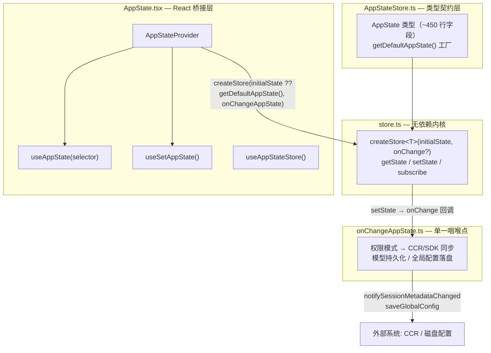
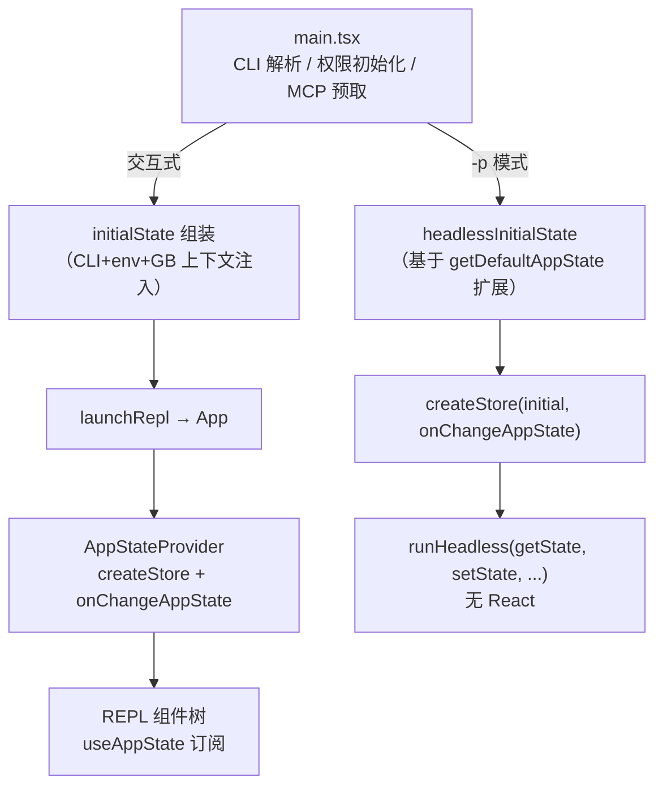

本页剖析 `state/` 目录下的六文件架构：一个仅 35 行的极简 Store 内核、庞大的 AppState 类型契约、React 桥接层，以及贯穿其中的「单一副作用咽喉点」设计哲学。Claude Code CLI 没有引入 Redux/Zustand/MobX 中的任何一个，而是在 35 行代码内实现了状态管理的第一性原理——**外部可变 Store + 选择器订阅 + React 并发安全桥接**。理解这套架构，是理解整个 Ink 终端 UI 如何以终端帧率驱动巨型组件树的前提。

Sources: [store.ts](state/store.ts#L1-L35)

## 架构总览：三层解耦的状态管道

整个状态体系由三层构成，每层职责边界极为清晰。底层是 **`store.ts`**——一个不依赖 React、不依赖任何业务模块的纯观察者模式实现，提供 `getState`/`setState`/`subscribe` 三个方法；中层是 **`AppStateStore.ts`**——定义 `AppState` 类型契约与默认值工厂 `getDefaultAppState()`，同样不含 React 依赖，因此 headless 模式（`-p` 非交互）可以直接消费；顶层是 **`AppState.tsx`**——通过 React Context 与 `useSyncExternalStore` 将 Store 注入组件树。这种分层的直接收益是：**同一份状态代码同时服务交互式 TUI 与无 React 的 headless 进程**。



上图展示了从类型定义到外部系统同步的完整链路。值得注意的是 `AppStateProvider` 创建 Store 的方式：它使用 `useState` 惰性初始化包裹 `createStore`，确保 **Store 实例在组件整个生命周期中只创建一次**；同时通过一个内部的 `HasAppStateContext` 检测嵌套——若 `AppStateProvider` 被嵌套在另一个 `AppStateProvider` 内部，直接抛出错误，防止出现双 Store 状态分裂。

Sources: [store.ts](state/store.ts#L10-L34), [AppState.tsx](state/AppState.tsx#L37-L57), [AppState.tsx](state/AppState.tsx#L44-L47)

## Store 内核：35 行的并发原语

`store.ts` 的完整实现值得逐行审视。`setState` 接收一个 `(prev) => T` 形式的更新函数，执行后先以 `Object.is(next, prev)` 做引用相等性检查——**若新状态引用与旧状态相同则直接返回，不触发任何通知**。这个看似微小的设计是整个性能模型的基石：所有状态更新都必须遵循不可变更新约定（返回新对象），而「无变化即无通知」使得组件订阅可以精确到字段级。随后按序执行两件事：先调用可选的 `onChange` 回调（携带 `newState`/`oldState` 快照），再遍历 `Set<Listener>` 通知所有订阅者。`onChange` 先于 listener 的执行顺序并非偶然——它保证了副作用同步（如 CCR 元数据上报）总是发生在 React 渲染调度之前。

| Store API | 签名 | 职责 | 使用方 |
|---|---|---|---|
| `getState` | `() => T` | 同步读取当前状态快照 | headless 循环、工具执行器 |
| `setState` | `(updater: (prev: T) => T) => void` | 不可变更新 + 通知 | React 组件、非 React 代码 |
| `subscribe` | `(listener) => () => void` | 订阅变更，返回退订函数 | `useSyncExternalStore` |

与 Zustand 的对比有助于理解其克制：没有 middleware 管道、没有 `shallow` 比较工具、没有 devtools 钩子、没有 slice 概念。**所有这些能力都通过约定与上层模式（selector、onChange）重建**，代价是失去生态便利，收益是零依赖、零抽象税，以及可被 35 行代码完全审计的可预测性。

Sources: [store.ts](state/store.ts#L20-L33)

## AppState 类型契约：可变性的刻意分区

`AppState` 类型是全应用最庞大的单一类型，横跨权限上下文、MCP 连接、插件系统、任务注册表、通知队列、投机执行等 20 余个领域。其类型定义采用了一个值得注意的结构技巧——**`DeepImmutable` 与显式可变区的交叉类型分区**。

```typescript
export type AppState = DeepImmutable<{
  settings: SettingsJson
  verbose: boolean
  mainLoopModel: ModelSetting
  // ...约 70 个深度冻结字段
  replBridgeEnabled: boolean
  showRemoteCallout: boolean
}> & {
  // 统一任务状态 — 因 TaskState 含函数类型而排除在 DeepImmutable 之外
  tasks: { [taskId: string]: TaskState }
  // 名称 → AgentId 注册表，由 Agent 工具填充
  agentNameRegistry: Map<string, AgentId>
  foregroundedTaskId?: string
  viewingAgentTaskId?: string
  mcp: { clients: MCPServerConnection[]; /* ... */ }
  plugins: { enabled: LoadedPlugin[]; /* ... */ }
  // ...约 30 个可变/引用类型字段
}
```

这个分区的动机写在注释里：`tasks` 被排除是因为 `TaskState` 包含函数类型（如 `abortController`），`DeepImmutable` 无法深度冻结；`Map`/`Set` 实例则天然是可变引用。**深层含义是：不可变性是「订阅正确性」的契约，而非性能洁癖**——`useSyncExternalStore` 依赖 `Object.is` 判断变化，只有顶层不可变字段遵循「换值必换引用」约定，选择器订阅才能精确；可变区字段（如直接 `map.set()` 的注册表）则要求消费者理解其变更不会自动触发重渲染。

类型中还内嵌了详尽的领域注释，例如 `replBridge*` 系列字段逐个标注了「期望状态 / 显式激活 / 出站单向」等语义区分，`speculation` 状态机则将 `messagesRef` 设计为可变 ref 以避免逐消息数组拷贝——这类决策注释本身就是架构文档的一部分。

Sources: [AppStateStore.ts](state/AppStateStore.ts#L89-L158), [AppStateStore.ts](state/AppStateStore.ts#L158-L216), [AppStateStore.ts](state/AppStateStore.ts#L58-L79)

## React 桥接：useSyncExternalStore 与选择器纪律

`AppState.tsx` 暴露的核心 Hook `useAppState` 是整个 UI 层的订阅入口。其实现通过 `useSyncExternalStore(store.subscribe, get, get)` 将外部 Store 接入 React 18 并发渲染体系——React 会在每次渲染时调用 `get` 并以 `Object.is` 对比上次值，**仅当选中的切片变化时才重渲染组件**。为此，函数文档明确规定了「选择器纪律」：

```typescript
// ✅ 正确：多个独立字段多次调用 Hook
const verbose = useAppState(s => s.verbose)
const model = useAppState(s => s.mainLoopModel)

// ✅ 正确：选择已存在的子对象引用
const { text, promptId } = useAppState(s => s.promptSuggestion)

// ❌ 错误：返回新对象 —— Object.is 恒不等，导致每帧重渲染
const { a, b } = useAppState(s => ({ a: s.a, b: s.b }))
```

这套纪律与 Zustand 的最佳实践完全一致，但以强制文档而非 `shallow` 包装器的形式实现。Hook 家族的另两个成员各司其职：`useSetAppState()` 仅返回 `store.setState`——由于 `setState` 是 Store 闭包内的稳定引用，**只使用此 Hook 的组件永远不会因状态变化而重渲染**，这是编辑型组件（如仅触发变更的按钮）的关键性能阀门；`useAppStateMaybeOutsideOfProvider` 则通过 `NOOP_SUBSCRIBE` 提供安全版本，在 Provider 缺失的渲染上下文（如导出工具的静态渲染）中返回 `undefined` 而非抛错。

`AppStateProvider` 挂载时还有一处防御性逻辑：检查 `toolPermissionContext.isBypassPermissionsModeAvailable` 与 `isBypassPermissionsModeDisabled()`，若远程设置在挂载前已到达则立即禁用 bypass 模式——这解释了为何权限状态必须在 Store 创建后、首次渲染前完成修正。此外 Provider 内部嵌套了 `MailboxProvider` 与经特性门控的 `VoiceProvider`（`feature('VOICE_MODE')` 为 false 时替换为透传组件），并通过 `useSettingsChange` + `applySettingsChange` 监听磁盘设置热变更并回写 Store。

| Hook | 订阅粒度 | 重渲染行为 | 典型场景 |
|---|---|---|---|
| `useAppState(selector)` | 选中切片 | 仅切片 `Object.is` 变化时 | 读取展示型组件 |
| `useSetAppState()` | 不订阅 | 永不重渲染 | 纯动作派发组件 |
| `useAppStateStore()` | 不订阅 | 永不重渲染 | 将 `getState/setState` 传给非 React 代码 |
| `useAppStateMaybeOutsideOfProvider(selector)` | 条件订阅 | Provider 缺失时返回 undefined | 可在 Provider 外渲染的组件 |

一个典型消费者 `useMainLoopModel` 展示了模式组合：它调用两次 `useAppState` 分别订阅 `mainLoopModel` 与 `mainLoopModelForSession`，随后处理一个微妙的边界——GrowthBook 初始化完成后 AppState 不变，但别名解析结果已变，故通过 `useReducer` 强制重渲染以重新执行 `parseUserSpecifiedModel`。这类「外部信号 + 强制重渲染」的补丁正说明：Store 并非唯一的真值来源，而是**需要 UI 响应的那部分真值的物化**。

Sources: [AppState.tsx](state/AppState.tsx#L126-L172), [AppState.tsx](state/AppState.tsx#L59-L91), [useMainLoopModel.ts](hooks/useMainLoopModel.ts#L13-L34)

## 双初始化路径：交互式 Provider vs Headless 直连

Store 的构造存在两条完全独立但共享内核的路径，均在 `main.tsx` 中汇合。**交互式路径**：`main.tsx` 在解析完 CLI 参数、权限上下文、MCP 预取、agent 定义后组装一个巨型 `initialState` 对象（此处而非 `getDefaultAppState()` 是因为大量字段需要来自 CLI/env/GrowthBook 的上下文注入，例如 `replBridgeEnabled: fullRemoteControl || ccrMirrorEnabled`），经 `launchRepl` → `App` → `AppStateProvider` 注入组件树，`onChangeAppState` 作为副作用回调绑定。**Headless 路径**：`-p` 模式下 `main.tsx` 直接调用 `createStore(headlessInitialState, onChangeAppState)`，随后把 `headlessStore.getState` 与 `headlessStore.setState` 以函数形式传入 `runHeadless`——**完全不创建任何 React 树**，但权限同步、模型持久化等副作用照常生效，因为它们挂在 Store 而非 React 上。



headless 路径的一个细节值得注意：MCP 连接采用「先推 pending 后替换」的逐服务器增量模式直接写 `headlessStore`，镜像了交互模式的 `useManageMCPConnections` 行为，使得 ToolSearch 的 pending 检查在两种模式下语义一致。

Sources: [main.tsx](main.tsx#L1), [App.tsx](components/App.tsx#L19-L55), [replLauncher.tsx](replLauncher.tsx#L12-L22)

## onChangeAppState：贯穿全局的单一副作用咽喉点

`onChangeAppState.ts` 是这套架构中最具工程智慧的部分。它将「状态变更的外部同步」集中到一个函数，其开篇注释直白地陈述了设计动机：**权限模式（`toolPermissionContext.mode`）曾有 8 个以上的变更路径，但只有 2 个会通知 CCR**——`print.ts` 中 headless 模式的定制 `setAppState` 包装器与 `set_permission_mode` 处理器的手动通知，其余如 Shift+Tab 循环切换、`ExitPlanModePermissionRequest` 对话框、`/plan` 命令、rewind、REPL bridge 的 `onSetPermissionMode` 均静默修改 AppState，导致 Web UI 与 CLI 实际模式脱节。**将 diff 挂载到 `onChange` 意味着任何修改 mode 的 `setAppState` 都自动触发通知**（经 `notifySessionMetadataChanged` → `ccrClient.reportMetadata` 与 `notifyPermissionModeChanged` → SDK 状态流），散落的调用点无需任何改动。

该函数监控的变更维度及对应副作用：

| 状态字段变化 | 副作用 | 目标系统 |
|---|---|---|
| `toolPermissionContext.mode` | 外部化模式比较 → 元数据上报 + 权限通知 | CCR `external_metadata` / SDK |
| `mainLoopModel` | 写入/清除 userSettings + `setMainLoopModelOverride` | 磁盘配置 / bootstrap 状态 |
| `expandedView` | 拆解为 `showExpandedTodos` + `showSpinnerTree` 持久化 | `saveGlobalConfig` |
| `verbose` | 持久化到全局配置 | `saveGlobalConfig` |
| `settings` | 清空 apiKeyHelper/AWS/GCP 凭证缓存；`settings.env` 变化时重应用环境变量 | 认证缓存 / 进程环境 |

其中权限模式的处理展示了细致的降噪考量：内部模式名（`bubble`、`ungated auto`）不得泄漏到 CCR，因此先经 `toExternalPermissionMode` 外部化，且**仅当外部化后的模式变化时才上报**（`default→bubble→default` 对 CCR 而言是噪音，因为两者都外部化为 `default`）。Ultraplan 标志则按 RFC 7396 语义以 `null` 移除键，且只在首个 plan 循环的原子转换时置位。

文件还导出反向函数 `externalMetadataToAppState`：将 CCR 下发的 `SessionExternalMetadata` 转换为状态更新函数，用于 worker 重启后的状态恢复——同一份映射逻辑双向复用。

Sources: [onChangeAppState.ts](state/onChangeAppState.ts#L43-L92), [onChangeAppState.ts](state/onChangeAppState.ts#L94-L152), [onChangeAppState.ts](state/onChangeAppState.ts#L24-L41)

## Selectors 层：纯函数派生与类型收窄

`selectors.ts` 刻意保持极小（77 行），其文件头注释即为设计准则：**「保持 selector 纯且简单——只做数据提取，无副作用」**。当前包含两个函数。`getViewedTeammateTask` 接收 `Pick<AppState, 'viewingAgentTaskId' | 'tasks'>`（以 Pick 类型声明最小依赖，便于测试），沿「未在查看 → 任务不存在 → 任务非进程内 teammate」三重防御链收窄返回 `InProcessTeammateTaskState | undefined`。`getActiveAgentForInput` 则返回一个判别联合 `ActiveAgentForInput`——`{type: 'leader'}` / `{type: 'viewed', task}` / `{type: 'named_agent', task}`——**用类型系统编码输入路由的三种目的地**，调用方（消息输入处理逻辑）通过 `switch` 获得穷尽性检查而非运行时字符串判断。

与 Redux 生态中 selector 库（reselect 等）的差异在于：这里不做 memoize，因为这些 selector 不直接驱动渲染——它们在事件处理路径中被调用，输入是调用时刻的 `AppState` 快照，天然无需缓存。**渲染路径的「派生」由 `useAppState` 的选择器完成，事件路径的「派生」由 selectors.ts 完成**，两者分层不混用。

| 维度 | `useAppState` 选择器 | `selectors.ts` 函数 |
|---|---|---|
| 执行时机 | 每次 Store 通知后（React 渲染期） | 事件/命令处理时（按需） |
| 结果消费方 | 组件渲染输出 | 命令路由、输入分发 |
| 缓存策略 | `Object.is` 引用比较 | 无（一次性调用） |
| 依赖声明 | 隐式（选择器体） | `Pick<AppState, ...>` 显式 |

Sources: [selectors.ts](state/selectors.ts#L1-L40), [selectors.ts](state/selectors.ts#L42-L76)

## teammateViewHelpers：状态机的函数式封装

`teammateViewHelpers.ts` 展示了「复杂状态转换以纯函数封装、经 `setAppState` 应用」的标准模式。三个函数构成一个完整的 teammate 视图状态机：`enterTeammateView` 设置 `viewingAgentTaskId` 并为 `local_agent` 任务置 `retain: true`（阻止驱逐、启用流式追加、触发磁盘引导）；`exitTeammateView` 返回 leader 视图并将任务回退为 stub；`stopOrDismissAgent` 实现上下文敏感的 `x` 键——运行中则 `abortController.abort()`，终态则置 `evictAfter: 0` 立即隐藏。内部 `release` 辅助函数统一「清除 retain、清空 messages、终态任务设置 30 秒宽限期驱逐」语义，被退出与切换两条路径共享。

两个工程细节体现循环依赖治理：`PANEL_GRACE_MS` 常量从 `framework.ts` 内联复制并注明「导入会经 BackgroundTasksTasksDialog 制造环」；`isLocalAgent` 类型守卫以结构检查替代 `isLocalAgent` 导入，断开 `teammateViewHelpers → LocalAgentTask` 的运行时边。每个函数在更新前都做完整的 `needsRetain`/`needsView`/`switching` 预判，**条件不满足时原样返回 `prev`**——这触发 Store 的 `Object.is` 短路，避免无意义的通知风暴，与不可变更新约定共同构成事务性更新的基础。

Sources: [teammateViewHelpers.ts](state/teammateViewHelpers.ts#L28-L81), [teammateViewHelpers.ts](state/teammateViewHelpers.ts#L88-L141), [teammateViewHelpers.ts](state/teammateViewHelpers.ts#L5-L21)

## 模式总结与延伸阅读

回望整套设计，可以提炼出四条贯穿性的架构原则：**内核极简**（35 行实现第一性原理，避免框架税）；**读写分离**（`useSetAppState` 的零订阅阀门、`getState` 供非 React 代码）；**副作用集中**（`onChange` 单一咽喉点让「任何路径变更都正确同步」成为结构保证而非纪律要求）；**双模式共享**（类型与 Store 均不依赖 React，headless 与交互式同构）。这些原则共同服务于一个目标：在一个以终端帧率驱动、同时被 SDK 进程消费的巨型 CLI 应用中，让状态变更的传播路径始终可预测、可审计。

若要继续深入，建议按以下顺序阅读：先看组件树如何消费这些 Hook——[组件体系与设计系统：消息渲染、权限对话框、Diff 视图与主题](16-zu-jian-ti-xi-yu-she-ji-xi-tong-xiao-xi-xuan-ran-quan-xian-dui-hua-kuang-diff-shi-tu-yu-zhu-ti)；再看权限模式如何在 8 个以上路径中被变更并经 `onChangeAppState` 同步——[权限模型：模式切换、规则解析、Bash 分类器与自动模式](19-quan-xian-mo-xing-mo-shi-qie-huan-gui-ze-jie-xi-bash-fen-lei-qi-yu-zi-dong-mo-shi)；若关心 UI 层为何需要自研渲染引擎，可回溯——[Ink 渲染引擎（自研分支）：React Reconciler、Yoga 布局与终端转义序列解析](15-ink-xuan-ran-yin-qing-zi-yan-fen-zhi-react-reconciler-yoga-bu-ju-yu-zhong-duan-zhuan-yi-xu-lie-jie-xi)。