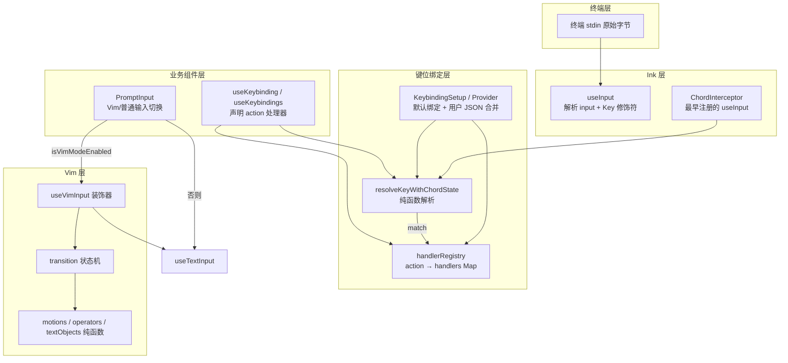
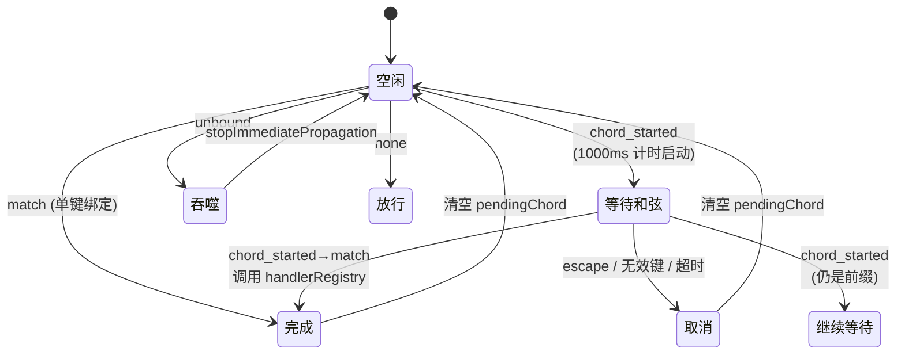
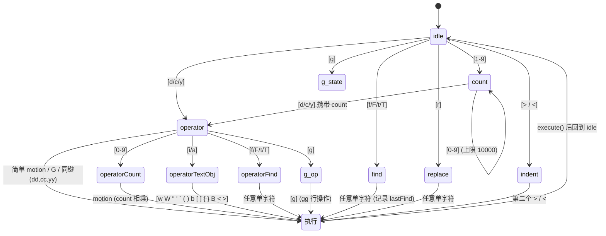

本页剖析终端交互层中两条彼此独立却又在 PromptInput 汇合的输入通路：**声明式键位绑定系统**（`keybindings/` 目录，JSON 配置驱动的"按键 → 动作"解析管线）与**命令式 Vim 模式状态机**（`vim/` 目录，TypeScript 判别联合建模的文本编辑状态机）。前者解决"快捷键可配置、可校验、可跨上下文复用"的工程问题，后者解决"在无真实终端渲染的情况下复刻 Vim 语义"的算法问题。理解这两套体系的分层边界，是理解本仓库终端 UI 层（承接 [组件体系与设计系统](16-zu-jian-ti-xi-yu-she-ji-xi-tong-xiao-xi-xuan-ran-quan-xian-dui-hua-kuang-diff-shi-tu-yu-zhu-ti) 与 [Ink 渲染引擎](15-ink-xuan-ran-yin-qing-zi-yan-fen-zhi-react-reconciler-yoga-bu-ju-yu-zhong-duan-zhuan-yi-xu-lie-jie-xi)）的关键一环。

一个值得先行说明的观察：`components/VimTextInput.tsx`、`components/TextInput.tsx`、`keybindings/KeybindingContext.tsx` 等文件均为 **React Compiler 编译产物**——文件顶部可见 `import { c as _c } from "react/compiler-runtime"`，函数体内充满了 `$[0] !== x` 形式的记忆化缓存判断。阅读这些组件时应当将其视为机器生成代码，理解逻辑应以 `hooks/useVimInput.ts`、`keybindings/useKeybinding.ts` 等手写源码为准。

Sources: [VimTextInput.tsx](components/VimTextInput.tsx#L1-L14), [KeybindingContext.tsx](keybindings/KeybindingContext.tsx#L1-L5)

## 总体架构：两套输入体系的分层

整个输入处理可以概括为三层。最底层是自研 Ink 的 `useInput`，它接收终端原始字节流并解析为 `(input, key, event)` 三元组；中间层是键位绑定系统，通过 React Context 向全树提供 `resolve/getDisplayText/invokeAction` 能力；顶层是各业务组件用 `useKeybinding(action, handler)` 声明"我关心哪个动作"，而 Vim 模式则作为 `useTextInput` 的装饰器旁路接管 NORMAL 模式下的按键路由。



这张图的核心洞见是：**键位绑定系统与 Vim 状态机从不在同一路径上竞争同一个按键**。键位绑定处理的是动作类按键（ctrl+t、escape 等功能键组合），其结果是一个动作标识符；Vim 状态机处理的是编辑类按键（hjkl、dd、ciw 等字面字符序列），其结果是文本与光标变更。二者的切换发生在 PromptInput 的组件选择处（后文详述）。

Sources: [KeybindingProviderSetup.tsx](keybindings/KeybindingProviderSetup.tsx#L119-L208), [useVimInput.ts](hooks/useVimInput.ts#L175-L200), [PromptInput.tsx](components/PromptInput/PromptInput.tsx#L2243-L2244)

## 键位绑定配置管线：从 JSON 到 ParsedBinding

配置管线的起点是 `parseKeystroke`——它把 `"ctrl+shift+k"` 这类字符串切分并归一化为布尔修饰符集合，同时吸收大量别名：`control`→ctrl、`opt/option`→alt、`cmd/command/win`→super，以及 `↑↓←→` 等方向符与 `esc/return/space` 的可读名。紧接着 `parseChord` 按空白切分出"和弦序列"（chord），例如 `"ctrl+k ctrl+s"` 是两步按键；这里有一个精巧的边界处理——单独一个空格字符串被识别为"space 键绑定本身"而非分隔符。最终 `parseBindings` 把配置块的 `{key: action}` 展平为携带 `context` 字段的 `ParsedBinding[]` 数组。

配置的合法性由 Zod schema 把守。`KEYBINDING_CONTEXTS` 枚举了 19 个合法上下文（Global、Chat、Autocomplete、Confirmation、Transcript 等），`KEYBINDING_ACTIONS` 罗列了约百个动作标识符，动作值支持三态：合法动作枚举、`command:xxx` 形式的斜杠命令绑定、以及 `null`（显式解除某个默认绑定）。这套 schema 同时服务于校验与 JSON Schema 生成，因此编辑 `~/.claude/keybindings.json` 时可获得 IDE 补全。

Sources: [parser.ts](keybindings/parser.ts#L13-L84), [schema.ts](keybindings/schema.ts#L177-L200), [parser.ts](keybindings/parser.ts#L191-L204)

默认绑定表 `DEFAULT_BINDINGS` 是理解整个系统"性格"的最佳入口，它体现了三类工程决策。其一是**平台分支**：Windows 下图片粘贴用 `alt+v`（因为 `ctrl+v` 是系统粘贴）、模式循环键在不支持 VT 模式的 Windows 终端上退化为 `meta+m`（shift+tab 不可靠）——VT 支持判定甚至细分到运行时检测 Bun ≥1.2.23 或 Node ≥22.17.0/24.2.0。其二是**编译期特性门控**：`feature('KAIROS')`、`feature('QUICK_SEARCH')`、`feature('VOICE_MODE')` 等条件展开的绑定项，在外部构建中会被 Bun 编译器做死代码消除（呼应 [构建体系与特性门控](4-gou-jian-ti-xi-yu-te-xing-men-kong-bun-bian-yi-qi-te-xing-biao-ji-yu-si-dai-ma-xiao-chu)）。其三是**注释即文档**：`ctrl+c`/`ctrl+d` 虽然在此定义（供 resolver 查找），但代码注释明确说明它们走基于时间的双击处理逻辑、用户不可重绑定。

Sources: [defaultBindings.ts](keybindings/defaultBindings.ts#L15-L30), [defaultBindings.ts](keybindings/defaultBindings.ts#L36-L47), [defaultBindings.ts](keybindings/defaultBindings.ts#L32-L98)

用户配置的加载与合并在 `loadUserBindings.ts` 完成。值得注意的是该功能目前被 GrowthBook 开关 `tengu_keybinding_customization_release` 门控（注释说明仅对 Anthropic 员工开放，外部用户恒用默认绑定）。加载流程采用**追加式合并**而非覆盖式：`[...defaultBindings, ...userParsed]`，后出现者胜出——这正是"用户覆盖默认"的实现机制。热重载基于 chokidar 监听文件变更，并以 500ms 稳定期阈值 + 200ms 轮询过滤编辑器保存时的多次写事件；同时每日仅上报一次 `tengu_custom_keybindings_loaded` 遥测事件以估算定制功能使用率。

Sources: [loadUserBindings.ts](keybindings/loadUserBindings.ts#L41-L46), [loadUserBindings.ts](keybindings/loadUserBindings.ts#L191-L199), [loadUserBindings.ts](keybindings/loadUserBindings.ts#L49-L56)

## 运行时解析：上下文模型与 Chord 状态机

解析层的两个关键事实是**纯函数**与**最后匹配胜出**。`resolveKey` 遍历绑定数组，跳过非单键和弦与非活跃上下文的条目，对每个匹配记录覆盖前值——因此用户配置天然压制默认值。`resolveKeyWithChordState` 在此基础上引入和弦状态，其返回类型是一个五态判别联合：

| 结果类型 | 语义 | 触发条件 |
|---|---|---|
| `match` | 和弦完成，携带 action | 序列恰好等于某绑定 |
| `chord_started` | 进入等待态，携带 pending 前缀 | 当前序列是更长绑定的前缀 |
| `chord_cancelled` | 和弦作废 | 按 escape、无效键或超时 |
| `unbound` | 显式解绑（action 为 null） | 命中 null 绑定 |
| `none` | 无任何匹配 | 非和弦状态下按键不命中 |

和弦前缀判定中隐藏着一段防御性设计：代码用 `chordWinners` Map 按"和弦字符串"分组取最后胜者，再检查胜者是否为非 null 动作。注释解释了原因——若用户用 null 解绑了 `ctrl+x ctrl+k`，而 `ctrl+x` 本身另有单键绑定，则朴素实现会让 `ctrl+x` 仍然进入"等待和弦"状态，导致单键绑定永远不触发。**前缀优先于精确匹配**也是刻意为之：即使 `ctrl+k` 有单键绑定，只要存在 `ctrl+k ctrl+s`，第一击仍进入等待。

Sources: [resolver.ts](keybindings/resolver.ts#L32-L61), [resolver.ts](keybindings/resolver.ts#L166-L245), [resolver.ts](keybindings/resolver.ts#L196-L221)

上下文解析的优先级由消费侧构建。`useKeybinding` Hook 在每次按键时拼装检查列表：`[...activeContexts, context, 'Global']` 去重后传入 resolver——`activeContexts` 是通过 `registerActiveContext` 挂载注册的动态上下文集合（如当前打开的对话框），紧随其后是 Hook 自身声明的上下文，Global 兜底。这套机制的巧妙之处在于：**Provider 与组件树完全解耦**，任何组件只需声明动作名，无需知道自己被哪种对话框包裹。

Provider 侧的 `KeybindingSetup` 有三个值得记录的实现细节。第一，和弦状态采用 **ref + state 双轨制**：`pendingChordRef` 供 `resolve()` 同步读取（避免等待 React 渲染周期），`pendingChord` state 驱动 UI 重渲染（如显示等待提示），并附带 1000ms 超时自动取消。第二，`activeContextsRef` 同样用 ref 而非 state，注释明确指出"输入处理器需要立即看到当前值，而不是等一个渲染周期"。第三，`ChordInterceptor` 组件作为 Provider 的**第一个子元素**注册 `useInput`——这是和弦功能成立的根基：若无此拦截器，和弦第二键（如 `ctrl+x ctrl+k` 中的 k）会先被 PromptInput 当作普通字符吃掉。

Sources: [useKeybinding.ts](keybindings/useKeybinding.ts#L47-L91), [KeybindingProviderSetup.tsx](keybindings/KeybindingProviderSetup.tsx#L138-L187), [KeybindingProviderSetup.tsx](keybindings/KeybindingProviderSetup.tsx#L211-L307)



图中的状态流转对应 `ChordInterceptor` 的 switch 分支：`chord_started` 与 `chord_cancelled` 都会 `stopImmediatePropagation()` 阻断事件继续传播；只有 `match` 且此前确实处于和弦中（`wasInChord`）时，才由拦截器直接从 `handlerRegistryRef` 查找并调用处理器——因为和弦第二键的场景下，持有 `useInput` 的业务组件看到的仍是完整事件流，需要中央化的派发点。

Sources: [KeybindingProviderSetup.tsx](keybindings/KeybindingProviderSetup.tsx#L236-L294), [useKeybinding.ts](keybindings/useKeybinding.ts#L113-L121)

## 终端兼容性工程：修饰符的物理现实

匹配层 `match.ts` 浓缩了多年终端踩坑经验的结晶，核心是三组修饰符语义修正。**Alt 与 Meta 合并**：历史上 Ink 把 Alt/Option 统一设为 `key.meta`，因此配置中 alt 与 meta 被视作同一逻辑修饰符——`keystrokesEqual` 用 `(a.alt || a.meta) === (b.alt || b.meta)` 显式折叠。**Escape 的 meta 假象**：Ink 在 escape 按下时会错误地置 `key.meta = true`（源自终端转义序列的历史行为），若不修正，`"escape"` 无修饰符绑定将永远无法匹配；`matchesKeystroke` 与 `buildKeystroke` 两处都做了针对性豁免。**Super 的协议边界**：`cmd/win` 修饰符只有支持 kitty keyboard protocol 的终端（kitty、WezTerm、ghostty、iTerm2）才会真正传到 pty，其余终端上该绑定"静默失效"而非报错。

展示层同样做了平台适配：`keystrokeToDisplayString` 在 macOS 上把 alt 显示为 `opt`、super 显示为 `cmd`，其他平台分别显示 `alt` 与 `super`。默认绑定表中 `ctrl+shift+f` 与 `cmd+shift+f` 双写全局搜索、`ctrl+shift+c` 与 `cmd+c` 双写选区复制，正是"kitty 终端吃 super、传统终端吃 ctrl+shift"的兼容性策略。

Sources: [match.ts](keybindings/match.ts#L50-L79), [match.ts](keybindings/match.ts#L86-L105), [resolver.ts](keybindings/resolver.ts#L102-L118), [parser.ts](keybindings/parser.ts#L157-L186), [defaultBindings.ts](keybindings/defaultBindings.ts#L204-L212)

## 校验与安全边界：三层保留键防线

校验体系产出结构化的 `KeybindingWarning`，包含五种类型（`parse_error`/`duplicate`/`reserved`/`invalid_context`/`invalid_action`）与两个严重级别。警告通过通知系统展示为"Found N keybinding errors · /doctor for details"，错误级别享有 `immediate` 优先级。

保留键分为三个清单，构成递进防线。`NON_REBINDABLE`（ctrl+c、ctrl+d、ctrl+m）是硬编码禁区——ctrl+m 与 Enter 在终端中都发送 CR，物理上不可区分；`TERMINAL_RESERVED`（ctrl+z 挂起、ctrl+\ 退出信号）是终端层截获、应用大概率收不到的按键，仅作警告；`MACOS_RESERVED`（cmd+c/v/x/q/w/tab/space）在 macOS 平台追加，因为它们被操作系统吞掉。值得留意的是 ctrl+s/ctrl+q（XOFF/XON 流控）被**刻意排除**——现代终端默认关闭流控，本项目把 ctrl+s 用于 stash 功能。

`normalizeKeyForComparison` 的实现处理了一个易错细节：和弦字符串（如 `ctrl+x ctrl+b`）必须**先按空白分步、再逐步归一化修饰符**，否则直接按 `+` 切分会把下一步的键名覆盖掉上一步的主键，把整个和弦坍缩成最后一个键。`/keybindings` 命令则负责引导用户起步：用 `wx` 独占标志写入模板（利用 EEXIST 避免覆盖已存在文件的 stat 预检查竞态），随后调用外部编辑器打开。

Sources: [validate.ts](keybindings/validate.ts#L16-L34), [reservedShortcuts.ts](keybindings/reservedShortcuts.ts#L16-L67), [reservedShortcuts.ts](keybindings/reservedShortcuts.ts#L86-L127), [keybindings.ts](commands/keybindings/keybindings.ts#L20-L40), [template.ts](keybindings/template.ts#L40-L52)

## Vim 状态机：判别联合建模的 CommandState

`vim/types.ts` 的开篇注释直白地宣告设计哲学："**类型即文档**——读懂这些类型就读懂了系统如何工作"。核心类型是三层的：`VimState` 区分 INSERT（追踪 `insertedText` 以支持点重复）与 NORMAL（内嵌 `CommandState` 状态机）；`CommandState` 是 11 个状态的判别联合，每个状态精确记录"我在等什么输入"；`PersistentState` 跨命令存活，保存 `lastChange`（点重复）、`lastFind`（`;`/`,` 重找）与无名寄存器。



状态机入口 `transition` 是一个**穷尽性 switch**：TypeScript 保证每个 `CommandState` 变体都有对应分支，新增状态时编译器强制补全处理。每个分支函数返回 `TransitionResult`——`next`（进入新状态）或 `execute`（执行副作用后回落 idle）二选其一，这个极简的返回结构让状态推进与副作用执行彻底分离。

几个体现 Vim 语义精度的分支值得单独圈点。`fromIdle` 中 `0` 被特殊处理为"行首 motion"而非计数前缀（真 Vim 语义）；`fromOperator` 中重复操作符首字母（dd/cc/yy）触发行级操作；`fromOperatorCount` 实现双计数控乘（`2d3w` = 删 6 个词）；`fromG` 处理 `5gg` 跳转第 5 行。`handleNormalInput` 则是大写速记键的聚集地：`D`/`C` 分别等价于 `d$`/`c$`，`Y` 是行级 yank，`G` 在 count=1 时跳末行、有 count 时跳指定行——注释里明确区分了"未给 count"与"给了 count 1"。

Sources: [types.ts](vim/types.ts#L43-L86), [transitions.ts](vim/transitions.ts#L59-L88), [transitions.ts](vim/transitions.ts#L248-L332), [transitions.ts](vim/transitions.ts#L98-L199)

| CommandState 状态 | 携带数据 | 等待的输入 |
|---|---|---|
| `idle` | — | 任意 NORMAL 键 |
| `count` | `digits: string` | 更多数字或操作符 |
| `operator` | `op, count` | motion / find / i,a / 数字 / 同键 |
| `operatorCount` | `op, count, digits` | 更多数字或 motion |
| `operatorFind` | `op, count, find` | 目标字符 |
| `operatorTextObj` | `op, count, scope` | 文本对象类型字符 |
| `find` | `find, count` | 目标字符 |
| `g` | `count` | j / k / g |
| `operatorG` | `op, count` | g（形成 gg） |
| `replace` | `count` | 替换字符 |
| `indent` | `dir, count` | 第二个 > 或 < |

状态机对非法输入的容错策略统一而克制：`handleNormalInput` 返回 `null` 时各分支回落到 `idle`（或保持 `idle` 返回空对象），不报错、不保留残缺状态——这与 Vim 本体"按键序列不合法就作废重来"的行为一致。

Sources: [transitions.ts](vim/transitions.ts#L200-L242), [types.ts](vim/types.ts#L59-L75)

## 纯函数执行层：motions、operators 与 textObjects

状态机之下的三层执行原语全部遵循**纯计算 + 上下文注入**模式。`OperatorContext` 定义了执行器可触碰的全部世界：cursor、text/setText、setOffset、enterInsert、寄存器读写、lastFind 读写、recordChange。没有任何执行器直接持有 React 状态——它们只通过这个接口回调宿主。

`motions.ts` 的 `resolveMotion` 展示了计数语义的实现本质：循环 `count` 次调用单步 motion，若光标不再移动则提前终止（到达文本边界）。辅助谓词 `isInclusiveMotion`（`eE$`）与 `isLinewiseMotion`（`jkG` 与 `gg`）决定了操作符作用范围的边界规则——inclusive motion 包含目标字符，linewise motion 使操作作用于整行。

`textObjects.ts` 是 Unicode 正确性的范本。`findWordObject` 先用 `getGraphemeSegmenter()` 把文本**预切分为字素簇**再迭代，保证 emoji 等多码点字符不会被拦腰切断；词/空白/标点三类字符段各自双向扩展；`a` 范围优先吞并尾部空白、无尾部空白时回退吞并头部空白。`findBracketObject` 用经典的深度计数法双向扫描配对括号，并特殊处理光标恰在闭括号上的情形（`i !== offset` 条件）。`findQuoteObject` 则限定在当前行内按 0-1、2-3 顺序配对引号——不跨行的引号配对是 Vim 的实际行为。

`operators.ts` 的 `executeLineOp`（dd/cc/yy）包含两处精细的文本操作修正：删除到文件末尾时若前面有换行则一并吞掉（避免留下孤立尾换行）；`cc` 在单行时直接清空、多行时把受影响行替换为单个空行再进入 INSERT。寄存器内容统一保证行级操作以 `\n` 结尾，供粘贴时区分行级与字符级。

Sources: [operators.ts](vim/operators.ts#L26-L54), [motions.ts](vim/motions.ts#L13-L25), [motions.ts](vim/motions.ts#L72-L83), [textObjects.ts](vim/textObjects.ts#L60-L116), [textObjects.ts](vim/textObjects.ts#L149-L186), [operators.ts](vim/operators.ts#L102-L166)

点重复（`.` 命令）的实现是这套设计中最具架构美感的部分。每个成功的操作通过 `ctx.recordChange` 记录为一个 `RecordedChange` 变体——共十种：insert、operator、operatorTextObj、operatorFind、replace、x、toggleCase、indent、openLine、join。回放时 `replayLastChange` 按变体分发到对应的 execute 函数，且以 `isReplay = true` 构造上下文使 `recordChange` 变成空函数——**回放不覆盖被回放的记录**，这正是 Vim 点重复"重复上一次修改而非进入递归"的语义保证。

Sources: [types.ts](vim/types.ts#L92-L119), [useVimInput.ts](hooks/useVimInput.ts#L109-L173)

## React 集成：useVimInput 装饰器与模式路由

`useVimInput` 是整个 Vim 体系的 React 胶水层，其结构是一个标准的**装饰器模式**：内部先调用 `useTextInput`（readline 风格基础输入），返回值展开后用 `handleVimInput` 覆写 `onInput`，并附加 `mode`/`setMode`。Vim 状态本身存放在 `vimStateRef`（ref 而非 state），避免每次按键触发整个输入区重渲染；只有 INSERT/NORMAL 模式切换才通过 `setMode` 触发渲染。

`handleVimInput` 的按键路由优先级链是理解其行为的钥匙：**ctrl 组合键 → 基础处理器直通**（ctrl+b 后台化等系统级快捷键优先）；**INSERT 下的 escape → 切 NORMAL**——代码注释特别强调此处刻意不迁移到键位绑定系统，因为"Vim 用户期望 Esc 永远退出插入模式"，这是 Vim 语义而非可配置快捷键；**Enter 双模式直通**（允许在 NORMAL 模式直接提交）；**INSERT 常规输入 → 追踪 insertedText 后委托基础层**（backspace 按字素簇缩减）；**NORMAL + idle 态的方向键 → 委托基础层**（保住多行输入的光标移动与历史回退 fallback）；其余 NORMAL 输入进入 `transition` 状态机，方向键被映射为 hjkl。

NORMAL 态的两个防御性注释揭示了踩坑历史：Backspace/Delete 只在"期待 motion"的状态（idle/count/operator/operatorCount）映射为 `h`/`x`，否则 `r+Backspace` 会变成"用 h 替换字符"、`df+Delete` 会变成"删到下一个 x"。而 NORMAL idle 态按下 `?` 会显式把输入设为 `'?'`——覆盖空输入场景下 `?` 被吞掉的问题。

模式切换的 Vim 保真度体现在细节：`switchToNormalMode` 在退出 INSERT 时把光标左移一格（除非在行首或 offset 0），并把本次 `insertedText` 固化为 `lastChange`；`switchToInsertMode` 可携带目标 offset（供 `i/a/A/o/O/I` 各入口定位）。

Sources: [useVimInput.ts](hooks/useVimInput.ts#L34-L47), [useVimInput.ts](hooks/useVimInput.ts#L175-L229), [useVimInput.ts](hooks/useVimInput.ts#L237-L294), [useVimInput.ts](hooks/useVimInput.ts#L49-L80)

`VimTextInput` 组件本体极薄：装配 `useVimInput` 后将完整的 `VimInputState` 传给通用的 `BaseTextInput` 渲染，仅额外处理 `initialMode` 与当前 mode 不一致时的同步副作用。这意味着 **Vim 模式与普通模式共用同一套渲染管线**——差异完全收敛在输入处理层，渲染层零感知。

Sources: [VimTextInput.tsx](components/VimTextInput.tsx#L101-L135)

## 双体系交汇：PromptInput 的选择逻辑与 /vim 命令

两条通路的最终交汇点在 PromptInput 的第 2243 行，一行三元表达式完成体系切换：

```tsx
const textInputElement = isVimModeEnabled()
  ? <VimTextInput {...baseProps} initialMode={vimMode} onModeChange={setVimMode} />
  : <TextInput {...baseProps} />
```

`baseProps` 是精心组装的共享属性包（`components/PromptInput/PromptInput.tsx#L2172-L2213`），其中 `inputFilter`（lazy-space-after-pill 之类的状态过滤器）在 Vim 模式下的处理颇见功力：`useVimInput` 让过滤器**在所有模式下都执行**（保证状态型过滤器在任何按键后解除武装），但只把变换后的输入**应用在 INSERT 模式**——NORMAL 模式的命令查表需要单字符，前置空格会破坏查表。

模式偏好持久化在全局配置的 `editorMode` 字段，`/vim` 斜杠命令负责切换：`normal ↔ vim` 循环切换，旧的 `emacs` 值向后兼容地归一化为 `normal`，切换时上报 `tengu_editor_mode_changed` 遥测。当前 Vim 模式还会透传给 `PromptInputFooter` 用于底部状态栏显示（`vimMode` prop，L2274）——INSERT/NORMAL 指示与 [组件体系](16-zu-jian-ti-xi-yu-she-ji-xi-tong-xiao-xi-xuan-ran-quan-xian-dui-hua-kuang-diff-shi-tu-yu-zhu-ti) 中的提示符风格指示器协同工作。

Sources: [PromptInput.tsx](components/PromptInput/PromptInput.tsx#L2243-L2274), [vim.ts](commands/vim/vim.ts#L8-L38), [useVimInput.ts](hooks/useVimInput.ts#L175-L181)

| 维度 | 键位绑定系统 | Vim 模式状态机 |
|---|---|---|
| 配置来源 | `~/.claude/keybindings.json` + 默认表 | 无配置，语义硬编码 |
| 核心抽象 | action 标识符（`app:toggleTodos`） | CommandState 判别联合 |
| 状态管理 | Provider ref + state 双轨 | Hook 内 vimStateRef |
| 传播控制 | `stopImmediatePropagation` + handler 返回 false | 直接覆写 onInput |
| 校验机制 | Zod schema + 五类警告 | TypeScript 穷尽性 switch |
| 面向场景 | 功能快捷键（跨组件、可重绑） | 文本编辑语法（模式化、组合式） |
| 门控方式 | GrowthBook 运行时开关 + feature() 编译期 | editorMode 全局配置 |

这张对照表回答了一个架构层面的根本问题：为什么不把 Vim 按键也纳入键位绑定系统？因为二者的**组合复杂度不同构**。快捷键是 O(1) 的"一击一动作"，适合声明式配置；Vim 命令是 O(n) 的"前缀树等待"（count × operator × motion/textObj 三维组合），需要的是状态机而非查表。`useVimInput` 注释中"Escape 刻意不迁移"的决策正是这条分界线的具象化。

Sources: [useVimInput.ts](hooks/useVimInput.ts#L189-L195), [schema.ts](keybindings/schema.ts#L64-L172), [types.ts](vim/types.ts#L59-L75)

## 延伸阅读

- 输入事件的原始解析（Key 对象、escape 的 meta 假象源头）见 [Ink 渲染引擎（自研分支）](15-ink-xuan-ran-yin-qing-zi-yan-fen-zhi-react-reconciler-yoga-bu-ju-yu-zhong-duan-zhuan-yi-xu-lie-jie-xi)，其中 `ink/events/input-event.ts` 与 `ink/parse-keypress.ts` 是 `useInput` 的上游。
- 键位绑定警告的消费端与诊断输出归属 [配置与可观测性：设置体系、托管策略、数据迁移与遥测分析](30-pei-zhi-yu-ke-guan-ce-xing-she-zhi-ti-xi-tuo-guan-ce-lue-shu-ju-qian-yi-yu-yao-ce-fen-xi)（`/doctor` 命令复用 `isKeybindingCustomizationEnabled`）。
- `feature()` 编译期门控如何在外部构建中裁剪 QUICK_SEARCH、VOICE_MODE 等绑定，参见 [构建体系与特性门控：Bun 编译期特性标记与死代码消除](4-gou-jian-ti-xi-yu-te-xing-men-kong-bun-bian-yi-qi-te-xing-biao-ji-yu-si-dai-ma-xiao-chu)。
- Vim 模式操作所依赖的 `utils/Cursor.ts` 光标抽象与字素簇处理，是 [组件体系与设计系统](16-zu-jian-ti-xi-yu-she-ji-xi-tong-xiao-xi-xuan-ran-quan-xian-dui-hua-kuang-diff-shi-tu-yu-zhu-ti) 中文本渲染正确性的共同基石。