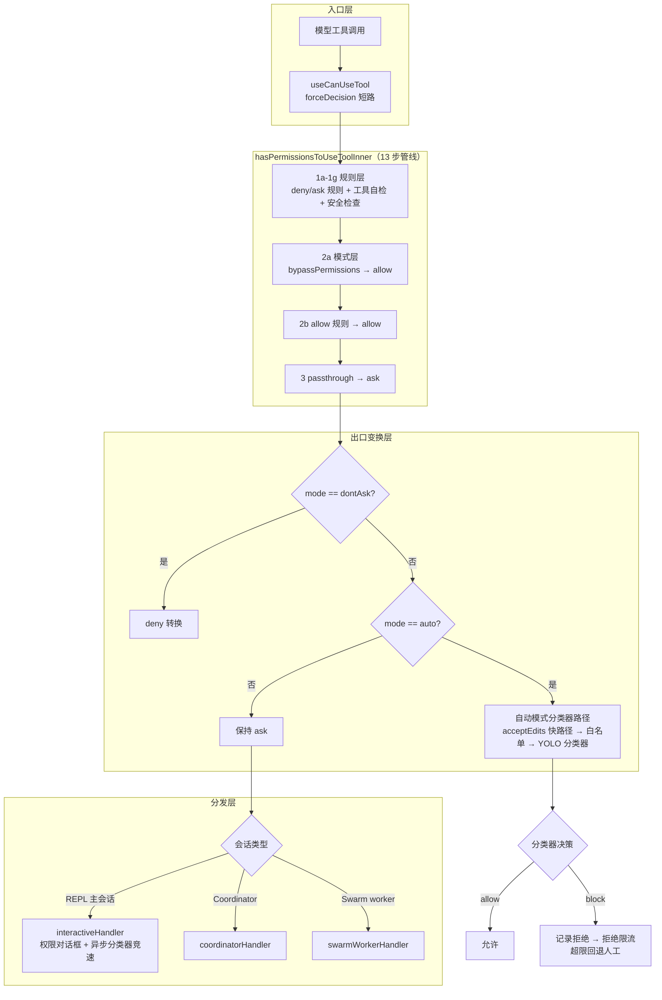
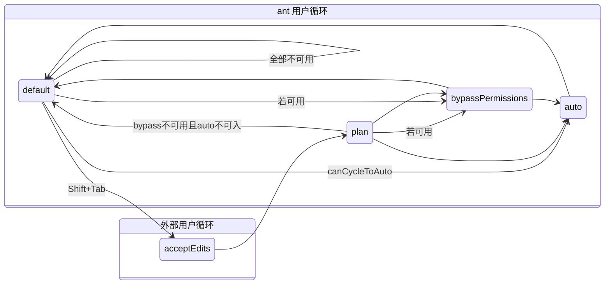
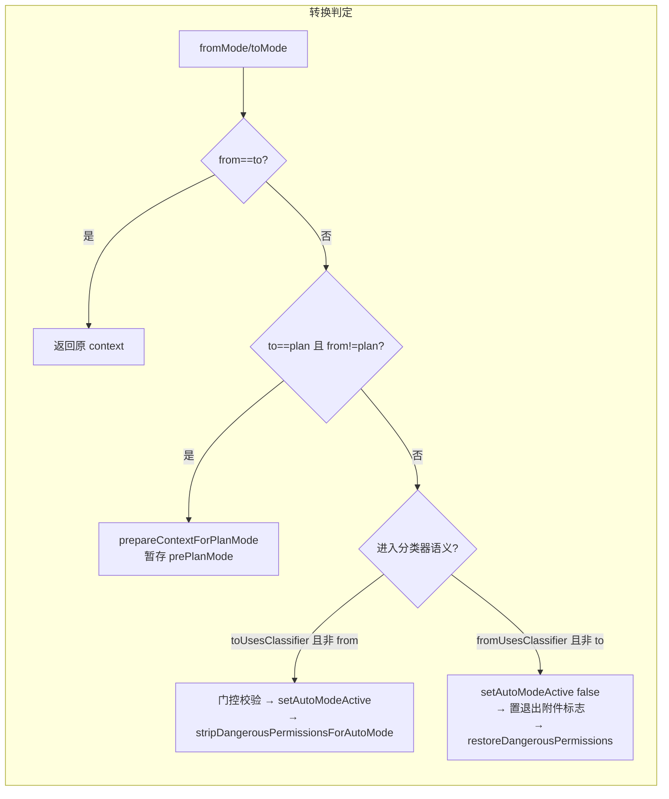
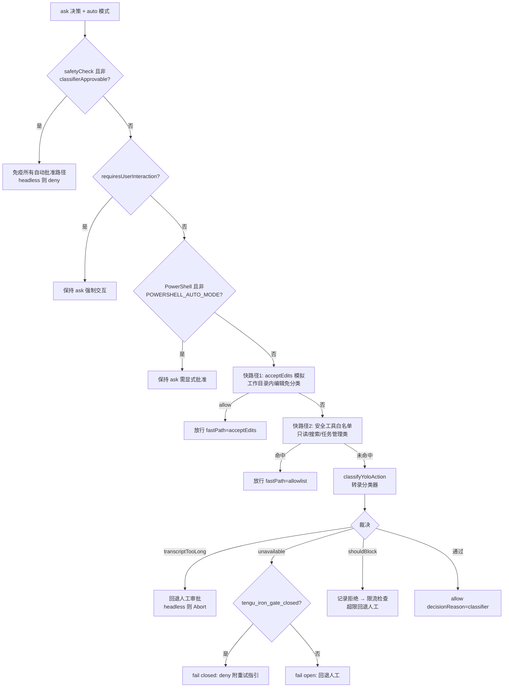

本文档深入解析 Claude Code 权限模型的完整架构。权限系统是一个**分层防御体系**：顶层是六种权限模式构成的状态机，中层是带来源追踪的规则解析引擎（`allow`/`deny`/`ask` 三种行为），底层则是两条独立的 AI 分类器路径——Bash 语义分类器（prompt 规则匹配）与自动模式的转录分类器（YOLO classifier）。整个系统围绕一个不可变的 `ToolPermissionContext` 运转，通过 13 步判定管线产出最终决策。理解这一架构需要把握一个核心设计张力：**模式切换的便利性 vs 规则的不可绕过性**——`bypassPermissions` 模式甚至也无法穿透内容级 ask 规则与安全检查（safetyCheck）。

阅读本文需预先了解 [Tool 接口契约：输入校验、权限决策、进度回调与 Ink UI 渲染](10-tool-jie-kou-qi-yue-shu-ru-xiao-yan-quan-xian-jue-ce-jin-du-hui-tiao-yu-ink-ui-xuan-ran)中定义的 `checkPermissions` 回调与 [应用状态管理：AppState Store、Selectors 与 React Context](17-ying-yong-zhuang-tai-guan-li-appstate-store-selectors-yu-react-context)中的 AppState 结构。命令层面的危险检测与路径保护细节在[命令安全分析：危险命令检测、只读校验、沙箱与路径保护](20-ming-ling-an-quan-fen-xi-wei-xian-ming-ling-jian-ce-zhi-du-xiao-yan-sha-xiang-yu-lu-jing-bao-hu)中单独展开。

## 架构总览：分层防御体系

在深入各组件之前，先建立全局认知。权限模型的核心数据流是：模型发出工具调用 → `hasPermissionsToUseTool` 入口执行判定管线 → 产出 `PermissionDecision`（`allow`/`ask`/`deny`）→ 若为 `ask` 则按会话类型分发给交互/协调者/Swarm 工人三类处理器。判定管线内部，规则引擎与模式状态机交织运行，而自动模式在管线出口处对 `ask` 决策进行"拦截改写"——用 AI 分类器替代人工确认。

上图展示的管线顺序经过了刻意的安全设计：**deny/ask 规则与安全检查在 bypass 模式判定之前执行**，确保显式配置的规则无法被任何模式穿透。自动模式则作为出口变换存在——它在规则层全部放行后才介入，这意味着规则系统对自动模式同样具有约束力。

Sources: [permissions.ts](utils/permissions/permissions.ts#L473-L520), [useCanUseTool.tsx](hooks/useCanUseTool.tsx#L27-L37)

## 权限模式：状态机与切换语义

权限模式被拆分为**外部模式**（可跨会话持久化的五种）与**内部模式**（附加 ant-only 的 `auto` 与 `bubble`）。`auto` 模式由编译期特性门控 `feature('TRANSCRIPT_CLASSIFIER')` 控制——它仅在内部构建中进入运行时校验集合 `INTERNAL_PERMISSION_MODES`，外部构建通过 Bun 死代码消除将其彻底排除。类型定义被提取到独立文件 `types/permissions.ts` 以打破循环依赖，实现文件通过 re-export 保持向后兼容。

| 模式 | 归属 | 符号 | 颜色语义 | 核心行为 |
|---|---|---|---|---|
| `default` | 外部 | （无） | text | 每次敏感操作询问 |
| `acceptEdits` | 外部 | `⏵⏵` | autoAccept | 工作目录内文件编辑自动允许 |
| `plan` | 外部 | `PAUSE_ICON` | planMode | 只读规划，变更需审批 |
| `bypassPermissions` | 外部 | `⏵⏵` | error | 跳过绝大多数权限检查 |
| `dontAsk` | 外部 | `⏵⏵` | error | 将 ask 转换为 deny（非 allow） |
| `auto` | 内部（ant-only） | `⏵⏵` | warning | AI 分类器替代人工审批 |

模式的可配置性受到远程环境约束：`CLAUDE_CODE_REMOTE` 场景下，settings 中的 `defaultMode` 仅接受 `acceptEdits`/`plan`/`default`——`bypassPermissions` 若被静默采纳，将在远程环境中授予完全访问权。模式切换 UI（Shift+Tab 轮播）的语义在 `getNextPermissionMode` 中实现为一个条件状态机，其关键分叉在于用户类型：**ant 用户跳过 `acceptEdits` 与 `plan`，`auto` 模式取代了它们的位置**；外部用户走 `default → acceptEdits → plan → bypassPermissions → default` 的经典循环。

轮播到 `auto` 的前置条件 `canCycleToAuto` 同时检查两处状态：缓存的 `ctx.isAutoModeAvailable`（启动时由 `verifyAutoModeGateAccess` 填充）与实时的 `isAutoModeGateEnabled()`。二者可能在会话中途分叉（熔断器触发或设置变更），实时检查的存在是为了防止 `transitionPermissionMode` 内部的 throw 静默击穿 Shift+Tab 处理器，导致用户卡死在当前模式——这是一个典型的防御性编程案例。

Sources: [types/permissions.ts](types/permissions.ts#L16-L38), [PermissionMode.ts](utils/permissions/PermissionMode.ts#L42-L91), [getNextPermissionMode.ts](utils/permissions/getNextPermissionMode.ts#L17-L79), [permissionSetup.ts](utils/permissions/permissionSetup.ts#L743-L771)

### 模式切换的统一副作用中心

所有激活路径（CLI Shift+Tab、SDK 控制消息、`--permission-mode` 参数）共享同一个转换函数 `transitionPermissionMode`，它将副作用集中化以保证行为一致性。对 `auto` 模式而言，进入时执行三件事：验证门控开启、置位 `setAutoModeActive(true)`、**剥离危险权限规则**；退出时反向执行恢复。一个微妙的状态判定是"plan 模式中 auto 仍激活"——代码注释明确指出 `isAutoModeActive()` 是唯一权威信号，而 `prePlanMode`/`strippedDangerousRules` 字段并不可靠，因为 auto 可能通过 `transitionPlanAutoMode` 在 plan 中途被关闭而那些字段仍残留旧值。

`fromUsesClassifier` 的计算 `(fromMode === 'auto' || (fromMode === 'plan' && isAutoModeActive()))` 正是上述权威信号的应用：plan 模式本身不算"使用分类器"，除非 auto 在其中保持激活。启动时的模式初始化遵循优先级链 `--dangerously-skip-permissions > --permission-mode > settings defaultMode`，每级都经过禁用校验（bypass 可被 GrowthBook 门或组织设置禁用，auto 需通过同步熔断检查），最终若落到 `auto` 则直接置位激活标志。

Sources: [permissionSetup.ts](utils/permissions/permissionSetup.ts#L597-L646), [permissionSetup.ts](utils/permissions/permissionSetup.ts#L689-L811)

## 权限上下文：ToolPermissionContext 的不可变结构

整个权限系统的运行时状态被封装在 `ToolPermissionContext` 中，以 `DeepImmutable` 包装后存放于 AppState。其结构设计反映了几个关键决策：规则按**来源 × 行为**双维组织（`alwaysAllowRules[source]` 的字符串数组），便于规则的精确增删与来源显示；`strippedDangerousRules` 是 auto 模式剥离规则的暂存区，退出时原样恢复；`shouldAvoidPermissionPrompts` 为后台代理（无法显示 UI）将提示自动转为拒绝。

| 字段 | 类型 | 职责 |
|---|---|---|
| `mode` | `PermissionMode` | 当前权限模式 |
| `alwaysAllowRules/DenyRules/AskRules` | `Record<source, string[]>` | 三种行为规则按来源分组 |
| `isBypassPermissionsModeAvailable` | `boolean` | bypass 是否可进入（受组织策略约束） |
| `isAutoModeAvailable` | `boolean?` | auto 可用性缓存（启动时异步填充） |
| `strippedDangerousRules` | `Record<source, string[]>?` | auto 模式剥离规则暂存 |
| `shouldAvoidPermissionPrompts` | `boolean?` | 无 UI 上下文的自动拒绝 |
| `prePlanMode` | `PermissionMode?` | plan 进入前模式，退出时恢复 |

规则的**来源枚举**是理解权限继承的关键：`userSettings`（用户全局）、`projectSettings`（项目共享）、`localSettings`（项目本地不入库）、`flagSettings`/`policySettings`（托管策略，只读）、`cliArg`（会话级 CLI 参数）、`command`（命令注入）、`session`（会话内存）。托管策略可通过 `allowManagedPermissionRulesOnly` 开关垄断规则来源——启用后仅 `policySettings` 的规则生效，同时权限提示中的"always allow"选项被隐藏，这是企业治理的强制收敛点。

Sources: [Tool.ts](Tool.ts#L123-L148), [types/permissions.ts](types/permissions.ts#L54-L61), [permissionsLoader.ts](utils/permissions/permissionsLoader.ts#L28-L44)

## 规则模型与解析器：语法、转义与别名

权限规则采用 `ToolName(content)` 的文本语法，规则值被解析为 `{toolName, ruleContent?}` 结构。解析器 `permissionRuleValueFromString` 处理四种边界：无括号（纯工具名规则）、内容含转义括号（`Bash(python -c "print\(1\)")`）、空内容或通配（`Bash()`/`Bash(*)` 归一化为纯工具名规则）、格式畸形（整体视为工具名）。转义算法的顺序敏感——先转义反斜杠再转义括号，逆序解转义；判定"未转义字符"的标准是其前缀反斜杠数量为偶数。

**遗留工具名别名表**是规则系统的兼容层：`Task → Agent`、`KillShell → TaskStop`、`AgentOutputTool/BashOutputTool → TaskOutputTool`。工具重命名时在表中追加映射，持久化的 wire 格式规则即自动解析到规范名——这避免了历史 settings 文件的迁移成本。值得注意的是，ant-only 的别名（如 `Brief`）通过条件 `require` 引入，保证工具名字符串不泄漏到外部构建产物。

对规则内容的**来源附加处理**同样存在于解析层之外：`createPromptRuleContent` 生成 `prompt: <描述>` 格式的内容，这是 Bash 分类器语义规则的存储形态，前缀 `PROMPT_PREFIX` 在加载时被 `extractPromptDescription` 逆向提取。

Sources: [permissionRuleParser.ts](utils/permissions/permissionRuleParser.ts#L21-L41), [permissionRuleParser.ts](utils/permissions/permissionRuleParser.ts#L93-L133), [bashClassifier.ts](utils/permissions/bashClassifier.ts#L14-L22)

### Shell 规则的三态匹配

Shell 工具（Bash/PowerShell）的规则内容被解析为判别联合 `ShellPermissionRule`：`exact`（全字符串匹配）、`prefix`（遗留 `:*` 语法，如 `npm:*`）、`wildcard`（新式通配符，如 `git *`）。通配匹配 `matchWildcardPattern` 将模式编译为正则——未转义 `*` 转 `.*`，`\*` 与 `\\` 分别匹配字面量星号与反斜杠（编译期用 null 字节占位符避免二次转义歧义）。一个语义对齐修正：以 `" *"` 结尾且**仅含一个**通配符的模式（如 `git *`），其尾部空格与参数被设为可选，从而与 `git:*` 前缀规则语义一致（同时匹配 `git add` 与裸 `git`）；多通配符模式（`* run *`）被排除，否则 `npm run` 会被错误放行。

Sources: [shellRuleMatching.ts](utils/permissions/shellRuleMatching.ts#L25-L78), [shellRuleMatching.ts](utils/permissions/shellRuleMatching.ts#L90-L154)

### 磁盘加载与托管控衡

规则从设置文件的 `permissions.allow/deny/ask` 数组加载，`loadAllPermissionRulesFromDisk` 遍历所有启用来源拼接。编辑路径有一个关键区分：追加规则时使用**宽松解析**（跳过 schema 校验，避免无关字段如 hooks 的校验失败导致既有规则丢失），而执行读取必须走严格校验——函数名 `getSettingsForSourceLenient_FOR_EDITING_ONLY_NOT_FOR_READING` 以极强硬的命名表达这一纪律。规则更新通过 `PermissionUpdate` 判别联合（`addRules`/`replaceRules`/`removeRules`/`setMode`/目录增删）驱动，`applyPermissionUpdate` 是纯函数，对 context 做不可变更新并携带调试日志。

Sources: [permissionsLoader.ts](utils/permissions/permissionsLoader.ts#L53-L114), [PermissionUpdate.ts](utils/permissions/PermissionUpdate.ts#L55-L119)

## 核心判定管线：13 步的精确定序

`hasPermissionsToUseToolInner` 是权限决策的心脏，其步骤序号被代码注释显式标注（1a、1b、1c…2a、2b、3），每一步的顺序都承载安全语义：

| 步骤 | 检查内容 | 产出 | 关键约束 |
|---|---|---|---|
| 1a | 整工具 deny 规则 | deny | 最高优先级拦截 |
| 1b | 整工具 ask 规则 | ask | Bash 沙箱自动允许例外可穿透 |
| 1c | `tool.checkPermissions` | 工具自定义 | 输入先经 schema parse |
| 1d | 工具实现 deny | deny | 捕获子命令级拒绝 |
| 1e | `requiresUserInteraction` | 保持 ask | bypass 下仍强制交互 |
| 1f | 内容级 ask 规则 | 保持 ask | **bypass 免疫** |
| 1g | safetyCheck | 保持 ask | **bypass 免疫**（.git/、.claude/ 等） |
| 2a | bypassPermissions 模式 | allow | 含 plan+bypass 可用组合 |
| 2b | 整工具 allow 规则 | allow | 规则放行 |
| 3 | passthrough → ask | ask | 附带建议规则 |

三个设计要点值得展开。**其一，1f/1g 的 bypass 免疫性**：用户显式配置 `Bash(npm publish:*)` 的 ask 规则，或工具安全检查标记的敏感路径，即使在 `bypassPermissions` 模式下也必须提示——deny 规则与 ask 规则在"不可绕过"这一点上被刻意对齐，因为绕过 ask 规则等于让用户的显式配置失效。**其二，1b 的沙箱例外**：当 `autoAllowBashIfSandboxed` 开启且命令可被沙箱化时，整工具 ask 规则被跳过，交由 Bash 自身的 `checkPermissions` 处理命令级规则——沙箱本身就是一种权限边界，其内的命令无需再问。**其三，`checkRuleBasedPermissions` 的独立导出**：它复刻了步骤 1a–1g（不含 2a 及之后），专供 `bypassPermissions` 模式使用——bypass 尊重规则层的拒绝，但跳过模式变换、分类器与 allow 检查。

工具级规则查询通过三个对称函数完成：`toolAlwaysAllowedRule`/`getDenyRuleForTool`/`getAskRuleForTool` 均调用 `toolMatchesRule`，后者额外处理 **MCP 服务器级规则**——规则 `mcp__server1` 匹配工具 `mcp__server1__tool1`，`mcp__server1__*` 通配整个服务器；且在 SDK 的 skip-prefix 模式下，未加前缀的 MCP 工具名与内置工具碰撞时，规则匹配使用完整限定名以避免误伤。规则匹配中的性能优化也有迹可循：`filterDeniedAgents` 曾对每个代理重解析全部 deny 规则（O(agents×rules) 次解析），现改为一次性解析收集到 Set。

Sources: [permissions.ts](utils/permissions/permissions.ts#L1158-L1319), [permissions.ts](utils/permissions/permissions.ts#L1071-L1156), [permissions.ts](utils/permissions/permissions.ts#L238-L302), [permissions.ts](utils/permissions/permissions.ts#L325-L343)

### 决策原因的可观测性

每个决策携带 `decisionReason` 判别联合，类型覆盖 `rule`/`mode`/`classifier`/`hook`/`safetyCheck`/`workingDir`/`subcommandResults`/`permissionPromptTool`/`sandboxOverride`/`asyncAgent`/`other`。`createPermissionRequestMessage` 将其转译为用户可读的提示文案——例如复合命令拆解后哪些子命令需要审批、哪条规则来自哪个来源触发了询问。这套原因是权限解释器（`permissionExplainer`）与遥测分析（`tengu_auto_mode_decision` 事件的 `fastPath` 字段）的数据基础。

Sources: [permissions.ts](utils/permissions/permissions.ts#L137-L211)

## Bash 工具的专用规则管线

Bash 的 `checkPermissions` 委托给 `bashToolCheckPermission`，一条独立的 8 步管线：精确匹配规则的 deny/ask → 前缀规则的 deny/ask → 路径约束（工作目录边界）→ 精确 allow → 前缀 allow → sed 约束 → 模式特定处理 → 只读命令放行 → passthrough。其中**安全修复的痕迹**清晰可见：deny/ask 前缀规则被移到路径约束**之前**，堵住通过项目外绝对路径绕过规则的漏洞（HackerOne 报告）；AST 解析可用时直接传入 argv，绕过 shell-quote 单引号反斜杠 bug 导致路径校验被静默跳过的问题。

**前缀提取的保守策略**体现在 `getSimpleCommandPrefix`：跳过前导环境变量赋值仅当变量属于安全集（如 `NODE_ENV`），第二个 token 必须匹配子命令形态（小写字母数字与连字符，排除 flag/路径/数字），否则返回 null 回退精确匹配。这一保守性服务于一个不变量：**建议生成的规则必须在检查时可命中**——若 `stripSafeWrappers` 不会剥离某变量，则生成 `Bash(npm run:*)` 前缀规则就是永远无法匹配的死规则。同理，`BARE_SHELL_PREFIXES` 阻止为 `bash`/`sh`/`env`/`sudo`/`nice` 等生成前缀建议：`nice:*` 等价于 `Bash(*)`，因为语义层会剥离 wrapper 检查被包裹的命令，而 deny 门只看到 `nice`。

Sources: [bashPermissions.ts](tools/BashTool/bashPermissions.ts#L1050-L1178), [bashPermissions.ts](tools/BashTool/bashPermissions.ts#L146-L188), [bashPermissions.ts](tools/BashTool/bashPermissions.ts#L190-L264)

## Bash 分类器：prompt 规则的语义匹配

Bash 分类器解决的是**字符串规则无法表达意图**的问题：`Bash(prompt: 从 package.json 读取依赖列表)` 这样以自然语言描述的规则，无法用前缀/通配符匹配，需要一个小模型判断命令语义是否符合描述。规则内容以 `prompt:` 前缀存储，`getBashPromptAllowDescriptions` 从 context 的 allow 规则中提取描述列表，`classifyBashCommand` 将命令、工作目录与描述列表送入分类 API，返回 `{matches, matchedDescription, confidence, reason}`。

**外部构建中的这一能力是桩实现**：`bashClassifier.ts` 的所有函数返回空集或 `false`，注释标明"classifier permissions feature is ANT-ONLY"。真正的实现通过编译期特性门控（`feature('BASH_CLASSIFIER')`）与条件 require 注入，分类器核心基础设施（工具块提取、响应 schema 校验）在 `classifierShared.ts` 中共享给 YOLO 分类器。

分类器的执行时序设计是本模块的精华——**三类执行模式**按场景选择：

| 模式 | 入口函数 | 触发时机 | 决策语义 |
|---|---|---|---|
| 投机检查 | `startSpeculativeClassifierCheck` | 权限提示渲染前预启动 | 结果存入 Map，后续消费免二次调用 |
| 异步竞速 | `executeAsyncClassifierCheck` | 权限对话框显示期间后台运行 | 高置信度 allow 且用户未交互 → 自动批准 |
| 前置门控 | `awaitClassifierAutoApproval` | Swarm worker 转发权限给 leader 之前 | 分类器通过则本地放行，否则升级 |

异步竞速模式的取消安全处理值得注意：`shouldContinue()` 回调在用户已按键或已做决定时阻止覆盖；投机 Promise 预挂 `catch(() => {})` 防止 abort 导致 unhandled rejection，原始 Promise 仍保留在 Map 中供消费者 await。自动批准的条件被严格限定为 `matches && confidence === 'high'`，决策原因标记为 `classifier: 'bash_allow'` 并附命中的描述文本。

Sources: [bashClassifier.ts](utils/permissions/bashClassifier.ts#L1-L62), [classifierShared.ts](utils/permissions/classifierShared.ts#L15-L39), [bashPermissions.ts](tools/BashTool/bashPermissions.ts#L1491-L1658)

## 自动模式：门控、转录分类器与降级链

自动模式（auto）是权限模型中最复杂的子系统，它用**转录分类器**替代人工审批：将当前会话的消息历史（用户文本 + 助手工具调用）与待分类动作组装成提示词，通过 `sideQuery` 调用一个温度为 0 的旁路模型，强制其调用 `classify_result` 工具输出结构化裁决 `{thinking, shouldBlock, reason}`。

### 门控体系：三重可用性检查

进入 auto 模式受三重门控约束，任一失败即不可用：**设置禁用**（`permissions.disableAutoMode` 等）、**熔断器**（GrowthBook `tengu_auto_mode_config.enabled === 'disabled'`，事故响应开关）、**模型支持**（主循环模型必须支持 auto）。`verifyAutoModeGateAccess` 在 GrowthBook 初始化后异步执行一次权威检查，其结果回写 `autoModeState` 模块的熔断标志；同步路径（CLI 初始化）使用可能过期的缓存，异步路径负责纠偏。`enabled` 字段的三态语义——`enabled`（轮播可用）、`disabled`（完全禁用）、`opt-in`（仅显式选择者可用）——与本地 opt-in 来源（CLI 标志或 `skipAutoPermissionPrompt` 设置）共同决定轮播可见性 `carouselAvailable`，而显式进入（`--permission-mode auto`）本身即视为 opt-in，仅受熔断器/设置/模型约束。附加的 `disableFastMode` 临时熔断器在 fast 模式开启时阻止 auto（ant 构建还检查模型名含 `-fast`）。

模块级状态被隔离在 `autoModeState.ts`，由三个布尔量构成：`autoModeActive`（当前激活）、`autoModeFlagCli`（CLI 意图传递）、`autoModeCircuitBroken`（熔断）。隔离的动机是让调用方可以在特性关闭时完全不 require 该模块，配合死代码消除。

Sources: [permissionSetup.ts](utils/permissions/permissionSetup.ts#L1078-L1130), [permissionSetup.ts](utils/permissions/permissionSetup.ts#L1283-L1301), [autoModeState.ts](utils/permissions/autoModeState.ts#L1-L40)

### 判定管线出口的分类器路径

回到 `hasPermissionsToUseTool` 的出口变换：当结果为 `ask` 且模式为 `auto`（或 plan 中 auto 激活），依次执行五层快慢路径，**每一层都在避免调用昂贵的分类器 API**：

快路径的排除名单揭示了深层安全考量：**Agent 与 REPL 工具被排除在 acceptEdits 快路径之外**，因为它们的 `checkPermissions` 在 acceptEdits 下直接返回 allow，会静默绕过分类器——而 REPL 代码可在内部工具调用之间嵌入 VM 逃逸代码，分类器必须看到胶水 JavaScript 而非仅内部工具调用。`classifierApprovable` 标志则区分了 safetyCheck 的两种情况：敏感文件路径检查可交由分类器裁量，其余安全检查对所有自动批准路径免疫。PowerShell 在 `POWERSHELL_AUTO_MODE` 关闭时被整体挡在分类器外，需显式用户批准——但其 allow 规则保护在 `permissionSetup` 层处理（剥离 `PowerShell(*)` 过宽规则与 `iex` 等危险前缀）。

Sources: [permissions.ts](utils/permissions/permissions.ts#L518-L700), [classifierDecision.ts](utils/permissions/classifierDecision.ts#L50-L98)

### 分类器提示词的组装与缓存策略

`buildYoloSystemPrompt` 用**模板替换**组装系统提示词：基础提示词（`auto_mode_system_prompt.txt`，编译期内联为字符串）中的 `<permissions_template>` 占位符被外部或 Anthropic 内部模板填充，随后三个 `<user_*_to_replace>` 标签段被用户配置替换。外部模板的默认值包裹在标签**内部**（用户值整体替换默认），Anthropic 模板则将默认值置于标签外、末尾留空标签对（用户值**严格增量**追加）——同一分隔符模式承载两种合并语义。allow 列表合并了 Bash prompt 规则描述（仅内部构建且非外部模板时）与 `settings.autoMode.allow`，deny 列表额外合并 PowerShell 拒绝指引。

**缓存断点布局**经过 API 约束下的精细计算：系统提示词（1）+ CLAUDE.md 消息（0–1）+ 动作块（1）= 2–3 个 `cache_control` 块，低于 API 上限 4。动作块的缓存断点是两阶段分类器的关键——阶段 2 与阶段 1 共享相同的转录+动作前缀，此断点保证阶段 2 对完整前缀的缓存命中。CLAUDE.md 被包装为 `<user_claude_md>` 标签的 user 消息，明示这是用户意图的一部分；其内容从 bootstrap 状态缓存读取而非直接导入 claudemd 模块，以打断 `claudemd → permissions/filesystem → permissions → yoloClassifier` 的循环依赖。

**两阶段 XML 分类器**（GrowthBook 可开启）提供了 tool-call 之外的输出协议：阶段 1 追加后缀 "Err on the side of blocking. `<block>` immediately" 争取即时裁决，阶段 2 追加要求复查分类流程的后缀并用 `<thinking>` 引导推理；解析前剥离 thinking 内容，防止思维链内的 `<block>` 标签被误匹配。转录投影（transcript projection）从消息列表构建：仅保留 user 文本块与 assistant 的 tool_use 块（丢弃 assistant 文本），排队命令附件被展开为 user 轮次——每个工具通过 `toAutoClassifierInput` 契约控制暴露给分类器的字段，空串表示"无分类相关输入"直接放行（同时规避空块+cache_control 触发 API 400）。

Sources: [yoloClassifier.ts](utils/permissions/yoloClassifier.ts#L444-L540), [yoloClassifier.ts](utils/permissions/yoloClassifier.ts#L550-L584), [yoloClassifier.ts](utils/permissions/yoloClassifier.ts#L1012-L1130)

### 拒绝限流与降级链

分类器的失败处理构成一条完整的降级链，每级都有明确定义的行为：**转录超长**（确定性 API 400，重试无益）→ 交互会话回退人工审批，headless 直接 AbortError（拒绝-重试-拒绝循环只浪费 token，永远到不了拒绝限流的 abort）；**分类器不可用**（API 错误）→ 由 `tengu_iron_gate_closed` 门（默认 true，30 分钟缓存刷新）决定 fail closed（deny 并附重试指引）或 fail open（回退人工）；**分类器阻止动作** → 记录拒绝并检查限流。

拒绝限流的状态机极其简洁：`DENIAL_LIMITS = {maxConsecutive: 3, maxTotal: 20}`，任何一次成功（含规则放行的 allow）清零连续计数，总数累计不清零。超限后 `handleDenialLimitExceeded` 将 ask 决策附上分类器警告回退人工审批——用户可以看到分类器的阻止原因并自行裁决。异步子代理使用 `localDenialTracking`（其 setAppState 是 no-op），主会话读取 `appState.denialTracking`，二者通过 context 字段统一分发。

Sources: [permissions.ts](utils/permissions/permissions.ts#L818-L899), [denialTracking.ts](utils/permissions/denialTracking.ts#L12-L46)

### 危险权限剥离：进入 auto 的强制收窄

进入 auto 模式时，`stripDangerousPermissionsForAutoMode` 遍历全部 allow 规则，`findDangerousClassifierPermissions` 识别会**绕过分类器**的过宽或危险规则（如 `Bash(python:*)` 可执行任意代码、`Agent(*)` 放行所有子代理），将其从 context 移除并存入 `strippedDangerousRules` 暂存区。对应的危险判定函数族包括 `isDangerousBashPermission`/`isDangerousPowerShellPermission`/`isDangerousTaskPermission` 与过宽检测 `isOverlyBroadBashAllowRule`/`isOverlyBroadPowerShellAllowRule`。退出 auto 时 `restoreDangerousPermissions` 从暂存区原样恢复，用户在 default 模式下的规则重新生效。暂存内容与实际移除内容镜像同一来源过滤器，保证"存了什么就恢复什么"。

这一设计的逻辑闭环在于：allow 规则在管线步骤 2b 早于分类器执行，一条 `Bash(python:*)` 的 allow 规则会让任意 Python 代码跳过分类器——auto 模式的安全承诺因此要求剥离。被剥离规则的来源显示在调试日志中，用户可通过 `/permissions` 查看。

Sources: [permissionSetup.ts](utils/permissions/permissionSetup.ts#L510-L579), [permissionSetup.ts](utils/permissions/permissionSetup.ts#L94-L258)

## 入口编排：三类会话的分发

`useCanUseTool`（React hook 形态的 `CanUseToolFn`）是权限系统与工具执行器的接缝。它首先用 `forceDecision` 短路（用于用户在权限对话框的即时选择），否则调用 `hasPermissionsToUseTool`。`allow` 直接 resolve 并记录 accept 事件；**auto 模式分类器放行的 allow** 额外调用 `setYoloClassifierApproval` 更新 UI 中的批准标识；**auto 模式的 deny** 触发 `recordAutoModeDenial` 记录并推送即时错误通知。`ask` 决策按 `ctx` 的会话类型三路分发。

交互处理器 `handleInteractivePermission` 是三者中最复杂的：将确认条目推入队列，回调集合包括 `onAbort`/`onAllow`/`onReject`/`recheckPermission`/`onUserInteraction`；后台异步运行权限钩子与 Bash 分类器检查，**与用户交互竞速**——resolve-once 守卫与 `userInteracted` 标志防止多重 resolve。它同时对接 Bridge（远程控制）与 Channel（Slack 等）的权限回调：Bridge 请求生成 UUID 追踪，本地/钩子/分类器的先行解决需移除 pending 的 channel 条目（远程侧无"撤回已发消息"的等价物，滞留的确认回复会作为普通聊天重新入队）。协调者与 Swarm 工人处理器分别服务[子代理与后台任务框架](25-zi-dai-li-yu-hou-tai-ren-wu-kuang-jia-agenttool-localagenttask-yu-ren-wu-zhuang-tai-jian-kong)与[Swarm 团队协作](26-swarm-tuan-dui-xie-zuo-jin-cheng-nei-teammate-xiao-xi-you-xiang-yu-quan-xian-tong-bu)场景，后者正是 `awaitClassifierAutoApproval` 的调用方。

Sources: [useCanUseTool.tsx](hooks/useCanUseTool.tsx#L27-L90), [interactiveHandler.ts](hooks/toolPermission/handlers/interactiveHandler.ts#L43-L80)

## 相关阅读

- **下一步**：[命令安全分析：危险命令检测、只读校验、沙箱与路径保护](20-ming-ling-an-quan-fen-xi-wei-xian-ming-ling-jian-ce-zhi-du-xiao-yan-sha-xiang-yu-lu-jing-bao-hu)——本文判定管线中步骤 1c 所调用的工具安全检查（危险模式、只读校验、路径保护）的实现细节。
- **上游依赖**：[Tool 接口契约：输入校验、权限决策、进度回调与 Ink UI 渲染](10-tool-jie-kou-qi-yue-shu-ru-xiao-yan-quan-xian-jue-ce-jin-du-hui-tiao-yu-ink-ui-xuan-ran)——`checkPermissions` 回调契约与 `toAutoClassifierInput` 的定义位置。
- **上下文延伸**：[工具执行编排：StreamingToolExecutor、并发控制与工具钩子](12-gong-ju-zhi-xing-bian-pai-streamingtoolexecutor-bing-fa-kong-zhi-yu-gong-ju-gou-zi)——`CanUseToolFn` 在执行编排中的调用位置与并发语义。
- **状态承载**：[应用状态管理：AppState Store、Selectors 与 React Context](17-ying-yong-zhuang-tai-guan-li-appstate-store-selectors-yu-react-context)——`toolPermissionContext` 与 `denialTracking` 在全局状态中的组织方式。
- **构建约束**：[构建体系与特性门控：Bun 编译期特性标记与死代码消除](4-gou-jian-ti-xi-yu-te-xing-men-kong-bun-bian-yi-qi-te-xing-biao-ji-yu-si-dai-ma-xiao-chu)——本文大量出现的 `feature('TRANSCRIPT_CLASSIFIER')` 条件 require 的编译期机制。