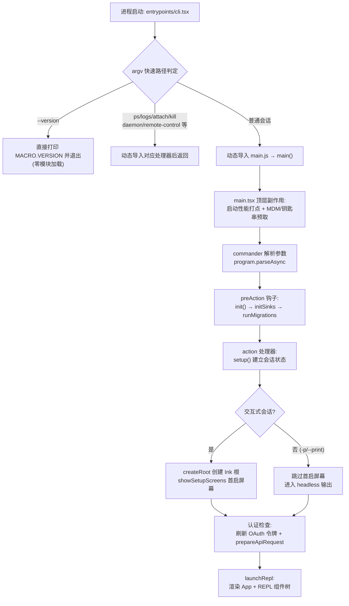

本页是您进入这个代码库的第一站：它回答三个问题——**这份代码需要什么环境**、**官方 CLI 如何安装与验证**、**从敲下 `claude` 命令到看见交互界面的完整链路走过了哪些文件**。全文面向初学者，每一步都标注了源码位置，您可以边读边对照代码验证。读完本页，您将能独立完成环境搭建、通过诊断命令验证安装，并准确说出启动路径上每个模块的职责。

## 一、开始之前：认识这份代码的形态

在动手之前，必须先建立一个关键认知：**本仓库是一个纯源码快照，而非可直接构建的工程**。根目录下没有 `package.json`、`tsconfig.json` 或任何构建脚本，目录中只有 TypeScript/TSX 源文件。每个文件末尾都带有 base64 编码的 sourcemap 注释，且组件代码中出现了 `react/compiler-runtime` 运行时引用——这表明快照取自**经过 React Compiler 编译的构建产物形态**的源码树。

这带来两个直接影响：第一，您无法在本目录执行 `npm install` 或 `npm run build`，日常使用需安装官方发布的 CLI（见第三节）；第二，构建期的魔法以**代码内可见的形式**保留了下来——最典型的是 `import { feature } from 'bun:bundle'`，这是 Bun 打包器提供的**编译期特性门控函数**，构建时会把 `feature('FLAG')` 替换为常量真/假，从而让打包器剔除未启用的代码分支。同样，`MACRO.VERSION` 是构建期内联的版本号宏。这些机制的深度解析属于[构建体系与特性门控：Bun 编译期特性标记与死代码消除](4-gou-jian-ti-xi-yu-te-xing-men-kong-bun-bian-yi-qi-te-xing-biao-ji-yu-si-dai-ma-xiao-chu)页，本页只需记住：**快照中看到的 `feature(...)` 分支在发布版本中可能整个不存在**。

Sources: [cli.tsx](entrypoints/cli.tsx#L1-L5) · [Doctor.tsx](screens/Doctor.tsx#L1-L5) · [doctor.tsx](commands/doctor/doctor.tsx#L4-L7)

## 二、运行环境要求

**平台支持**由 `getPlatform()` 函数统一判定：macOS（`process.platform === 'darwin'`）直接识别为 `macos`；Linux 会读取 `/proc/version`，若内容包含 `microsoft` 或 `wsl` 标记则判定为 WSL，否则为普通 Linux。代码中声明的 `SUPPORTED_PLATFORMS` 数组仅包含 `['macos', 'wsl']`——即官方完整支持的平台是 **macOS 与 WSL**；Windows 原生与普通 Linux 虽有大量代码路径支持（如专用的 PowerShellTool、Windows 路径处理），但不在"官方支持"声明之列，属于尽力而为的兼容。

**运行时**方面，程序既能跑在 Node.js 上，也能跑在 Bun 上。判定逻辑很直接：`process.versions.bun !== undefined` 即为 Bun 运行时；若进一步检测到 `Bun.embeddedFiles` 数组非空，则说明当前是 **Bun 编译出的独立可执行文件**（即"原生安装"形态）。远程容器环境（`CLAUDE_CODE_REMOTE === 'true'`）下，入口代码还会自动为子进程追加 `--max-old-space-size=8192` 以适配 16GB 容器内存。此外，最低版本要求并非硬编码，而是由远程动态配置 `tengu_version_config` 下发，`assertMinVersion()` 在启动时比对并拒绝过旧版本。

| 检测项 | 判定方式 | 结果示例 |
|---|---|---|
| 操作系统 | `process.platform` | `darwin` / `win32` / `linux` |
| WSL | 读取 `/proc/version` 匹配 `microsoft`/`wsl` | `wsl` + WSL 版本号 |
| Bun 运行时 | `process.versions.bun` | 启用 Bun 专属路径 |
| 独立可执行 | `Bun.embeddedFiles.length > 0` | "原生安装"标识 |
| 容器环境 | `CLAUDE_CODE_REMOTE === 'true'` | 放大堆内存上限 |

Sources: [platform.ts](utils/platform.ts#L7-L49) · [bundledMode.ts](utils/bundledMode.ts#L7-L22) · [cli.tsx](entrypoints/cli.tsx#L7-L14) · [autoUpdater.ts](utils/autoUpdater.ts#L54-L80)

## 三、获取与安装：通道与验证

由于快照本身不可构建，**实际使用需安装官方发布物**。代码中的诊断模块 `doctorDiagnostic.ts` 完整枚举了官方分发渠道对应的安装类型，这也是 `claude doctor` 命令能够自动识别安装来源的依据。安装类型判定优先级为：先看 `NODE_ENV === 'development'`（开发模式），再看是否处于 Bun 打包模式，然后依次检测 npm 本地/全局路径与各系统包管理器痕迹。

| 安装类型 | 含义 | 识别依据 |
|---|---|---|
| `native` | Bun 编译的独立可执行文件 | `isInBundledMode()` 为真且无包管理器痕迹 |
| `package-manager` | 系统包管理器安装 | 检测到 homebrew / winget / mise / asdf / pacman / deb / rpm / apk |
| `npm-global` | npm 全局安装 | 可执行文件位于典型 `node_modules` 全局路径 |
| `npm-local` | 本地 npm 安装 | `isRunningFromLocalInstallation()` |
| `development` | 源码开发模式 | `NODE_ENV === 'development'` |
| `unknown` | 无法判定 | 兜底 |

安装完成后，**最快的验证方式**是版本快速路径：`claude --version`。这条命令在入口处被特判，零模块加载、直接输出构建期内联的 `MACRO.VERSION`——这也解释了为什么它比任何其他命令都快。更全面的验证则使用 `claude doctor`：它渲染 `Doctor` 屏幕，汇总安装类型、版本、安装路径、自动更新权限、多重安装检测，以及 ripgrep 状态（system / builtin / embedded 三种模式）等诊断信息。

Sources: [doctorDiagnostic.ts](utils/doctorDiagnostic.ts#L46-L52) · [doctorDiagnostic.ts](utils/doctorDiagnostic.ts#L86-L120) · [cli.tsx](entrypoints/cli.tsx#L33-L42) · [Doctor.tsx](screens/Doctor.tsx#L22-L31)

## 四、运行链路：从命令行到 REPL

这是本页的核心。**CLI 的启动是一个"漏斗式加载"过程**：先用极小的入口文件识别特判命令（快速路径），只有普通会话才加载庞大的主模块。理解这条链路，是阅读后续所有深度解析的地基。

先用一张流程图建立全局视野。图中的实线是普通交互会话的必经之路，虚线分支是快速路径——它们各自提前返回，不进入主模块：

分步拆解这条链路上的关键节点。**第一步：入口分流**。`entrypoints/cli.tsx` 是真正的进程入口，它刻意保持轻量——除 `--version` 外，所有分支（如 `daemon`、`ps`、`remote-control`、模板任务、tmux worktree 等）都通过 `await import(...)` 按需加载对应处理器，处理完即 `return`。没有任何特殊标志时，才执行 `await import('../main.js')` 调用完整 CLI。

**第二步：主模块的顶层副作用**。`main.tsx` 在任何逻辑执行前先做三件事：打点 `main_tsx_entry` 性能标记、启动 MDM（企业设备管理）子进程读取、预取 macOS 钥匙串凭据。注释明确说明这是刻意的并行化设计——让这些子进程与约 135ms 的模块导入时间重叠执行。

**第三步：commander 编排**。`main()` 函数首先设置 Windows 安全防护（`NoDefaultCurrentDirectoryInExePath`，防止当前目录命令劫持），然后构建 commander 程序。关键设计是 **`preAction` 钩子**：初始化逻辑（`init()`、日志 sink 挂载、数据迁移 `runMigrations()`）只在真正执行命令时运行，显示帮助时零开销。`init()` 内部依次完成配置系统启用（`enableConfigs`）、信任建立前的安全环境变量应用、以及自定义 CA 证书注入——后者必须在首次 TLS 握手前完成，因为 Bun 启动时就缓存了 TLS 证书库。

**第四步：会话建立与首启屏幕**。交互式会话中，action 处理器先经 `setup()` 完成会话状态初始化，然后创建 Ink 渲染根并调用 `showSetupScreens()`。认证就绪后，最终由 `launchRepl()` 动态导入 `App` 与 `REPL` 组件，通过 `renderAndRun` 渲染整棵组件树并等待退出。若运行时启用了启动剖析（见第八节），您还能在终端看到上述每个阶段的耗时报告。

Sources: [cli.tsx](entrypoints/cli.tsx#L287-L303) · [main.tsx](main.tsx#L1-L20) · [main.tsx](main.tsx#L585-L607) · [main.tsx](main.tsx#L902-L960) · [init.ts](entrypoints/init.ts#L57-L80) · [main.tsx](main.tsx#L2211-L2242) · [main.tsx](main.tsx#L3314-L3338) · [replLauncher.tsx](replLauncher.tsx#L12-L22)

## 五、首启屏幕：Onboarding、信任与登录

第一次交互式启动时，`showSetupScreens()` 会按序展示两类对话框。**Onboarding 向导**只在全局配置缺少主题或从未完成引导时出现（条件：`!config.theme || !config.hasCompletedOnboarding`），完成后 `completeOnboarding()` 向全局配置写入 `hasCompletedOnboarding: true` 与 `lastOnboardingVersion`。**信任对话框（TrustDialog）**则不同——它在每次交互会话中都可能出场：只要当前工作目录尚未通过 `checkHasTrustDialogAccepted()` 检查，就会弹出。源码注释强调了它的安全语义：这是工作区信任边界，用于警告不可信仓库并检查 CLAUDE.md 的外部引用；`bypassPermissions` 模式只影响工具执行权限，**不豁免工作区信任**。非交互会话（`-p` 模式，典型如 CI/CD）则完全跳过这些屏幕——信任是隐式授予的，因此 `-p` 只应在您信任的目录中使用。

**认证有两条主路径**：OAuth 登录（向导内或 `/login` 命令触发 `ConsoleOAuthFlow`）与环境变量密钥（`ANTHROPIC_API_KEY`，或在 `--bare` 极简模式下强制要求此变量 / `apiKeyHelper`）。登录成功后的刷新逻辑值得关注：`/login` 会重置成本状态、非阻塞刷新远程托管设置与策略限制、清空用户缓存后刷新 GrowthBook 特性开关、注册受信设备，并递增 `authVersion` 触发依赖认证的数据重新拉取。

| 场景 | 触发条件 | 行为 |
|---|---|---|
| Onboarding 向导 | 无主题或未完成过引导 | 引导 + 登录，写 `hasCompletedOnboarding` |
| TrustDialog | 目录未通过信任检查 | 工作区信任确认 + CLAUDE.md 外部引用检查 |
| 跳过所有屏幕 | `-p`/`--print` 或 demo 模式 | 信任隐式授予，直接进入查询 |
| `--bare` 模式 | 显式传 `--bare` | 认证严格限定 `ANTHROPIC_API_KEY` 或 `apiKeyHelper` |

Sources: [interactiveHelpers.tsx](interactiveHelpers.tsx#L104-L140) · [interactiveHelpers.tsx](interactiveHelpers.tsx#L32-L38) · [auth.ts](utils/auth.ts#L232-L237) · [login.tsx](commands/login/login.tsx#L19-L58)

## 六、常用命令行参数速查

参数定义集中在 `main.tsx` 的 commander 链式调用中（单链超过 40 个选项）。默认行为是**启动交互式会话**；`-p/--print` 切换为非交互输出（适合管道与脚本）。以下按使用场景分类提炼初学者最常用的子集：

| 分类 | 参数 | 作用 |
|---|---|---|
| 会话恢复 | `-c, --continue` / `-r, --resume [id]` | 继续当前目录最近会话 / 按 ID 或选择器恢复 |
| 非交互 | `-p, --print` | 打印响应后退出（跳过信任对话框） |
| 输出控制 | `--output-format <fmt>` | `text` / `json` / `stream-json`（限 `-p`） |
| 模型 | `--model <model>` / `--fallback-model` | 指定模型 / 过载时回退 |
| 权限 | `--permission-mode <mode>` / `--dangerously-skip-permissions` | 会话权限模式 / 跳过全部权限检查（仅限无网沙箱） |
| 工具控制 | `--allowedTools` / `--tools` / `--disallowedTools` | 白名单 / 指定内置工具集 / 黑名单 |
| 上下文注入 | `--mcp-config` / `--settings` / `--add-dir` / `--agents` / `--plugin-dir` | MCP 配置 / 设置文件 / 额外目录 / 自定义代理 / 临时插件目录 |
| 系统提示 | `--system-prompt` / `--append-system-prompt` | 替换 / 追加系统提示词 |
| 极简模式 | `--bare` | 跳过 hooks、LSP、插件同步、CLAUDE.md 发现等约 30 项门控 |
| 调试 | `--verbose` / `--debug-to-stderr` / `--debug-file <path>` | 冗余输出 / 调试到 stderr / 调试写文件 |

除主命令外，程序还注册了一批**子命令**（在 `-p` 模式下跳过注册以加快启动）：`mcp add/list/get` 管理 MCP 服务器、`plugin install/list` 管理插件、`auth login/status/logout` 处理认证、`doctor` 诊断环境、`update`/`install`/`rollback` 管理版本。斜杠命令（会话内以 `/` 触发）是另一套体系，详见[斜杠命令体系：命令注册、参数解析与本地 JSX 命令模式](14-xie-gang-ming-ling-ti-xi-ming-ling-zhu-ce-can-shu-jie-xi-yu-ben-di-jsx-ming-ling-mo-shi)。

Sources: [main.tsx](main.tsx#L968-L1006) · [main.tsx](main.tsx#L3875-L3887) · [main.tsx](main.tsx#L4114-L4135) · [main.tsx](main.tsx#L4351-L4366)

## 七、配置目录与关键环境变量

所有用户级状态的根目录由 `getClaudeConfigHomeDir()` 决定：默认 `~/.claude`，可用 **`CLAUDE_CONFIG_DIR`** 环境变量整体重定向（测试环境常用它隔离状态；该函数按此变量做了 memoize 缓存）。会话记录按项目路径存储在其下的 `projects/` 子目录，团队数据在 `teams/` 下。设置文件本身有层级来源（user / project / local），可用 `--setting-sources` 精确控制加载哪些。

初学者最值得记住的环境变量汇总如下：

| 变量 | 作用 |
|---|---|
| `CLAUDE_CONFIG_DIR` | 重定向配置根目录（默认 `~/.claude`） |
| `ANTHROPIC_API_KEY` | API 密钥认证（`--bare` 模式下的唯一环境变量认证途径） |
| `CLAUDE_CODE_OAUTH_TOKEN` | OAuth 令牌直供（替代交互登录） |
| `CLAUDE_CODE_PROFILE_STARTUP` | 置 `1` 输出详细启动剖析报告 |
| `CLAUDE_CODE_SIMPLE` | `--bare` 内部使用的极简模式开关（约 30 处门控） |
| `CLAUDE_CODE_REMOTE` | 标记容器/远程环境，自动放大子进程堆内存 |
| `NODE_ENV` | `development` 时安装类型判定为开发模式 |

Sources: [envUtils.ts](utils/envUtils.ts#L5-L18) · [envUtils.ts](utils/envUtils.ts#L49-L65) · [cli.tsx](entrypoints/cli.tsx#L7-L14) · [doctorDiagnostic.ts](utils/doctorDiagnostic.ts#L86-L89)

## 八、环境自检与启动剖析

两个内建工具能帮您回答"我的环境到底发生了什么"。**`claude doctor`**（会话内亦可输入 `/doctor`）输出安装与健康全景：安装类型与路径、多重安装警告、自动更新权限、设置校验错误、MCP 解析警告、沙箱配置、代理定义目录状态，以及 ripgrep 可用性。**启动剖析器**则回答"启动慢在哪"：设置 `CLAUDE_CODE_PROFILE_STARTUP=1` 后，`profileCheckpoint` 打点会输出完整阶段报告（含内存快照），阶段定义包括 `import_time`（`cli_entry` → `main_tsx_imports_loaded`）、`init_time`、`settings_time` 与 `total_time`。即便不开启，官方构建默认对内部用户 100%、外部用户 0.5% 抽样上报启动耗时。启动性能优化的完整设计（预取并行化、快速路径裁剪）在[启动引导流程：main.tsx 入口、CLI 参数解析与启动性能优化](5-qi-dong-yin-dao-liu-cheng-main-tsx-ru-kou-cli-can-shu-jie-xi-yu-qi-dong-xing-neng-you-hua)页展开。

Sources: [doctor.tsx](commands/doctor/doctor.tsx#L4-L7) · [Doctor.tsx](screens/Doctor.tsx#L22-L31) · [startupProfiler.ts](utils/startupProfiler.ts#L1-L54)

## 九、常见问题排查

| 症状 | 可能原因 | 处理方式 |
|---|---|---|
| 提示需要登录但已设置密钥 | 密钥来源未被采用 | 检查 `ANTHROPIC_API_KEY` 是否生效；`--bare` 模式不读钥匙串与 OAuth |
| 每次 `claude` 都弹信任对话框 | 目录信任未通过 | 在 TrustDialog 中确认接受；`-p` 模式跳过但仅在信任目录使用 |
| 版本过旧被拒绝启动 | 远程 `minVersion` 配置 | `claude update` 升级（doctor 中可见 latest/stable 版本） |
| doctor 显示多重安装 | npm 与原生安装并存 | 按 doctor 的 recommendation 清理多余安装 |
| Windows 原生行为异常 | 平台不在 `SUPPORTED_PLATFORMS` | 首选 WSL；原生 Windows 路径为尽力兼容 |
| 启动缓慢 | 环境变量/设置异常 | `CLAUDE_CODE_PROFILE_STARTUP=1` 查看阶段耗时 |
| 无法在本仓库构建 | 快照无构建配置 | 本仓库用于阅读；安装官方发布物运行 |

Sources: [auth.ts](utils/auth.ts#L281-L288) · [autoUpdater.ts](utils/autoUpdater.ts#L54-L80) · [platform.ts](utils/platform.ts#L7-L10) · [startupProfiler.ts](utils/startupProfiler.ts#L49-L54)

## 十、下一步阅读

环境就绪后，建议沿目录顺序推进：先看[代码库结构导览：目录职责与模块地图](3-dai-ma-ku-jie-gou-dao-lan-mu-lu-zhi-ze-yu-mo-kuai-di-tu)建立目录级心智地图，再到[构建体系与特性门控：Bun 编译期特性标记与死代码消除](4-gou-jian-ti-xi-yu-te-xing-men-kong-bun-bian-yi-qi-te-xing-biao-ji-yu-si-dai-ma-xiao-chu)理解本页反复出现的 `feature()` 门控，随后进入 Deep Dive 的[启动引导流程：main.tsx 入口、CLI 参数解析与启动性能优化](5-qi-dong-yin-dao-liu-cheng-main-tsx-ru-kou-cli-can-shu-jie-xi-yu-qi-dong-xing-neng-you-hua)深挖启动链路——那正是本页流程图的纵向放大。