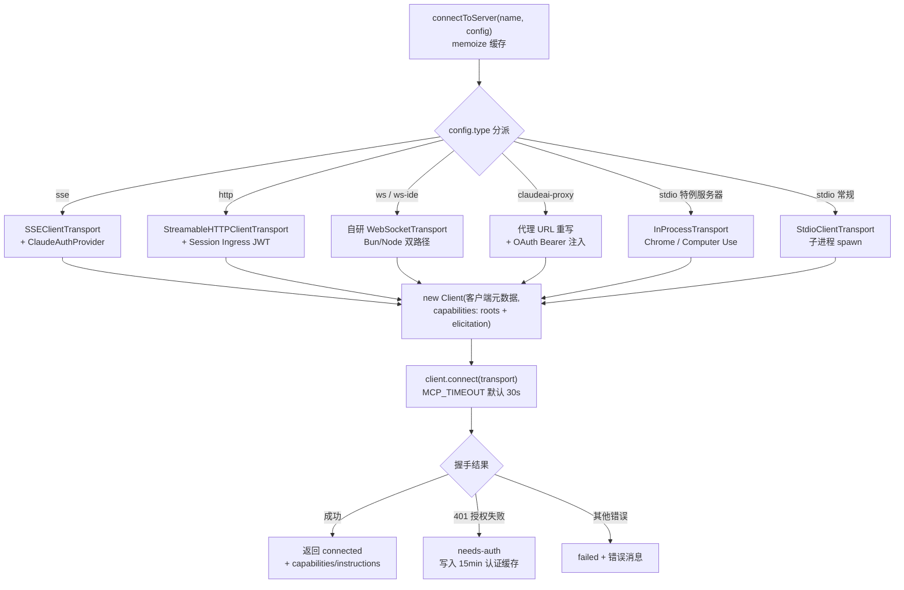
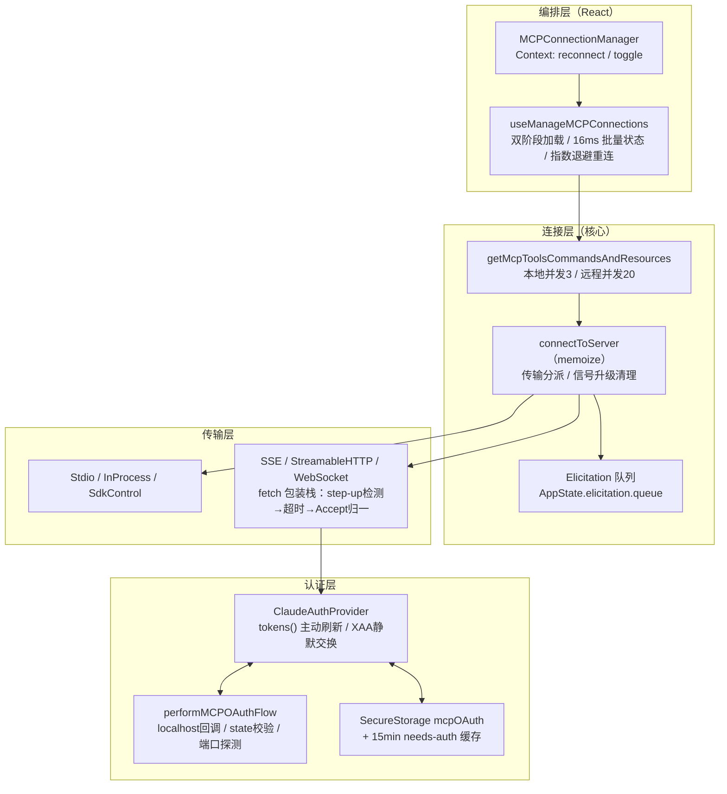

MCP（Model Context Protocol）是本 CLI 的核心扩展机制——它将外部工具、资源与斜杠命令注入到模型的上下文中。本文聚焦 `services/mcp/` 模块的客户端实现：从配置 Schema 到传输层选择、从连接编排到断线重连、从 OAuth 授权到 Elicitation 交互协议，完整剖析 Claude Code 如何将外部 MCP 服务器驯化为进程内的一等公民。插件系统对 MCP 的复用、Skills 与 Hooks 的协作机制属于后续页面范畴，此处仅在接口边界提及。

Sources: [client.ts](services/mcp/client.ts#L1-L145)

## 配置模型：八种服务器形态与连接状态机

MCP 子系统的类型基础由 `types.ts` 奠定。所有服务器配置通过 Zod 判别式联合（`McpServerConfigSchema`）建模，按 `type` 字段分派为八种形态，每种绑定不同的传输语义与安全边界：

| 配置类型 | 传输实现 | 典型来源 | 关键字段 |
|---|---|---|---|
| `stdio`（可省略） | `StdioClientTransport` 子进程 | `.mcp.json` / `claude mcp add` | `command`, `args`, `env` |
| `sse` | `SSEClientTransport` | 远程 MCP 网关 | `url`, `headers`, `oauth` |
| `http` | `StreamableHTTPClientTransport` | MCP 官方 Streamable HTTP | `url`, `headersHelper`, `oauth` |
| `ws` | 自研 `WebSocketTransport` | WebSocket MCP 服务器 | `url`, `headers` |
| `sse-ide` / `ws-ide` | SSE/WS + IDE 鉴权头 | IDE 扩展锁文件（内部专用） | `ideName`, `authToken` |
| `sdk` | `SdkControlClientTransport` | Agent SDK 进程内服务器 | `name` |
| `claudeai-proxy` | Streamable HTTP + claude.ai 代理 | claude.ai 远程连接器 | `id` |

`ScopedMcpServerConfig` 在配置之上叠加 `scope` 字段（`local`/`user`/`project`/`dynamic`/`enterprise`/`claudeai`/`managed`），标记配置的来源层级；插件提供的服务器还会预先固化 `pluginSource`，避免频道门控与插件状态水合产生竞态。`http`/`sse` 类型的 `oauth` 子对象支持预配置 `clientId`、固定 `callbackPort`、强制 HTTPS 的 `authServerMetadataUrl`，以及 XAA（Cross-App Access，SEP-990）开关——后者允许以共享 IdP 配置替代逐服务器授权握手。

连接本身以状态机建模：`MCPServerConnection` 是五态判别联合——`connected`（携带 `client`、`capabilities`、`instructions` 与 `cleanup`）、`failed`（携带错误消息）、`needs-auth`（等待用户 OAuth）、`pending`（含 `reconnectAttempt`/`maxReconnectAttempts` 重连进度）、`disabled`。这个联合类型贯穿整个生命周期：`connectToServer` 产出它，`useManageMCPConnections` 消费它，AppState 存储它，UI 按 `type` 渲染。

Sources: [types.ts](services/mcp/types.ts#L10-L56) · [types.ts](services/mcp/types.ts#L124-L226)

## 连接核心：connectToServer 的传输分派与客户端装配

`connectToServer` 是整个子系统的中枢函数，经 lodash `memoize` 包装、以 `` `${name}-${jsonStringify(serverRef)}` `` 为缓存键——同一配置的重复请求直接复用既有连接。函数主体是一个巨大的传输分派链，为每种 `type` 构造对应的 Transport 实例，随后装配统一的 MCP SDK `Client`：

装配 `Client` 时声明的 capabilities 精确而克制：`roots: {}` 让服务器能查询工作目录边界，`elicitation: {}` 声明支持交互式取值——注释特意指出发送 `{form:{},url:{}}` 会破坏 Java MCP SDK（Spring AI）的零字段 Elicitation 类反序列化。客户端随后注册 `ListRootsRequestSchema` 处理器，返回 `` `file://${getOriginalCwd()}` `` 作为根目录。

HTTP 类型连接前还有一次前置连通性探测（URL 解析与 DNS 日志），失败不阻断主流程，只为 `--debug` 输出提供诊断上下文。stdio 类型则先挂载 `stderr` 监听器，在连接启动前捕获服务器启动阶段的错误输出，累积上限 64MB 防止内存失控。

Sources: [client.ts](services/mcp/client.ts#L575-L641) · [client.ts](services/mcp/client.ts#L963-L1024)

### stdio：进程生命周期与信号升级

常规 stdio 服务器通过 `StdioClientTransport` 启动子进程，`env` 合并 `subprocessEnv()` 与服务器配置；`stderr: 'pipe'` 防止服务器错误直接污染终端 UI。特殊路径在于 `CLAUDE_CODE_SHELL_PREFIX`：设置后子进程命令被包装为 shell 前缀加单参数形式，用于代理注入场景。

stdio 的 `cleanup()` 实现了一套递进的信号升级协议——注释明确指出 `StdioClientTransport.close()` 只发送 abort 信号，而 Docker 容器化的 MCP 服务器需要显式 SIGINT/SIGTERM 才能优雅退出。序列为：SIGINT → 100ms 等待 → SIGTERM → 400ms 等待 → SIGKILL，期间以 50ms 间隔轮询 `process.kill(pid, 0)` 探测存活，600ms 绝对兜底确保 CLI 退出不被拖慢。

Sources: [client.ts](services/mcp/client.ts#L944-L958) · [client.ts](services/mcp/client.ts#L1426-L1570)

### 进程内服务器：链接传输对

两条特性门控路径避免为内置服务器 spawn 重量级子进程：Chrome MCP（约 325MB）与 Computer Use MCP（`CHICAGO_MCP` 特性标记）都通过 `createLinkedTransportPair()` 获得一对互指的 `InProcessTransport`——一侧的 `send()` 经 `queueMicrotask` 异步投递到对侧 `onmessage`，`close()` 双向联动。客户端传输交给 MCP `Client`，服务端传输交给进程内 `McpServer.connect()`，消息在微任务队列中流转，零 IPC 开销。

Sources: [client.ts](services/mcp/client.ts#L905-L943) · [InProcessTransport.ts](services/mcp/InProcessTransport.ts#L4-L63)

### SDK 桥接：跨进程控制通道

`sdk` 类型服务器运行在 SDK 宿主进程内，CLI 通过 `SdkControlClientTransport` 与之通信：`send()` 将 JSONRPC 消息连同 `server_name` 包装为控制请求，经 stdout 发往 SDK 进程，由其 StructuredIO 路由并回传响应。`setupSdkMcpClients` 并行连接所有 SDK 服务器（`Promise.allSettled`），生成的连接以 `scope: 'dynamic'` 标记，`ensureConnectedClient` 对其直接透传、不经过 `connectToServer` 缓存。

Sources: [SdkControlTransport.ts](services/mcp/SdkControlTransport.ts#L4-L37) · [client.ts](services/mcp/client.ts#L3254-L3329) · [client.ts](services/mcp/client.ts#L1688-L1704)

## 网络传输层：fetch 包装栈与超时策略

SSE 与 HTTP 传输不直接使用全局 `fetch`，而是叠加多层包装构成职责分明的包装栈。以 HTTP 类型为例，从内到外依次是：

1. **`createFetchWithInit()`**（SDK 提供）——将 `requestInit` 合入每次请求；
2. **`wrapFetchWithStepUpDetection`**——最内层，确保 403 在 SDK 的 403 处理器调用 `auth()` 之前被捕获；
3. **`wrapFetchWithTimeout`**——最外层，为每个非 GET 请求注入 60 秒超时。

`wrapFetchWithTimeout` 的存在动机有三重。其一是修复「陈旧 AbortSignal」缺陷：连接时创建的单个 `AbortSignal.timeout()` 在 60 秒后过期，导致后续请求立即失败。其二是 Bun 内存语义：`AbortSignal.timeout` 的内部定时器仅在信号被 GC 时释放，而 Bun 的 GC 是惰性的——即使请求毫秒级完成，每个请求仍残留约 2.4KB 原生内存直至 60 秒，故改用可 `clearTimeout` 的 `setTimeout` 并 `unref()`。其三是规范兜底：MCP Streamable HTTP 要求每次 POST 都声明 `Accept: application/json, text/event-stream`，但 SDK 设置的 Headers 实例在对象展开后可能被运行时丢弃，在包装栈末端归一化可确保其到达网络层。

GET 请求被显式排除在超时之外——MCP 传输中 GET 即长驻 SSE 流，本应无限期保持打开。SSE 类型的 `eventSourceInit` 同样使用不带超时的自定义 fetch：手工注入 Bearer token、合并代理选项与静态头，并以 `Accept: text/event-stream` 握手。

HTTP 类型还有一个鉴权优先级裁决：若服务器存有 OAuth token，则由 SDK 的 `authProvider` 设置 `Authorization` 头；仅当无 token 时（如 CCR 代理 URL）才注入 session ingress JWT。二者互斥，因为 SDK 会在 `authProvider` 之后合并 `requestInit`，后者会覆盖前者。

Sources: [client.ts](services/mcp/client.ts#L460-L550) · [client.ts](services/mcp/client.ts#L801-L839) · [client.ts](services/mcp/client.ts#L643-L671)

### claudeai-proxy：批量 401 防抖

`claudeai-proxy` 类型将连接重定向到 Anthropic 的 MCP 代理（`MCP_PROXY_URL` + `{server_id}` 模板），鉴权用 claude.ai OAuth token 而非服务器自身的授权。`createClaudeAiProxyFetch` 包装器在每次请求前刷新 token、附加 Bearer，并对 401 执行单次强制重试——重试门控在「token 确实变化」之上（`handleOAuth401Error` 返回布尔），因为并发 401 场景下其他连接器的刷新会清空 memoize 缓存，若重读 keychain 会误判为「无变化」而跳过重试，导致陈旧 token 引发所有连接器批量进入 15 分钟 needs-auth 缓存。

Sources: [client.ts](services/mcp/client.ts#L363-L410) · [client.ts](services/mcp/client.ts#L868-L904)

## 连接编排：批处理、双阶段加载与状态聚合

`getMcpToolsCommandsAndResources` 是批量连接编排器。它将服务器按本地（stdio/sdk）与远程分组，分别以并发度 3（`MCP_SERVER_CONNECTION_BATCH_SIZE`）与 20（`MCP_REMOTE_SERVER_CONNECTION_BATCH_SIZE`）执行——本地进程 spawn 存在资源竞争，远程仅是网络连接。每个服务器的处理流程为：禁用检查 → needs-auth 缓存跳过（见后文）→ `connectToServer` → 并行 `fetchToolsForClient` / `fetchCommandsForClient` / `fetchMcpSkillsForClient` / `fetchResourcesForClient` → 通过 `onConnectionAttempt` 回调上抛。首个声明资源能力的服务器还会额外注入 `ListMcpResourcesTool` 与 `ReadMcpResourceTool`（`resourceToolsAdded` 一次性门闩）。

React 侧的编排者是 `useManageMCPConnections` Hook，经 `MCPConnectionManager` 以 Context 暴露 `useMcpReconnect` 与 `useMcpToggleEnabled`。它的连接加载采用**双阶段策略**：Phase 1 立即加载 Claude Code 本地配置（`getClaudeCodeMcpConfigs`，含插件）并开始连接，不等网络；claude.ai 连接器配置的 fetch 与 Phase 1 并行启动，仅在 Phase 2 `await`——按策略过滤后与本地配置做基于 URL 签名的内容去重（键名永不冲突，`slack` 与 `claude.ai Slack` 需靠内容判等），再补连。会话切换（`/clear`）、登录态变更（`authVersion`）与插件重载（`pluginReconnectKey`）都会重触发整个 Effect。

状态更新经**16ms 批量窗口**聚合：`updateServer` 将更新推入 `pendingUpdatesRef`，首个更新启动 `setTimeout`，窗口到期时 `flushPendingUpdates` 在单次 `setAppState` 中重放全部更新——合并 clients 列表、按 `mcp__<server>__` 前缀替换 tools、按服务器归属替换 commands、按名称替换 resources。`disabled`/`failed` 状态自动清空三者的语义也在此实现。启动阶段还有一个**陈旧连接清除** Effect：插件被移除或 `.mcp.json` 配置哈希变化的服务器会被断开，且在调用 `cleanup` 前拆除三重隐患——取消挂起的重连定时器、抹除 `onclose` 回调（防止旧配置闭包竞态）、仅对已连接服务器走缓存清理（避免从未连上的服务器无谓地 spawn 一次进程又立即杀死）。

Sources: [client.ts](services/mcp/client.ts#L2226-L2403) · [client.ts](services/mcp/client.ts#L552-L565) · [useManageMCPConnections.ts](services/mcp/useManageMCPConnections.ts#L856-L1024) · [useManageMCPConnections.ts](services/mcp/useManageMCPConnections.ts#L765-L854) · [useManageMCPConnections.ts](services/mcp/useManageMCPConnections.ts#L203-L308) · [MCPConnectionManager.tsx](services/mcp/MCPConnectionManager.tsx#L7-L30)

### 动态刷新：list_changed 通知

已连接服务器的 `tools/list_changed` 与 `resources/list_changed` 通知会触发对应 fetch 缓存的主动失效与重新拉取。resources 刷新在 `MCP_SKILLS` 特性下还会级联失效 skills 缓存与 prompts 缓存（防陈旧回写），并重建技能搜索索引。这保证了远程服务器运行时变更工具集时，模型上下文能及时跟上。

Sources: [useManageMCPConnections.ts](services/mcp/useManageMCPConnections.ts#L705-L751)

## 断线检测、会话过期与自动重连

连接建立后，`client.onerror`/`client.onclose` 被替换为增强版处理器，弥合 SDK 的一个行为缺口：**传输调用 `onerror` 报告连接失败但不调用 `onclose`**，而重连逻辑挂在 `onclose` 上。补桥策略是区分「终态连接错误」（`ECONNRESET`/`ETIMEDOUT`/`EPIPE`/`EHOSTUNREACH`/`ECONNREFUSED`/`Body Timeout Error`/`terminated`/SSE 重连中间错误）与瞬时错误：终态错误连续计数达 3 次（`MAX_ERRORS_BEFORE_RECONNECT`）即调用 `closeTransportAndRejectPending`——它调用 `client.close()` 走完整的 SDK 关闭链（pending 请求以 `McpError -32000 "Connection closed"` 拒绝），再触发 `onclose`。SDK 自身 SSE 重连耗尽（"Maximum reconnection attempts"）同样直达此路径。

**会话过期**是 HTTP 传输的特有形态：服务器返回 404 且 JSON-RPC 错误码 `-32001`（"Session not found"）。双信号校验（`isMcpSessionExpiredError` 同时检查 HTTP 状态与消息体中的错误码）避免误判普通 404。工具调用路径上还有第二个形态——`-32000 "Connection closed"`（onerror 处理器关闭传输后，挂起的 `callTool()` 以该派生错误拒绝），两者都触发 `clearServerCache` + 抛出 `McpSessionExpiredError`，调用方经 `ensureConnectedClient` 重新连接获得新 session ID。

`onclose` 处理器清空 `connectToServer` 备忘缓存与全部按服务器名索引的 fetch 缓存（tools/resources/commands/skills），确保下次调用拉取新鲜数据而非旧连接的残影。自动重连由 `useManageMCPConnections` 中的 `reconnectWithBackoff` 驱动：指数退避从 1 秒起步、2 的幂次递增、30 秒封顶，最多 5 次（`MAX_RECONNECT_ATTEMPTS`）；每次重试期间状态置为 `pending` 并携带 `reconnectAttempt`/`maxReconnectAttempts` 供 UI 渲染进度，重试前后都会复查磁盘上的禁用状态。stdio 与 sdk 类型不参与自动重连（本地进程与进程内服务器无重连意义），直接落为 `failed`。

Sources: [client.ts](services/mcp/client.ts#L1216-L1402) · [client.ts](services/mcp/client.ts#L189-L206) · [client.ts](services/mcp/client.ts#L3194-L3231) · [useManageMCPConnections.ts](services/mcp/useManageMCPConnections.ts#L87-L90) · [useManageMCPConnections.ts](services/mcp/useManageMCPConnections.ts#L333-L468)

## OAuth 认证：ClaudeAuthProvider 与授权流

### Provider 契约与安全存储

`ClaudeAuthProvider` 实现 SDK 的 `OAuthClientProvider` 接口，是 MCP OAuth 的持久化与策略中枢。客户端元数据声明为公共客户端（`token_endpoint_auth_method: 'none'`，grant 类型为 authorization_code + refresh_token），client_name 形如 `Claude Code (serverName)`。所有凭据写入 `SecureStorage` 的 `mcpOAuth[serverKey]` 槽位——macOS 上是 Keychain，其余平台为加密回退；条目结构包含 `accessToken`/`refreshToken`/`expiresAt`/`scope`/`clientId`/`clientSecret`/`discoveryState`/`stepUpScope`。`clientMetadataUrl` getter 支持发布版 CIMD（SEP-991）——授权服务器声明 `client_id_metadata_document_supported` 时，以 URL 直接作为 client_id，跳过动态客户端注册（DCR）。

`clientInformation()` 的查找顺序是：已存储的会话凭据 → 服务器配置的预置 `oauth.clientId` → `undefined`（触发 DCR）。`state()` 以 `randomBytes(32).toString('base64url')` 生成 CSRF 防护状态。

Sources: [auth.ts](services/mcp/auth.ts#L1376-L1538) · [auth.ts](services/mcp/auth.ts#L1540-L1731)

### tokens()：主动刷新、XAA 静默交换与并发去重

`tokens()` 被SDK 的 `_commonHeaders` 在**每个请求**上调用，因此其性能与并发语义被反复打磨。核心决策树：

- **XAA 静默交换**：`oauth.xaa` 启用且无 refresh_token 且（无 access_token 或将于 300 秒内过期）时，以缓存的 IdP id_token 走 4 步交换链换取新 access_token——零浏览器交互。注释详细论证了为何不特判 SDK 写入的 `{accessToken:''}` 标记：首调 `tokens()` 在 SDK 写入前即触发 xaaRefresh，成功则短路整个流程，失败的重试是「无害冗余」。
- **主动刷新**：token 将于 300 秒内过期且持有 refresh_token 时提前刷新，省去一次 401 往返的延迟。
- **并发去重**：`_refreshInProgress` Promise 字段保证同一时刻仅一次刷新在途，并发调用共享结果。
- **Step-up 排除**：若待升级 scope 未被当前 token 覆盖，`refresh_token` 被置为 `undefined` 强制 SDK 跳过（RFC 6749 §6 禁止刷新时提升 scope，刷新只会拿回同 scope token 再次 403），落入 PKCE 授权流。

**Step-up 检测**由 `wrapFetchWithStepUpDetection` 完成：拦截 403 响应，解析 `WWW-Authenticate` 头中的 `insufficient_scope` 与 `scope` 字段（容忍 RFC 6750 §3 的带引号/不带引号两种形式），调用 `markStepUpPending(scope)`。该包装器位于包装栈最内层，确保 403 在 SDK 处理器之前被看见。

Sources: [auth.ts](services/mcp/auth.ts#L1540-L1702) · [auth.ts](services/mcp/auth.ts#L1344-L1374)

### 授权码流程：本地回调服务器

`performMCPOAuthFlow` 驱动交互式授权。XAA 配置存在时整体旁路（且无静默回退——配置了 `oauth.xaa` 但未设 `CLAUDE_CODE_ENABLE_XAA` 会硬失败并给出可操作文案）。标准流程：读取缓存的 step-up scope 与资源元数据 URL（避免重复探测）→ 清空既有凭据保证全新注册 → 端口选择（配置的 `oauth.callbackPort` 或 `findAvailablePort()` 动态探测）→ 构造 `ClaudeAuthProvider` 并预取授权服务器元数据 → 启动 127.0.0.1 回调 HTTP 服务器 → 调用 SDK `sdkAuth()` 拿到 REDIRECT 结果 → 打开浏览器。

回调服务器的健壮性设计密集：`state` 参数不匹配返回 400 并拒绝（CSRF 防护）；错误响应经 `xss` 库净化后再渲染 HTML；`EADDRINUSE` 附带平台特定的排查命令（Windows 用 `netstat -ano | findstr :port`，其余用 `lsof`）；**手动粘贴回调 URL** 通道（`onWaitingForCallback`）覆盖 localhost 不可达的远程/浏览器环境；`AbortSignal` 随时取消。端口探测遵循 RFC 8252 §7.3（原生应用回环重定向任意端口均可），Windows 上刻意避开 49152-65535 动态端口保留区（探测区间 39152-49151，回退 3118）。

另一处精细修正针对 Slack 等不规范授权服务器：其以 HTTP 200 返回错误 JSON（而非标准 4xx），SDK 的 `executeTokenRequest` 只在 `!response.ok` 时解析错误体，导致 `{"error":"invalid_grant"}` 被 Zod 解析为不可理解的失败。`normalizeOAuthErrorBody` 预读 2xx POST 响应体，将匹配 `OAuthErrorResponseSchema` 而不匹配 `OAuthTokensSchema` 的响应重写为 400，并将 Slack 的非标准错误码（`invalid_refresh_token`/`expired_refresh_token`/`token_expired`）归一化为 `invalid_grant`，使 token 失效逻辑正确触发。日志侧，`redactSensitiveUrlParams` 抹除 `state`/`nonce`/`code_challenge`/`code_verifier`/`code` 等可被用于 CSRF 或会话固定的参数。

Sources: [auth.ts](services/mcp/auth.ts#L847-L1002) · [auth.ts](services/mcp/auth.ts#L1028-L1188) · [auth.ts](services/mcp/auth.ts#L96-L151) · [oauthPort.ts](services/mcp/oauthPort.ts#L8-L78)

### needs-auth 状态与 15 分钟认证缓存

授权失败的代价控制由两层机制完成。**连接层**：`handleRemoteAuthFailure` 发出 `tengu_mcp_server_needs_auth` 遥测、写入 `~/.claude/mcp-needs-auth-cache.json`（键为服务器名，TTL 15 分钟）、返回 `needs-auth` 状态。**编排层**：`getMcpToolsCommandsAndResources` 在尝试连接前检查该缓存——命中则直接产出 `needs-auth` 状态并附带 `createMcpAuthTool(name, config)` 工具（模型可主动引导用户完成 `/mcp` 授权）；`hasMcpDiscoveryButNoToken` 检查进一步封堵 TTL 窗口外的漏洞——探测过但无 token 的服务器不再反复发起注定失败的连接（每次探测都是 connect-401 加 OAuth 发现的网络往返）。缓存读取经 Promise 备忘共享，写入经 `writeChain` Promise 链串行化防并发读改写竞争。**工具调用层**：401 或 `UnauthorizedError` 转译为 `McpAuthError`，由工具执行层捕获并更新该服务器状态为 `needs-auth`。

Sources: [client.ts](services/mcp/client.ts#L257-L361) · [client.ts](services/mcp/client.ts#L2301-L2322) · [client.ts](services/mcp/client.ts#L146-L170) · [client.ts](services/mcp/client.ts#L3194-L3208)

## Elicitation：服务器向用户的反向交互

Elicitation 是 MCP 的反向通道——服务器在工具执行中途向用户请求额外信息。实现横跨四层：

**1. 能力声明与初始化保护**：`Client` 构造时声明 `elicitation: {}` 能力；`connectToServer` 在连接成功后注册一个返回 `{action: 'cancel'}` 的占位处理器，覆盖 `registerElicitationHandler` 接管前的窗口期——此间的服务器请求被安全拒绝而非悬挂。

**2. 正式处理器**（`registerElicitationHandler`，由 `onConnectionAttempt` 在每次连接成功时注册）：处理 `ElicitRequestSchema` 请求。流程为——先跑 **Elicitation hooks**（`runElicitationHooks`，可编程应答，`blockingError` 时直接 decline）→ 未被 hook 解决则将 `ElicitationRequestEvent` 入队 `AppState.elicitation.queue`（事件携带 `respond` 解析函数、`signal`、URL 模式下的 `waitingState`），同时监听 `extra.signal` 的 abort（取消即 resolve `{action:'cancel'}`）→ UI 层（`ElicitationDialog`）消费队列并调用 `respond` → 应答后再跑 **ElicitationResult hooks**（`runElicitationResultHooks`，可改写 action/content 或阻断为 decline），并发送 `elicitation_response` 观测通知。两处遥测（`tengu_mcp_elicitation_shown`/`_response`）标注 `form`/`url` 模式。

**3. URL 模式的两阶段确认**：`params.mode === 'url'` 的请求展示链接，用户打开浏览器后进入「等待确认」阶段（`waitingState.actionLabel` 如 "Skip confirmation"）；服务器完成流程后发送 `ElicitationCompleteNotificationSchema` 通知，处理器按 `elicitationId` 匹配队列事件并置 `completed: true`，对话框据此切换状态。未匹配的完成通知被安全忽略并记录。

**4. 错误驱动的重试**（`callMCPToolWithUrlElicitationRetry`）：服务器可能不主动发送 elicitation 请求，而是在 `callTool` 响应中返回 JSON-RPC 错误码 `-32042`（`ErrorCode.UrlElicitationRequired`），错误 `data.elicitations` 数组携带 URL 参数。包装器校验每个元素的结构完备性（`mode`/`url`/`elicitationId`/`message`），逐个走「hook → 回调（print/SDK 模式经 structuredIO 控制请求）或队列（REPL 模式）」的解析路径，然后重试工具调用——上限 3 次（`MAX_URL_ELICITATION_RETRIES`）。Hook 返回非 accept 时直接返回说明性内容而非无脑重试。

Sources: [client.ts](services/mcp/client.ts#L985-L1002) · [client.ts](services/mcp/client.ts#L1188-L1197) · [elicitationHandler.ts](services/mcp/elicitationHandler.ts#L68-L171) · [elicitationHandler.ts](services/mcp/elicitationHandler.ts#L173-L212) · [elicitationHandler.ts](services/mcp/elicitationHandler.ts#L214-L313) · [client.ts](services/mcp/client.ts#L2801-L2950) · [useManageMCPConnections.ts](services/mcp/useManageMCPConnections.ts#L324-L331)

## 工具适配层：命名、截断与结果落地

连接成功后，`fetchToolsForClient` 把服务器工具翻译为宿主 `Tool` 接口：名称经 `buildMcpToolName` 规范化为 `mcp__<server>__<tool>`，`mcpInfo: {serverName, toolName}` 保留原始名用于权限判定；SDK 服务器在 `CLAUDE_AGENT_SDK_MCP_NO_PREFIX` 下可裸名覆盖内置工具。工具数据经 `recursivelySanitizeUnicode` 消毒，描述截断至 2048 字符（`MAX_MCP_DESCRIPTION_LENGTH`——OpenAPI 生成的服务器曾倾倒 15-60KB 端点文档）。基础模板是 `MCPTool.ts` 中一个全占位的 `buildTool` 产物（`call` 返回空、名称为 `'mcp'`），各字段在适配层逐工具覆写。

工具调用超时默认近乎无限（100,000,000ms ≈ 27.8 小时，可经 `MCP_TOOL_TIMEOUT` 覆盖）——承认 MCP 工具的长任务本质。结果处理上，超过 token 预算的内容经 `persistToolResult` 落盘并返回「用文件读取工具获取」的指引，遥测记录 `truncated`/`persisted` 结局；`isError: true` 的结果抛出携带 `_meta` 的 `McpToolCallError`（MCP 规范允许错误结果携带 `_meta`，透传给 SDK 消费者）。

Sources: [client.ts](services/mcp/client.ts#L1743-L1777) · [client.ts](services/mcp/client.ts#L208-L229) · [MCPTool.ts](tools/MCPTool/MCPTool.ts#L27-L77) · [client.ts](services/mcp/client.ts#L2760-L2799)

## 架构总览与阅读导航

将全文浓缩为一张分层视图：

若沿目录继续深入，推荐顺序：先读 [插件系统：加载器、市场管理、安装校验与生命周期](22-cha-jian-xi-tong-jia-zai-qi-shi-chang-guan-li-an-zhuang-xiao-yan-yu-sheng-ming-zhou-qi)（插件如何以 `dynamic` scope 注入 MCP 服务器）；再读 [Hooks 生命周期钩子：配置模式、事件注册与 HTTP/Agent/Prompt 执行器](24-hooks-sheng-ming-zhou-qi-gou-zi-pei-zhi-mo-shi-shi-jian-zhu-ce-yu-http-agent-prompt-zhi-xing-qi)（Elicitation hooks 的执行后端）；权限模型与 MCP 工具的 `checkPermissions` 交互参见 [权限模型：模式切换、规则解析、Bash 分类器与自动模式](19-quan-xian-mo-xing-mo-shi-qie-huan-gui-ze-jie-xi-bash-fen-lei-qi-yu-zi-dong-mo-shi)。