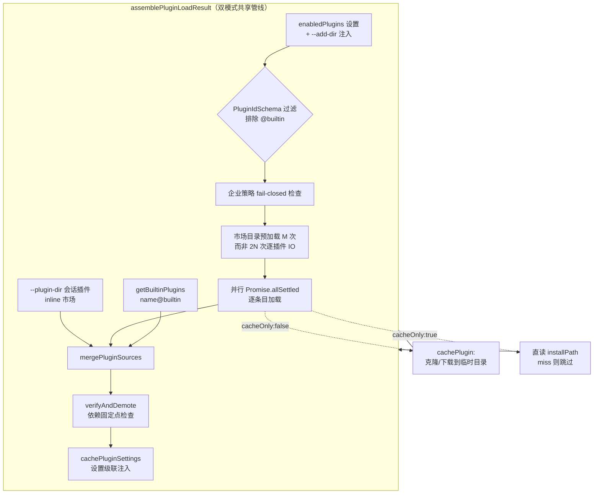
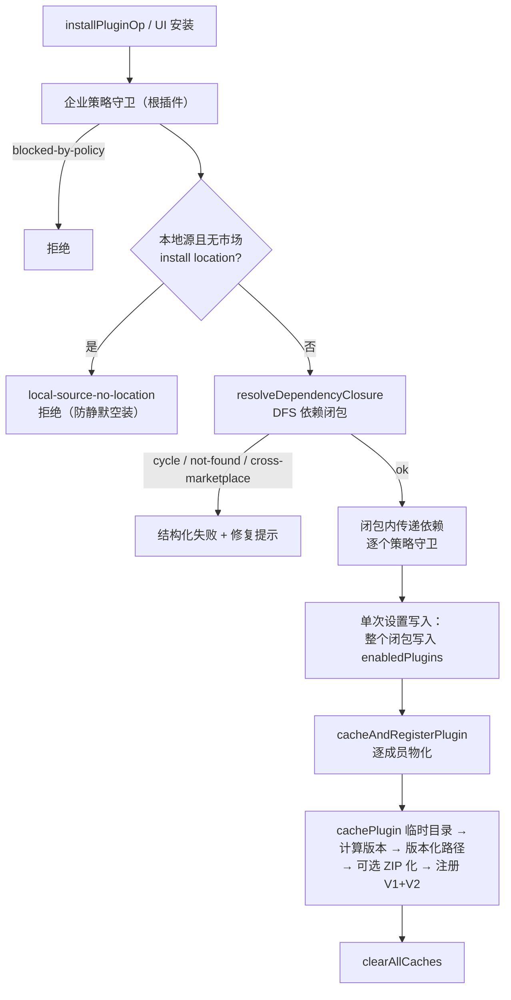
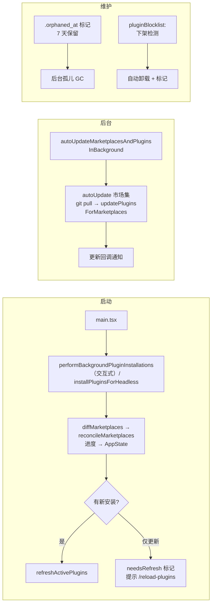

插件系统是本项目扩展生态的核心支柱，位于 `utils/plugins/`（47 个模块）与 `services/plugins/` 双层结构中：前者承载领域逻辑（加载、市场、安装、校验），后者承载操作编排与 UI/CLI 桥接。与 MCP（外部服务器进程模型）和 Skills（纯 Markdown 技能）不同，插件是**复合扩展单元**——一个插件可同时贡献斜杠命令、子代理、技能、输出样式、Hooks、MCP 服务器、LSP 服务器乃至设置项，全部通过一个目录加清单文件声明。本文自顶向下剖析四个支柱：**数据契约与 Schema、插件加载器、市场管理、安装管线与校验**，最后覆盖完整生命周期（刷新、自动更新、孤儿回收、下架检测）。

Sources: [types/plugin.ts](types/plugin.ts#L18-L70), [pluginLoader.ts](utils/plugins/pluginLoader.ts#L1-L33)

## 一、数据契约：三层 Schema 与类型体系

插件系统的一切行为都由 Zod Schema（`utils/plugins/schemas.ts`，1682 行，经 `lazySchema` 惰性编译以保启动性能）与运行时类型（`types/plugin.ts`）共同约束。理解这组契约是解剖后续所有模块的前提。核心实体分为三层：**市场源**（`MarketplaceSource`，从哪里获取市场清单）、**插件源**（`PluginSource`，市场条目里声明从哪里获取单个插件）、**插件清单**（`PluginManifest`，plugin.json 的结构）。

`MarketplaceSourceSchema` 是一个 8 分支的 `z.discriminatedUnion`，覆盖从远程到本地的全部市场引用方式，其中还包括两个专用于企业策略的白名单匹配分支（`hostPattern` 正则匹配主机、`pathPattern` 正则匹配本地路径）以及一个直接内联在 settings.json 中声明插件列表的 `settings` 合成源——后者由 reconciler 写出合成 marketplace.json 到缓存，从而让内联声明与真实仓库走完全相同的后续管线。

| 分支 (`source`) | 关键字段 | 语义 |
|---|---|---|
| `url` | `url`, `headers?` | 直接指向 marketplace.json 的 HTTP(S) 地址，支持认证头 |
| `github` | `repo`, `ref?`, `path?`, `sparsePaths?` | owner/repo 简写，稀疏检出支持 monorepo |
| `git` | `url`, `ref?`, `path?`, `sparsePaths?` | 任意 git URL（不强求 `.git` 后缀，兼容 Azure DevOps） |
| `npm` | `package` | 含 marketplace.json 的 npm 包 |
| `file` / `directory` | `path` | 本地 marketplace.json 或含 `.claude-plugin/` 的目录 |
| `settings` | `name`, `plugins[]`, `owner?` | settings.json 内联市场，名字被禁止使用官方保留名 |
| `hostPattern` / `pathPattern` | 正则 | 仅用于企业策略 `strictKnownMarketplaces` 白名单 |

Sources: [schemas.ts](utils/plugins/schemas.ts#L906-L1044)

插件侧的 `PluginSourceSchema` 同样是判别联合：最常见的形态是**相对路径字符串**（`./xxx`，相对于市场根目录，即包含 `.claude-plugin/` 的目录而非其本身），其余分支为 `npm`、`pip`（尚未实现，运行时抛错）、`github`、`git`、`git-subdir`（monorepo 子目录 + path 编码）与 `url`。市场清单中的每个条目由 `PluginMarketplaceEntrySchema` 表达——其巧妙之处在于**直接扩展 `PluginManifestSchema`**：市场条目 = 完整插件清单 + 一个 `source` 字段。这意味着"strict 市场"（条目内含全部元数据）与"仓库市场"（条目仅是路径指针）在同一 Schema 下统一。

`PluginManifestSchema` 由十余个 partial 片段合成：元数据（`name` 强制无空格、`version`、`author`、`dependencies`）、`commands`/`agents`/`skills`/`output-styles`（既可是相对路径数组，也可是对象映射格式并携带 `CommandMetadata`）、`hooks`、`mcpServers`、`lspServers`、`settings`（经 `SettingsSchema` 派生的白名单子集，最终并入设置级联）、`userConfig`（用户可配置项，供 `PluginOptionsFlow` UI 收集）。运行时产物 `LoadedPlugin`（`types/plugin.ts`）在此基础上叠加 `path`、`source`（即 `plugin@marketplace` 标识）、`enabled`、`isBuiltin`、`sha`（版本钉扎）与各类懒加载缓存槽位。

安装状态的持久化契约是 `installed_plugins.json` 的 **V1/V2 双 Schema 联合**：V1 将每个插件 ID 映射到单条记录；V2 引入多作用域安装——同一插件 ID 映射到 `PluginInstallationEntrySchema` 数组，每条记录 `scope`（`managed | user | project | local`）、`installPath`、`version`、`gitCommitSha` 等。这使"同一插件在 user 作用域装 v1.0、在某个项目装 v1.1"成为一等公民。

Sources: [schemas.ts](utils/plugins/schemas.ts#L1062-L1100), [schemas.ts](utils/plugins/schemas.ts#L884-L899), [schemas.ts](utils/plugins/schemas.ts#L1254-L1300), [schemas.ts](utils/plugins/schemas.ts#L1506-L1577), [types/plugin.ts](types/plugin.ts#L48-L70)

### Schema 层的安全防线

这个 Schema 文件同时实现了三重反假冒与反注入机制。第一重是**官方市场名保护**：`ALLOWED_OFFICIAL_MARKETPLACE_NAMES` 保留 8 个名字（如 `claude-plugins-official`、`anthropic-marketplace`），`BLOCKED_OFFICIAL_NAME_PATTERN` 用正则拦截"official+anthropic/claude"组合及前缀式仿冒变体，`NON_ASCII_PATTERN` 阻断同形异义字攻击（如用西里尔字母 `а` 冒充拉丁 `a`）；`validateOfficialNameSource` 则在注册时验证保留名必须来自 `anthropics` GitHub 组织（HTTPS 或 SSH 格式均可）。第二重是 `MarketplaceNameSchema` 的五连校验：非空、无空格、无路径分隔符/`..`/`.`、不仿冒官方名、不占用 `inline`（会话插件保留名）与 `builtin`（内置插件保留名）。

第三重体现在注释中明确记录的**双 Schema 同步不变量**：settings 侧的名字校验臂必须与获取到的 marketplace.json 校验臂使用同一个共享 Schema，因为 `loadAndCacheMarketplace` 在后置校验运行**之前**就已写入缓存目录——任何漂移都会在缓存中留下孤儿文件。

Sources: [schemas.ts](utils/plugins/schemas.ts#L19-L58), [schemas.ts](utils/plugins/schemas.ts#L71-L157), [schemas.ts](utils/plugins/schemas.ts#L206-L246)

## 二、插件加载器：双模式管线与合并策略

`pluginLoader.ts`（3303 行，系统内最大的领域模块）是整个插件系统的枢纽。其顶层设计是**双模式加载**：`loadAllPlugins()` 执行完整加载（可触发 git clone/npm install 等网络操作），`loadAllPluginsCacheOnly()` 绝不触网、只读 `installed_plugins.json` 中的 `installPath` 直接加载磁盘缓存，未命中的插件产生 `plugin-cache-miss` 错误并被跳过。二者共享同一发现/策略/合并管线 `assemblePluginLoadResult`，唯一差异是传给市场加载器的是 `cacheOnly: false` 还是 `true`。这一设计的动机是启动性能：交互式启动消费者（命令注册、代理加载、MCP/LSP 配置）全部走 cache-only 路径，永不因 ref 追踪插件的 git clone 而阻塞；显式刷新路径（`/plugin` UI、refresh、无头安装）才走完整加载。两条 memoize 缓存刻意分离——cache-only 结果绝不能喂给要新鲜源的调用者，但**反向预热是合法的**：完整加载完成后会顺手填充 cache-only 缓存，避免刷新路径的下游消费者报 cache-miss。特殊逃生门：`CLAUDE_CODE_SYNC_PLUGIN_INSTALL=1` 时 cache-only 直接委托完整加载，满足首跑 headless 场景（此时还没有 installed_plugins.json）。

Sources: [pluginLoader.ts](utils/plugins/pluginLoader.ts#L3096-L3146), [pluginLoader.ts](utils/plugins/pluginLoader.ts#L3110-L3135), [pluginLoader.ts](utils/plugins/pluginLoader.ts#L3155-L3211)

市场插件发现管线 `loadPluginsFromMarketplaces` 中有三个值得高级读者注意的工程决策。**其一，合并优先级**：`--add-dir` 提供的插件以最低优先级合并进 `enabledPlugins`，标准设置在键冲突时胜出。**其二，企业策略 fail-closed 语义**：若配置了严格白名单（任意值包括空数组均视为激活——空白名单即全拒绝）或非空黑名单，而某市场的源因配置文件损坏无法解析，则**阻塞加载而非静默跳过检查**——注释中详细记录了这个守卫修复的 fail-open 漏洞（Safe 变体返回 `{}` 会让回退路径 `getPluginByIdCacheOnly` 以零校验的裸类型转换加载插件）。**其三，N+1 IO 消除**：市场目录按市场去重后一次性预加载（N 插件跨 M 市场从 2N+N 次 IO 降为 M 次）。名称冲突合并规则同样体现意图优先级：会话插件（`--plugin-dir`）按名压过已安装插件——用户显式指向目录的意图胜于一切；唯一例外是托管设置（企业策略）锁定的插件，管理员意图压倒本地开发便利。

Sources: [pluginLoader.ts](utils/plugins/pluginLoader.ts#L1888-L1920), [pluginLoader.ts](utils/plugins/pluginLoader.ts#L1922-L2036), [pluginLoader.ts](utils/plugins/pluginLoader.ts#L3161-L3182)

单个外部插件的物化由 `cachePlugin` 完成：先在缓存根下生成带来源前缀的临时目录名（`temp_{local|npm|github|git|subdir}_{时间戳}_{随机}`），再按 `PluginSource` 分派到 `installFromLocal`（拷贝并删除 `.git`）/ `installFromNpm` / `installFromGitHub` / `installFromGit` / `installFromGitSubdir`（该分支会在丢弃临时克隆**之前**捕获 commit SHA，因为提取出的子目录没有 `.git`），任一失败即清理临时目录后抛出。随后读取并校验清单——优先 `.claude-plugin/plugin.json`，回退遗留的根级 `plugin.json`，解析失败或 Schema 校验失败均以携带完整 Zod issue 列表的错误中断。错误模型本身也是类型化设计：`PluginError` 是 16 分支的判别联合（`plugin-not-found`、`git-timeout`、`manifest-parse-error`、`marketplace-blocked-by-policy` 等），文件头注释坦承其中 2 个在产、14 个是已规划路线图——用类型系统固化错误处理契约，防止错误文案变更破坏 UI 匹配。

Sources: [pluginLoader.ts](utils/plugins/pluginLoader.ts#L873-L964), [pluginLoader.ts](utils/plugins/pluginLoader.ts#L979-L1063), [types/plugin.ts](types/plugin.ts#L79-L101)

### 内置插件与会话插件

内置插件（`plugins/builtinPlugins.ts`）以 `name@builtin` 标识与市场插件隔离，运行时注册进模块级 `Map`，合成 `LoadedPlugin` 时 `path` 使用哨兵值 `"builtin"`（无文件系统路径）。其可用性由 `isAvailable()` 门控（不可用则整体隐藏），启用状态遵循"用户设置 > `defaultEnabled` > true"三级回退。会话插件则通过 `--plugin-dir` CLI 标志或 SDK 选项进入 `bootstrap/state.ts` 的 `getInlinePlugins()`，注册名固定为保留市场 `inline`。启用状态的持久化统一收敛于设置的 `enabledPlugins` 键——这正是两个 memoize 入口的发现源。

Sources: [builtinPlugins.ts](plugins/builtinPlugins.ts#L21-L100), [pluginLoader.ts](utils/plugins/pluginLoader.ts#L11-L12)

## 三、市场管理：解析、注册、物化与协调

市场管理的状态中枢是 `~/.claude/plugins/known_marketplaces.json`，由 `KnownMarketplacesFileSchema` 校验的 `name → {source, installLocation, lastUpdated}` 映射。该文件的读写有严格的**安全变体分离**：`loadKnownMarketplacesConfig()` 在损坏时抛出 `ConfigParseError`（保留现场供修复），专用于"读-改-写"路径——若此处返回 `{}`，保存时会把损坏文件覆写为仅含新条目，永久销毁用户其余注册项；`loadKnownMarketplacesConfigSafe()` 吞掉一切错误返回 `{}`，专用于只读路径（插件加载、特性检查），损坏配置应优雅降级而非崩溃整个加载流程。

用户输入到 `MarketplaceSource` 的翻译由 `parseMarketplaceInput.ts` 完成，识别顺序为：SSH URL（`user@host:path` 正则，支持任意合法用户名与企业 SSH 证书格式，`#ref` 后缀提取 ref）→ HTTP(S) URL（`.git` 后缀或 `/_git/` 路径判定为 git 克隆源——注释记录了 Azure DevOps TF401019 的兼容性坑；github.com 域名补全 `.git`；其余按裸 JSON URL 处理）→ 本地路径（`./`、`../`、`/`、`~`，Windows 专属的 `.\`、`..\` 与盘符路径；stat 区分 `.json` 文件与目录，所有 stat 错误吞掉转为错误结果）→ GitHub 简写（`owner/repo`，`#ref` 与 `@ref` 均接受，后者因为展示格式化器用 `@`，用户会从错误信息里复制）。识别失败返回 `null`（NPM 直引暂未实现）。

Sources: [marketplaceManager.ts](utils/plugins/marketplaceManager.ts#L264-L350), [parseMarketplaceInput.ts](utils/plugins/parseMarketplaceInput.ts#L7-L163)

注册入口 `addMarketplaceSource` 的执行序本身就是安全策略的体现：**策略检查最先执行**（在任何网络/文件系统操作之前，防止被封锁的源被下载），区分"显式在黑名单"与"不在白名单"给出不同错误文案，甚至对 GitHub 简写给出"内网 GHE 请用完整 URL"的提示；随后是**源幂等性**——完全相同的源已物化则跳过克隆直接返回；然后 `loadAndCacheMarketplace` 克隆/拉取市场并写出缓存；接着 `validateOfficialNameSource` 验证保留名归属；最后处理同名冲突：种子管理条目（管理员烘焙进容器镜像）不可被覆盖，普通冲突则"设置意图胜出"覆盖旧条目，且清理旧缓存前**防御性校验存储路径**——损坏的 `installLocation`（曾指向用户项目目录）若在缓存目录之外则跳过删除，宁可留一个无害的陈旧目录也不误删用户文件。

Sources: [marketplaceManager.ts](utils/plugins/marketplaceManager.ts#L1782-L1831), [marketplaceManager.ts](utils/plugins/marketplaceManager.ts#L1859-L1919)

声明式意图与已物化状态的收敛由 `reconciler.ts` 承担，这是市场生命周期的心脏。`diffMarketplaces` 将**声明**（settings 中的市场，含 fallback 源）与**物化**（known_marketplaces.json）比对出三分类：`missing`（声明了未物化）、`sourceChanged`（两侧都有但源不等——settings 胜出）、`upToDate`。两个精妙之处：相对路径在比对前先归一化（含读取 `.git` 规范化 worktree 路径），fallback 声明只看存在性不比源（避免把种子/镜像物化的市场误判为 sourceChanged 而重克隆覆盖）。`reconcileMarketplaces` 是幂等、**只增不删**的收敛器：对 missing 执行 install、sourceChanged 执行 update，逐项发出 `installing/installed/failed` 进度事件；sourceChanged 的本地路径若声明路径已不存在则跳过（多 checkout 场景下物化条目可能仍有效，直接 addMarketplaceSource 反正会失败，跳过可避免噪音错误并保留可用状态）。

Sources: [reconciler.ts](utils/plugins/reconciler.ts#L30-L83), [reconciler.ts](utils/plugins/reconciler.ts#L110-L181)

企业预烘焙场景由**种子目录**（`CLAUDE_CODE_PLUGIN_SEED_DIR`，支持平台分隔符分隔的多目录、先到先得）支持：`registerSeedMarketplaces` 把种子内 known_marketplaces.json 的条目注册进主配置，`installLocation` 从运行时种子目录重新计算而非信任烘焙时路径（处理多阶段 Docker 挂载点漂移），`autoUpdate` 强制 false（种子只读，git pull 必失败）。官方市场（`anthropics/claude-plugins-official`）则是隐式声明：任何启用的插件引用它时，`getDeclaredMarketplaces` 自动补一条声明，使其与任何其他市场走同一条 reconciler 路径，并与种子机制正确复合（种子注册 → diff 判 upToDate → 零克隆）。`isMarketplaceAutoUpdate` 决定默认自动更新策略：官方市场默认 true，除非在 `NO_AUTO_UPDATE_OFFICIAL_MARKETPLACES` 排除表中；第三方默认 false，用户可逐市场覆盖。

Sources: [marketplaceManager.ts](utils/plugins/marketplaceManager.ts#L352-L400), [headlessPluginInstall.ts](utils/plugins/headlessPluginInstall.ts#L70-L86), [officialMarketplace.ts](utils/plugins/officialMarketplace.ts#L15-L26), [schemas.ts](utils/plugins/schemas.ts#L48-L58)

## 四、安装管线：从条目解析到版本化缓存

安装操作有两条并行入口汇聚到同一个核心：CLI 路径 `installPluginOp`（`services/plugins/pluginOperations.ts`）与交互 UI 路径 `installPluginFromMarketplace`，共同委托 `installResolvedPlugin`（`utils/plugins/pluginInstallationHelpers.ts`）。`installPluginOp` 先解析 `plugin@marketplace` 标识——带市场后缀则精确定位 `getPluginById`，裸名则遍历所有已知市场找第一个命中者。

`installResolvedPlugin` 的五个阶段环环相扣。**策略守卫**先查根插件是否被组织封锁（managed-settings.json 的 `enabledPlugins: false`），确保 CLI、UI、提示触发三条安装路径一处覆盖；**本地源守卫**拦截无市场安装位置的本地插件——没有它，本地源根会因 `depInfo` 未播种而被物化循环静默跳过，用户看到"成功安装"却什么都没落盘。**依赖闭包解析**（`resolveDependencyClosure`）是 DFS 遍历：根永不跳过（重新安装已在设置中但磁盘缺失的插件必须重新物化，否则闭包为空、`cacheAndRegisterPlugin` 永不触发），已启用的依赖跳过（避免跨作用域的意外设置写入）。跨市场依赖**默认阻断**——这是注释中明示的安全边界：从受信市场安装不应静默拉取不受信市场的代码；仅有的两条出路是用户手动先装（已启用即跳过检查），或**根市场** manifest 的 `allowCrossMarketplaceDependenciesOn` 白名单——且只有根市场的列表对整个遍历生效，**无传递信任**（A 信任 B，不代表 B 的插件可依赖 C）。解析失败返回结构化 `ResolutionResult`（`cycle`/`not-found`/`cross-marketplace` 三分支），`formatResolutionError` 为每种失败生成带修复指引的用户文案。随后对闭包内**每个**传递依赖再做策略守卫——不被封锁的插件不能夹带被封锁的依赖。最后**单次原子设置写入**整个闭包，再逐成员物化。

Sources: [pluginOperations.ts](services/plugins/pluginOperations.ts#L321-L381), [pluginInstallationHelpers.ts](utils/plugins/pluginInstallationHelpers.ts#L329-L411), [dependencyResolver.ts](utils/plugins/dependencyResolver.ts#L69-L100)

依赖限定规则 `qualifyDependency` 处理裸名简写：清单 `dependencies` 中的裸名（无 `@marketplace`）自动补全为声明插件自己所在的市场——`{name}` 在 `claude-plugins-official` 的插件里就是 `{name}@claude-plugins-official`。加载期的安全网 `verifyAndDemote` 则以**固定点循环**工作：反复检查每个启用插件的清单依赖是否都在启用集中，失守者降级（会话内 `enabled = false`，不写设置，用户经 `/doctor` 修复意图）——降级 A 可能连带破坏依赖 A 的 B，故迭代至稳定。闭包结果经 `formatDependencyCountSuffix` 附加"含 N 个依赖"的安装提示。

Sources: [dependencyResolver.ts](utils/plugins/dependencyResolver.ts#L38-L46), [dependencyResolver.ts](utils/plugins/dependencyResolver.ts#L161-L180)

`cacheAndRegisterPlugin` 把临时缓存晋升为版本化安装。版本计算（`calculatePluginVersion`）遵循严格优先级：`plugin.json` 的 `version` > 市场条目提供的版本 > 预捕获的 git SHA（`git-subdir` 源特殊处理：SHA-12 位 + 子目录路径的 `sha256` 前 8 位十六进制拼接——同一 commit 不同子目录必须产生不同缓存键，否则两个插件会在 `cache/<市场>/<插件>/<sha>/` 互相串树；该归一化被要求与官方 squashfs 后端**逐字节一致**）> 从安装路径读 `.git` > `'unknown'`。目录晋升处理一个自包含陷阱：当市场名等于插件名时版本化路径是临时路径的子目录，直接 rename 会"把目录移进自己"，需先移到同级临时位置再二次 rename（同级保证同文件系统，规避 EXDEV）。ZIP 缓存模式启用时目录原地转 ZIP 并删除目录。最终 `addInstalledPlugin` 同时写入 V1 与 V2 两份 installed_plugins 文件以保持兼容。

Sources: [pluginInstallationHelpers.ts](utils/plugins/pluginInstallationHelpers.ts#L128-L226), [pluginVersioning.ts](utils/plugins/pluginVersioning.ts#L36-L106)

安装作用域模型决定了设置的写入目标：`VALID_INSTALLABLE_SCOPES = ['user', 'project', 'local']`（安装动作不含 managed——那是管理员直接写托管设置的领域），而更新作用域与 V2 记录额外包含 `managed`。`scopeToSettingSource` 将作用域映射到设置源层级，project/local 记录还需携带 `projectPath`。卸载（`uninstallPluginOp`）默认同时清理 `data/<sanitized-id>` 数据目录——该目录暴露给插件为 `${CLAUDE_PLUGIN_DATA}`，**跨版本更新存活**（不同于每次更新都会被孤儿回收的版本化缓存），仅在最后作用域卸载时删除。

Sources: [pluginOperations.ts](services/plugins/pluginOperations.ts#L72-L114), [pluginDirectories.ts](utils/plugins/pluginDirectories.ts#L98-L120)

## 五、安装校验：开发者工具与运行时防线的分层

校验体系刻意分为两层，且行为不同。**运行时校验**（`cachePlugin` 内嵌的 `PluginManifestSchema().safeParse`）是宽容的——基础 Schema 静默剥离未知键，坏清单直接中断加载并抛出含 Zod issue 的错误。**开发者工具**（`validatePlugin.ts`，服务于 `/plugin validate` 与 `claude plugin validate`）则是严格的：`validatePluginManifest` 在 Schema 校验**之前**先做路径遍历检查——对 `commands`/`agents`/`skills` 数组逐项执行 `checkPathTraversal`，即使 Schema 校验失败也要先抓住安全问题；然后把误放进 plugin.json 的市场专属字段（`MARKETPLACE_ONLY_MANIFEST_FIELDS`）**剥离并降级为警告**（字段在运行时无害但被忽略，作者应在 CI 里知道），剥离后再以 `.strict()` 局部调用校验——运行时静默容错与开发工具的拼写反馈需求在此分道扬镳。校验成功后追加四类启发式警告：非严格 kebab-case 名（Claude Code 接受，但 Claude.ai 市场同步会拒绝——让作者在 CI 阶段就发现）、缺版本、缺描述、缺作者。配套的还有 `validateMarketplaceManifest`、`validatePluginContents`、`validateManifest` 分别覆盖市场清单、插件目录内容与入口分发。

信任模型在 UI 层显式呈现：`PluginTrustWarning` 组件在安装/更新/使用流程展示统一警示——插件内的 MCP 服务器、文件与软件不受 Anthropic 控制，无法验证其按预期工作，安装前必须自行信任来源。

Sources: [validatePlugin.ts](utils/plugins/validatePlugin.ts#L129-L305), [PluginTrustWarning.tsx](commands/plugin/PluginTrustWarning.tsx#L25-L31)

## 六、生命周期：后台安装、刷新、自动更新与回收

**后台安装**（`services/plugins/PluginInstallationManager.ts`）是 `reconcileMarketplaces` 的薄 UI 包装：先算 diff 把待装市场初始化为 AppState 的 `pending` 状态（无逐插件 pending——插件加载是缓存命中级的快操作，市场克隆才是值得展示进度的慢操作），reconcile 的进度事件映射为 `installing/installed/failed` 状态更新，结束后发遥测 `tengu_marketplace_background_install`。有新装则触发刷新修复首次加载的 `plugin-not-found`，仅更新则置 `needsRefresh` 通知用户跑 `/reload-plugins`。**无头变体**（`installPluginsForHeadless`）复用同一 reconciler 但无 AppState，额外处理 ZIP 缓存模式的目录初始化与不支持的源类型跳过。

Sources: [PluginInstallationManager.ts](services/plugins/PluginInstallationManager.ts#L50-L130), [headlessPluginInstall.ts](utils/plugins/headlessPluginInstall.ts#L35-L100)

**激活刷新**（`refresh.ts` 的 `refreshActivePlugins`）是全缓存清空后的重建序：`clearAllCaches` → `loadAllPlugins`（完整加载，完成后预热 cache-only 缓存）→ 并行取插件命令与代理定义 → 为每个启用插件懒填充 `mcpServers`/`lspServers` 缓存槽位并统计计数 → 单次 AppState 写入（enabled/disabled/commands/errors、`needsRefresh=false`、`mcp.pluginReconnectKey` 自增以驱动 MCP 连接管理器 effect 重跑）→ `reinitializeLspServerManager()` 无条件重建 LSP 配置（移除最后一个 LSP 插件也要清陈旧配置，这修复过 LSP 管理器读到协调前旧 memoize 结果的 issue #15521）→ `loadPluginHooks()` 全量换钩（失败仅计入 error_count，不丢失已装的命令/代理数据）。注释中还记录了 #23693 引入的排序不变量：`getPluginCommands`/`getAgentDefinitionsWithOverrides` 改调 cache-only 后必须**先 await 完整加载再调用**，否则会在插件克隆落盘前读 installed_plugins.json 拿到 cache-miss。

Sources: [refresh.ts](utils/plugins/refresh.ts#L40-L160)

**自动更新**（`pluginAutoupdate.ts`）由 `autoUpdateMarketplacesAndPluginsInBackground` 驱动：收集 autoUpdate 启用的市场（官方默认开、可逐市场关）→ 逐市场 `refreshMarketplace`（git pull）→ `updatePluginsForMarketplaces` 遍历 `installed_plugins.json` 全部插件，过滤市场在集合内且安装对当前项目相关（user/managed 恒相关；project/local 须匹配 cwd）的记录，逐个 `updatePluginOp`，已是最新的静默跳过，实际更新者经注册回调通知（`onPluginsAutoUpdated`）。函数注释披露了 #29512 修复的脱同步缺陷：`/plugin marketplace update` 此前只 pull 市场克隆，加载器会建新版本缓存目录但 installed_plugins.json 仍指旧版本，孤儿 GC 下次启动反而给新目录打 `.orphaned_at`。**孤儿回收**采用宽限设计：旧版本目录打 `.orphaned_at` 标记保留 7 天（并发会话可能仍引用），`orphanedPluginFilter.ts` 用一次 ripgrep 调用（`--hidden --no-ignore --max-depth 4` 精确匹配 `cache/<市场>/<插件>/<版本>/.orphaned_at`）生成 `--glob '!<dir>/**'` 排除模式，防止 Grep/Glob 返回陈旧插件代码；排除列表会话内冻结，仅 `/reload-plugins` 显式重算。

Sources: [pluginAutoupdate.ts](utils/plugins/pluginAutoupdate.ts#L140-L240), [orphanedPluginFilter.ts](utils/plugins/orphanedPluginFilter.ts#L1-L88)

**下架执行**（`pluginBlocklist.ts`）在交互与无头两条路径共享：`detectDelistedPlugins` 把已装插件集与各市场当前清单对账，从市场中消失者（后缀匹配市场名且名字不在清单）由 `detectAndUninstallDelistedPlugins` 自动卸载并记入 flagged 名单。**内置插件生命周期**完全内存化（注册即存在，无磁盘），启用状态走用户设置。

Sources: [pluginBlocklist.ts](utils/plugins/pluginBlocklist.ts#L1-L70), [builtinPlugins.ts](plugins/builtinPlugins.ts#L65-L100)

## 七、存储布局、运行模式与操作入口

插件根目录的唯一事实源在 `pluginDirectories.ts`：默认 `~/.claude/plugins`（`--cowork` 标志或 `CLAUDE_CODE_USE_COWORK_PLUGINS` 环境变量切换到 `cowork_plugins`），`CLAUDE_CODE_PLUGIN_CACHE_DIR` 显式覆盖（tilde 经 `expandTilde` 展开——设置文件注入的 env 不经 shell，不展开会字面创建 `~` 目录，gh-30794）。完整布局为：`known_marketplaces.json` + `installed_plugins.json` + `marketplaces/<name>/`（市场克隆）+ `cache/<市场>/<插件>/<版本>/`（版本化插件）+ `data/<sanitized-id>/`（跨版本数据）。**ZIP 缓存模式**（`CLAUDE_CODE_PLUGIN_USE_ZIP_CACHE`）面向挂载卷（如 Filestore）的无头部署：插件以 ZIP 存储（`plugins/<市场>/<插件>/<版本>.zip`），加载时解压到会话本地临时目录，安装时原地转 ZIP，仅支持 headless、github/git/url 市场源与 strict 条目。

用户操作入口有两层。REPL 内 `/plugin` 命令（`commands/plugin/parseArgs.ts`）解析出九种子命令形态：无参进菜单、`install/i`（区分 `plugin@marketplace`、裸市场 URL/路径、裸插件名）、`manage`、`uninstall`、`enable`、`disable`、`validate <path>`、`marketplace/market add|remove|update|list`；UI 组件族（`BrowseMarketplace`、`ManagePlugins`、`AddMarketplace`、`ManageMarketplaces`、`ValidatePlugin`、`PluginOptionsFlow` 等）承接渲染。CLI 层 `claude plugin`（`services/plugins/pluginCliCommands.ts`）导出 `installPlugin`/`uninstallPlugin`/`enablePlugin`/`disablePlugin`/`disableAllPlugins`/`updatePluginCli` 并复用 scope 常量。加载后的组件消费全部走 cache-only：命令加载器（`loadPluginCommands.ts`）扫描插件 markdown，技能文件（SKILL.md）以父目录为命令名并支持 `插件:命名空间:命令` 三段命名空间。

Sources: [pluginDirectories.ts](utils/plugins/pluginDirectories.ts#L34-L90), [zipCache.ts](utils/plugins/zipCache.ts#L1-L30), [zipCache.ts](utils/plugins/zipCache.ts#L55-L70), [parseArgs.ts](commands/plugin/parseArgs.ts#L2-L103), [pluginCliCommands.ts](services/plugins/pluginCliCommands.ts#L38-L103), [loadPluginCommands.ts](utils/plugins/loadPluginCommands.ts#L53-L90)

## 结语与延伸阅读

回望全局，插件系统的架构主线是三条不变量的持续执行：**声明意图与物化状态的收敛**（reconciler 的 diff-then-act）、**安全边界先于一切 IO**（策略先行、fail-closed、跨市场依赖默认阻断、保留名组织验证）、**性能敏感的双轨加载**（cache-only 启动 vs 完整刷新，memoize 单向预热）。理解这三点后，其余模块均可视为其在不同入口（CLI/UI/headless/企业）上的投影。

继续深入本 Wiki 的扩展生态章节：MCP 服务器如何作为插件的组成部分接入连接管理，参见 [MCP 客户端集成：连接管理、传输层、OAuth 认证与 Elicitation](21-mcp-ke-hu-duan-ji-cheng-lian-jie-guan-li-chuan-shu-ceng-oauth-ren-zheng-yu-elicitation)；插件贡献的技能如何被技能工具化体系消费，参见 [Skills 技能体系：内置技能、目录加载与技能工具化](23-skills-ji-neng-ti-xi-nei-zhi-ji-neng-mu-lu-jia-zai-yu-ji-neng-gong-ju-hua)；插件 Hooks 如何汇入生命周期钩子执行器，参见 [Hooks 生命周期钩子：配置模式、事件注册与 HTTP/Agent/Prompt 执行器](24-hooks-sheng-ming-zhou-qi-gou-zi-pei-zhi-mo-shi-shi-jian-zhu-ce-yu-http-agent-prompt-zhi-xing-qi)；企业策略如何从托管设置层注入封锁规则，参见 [配置与可观测性：设置体系、托管策略、数据迁移与遥测分析](30-pei-zhi-yu-ke-guan-ce-xing-she-zhi-ti-xi-tuo-guan-ce-lue-shu-ju-qian-yi-yu-yao-ce-fen-xi)。