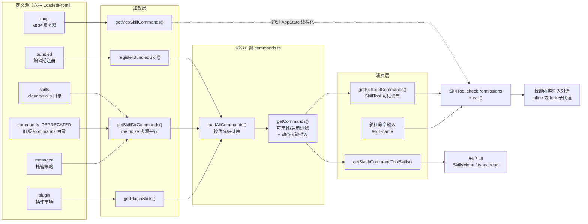

Skills 是 Claude Code 中将**可复用流程知识**注入模型能力的核心机制。其本质是一层统一抽象：无论技能来自编译期内置、磁盘目录、插件市场还是 MCP 服务器，最终都被规范化为 `Command` 对象（`type: 'prompt'`），既可通过斜杠命令由用户触发，也可通过 `Skill` 工具由模型自主调用。本页解析这条管道的三个关键环节——内置技能的程序化注册、多源目录的加载与去重合并、以及 SkillTool 如何将技能"工具化"为模型可用的原语，并覆盖权限决策、Token 预算、动态发现与热重载等支撑机制。

## 架构总览：从定义源到模型调用

阅读下图前需要理解一个前提：技能系统采用**声明式清单 + 惰性内容**的两级设计。启动时只加载技能的元数据（名称、描述、触发条件），技能正文（SKILL.md 内容或生成的 prompt）仅在真正调用时才注入对话——这是控制上下文成本的第一道防线。

六个 `LoadedFrom` 来源标签贯穿整个体系：`bundled`（内置）、`skills`（目录）、`commands_DEPRECATED`（旧命令目录）、`plugin`（插件）、`managed`（托管策略）、`mcp`（MCP）。该标签不仅决定加载路径，还影响 SkillTool 清单的展示策略与权限默认行为。
Sources: [loadSkillsDir.ts](skills/loadSkillsDir.ts#L67-L73)

## 内置技能：编译期注册与参考文件提取

内置技能通过 `registerBundledSkill()` 在启动时同步注册到模块级注册表，被编译进 CLI 二进制并对所有用户可用。其定义类型 `BundledSkillDefinition` 是磁盘技能 frontmatter 的 TypeScript 等价物——`name`、`description`、`whenToUse`、`allowedTools`、`model`、`disableModelInvocation`、`userInvocable`、`isEnabled`、`hooks`、`context`（`'inline' | 'fork'`）逐一对应，外加一个磁盘技能没有的能力：**程序化 prompt 生成函数** `getPromptForCommand(args, context)`。

Sources: [bundledSkills.ts](skills/bundledSkills.ts#L15-L41)

最具工程价值的是 `files` 机制。当技能需要附带参考文档（如 verify 技能的测试配方文件）时，`files: Record<string, string>` 声明相对路径到内容的映射，首次调用时延迟提取到磁盘，并在 prompt 前缀一行 `Base directory for this skill: <dir>`，使模型能按需 Read/Grep 这些文件——与磁盘技能的目录契约完全一致。提取过程包含多层防御：**对 Promise 而非结果做闭包级 memoization**（并发调用者等待同一次提取而非竞态写入）、提取目录位于每进程 nonce 子树下、目录/文件以 `0o700/0o600` 创建、写入使用 `O_EXCL | O_NOFOLLOW`（Windows 用字符串标志 `'wx'`，因数值 `O_EXCL` 经 libuv 会产生 EINVAL），且明确注释了**不做 unlink+retry**——`unlink()` 同样会跟随中间符号链接。

Sources: [bundledSkills.ts](skills/bundledSkills.ts#L29-L36), [bundledSkills.ts](skills/bundledSkills.ts#L59-L73), [bundledSkills.ts](skills/bundledSkills.ts#L169-L193)

注册入口 `initBundledSkills()` 采用**无条件注册 + 特性门控条件注册**的混合模式。前十个技能（updateConfig、keybindings、verify、debug、loremIpsum、skillify、remember、simplify、batch、stuck）无条件注册；其余通过 `feature()` 编译期标记门控并用 `require()` 延迟加载，实现死代码消除。部分技能自带运行时守卫，如 `remember` 检查 `process.env.USER_TYPE !== 'ant'` 即返回、`/loop` 的 `isEnabled` 回调按次调用决定可见性。

Sources: [bundled/index.ts](skills/bundled/index.ts#L24-L79), [remember.ts](skills/bundled/remember.ts#L4-L8)

内置技能谱系反映了三种典型形态，如下表所示：

| 技能 | 形态 | 核心机制 |
|---|---|---|
| `simplify` | 纯 prompt 注入 | 指挥模型并行发射三个审查子代理（复用/质量/效率），聚合发现后直接修复 |
| `batch` | 编排型 prompt | Plan 模式分解为 5–30 个独立工作单元 → worktree 隔离的后台代理并行执行 → PR 状态表跟踪 |
| `verify` | 带参考文件 | `files: SKILL_FILES` 首次调用时提取到磁盘，prompt 引用 base directory |
| `skillify` | 元技能（自举） | 通过 AskUserQuestion 四轮访谈用户，将会话流程固化为新 SKILL.md 写入用户选择的目录 |

Sources: [simplify.ts](skills/bundled/simplify.ts#L4-L53), [batch.ts](skills/bundled/batch.ts#L9-L88), [verify.ts](skills/bundled/verify.ts#L17-L29), [skillify.ts](skills/bundled/skillify.ts#L22-L107)

## 目录加载：SKILL.md 契约与多源合并

### SKILL.md 文件契约

磁盘技能的标准格式是目录式：`skill-name/SKILL.md`，技能名取目录名。`/skills/` 目录**不支持**单个 `.md` 文件格式（这是与旧版 `/commands/` 目录的关键差异）；旧目录则两者皆支持，且当目录中存在 SKILL.md 时仅加载该文件并以父目录名命名。

Sources: [loadSkillsDir.ts](skills/loadSkillsDir.ts#L424-L431), [loadSkillsDir.ts](skills/loadSkillsDir.ts#L561-L566)

frontmatter 字段经 `parseSkillFrontmatterFields()` 统一解析，该函数同时服务于文件技能与 MCP 技能（后者由写一次注册表 `mcpSkillBuilders.ts` 间接获取，以打破 `client.ts → mcpSkills.ts → loadSkillsDir.ts → client.ts` 的循环依赖——该注释明确记录了变量式动态导入在 Bun 打包二进制中会以 `/$bunfs/root/` 路径解析失败的问题）：

| Frontmatter 字段 | 类型/取值 | 语义 |
|---|---|---|
| `description` | string | 清单展示；缺省时回退到 markdown 首行提取 |
| `when_to_use` | string | 自动触发条件描述，与 description 拼接进清单 |
| `allowed-tools` | 列表 | 技能激活期间追加的 always-allow 规则 |
| `argument-hint` / `arguments` | string / 列表 | 参数提示与具名参数（支持 `$ARGUMENTS`/`$1` 替换） |
| `model` | string/`inherit` | 技能执行期间的模型覆盖 |
| `effort` | 枚举或整数 | 推理力度覆盖，非法值记日志并忽略 |
| `context` | `inline`/`fork` | fork 则在隔离子代理中执行 |
| `agent` | string | 指定承载技能的代理类型 |
| `paths` | gitignore 风格模式 | **条件技能**：仅当触碰匹配文件时激活 |
| `user-invocable` / `disable-model-invocation` | 布尔 | 用户可键入性 / 模型可调用性（默认均为 true） |
| `hooks` / `shell` | 对象 | 会话钩子 / 内联 shell 命令执行配置 |

Sources: [loadSkillsDir.ts](skills/loadSkillsDir.ts#L185-L265), [mcpSkillBuilders.ts](skills/mcpSkillBuilders.ts#L7-L24), [loadSkillsDir.ts](skills/loadSkillsDir.ts#L1077-L1086)

### Prompt 组装管线

`createSkillCommand()` 返回的 `getPromptForCommand` 是一条五步组装管线：① 若有 baseDir 则前缀 `Base directory for this skill: <dir>`；② `substituteArguments()` 展开参数占位符；③ 将 `${CLAUDE_SKILL_DIR}` 替换为技能自身目录（Windows 下反斜杠归一化为正斜杠，避免 shell 转义语义）；④ 替换 `${CLAUDE_SESSION_ID}`；⑤ 执行 markdown 中的内联 shell 命令（`` !`...` ``），此步**对 `loadedFrom === 'mcp'` 的技能明确跳过**——MCP 技能内容远程且不可信，注释将此标记为安全要求。

Sources: [loadSkillsDir.ts](skills/loadSkillsDir.ts#L344-L399)

### 五源并行加载与 realpath 去重

`getSkillDirCommands`（lodash memoize，按 cwd 缓存）是磁盘加载的总入口，五类来源**并行**加载：托管策略目录（受 `CLAUDE_CODE_DISABLE_POLICY_SKILLS` 环境变量可禁用）、用户目录 `~/.claude/skills`、项目目录（`getProjectDirsUpToHome` 从 cwd 向上遍历至 home，形成**深层覆盖浅层**的层级）、`--add-dir` 追加目录、旧版 `/commands/` 目录。三个策略开关独立生效：`isSettingSourceEnabled('userSettings'/'projectSettings')` 与 `isRestrictedToPluginOnly('skills')` 插件锁定策略。`--bare` 裸模式跳过所有自动发现，仅加载显式 `--add-dir` 路径且不做去重（用户自控唯一性）。

去重采用 **realpath 文件身份**而非字符串路径：`getFileIdentity()` 用 `realpath` 解析符号链接得到规范路径，代码注释解释了不用 inode 的原因——部分虚拟/容器/NFS 文件系统上报 inode 0 或 ExFAT 精度丢失（关联 issue #13893）。文件身份先**并行**计算（realpath 调用相互独立），再做**顺序相关**的 first-wins 去重，来源顺序为 managed → user → project → additional → legacy。

Sources: [loadSkillsDir.ts](skills/loadSkillsDir.ts#L107-L124), [loadSkillsDir.ts](skills/loadSkillsDir.ts#L638-L723), [loadSkillsDir.ts](skills/loadSkillsDir.ts#L725-L763)

去重后进入**条件技能分拣**：带非空 `paths` 且尚未激活的技能被移入 `conditionalSkills` 暂存 Map，不进入常规清单。`parseSkillPaths()` 预处理模式（剥离 `/**` 后缀，因 ignore 库将 `path` 视为同时匹配自身及内部所有内容；全 `**` 通配等价于无 paths）。

Sources: [loadSkillsDir.ts](skills/loadSkillsDir.ts#L771-L796), [loadSkillsDir.ts](skills/loadSkillsDir.ts#L159-L178)

## 命令汇聚：优先级排序与动态技能插入

`commands.ts` 的 `getSkills()` 并行汇聚四类技能后，`loadAllCommands()` 按固定顺序拼接：**bundled → builtinPlugin → skillDir → workflow → pluginCommands → pluginSkills → 内置命令**。该顺序即名字冲突时的查找优先级。`getCommands()` 在其上做两件事：每次调用**新鲜评估** `meetsAvailabilityRequirement`（认证门槛，因 `/login` 可在会话中途改变状态，故不做 memoize）与 `isCommandEnabled`；动态技能去重后插入到插件技能之后、内置命令之前。

Sources: [commands.ts](commands.ts#L353-L398), [commands.ts](commands.ts#L449-L517)

两个专用过滤器服务不同消费方。`getSkillToolCommands()` 决定模型在 SkillTool 清单中看到什么——必须 `type === 'prompt'`、未禁用模型调用、非 `builtin` 源，且满足：来自 `bundled`/`skills`/`commands_DEPRECATED`（可从首行自动派生描述），或有显式 description/whenToUse（插件与 MCP 命令的要求更严）。`getSlashCommandToolSkills()` 则按 `loadedFrom` 判定"真技能"。MCP 技能刻意**游离于 getCommands() 之外**，由 `getMcpSkillCommands()` 从 `AppState.mcp.commands` 过滤后由调用方线程化传入，避免污染本地命令缓存。

Sources: [commands.ts](commands.ts#L561-L608), [commands.ts](commands.ts#L541-L559)

## 技能工具化：SkillTool 的双模式执行

SkillTool（`SKILL_TOOL_NAME = 'Skill'`）将技能暴露为模型原语，输入极简：`{ skill: string, args?: string }`。输出 schema 是**内联/fork 双态联合**：内联态返回 `success/commandName/allowedTools/model`；fork 态返回 `status: 'forked'/agentId/result`。工具描述动态生成为 `Execute skill: ${skill}`。

Sources: [SkillTool.ts](tools/SkillTool/SkillTool.ts#L291-L342), [constants.ts](tools/SkillTool/constants.ts#L1-L2)

`call()` 的分派逻辑以 `context === 'fork'` 为分水岭，两种模式的对比如下：

| 维度 | inline（默认） | fork（`context: fork`） |
|---|---|---|
| 执行位置 | 主对话内展开 prompt | 隔离子代理（`runAgent`），独立 agentId 与 Token 预算 |
| 上下文影响 | 技能正文注入主对话 | 主对话仅见结果摘要 |
| 适配场景 | 需要中途用户介入、依赖主对话上下文 | 自包含任务、长流程 |
| 结果消息 | `Launching skill: <name>` | 完整结果文本 + forked 状态 |
| 清理 | — | `clearInvokedSkillsForAgent(agentId)` 释放状态 |
| 模型/力度 | `contextModifier` 链式覆盖 | 合入 agentDefinition 后传入 `runAgent` |

Sources: [SkillTool.ts](tools/SkillTool/SkillTool.ts#L580-L632), [SkillTool.ts](tools/SkillTool/SkillTool.ts#L118-L289), [SkillTool.ts](tools/SkillTool/SkillTool.ts#L843-L862)

内联路径的核心是 **`contextModifier` 链式上下文改造**：① `allowedTools` 并入 `toolPermissionContext.alwaysAllowRules.command`（注意用 `previousGetAppState` 而非闭包引用，保证多次 contextModifier 正确串联）；② 模型覆盖经 `resolveSkillModelOverride`——注释特别指出此函数**保留 `[1m]` 后缀**，否则 `model: opus` 技能在 opus[1m] 会话上会把有效窗口打回 200K 并触发自动压缩；③ effort 覆盖写入 `appState.effortValue`。同时新消息经 `tagMessagesWithToolUseID` 标记，保持瞬态直到工具解析完成，并过滤掉含 `<command-message>` 标签的消息（SkillTool 自己负责展示）。

Sources: [SkillTool.ts](tools/SkillTool/SkillTool.ts#L767-L840)

遥测设计体现了隐私分层：`tengu_skill_tool_invocation` 事件中，`command_name` 字段对自定义技能脱敏为 `'custom'`（仅内置/bundled/官方市场技能保留真名），而 `_PROTO_skill_name` 走特权 BigQuery 列保留未脱敏值；插件名同理由 `plugin_name`（第三方显示 `'third-party'`）与 `_PROTO_plugin_name` 分层。fork 执行还有 `invocation_trigger` 区分 `claude-proactive` 与 `nested-skill`（按 `queryDepth > 0` 判定），以及远程规范技能（`_canonical_<slug>`，ant 实验特性）经 AKI/GCS 加载后直接以用户消息注入——因其为声明式 markdown，无需斜杠命令展开。

Sources: [SkillTool.ts](tools/SkillTool/SkillTool.ts#L130-L203), [SkillTool.ts](tools/SkillTool/SkillTool.ts#L600-L613), [SkillTool.ts](tools/SkillTool/SkillTool.ts#L944-L968)

### 权限决策链

`checkPermissions()` 按严格顺序评估，规则匹配支持精确名与 `prefix:*` 前缀通配（两侧都剥离前导斜杠归一化）：**deny 规则 → 远程规范技能自动放行（置于 deny 之后以尊重用户 deny 配置）→ allow 规则 → 安全属性自动放行 → ask**。ask 态附两条建议规则：精确技能名与 `<name>:*` 前缀。

"安全属性放行"是防御性设计的典范：`SAFE_SKILL_PROPERTIES` 是**允许清单**而非禁止清单——技能对象上任何不在清单内且取值有意义的属性都触发询问。代码注释明确其意图：**未来新增的 PromptCommand 属性默认要求权限**，直到被显式审查加入清单。不在清单的关键属性即 `hooks` 与 `allowedTools`（非空时）——挂载钩子或扩大工具权限的技能必须征得用户同意。

Sources: [SkillTool.ts](tools/SkillTool/SkillTool.ts#L432-L578), [SkillTool.ts](tools/SkillTool/SkillTool.ts#L871-L933)

`validateInput()` 则在执行前拦截四类错误：空名、未知技能、`disable-model-invocation` 禁用、非 prompt 类型命令。

Sources: [SkillTool.ts](tools/SkillTool/SkillTool.ts#L354-L430)

## 上下文注入：Token 预算与增量宣告

技能清单不是写进系统提示词，而是作为 **`skill_listing` 附件**在首轮注入。预算计算：上下文窗口的 1% × 4 字符/Token（默认回退 8000 字符），可用 `SLASH_COMMAND_TOOL_CHAR_BUDGET` 环境变量覆盖；单条描述硬上限 250 字符（清单仅用于发现，完整内容由 Skill 工具在调用时加载，冗长的 whenToUse 只会浪费首轮缓存创建 Token）。`formatCommandsWithinBudget()` 的降级策略分三档：完整描述放不下时，**bundled 技能永不截断**，其余技能共享剩余预算均分；极端情况下非 bundled 技能降为仅名称。

Sources: [prompt.ts](tools/SkillTool/prompt.ts#L20-L41), [prompt.ts](tools/SkillTool/prompt.ts#L70-L171)

增量宣告机制避免重复注入：`sentSkillNames` 以 **agentId 为键**（空串即主线程），使子代理获得独立的轮 0 清单——若无此按代理隔离，主线程填充的 Set 会让每个子代理的去重结果为空。`--resume` 时 `suppressNextSkillListing()` 将当前全部技能标记为已发送，避免每个进程重启都重注入约 600 Token 清单；代价是跨会话新增技能要等下一次非 resume 会话才会宣告（仍可调用，注册表无关清单）。技能搜索启用时 `filterToBundledAndMcp()` 将清单收缩至 bundled + MCP（超过 30 条回退纯 bundled），用户/项目/插件技能长尾改走发现通道。

Sources: [attachments.ts](utils/attachments.ts#L2603-L2659), [attachments.ts](utils/attachments.ts#L2661-L2751)

工具提示词本身确立了强行为契约：技能匹配用户请求时是**阻塞性要求**——必须先调用 Skill 工具再生成任何其他响应；对话轮中已见 `<command-name>` 标签则表明技能已加载，直接遵循指示而非重复调用。

Sources: [prompt.ts](tools/SkillTool/prompt.ts#L173-L196)

## 动态发现：文件操作触发的技能目录扫描

技能不必在启动时全部就位。`discoverSkillDirsForPaths()` 从 Read/Write/Edit 工具触碰的文件路径出发**向上遍历至 cwd（不含）**，在每个层级探测 `.claude/skills` 目录。三重防护：已探测路径缓存去重（避免每次文件操作重复 stat 不存在的目录——这是常态路径）；gitignore 检查阻断 `node_modules/pkg/.claude/skills` 类静默加载（调用时信任对话框才是真正的安全边界，git 检查只是过滤噪音）；结果按**路径深度降序**排序，随后 `addSkillDirectories()` 以浅层先处理的反序合并，使更靠近文件的深层技能覆盖浅层同名技能。条件技能的激活采用同一 `ignore` 库做 gitignore 风格匹配，匹配路径成功后技能从 `conditionalSkills` 迁入 `dynamicSkills`，`activatedConditionalSkillNames` 保证会话内激活状态在缓存清空后依然存活。

Sources: [loadSkillsDir.ts](skills/loadSkillsDir.ts#L854-L915), [loadSkillsDir.ts](skills/loadSkillsDir.ts#L917-L975), [loadSkillsDir.ts](skills/loadSkillsDir.ts#L997-L1058)

## 热重载：文件监视与两级缓存失效

`skillChangeDetector` 用 chokidar 监视用户/项目技能目录（`depth: 2` 匹配 `skill-name/SKILL.md` 格式），关键参数体现工程权衡：1 秒写入稳定阈值 + 500ms 轮询确认、300ms 重载防抖（防止 git 操作触发数十个事件级联清缓存导致事件循环死锁）、Bun 下强制 `usePolling`——因 Bun 原生 `fs.watch` 存在 PathWatcherManager 死锁（oven-sh/bun#27469），大技能树上 git 操作触发 chokidar 频繁开关 per-directory watcher 时会令两线程永久挂起，故改用 2 秒间隔的 stat 轮询。

`useSkillsChange` Hook 区分**两种失效语义**：技能文件变更走 `clearCommandsCache()`（全量：memo + 插件 + 技能缓存 + 磁盘重扫）；GrowthBook 刷新只走 `clearCommandMemoizationCaches()`（仅 memo，因磁盘内容未变，只是 `isEnabled` 谓词依赖的特性标记可能更新——注释记录了首会话中 `getCommands()` 先于 GB 初始化执行导致 `/btw` 类门控命令被默认值烘焙的具体行号级时序问题）。

Sources: [skillChangeDetector.ts](utils/skills/skillChangeDetector.ts#L27-L62), [skillChangeDetector.ts](utils/skills/skillChangeDetector.ts#L85-L141), [useSkillsChange.ts](hooks/useSkillsChange.ts#L11-L62)

动态技能加载完成时的缓存清理同样讲究：回调使用 `clearCommandMemoizationCaches()` 而非 `clearCommandsCache()`，因为后者会调用 `clearSkillCaches()` 把**刚加载的动态技能本身清掉**。这一区分也体现在 commands.ts 中：外层 `getSkillIndex` 建立在 `getSkillToolCommands` 之上的 memoization 层级关系，必须显式清理否则外层返回缓存而不触达已清空的内层。

Sources: [skillChangeDetector.ts](utils/skills/skillChangeDetector.ts#L89-L101), [commands.ts](commands.ts#L519-L539)

## 技能级钩子：frontmatter 声明的会话钩子

技能 frontmatter 中的 `hooks` 经 `HooksSchema` Zod 校验后（校验失败仅记日志返回 undefined，不阻断技能加载），由 `registerSkillHooks()` 注册为**会话作用域钩子**。`once: true` 的钩子通过 `onHookSuccess` 回调在首次成功执行后自动移除；`skillRoot` 参数传递给钩子系统用于注入 `CLAUDE_PLUGIN_ROOT` 环境变量。钩子注册发生在技能调用展开路径内部（`processPromptSlashCommand` → `getMessagesForPromptSlashCommand`），SkillTool.call 中特意注释**不再重复注册**，否则会双重挂载钩子并冗余重建技能内容。

Sources: [registerSkillHooks.ts](utils/hooks/registerSkillHooks.ts#L20-L64), [loadSkillsDir.ts](skills/loadSkillsDir.ts#L132-L153), [SkillTool.ts](tools/SkillTool/SkillTool.ts#L761-L764)

## 结语

Skills 体系的设计哲学可归纳为三条主线：**统一抽象**（六源技能共享 `Command` 契约与 frontmatter 解析，bundled 技能甚至是磁盘技能的超集）、**惰性经济**（清单只占 1% 上下文预算，正文调用时加载，Skillify 元技能让体系自我繁殖）、**纵深防御**（MCP 内容不执行 shell、安全属性允许清单默认拒绝、realpath 去重、nonce 目录提取、O_NOFOLLOW 写入）。理解这三个维度后，后续阅读插件系统如何复用同一 `loadedFrom` 管道、以及 Hooks 体系的完整事件模型，将有清晰的坐标系。

延伸阅读：
- [Hooks 生命周期钩子：配置模式、事件注册与 HTTP/Agent/Prompt 执行器](24-hooks-sheng-ming-zhou-qi-gou-zi-pei-zhi-mo-shi-shi-jian-zhu-ce-yu-http-agent-prompt-zhi-xing-qi)——技能级钩子依赖的完整事件与执行器体系
- [插件系统：加载器、市场管理、安装校验与生命周期](22-cha-jian-xi-tong-jia-zai-qi-shi-chang-guan-li-an-zhuang-xiao-yan-yu-sheng-ming-zhou-qi)——`plugin` 来源技能的加载与市场分发
- [子代理与后台任务框架：AgentTool、LocalAgentTask 与任务状态监控](25-zi-dai-li-yu-hou-tai-ren-wu-kuang-jia-agenttool-localagenttask-yu-ren-wu-zhuang-tai-jian-kong)——fork 技能调用的 `runAgent` 底层
- [斜杠命令体系：命令注册、参数解析与本地 JSX 命令模式](14-xie-gang-ming-ling-ti-xi-ming-ling-zhu-ce-can-shu-jie-xi-yu-ben-di-jsx-ming-ling-mo-shi)——技能作为命令的用户侧入口