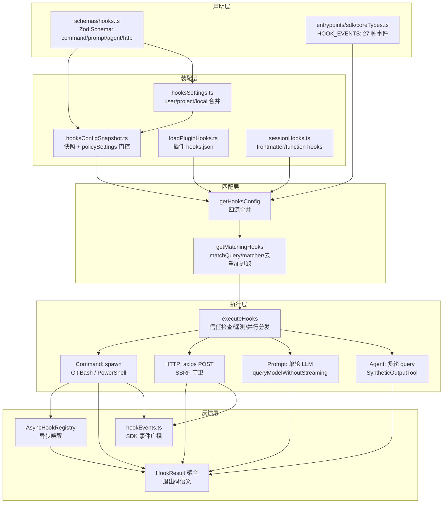
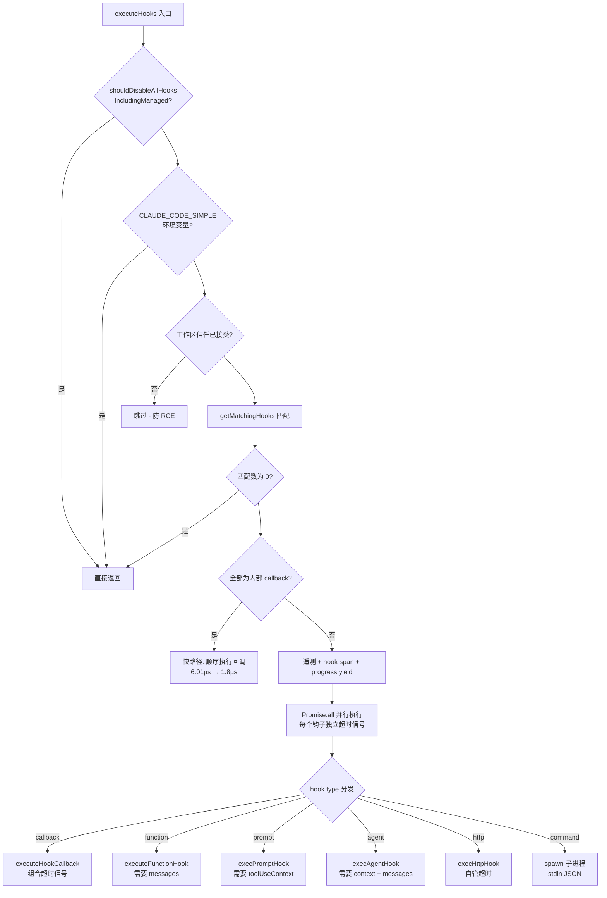

Hooks 系统是 Claude Code 在代理生命周期各关键节点注入用户自定义逻辑的核心扩展机制——从工具调用前后的拦截、会话启停的通知，到通过 LLM 或 HTTP 端点实现的智能校验。本文从架构分层视角拆解该系统：配置模式由 Zod Schema 与多源设置合并定义；事件注册横跨 settings 文件、插件清单、Skill/Agent frontmatter 与进程内回调四条渠道；执行层则由 `executeHooks` 统一编排，将六种钩子类型分发给 Command、HTTP、Prompt、Agent 四类执行器，并辅以异步注册表与事件广播两条旁路通道。全文基于源码逐层验证，面向需要深入理解或扩展钩子机制的高级开发者。

## 架构总览：五层流水线

Hooks 系统遵循一条清晰的分层流水线：**声明层**定义"钩子长什么样"，**装配层**决定"哪些钩子生效"，**匹配层**筛选"本轮事件触发谁"，**执行层**决定"怎么跑"，**反馈层**决定"结果去哪里"。整个系统的核心契约是 `HookCommand`——一个以 `type` 字段为判别式的可辨识联合类型（discriminated union），持久化形态支持 `command`/`prompt`/`agent`/`http` 四种，进程内形态额外支持 `callback`/`function` 两种不可持久化类型。



这条流水线的关键设计决策在于**职责隔离**：声明层只描述结构不含行为；装配层的策略门控（`disableAllHooks`、`allowManagedHooksOnly`）集中在一个模块，避免散落的检查点；匹配层通过 `hookDedupKey` 命名空间化去重保证跨插件模板不误伤；执行层用一个 `executeHooks` 异步生成器统一所有出口语义（阻塞/非阻塞/取消），使得每个生命周期调用方（如 `executePreToolHooks`）只需构造 `HookInput` 即可复用全部基础设施。反馈层则分离了两条互不干扰的通道：面向 UI 的 `HookResult` 消息流与面向 SDK 的事件流。

Sources: [schemas](schemas/hooks.ts#L16-L27), [coreTypes](entrypoints/sdk/coreTypes.ts#L25-L53), [hooksConfigSnapshot](utils/hooks/hooksConfigSnapshot.ts#L18-L53), [hooks.ts](utils/hooks.ts#L1952-L1977)

## 配置模式：六种钩子类型与 Schema 真源

钩子类型的唯一真源（source of truth）位于 `schemas/hooks.ts`——该文件从 `settings/types.ts` 中抽取出来以打破循环依赖，通过 `lazySchema` 延迟构造 Zod Schema。四种可持久化类型构成 `HookCommandSchema` 判别式联合；每种类型共享一组横切字段（`if` 条件、`timeout`、`statusMessage`、`once`），差异部分则体现执行语义的本质区别：

| 类型 | 判别字段 | 核心特有字段 | 执行载体 | 默认超时 |
|------|---------|-------------|---------|---------|
| `command` | `command` | `shell`(bash/powershell)、`async`、`asyncRewake` | 子进程 spawn | 10 分钟 |
| `prompt` | `prompt` | `model` | 单轮 LLM 调用（Haiku） | 30 秒 |
| `agent` | `prompt` | `model` | 多轮 query + 工具调用 | 60 秒 |
| `http` | `url` | `headers`、`allowedEnvVars` | axios POST | 10 分钟 |
| `callback` | — | `callback`、`internal` | 进程内函数 | 继承调用方 |
| `function` | — | `callback`、`errorMessage`、`id` | 进程内函数（仅会话级） | 5 秒 |

```typescript
// schemas/hooks.ts — 配置结构的判定性联合
export const HookCommandSchema = lazySchema(() => {
  const { BashCommandHookSchema, PromptHookSchema,
          AgentHookSchema, HttpHookSchema } = buildHookSchemas()
  return z.discriminatedUnion('type', [
    BashCommandHookSchema, PromptHookSchema,
    AgentHookSchema, HttpHookSchema,
  ])
})

// 整体配置形态：事件名 → matcher 数组 → hook 数组 的两层嵌套
export const HooksSchema = lazySchema(() =>
  z.partialRecord(z.enum(HOOK_EVENTS), z.array(HookMatcherSchema())))
```

两个细节值得注意。**第一，`if` 条件采用权限规则语法**（如 `"Bash(git *)"`），它在进程 spawn 之前就被评估，目的是"避免为不匹配的命令白白创建进程"——这是把权限系统的模式匹配器复用为钩子前置过滤器的巧妙设计。**第二，`AgentHook.prompt` 字段上有一条显式警告**：禁止在 Schema 上添加 `.transform()`，因为 `parseSettingsFile` 的解析结果会经过 `JSON.stringify` 往返写回设置文件，函数值会被静默丢弃导致用户的 prompt 从 settings.json 中被删除（gh-24920 注释记录了这次事故）。这条注释是"Schema 层保持纯数据"原则的活化石。

`HooksSchema` 的形态是 `Record<HookEvent, HookMatcher[]>`，其中 `HookMatcher` 是 `{matcher?: string, hooks: HookCommand[]}`——即一个事件可挂多个匹配器组，每组内可并列多个钩子。使用 `z.partialRecord` 而非完整 Record，是因为 27 种事件不需要全部声明。

Sources: [schemas](schemas/hooks.ts#L31-L189), [schemas](schemas/hooks.ts#L194-L222), [schemas](schemas/hooks.ts#L16-L27)

## 事件体系：27 种生命周期事件的匹配语义

`HOOK_EVENTS` 常量数组定义在 `entrypoints/sdk/coreTypes.ts`，共 27 种事件。这些事件并非平铺的观察者模式，而是各自携带**匹配字段**——`getMatchingHooks` 中的 switch 语句将每种事件映射到 `HookInput` 的特定字段作为 `matchQuery`，用于与 matcher 模式比对：

| 事件类别 | 事件 | 匹配字段 | 典型取值 |
|---------|------|---------|---------|
| 工具生命周期 | PreToolUse / PostToolUse / PostToolUseFailure / PermissionRequest / PermissionDenied | `tool_name` | Write, Edit, Bash… |
| 会话边界 | SessionStart | `source` | startup, resume, clear, compact |
| 会话边界 | SessionEnd | `reason` | clear, logout, prompt_input_exit |
| 轮次控制 | Stop / StopFailure | — / `error` | rate_limit, server_error… |
| 子代理 | SubagentStart / SubagentStop | `agent_type` | 动态 agent 清单 |
| 压缩 | PreCompact / PostCompact | `trigger` | manual, auto |
| 用户输入 | UserPromptSubmit | —（无 matcher 过滤） | — |
| 通知 | Notification | `notification_type` | permission_prompt, idle_prompt |
| MCP 交互 | Elicitation / ElicitationResult | `mcp_server_name` | MCP 服务器名 |
| 团队协作 | TeammateIdle / TaskCreated / TaskCompleted | — | — |
| 环境感知 | ConfigChange / CwdChanged / FileChanged | `source` / — / `basename(file_path)` | — |
| 环境感知 | InstructionsLoaded | `load_reason` | — |
| 仓库维护 | Setup | `trigger` | init, maintenance |
| Worktree | WorktreeCreate / WorktreeRemove | — | — |

matcher 模式本身支持三种语义，由 `matchesPattern` 函数统一解析：纯字母数字下划线（含管道符）按**精确匹配**处理（`Write|Edit` 匹配两者之一，且经 `normalizeLegacyToolName` 兼容旧工具名）；其余情况按**正则表达式**处理（`^Task$` 等，正则失败时记录日志并返回 false）；空串或 `*` 通配一切。这种"先猜精确、退化为正则"的双语义在保持向后兼容的同时允许精细控制。

值得强调的是 `StopFailure` 的设计定位——它**替代** Stop 在 API 错误（限流、认证失败等）终止轮次时触发，且是 fire-and-forget：钩子输出与退出码全部被忽略，纯粹作为通知信号存在。而 `TeammateIdle` 的 exit code 2 语义独特：不阻止 teammate 进入空闲，而是**阻止空闲让 teammate 继续工作**，这是与其它阻塞事件方向相反的语义。

Sources: [coreTypes](entrypoints/sdk/coreTypes.ts#L25-L53), [hooks.ts](utils/hooks.ts#L1616-L1670), [hooks.ts](utils/hooks.ts#L1346-L1381), [hooksConfigManager](utils/hooks/hooksConfigManager.ts#L95-L153)

## 装配层：配置快照、策略门控与四源合并

### 快照机制与托管策略优先级

钩子配置在启动时通过 `captureHooksConfigSnapshot()` 冻结为快照，运行期通过 `updateHooksConfigSnapshot()` 显式刷新（该函数先调用 `resetSettingsCache()` 防止文件监视器稳定期阈值未过时读到陈旧缓存）。快照构建函数 `getHooksFromAllowedSources` 实现了一条**精确的策略优先级链**，其决策顺序直接决定了企业托管环境下钩子的可见性：

```
policySettings.disableAllHooks === true     → 返回 {}（全部禁用，含托管钩子）
policySettings.allowManagedHooksOnly        → 仅返回 policySettings.hooks
strictPluginOnlyCustomization('hooks')      → 仅返回 policySettings.hooks
非托管源 disableAllHooks === true           → 仅返回 policySettings.hooks
（默认）                                     → 返回全源合并的 hooks
```

这条链的核心原则是**非托管设置无法压制托管钩子**：当用户级或项目级设置声明 `disableAllHooks` 时，效果等同于"托管专属模式"（`shouldAllowManagedHooksOnly()` 返回 true），而非彻底关闭——只有托管策略本身才有权禁用包括托管钩子在内的一切。配套的 `shouldDisableAllHooksIncludingManaged()` 仅在 `policySettings.disableAllHooks` 为真时返回 true，`executeHooks` 在入口处以此短路整个执行流。

### UI 视角与运行视角的分离

`hooksSettings.ts` 的 `getAllHooks` 服务于 `/hooks` 命令的 UI 展示，从 userSettings/projectSettings/localSettings 三个可编辑源遍历展开为扁平的 `IndividualHookConfig[]`，并用 `seenFiles` 集合处理"在家目录运行时 userSettings 与 projectSettings 解析到同一文件"的去重场景。`isHookEqual` 定义了钩子的**身份判等规则**：command 类型中 `shell` 参与判等（同一命令串配不同 shell 是不同钩子），`if` 条件参与判等（`Bash(git *)` 与 `Bash(npm *)` 是两个钩子），但 `timeout` 不参与——超时是执行参数而非身份属性。运行期真正的装配则由 `utils/hooks.ts` 内部的 `getHooksConfig` 完成，合并四个来源：设置快照、`getRegisteredHooks()`（SDK 回调与插件钩子，managed-only 模式下跳过带 `pluginRoot` 的插件项）、会话级 `SessionHookMatcher`、会话级函数钩子（后两者在 managed-only 模式下整体跳过，防止 frontmatter 钩子绕过策略）。

Sources: [hooksConfigSnapshot](utils/hooks/hooksConfigSnapshot.ts#L18-L76), [hooksConfigSnapshot](utils/hooks/hooksConfigSnapshot.ts#L95-L124), [hooksSettings](utils/hooks/hooksSettings.ts#L33-L65), [hooksSettings](utils/hooks/hooksSettings.ts#L92-L161), [hooks.ts](utils/hooks.ts#L1492-L1566)

### 注册渠道：插件、Skill 与 Agent Frontmatter

除设置文件外，还有三条动态注册渠道。**插件渠道**由 `loadPluginHooks` 驱动：`convertPluginHooksToMatchers` 为每个已启用插件的 `hooksConfig` 附加 `pluginRoot`/`pluginName`/`pluginId` 上下文，随后执行"先清理后注册"的原子交换——旧实现把清理放在 `clearPluginHookCache` 中，导致任何 `clearAllCaches()` 调用都会清空注册表且无人负责重建，插件 Stop 钩子在插件管理操作后静默失效（gh-29767）；新实现将 clear-then-register 收拢在同一函数内，旧钩子保持有效直到交换点。**Skill/Agent frontmatter 渠道**通过 `registerSkillHooks` 与 `registerFrontmatterHooks` 将 frontmatter 声明的钩子注册为会话级钩子，前者对 `once: true` 钩子挂载 `onHookSuccess` 回调实现一次执行后自动移除；后者有一个关键转换——**Agent 的 Stop 钩子被重写为 SubagentStop**，因为子代理完成时触发的是 SubagentStop 而非 Stop，若不转换则 frontmatter 中声明的 Stop 永远不会命中。这些会话钩子存储在 `AppState.sessionHooks` 的 `Map<string, SessionStore>` 中——选择 Map 而非 Record 是刻意的性能决策：N 个并行 schema 模式代理在同一同步 tick 内各自调用 `addFunctionHook`，Record 加展开的写法是 O(N²) 拷贝且触发约 30 个 store 监听器，Map 的 `.set()` 是 O(1) 且返回 prev 引用使 `Object.is` 检查短路、零监听器触发。

Sources: [loadPluginHooks](utils/plugins/loadPluginHooks.ts#L28-L86), [loadPluginHooks](utils/plugins/loadPluginHooks.ts#L138-L148), [registerSkillHooks](utils/hooks/registerSkillHooks.ts#L33-L57), [registerFrontmatterHooks](utils/hooks/registerFrontmatterHooks.ts#L37-L60), [sessionHooks](utils/hooks/sessionHooks.ts#L48-L62)

## 匹配管线：从事件到钩子实例的四步筛选

`getMatchingHooks` 是装配与执行之间的漏斗，对每次事件触发执行四步筛选。理解这四步对于诊断"为什么我的钩子没跑"至关重要：

**第一步：matcher 过滤**。存在 `matchQuery` 时，仅保留 `matcher` 为空或 `matchesPattern` 命中的匹配器组；无 `matchQuery` 的事件（如 UserPromptSubmit）跳过此步保留全部。

**第二步：上下文展开**。将每个匹配器组展开为 `MatchedHook` 列表，逐个附带 `pluginRoot`/`pluginId`/`skillRoot` 上下文与字符串化的 `hookSource`（`plugin:名称`、`skill:名称` 或 `settings`）。

**第三步：命名空间化去重**。这是管线中最精巧的部分——若全部钩子均为 callback/function 则直接返回（每个回调天然唯一，跳过 6 次过滤 + 4 次 Map + 4 次 Array.from 的开销，微基准下快 44 倍）；否则按类型分桶，用 `hookDedupKey`（`pluginRoot ?? skillRoot ?? ''` 前缀 + `\0` + 内容键）构建 Map 去重。命令类型的键包含 `shell`（默认 bash 补齐）、`command` 与 `if` 条件三段。命名空间前缀解决了一个真实缺陷（gh-29724）：两个插件共享未展开的 `${CLAUDE_PLUGIN_ROOT}/hook.sh` 模板时，展开后指向不同文件，若不带前缀会被误判为重复而丢失一个。`new Map(entries)` 在键冲突时保留**最后**条目，意味着设置作用域合并中后写入的作用域胜出。

**第四步：`if` 条件过滤与事件黑名单**。`prepareIfConditionMatcher` 仅对 PreToolUse/PostToolUse/PostToolUseFailure/PermissionRequest 四种工具事件生效——它借助 `findToolByName` 定位工具、用工具的 `inputSchema` 校验 `tool_input`、再调用工具的 `preparePermissionMatcher`（Bash 工具会在此做 tree-sitter 解析），把所有昂贵的一次性工作收敛到闭包构造时，返回的闭包按钩子逐个调用做权限规则匹配。最后一条硬性规则：**HTTP 钩子在 SessionStart/Setup 事件上被强制排除**，因为在 headless 模式下沙箱 ask 回调会死锁——结构化输入消费者在这些钩子触发时尚未启动。

Sources: [hooks.ts](utils/hooks.ts#L1681-L1710), [hooks.ts](utils/hooks.ts#L1712-L1806), [hooks.ts](utils/hooks.ts#L1808-L1870), [hooks.ts](utils/hooks.ts#L1383-L1421), [hooks.ts](utils/hooks.ts#L1850-L1864)

## 执行引擎：executeHooks 的分发与快路径

`executeHooks` 是所有 27 种事件共用的唯一执行入口，以异步生成器形态向调用方持续 yield 进度消息与结果。其执行序列如下方流程图所示，其中两处设计直接影响性能与安全：



**安全闸门**：`shouldSkipHookDueToTrust()` 在信任未接受时跳过所有钩子执行，注释明确标注"集中式检查防止当前与未来所有钩子的 RCE 漏洞"——所有钩子（包括 shell 命令）本质上是任意代码执行通道，工作区信任是唯一的前置防线。**内部回调快路径**：当匹配到的钩子全部是 `internal: true` 的 callback（如 sessionFileAccessHooks、attributionHooks）时，跳过 span/progress/abortSignal/processHookJSONOutput/结果循环全部设施，直接顺序 await——实测从每次 PostToolUse 命中 6.01µs 降至约 1.8µs（-70%）。此外 `hookInput` 的 JSON 序列化采用**惰性一次**策略：闭包缓存首次序列化结果供整批共享，callback/function 批次在到达之前就返回，完全不付出序列化成本。执行前每个钩子先 yield 一条 `hook_progress` 进度消息（携带 `getHookDisplayText` 的展示文本、prompt 文本或 statusMessage），供 UI 层的 spinner 渲染。

Sources: [hooks.ts](utils/hooks.ts#L1978-L2013), [hooks.ts](utils/hooks.ts#L2036-L2067), [hooks.ts](utils/hooks.ts#L2094-L2140), [hooks.ts](utils/hooks.ts#L2142-L2192)

## 四类执行器深度解析

### Command 执行器：双 Shell 路径与流式协议解析

Command 执行器是唯一真正 spawn 子进程的类型，其 spawn 逻辑在 Windows 上走两条完全分离的路径：**bash 路径**通过 `findGitBashPath()` 显式指定 Git Bash（cmd.exe 无法解析 bash 语法），`.sh` 脚本自动前置 `bash` 命令避免被默认文件处理器打开；**powershell 路径**显式构造 argv（`-NoProfile -NonInteractive -Command`），跳过 shell 选项以获得更快且确定性的执行。环境变量注入是插件生态的关键环节：`CLAUDE_PROJECT_DIR` 恒定注入，插件/技能钩子额外获得 `CLAUDE_PLUGIN_ROOT` 与 `CLAUDE_PLUGIN_DATA`，插件 userConfig 选项以 `CLAUDE_PLUGIN_OPTION_*` 键暴露（敏感值包含在内——钩子运行用户自己的代码，与直读 keychain 同一信任边界）；SessionStart/Setup/CwdChanged/FileChanged 事件的 bash 钩子还会获得 `CLAUDE_ENV_FILE` 指向可写入环境变量定义的脚本文件，其内容会被 bashProvider 注入后续 bash 命令。

**stdin/stdout 构成一套流式双向协议**。输入侧：hook input JSON 写入 stdin 并以换行结尾（注释记录了 gh-30509/CC-161 事故——缺尾换行时 bash `read -r line` 返回 exit 1，变量虽已填充但 `if read` 分支被跳过）。输出侧逐行解析三种信号：其一，**async 检测协议**只解析首行——若首行是 `{"async":true,...}` 则立即转入后台注册表，钩子继续输出正常内容；注释强调"必须只解析首行"，因为快进程可能在 data 事件触发前写完更多内容，解析累计 stdout 会失败并使 async 钩子阻塞完整时长。其二，**prompt 请求协议**：当 `requestPrompt` 提供时，stdout 中出现的 `promptRequestSchema` 合法 JSON 行被拦截（记入 `processedPromptLines` 集合），通过 UI 弹窗收集响应后写回 stdin，处理链用 `promptChain` Promise 串行化保证响应顺序。其三，剩余 stdout 走 `parseHookOutput`：以 `{` 开头的尝试 Zod 校验为结构化输出，否则视为纯文本。配置层的 `async: true` 与首行检测是两条独立的异步化路径，前者在 spawn 后立即后台化，后者依赖运行时输出。

### HTTP 执行器：三层网络防护

`execHttpHook` 将 hook input JSON POST 到配置 URL，构建了纵深防御的网络安全模型。**第一层 URL 白名单**：`allowedHttpHookUrls` 采用与 MCP 服务器白名单相同的通配符语义（`*` 转正则 `.*`，undefined 不限制、空数组全禁、非空须命中）。**第二层 SSRF 守卫**：`ssrfGuardedLookup` 替换 axios 默认 DNS lookup，在解析 IP 后检查阻断范围——IPv4 阻断 0.0.0.0/8、10.0.0.0/8、100.64.0.0/10（CGNAT，阿里云元数据 100.100.100.200 所在段）、169.254.0.0/16（云元数据）、172.16.0.0/12、192.168.0.0/16；IPv6 阻断 `::`、fc00::/7、fe80::/10 与映射 IPv4；**回环地址刻意放行**（本地开发策略服务器是 HTTP 钩子的主要用例）。当沙箱代理或环境变量代理激活时守卫跳过——代理执行目标 DNS，对代理自身 IP 应用守卫反而会切断企业内网代理。**第三层环境变量插值管控**：header 值中的 `$VAR`/`${VAR}` 仅当变量名列于钩子 `allowedEnvVars`（再与策略级 `httpHookAllowedEnvVars` 求交集）时才解析，否则替换为空串，防止项目配置的钩子外泄密钥；插值结果经 `sanitizeHeaderValue` 剥离 CR/LF/NUL 阻断 CRLF 头注入。请求本身 `maxRedirects: 0`（禁重定向防 SSRF 绕过）、`validateStatus: () => true`（状态码交由上层语义判断）、响应体必须是合法 hook JSON（空体视为空对象）。

### Prompt 与 Agent 执行器：两种 LLM 校验梯度

两个 LLM 执行器共享 `addArgumentsToPrompt`（`$ARGUMENTS` 占位符替换，支持 `$ARGUMENTS[0]`/`$0` 索引形式）与 `hookResponseSchema`（`{ok: boolean, reason?: string}`），但代表两种成本/能力梯度。**execPromptHook 是单轮无工具调用**：直接调用 `queryModelWithoutStreaming`，系统提示词约束只输出两种 JSON 之一，`outputFormat` 以 json_schema 强制形态，thinking 显式禁用，默认 Haiku + 30 秒超时，会话历史可选前置。**execAgentHook 是完整多轮代理**：构造唯一的 `hook-agent-<uuid>` agentId，复用主查询循环 `query()`，工具集为父上下文工具过滤掉 `ALL_AGENT_DISALLOWED_TOOLS`（防止 Stop 钩子代理再繁衍子代理或进入计划模式）再附加 `SyntheticOutputTool`（`createStructuredOutputTool` 重载其 schema 为 hookResponseSchema 并在 prompt 中强制"必须恰好调用一次"）；`MAX_AGENT_TURNS = 50` 硬上限防失控，命中即 abort 并按取消处理。其权限上下文有两处特殊处理：`getAppState()` 被覆写为注入 `Read(/<transcriptPath>)` 会话级放行规则（允许代理读取会话转录分析历史）且模式置为 `dontAsk`（校验代理不应打断用户）；同时通过 `registerStructuredOutputEnforcement` 注册一个会话级 function hook 在 Stop 事件上强制结构化输出——收到 `structured_output` 附件后立即 abort 查询循环提前退出，并 `clearSessionHooks` 清理自身注册。

Sources: [hooks.ts](utils/hooks.ts#L850-L938), [hooks.ts](utils/hooks.ts#L940-L984), [hooks.ts](utils/hooks.ts#L995-L1030), [hooks.ts](utils/hooks.ts#L1068-L1130), [execHttpHook](utils/hooks/execHttpHook.ts#L123-L217), [execHttpHook](utils/hooks/execHttpHook.ts#L49-L108), [ssrfGuard](utils/hooks/ssrfGuard.ts#L42-L80), [execPromptHook](utils/hooks/execPromptHook.ts#L21-L100), [execAgentHook](utils/hooks/execAgentHook.ts#L36-L119), [execAgentHook](utils/hooks/execAgentHook.ts#L120-L233), [hookHelpers](utils/hooks/hookHelpers.ts#L30-L83)

## 异步注册表与事件广播：两条旁路通道

### AsyncHookRegistry：后台钩子的生命周期管理

当钩子以 async 模式（配置声明或首行协议检测）后台化后，其控制权移交全局 `pendingHooks` Map。`registerPendingAsyncHook` 为每个进程启动 1 秒间隔的进度轮询（`startHookProgressInterval` 内部 `interval.unref()` 不阻止进程退出，仅在输出变化时发射 progress 事件），超时取 `asyncTimeout` 或默认 15 秒。查询循环在每轮 API 请求前通过 `utils/attachments.ts` 的 `getAsyncHookResponseAttachments` 调用 `checkForAsyncHookResponses` 轮询收割：对每个未投递的钩子检查 `shellCommand.status`（killed/未完成跳过或移除、completed 且 stdout 非空才收割），逐行扫描 stdout 中不以 async 标记开头的 JSON 行作为 `SyncHookJSONOutput` 响应，随后 `finalizeHook` 停止进度轮询、收集输出、清理进程并发射 response 事件；收割结果转成 `async_hook_response` 类型附件注入消息流，模型在下轮请求中感知到钩子结果，`removeDeliveredAsyncHooks` 随即从注册表移除。两个细节体现了工程审慎：`Promise.allSettled` 隔离单个回调抛错，避免孤儿化其它钩子已应用的副作用（`responseAttachmentSent` 标记与 finalizeHook 调用）；SessionStart 异步钩子完成时触发 `invalidateSessionEnvCache()`，因为此类钩子可能已通过 `CLAUDE_ENV_FILE` 写入了新的会话环境变量定义，缓存必须失效重建。会话结束时 `finalizePendingAsyncHooks` 兜底：已完成进程按真实退出码终结，未完成的 kill 后按 cancelled 终结。

### hookEvents：SDK 事件广播与降噪门控

`hookEvents.ts` 提供独立于消息流的第二通道，服务 SDK 消费者（如 `includeHookEvents` 选项）与远程模式。事件分 `started`/`progress`/`response` 三型，`shouldEmit` 实现两级门控：`SessionStart` 与 `Setup` 因低噪音且向后兼容**恒定发射**；其余事件须 `setAllHookEventsEnabled(true)`（SDK 选项或 CLAUDE_CODE_REMOTE 模式设置）且在 HOOK_EVENTS 清单内。无处理器时事件进入 `pendingEvents` 缓冲（上限 100，FIFO 淘汰），`registerHookEventHandler` 注册时回放积压——解决"钩子先于 SDK 处理器注册执行"的时序问题。`emitHookResponse` 无论门控结果如何都先把完整输出写入调试日志，保证 verbose 模式可诊断。

Sources: [AsyncHookRegistry](utils/hooks/AsyncHookRegistry.ts#L12-L83), [AsyncHookRegistry](utils/hooks/AsyncHookRegistry.ts#L113-L268), [AsyncHookRegistry](utils/hooks/AsyncHookRegistry.ts#L270-L301), [attachments](utils/attachments.ts#L3464-L3518), [hookEvents](utils/hooks/hookEvents.ts#L61-L91), [hookEvents](utils/hooks/hookEvents.ts#L124-L151), [hookEvents](utils/hooks/hookEvents.ts#L153-L186)

## 结果语义：退出码契约与阻塞模型

所有执行器的产出最终收敛为 `HookResult` 聚合，command 类型以进程退出码为契约核心，其余类型映射到同一语义空间：

| 退出码/结果 | outcome | 消息形态 | 对流程的影响 |
|-----------|---------|---------|-------------|
| exit 0 + 纯文本 | `success` | `hook_success` 附件 | stdout 按事件元数据决定展示对象 |
| exit 0 + 合法 JSON | `success` | 由 `processHookJSONOutput` 解释 | `continue:false` 阻断、`decision`/`permissionDecision` 驱动权限、`hookSpecificOutput.additionalContext` 注入上下文 |
| exit 2 | `blocking` | 仅 `blockingError`（无附件） | stderr 反馈给模型，阻断工具调用/停止/任务 |
| 其他非零 | `non_blocking_error` | `hook_non_blocking_error` 附件 | stderr 仅展示给用户，流程继续 |
| 信号中止 | `cancelled` | `hook_cancelled` 附件 | 中断传播 |

`processHookJSONOutput` 是结构化输出的语义解释器：顶层 `decision: approve/block` 映射为权限行为；`PreToolUse` 专属的 `hookSpecificOutput.permissionDecision` 支持 `allow/deny/ask` 三态（deny 时携带 reason 构造 blockingError），还支持 `updatedInput` 整体替换工具输入；未知 decision 值直接抛错而非静默忽略。各事件的展示差异由 `hooksConfigManager.ts` 的元数据描述（如 PreToolUse 的 exit 0 隐藏输出、exit 2 阻断、其它仅向用户展示），这份元数据同时驱动 `/hooks` 配置 UI 的说明文案。超时体系分层：全局默认 10 分钟（`TOOL_HOOK_EXECUTION_TIMEOUT_MS`），单钩子 `timeout`（秒）可覆盖；**SessionEnd 例外收紧到 1500ms**——它运行在关机/清屏路径上需要紧界，既是每钩子默认超时也是整体 AbortSignal 上限（钩子并行故一值双用），可通过 `CLAUDE_CODE_SESSIONEND_HOOKS_TIMEOUT_MS` 覆盖。

生命周期集成的两端各有代表性样例：工具侧 `services/tools/toolHooks.ts` 的 `runPostToolUseHooks` 消费 `executePostToolHooks` 生成器，逐条处理 `hook_cancelled`（发独立遥测事件）与 blocking 附件；查询侧 `query/stopHooks.ts` 的 `handleStopHooks` 在轮次结束时调用 `executeStopHooks`，blocking 错误经 `getStopHookMessage` 包装为用户消息回流模型驱动继续对话。`executePreToolHooks` 入口的 `hasHookForEvent` 轻量存在性检查采用**宁滥勿缺**策略——返回 true 仅意味着进入完整匹配路径（可能被后续过滤剔除），false 则直接跳过钩子构造，因此对匹配器存在性故意过近似，防止假阴性漏掉钩子。

Sources: [hooks.ts](utils/hooks.ts#L2617-L2697), [hooks.ts](utils/hooks.ts#L489-L578), [hooks.ts](utils/hooks.ts#L166-L182), [hooksConfigManager](utils/hooks/hooksConfigManager.ts#L29-L64), [toolHooks](services/tools/toolHooks.ts#L39-L100), [stopHooks](query/stopHooks.ts#L65-L98), [hooks.ts](utils/hooks.ts#L1568-L1593)

## 总结：设计原则与机制地图

Hooks 系统的架构可以提炼为四条贯穿性原则。**单一执行入口**：27 种事件共享 `executeHooks`，安全检查（信任、策略禁用）、遥测、进度上报、超时管理只实现一次，新增事件只需构造 `HookInput` 与薄包装函数。**身份与参数分离**：判等规则（命令+shell+if）服务于去重与配置管理，超时独立于身份，避免参数调整引发配置漂移。**纵深防御**：信任闸门 → 托管策略门控 → URL 白名单 → SSRF 守卫 → 环境变量插值白名单 → CRLF 消毒，六层防线各自独立生效。**性能敏感的分层快路径**：内部回调快路径、全回调去重跳过、惰性 JSON 序列化、存在性预检，每一条都附带微基准注释记录优化动机。

从机制地图回望，若要继续深入，建议按此顺序延伸阅读：钩子如何在工具执行编排中与权限决策交织（[工具执行编排：StreamingToolExecutor、并发控制与工具钩子](12-gong-ju-zhi-xing-bian-pai-streamingtoolexecutor-bing-fa-kong-zhi-yu-gong-ju-gou-zi)）；插件 `hooks.json` 的加载与市场分发链路（[插件系统：加载器、市场管理、安装校验与生命周期](22-cha-jian-xi-tong-jia-zai-qi-shi-chang-guan-li-an-zhuang-xiao-yan-yu-sheng-ming-zhou-qi)）；Skill frontmatter 携带钩子的技能化封装（[Skills 技能体系：内置技能、目录加载与技能工具化](23-skills-ji-neng-ti-xi-nei-zhi-ji-neng-mu-lu-jia-zai-yu-ji-neng-gong-ju-hua)）；以及 `if` 条件复用的权限规则解析器原理（[权限模型：模式切换、规则解析、Bash 分类器与自动模式](19-quan-xian-mo-xing-mo-shi-qie-huan-gui-ze-jie-xi-bash-fen-lei-qi-yu-zi-dong-mo-shi)）。