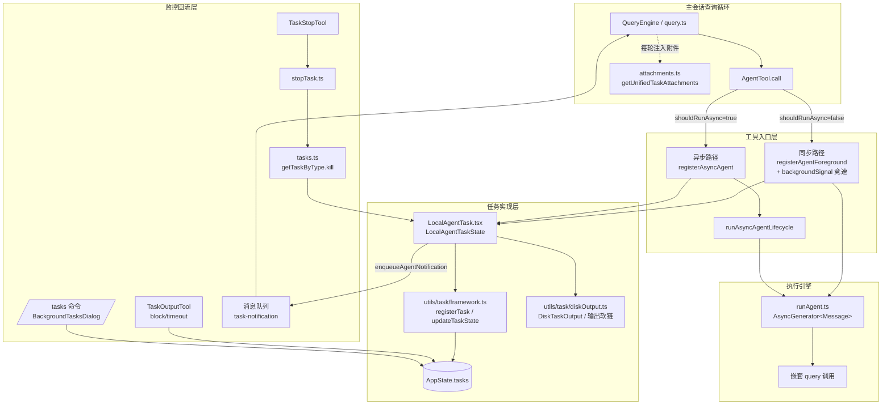

子代理与后台任务框架是这套终端 AI 编程助手实现**并行委派**能力的中枢神经系统。当主对话中的模型决定将一部分工作委托出去时，`Agent` 工具（即 AgentTool）作为唯一入口，根据执行模式将请求分叉为**同步子代理**（阻塞当前轮次直至完成）或**异步后台任务**（立即返回、稍后通过通知回流结果）。本页面向高级开发者，系统剖析这条链路的五层结构：类型契约层（`Task.ts`）、任务注册表（`tasks.ts`）、工具入口层（`AgentTool.tsx`）、任务实现层（`LocalAgentTask.tsx`）与监控回流层（TaskOutputTool/TaskStopTool/附件注入）。前置阅读建议先熟悉 [Tool 接口契约：输入校验、权限决策、进度回调与 Ink UI 渲染](10-tool-jie-kou-qi-yue-shu-ru-xiao-yan-quan-xian-jue-ce-jin-du-hui-tiao-yu-ink-ui-xuan-ran) 与 [查询引擎 QueryEngine：会话编排、消息流转与状态管理](6-cha-xun-yin-qing-queryengine-hui-hua-bian-pai-xiao-xi-liu-zhuan-yu-zhuang-tai-guan-li)，因为子代理本质上是一次嵌套的 `query()` 调用，而后台任务状态最终通过查询循环的附件机制回流给模型。

## 分层架构总览

整个框架遵循严格的**单向依赖**设计：类型层不依赖任何实现；任务实现只依赖框架工具函数；AgentTool 通过 `setAppStateForTasks`（而非自身的 `setAppState`）直连根状态存储，保证即使父级本身是一个异步代理（嵌套 async→async 场景下 `setAppState` 是空操作），任务注册与进度更新依然可见。理解这张图后，后文每一节对应图中一个具体模块。

图中值得注意的三个闭环：**状态闭环**（AppState.tasks 是唯一事实源，UI、模型工具、SDK 事件全部从它派生）；**输出闭环**（磁盘输出文件既是模型可读的进度源，也是 UI 详情视图的数据源）；**通知闭环**（任务完成 → `enqueueAgentNotification` → 消息队列 → 下一轮查询作为用户消息注入 → 模型感知结果）。

Sources: [Task.ts](Task.ts#L72-L76), [tasks.ts](tasks.ts#L22-L39), [AgentTool.tsx](tools/AgentTool/AgentTool.tsx#L255-L259), [runAgent.ts](tools/AgentTool/runAgent.ts#L334-L338), [attachments.ts](utils/attachments.ts#L3439-L3462)

## 类型契约层：TaskType、TaskStatus 与多态 Task 接口

框架的根基是 `Task.ts` 中定义的三个类型族。`TaskType` 是一个七成员字面量联合——`local_bash`、`local_agent`、`remote_agent`、`in_process_teammate`、`local_workflow`、`monitor_mcp`、`dream`——覆盖了从 Shell 后台进程到"梦境"整理任务的全部异构负载。`TaskStatus` 则是五态生命周期：`pending → running → completed | failed | killed`，其中后三者为终态，由 `isTerminalTaskStatus()` 判定，该谓词被广泛用于防止向已死任务注入消息、从 AppState 中淘汰已完成任务以及孤儿清理路径。

最值得注意的是 `Task` 接口的**刻意收窄**：注释明确记录了一次架构决策（#22546）——`spawn`/`render` 从未被多态调用过，因此接口只保留 `kill(taskId, setAppState)` 一个方法，且六个 kill 实现只用到了 `setAppState`，`getAppState`/`abortController` 参数是死重被移除。这是典型的"多态接口只保留真实多态行为"的治理实践。所有具体任务状态类型都通过 `TaskStateBase` 共享公共字段：`id`、`type`、`status`、`description`、`toolUseId`（关联到触发任务的工具调用，用于通知回流时对齐）、`startTime`/`endTime`、`outputFile`、`outputOffset`（增量读取磁盘输出的游标）与 `notified`（防止重复通知的原子标志位）。

任务 ID 的生成同样有安全考量：每种类型有单字符前缀（`local_agent` → `a`，`local_bash` 因向后兼容保留 `b`），后接 8 个从 36 字符小写字母表中取样的随机字符——36⁸ ≈ 2.8 万亿组合，注释明确说明这一强度足以抵抗针对任务输出目录的**符号链接暴力枚举攻击**（配合后文 `O_NOFOLLOW` 使用）。

Sources: [Task.ts](Task.ts#L6-L29), [Task.ts](Task.ts#L44-L76), [Task.ts](Task.ts#L78-L106)

`tasks.ts` 在此之上构建注册表：`getAllTasks()` 返回 `[LocalShellTask, LocalAgentTask, RemoteAgentTask, DreamTask]` 基础数组，再按 Bun 编译期特性标记（`WORKFLOW_SCRIPTS`、`MONITOR_TOOL`）条件追加两个 ant 内部任务实现——这延续了 [构建体系与特性门控](4-gou-jian-ti-xi-yu-te-xing-men-kong-bun-bian-yi-qi-te-xing-biao-ji-yu-si-dai-ma-xiao-chu) 中描述的死代码消除模式。`getTaskByType()` 是唯一的分发入口，当前仅服务于 kill 操作（被 TaskStopTool 与 SDK 的 stop_task 控制消息共用）。

Sources: [tasks.ts](tasks.ts#L8-L39)

## AgentTool：输入契约与执行分叉决策

AgentTool 的输入 schema 由懒加载的 Zod 定义组装，核心五参数为 `description`（3-5 词任务描述）、`prompt`（任务指令全文）、`subagent_type`（专用代理类型）、`model`（sonnet/opus/haiku 覆盖）与 `run_in_background`。多代理参数（`name`/`team_name`/`mode`）与隔离参数（`isolation: worktree|remote`、`cwd`）在 `fullInputSchema` 中扩展，且通过 `.omit()` 而非条件展开来裁剪未开放的字段——注释解释了原因：三元展开会破坏 Zod 类型推断（字段坍缩为 `unknown`）。当 `CLAUDE_CODE_DISABLE_BACKGROUND_TASKS` 为真或 fork 实验门控开启时，`run_in_background` 参数从模型可见的 schema 中整体移除，从源头阻止模型生成无效调用。

输出 schema 是一个**判别联合**：同步路径返回 `status: 'completed'` 附带完整结果；异步路径返回 `status: 'async_launched'`，仅含 `agentId`、`description`、`prompt`、`outputFile` 与 `canReadOutputFile`（标记调用方是否拥有 Read/Bash 工具以自行查看进度文件）。另有两个不进入导出 schema 的内部形态 `teammate_spawned` 与 `remote_launched`——TypeScript 类型擦除使它们可以安全存在于联合类型中而不泄漏进模型可见的 schema。

Sources: [AgentTool.tsx](tools/AgentTool/AgentTool.tsx#L81-L138), [AgentTool.tsx](tools/AgentTool/AgentTool.tsx#L140-L191)

`call()` 主流程的前段是一系列守卫与路由决策，按下表梳理：

| 决策点 | 条件 | 结果 |
|---|---|---|
| 团队生成守卫 | `team_name` 存在但 swarms 未开放 | 抛错提示计划不可用 |
| 嵌套队友守卫 | 当前是 teammate 且传入 `name` | 抛错——团队花名册是扁平的，禁止嵌套 |
| 进程内队友后台守卫 | in-process teammate + `run_in_background` | 抛错——其生命周期绑定领导者进程 |
| Teammate 生成分支 | `teamName && name` 同时存在 | 走 `spawnTeammate()`，返回 `teammate_spawned` |
| Fork 路由 | `subagent_type` 缺省且 fork 门控开启 | 选中 FORK_AGENT，继承父系统提示词 |
| 常规路由 | 其余情况 | 默认 general-purpose，否则按类型查找 |
| 权限过滤 | `filterDeniedAgents` | 支持 `Agent(名称)` 语法拒绝特定代理类型 |
| MCP 就绪等待 | 代理声明 `requiredMcpServers` | 最多轮询 30 秒等 pending 服务器，失败早退 |

Sources: [AgentTool.tsx](tools/AgentTool/AgentTool.tsx#L261-L281), [AgentTool.tsx](tools/AgentTool/AgentTool.tsx#L284-L316), [AgentTool.tsx](tools/AgentTool/AgentTool.tsx#L318-L356), [AgentTool.tsx](tools/AgentTool/AgentTool.tsx#L371-L392)

**同步/异步分叉**由一行布尔表达式决定：`shouldRunAsync = (run_in_background === true || selectedAgent.background === true || isCoordinator || forceAsync || assistantForceAsync || proactiveActive) && !isBackgroundTasksDisabled`。这里有五个触发源：模型的显式请求、代理定义 frontmatter 中的 `background: true`、协调者模式（所有子代理强制异步以统一 `<task-notification>` 交互模型）、KAIROS 助手模式（同步子代理会撑满守护进程的 inputQueue 并阻塞所有用户输入，注释详述了这个 cron 补偿触发堆积的故障模式）以及主动模式。分叉前，AgentTool 还会为工作者独立组装工具池——工作者始终以自己的权限模式（默认 `acceptEdits`）从 `assembleToolPool` 获取工具，不受父级工具限制影响；这一计算特意放在 AgentTool 中完成，以避免 runAgent 反向依赖 tools.ts 形成循环。

Sources: [AgentTool.tsx](tools/AgentTool/AgentTool.tsx#L555-L577), [AgentTool.tsx](tools/AgentTool/AgentTool.tsx#L568-L577)

## 异步路径与同步路径：两种生命周期，一个收敛点

**异步路径**（`shouldRunAsync === true`）极其简洁：调用 `registerAsyncAgent` 在 AppState 中登记任务（`isBackgrounded: true`，立即后台化），可选地注册 `name → agentId` 映射供 SendMessage 路由，然后以 `void runWithAgentContext(...)` **脱离调用栈**启动 `runAsyncAgentLifecycle`，并立即向模型返回 `async_launched` 输出。关键细节：后台代理**不链接父级的 AbortController**——用户按 ESC 取消主线程时后台代理存活，只能通过 `chat:killAgents` 显式终止。注释还解释了 AsyncLocalStorage 的工作负载传播：ALS 上下文在 `void` 触发时捕获，穿越其内部所有 await，脱离闭包自动看到父轮次的工作负载，无需手动捕获恢复。

**同步路径**则采用**竞速循环**模式：先通过 `registerAgentForeground` 注册一个前台任务（`isBackgrounded: false`），获得一个 `backgroundSignal` Promise；随后进入消息循环，每次迭代用 `Promise.race([nextMessagePromise, backgroundPromise])` 竞速"代理的下一个消息"与"后台化信号"。运行超过 2 秒（`PROGRESS_THRESHOLD_MS`）会向终端渲染 `BackgroundHint` 提示用户可后台化；若启用了自动后台（`CLAUDE_AUTO_BACKGROUND_TASKS` 环境变量或 GrowthBook 门控，默认 120 秒），超时定时器会自动翻转 `isBackgrounded` 并 resolve 信号。当竞速结果为 background 时，同步路径执行一次优雅交接：`agentIterator.return()` 让前台生成器的 finally 块运行（释放 MCP 连接、会话钩子、提示缓存追踪，带 1 秒超时防挂起），然后以相同参数、`isAsync: true` 重新启动 `runAgent` 在后台闭包中继续，已积累的消息数组被继承，进度追踪器从既有消息重建——最终向模型返回 `async_launched`，与原生异步路径完全收敛。

Sources: [AgentTool.tsx](tools/AgentTool/AgentTool.tsx#L686-L764), [AgentTool.tsx](tools/AgentTool/AgentTool.tsx#L808-L833), [AgentTool.tsx](tools/AgentTool/AgentTool.tsx#L868-L892), [AgentTool.tsx](tools/AgentTool/AgentTool.tsx#L897-L951)

`runAsyncAgentLifecycle` 是两条路径共享的**从生成到终态通知的驱动器**（resumeAgentBackground 也复用它）。其完成序列的顺序性经过精心设计，注释中标注了对应的 gh-20236 缺陷：`finalizeAgentTool` 组装结果后，**先调用 `completeAsyncAgent` 翻转状态**，让阻塞在 `TaskOutput(block=true)` 上的调用方立即解除阻塞；然后才执行可能挂起的修饰性操作——auto 模式下的 `classifyHandoffIfNeeded` 安全分类器（一次 API 调用，审查子代理产出是否违反块规则）与 worktree 清理（一次 git 执行）。异常分支同样遵循此序：AbortError 时先 `killAsyncAgent` 再做 worktree 清理与部分结果提取（`extractPartialResult` 从消息数组尾部向前找最后一条含文本的 assistant 消息，保留被杀代理已完成的工作），最后统一 `enqueueAgentNotification`。finally 块清理技能调用状态与提示转储状态。

Sources: [agentToolUtils.ts](tools/AgentTool/agentToolUtils.ts#L504-L535), [agentToolUtils.ts](tools/AgentTool/agentToolUtils.ts#L595-L637), [agentToolUtils.ts](tools/AgentTool/agentToolUtils.ts#L638-L686), [agentToolUtils.ts](tools/AgentTool/agentToolUtils.ts#L483-L500)

## LocalAgentTask：状态结构与生命周期管理

`LocalAgentTaskState` 在 `TaskStateBase` 之上扩展了本地代理特有的字段，其中四个布尔标志构成一套精密的 UI/内存管理协议：`isBackgrounded`（前台任务尚未后台化时为 false，`isBackgroundTask` 谓词据此将其排除出后台指示器）、`retain`（UI 正在"持有"该任务——由 enterTeammateView 设置，阻止淘汰、启用流式追加、触发磁盘引导）、`diskLoaded`（引导已读取 sidechain JSONL 并按 UUID 合并进 messages，每个 retain 周期执行一次）与 `retrieved`。注释对 retain 与 `viewingAgentTaskId` 的区分尤为清晰：后者是"我在看什么"，retain 是"我在持有什么"。`evictAfter` 是面板可见性截止时间戳——终态转换或取消选中时设定为 `Date.now() + PANEL_GRACE_MS`（30 秒），retain 时清除。`pendingMessages` 承载 SendMessage 在轮次中途排入的消息，在工具轮边界被 drain。

进度追踪采用 `ProgressTracker` 结构，其 token 计数逻辑直接对齐 Claude API 语义：`input_tokens` 每轮累计（包含全部上文）故**保留最新值**，`output_tokens` 按轮报告故**累加求和**；`recentActivities` 保留最近 5 条工具活动，每条由 `Tool.getActivityDescription()` 预先计算人类可读描述（如 "Reading src/foo.ts"）并预分类 isSearch/isRead——预计算避免了渲染时反向查询工具表。

Sources: [LocalAgentTask.tsx](tasks/LocalAgentTask/LocalAgentTask.tsx#L116-L151), [LocalAgentTask.tsx](tasks/LocalAgentTask/LocalAgentTask.tsx#L33-L59), [LocalAgentTask.tsx](tasks/LocalAgentTask/LocalAgentTask.tsx#L68-L115)

该模块导出的生命周期函数覆盖了状态机的全部转换边，汇总如下：

| 函数 | 转换 | 关键行为 |
|---|---|---|
| `registerAsyncAgent` | → running（后台） | 初始化输出软链；可选父级 AbortController 级联（createChildAbortController）；注册进程退出清理 |
| `registerAgentForeground` | → running（前台） | 创建 backgroundSignal Promise + resolver 映射；可选自动后台定时器 |
| `backgroundAgentTask` | 前台→后台 | 翻转 `isBackgrounded`，resolve 信号中断同步循环 |
| `completeAgentTask` | running→completed | 存储结果、清理 abortController、设定 evictAfter、异步淘汰输出 |
| `failAgentTask` | running→failed | 同上，附带 error 字符串 |
| `killAsyncAgent` | running→killed | abort 控制器、状态幂等（非 running 直接跳过）、`evictTaskOutput` |
| `enqueueAgentNotification` | 通知回流 | **原子 check-and-set notified 标志**防重复；中止投机预生成；组装 XML 通知 |

`enqueueAgentNotification` 的原子性设计值得展开：它在一个 `updateTaskState` 闭包内完成"检查 notified → 置位 notified"，若已被置位（如 TaskStopTool 先行通知过）则跳过，避免向模型发送冗余消息。通知体是结构化 XML：`<task-notification>` 包裹 `<task-id>`、`<output-file>`、`<status>`、`
` 与可选的 `<result>`、`<usage>`（total_tokens/tool_uses/duration_ms）、`<worktree>` 信息，以 `task-notification` 模式进入消息队列，在下一个安全注入点回流。`updateAgentProgress` 则通过"先捕获既有 summary 再展开"的顺序保护后台摘要服务写入的进度摘要不被 assistant 消息驱动的进度更新覆盖。

Sources: [LocalAgentTask.tsx](tasks/LocalAgentTask/LocalAgentTask.tsx#L197-L262), [LocalAgentTask.tsx](tasks/LocalAgentTask/LocalAgentTask.tsx#L270-L303), [LocalAgentTask.tsx](tasks/LocalAgentTask/LocalAgentTask.tsx#L412-L456), [LocalAgentTask.tsx](tasks/LocalAgentTask/LocalAgentTask.tsx#L466-L515), [LocalAgentTask.tsx](tasks/LocalAgentTask/LocalAgentTask.tsx#L339-L353)

## 任务框架：状态注册、磁盘输出与淘汰机制

`utils/task/framework.ts` 是所有任务类型共享的基础设施。`updateTaskState<T>` 是泛型的不可变状态更新器，有一个微妙的优化：当 updater 返回相同引用（提前返回的无操作）时跳过展开，避免 `tasks` 选择器的订阅者无谓重渲染。`registerTask` 在登记新任务时通过 `enqueueSdkEvent` 发射 `task_started` SDK 事件；当检测到同 ID 替换（resumeAgentBackground 场景）时，**继承**旧任务的 `retain`、`startTime`、`messages`、`diskLoaded`、`pendingMessages`——保证面板排序稳定、用户刚追加的提示词（尚在内存未落盘）不丢失，并跳过重复事件发射。

内存治理采用**双通道淘汰**：急通道 `evictTerminalTask` 在任务终态且已通知后即刻从 AppState 移除（受 `evictAfter` 宽限期约束，UI 正在持有/查看的任务不会被回收）；懒通道则是 `generateTaskAttachments` 中的 GC 兜底——每次轮询发现已通知的终态任务即标记淘汰。`applyTaskOffsetsAndEvictions` 的注释记录了一个 TOCTOU 防御：offset 补丁与淘汰操作必须**合并到新鲜的 prev.tasks**（而非 await 之前拍下的过期快照）上执行，且逐任务重新校验状态——任务可能在 `getTaskOutputDelta` 的异步磁盘读取期间完成，展开过期快照会把状态"僵尸化"。

Sources: [framework.ts](utils/task/framework.ts#L43-L72), [framework.ts](utils/task/framework.ts#L74-L117), [framework.ts](utils/task/framework.ts#L119-L144), [framework.ts](utils/task/framework.ts#L208-L249)

磁盘输出层（`utils/task/diskOutput.ts`）有三处防御性设计。其一，输出目录按**会话隔离**：`项目临时目录/{sessionId}/tasks`，且 sessionId 在**首次调用时捕获**而非每次重读——`/clear` 会重新生成会话 ID，若每次重读会导致后台 bash 任务在 /clear 后的输出文件路径漂移、读取 ENOENT（注释引用了两个真实故障工单）。其二，`O_NOFOLLOW` 打开标志防止沙箱内攻击者在任务目录创建指向任意文件的符号链接、诱使宿主进程写入（该攻击面仅存在于 Unix，Windows 上标志缺省为 0）。其三，`DiskTaskOutput` 类用**扁平数组写队列 + 单一 drain 循环**替代链式 `.then()`——每个 chunk 在其写入完成后即可被 GC，避免了链式闭包把所有数据保留到整链 resolve 的内存滞留问题；总输出量有 5GB 硬上限，超限后追加截断标记并停止写入。对 `local_agent` 任务，输出文件是**指向代理会话转录 JSONL 的符号链接**（`initTaskOutputAsSymlink`），因此 `outputFile` 路径实际暴露的是完整 sidechain 转录。

Sources: [diskOutput.ts](utils/task/diskOutput.ts#L17-L31), [diskOutput.ts](utils/task/diskOutput.ts#L33-L74), [diskOutput.ts](utils/task/diskOutput.ts#L89-L120)

## 任务状态监控：模型侧工具、SDK 事件与附件回流

监控体系为模型提供两个工具。**TaskOutputTool** 的输入为 `task_id`、`block`（默认 true，阻塞等待完成）与 `timeout`（默认 30 秒，上限 600 秒）；`waitForTaskCompletion` 以 100ms 间隔轮询 AppState 中的任务状态直至非 running/pending 或超时，并响应 AbortController。其输出组装有一个明确优先级：对 `local_agent` 任务，**优先使用内存中的干净终态结果**而非磁盘原始 JSONL——注释解释磁盘输出是完整会话转录的符号链接（包含每条消息、每个工具调用），内存 result 只含最终 assistant 文本块。**TaskStopTool** 接受 `task_id`（兼容废弃的 `shell_id`/KillShell 别名），`validateInput` 前置校验任务存在且处于 running 态，然后委托共享的 `stopTask()`——该函数同时服务 LLM 工具调用与 SDK 的 stop_task 控制消息，通过 `getTaskByType()` 分发到具体任务实现的 `kill`，抛出带 `not_found`/`not_running`/`unsupported_type` 错误码的 `StopTaskError`。

Sources: [TaskOutputTool.tsx](tools/TaskOutputTool/TaskOutputTool.tsx#L30-L54), [TaskOutputTool.tsx](tools/TaskOutputTool/TaskOutputTool.tsx#L60-L143), [TaskStopTool.ts](tools/TaskStopTool/TaskStopTool.ts#L10-L59), [stopTask.ts](tasks/stopTask.ts#L31-L60)

模型侧的第二条感知通道是**查询循环的附件注入**。`utils/attachments.ts` 中的 `getUnifiedTaskAttachments`（注释表明它统一取代了旧的 getBackgroundShellAttachments / getBackgroundRemoteSessionAttachments / getAsyncAgentAttachments 三个函数）在每轮查询时调用 `generateTaskAttachments` 轮询所有 running 任务的磁盘输出增量，转换为 `task_status` 附件注入对话。与之互补，运行中任务的**实时进度**通过 `emitTaskProgress` 发射 SDK `tool_progress` 事件（服务 VS Code 等外部消费者的子代理面板），每次消息中检测到新工具调用时触发，增量由 `lastReportedToolCount`/`lastReportedTokenCount` 计算。UI 侧的 `/tasks` 命令（`commands/tasks/tasks.tsx`）直接渲染 `BackgroundTasksDialog`，该对话框以判别联合 `ListItem` 类型统一七种任务类型加 leader 项，为每种类型配备专属详情对话框（`AsyncAgentDetailDialog`、`ShellDetailDialog`、`RemoteSessionDetailDialog` 等），ant 专属的 Workflow/Monitor 对话框通过 `feature()` + require 门控以支持死代码消除。状态图标的语义映射由 `taskStatusUtils.tsx` 提供：error→✗、awaitingApproval→?、running→▶（空闲时 →…）、completed→✓、failed/killed→✗，颜色则映射到主题的 success/error/warning/background 四个语义槽。

Sources: [attachments.ts](utils/attachments.ts#L3434-L3462), [LocalAgentTask.tsx](tasks/LocalAgentTask/LocalAgentTask.tsx#L129-L134), [tasks.tsx](commands/tasks/tasks.tsx#L5-L8), [BackgroundTasksDialog.tsx](components/tasks/BackgroundTasksDialog.tsx#L43-L126), [taskStatusUtils.tsx](components/tasks/taskStatusUtils.tsx#L16-L70)

## runAgent 执行引擎：上下文组装的经济学

`runAgent` 是一个 `AsyncGenerator<Message>`，把代理定义、提示消息与工具池转化为消息流，内部调用与主循环相同的 `query()`（详见 [单轮查询循环：流式响应处理、工具调用与错误恢复](7-dan-lun-cha-xun-xun-huan-liu-shi-xiang-ying-chu-li-gong-ju-diao-yong-yu-cuo-wu-hui-fu)）。除常规的模型解析（`getAgentModel` 处理定义 frontmatter、调用参数与主循环模型的优先级链）与 Perfetto 追踪注册外，其最有工程含量的部分是**上下文瘦身**：只读代理（Explore/Plan）不执行 CLAUDE.md 中的 commit/PR/lint 规则——主代理有完整上下文会自行解释其输出——注释给出了量化收益："dropping claudeMd here saves ~5-15 Gtok/week across 34M+ Explore spawns"，由 `tengu_slim_subagent_claudemd` GrowthBook 杀手开关控制（默认开启）；同理，父会话启动时的 gitStatus（最多 40KB，且标注为过期数据）对只读搜索代理是死重，每年再省 1-3 Gtok。权限处理上，代理定义的 `permissionMode` 会覆盖父级（除非父级处于 bypassPermissions/acceptEdits/auto 这些更强模式），异步代理额外设置 `shouldAvoidPermissionPrompts`（无法弹 UI 时自动拒绝），而 `bubble` 权限模式例外——它的语义就是把提示冒泡到父终端。代理还可通过 frontmatter 声明专属 MCP 服务器，由 `initializeAgentMcpServers` 在启动时连接、结束时清理，构成对父级 MCP 客户端的增量合并。

Sources: [runAgent.ts](tools/AgentTool/runAgent.ts#L280-L347), [runAgent.ts](tools/AgentTool/runAgent.ts#L385-L410), [runAgent.ts](tools/AgentTool/runAgent.ts#L412-L450), [runAgent.ts](tools/AgentTool/runAgent.ts#L85-L130)

## 代理定义体系：内置代理与 Frontmatter 契约

代理定义（`AgentDefinition`）的 JSON Schema 契约包含：`description`（必填）、`prompt`（必填）、`tools`/`disallowedTools`、`model`（支持 `inherit` 归一化）、`effort`、`permissionMode`、`mcpServers`（按名引用或内联配置）、`hooks`（会话作用域钩子）、`maxTurns`、`skills`（预载技能）、`initialPrompt`、`memory`（user/project/local 三档作用域，详见 [记忆系统](27-ji-yi-xi-tong-memdir-ji-yi-sao-miao-xiang-guan-xing-jian-suo-tuan-dui-ji-yi-tong-bu-yu-zi-dong-gu-hua)）、`background`（强制后台）与 `isolation`。内置代理由 `getBuiltInAgents()` 动态组装：GENERAL_PURPOSE 与 STATUSLINE_SETUP 恒在；EXPLORE/PLAN 受 `tengu_amber_stoat` A/B 门控（3P 默认保留，测量移除影响）；CLAUDE_CODE_GUIDE 仅非 SDK 入口加载；VERIFICATION 需双重门控。SDK 用户可通过 `CLAUDE_AGENT_SDK_DISABLE_BUILTIN_AGENTS` 获得空白代理面。

以 **Explore 代理**为典型样本：只读约束通过 `disallowedTools` 硬编码（禁用 Agent、ExitPlanMode、FileEdit、FileWrite、NotebookEdit），系统提示词以"CRITICAL: READ-ONLY MODE"章节强化（禁创建/修改/删除/移动文件、禁重定向写入），工具指引适配 ant 内嵌搜索工具（find/grep 别名到 bfs/ugrep 时改走 Bash）；模型选择体现内外差异——ant 用户 `inherit` 主模型，外部用户固定 haiku 求速度。`constants.ts` 中的 `ONE_SHOT_BUILTIN_AGENT_TYPES`（Explore、Plan）标记"运行一次即返回报告、父级永不 SendMessage 续聊"的代理，为其跳过 agentId/SendMessage/usage 尾注——注释量化为每次约 135 字符 × 每周 3400 万次 Explore 运行。工具名本身也有一段演化史：`AGENT_TOOL_NAME = 'Agent'` 而 `LEGACY_AGENT_TOOL_NAME = 'Task'`，旧名保留为别名以兼容权限规则、钩子与恢复的会话，TaskOutputTool 的 `BashOutputTool`/`AgentOutputTool` 与 TaskStopTool 的 `KillShell` 别名同理。

Sources: [loadAgentsDir.ts](tools/AgentTool/loadAgentsDir.ts#L73-L120), [builtInAgents.ts](tools/AgentTool/builtInAgents.ts#L22-L72), [exploreAgent.ts](tools/AgentTool/built-in/exploreAgent.ts#L64-L80), [constants.ts](tools/AgentTool/constants.ts#L1-L13), [TaskOutputTool.tsx](tools/TaskOutputTool/TaskOutputTool.tsx#L148-L150)

## 设计要点与工程权衡总结

纵观全框架，可以提炼出六个反复出现的设计模式。**状态先行原则**：所有可能挂起的操作（分类器 API、git 清理）不得阻塞状态机翻转——`completeAsyncAgent` 永远先于通知装饰执行，gh-20236 的教训已固化为代码注释与两处一致的实现。**原子标志去重**：`notified` 的 check-and-set、`isBackgrounded` 的幂等翻转，都用单一状态字段承担互斥语义。**新鲜状态合并**：所有跨 await 的状态回写（offset、淘汰）都在 setAppState 闭包内对新鲜 prev 重校验，杜绝 TOCTOU。**收敛式生命周期**：同步转后台不是abort 重启而是参数级延续——消息数组、进度追踪器、worktree 上下文全部继承，用户视角零中断。**消费分层**：同一份 AppState.tasks 派生出模型工具（TaskOutput/TaskStop）、SDK 事件（task_started/tool_progress/task_terminated）、终端 UI（BackgroundTasksDialog）与附件回流四个消费面，各自独立演进。**编译期门控**：ant 内部特性（WORKFLOW_SCRIPTS、MONITOR_TOOL、COORDINATOR_MODE）通过 `feature()` + require 保持外部构建的体积纪律，延续了 [构建体系与特性门控](4-gou-jian-ti-xi-yu-te-xing-men-kong-bun-bian-yi-qi-te-xing-biao-ji-yu-si-dai-ma-xiao-chu) 的治理思路。

| 维度 | 同步子代理 | 异步后台任务 |
|---|---|---|
| 注册方式 | `registerAgentForeground`（isBackgrounded: false） | `registerAsyncAgent`（isBackgrounded: true） |
| 模型等待 | 阻塞 call() 直至完成 | 立即返回 `async_launched` |
| 中断传播 | 随父级 AbortController | 独立控制器，ESC 不影响 |
| 进度可见性 | onProgress 流式（agent_progress） | AppState.progress + SDK tool_progress |
| 结果回流 | 工具结果直接返回 | `<task-notification>` 消息队列 |
| 可后台化 | 是（竞速信号，含 120s 自动后台） | 已是后台 |
| 典型触发 | 默认路径 | `run_in_background`、代理 `background: true`、coordinator/fork/KAIROS 强制 |

Sources: [AgentTool.tsx](tools/AgentTool/AgentTool.tsx#L692-L698), [LocalAgentTask.tsx](tasks/LocalAgentTask/LocalAgentTask.tsx#L499-L515), [agentToolUtils.ts](tools/AgentTool/agentToolUtils.ts#L599-L603)

理解本框架后，两条自然的延伸线：其一是 **Swarm 团队协作**——当 `name`/`team_name` 参数出现时 AgentTool 分叉到 `spawnTeammate`，进入完全不同的进程内 Teammate 与消息邮箱体系，详见 [Swarm 团队协作：进程内 Teammate、消息邮箱与权限同步](26-swarm-tuan-dui-xie-zuo-jin-cheng-nei-teammate-xiao-xi-you-xiang-yu-quan-xian-tong-bu)；其二是 **远程任务**——`RemoteAgentTask` 将同一套 Task 状态机投射到远程 CCR 环境，与 [远程控制架构：REPL Bridge、远程会话管理与直连服务器](28-yuan-cheng-kong-zhi-jia-gou-repl-bridge-yuan-cheng-hui-hua-guan-li-yu-zhi-lian-fu-wu-qi) 中的会话管理基础设施衔接。若想了解任务执行背后的并发控制与工具钩子编排，可继续阅读 [工具执行编排：StreamingToolExecutor、并发控制与工具钩子](12-gong-ju-zhi-xing-bian-pai-streamingtoolexecutor-bing-fa-kong-zhi-yu-gong-ju-gou-zi)。