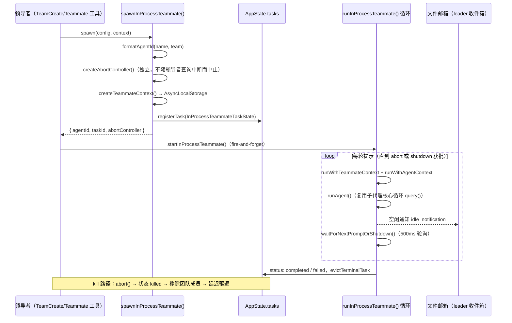
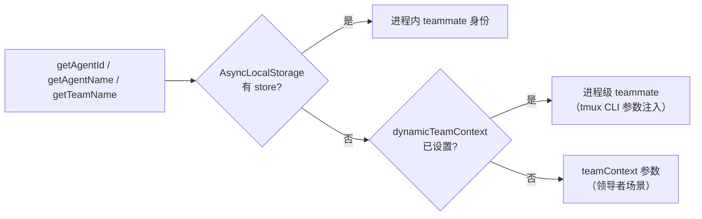
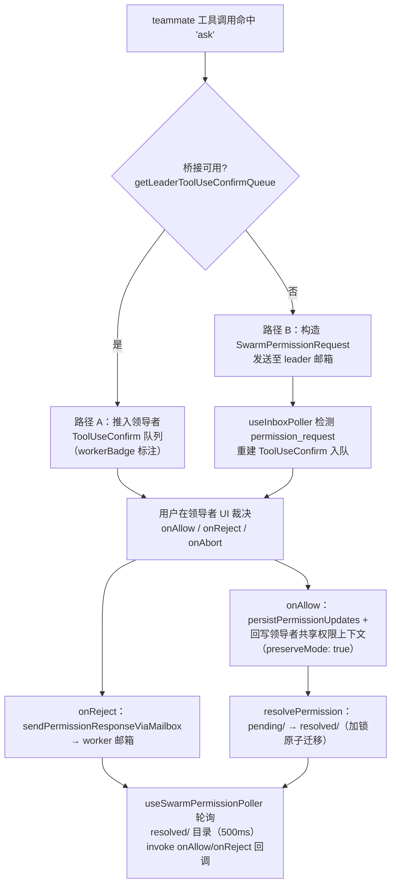

本文是「多智能体与记忆」主题下的核心篇章，聚焦 Swarm（Agent Teams）子系统的三大支柱：**进程内 Teammate 执行模型**、**基于文件的团队消息邮箱（Mailbox）**，以及**跨进程权限同步机制**。该子系统的核心设计张力在于：让多个拥有独立身份与独立权限上下文的智能体，既能共享领导者（team-lead）所在 Node.js 进程的 API 客户端、MCP 连接与 AppState 等昂贵资源，又能通过一套与 tmux/iTerm2 多进程后端完全兼容的磁盘级通信协议保持行为一致性。全文遵循「后端抽象 → 生命周期 → 身份隔离 → 通信协议 → 权限同步 → 状态与 UI」的架构分层展开，适合希望理解多智能体运行时隔离与协调机制的资深开发者。

Sources: [spawnInProcess](utils/swarm/spawnInProcess.ts#L1-L22) · [InProcessBackend](utils/swarm/backends/InProcessBackend.ts#L34-L51)

## 后端抽象：三种 Teammate 执行模式

Swarm 将「Teammate 如何运行」抽象为 `TeammateExecutor` 后端接口，进程内后端与 tmux、iTerm2 面板后端平级共存。后端注册表（registry）在进程生命周期内只做一次探测并缓存结果：优先根据 teammate 模式快照，其次检测 tmux/iTerm2 可用性；当没有任何面板后端可用时（例如未安装 tmux 的 iTerm2 环境），spawn 会回退到进程内模式并设置 `inProcessFallbackActive` 标志，使横幅与团队菜单 UI 如实反映当前模式。三种后端的关键差异如下：

| 维度 | tmux / iTerm2（进程级） | in-process（进程内） |
|---|---|---|
| 执行载体 | 独立 Node 进程，运行于终端面板 | 同一 Node 进程内的异步任务 |
| 身份注入 | CLI 参数 + 环境变量（`CLAUDE_CODE_AGENT_ID` 等）→ `dynamicTeamContext` | `AsyncLocalStorage<TeammateContext>` |
| 生命周期终止 | `killPane` 销毁面板/进程 | `AbortController.abort()` |
| 资源占用 | 每实例独立 API/MCP 连接，冷启动成本高 | 共享领导者连接，零冷启动 |
| 消息通道 | 仅文件邮箱 | 文件邮箱（与进程级完全一致） |
| 权限请求 | 邮箱轮询 → 领导者 UI | 优先领导者 UI 桥接，邮箱兜底 |

`InProcessBackend` 实现了 `TeammateExecutor` 接口的完整面：`spawn()` 委托给 `spawnInProcessTeammate()` 完成上下文创建与任务注册，再以 fire-and-forget 方式调用 `startInProcessTeammate()` 启动智能体循环；`kill()` 委托给 `killInProcessTeammate()`；`send()` 直接写入收件人邮箱文件——这意味着发送方无需关心接收方是进程内还是 tmux 面板中的 teammate。值得注意的是，`spawn()` 前必须调用 `setContext()` 注入 `ToolUseContext`（AppState 访问入口），这是 InProcess 后端独有的前置条件，因为进程内 teammate 需要借用领导者的工具上下文。

Sources: [types](utils/swarm/backends/types.ts#L8-L42) · [registry](utils/swarm/backends/registry.ts#L45-L57) · [InProcessBackend](utils/swarm/backends/InProcessBackend.ts#L34-L120)

整个子系统的功能门控收敛于单一函数 `isAgentSwarmsEnabled()`：内部（ant）构建恒开；外部构建需同时满足「`CLAUDE_CODE_EXPERIMENTAL_AGENT_TEAMS` 环境变量或 `--agent-teams` 标志」与 GrowthBook 杀伤开关 `tengu_amber_flint`。所有 teammate 相关的工具 `isEnabled`、提示词注入与 UI 渲染均以此为准，这是死代码消除（DCE）在多智能体特性上的应用边界。

Sources: [agentSwarmsEnabled](utils/agentSwarmsEnabled.ts#L24-L44)

## 进程内 Teammate 生命周期：从 Spawn 到 Kill

进程内 teammate 的生命周期横跨三个模块：`spawnInProcess.ts` 负责创建与注册，`inProcessRunner.ts` 驱动执行循环，`InProcessTeammateTask.tsx` 提供 Task 接口供统一任务框架调度。以下时序图勾勒了完整生命周期：

Spawn 阶段有三个值得注意的设计决策。**其一，AbortController 是独立的而非链接到父级**——teammate 不应因领导者查询被中断（Esc）而终止，这保证了后台协作的连续性；真正杀死 teammate 的是 `killInProcessTeammate()` 显式调用 `abort()`。**其二，身份被同时物化为两份数据**：`TeammateIdentity`（纯数据，存入 AppState 供持久化与 UI）与 `TeammateContext`（含 AbortController 的运行时对象，供 AsyncLocalStorage 隔离），二者字段同构。**其三，注册 `registerCleanup` 清理钩子**，在进程退出时兜底中止 teammate。

Sources: [spawnInProcess](utils/swarm/spawnInProcess.ts#L100-L205) · [types](tasks/InProcessTeammateTask/types.ts#L11-L32)

Kill 路径在单次 `setAppState` 更新内完成：校验任务存在且 `running`、捕获身份、中止控制器、调用清理钩子、触发空闲回调（解除 `waitForIdle` 等待者阻塞）、从 `teamContext.teammates` 中按 agentId 移除成员，并将任务状态置为 `killed` 且 **`notified: true` 预置**——这个预置很关键：它抑制 XML 通知的发出，并直接闭合 SDK `task_started` 的记账配对，因为运行器自身的完成/失败发射器会守卫 `status === 'running'`，避免双重发射。文件 I/O（从团队文件移除成员）刻意放在状态更新器之外执行，避免在回调中做磁盘操作。状态更新后，任务输出与终端任务分别经过 `evictTaskOutput` 与延迟 `STOPPED_DISPLAY_MS` 的 `evictTerminalTask` 清理，Perfetto 追踪注册也随之注销。

Sources: [spawnInProcess](utils/swarm/spawnInProcess.ts#L216-L329)

执行循环 `runInProcessTeammate()` 的核心是一段 `while (!abortController.signal.aborted && !shouldExit)` 主循环，每轮迭代：创建**回合级** `currentWorkAbortController`（让 Esc 只停止当前工作而不杀死 teammate——这是双层中止语义的关键实现）、必要时执行自动压缩、以 `forkContextMessages` 携带累积历史调用 `runAgent()`（与 AgentTool/子代理共享同一核心，内部走 `query()`）、通过 `updateProgressFromMessage` 驱动进度追踪与 `inProgressToolUseIDs` 动画集合。循环退出后统一进入终态处理，与 kill 路径同样遵循「已终态则不覆盖」的幂等守卫。

Sources: [inProcessRunner](utils/swarm/inProcessRunner.ts#L1000-L1200) · [inProcessRunner](utils/swarm/inProcessRunner.ts#L1413-L1470)

## AsyncLocalStorage 身份隔离：三级解析链

进程内并发的多个 teammate 共享同一事件循环与模块级状态，身份隔离因此成为首要问题。答案是 `AsyncLocalStorage<TeammateContext>`：`runWithTeammateContext(context, fn)` 将身份绑定为异步调用链的执行上下文，任何深处代码通过 `getTeammateContext()` 取回的是「当前逻辑流」的身份而非全局变量。`isInProcess: true` 判别字段使下游可以零歧义地区分上下文类型。

这条三级解析链（AsyncLocalStorage → dynamicTeamContext → AppState.teamContext）统一实现在 `teammate.ts` 的访问器中，所有下游模块（邮箱寻址、权限判断、遥测归因）都经由它取身份，避免了散落的条件分支。`teammateContext.ts` 头部注释明确列出了三套身份机制的分工，是理解本子系统的第一入口。需要特别留意一个微妙点（`useInboxPoller.ts` 注释中亦有交代）：当领导者的 REPL 在某个进程内 teammate 的 AsyncLocalStorage 上下文活跃期间重新渲染时（因共享 `setAppState`），`isInProcessTeammate()` 会返回真——邮箱轮询器对此优雅跳过而非抛错，这是并发执行下的正常现象。

Sources: [teammateContext](utils/teammateContext.ts#L58-L97) · [teammate](utils/teammate.ts#L1-L120) · [useInboxPoller](hooks/useInboxPoller.ts#L60-L78)

系统提示词层面，teammate 在默认系统提示词之后追加 `TEAMMATE_SYSTEM_PROMPT_ADDENDUM`，其内容可提炼为两条硬性约束：**仅输出文本对团队不可见，必须用 SendMessage 工具通信**；用户主要与 team-lead 交互，工作通过任务系统与 teammate 消息协调。无论自定义 agent 定义是否携带显式工具清单，运行器都会强制注入一组「团队必需工具」：SendMessage、TeamCreate/TeamDelete、TaskCreate/Get/List/Update——确保 teammate 永远能响应关机请求、发送消息并通过任务清单协作。权限模式被固定为 `'default'`，使 teammate 不继承领导者可能处于的受限模式（如 plan 模式），从而保有完整工具访问能力；`planModeRequired` 的 teammate 例外地在任务状态上以 `permissionMode: 'plan'` 起步。

Sources: [inProcessRunner](utils/swarm/inProcessRunner.ts#L877-L1000) · [teammatePromptAddendum](utils/swarm/teammatePromptAddendum.ts#L1-L19)

## 文件邮箱：跨后端统一的消息基础设施

消息邮箱是 Swarm 的通信基石，采用「每个成员一个 JSON 收件箱文件」的持久化模型：路径为 `~/.claude/teams/{team_name}/inboxes/{agent_name}.json`，内容是 `TeammateMessage[]` 数组，每条消息含 `from`、`text`、`timestamp`、`read`、`color`（发送者分配色）与 `summary`（UI 预览用的 5–10 词摘要）。**关键洞察在于：进程内 teammate 与 tmux 面板 teammate 使用同一套邮箱协议**——这使消息路由与后端类型完全解耦，`InProcessBackend.send()` 与 tmux 的 `sendCommandToPane()` 最终殊途同归于 `writeToMailbox()`。

并发安全通过 `proper-lockfile` 加锁实现，锁选项采用「重试 + 退避」（10 次重试，5–100ms 超时）而非立即失败，模拟原同步 API 的串行化语义。写路径遵循严格协议：先以 `wx` 标志确保收件箱文件存在（已存在则忽略 EEXIST），再获取 `.lock` 文件锁，**加锁后重读最新状态**（避免读到加锁前的陈旧快照），追加新消息后整体写回。读取侧 `readMailbox()` 将 ENOENT 静默归一化为空数组；消费侧 `markMessageAsReadByIndex()` / `markMessagesAsRead()` 同样遵循「加锁 → 重读 → 改写 → 释放」模式，保证读改写在多智能体并发下线性一致。

Sources: [teammateMailbox](utils/teammateMailbox.ts#L1-L60) · [teammateMailbox](utils/teammateMailbox.ts#L132-L200)

需要注意区分两套同名设施：文件邮箱之外，`utils/mailbox.ts` 还定义了一个**纯内存**的 `Mailbox` 类（消息源为 `user/teammate/system/tick/task`），它以 `revision` 递增 + 等待者（waiter）匹配的模式实现「REPL 繁忙时暂存、空闲时经 `useMailboxBridge` 提交为新回合」的 UI 侧队列，通过 `useSyncExternalStore` 订阅 revision 变化。文件邮箱负责**跨智能体持久通信**，内存 Mailbox 负责**主会话内的入队投递**，二者经 `useInboxPoller` 的 `onSubmitMessage` 参数衔接成完整链路。

Sources: [mailbox](utils/mailbox.ts#L1-L74) · [useMailboxBridge](hooks/useMailboxBridge.ts#L1-L22)

### 邮箱消息协议：九类结构化消息

邮箱文本字段承载两种负载：普通对话文本（投递给模型时包裹 `<teammate-message teammate_id="..." color="..." summary="...">` XML，保证模型看到的格式与 tmux teammate 完全一致），以及 JSON 结构化控制消息。后者由一组 `isXxx()` 探测函数解析，构成 Swarm 的分布式协议层：

| 消息类型 | 方向 | 用途 |
|---|---|---|
| `idle_notification` | worker → leader | 空闲上报（available/interrupted/failed + 摘要） |
| `permission_request` | worker → leader | 权限请求（对齐 SDK `can_use_tool` snake_case 字段） |
| `permission_response` | leader → worker | 权限裁决（success/error，镜像 SDK ControlResponse） |
| `sandbox_permission_request/response` | worker ↔ leader | 沙箱网络访问审批 |
| `plan_approval_request/response` | worker ↔ leader | 计划审批（response 可携带 permissionMode） |
| `shutdown_request` / `approved` / `rejected` | leader ↔ worker | 关机协商（approved 可携带 paneId/backendType） |
| `mode_set_request` | leader → worker | 权限模式切换指令 |
| `team_permission_update` | leader → worker | 团队级允许路径规则下发 |

Sources: [teammateMailbox](utils/teammateMailbox.ts#L425-L560) · [teammateMailbox](utils/teammateMailbox.ts#L640-L839)

### 进程内 Teammate 的等待循环与消息优先级

`waitForNextPromptOrShutdown()` 是进程内 teammate 的「空闲驻留」实现：每 500ms 轮询自身邮箱，检查顺序体现精心设计的**防饥饿优先级**——① 内存 `pendingUserMessages`（用户在放大视图直接键入的消息，最高优先且每次迭代必查）；② 全量扫描未读消息中的 **shutdown_request**（优先于普通消息，防止对等消息洪泛淹没关机信号）；③ 来自 `team-lead` 的未读消息（领导者代表用户意图与协调权，不得被对等闲聊饿死）；④ 其余未读消息按 FIFO；⑤ 团队任务清单中的可认领任务（`pending` + 无 owner + `blockedBy` 全部已解决），认领后转为 `in_progress` 并格式化为新提示。关机请求**不会**被自动批准，而是作为 teammate-message 传给模型，由模型用 approveShutdown/rejectShutdown 工具裁决——把「是否可以关机」保留为智能体决策而非机械规则。

Sources: [inProcessRunner](utils/swarm/inProcessRunner.ts#L619-L873) · [inProcessRunner](utils/swarm/inProcessRunner.ts#L829-L873)

## 权限同步：双路径设计与领导者桥接

当 teammate 的工具调用命中 `'ask'` 裁决时，权限同步机制接管。`createInProcessCanUseTool()` 构造的 `canUseTool` 实现了一条清晰的**双路径降级链**：先透传 allow/deny；对 Bash 命令尝试分类器自动批准（teammate 场景下等待分类器结果而非与用户交互竞速）；然后尝试**路径 A——领导者桥接**：通过 `leaderPermissionBridge` 取得 REPL 注册的 `setToolUseConfirmQueue`，将请求直接推入领导者标准的 `ToolUseConfirm` 对话框队列（带 `workerBadge` 标注来源 teammate 的名字与颜色），使 teammate 享受与领导者完全一致的工具专属 UI（BashPermissionRequest、FileEditToolDiff 等）；**路径 B——邮箱兜底**：当桥接不可用时，构造 `SwarmPermissionRequest` 经 `sendPermissionRequestViaMailbox()` 投递到领导者邮箱，worker 侧注册回调并以 500ms 间隔轮询 `readResolvedPermission()` 直至裁决落盘。

领导者侧的处理位于 `useInboxPoller`：检测到 `permission_request` 且本会话为 team-lead 时，按 `tool_name` 从基础工具集查找工具实例，重建一个携带 `onAllow`/`onReject`/`onAbort` 回调的 `ToolUseConfirm` 入口——这些回调不直接操作 worker，而是调用 `sendPermissionResponseViaMailbox()` 把裁决写回 worker 的收件箱，由 worker 侧的 `useSwarmPermissionPoller`（模块级回调注册表 Map + 500ms 轮询）在检测到 `permission_response` 后调用 `processMailboxPermissionResponse()` 激活对应回调。外部数据中的 `permissionUpdates` 必须经 `permissionUpdateSchema` 逐条校验，畸形条目被过滤并告警而非透传——这是对旧版 teammate 进程产出的脏数据的防御性校验。

Sources: [inProcessRunner](utils/swarm/inProcessRunner.ts#L95-L180) · [inProcessRunner](utils/swarm/inProcessRunner.ts#L197-L379) · [useInboxPoller](hooks/useInboxPoller.ts#L262-L339) · [useSwarmPermissionPoller](hooks/useSwarmPermissionPoller.ts#L64-L120)

路径 A 中有一处精妙的权限回写：当用户在 teammate 的允许对话框勾选「始终允许」时，`onAllow` 回调通过桥接取得 `getLeaderSetToolPermissionContext()`，将 `applyPermissionUpdates()` 的结果**回写领导者共享权限上下文**，但以 `{ preserveMode: true }` 保留领导者的模式——注释明确指出这是为了防止 worker 被转换过的 `'acceptEdits'` 上下文泄漏回协调者。`leaderPermissionBridge.ts` 本身只是一个 55 行的模块级注册表，持有两个 setter 函数引用，使非 React 代码（进程内运行器）能触达 REPL 的 UI 队列——这是「React 状态桥接至命令式世界」的典型轻量方案。

Sources: [leaderPermissionBridge](utils/swarm/leaderPermissionBridge.ts#L22-L55) · [inProcessRunner](utils/swarm/inProcessRunner.ts#L296-L330)

### 磁盘持久层与角色判定

`permissionSync.ts` 同时维护一套磁盘持久层：`~/.claude/teams/{teamName}/permissions/pending/` 与 `resolved/` 目录，以目录级 `.lock` 文件保证写原子性，`resolvePermission()` 在锁内完成「读 pending → 写 resolved → 迁移」的事务。`cleanupOldResolutions()` 以 1 小时为默认期限清理过期裁决，无法解析的文件也会被清理。角色判定函数 `isTeamLeader()` / `isSwarmWorker()` 基于身份链：无 agentId 或为 `'team-lead'` 即领导者。团队文件（`config.json`）中的 `members[].mode` 字段记录各成员当前权限模式；`mode_set_request` 消息仅接受 `from === 'team-lead'` 的来源，teammate 应用 `setMode` 更新后还会写回团队文件供领导者可见——**来源校验是权限链的信任边界**，同样的守卫也出现在 plan 审批响应上（防止 teammate 伪造 leader 的批准）。

Sources: [permissionSync](utils/swarm/permissionSync.ts#L213-L276) · [permissionSync](utils/swarm/permissionSync.ts#L649-L770) · [permissionSync](utils/swarm/permissionSync.ts#L427-L445) · [useInboxPoller](hooks/useInboxPoller.ts#L430-L560)

## 领导者邮箱轮询：useInboxPoller 的消息分派

领导者与进程级 teammate 各自运行 `useInboxPoller`（1 秒间隔），而进程内 teammate **显式排除**在外——它们使用 `waitForNextPromptOrShutdown()` 自有机制，因为进程内 teammate 与领导者共享 React 上下文与 AppState，若再走 useInboxPoller 会造成消息路由混乱。每次轮询将未读消息分类为九桶后按角色分派：领导者侧处理 `permission_request`（入 UI 队列）、`plan_approval_request`（**自动批准**并回写响应，继承领导者模式但 plan 模式降级为 default）、`shutdown_approved`（调用对应后端 `killPane`、从 `teamContext.teammates` 移除成员、把该成员的进程内任务标记 completed 使 `hasRunningTeammates` 归零、向 inbox 注入 `teammate_terminated` 系统通知）；teammate 侧处理 `permission_response`、`sandbox_permission_response`（激活回调）、`team_permission_update`（应用 addRules 到 session 规则）、`mode_set_request`（仅 team-lead 来源）、`plan_approval_response`（退出 plan 模式）；普通消息在空闲时立即提交为新回合，繁忙时进入 `AppState.inbox` 队列延迟投递。

Sources: [useInboxPoller](hooks/useInboxPoller.ts#L192-L260) · [useInboxPoller](hooks/useInboxPoller.ts#L560-L800)

## 状态管理与内存治理

`AppState` 为 Swarm 预留了成体系的状态面：`teamContext`（团队名、leadAgentId、成员映射）、`inbox.messages`（待投递消息队列）、`workerSandboxPermissions`（领导者侧沙箱请求队列）、`pendingWorkerRequest` / `pendingSandboxRequest`（worker 侧等待指示）、`viewingAgentTaskId` 与 `selectedIPAgentIndex`（teammate 放大视图导航）。任务侧的 `InProcessTeammateTaskState` 通过类型守卫 `isInProcessTeammateTask` 识别，`findTeammateTaskByAgentId` 在同名多任务并存时**优先 running**、以首个匹配兜底；`getRunningTeammatesSorted` 按名字典序排序，被 TeammateSpinnerTree、PromptInput 页脚选择器与 `useBackgroundTaskNavigation` 三方共享——`selectedIPAgentIndex` 映射进该数组，排序一致性因此成为跨组件契约。

Sources: [AppStateStore](state/AppStateStore.ts#L323-L361) · [AppStateStore](state/AppStateStore.ts#L362-L384) · [InProcessTeammateTask](tasks/InProcessTeammateTask/InProcessTeammateTask.tsx#L89-L126)

内存治理有量化依据：`TEAMMATE_MESSAGES_UI_CAP = 50` 的注释引用了 BigQuery 分析（round 9）——500+ 轮会话下每 agent 约 20MB RSS、Swarm 突发时每并发 agent 约 125MB，某「鲸鱼会话」2 分钟内启动 292 个 agent 达到 36.8GB。主导成本正是 `task.messages` 数组对每条消息的第二份完整拷贝，因此 UI 镜像被封顶为最近 50 条（`appendCappedMessage` 丢弃最旧），完整对话只存在于运行器的本地 `allMessages` 与磁盘转录。终态时 messages 进一步压缩到仅存最后一条。压缩路径同样做了镜像同步：`compactConversation` 后 `allMessages` 原地替换，`task.messages` 同步替换为压缩结果——否则 AppState 镜像将无界增长。压缩使用**隔离的 ToolUseContext 副本**（克隆 `readFileState`、清除 UI 回调），避免清空主会话的读缓存或触发主会话 UI。

Sources: [types](tasks/InProcessTeammateTask/types.ts#L90-L122) · [inProcessRunner](utils/swarm/inProcessRunner.ts#L1052-L1108)

可观测性贯穿全链路：spawn/kill 时注册/注销 Perfetto agent（层级可视化）、`AgentContext` 携带 `invokingRequestId` 支持谱系追溯、SDK 事件队列以「预置 notified + 直接闭合 bookend」模式保证 `task_started`/`task_terminated` 恰好配对一次。团队文件的创建（`TeamCreateTool.call`）同样遵循「一次领导者一队」约束并注册会话级清理钩子（gh-32730：团队曾因无清理而永久残留磁盘）。

Sources: [spawnInProcess](utils/swarm/spawnInProcess.ts#L139-L146) · [TeamCreateTool](tools/TeamCreateTool/TeamCreateTool.ts#L128-L200)

## 架构要点回顾与关联阅读

回望全貌，Swarm 子系统的三个设计原则值得带走：**协议统一优于后端特化**——文件邮箱让三种后端的通信、关机、权限协商完全同构，`BackendType` 只是执行载体的差异；**隔离用上下文而非进程**——AsyncLocalStorage 以近乎零成本换取身份隔离，配合双层 AbortController（生命周期/回合）实现精细的中止粒度；**信任沿身份链校验**——所有改变权限状态的邮箱指令（mode set、plan approval）都验证 `from === 'team-lead'`，把磁盘上的共享文件视为不可信信道。

进一步阅读建议：teammate 的执行核心 `runAgent()` 与后台任务框架的完整机制在[子代理与后台任务框架](25-zi-dai-li-yu-hou-tai-ren-wu-kuang-jia-agenttool-localagenttask-yu-ren-wu-zhuang-tai-jian-kong)中展开；团队记忆（team memory）的目录扫描与同步是本篇邮箱机制在记忆维度的延伸，见[记忆系统](27-ji-yi-xi-tong-memdir-ji-yi-sao-miao-xiang-guan-xing-jian-suo-tuan-dui-ji-yi-tong-bu-yu-zi-dong-gu-hua)；权限模式的完整模型（规则解析、分类器、自动模式）可回溯至[权限模型](19-quan-xian-mo-xing-mo-shi-qie-huan-gui-ze-jie-xi-bash-fen-lei-qi-yu-zi-dong-mo-shi)，本篇的 `canUseTool` 双路径正是建立在 `hasPermissionsToUseTool` 之上；而 `teamContext` 与任务状态的响应式消费，则依赖[应用状态管理](17-ying-yong-zhuang-tai-guan-li-appstate-store-selectors-yu-react-context)所述的 Store 架构。