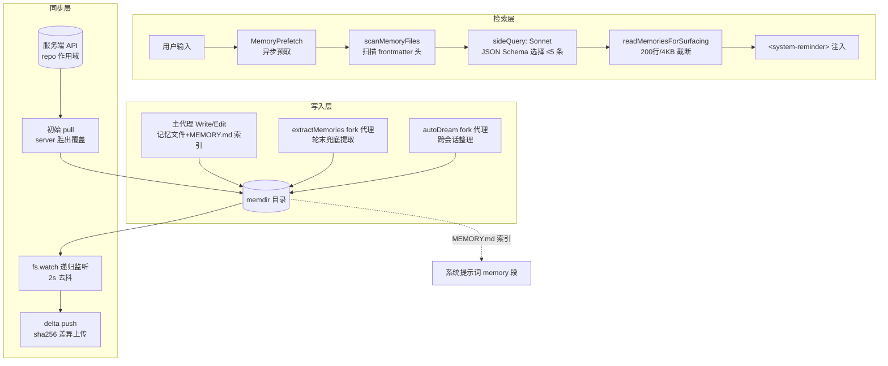
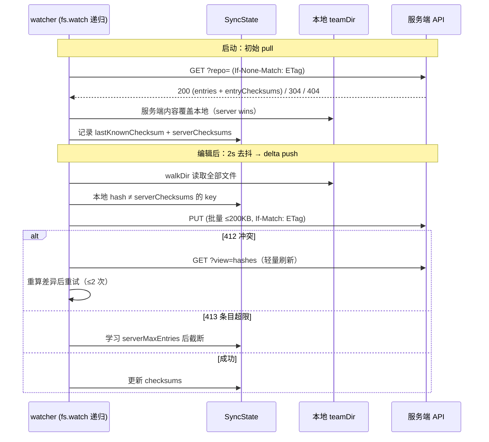

本文深入剖析本仓库的记忆系统（memdir）——一套以纯文件系统为存储介质、以 LLM 为检索与固化引擎的持久化记忆架构。核心覆盖四个子系统：**记忆目录的路径解析与安全边界**、**查询时的相关性检索与注入管线**、**轮末自动固化（extractMemories）与跨会话深度固化（autoDream）**，以及**基于服务端 API 的团队记忆同步（teamMemorySync）**。阅读本文需要理解[查询引擎的单轮循环](7-dan-lun-cha-xun-xun-huan-liu-shi-xiang-ying-chu-li-gong-ju-diao-yong-yu-cuo-wu-hui-fu)中 stop hooks 的触发时机，以及[系统提示词组装](8-xi-tong-ti-shi-ci-yu-shang-xia-wen-zu-zhuang-claude-md-ji-yi-zhu-ru-yu-mo-xing-pei-zhi)中 systemPromptSection 的缓存机制。

## 架构总览：三层记忆生命周期

记忆系统的设计遵循一个明确的第一性原理：**记忆是"无法从当前项目状态推导出的上下文"**。代码模式、架构、git 历史均可通过 grep/git 重新获得，因此被显式排除在记忆范畴之外；只有用户画像、协作反馈、项目动机、外部系统指针四类信息才值得持久化。整个生命周期分为三层：写入层（主代理直接写 + 后台 fork 代理兜底提取）、检索层（Sonnet 侧查询做相关性排序）、同步层（团队记忆通过内容哈希做增量上传/覆盖式下载）。

值得注意的是注入与索引的双通道设计：`MEMORY.md` 索引全文常驻系统提示词（受 200 行/25KB 截断保护），而主题文件内容则按需通过 `<system-reminder>` 附件动态注入，两者共同构成"常驻索引 + 按需正文"的两级检索结构。

Sources: [memoryTypes.ts](memdir/memoryTypes.ts#L1-L21), [memdir.ts](memdir/memdir.ts#L34-L38)

## 存储布局与路径解析链

自动记忆目录的默认形态为 `~/.claude/projects/<sanitized-canonical-git-root>/memory/`，其中关键决策是使用 `findCanonicalGitRoot` 而非普通 git root——这使得**同一仓库的所有 worktree 共享同一个记忆目录**（anthropics/claude-code#24382），避免在 worktree 间产生记忆分裂。团队记忆固定作为自动记忆的子目录 `memory/team/` 存在，其作用域天然继承父目录的 git-root 键控。

路径解析存在三级覆盖链，且每级都有独立的信任模型：

| 优先级 | 来源 | 信任级别 | 典型用途 |
|---|---|---|---|
| 1 | `CLAUDE_COWORK_MEMORY_PATH_OVERRIDE` 环境变量 | 程序化设置，不做 `~` 展开 | Cowork 将记忆重定向到空间级挂载点（会话 cwd 含 VM 进程名，否则每次会话产生不同 project-key） |
| 2 | settings.json `autoMemoryDirectory` | 仅限 policy/flag/local/user 四个可信源，支持 `~` 展开 | 用户自定义位置 |
| 3 | 默认计算路径 | — | `~/.claude/projects/<slug>/memory/` |

安全设计上有两处刻意的非对称：**projectSettings（仓库内提交的 `.claude/settings.json`）被显式排除在覆盖来源之外**——恶意仓库否则可以设置 `autoMemoryDirectory: "~/.ssh"`，借 filesystem.ts 对记忆路径的写豁免静默写入敏感目录；同样，环境变量覆盖不享受写豁免（`hasAutoMemPathOverride()` 为 true 时写 carve-out 被关闭），而 settings.json 覆盖因来自用户显式选择而保留豁免。`validateMemoryPath` 进一步拒绝相对路径、根路径、Windows 盘根（`C:`）、UNC 路径与含空字节的候选，并对 `~/..` 这类会展开为 `$HOME` 祖先的路径做防御性拒绝。

功能开关 `isAutoMemoryEnabled()` 本身是一条五级优先链：环境变量禁用 → `--bare`/SIMPLE 模式 → CCR 无持久存储 → settings.json `autoMemoryEnabled` → 默认启用。这条链是整个记忆子系统的总闸——团队记忆、提取代理、autoDream、`/remember`、团队同步全部级联受其控制。

Sources: [paths.ts](memdir/paths.ts#L21-L55), [paths.ts](memdir/paths.ts#L95-L196), [paths.ts](memdir/paths.ts#L198-L278), [teamMemPaths.ts](memdir/teamMemPaths.ts#L66-L94)

## 记忆类型分类学与提示词契约

记忆被约束在一个封闭的四类型分类学中，每类都有明确的 `<when_to_save>`/`<how_to_use>`/`<body_structure>` 指令：**user**（用户角色与知识，永远私有）、**feedback**（用户对工作方式的纠正与确认，默认私有、项目级约定才入团队）、**project**（进行中工作的动机与截止期，强烈倾向团队共享，要求相对日期转绝对日期）、**reference**（外部系统指针，通常团队共享）。分类学以两种平铺变体维护——`TYPES_SECTION_COMBINED`（含 `<scope>` 标签与私有/团队限定词）与 `TYPES_SECTION_INDIVIDUAL`（纯单目录模式）——代码注释明确说明这是**有意复制而非共享规格生成**，以便按模式做独立微调时无需推理条件渲染逻辑。

`WHAT_NOT_TO_SAVE_SECTION` 是一个经过评测验证的**显式保存门**（memory-prompt-iteration 案例 3，0/2 → 3/3）：即便用户明确要求保存 PR 列表或活动摘要，模型也应追问其中"令人意外或非显而易见"的部分——这条边界将记忆与活动日志从根本上区分开来。记忆文件本身采用 frontmatter 格式（`description`/`type` 字段），而 `MEMORY.md` 索引坚持每条一行、无 frontmatter、指针式链接，超过 200 行即截断。

索引的截断策略体现双层防御的精确性：`MAX_ENTRYPOINT_LINES = 200` 处理常规增长，而 `MAX_ENTRYPOINT_BYTES = 25_000` 专门捕获"行数合格但单行超长"的失败模式（实测 p100 出现过 200 行内 197KB 的索引）。截断时**在原始字节计数上判定警告原因**（行截断后再测字节会低估问题），并在追加的警告中精确命名触发的上限，指导模型"索引条目保持一行、~200 字符以内，细节移入主题文件"。

Sources: [memoryTypes.ts](memdir/memoryTypes.ts#L14-L31), [memoryTypes.ts](memdir/memoryTypes.ts#L180-L195), [memdir.ts](memdir/memdir.ts#L34-L103)

## 记忆扫描：memoryScan 的单遍设计

`scanMemoryFiles` 是检索与提取两条管线共享的底层原语，其存在本身是一次循环依赖治理的结果——它从 `findRelevantMemories.ts` 中拆分出来，使 extractMemories 能导入扫描能力而不拖入 sideQuery 和 API 客户端链（#25372）。扫描逻辑：递归 `readdir` 收集所有 `.md` 文件（排除 `MEMORY.md`，它已在系统提示词中），并发读取每个文件**前 30 行**解析 frontmatter，返回 `MemoryHeader` 列表（文件名、路径、mtimeMs、description、type），按 mtime 新者在前排序，截断至 200 个文件。

性能上采用**读后排序而非 stat-排序-读**的单遍策略：`readFileInRange` 内部完成 stat 并返回 mtimeMs，常见情形（N ≤ 200）相比独立的 stat 轮次**减半系统调用**；大 N 时多读几个会被截断的小文件，仍避免了幸存 200 个文件的双重 stat。`formatMemoryManifest` 将头部列表格式化为单行清单（`- [type] filename (ISO时间): description`），同时供检索选择器提示词与提取代理提示词消费。

Sources: [memoryScan.ts](memdir/memoryScan.ts#L1-L34), [memoryScan.ts](memdir/memoryScan.ts#L35-L94)

## 相关性检索：Sonnet 侧查询与预取管线

检索的核心判断交给一个独立的 `sideQuery`：以默认 Sonnet 模型执行，系统提示词要求"只选择基于名称与描述**确定有用**的记忆（最多 5 条），不确定就不选，可以返回空列表"，输出通过 JSON Schema 约束为 `selected_memories` 字符串数组，返回后用有效文件名集合过滤幻觉项。`alreadySurfaced` 集合在 Sonnet 调用**之前**过滤候选——让选择器的 5 个名额花在新鲜候选上，而非重新挑选调用方随后会丢弃的文件。

针对关键词重叠误报有两道降噪机制。其一，`recentTools`（当前轮成功调用的工具列表）注入提示词：当模型正在实际使用某工具时，该工具的用法参考文档是噪声（会话已包含工作中的用法），但**警告、坑点、已知问题类记忆仍应选中**——"正在使用"恰恰是最需要这些信息的时刻。其二，`collectRecentSuccessfulTools` 的判定语义是"成功且从未失败"：任何一次失败即排除该工具（模型在挣扎，文档保持可用），无结果也排除（结局未知）。

调用侧的管线编排体现了对查询循环时序的精确嵌入。`MemoryPrefetch` 是一个**可处置（Disposable）的预取句柄**：每用户轮启动一次，与主模型流式响应和工具执行并行运行；query.ts 用 `using` 绑定，使 `[Symbol.dispose]` 在生成器全部 ~13 个返回点的任意路径上触发（return、throw、`.return()` 闭包），中止在途请求并发出终态遥测。收集点（工具执行后）读取 `settledAt` 决定"就绪即消费"或"跳过下轮重试"——预取永不阻塞回合。此外预取被链到**轮级 abort 信号**上，用户按 Escape 立即取消 sideQuery。门槛条件包括：输入须含空白（单词提示缺乏术语提取的上下文）、本会话累计注入字节未超 60KB 上限。

Sources: [findRelevantMemories.ts](memdir/findRelevantMemories.ts#L18-L58), [findRelevantMemories.ts](memdir/findRelevantMemories.ts#L77-L130), [attachments.ts](utils/attachments.ts#L2334-L2424), [attachments.ts](utils/attachments.ts#L2451-L2503)

## 注入预算与新鲜度管理

选中记忆的正文读取执行三级预算约束：单文件 200 行、单文件 4096 字节、每轮最多 5 个文件（合计 ~20KB）、**会话累计 60KB 封顶**。会话级预算的统计方式颇具巧思——`collectSurfacedMemories` 扫描消息而非在 toolUseContext 中追踪，意味着**上下文压缩（compact）天然重置计数器**：旧附件已从压缩后的转录中消失，重新注入重新合法。字节上限通过 `readFileInRange` 的 `truncateOnByteLimit` 选项执行，截断时以注释附加完整路径而非丢弃文件——既然相关性选择器已判定其为最相关，frontmatter 与开头上下文仍值得呈现。

新鲜度管理解决一个真实的用户报告问题：过时的代码状态记忆（引用已变更代码的 file:line）被当作事实断言——**引用反而使过时断言听起来更权威**。`memoryAge.ts` 的对策是多维的：`memoryAgeDays` 将 mtime 换算为地板取整的天数（未来 mtime 钳制为 0）；`memoryAge` 输出人类可读年龄（"47 days ago"），注释直言"模型不擅长日期算术——原始 ISO 时间戳不会像'47 天前'那样触发陈旧性推理"；`memoryFreshnessText` 对超过 1 天的记忆生成主动验证提示（"记忆是时点观察而非实时状态……断言前对照当前代码验证"），1 天内返回空串（新鲜记忆上的警告是噪声）。该文本通过 `memoryHeader` 进入每个注入块的头部，或在 FileReadTool 输出场景经 `memoryFreshnessNote` 包装为独立 `<system-reminder>`。

Sources: [attachments.ts](utils/attachments.ts#L269-L289), [attachments.ts](utils/attachments.ts#L2268-L2332), [memoryAge.ts](memdir/memoryAge.ts#L1-L53)

## 自动固化：extractMemories 的 fork 代理模式

轮末提取运行在 `handleStopHooks` 的 fire-and-forget 路径上（非 bare 模式、非子代理、提取门开启时），采用 **forked agent 模式**——主对话的完美分叉，共享父级的提示词缓存，从而以极低的 cache 读成本复用全部上下文。权限收敛到 `createAutoMemCanUseTool`：Read/Grep/Glob 无限制放行、Bash 仅放行通过 `isReadOnly` 校验的命令、Edit/Write 仅放行 `isAutoMemPath` 命中的路径、REPL 放行（其 VM 上下文会对内部原语工具重新调用本函数，且给 fork 不同的工具列表会破坏缓存共享——工具是缓存键的一部分）。`maxTurns: 5` 的硬上限防止验证性钻探烧毁轮次，`skipTranscript: true` 避免与主线程的转录写入产生竞态。

与主代理的**互斥机制**是设计的关键：主代理的提示词本身携带完整保存指令，当其已写入记忆文件时（`hasMemoryWritesSince` 检测游标之后的 assistant 消息中是否存在指向记忆路径的 Write/Edit tool_use 块），提取代理跳过本轮并将游标直接推进越过该区间——两个写入者按轮互斥，各管一段。状态管理采用闭包作用域而非模块级（`initExtractMemories()` 创建，测试在 beforeEach 中重建），游标 UUID 保证每次运行只考虑上次提取之后新增的消息；游标未推进时（代理出错）下次重新考虑同段消息。并发处理上，运行中到来的调用被**暂存为最新上下文**（覆盖旧暂存——只有最新者重要，因其包含最多消息），当前运行结束后在 `finally` 中执行一次尾随提取，其 newMessageCount 相对刚推进的游标计算，只捕获两次调用间新增的消息。

提取提示词的构建中预注入了记忆目录清单（复用 `scanMemoryFiles`），**省去代理花一整轮执行 `ls`**；该扫描刻意置于节流门之后，被跳过的轮次不支付扫描成本。团队记忆启用时切换到组合提示词（同时考虑私有与团队两个目录的保存决策）。完成后从 fork 的消息中提取实际写入路径，过滤掉 `MEMORY.md`（索引更新是机械操作，用户可见的"记忆"是主题文件本身），统计团队记忆条数，通过 `createMemorySavedMessage` 向主转录追加内联的"已保存 N 条记忆"系统消息。

Sources: [extractMemories.ts](services/extractMemories/extractMemories.ts#L1-L68), [extractMemories.ts](services/extractMemories/extractMemories.ts#L112-L222), [extractMemories.ts](services/extractMemories/extractMemories.ts#L296-L523), [stopHooks.ts](query/stopHooks.ts#L133-L157)

## 深度固化：autoDream 的门控与锁协议

autoDream 是跨会话的记忆整理（consolidation）机制，以 `/dream` 提示词为模板在后台 fork 代理中执行，门控遵循**最廉价优先**的顺序：时间门（距上次整理 ≥ minHours，默认 24 小时，仅一次 stat）→ 扫描节流（10 分钟内不重复扫描会话目录）→ 会话门（上次整理后触碰的会话数 ≥ minSessions，默认 5，排除当前会话）→ 锁（无其他进程整理中）。每个门都是独立的提前返回，正常路径的每轮成本仅为一次 GB 缓存读取加一次 stat。

锁协议是一个精巧的**以 mtime 兼任 lastConsolidatedAt 的单文件设计**：锁文件 `.consolidate-lock` 位于记忆目录内（因此与记忆一样按 git-root 键控，且在记忆路径来自环境/设置覆盖时仍可写），文件体是持有者 PID。获取时写入 PID（mtime 即刻更新为 now）并**重读验证**——两个回收者同时写入时最后写者胜出 PID，败者在重读时退出；成功路径不做任何事（mtime 停留在 now），失败路径 `rollbackConsolidationLock(priorMtime)` 用 `utimes` 回卷 mtime 并清空 PID 体（否则仍在运行的进程看起来像持有者），priorMtime 为 0 则删除文件恢复无锁状态；崩溃场景下 mtime 卡住但 PID 已死，1 小时过期保护（`HOLDER_STALE_MS`）允许下一个进程回收——PID 复用风险由"过期即回收，无论 PID 是否存活"兜底。扫描会话时使用 mtime 而非 birthtime（ext4 上为 0）。

执行层面，fork 代理以 `createAutoMemCanUseTool` 共享同一套权限收敛，进度通过 `makeDreamProgressWatcher` 观察代理消息流——提取 assistant 回合中的文本块（用户想看的推理摘要）、将 tool_use 折叠为计数、收集 Edit/Write 的 file_path——实时更新 DreamTask 任务状态（可在后台任务对话框中查看与终止）。终止路径的处理体现状态机严谨性：若用户已从后台任务对话框终止，DreamTask.kill 已中止、回卷锁并置 killed 状态，错误路径**不得覆盖或双重回卷**。

Sources: [autoDream.ts](services/autoDream/autoDream.ts#L1-L107), [autoDream.ts](services/autoDream/autoDream.ts#L122-L273), [consolidationLock.ts](services/autoDream/consolidationLock.ts#L1-L108)

## 团队记忆路径安全：纵深防御

团队记忆因涉及网络同步而成为攻击面，`teamMemPaths.ts` 实现了多层次的路径净化。`sanitizePathKey`（同步 API 的 key 为相对路径）依次拒绝：空字节（可在 C 系系统调用中截断路径）、URL 编码遍历（`%2e%2e%2f` 解码后含 `..` 或 `/`）、Unicode 规范化攻击（全角 `．．／` 在 NFKC 下规范化为 ASCII `../`——虽然 `path.resolve`/`fs.writeFile` 将其视为字面字节，但下游层或文件系统可能规范化，故防御性拒绝，PSR M22187 向量 4）、反斜杠（Windows 分隔符作为遍历向量）与绝对路径。

本地文件层的对抗面是**符号链接逃逸**（PSR M22186）：`path.resolve` 不解析符号链接，攻击者在 teamDir 内放置指向外部的符号链接（如 `~/.ssh/authorized_keys`）即可通过基于 resolve 的包含检查。`realpathDeepestExisting` 的对策是对路径**最深已存在祖先**执行 `realpath`，再将不存在的尾部重新拼接——目标文件可能尚不存在（我们可能正要创建它），故沿目录树上溯直至 realpath 成功。异常处理同样精确：`ENOENT` 时用 `lstat` 区分"真正不存在"（安全上溯）与"悬空符号链接"（`realpath` 失败但链接条目存在——`writeFile` 会跟随链接在 teamDir 外创建目标，直接抛出）；`ELOOP`（符号链接环）抛出；`EACCES`/`EIO` 等无法验证包含性的错误**失败关闭**，包装为 PathTraversalError 使调用方能优雅跳过该条目而非中止整批。`isRealPathWithinTeamDir` 双侧 realpath 后比较规范位置；teamDir 不存在时跳过检查——符号链接逃逸需要 teamDir 内已存在符号链接，目录不存在则链接不存在，第一遍字符串级检查已足够。

Sources: [teamMemPaths.ts](memdir/teamMemPaths.ts#L7-L64), [teamMemPaths.ts](memdir/teamMemPaths.ts#L96-L171), [teamMemPaths.ts](memdir/teamMemPaths.ts#L173-L200)

## 团队记忆同步协议：哈希增量与服务端胜出

同步服务将团队记忆按 **git remote 标识的 repo 作用域**在服务端共享给全组织认证成员，API 契约为 `GET /api/claude_code/team_memory?repo={owner/repo}`（含 `?view=hashes` 轻量变体）与 `PUT` 同端点（upsert 语义），404 表示尚无数据。同步语义刻意不对称：**pull 为服务端胜出**（per-key 覆盖本地文件），**push 为 delta 增量**（仅上传本地哈希与 `serverChecksums` 不一致的 key，服务端对 PUT 未包含的 key 做保留式合并），**文件删除不传播**（删除本地文件不会从服务端移除，下次 pull 会将其恢复本地）。

可变状态全部收拢进调用方创建并穿引的 `SyncState` 对象——`lastKnownChecksum`（ETag 条件请求）、`serverChecksums`（per-key `sha256:<hex>` 内容哈希映射，pull 时从服务端 entryChecksums 填充、push 成功后从本地哈希填充，push 时据此计算差异）、`serverMaxEntries`（从结构化 413 的 `extra_details.max_entries` 学得，保持 null 直到观察到 413——服务端上限按组织 GB 可调，任何编译期常量都会漂移）。哈希格式与服务端精确对齐（UTF-8 字节上的 `sha256:` 前缀十六进制），本地与远端比较可用字符串直等。

网络层的工程细节反映了真实生产事故的教训。**网关体量上限**（`MAX_PUT_BODY_BYTES = 200KB`）：API 网关对超过约 256-512KB 的 PUT 体在请求到达应用服务器前以非结构化（HTML）413 拒绝，与应用层结构化的条目数 413 仅能靠延迟区分（网关 ~750ms vs 应用 ~2.3s）——#21969 移除客户端条目数上限后重度用户的冷推送发出 300KB-1.4MB 体并命中此限；200KB 留有余量且使单条达 `MAX_FILE_SIZE_BYTES`（250KB）上限的独立批次恰好低于真实网关限制，更大的批次拆分为顺序 PUT（服务端 upsert 合并语义保证其安全性）。**412 冲突解决**走 `?view=hashes` 轻量探测——避免为了得知哪些 key 变了而下载约 300KB 正文。认证要求第一方 OAuth（含 inference 与 profile 两个 scope），推送前经 gitleaks 规则的 `scanForSecrets` 预检，命中秘密的文件跳过且只记录规则 ID（永不记录秘密值本身，PSR M22174）。

Sources: [index.ts](services/teamMemorySync/index.ts#L1-L89), [index.ts](services/teamMemorySync/index.ts#L93-L161), [index.ts](services/teamMemorySync/index.ts#L186-L314), [types.ts](services/teamMemorySync/types.ts#L40-L56)

## 同步 watcher：监听选型与失败抑制

watcher 的技术选型直接回应了一个 Bun 运行时的实测问题：弃用 chokidar（4+ 移除了 fsevents）与 Bun 的 `fs.watch` kqueue 回退（每个被监听文件需一个打开 fd——500+ 团队记忆文件即 500+ 永久持有的 fd，经 lsof + 复现确认），改用原生 `fs.watch({recursive: true})` 目录级监听：macOS 上 Bun 对递归使用 FSEvents，**无论树大小恒为 O(1) fd**（验证：60 文件跨 5 子目录仅 2 个 fd）；Linux inotify 每目录一 watch（O(子目录数)，团队记忆极少嵌套）。编辑事件经 2 秒去抖后触发一次 push；push 对磁盘只读（delta+探测、无合并写入），故无需事件抑制——推送进行中到来的编辑命中 `schedulePush()`，去抖在本轮推送完成后重新武装。

**失败抑制机制**防止共享目录上的无限重试风暴：当 push 因不可自愈的原因失败（`no_oauth`/`no_repo` 预检失败，或除 409/429 外的 4xx——409 是瞬态冲突、下次 pull 后的新推送可成功，429 是限流、退避即可），设置 `pushSuppressedReason` 停止后续重试。动机是一次生产事故（BQ 3 月 14-16 日：一台 no_oauth 设备因其他会话对共享团队目录的写入在 2.5 天内发出 167K 次 push 事件）。抑制的解除条件精确对应恢复语义：`fs.watch` 目录事件不区分 add/change/unlink（三者都发 `rename`），故对每个事件 stat 文件名——ENOENT 视为 unlink（文件删除是 too-many-entries 案例的恢复动作），清除抑制；`no_oauth` 场景抑制持续到会话重启是正确的（该类用户不通过删除文件恢复，而是带认证重启）。

Sources: [watcher.ts](services/teamMemorySync/watcher.ts#L35-L51), [watcher.ts](services/teamMemorySync/watcher.ts#L53-L73), [watcher.ts](services/teamMemorySync/watcher.ts#L129-L200)

## 与系统提示词的整合：双入口注入

记忆提示词通过 `systemPromptSection('memory', () => loadMemoryPrompt())` 进入系统提示词的动态段，享受段级缓存。`loadMemoryPrompt` 的分发逻辑：KAIROS 模式（长生命周期助手会话）优先级最高，切换为**追加式日志范式**——代理向 `logs/YYYY/MM/YYYY-MM-DD.md` 日期命名文件追加带时间戳的条目，由独立夜间 `/dream` 技能蒸馏为主题文件 + MEMORY.md；该模式的提示词刻意以**路径模式而非当日字面路径**描述日志位置，因为提示词被 `systemPromptSection` 缓存且不随日期变更失效，跨午夜的日期切换由附加在尾部的 date_change 附件驱动模型推导。随后是 TEAMMEM 分支（auto + team 组合提示词）与 auto-only 分支，两者都先 `ensureMemoryDirExists`（幂等递归 mkdir，EEXIST 已被内部吞掉）——**harness 保证目录存在**，因此提示词可以直接说"该目录已存在——直接用 Write 工具写入（不要 mkdir 也不要检查其存在）"，这是针对模型曾为写文件浪费轮次执行 `ls`/`mkdir -p` 的行为校正。

正文索引则通过 CLAUDE.md 加载管线进入上下文：`getMemoryFiles` 在处理完 Managed/User/Project/Local 各级 CLAUDE.md 与 rules 目录后，额外读取 `getAutoMemEntrypoint()`（type 为 `AutoMem`）与团队记忆入口（type 为 `TeamMem`）。两个入口被刻意排除在 InstructionsLoaded 钩子之外——注释明确"它们是独立的记忆系统，不是 CLAUDE.md/rules 意义上的'指令'"。`buildSearchingPastContextSection`（GB 门 `tengu_coral_fern` 控制）进一步授予模型**主动搜索历史上下文**的指令：优先 grep 记忆目录、最后 grep 会话转录 JSONL——且根据构建变体自适应命令形态（Ant 原生构建中 grep 别名到内嵌 ugrep 且无独立 Grep 工具时给出 shell 形式；REPL 模式下 Grep/Bash 均隐藏，模型在脚本内写的本来就是 shell 形式）。

Sources: [memdir.ts](memdir/memdir.ts#L111-L119), [memdir.ts](memdir/memdir.ts#L318-L370), [memdir.ts](memdir/memdir.ts#L409-L508), [prompts.ts](constants/prompts.ts#L491-L504), [claudemd.ts](utils/claudemd.ts#L979-L1007), [memdir.ts](memdir/memdir.ts#L372-L407)

## 设计模式提炼

纵观全系统，三个可复用的架构模式值得提炼。**游标互斥的分布式写者协调**：extractMemories 与主代理通过"检测游标后记忆写入 → 跳过并推进游标"实现按轮互斥，无需锁与通信，代价仅是一次消息扫描——适用于"昂贵兜底任务与内联快速路径覆盖同一职责"的场景。**以文件 mtime 兼任时间戳的单文件锁**：consolidationLock 让锁的获取动作本身就是时间戳更新，崩溃恢复依赖 PID 存活性 + 过期双保险，回卷语义明确区分"成功不动、失败回卷、崩溃回收"三种终态。**清单预注入省轮次**：无论是记忆目录清单注入提取代理、还是 memory prompt 中"目录已存在"的行为校正，核心思想一致——**把模型会用工具探索的确定性事实直接写进提示词**，每次节省的都是完整的模型轮次与缓存重建。

后续阅读建议：团队记忆的同步依赖 OAuth 认证体系，详见 [API 层与模型管理](29-api-ceng-yu-mo-xing-guan-li-anthropic-ke-hu-duan-duo-gong-ying-shang-zhi-chi-yu-oauth-ren-zheng)；fork 代理与 sideQuery 的底层机制在[子代理与后台任务框架](25-zi-dai-li-yu-hou-tai-ren-wu-kuang-jia-agenttool-localagenttask-yu-ren-wu-zhuang-tai-jian-kong)中展开；记忆提示词在系统提示词中的完整组装路径参见[系统提示词与上下文组装](8-xi-tong-ti-shi-ci-yu-shang-xia-wen-zu-zhuang-claude-md-ji-yi-zhu-ru-yu-mo-xing-pei-zhi)；注入预算与会话级 60KB 上限与压缩机制的互动，可结合[上下文压缩](9-shang-xia-wen-ya-suo-zi-dong-ya-suo-wei-ya-suo-yu-token-yu-suan-guan-li)理解。