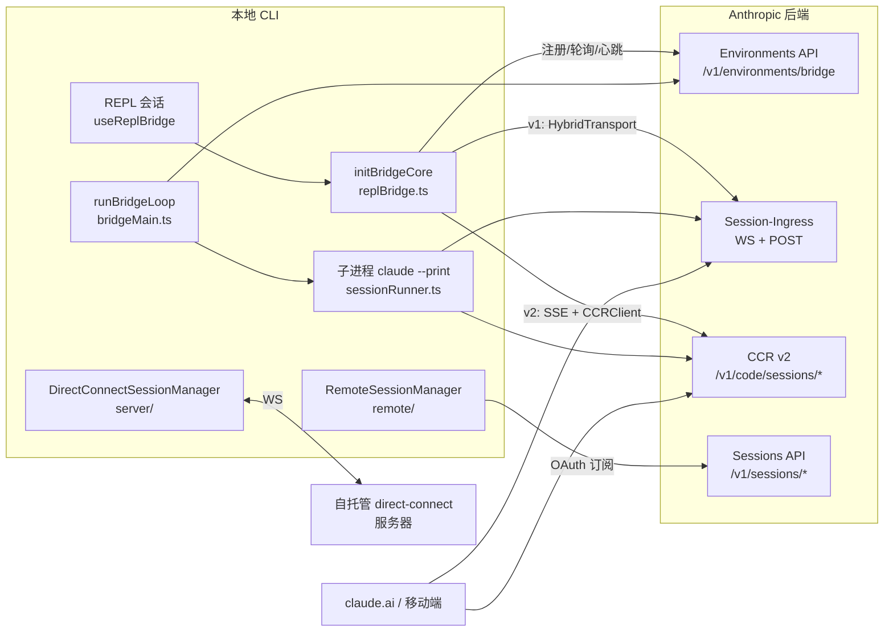

本页剖析代码库中"远程能力"的三条相互独立又协议互通的支柱：**REPL Bridge**（`bridge/` 目录，把本地 REPL 会话镜像到 claude.ai 并接受远程输入）、**远程会话管理**（`remote/` 目录，本机作为客户端观看并驱动云端 CCR 会话）、以及**直连服务器**（`server/` 目录，绕开云端、直连自托管 Runner 的 WebSocket 通道）。三者共享同一套 `SDKMessage`/`SDKControlRequest` 线协议与权限桥接语义，但在认证模型、连接拓扑与生命周期管理上各有取舍——理解这套分层，是理解整个产品"终端与 Web 双端同源"设计的关键。

## 总体架构：三条远程通道的分野

在深入实现前，先用一张图定位三个子系统各自的连接对象与数据流向。`bridge/` 是**本机为服务端**（bridge worker）的模式：CLI 向 Anthropic 后端注册一个 environment，然后长轮询领取 work item，并把 REPL 的消息流推送到 Session-Ingress；`remote/` 是**本机为客户端**的模式：通过 OAuth 订阅云端会话的 WebSocket 流并用 HTTP POST 发送输入；`server/` 则完全脱离云端，直接与一个自托管的 direct-connect 服务器通信。

这个分层的核心洞见是：**同一套线协议（`type: user/assistant/result/control_request/control_response`）被四组不同实体复用**——REPL 与 bridge、bridge 与 Session-Ingress、云端会话与订阅端客户端、direct-connect 服务器与 REPL——因此 `bridgeMessaging.ts` 中的解析/去重逻辑与 `sdkMessageAdapter.ts` 中的类型转换可以跨子系统复用，而不产生协议分叉。

Sources: [replBridge.ts](bridge/replBridge.ts#L249-L262), [RemoteSessionManager.ts](remote/RemoteSessionManager.ts#L87-L95), [directConnectManager.ts](server/directConnectManager.ts#L40-L48)

## REPL Bridge 的引导链：门控、依赖注入与 bundle 隔离

REPL Bridge 的入口是 `hooks/useReplBridge.tsx` 中的 React Hook——它监听 `AppState.replBridgeEnabled`，在开启时动态 `import('../bridge/initReplBridge.js')`（动态导入是为了在外部构建中被 tree-shake 掉），并携带四个跨重连持久化的 ref：`lastWrittenIndexRef`（增量写游标）、`flushedUUIDsRef`（已 flush 的 UUID 集合，防止重复 UUID 触发服务器杀掉 WebSocket）、`teardownPromiseRef`（保证上一个 teardown 完成后再重新注册，避免 deregister 与 register 在服务端竞态）、以及 `consecutiveFailuresRef`——连续 3 次初始化失败后熔断整个会话的生命周期（Datadog 观测到一个卡死客户端每天产生 2879 次 401，占该路由全部 401 的 17%）。

`initReplBridge.ts` 是**读 bootstrap 状态的包装层**：依次执行运行时门控（`isBridgeEnabledBlocking`）、OAuth 检查（必须以 claude.ai 订阅登录，否则返回 `/login` 提示）、组织策略检查（`allow_remote_control`）、以及跨进程死令牌退避——全局配置中记录 `bridgeOauthDeadExpiresAt`，若 3 个以上进程见过同一过期令牌则静默跳过。值得注意的架构决策是文件头注释里明确说明的**拆分动机**：`sessionStorage` 的导入会传递性地拉入 `commands.ts` → 整个斜杠命令 + React 组件树（约 1300 个模块），因此把 `initBridgeCore` 留在不触碰 `sessionStorage` 的文件里，Agent SDK 的 daemon 才能复用核心而不膨胀 bundle。这正是 `BridgeCoreParams` 采用**全显式参数**（cwd、sessionId、git、OAuth 回调全部作为字段注入）的原因——`createSession`、`toSDKMessages`、`onAuth401`、`getPollIntervalConfig` 等回调的注入均出于同一 bundle-隔离约束。

Sources: [useReplBridge.tsx](hooks/useReplBridge.tsx#L28-L150), [initReplBridge.ts](bridge/initReplBridge.ts#L1-L14), [initReplBridge.ts](bridge/initReplBridge.ts#L134-L162), [replBridge.ts](bridge/replBridge.ts#L85-L172)

## initBridgeCore：环境注册 → 会话创建 → 轮询 → 传输

`initBridgeCore` 是 bridge 的状态机核心，其生命周期为：**注册 environment → （可选）原地重连 → 创建 session → 写崩溃恢复指针 → 启动 work 轮询循环**。注册时构造 `BridgeConfig`（含客户端生成的幂等 `environmentId` UUID 与 `workerType`，后者作为 claude.ai 会话选择器的过滤键），通过 `createBridgeApiClient` 发起 `POST /v1/environments/bridge`；失败时若存在陈旧的 crash-recovery 指针则顺手清除，避免下次重试同一个死 ID。

会话创建后写入的**崩溃恢复指针**（`writeBridgePointer`）是 perpetual 模式的基石：普通模式在 teardown 时清除它，而 perpetual 模式刻意保留——`claude remote-control --continue` 或 CLI 重启时 `readBridgePointer` 读取它并只复用 `source === 'repl'` 的指针，随后 `tryReconnectInPlace` 调用 `reconnectSession` 强制停掉陈旧 worker 并把会话重新入队。这里有一个精妙的兼容处理：指针里存的是 v1 兼容层的 `session_*` 形态 ID，而 `/bridge/reconnect` 是 environments 层端点，在 `ccr_v2_compat_enabled` 门控开启后按 infra 标签 `cse_*` 查找会话——因此候选列表按 `[sessionId, toInfraSessionId(sessionId)]` 顺序逐一尝试。

Sources: [replBridge.ts](bridge/replBridge.ts#L318-L370), [replBridge.ts](bridge/replBridge.ts#L373-L430), [replBridge.ts](bridge/replBridge.ts#L479-L493)

work 轮询循环是 bridge "活着"的证明：`startWorkPollLoop`（`remoteBridgeCore.ts`）以 `poll_interval_ms_not_at_capacity = 2000ms` 快速轮询，传输建立后降为 `poll_interval_ms_at_capacity = 600000ms`（10 分钟）——这两个值由 `PollIntervalConfig` 定义且可通过 GrowthBook 标志 `tengu_bridge_poll_interval_config` 全局热调。10 分钟的容量期轮询间隔对服务端 Redis 键 `BRIDGE_LAST_POLL_TTL = 4h`（超时自动归档 environment）留有 24 倍余量，同时能在单个轮询周期内捕捉服务端发起的令牌轮转重派。轮询错误恢复采用指数退避（初始 2s、上限 60s、15 分钟放弃），注释明确指出"服务器是会话何时真正死亡的权威"——只要服务器还接受轮询就持续等待。

Sources: [replBridge.ts](bridge/replBridge.ts#L237-L246), [replBridge.ts](bridge/replBridge.ts#L529-L569), [pollConfigDefaults.ts](bridge/pollConfigDefaults.ts#L8-L82)

## 传输层抽象：v1 HybridTransport 与 v2 SSE+CCRClient 的分野

`replBridgeTransport.ts` 定义了 `ReplBridgeTransport` 接口，把 v1/v2 的选择**收拢到构造点**：v1 使用 `HybridTransport`（WebSocket 读 + POST 写到 Session-Ingress），v2 使用 `SSETransport`（读）+ `CCRClient`（写到 CCR v2 `/worker/*`）。两者的认证模型**截然相反**——v1 刻意使用 OAuth 令牌（标准 OAuth 刷新流程自然处理过期，无需独立 JWT 刷新调度器），v2 则**必须**使用 work secret 中的 JWT，因为 `register_worker.go:32` 校验 JWT 的 `session_id` claim 而 OAuth 令牌不携带它；JWT 过期时服务器会重派 work item，`onWorkReceived` 再次触发并携带新令牌，`createV2ReplTransport` 在触碰网络前通过 `updateSessionIngressAuthToken` 存储它。

接口中两个 v2 专属的方法体现了"序列号续传"的关键设计：`getLastSequenceNum()` 返回底层 SSE 读流的事件序号高水位，`replBridge.ts` 在**每次传输交换前**读取它，使新传输的首次 `connect()` 携带 `from_sequence_num`/`Last-Event-ID` 从断点续传——否则每次交换都会让服务器从 seq 0 重放全部会话历史，把每条历史 prompt 当作新的入站消息重新注入。v1 恒返回 0，因为 Session-Ingress WS 不使用 SSE 序号，重连重放由服务端消息游标处理。`registerWorker` 调用返回的 `worker_epoch` 会被透传给子 CLI 进程（`CLAUDE_CODE_WORKER_EPOCH` 环境变量），供其每个心跳/状态/事件请求携带。

Sources: [replBridgeTransport.ts](bridge/replBridgeTransport.ts#L11-L70), [replBridgeTransport.ts](bridge/replBridgeTransport.ts#L105-L200), [workSecret.ts](bridge/workSecret.ts#L89-L127)

v1/v2 的选择由**服务器逐会话决定**（work secret 中的 `use_code_sessions` 字段，经 `prepare_work_secret()` 设置），`CLAUDE_BRIDGE_USE_CCR_V2` 环境变量是 ant 开发者的强制覆盖。会话 ID 的双形态（v1 API 返回 `session_*`，基础设施层工作队列使用 `cse_*`，同一 UUID 不同标签）由 `sameSessionId` 处理——它取最后一个下划线后的 body 比较，使 bridge 在 compat 门控开启时不会把自己的会话误判为"外来会话"而拒绝。

Sources: [replBridge.ts](bridge/replBridge.ts#L1130-L1165), [workSecret.ts](bridge/workSecret.ts#L51-L73), [types.ts](bridge/types.ts#L45-L51)

## 消息流转：初始 flush、FlushGate 与双层 UUID 去重

bridge 的出站消息流经三条路径，各有独立的顺序保障机制。**初始 flush**（首次连接时回放已有对话）不在会话创建时发送——因为那些事件使用 STREAM_ONLY 持久化、在 CCR UI 订阅前发布会丢失——而是在 ingress WebSocket 连接建立后批量 `writeBatch`，且用 `initialHistoryCap`（默认 200，来自 GrowthBook 标志）截取最近 N 条以降低 Firestore 压力。flush 期间 `FlushGate` 门控新的 `writeMessages` 调用，防止新消息与历史消息交错到达服务器；flush 完成后 `drainFlushGate` 按序发送排队的消息。`onStateChange('connected')` 被刻意推迟到 flush 完成才发出，避免 Web UI 在历史未持久化时就显示会话为活跃。

**入站去重**是双层防御：主层是 SSE 序号续传（上文），安全网是两个容量 2000 的 `BoundedUUIDSet`——`recentPostedUUIDs` 过滤自己发出的消息在 WS 上的回声，`recentInboundUUIDs` 过滤服务器重投递的 prompt（序号协商失败、传输交换竞态等场景）。`handleIngressMessage`（`bridgeMessaging.ts`）按类型路由：`control_response` 走 `onPermissionResponse`（远程权限决策回流）、`control_request` 走 `handleServerControlRequest`（必须在约 10-14 秒内响应否则服务器杀掉 WS）、其余 SDKMessage 经 UUID 去重后交给 `onInboundMessage` 注入 REPL。出站方向 `isEligibleBridgeMessage` 只放行 user/assistant 轮次与 `local_command` 系统事件——tool_result、进度等"内部 REPL 噪声"不上行。

Sources: [replBridge.ts](bridge/replBridge.ts#L1234-L1330), [replBridge.ts](bridge/replBridge.ts#L495-L527), [bridgeMessaging.ts](bridge/bridgeMessaging.ts#L72-L160)

## 连接恢复：双策略重连、心跳熔断与 keep_alive

环境丢失（轮询返回 404，environment 被服务端收割）触发 `reconnectEnvironmentWithSession`，其内部 `doReconnect` 执行**两段式策略**：策略一是带 `reuseEnvironmentId` 的幂等重注册——若后端复活同一 env（笔记本睡眠 <4h 的典型场景），调用 `reconnectSession` 重排既有会话，`currentSessionId` 不变、手机上的 URL 保持有效、已 flush 的 UUID 集合保留；策略二在后端返回不同 env ID（原 TTL 已过期）或重连失败时触发，先归档旧会话再在新 env 上创建新会话，并**立即重置**会话作用域状态（`lastTransportSequenceNum = 0`、清空 `recentInboundUUIDs`、重置标题派生闭包）——注释详细论证了为什么必须在 `writeBridgePointer` 之前重置：否则存在 `bridgeSessionId` 已返回新会话 B 而 `getSSESequenceNum()` 仍返回旧会话 A 序号的窗口，daemon 的 `persistState()` 在该窗口写入的 `{B, OLD_A}` 能通过会话 ID 校验并彻底瓦解它。整个重连有 `MAX_ENVIRONMENT_RECREATIONS = 3` 的连续上限，成功后清零（防护的是快速连续失败而非生命周期总量），并用 promise 守卫保证并发调用共享同一次尝试。

Sources: [replBridge.ts](bridge/replBridge.ts#L587-L615), [replBridge.ts](bridge/replBridge.ts#L617-L836)

传输层的永久关闭（`handleTransportPermanentClose`）按关闭码分流：`1000` 是干净关闭，直接 teardown；其余（重连预算耗尽或 4001/1002/4003 永久拒绝）进入环境级重连。**心跳熔断**（`onHeartbeatFatal`）处理 work item JWT 过期：SSE 重连和 CCR 写共用同一过期令牌，若不做处理轮询循环会做 10 分钟容量期退避，期间 work lease（300s TTL）过期、服务器停止转发 prompt，daemon 日志中观测到约 25 分钟的死窗口——因此该回调主动关闭传输、清空 work 状态使 `isAtCapacity()` 变 false，轮询循环快速轮询并在数秒内接住服务器的重派。此外每 120 秒（可配置，0 为禁用）推送一帧静默 `{type:'keep_alive'}`，防止上游代理和 session-ingress 层 GC 掉空闲的远程控制会话——该类型在到达任何客户端 UI 前被过滤。v1 写路径还有一道 `maxConsecutiveFailures: 50` 的批次丢弃上限（约 20 分钟），丢弃时唤醒轮询循环以便 Session-Ingress 恢复后重建传输，否则状态会卡在 `reconnecting` 即使 SI 已恢复。

Sources: [replBridge.ts](bridge/replBridge.ts#L878-L966), [replBridge.ts](bridge/replBridge.ts#L1031-L1069), [replBridge.ts](bridge/replBridge.ts#L1474-L1496), [replBridge.ts](bridge/replBridge.ts#L1528-L1548)

## 多会话独立服务器：`claude remote-control` 与子进程编排

与 REPL Bridge 的"单会话、进程内"模式相对，`bridgeMain.ts` 的 `runBridgeLoop` 实现**持久多会话服务器**：维护 `activeSessions`、`sessionWorkIds`、`sessionIngressTokens`（JWT 与 OAuth 令牌分开存放，因为令牌刷新调度器约 3 小时 55 分后会用 OAuth 覆盖 handle 的 accessToken 字段）等多张映射，`SpawnMode` 决定工作目录策略——`single-session`（cwd 中一个会话，结束即拆）、`worktree`（每会话独立 git worktree）、`same-dir`（共享 cwd）。`heartbeatActiveWorkItems` 对所有活跃 work item 逐一心跳，401/403（JWT 过期）时通过 `reconnectSession` 触发服务端重派——否则 work 停留在 Redis PEL 中被 ACK，轮询永远返回空（CC-1263 缺陷）。v2 会话的主动令牌刷新调度器在 JWT 过期前 5 分钟触发同样重派，v1 则直接 `handle.updateAccessToken` 换新 OAuth 令牌。

`sessionRunner.ts` 的 `createSessionSpawner` 负责**子进程编排**：以 `claude --print --sdk-url <url> --session-id <id> --input-format stream-json --output-format stream-json --replay-user-messages` 启动子 CLI，环境变量中刻意置空 `CLAUDE_CODE_OAUTH_TOKEN`（子进程必须用会话访问令牌做推理而非 bridge 的 OAuth）、注入 `CLAUDE_CODE_SESSION_ACCESS_TOKEN`，v2 模式追加 `CLAUDE_CODE_USE_CCR_V2=1` 与 `CLAUDE_CODE_WORKER_EPOCH`。`spawnScriptArgs` 处理 npm 安装形态下 `process.execPath` 是 node 运行时而非 claude 二进制的问题（否则 node 把 `--sdk-url` 当作自己的选项并以 "bad option" 退出）。子进程的 stdout 按 NDJSON 逐行解析为 `SessionActivity` 环形缓冲（工具动词映射表把 `BashTool` 翻译成 "Running"、`FileEditTool` 翻译成 "Editing" 等），`PermissionRequest`（`can_use_tool` 控制请求）则转发给服务器供用户在 Web 端批准。

Sources: [bridgeMain.ts](bridge/bridgeMain.ts#L141-L313), [sessionRunner.ts](bridge/sessionRunner.ts#L248-L345), [types.ts](bridge/types.ts#L63-L79)

## 远程会话管理：本机作为客户端观看 CCR 会话

`remote/RemoteSessionManager.ts` 把视角反转：本机 REPL 现在是**订阅者**。它协调三件事——WebSocket 订阅（接收 CCR 消息）、HTTP POST 发送用户输入（`sendEventToRemoteSession`）、权限请求/响应流。`SessionsWebSocket.ts` 实现订阅协议：连接 `wss://api.anthropic.com/v1/sessions/ws/{sessionId}/subscribe?organization_uuid=...`，发送 `{type:'auth', credential:{type:'oauth', token}}` 认证帧，然后接收 SDKMessage 流。重连策略为 2 秒延迟、最多 5 次、30 秒 ping 保活；关闭码 4001（会话未找到）单独处理允许 3 次重试（压缩期间服务器可能短暂认为会话陈旧），4003（未授权）则立即放弃。`isSessionsMessage` 的类型守卫刻意**不做白名单**——接受任何带字符串 `type` 的消息，让下游决定如何处理未知类型，避免后端新增消息类型时旧客户端静默丢弃。

`hooks/useRemoteSession.ts` 是其 REPL 集成层：响应超时 60 秒，压缩期间放宽到 3 分钟（compact API 调用耗时 5-30 秒且阻塞其他 SDK 消息）。远程后台子代理数量通过**事件溯源**维护——查看器自身的 `AppState.tasks` 为空（任务活在另一个进程里），`task_started`/`task_notification` 事件经 bridge WS 到达后更新 `remoteBackgroundTaskCount`。权限请求经 `remotePermissionBridge.ts` 的 `createSyntheticAssistantMessage` + `createToolStub` 构造合成的工具调用消息，走本地既有的 `ToolUseConfirm` 队列弹出权限对话框（复用第 [19](19-quan-xian-mo-xing-mo-shi-qie-huan-gui-ze-jie-xi-bash-fen-lei-qi-yu-zi-dong-mo-shi) 页描述的权限模型），用户决策再序列化为 `control_response` 发回。`viewerOnly` 配置位使本机退化为纯观察者：Ctrl+C/Escape 不再发送 interrupt、60 秒重连超时禁用、会话标题永不更新（供 `claude assistant` 使用）。

Sources: [RemoteSessionManager.ts](remote/RemoteSessionManager.ts#L40-L200), [SessionsWebSocket.ts](remote/SessionsWebSocket.ts#L17-L120), [useRemoteSession.ts](hooks/useRemoteSession.ts#L36-L110)

## 直连服务器：绕开云端的点对点通道

`server/` 目录实现第三条通道：**direct-connect**。`createDirectConnectSession.ts` 向 `${serverUrl}/sessions` POST `{cwd, dangerously_skip_permissions}`，用 zod 的 `connectResponseSchema` 校验响应后返回 `DirectConnectConfig`（含 `session_id` 与 `ws_url`）及可选的 `work_dir`；网络、HTTP、解析三类失败均抛 `DirectConnectError`。`DirectConnectSessionManager` 随后以 Bun 的原生 `WebSocket`（支持 headers 选项，DOM 类型不识别需断言）连接 `wsUrl`，消息处理与 `RemoteSessionManager` 同构：`control_request` + `can_use_tool` 走权限回调，未知子类型立即回错误响应（"不让服务器悬挂等待一个永不到来的回复"），其余 SDKMessage 过滤掉 `keep_alive`、`streamlined_*` 等噪声后转发。

出站方向三个方法各自对应一种线协议形态：`sendMessage` 序列化为 `--input-format stream-json` 期望的 `SDKUserMessage` 格式（`parent_tool_use_id: null`、空 `session_id`）；`respondToPermissionRequest` 按 `StructuredIO` 期望的 `SDKControlResponse` 格式构造（`allow` 携带 `updatedInput`、`deny` 携带 `message`）；`sendInterrupt` 发送 `subtype: 'interrupt'` 的控制请求。`hooks/useDirectConnect.ts` 把它接入 REPL——`convertSDKMessage`（`sdkMessageAdapter.ts`）做 SDKMessage → 内部 `Message` 的类型转换（assistant 直映射、partial 转 `StreamEvent`、result 转 informational 系统消息、init 去重），收到 `isSessionEndMessage` 时清除 loading 态。

Sources: [createDirectConnectSession.ts](server/createDirectConnectSession.ts#L18-L89), [directConnectManager.ts](server/directConnectManager.ts#L50-L186), [useDirectConnect.ts](hooks/useDirectConnect.ts#L58-L110), [sdkMessageAdapter.ts](remote/sdkMessageAdapter.ts#L21-L120)

## 认证与协议对比：三通道的关键差异

三条通道在认证凭据、写入路径与恢复模型上的差异，可以通过下表一览——这直接决定了各自的部署形态与故障语义。

| 维度 | REPL Bridge (v1) | REPL Bridge (v2) | 远程会话管理 | 直连服务器 |
|---|---|---|---|---|
| **角色** | worker（本机服务端） | worker（本机服务端） | 订阅客户端 | 客户端 |
| **读通道** | Session-Ingress WS | SSE 流 | Sessions WS 订阅 | 自托管 WS |
| **写通道** | POST 到 Session-Ingress | CCRClient → `/worker/*` | HTTP POST 事件 API | 同一 WS |
| **认证** | OAuth 令牌（可刷新） | work secret JWT（session_id claim） | OAuth（订阅 auth 帧） | 可选 Bearer token |
| **额外安全** | X-Trusted-Device-Token 头（ELEVATED 层级强制时） | 同左 + worker_epoch | mTLS/代理支持（`getWebSocketTLSOptions`） | headers 直传 |
| **令牌失效恢复** | OAuth 刷新流程 | 服务器重派 work item | 重连时取新令牌 | 无（连接级） |
| **序号续传** | 服务端消息游标 | `from_sequence_num` 高水位 | 无需（只读订阅） | 无需 |

认证细节上还有一处值得注意：`bridgeApi.ts` 的 `getHeaders` 在 `getTrustedDeviceToken` 提供值时附加 `X-Trusted-Device-Token` 头——bridge 会话在 CCR v2 上具有 `SecurityTier=ELEVATED`，当服务端强制标志开启时 `ConnectBridgeWorker` 在签发 JWT 前要求可信设备凭据；`validateBridgeId` 则用 `/^[a-zA-Z0-9_-]+$/` 白名单校验所有服务端提供的 ID，防止路径遍历注入到 URL 路径段。

Sources: [bridgeApi.ts](bridge/bridgeApi.ts#L27-L89), [replBridge.ts](bridge/replBridge.ts#L1142-L1165), [types.ts](bridge/types.ts#L133-L176)

## 用户入口与状态联动

最终用户通过两个入口触发这一切：`/remote-control` 斜杠命令（`commands/bridge/bridge.tsx`）做前置检查后置 `replBridgeEnabled: true` 于 AppState，触发 `useReplBridge` 初始化；`claude remote-control` 独立子命令则直接进入 `bridgeMain.ts` 的服务器循环。`outboundOnly` 模式（CCR 镜像模式）只激活出站转发、不开 SSE 入站流——本地会话在 claude.ai 可见但不接受入站控制。历史迁移方面，`migrations/migrateReplBridgeEnabledToRemoteControlAtStartup.ts` 把旧的 `replBridgeEnabled` 设置项迁移到 `remoteControlAtStartup`，反映了命名从 "bridge" 到 "Remote Control" 的产品化演进。失败通知有 10 秒的 `BRIDGE_FAILURE_DISMISS_MS` 自动清除窗口，配合前述 3 次熔断形成完整的"失败不风暴"闭环。

Sources: [bridge.tsx](commands/bridge/bridge.tsx#L26-L110), [useReplBridge.tsx](hooks/useReplBridge.tsx#L28-L40)

## 延伸阅读

远程控制架构向上依赖查询引擎的消息循环与权限模型，向下依赖 API 层的认证基建，横向则与远程后台任务框架交叠。建议按以下顺序继续：

- 权限决策如何在 REPL 端落地（`ToolUseConfirm` 队列、分类器与自动模式）：见 [权限模型：模式切换、规则解析、Bash 分类器与自动模式](19-quan-xian-mo-xing-mo-shi-qie-huan-gui-ze-jie-xi-bash-fen-lei-qi-yu-zi-dong-mo-shi)
- 消息如何从 bridge 注入 QueryEngine 的主循环：见 [查询引擎 QueryEngine：会话编排、消息流转与状态管理](6-cha-xun-yin-qing-queryengine-hui-hua-bian-pai-xiao-xi-liu-zhuan-yu-zhuang-tai-guan-li)
- OAuth 令牌刷新与多供应商认证的底层实现：见 [API 层与模型管理：Anthropic 客户端、多供应商支持与 OAuth 认证](29-api-ceng-yu-mo-xing-guan-li-anthropic-ke-hu-duan-duo-gong-ying-shang-zhi-chi-yu-oauth-ren-zheng)
- 远程代理任务如何复用同一套会话基础设施：见 [子代理与后台任务框架：AgentTool、LocalAgentTask 与任务状态监控](25-zi-dai-li-yu-hou-tai-ren-wu-kuang-jia-agenttool-localagenttask-yu-ren-wu-zhuang-tai-jian-kong)
- Bridge 相关的 GrowthBook 门控与遥测事件体系：见 [配置与可观测性：设置体系、托管策略、数据迁移与遥测分析](30-pei-zhi-yu-ke-guan-ce-xing-she-zhi-ti-xi-tuo-guan-ce-lue-shu-ju-qian-yi-yu-yao-ce-fen-xi)