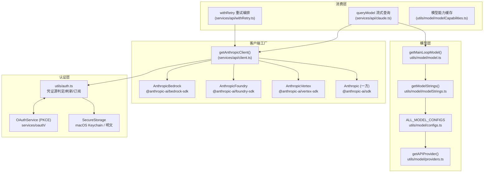
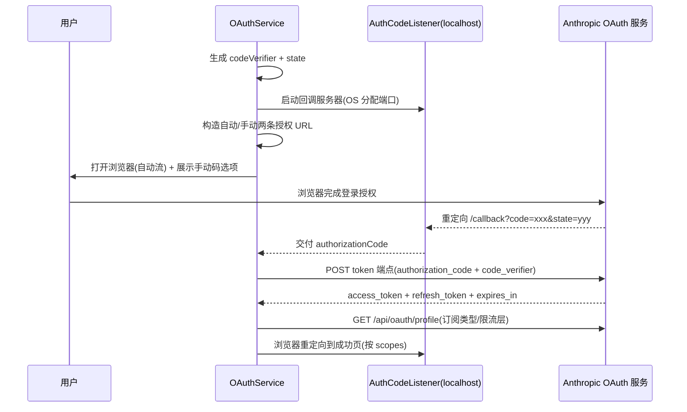

本页深入解析 CLI 与 Anthropic API 之间的完整通信基础设施：从 `getAnthropicClient()` 单一工厂如何按环境变量分发出四个供应商 SDK 实例，到模型标识符如何通过「配置矩阵 + 别名系统 + 五级优先级链」解析为最终 API 字符串，再到 OAuth 2.0 + PKCE 认证流的完整生命周期管理（含跨进程锁、401 自愈与订阅感知的默认模型选择）。这是理解 CLI 如何做到「同一份代码、四种部署形态、两种计费身份」的关键页面。

## 架构总览：三层数据流

整个 API 层可以抽象为三个正交的关注点：**客户端构造**（谁发请求）、**模型解析**（请求哪个模型）、**凭证供给**（如何认证）。三者通过环境变量与引导状态（bootstrap state）解耦，形成清晰的分层结构。

前置说明：图中虚线依赖通过 `bootstrap/state.ts` 中的全局状态传递（如 `getMainLoopModelOverride`），而非参数注入——这是启动性能优化的产物，具体见 [启动引导流程](5-qi-dong-yin-dao-liu-cheng-main-tsx-ru-kou-cli-can-shu-jie-xi-yu-qi-dong-xing-neng-you-hua)。模型解析结果最终被 [查询引擎 QueryEngine](6-cha-xun-yin-qing-queryengine-hui-hua-bian-pai-xiao-xi-liu-zhuan-yu-zhuang-tai-guan-li) 消费以驱动主循环。

Sources: [client.ts](services/api/client.ts#L88-L100), [providers.ts](utils/model/providers.ts#L1-L14), [claude.ts](services/api/claude.ts#L709-L780)

## Anthropic 客户端工厂：单一入口，四种形态

`getAnthropicClient()` 是全代码库唯一的 SDK 实例构造点。它接受可选的 `apiKey`、`maxRetries`、`model`、`fetchOverride` 与 `source` 参数，内部先组装所有形态共享的 `defaultHeaders`——包括 `x-app: cli` 标识、`User-Agent`（见 [构建体系与特性门控](4-gou-jian-ti-xi-yu-te-xing-men-kong-bun-bian-yi-qi-te-xing-biao-ji-yu-si-dai-ma-xiao-chu) 中对 UA 的处理）、会话追踪头 `X-Claude-Code-Session-Id`，以及容器/远程会话/SDK 客户端应用等可选标识。随后无条件执行 `checkAndRefreshOAuthTokenIfNeeded()`，确保任何请求发出前 OAuth token 处于新鲜状态；若用户不是 Claude.ai 订阅者，还会附加来自 `ANTHROPIC_AUTH_TOKEN` 或 `apiKeyHelper` 的 `Authorization: Bearer` 头。

供应商分支的判定顺序是**硬编码的 if 链**：Bedrock → Foundry → Vertex → 一方兜底。每个分支都使用动态 `import()` 按需加载对应 SDK（如 `@anthropic-ai/bedrock-sdk`），这意味着未启用 Bedrock 的用户永远不会付出该依赖的加载成本。三个云分支的共同技巧是「**类型撒谎**」——将 `AnthropicBedrock` 等实例强制转型为 `Anthropic` 返回，注释直言这些类型不支持 batching 与 models 子资源，但 `messages` 接口形状兼容，从而让上层代码面对统一的客户端类型。

超时与代理也在工厂层统一处理：`API_TIMEOUT_MS` 环境变量可覆盖默认的 600 秒超时；`getProxyFetchOptions()` 注入企业代理配置；`ANTHROPIC_CUSTOM_HEADERS` 支持换行分隔的多头注入（解析时在首个 `:` 处分割以避免回溯性能问题）。

Sources: [client.ts](services/api/client.ts#L88-L152), [client.ts](services/api/client.ts#L318-L349)

### 各供应商认证方式对比

| 供应商 | SDK | 启用环境变量 | 凭证来源 | 特殊能力 |
|---|---|---|---|---|
| 一方 | `@anthropic-ai/sdk` | （默认） | OAuth `authToken` 或 API Key | 唯一支持 OAuth 订阅身份的分支 |
| Bedrock | `@anthropic-ai/bedrock-sdk` | `CLAUDE_CODE_USE_BEDROCK` | AWS STS 凭证 / `AWS_BEARER_TOKEN_BEDROCK` | 小快模型独立区域覆盖 |
| Vertex | `@anthropic-ai/vertex-sdk` | `CLAUDE_CODE_USE_VERTEX` | google-auth-library（ADC） | 按模型粒度的区域变量 |
| Foundry | `@anthropic-ai/foundry-sdk` | `CLAUDE_CODE_USE_FOUNDRY` | `ANTHROPIC_FOUNDRY_API_KEY` 或 Azure AD | DefaultAzureCredential 多因素链 |

Bedrock 分支有三个值得注意的细节：其一，当 `model` 参数等于 `getSmallFastModel()` 且设置了 `ANTHROPIC_SMALL_FAST_MODEL_AWS_REGION` 时使用独立区域——这是为了让 Haiku 分类器跑在低延迟区域；其二，`AWS_BEARER_TOKEN_BEDROCK` 会启用 `skipAuth` 并直接注入 Bearer 头，走 API Key 计费而非 IAM；其三，凭证来自 `refreshAndGetAwsCredentials()`，该函数背后是可配置的 `awsAuthRefresh` 命令（如 `aws sso login`）与 1 小时 TTL 缓存。Vertex 分支则处理了一个隐蔽的工程问题：google-auth-library 在缺少 projectId 时会查询 GCE 元数据服务器，在 GCP 之外造成 12 秒超时，因此代码仅在用户未配置任何项目发现方式时才用 `ANTHROPIC_VERTEX_PROJECT_ID` 兜底。Foundry 分支在没有 API Key 时通过 `@azure/identity` 的 `DefaultAzureCredential` 构造 token provider，覆盖环境变量、托管标识、Azure CLI 等多种认证路径。

Sources: [client.ts](services/api/client.ts#L153-L220), [client.ts](services/api/client.ts#L221-L298), [client.ts](services/api/client.ts#L32-L71)

## 多供应商模型矩阵：一份配置，四套标识符

跨供应商的核心抽象是 `ModelConfig = Record<APIProvider, ModelName>` 类型与 `ALL_MODEL_CONFIGS` 注册表。每个模型（从 `haiku35` 到 `opus46` 共 11 个条目）以一个内部短键注册，值为四方标识符的映射。以 Opus 4.6 为例：一方是 `claude-opus-4-6`，Bedrock 是 `us.anthropic.claude-opus-4-6-v1`，Vertex 是 `claude-opus-4-6`，Foundry 是 `claude-opus-4-6`。源码中的 `@[MODEL LAUNCH]` 注释标记是发布流程的锚点——新模型上线时需同步更新配置常量、注册表、默认值与显示名四处。

标识符体系的另一端是**规范化层**。`firstPartyNameToCanonical()` 通过有序的子串匹配（4-6 先于 4-5 先于 4）将任意供应商的完整 ID 归一化为短名，例如 `us.anthropic.claude-3-5-haiku-20241022-v1:0` 与 `claude-3-5-haiku-20241022` 都映射到 `claude-3-5-haiku`。这使得成本计算、能力查询、弃用检测等横切逻辑无需感知供应商差异。配套的 `CANONICAL_ID_TO_KEY` 反向映射支持 `modelOverrides` 设置：用户可以在 settings 中把 `claude-opus-4-6` 映射到自定义 Bedrock 推理配置文件 ARN，`resolveOverriddenModel()` 则负责将 ARN 逆向解析回规范 ID，保证 UI 显示与遥测归因正确。

| 层级 | 函数 | 输入示例 | 输出示例 |
|---|---|---|---|
| 供应商选择 | `getAPIProvider()` | `CLAUDE_CODE_USE_BEDROCK=1` | `'bedrock'` |
| 字符串派生 | `getModelStrings()` | provider + 配置矩阵 | `{ opus46: 'us.anthropic...v1' }` |
| 规范化 | `getCanonicalName()` | `us.anthropic.claude-opus-4-6-v1` | `'claude-opus-4-6'` |
| 覆盖解析 | `resolveOverriddenModel()` | Bedrock ARN | 规范一方 ID |

Sources: [configs.ts](utils/model/configs.ts#L4-L119), [model.ts](utils/model/model.ts#L217-L283), [modelStrings.ts](utils/model/modelStrings.ts#L63-L100)

### Bedrock 推理配置文件的运行时发现

Bedrock 用户可能使用区域化的系统定义推理配置文件（如 `eu.anthropic.claude-opus-4-6-v1`），硬编码的 `us.` 前缀字符串会失效。`getBedrockModelStrings()` 因此在后台调用 `ListInferenceProfiles` API（通过 `@aws-sdk/client-bedrock` 分页拉取并过滤含 `anthropic` 的条目），然后对每个模型用其一方 ID 作为「探针子串」在配置文件列表中寻找首个匹配，找不到才回退硬编码值。整个流程被 `sequential()` 串行化并缓存于 bootstrap state，避免重复 API 调用；初始化不阻塞启动——发现完成前使用内置默认值，用户级 `modelOverrides` 始终叠加在最上层。

Sources: [modelStrings.ts](utils/model/modelStrings.ts#L33-L55), [bedrock.ts](utils/model/bedrock.ts#L7-L48)

## 模型解析链：从用户输入到 API 字符串

`getMainLoopModel()` 的解析遵循一条**五级优先级链**：`/model` 命令的会话内覆盖（`getMainLoopModelOverride`）> 启动时 `--model` flag > `ANTHROPIC_MODEL` 环境变量 > settings 中的 `model` 字段 > 内置默认。每一级产出的值可以是**别名**（`sonnet`、`opus`、`haiku`、`best`、`sonnet[1m]`、`opus[1m]`、`opusplan`）或完整模型 ID；`parseUserSpecifiedModel()` 负责将别名在解析时刻展开为具体字符串——这保证 `/model opus` 始终指向当前最新 Opus，而非用户设置时的快照。另有 `availableModels` 允许名单机制：不在名单内的用户指定模型会被静默忽略，回退默认值；家族别名（`opus`）在名单中充当通配符，放行该家族任意版本。

内置默认值本身是**订阅感知**的：Max 与 Team Premium 订阅者默认获得 Opus（并可能带 `[1m]` 一百万上下文后缀，受 `isOpus1mMergeEnabled()` 门控——该函数在订阅类型未知时「失败即关闭」，防止 API 以误导性的限流错误拒绝 `opus[1m]`）；Pro、Team Standard、Enterprise 与按量付费用户默认 Sonnet。供应商维度同样有分化：注释明确说明「3P 可用性滞后于一方」，因此 Bedrock/Vertex/Foundry 的默认 Sonnet 停留在 4.5，而一方已是 4.6，即使当前值相同也保留独立分支以便下次模型发布时分叉。`opusplan` 别名是一个混合模式：计划模式（permission mode 为 `plan`）下用 Opus，执行阶段切回 Sonnet——`getRuntimeMainLoopModel()` 在每次查询前根据权限模式动态裁决。

Sources: [model.ts](utils/model/model.ts#L49-L98), [model.ts](utils/model/model.ts#L104-L138), [model.ts](utils/model/model.ts#L145-L208), [aliases.ts](utils/model/aliases.ts#L1-L25)

### 弃用治理与能力缓存

`DEPRECATED_MODELS` 注册表为每个退役模型维护**按供应商的退役日期**——例如 Claude 3 Opus 在一方是 2026 年 1 月 5 日，Bedrock 晚十天（1 月 15 日），Claude 3.5 Haiku 则仅在部分供应商退役。模型能力缓存（`modelCapabilities.ts`）是 ant 内部专属机制：符合条件的构建会调用 `anthropic.models.list()` 拉取全量模型的 `max_input_tokens`/`max_tokens`，经「最长 ID 优先」排序后持久化到 `~/.claude/cache/model-capabilities.json`，供上下文窗口判断在离线状态下使用最长子串匹配查询。

Sources: [deprecation.ts](utils/model/deprecation.ts#L28-L61), [modelCapabilities.ts](utils/model/modelCapabilities.ts#L46-L100)

## OAuth 认证：PKCE 双模式授权码流

`OAuthService` 类实现了 OAuth 2.0 授权码流 + PKCE（S256）。构造时生成 32 字节随机 `codeVerifier`；`startOAuthFlow()` 启动时先创建 `AuthCodeListener`——一个绑定 `localhost`、由操作系统分配端口的临时 HTTP 服务器——然后同时构造**两条授权 URL**：自动流重定向到 `http://localhost:{port}/callback`，手动流重定向到官方的 `oauth/code/callback` 页面（用户复制粘贴授权码）。两条流以「先到先得」的方式竞速：正常情况下浏览器自动打开自动流 URL 并完成回调，无浏览器环境（SSH、容器）则走手动流。

PKCE 与防 CSRF 的密码学原语集中在 `crypto.ts`：`generateCodeVerifier()` 与 `generateState()` 各取 32 字节随机数做 base64url 编码，`generateCodeChallenge()` 对 verifier 做 SHA-256。授权 URL 携带 `code_challenge_method=S256`、`state`、`client_id`（硬编码的 `9d1c250a-...`）以及 scope 集合；可选参数覆盖组织 UUID（`orgUUID`）、登录邮箱预填（`loginHint`）与指定登录方式（`loginMethod`，如 SSO）。`inferenceOnly` 选项将 scope 收窄为 `user:inference`，用于签发长效的仅推理 token（CI 场景）。SDK 集成场景下 `skipBrowserOpen` 让调用方接管两个 URL 的展示，因为宿主进程而非本进程拥有用户界面。

授权码交换（`exchangeCodeForTokens`）向 `https://platform.claude.com/v1/oauth/token` 发送 `grant_type=authorization_code` 与 `code_verifier`，成功后立即调用 `fetchProfileInfo` 获取 `subscriptionType` 与 `rateLimitTier`——这两个字段随后驱动默认模型选择与限流 UI。`loginWithClaudeAi` 参数决定授权端点是 Console（`platform.claude.com/oauth/authorize`，面向 API Key 创建）还是 Claude.ai 订阅授权（经 `claude.com/cai/*` 归因跳转，两个 307 到 `claude.ai/oauth/authorize`）。

Sources: [index.ts](services/oauth/index.ts#L21-L120), [crypto.ts](services/oauth/crypto.ts#L1-L24), [client.ts](services/oauth/client.ts#L46-L144), [auth-code-listener.ts](services/oauth/auth-code-listener.ts#L9-L72)

### Scope 体系与刷新时的静默扩展

Scope 集合在 `constants/oauth.ts` 集中定义：`user:inference`（推理）、`user:profile`（订阅信息）、`user:sessions:claude_code`、`user:mcp_servers`、`user:file_upload`。登录时请求全量并集，以兼容 Console → Claude.ai 的重定向升级。`refreshOAuthToken()` 利用后端 refresh-token 授权允许的**范围扩展**（`ALLOWED_SCOPE_EXPANSIONS`）：订阅者刷新时不传 scope，让默认的 `CLAUDE_AI_OAUTH_SCOPES` 生效，从而在新增 scope（如 `user:file_upload`）时无需用户重新登录。刷新路径还包含一个显著的流量优化——当全局配置已含 profile 字段且安全存储已含订阅数据时跳过 `/api/oauth/profile` 往返，注释估算每日节省约 700 万次请求。

Sources: [oauth.ts](constants/oauth.ts#L33-L58), [client.ts](services/oauth/client.ts#L146-L200)

## Token 生命周期：存储、刷新与 401 自愈

Token 的持久化由 `SecureStorage` 抽象承担：macOS 上是 Keychain（带明文 fallback 链），其他平台退化为 `~/.claude/.credentials.json` 明文存储。`saveOAuthTokensIfNeeded()` 在写入时保留一个关键的「不覆盖」语义——当新 token 的 `subscriptionType` 为 null（profile 拉取瞬时失败）时回退到既有值，防止网络抖动永久抹掉付费用户的订阅身份。读取侧 `getClaudeAIOAuthTokens()` 是 `memoize` 的同步函数，但**环境变量与文件描述符 token 具有最高优先级**：`CLAUDE_CODE_OAUTH_TOKEN` 直接构造一个「仅推理」token 对象（无 refreshToken、无 expiresAt、scopes 为 `['user:inference']`），这正是 CI 与远程容器注入凭证的标准方式。

刷新机制 `checkAndRefreshOAuthTokenIfNeeded()` 是一段分布式系统教科书式的实现，应对「多终端、多进程并发刷新」的现实：

- **磁盘 mtime 失效**：每次检查前 stat `.credentials.json` 的 mtime，若其他进程写入过则清空内存缓存再读——修复「终端 1 登录后终端 2 的永久缓存不感知」的回归（注释引用 CC-1096/GH#24317）。
- **in-flight 去重**：并发调用共享同一个 Promise。
- **文件锁 + 双重检查**：真正刷新前获取 `~/.claude` 目录锁（`ELOCKED` 时以 1-2 秒随机退避重试至多 5 次），获锁后再读一次 token，若其他进程已完成刷新则直接放弃（`race_resolved` 事件）。

被动刷新由 `handleOAuth401Error()` 触发：API 返回 401「token 已过期」时（本地过期判断可能因时钟偏差与服务器不一致），先清缓存重读——若 keychain 中的 token 与失败 token 不同，说明另一进程已刷新，直接复用；否则以 `force=true` 绕过本地过期检查强制刷新。并发 401 按 `failedAccessToken` 去重，避免 N 个连接同时清缓存导致的 keychain 读取风暴（注释记录了同步 spawn 堆叠到 800ms 阻塞渲染的案例）。

Sources: [auth.ts](utils/auth.ts#L1193-L1300), [auth.ts](utils/auth.ts#L1313-L1392), [auth.ts](utils/auth.ts#L1424-L1544), [index.ts](utils/secureStorage/index.ts#L9-L17)

### 认证源判定与订阅身份

`getAuthTokenSource()` 定义了凭证的探测优先级：`--bare` 模式仅认 env 与 flag 设置的 apiKeyHelper > `ANTHROPIC_AUTH_TOKEN`（非托管上下文）> `CLAUDE_CODE_OAUTH_TOKEN` > OAuth token 文件描述符（含 CCR 磁盘回退）> apiKeyHelper 配置 > keychain 中的 claude.ai OAuth token。`isAnthropicAuthEnabled()` 则决定是否启用一方认证：3P 供应商、外部 API Key 或外部 Bearer token 存在时禁用——但 `isManagedOAuthContext()`（CCR 远程或 Claude Desktop 入口）例外，防止托管会话错误继承用户终端的 API Key 配置。订阅身份从 OAuth token 的 `subscriptionType` 字段派生出 `isMaxSubscriber()`、`isTeamPremiumSubscriber()`（team + `default_claude_max_5x` 限流层）等谓词，直接反馈到模型默认值、Opus 访问权限与超额计费判定（`isOverageProvisioningAllowed` 仅放行 Stripe/Apple/Google 订阅计费类型）。

Sources: [auth.ts](utils/auth.ts#L151-L206), [auth.ts](utils/auth.ts#L1620-L1712), [auth.ts](utils/auth.ts#L98-L149)

## 请求重试：凭证感知的退避编排

`withRetry.ts` 包装所有 API 调用（`executeNonStreamingRequest` 等在 claude.ts 中以 `withRetry(() => getAnthropicClient(...), callback)` 的形式使用）。其策略矩阵覆盖：默认最多 10 次重试；**529（过载）按 querySource 白名单决定是否重试**——仅前台来源（主线程、SDK、代理、压缩、安全分类器等）重试，后台任务（标题生成、摘要、建议）立即放弃，因为容量级联期间每次重试都是 3-10 倍网关放大，且用户根本看不到这些失败；429/529 采用 `BASE_DELAY_MS=500` 起步的指数退避；连接错误（ECONNRESET/EPIPE）触发 `disableKeepAlive()`；401 时调用前述 `handleOAuth401Error` 并清除三类凭证缓存（apiKeyHelper、AWS、GCP）；AWS 凭证 provider 错误有专门的 `isAwsCredentialsProviderError` 分支。ant 内部的 `CLAUDE_CODE_UNATTENDED_RETRY` 支持无限重试 429/529（5 分钟退避上限、6 小时重置上限、30 秒心跳防宿主空闲判定）。

Sources: [withRetry.ts](services/api/withRetry.ts#L52-L118), [claude.ts](services/api/claude.ts#L818-L899)

## 辅助 API 与启动配置

`services/api/` 下其余模块围绕主查询构建配套能力：`bootstrap.ts` 在一方供应商 + 有可用凭证时调用 `/api/claude_cli/bootstrap` 拉取客户端数据与额外模型选项（`withOAuth401Retry` 包装重试）；`grove.ts`、`usage.ts`、`referral.ts` 等服务各自的轻量端点。`/model` 命令（`commands/model/model.tsx`）将上述模型层能力暴露为 UI：渲染 `ModelPicker`、校验 `isModelAllowed`、切换时联动 Fast Mode 与超额计费提示，并写入 AppState 的 `mainLoopModel`（即解析链第一级「会话覆盖」的来源）。

Sources: [bootstrap.ts](services/api/bootstrap.ts#L42-L80), [model.tsx](commands/model/model.tsx#L18-L103)

## 小结

API 层的设计哲学是**「一个工厂 + 一张矩阵 + 一条链」**：单一客户端工厂将供应商差异封装在类型兼容的 SDK 实例之后；模型配置矩阵让 11 个模型 × 4 个供应商的标识符映射声明式管理；五级优先级解析链叠加订阅感知默认值，让 `/model opus` 这类语义化输入总能解析到合理目标。OAuth 子系统则展示了工程成熟度——PKCE 双模式流覆盖从桌面到无头环境的全部场景，而文件锁、mtime 失效、401 去重共同构成的多进程一致性协议，保证了多终端并发使用时的 token 正确性。

下一站建议：若想了解解析后的模型如何进入流式查询主循环，阅读 [单轮查询循环：流式响应处理、工具调用与错误恢复](7-dan-lun-cha-xun-xun-huan-liu-shi-xiang-ying-chu-li-gong-ju-diao-yong-yu-cuo-wu-hui-fu)；若关注 1M 上下文与 token 预算如何消费模型能力数据，阅读 [上下文压缩：自动压缩、微压缩与 Token 预算管理](9-shang-xia-wen-ya-suo-zi-dong-ya-suo-wei-ya-suo-yu-token-yu-suan-guan-li)；若想看设置体系如何承载 `modelOverrides` 与 `apiKeyHelper`，阅读 [配置与可观测性：设置体系、托管策略、数据迁移与遥测分析](30-pei-zhi-yu-ke-guan-ce-xing-she-zhi-ti-xi-tuo-guan-ce-lue-shu-ju-qian-yi-yu-yao-ce-fen-xi)。