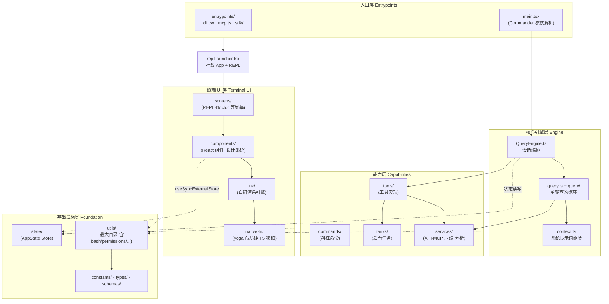
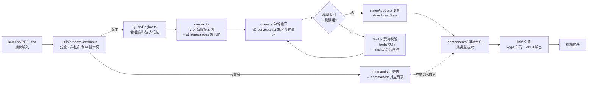

这份导览要解决的是一个初学者最常遇到的问题：**打开仓库后，面对几十个顶层文件和三十多个目录，"我想改某个功能，应该去哪里找代码？"** 本页不深入任何模块的实现细节，而是建立一张可靠的"心智地图"——哪些文件是框架骨架、哪些目录是功能域、它们之间如何分层协作。读懂本页后，你可以按需跳转到目录中对应的深度解析页面。

## 一、鸟瞰：无 src/ 包裹的扁平单包结构

这个仓库是一个**单包（single package）TypeScript 项目**，所有源码直接平铺在仓库根目录下，没有传统项目中的 `src/` 包裹层。这种结构有意为之：根目录下的少量 `.ts/.tsx` 文件（如 `main.tsx`、`QueryEngine.ts`、`Tool.ts`）构成"框架骨架"，而三十余个子目录（如 `tools/`、`commands/`、`services/`、`utils/`）则按功能域收纳具体实现。

理解这个结构有两个关键观察点。第一，入口文件 `main.tsx` 的开头以三段**启动性能优化的顶层副作用**开场——性能打点、MDM 配置预读、macOS 钥匙串预取都在其他模块加载前并行启动，注释明确说明这是为了与其余约 135ms 的模块导入并行执行。这说明整个项目对启动延迟极度敏感，目录与导入的组织方式都围绕这一点设计。

Sources: [main.tsx](main.tsx#L1-L27)

第二，真正的**分发入口在 `entrypoints/` 目录**，而非 `main.tsx`。`entrypoints/cli.tsx` 是引导层：它先检查 `--version` 等"快速路径"（零模块加载直接输出退出），然后才动态加载完整 CLI。仓库还存在其他入口形态——`entrypoints/mcp.ts` 把内部工具暴露为一个 MCP（Model Context Protocol）服务器，`entrypoints/sdk/` 与 `entrypoints/init.ts` 则服务 SDK 嵌入场景。入口层 → 骨架文件 → 功能域目录，这是本仓库最基本的依赖方向。

Sources: [entrypoints/cli.tsx](entrypoints/cli.tsx#L31-L46) [entrypoints/mcp.ts](entrypoints/mcp.ts#L28-L40)

## 二、架构分层总览

在展开目录明细之前，先看整体分层。下面的 Mermaid 图展示了五个逻辑层——**纵向是从"进程入口"到"终端像素"的渲染链路，横向是各层调用的能力域**。初学者请注意：图中的每个方框对应仓库中的一个或一组目录，箭头表示"调用/依赖"关系，而非继承关系。

三个分层要点值得特别留意：**引擎层与 UI 层是解耦的**——`QueryEngine.ts` 只依赖 `state/AppState` 类型进行状态读写，UI 通过极简的外部 store 订阅引擎产出；**能力层的注册表统一收口**——工具、命令、任务分别由 `tools.ts`、`commands.ts`、`tasks.ts` 三个根文件汇总注册；**基础设施层没有向上的依赖**——`utils/`、`constants/`、`types/` 是被依赖方而非依赖方。这套分层是后续所有深度阅读的基础。

Sources: [QueryEngine.ts](QueryEngine.ts#L1-L50) [state/store.ts](state/store.ts#L1-L35) [replLauncher.tsx](replLauncher.tsx#L9-L23)

## 三、根目录骨架文件：小文件，大枢纽

根目录的十几个顶层文件看似杂乱，实际遵循清晰的"**接口文件 + 注册表文件**"模式。接口文件定义核心契约类型，注册表文件则把各目录中的实现聚合为一个数组供引擎消费。初学者应优先记住下表中的对应关系。

| 根文件 | 角色 | 一句话职责 | 典型下游 |
|---|---|---|---|
| `main.tsx` | 完整 CLI 入口 | Commander 参数解析、环境预取、启动 REPL（4684 行） | `replLauncher`、`services/` |
| `replLauncher.tsx` | REPL 挂载器 | 动态导入 `App` 与 `REPL` 并渲染（仅 23 行） | `components/App`、`screens/REPL` |
| `Tool.ts` | 工具接口契约 | 定义 `Tool`/`ToolUseContext`/权限与进度回调类型 | `tools/*` 全体 |
| `tools.ts` | 工具注册表 | 聚合内置工具清单，含特性门控的条件导入 | `tools/*` |
| `commands.ts` | 命令注册表 | 聚合斜杠命令清单 | `commands/*` |
| `Task.ts` | 任务接口契约 | 定义 `TaskType`/`TaskStatus`/`TaskContext` | `tasks/*` |
| `tasks.ts` | 任务注册表 | 聚合后台任务清单（注释自述"镜像 tools.ts 模式"） | `tasks/*` |
| `QueryEngine.ts` | 会话引擎 | 会话编排、消息流转、命令分发 | `query.ts`、`state/` |
| `query.ts` | 单轮查询循环 | 流式响应、工具调用循环、自动压缩触发 | `services/api`、`tools/*` |
| `ink.ts` | 渲染入口包装 | 用 `ThemeProvider` 包裹所有渲染调用 | `ink/` 引擎本体 |
| `context.ts` | 系统上下文组装 | 收集 Git 状态、CLAUDE.md、记忆生成上下文 | `utils/claudemd`、`memdir/` |
| `history.ts` | 输入历史持久化 | 用户提示与粘贴内容的落盘存储 | `utils/pasteStore` |
| `cost-tracker.ts` | 成本追踪 | 累计 API 用量与费用统计 | `services/api` |
| `setup.ts` / `interactiveHelpers.tsx` / `dialogLaunchers.tsx` | 交互辅助 | 交互环境初始化、对话框启动辅助 | `components/*` |

以工具域为例观察这个模式的实际形态：`tools.ts` 顶部静态导入常驻工具（`AgentTool`、`BashTool`、`FileEditTool` 等），随后通过 `feature()` 编译期标记与 `process.env.USER_TYPE` 条件加载内部专用工具——未启用的分支在构建期被**死代码消除（DCE）**整块移除。`tasks.ts` 的注释直接自述"镜像 tools.ts 的模式"，三个注册表的结构完全一致。理解这一模式后，新增一个工具/命令/任务的"落点"就一目了然。

Sources: [tools.ts](tools.ts#L3-L59) [commands.ts](commands.ts#L1-L80) [tasks.ts](tasks.ts#L17-L35) [Task.ts](Task.ts#L4-L29)

## 四、目录职责地图：五大功能域速查

下表是本页的核心交付物——将三十余个目录按功能域归类。建议初学者先通读一遍建立印象，遇到具体任务时再回来查表定位。

| 功能域 | 目录 | 职责 | 关键内容 |
|---|---|---|---|
| **① 入口与引擎** | `entrypoints/` | 多形态入口 | CLI 引导、MCP 服务器、SDK 类型 |
| | `bootstrap/` | 进程级启动状态 | 会话 ID、CWD、Token 预算等全局单例 |
| | `screens/` | 全屏界面 | `REPL.tsx`（主界面，5000+ 行）、`Doctor` |
| | `migrations/` | 配置迁移 | 模型更名、设置结构升级的一次性脚本 |
| **② 工具与命令** | `tools/` | 工具实现 | 40+ 工具子目录，每个含实现/`prompt.ts`/`UI.tsx` |
| | `commands/` | 斜杠命令 | 100+ 命令子目录（`compact`、`mcp`、`plugin` 等） |
| | `cli/` | 非交互输出通道 | 结构化 IO、SSE/WebSocket 传输、远程 IO |
| **③ 终端 UI** | `ink/` | 自研终端渲染引擎 | React Reconciler、Yoga 布局、ANSI 转义解析 |
| | `native-ts/` | 纯 TS 原生替代 | yoga-layout、color-diff、file-index 的无二进制移植 |
| | `components/` | React 组件库 | 消息渲染、权限对话框、设计系统（`design-system/`） |
| | `context/` | React Context 提供者 | modal、notifications、mailbox 等 UI 上下文 |
| | `keybindings/` | 键位系统 | 可配置快捷键的解析、校验、模板 |
| | `vim/` | Vim 模式 | 动作、操作符、文本对象状态机 |
| | `state/` | 应用状态 | `AppStateStore`、`selectors`、变更监听 |
| **④ 服务与基础** | `services/` | 业务服务层 | `api/`、`mcp/`、`compact/`、`analytics/`、`lsp/`、`oauth/` 等 |
| | `utils/` | 共享工具函数 | 全库最大目录：`bash/`、`permissions/`、`settings/`、`model/`、`swarm/` 等子域 |
| | `constants/` | 常量与提示词片段 | `prompts.ts`、`systemPromptSections.ts`、`toolLimits.ts` |
| | `types/` | 共享类型 | `command.ts`、`permissions.ts`、`ids.ts`、`generated/` |
| | `schemas/` | 配置 Schema | hooks 配置的 JSON Schema |
| **⑤ 协作与扩展** | `bridge/` | 远程控制桥接 | REPL Bridge、轮询配置、受信设备 |
| | `remote/` | 远程会话管理 | `RemoteSessionManager`、WebSocket 会话流 |
| | `server/` | 直连服务器 | Direct Connect 会话管理 |
| | `upstreamproxy/` | CCR 容器代理 | 容器侧 MITM 代理的 CA 与中继 |
| | `tasks/` | 后台任务框架 | Shell/Agent/Teammate/Dream 各类任务 |
| | `memdir/` | 记忆系统 | 记忆扫描、相关性检索、团队记忆路径 |
| | `plugins/` / `skills/` | 扩展生态 | 内置插件与内置技能清单、目录加载 |
| | `hooks/` | React Hooks | 150+ `useXxx` 交互钩子 |
| | `coordinator/` `assistant/` `buddy/` `voice/` `moreright/` | 特性域模块 | 协调者模式、助手模式、桌宠、语音、外部构建占位 |

对初学者最有用的是理解这张表的"重心分布"：`utils/` 是体积之王（200+ 文件，内部又以 `bash/`、`permissions/`、`settings/`、`model/`、`swarm/` 等子目录二次分区）；`services/` 是集成之王（与外部世界的一切交互——API、MCP、OAuth、分析、LSP 都在这里）；`components/` 与 `ink/` 共同构成终端 UI 的"两层"——前者是普通 React 组件，后者是让 React 能在终端里跑起来的引擎本体。

Sources: [screens/REPL.tsx](screens/REPL.tsx#L1-L40) [services/api/client.ts](services/api/client.ts#L36-L40) [components/App.tsx](components/App.tsx#L19-L30)

## 五、五大功能域深入导览

### 5.1 入口与核心引擎域

从敲下命令到出现交互界面，路径是 `entrypoints/cli.tsx → main.tsx → replLauncher.tsx → screens/REPL.tsx`。`main.tsx` 用 Commander 解析几十个 CLI 选项（打印模式、恢复会话、MCP 配置等），完成认证、配置加载与遥测初始化；`replLauncher.tsx` 只有 23 行，动态导入 `App` 与 `REPL` 并渲染——**动态导入本身就是启动优化手段**，交互界面只在实际需要时才加载。引擎侧的分工是：`QueryEngine.ts` 管会话级编排（命令分发、记忆注入、用量统计），`query.ts` 管单轮循环（流式事件、工具调用、压缩触发），`query/` 目录存放循环的配置件（依赖注入、停止钩子、Token 预算）。`bootstrap/state.ts` 则保存进程生命周期内的全局状态（会话 ID、项目根目录、每轮 Token 预算），是许多模块的共享读写点。

Sources: [main.tsx](main.tsx#L29-L60) [replLauncher.tsx](replLauncher.tsx#L9-L23) [QueryEngine.ts](QueryEngine.ts#L1-L50) [query.ts](query.ts#L1-L70) [bootstrap/state.ts](bootstrap/state.ts#L1-L30)

### 5.2 工具与命令域

`tools/` 下每个工具都是**一个自包含目录**，典型结构为三件套：实现文件（如 `FileEditTool.ts`）、`prompt.ts`（注入系统提示词的工具描述）、`UI.tsx`（工具执行过程在终端里的 Ink 渲染组件）。`Tool.ts` 定义所有工具必须实现的契约——输入校验（Zod）、权限决策、进度回调与渲染组件。命令域（`commands/`）结构类似，但命令多一个维度：一部分是"本地 JSX 命令"（直接渲染界面，如 `plugin`、`doctor`），一部分是"提示词命令"（展开为对模型的输入，如 `compact`、`review`）。两者的注册、解析与分发详见命令体系专页。

Sources: [Tool.ts](Tool.ts#L1-L60) [tools.ts](tools.ts#L3-L59)

### 5.3 终端 UI 渲染域

这是本项目最有特色的一层。`ink/` 是自研的终端渲染引擎分支（基于 Ink 深度改造）：它包含 React Reconciler（`reconciler.ts`）、Yoga 布局引擎绑定（`layout/`）、终端转义序列解析器（`termio/`）、以及 `Box`/`Text` 等基础组件。`native-ts/yoga-layout/index.ts` 的头注释说明了激进的工程选择——**Meta 的 Yoga C++ flexbox 引擎被完整移植为纯 TypeScript**，覆盖 Ink 实际用到的特性子集，从而消除原生二进制依赖。`ink.ts` 是对外唯一渲染入口，它悄悄给每次渲染包上一层 `ThemeProvider`，让设计系统的 `ThemedBox`/`ThemedText` 无需调用方手动挂载主题。`components/` 中的 `design-system/` 子目录是主题化基础组件集，`messages/` 子目录按消息类型逐个渲染（用户消息、助手思考、工具调用、权限请求等）。

Sources: [ink.ts](ink.ts#L11-L30) [native-ts/yoga-layout/index.ts](native-ts/yoga-layout/index.ts#L1-L25)

### 5.4 服务与基础设施域

`services/` 按外部系统切分子目录：`api/` 是 Anthropic 客户端与多供应商适配（注释清晰列出 Direct API、AWS Bedrock、Vertex 三类客户端的环境变量约定）；`mcp/` 是 MCP 客户端连接管理；`compact/` 是上下文压缩家族；`analytics/` 是事件上报与特性开关；`oauth/`、`plugins/`、`lsp/`、`tips/` 各司其职。基础设施侧，`state/store.ts` 是全库最精妙的设计之一——**整个状态管理只有 35 行**：`createStore` 提供 `getState`/`setState`/`subscribe` 三个函数，`setState` 内部用 `Object.is` 判等跳过无变更更新，再遍历监听器。`components/App.tsx` 将这个 store 包进 React Context（`AppStateProvider`），UI 组件通过 `useSyncExternalStore` 风格订阅。`utils/` 体量最大但并非杂物间：`bash/`（命令解析与 AST）、`permissions/`（权限规则与分类器）、`settings/`（分层设置与校验）、`model/`（模型配置与别名）、`swarm/`（多智能体基础设施）都是独立子域。

Sources: [services/api/client.ts](services/api/client.ts#L36-L40) [state/store.ts](state/store.ts#L1-L35) [components/App.tsx](components/App.tsx#L19-L30)

### 5.5 多智能体、远程与扩展域

`Task.ts` 定义的 `TaskType` 联合类型揭示了后台任务的全貌：`local_bash`、`local_agent`、`remote_agent`、`in_process_teammate`、`local_workflow`、`monitor_mcp`、`dream`——从本地 shell 到远程代理到进程内队友，统一抽象为可启动/停止/查询的任务句柄，各实现在 `tasks/` 下按类型分目录。远程能力横跨三个目录：`bridge/`（REPL Bridge——把本地 REPL 桥接到云端控制面，`replBridge.ts` 一个文件 2400 行）、`remote/`（远程会话管理与 WebSocket）、`server/`（直连服务器）。`upstreamproxy/` 解决的是 CCR 容器场景下的出网代理：下载 CA 证书、启动本地 CONNECT→WebSocket 中继、以"每步失败即降级"的原则保证代理故障不拖垮会话。扩展生态的三个目录各管一层：`plugins/`（内置插件与捆绑清单）、`skills/`（内置技能与目录加载）、`hooks/` 注意是 **React Hooks** 而非生命周期钩子（后者在 `utils/hooks/`）。最后，`moreright/useMoreRight.tsx` 是个有意思的特例——它是外部构建版本的占位 stub，真实实现仅在内部存在，体现了本仓库"同一源码树、多目标构建"的策略。

Sources: [Task.ts](Task.ts#L4-L29) [bridge/replBridge.ts](bridge/replBridge.ts#L1-L45) [upstreamproxy/upstreamproxy.ts](upstreamproxy/upstreamproxy.ts#L1-L23) [moreright/useMoreRight.tsx](moreright/useMoreRight.tsx#L1-L3)

## 六、易混淆点辨析：六组"双胞胎"

扁平结构最容易让初学者迷路的是同名/近名路径。下表逐一拆解——**掌握这六组对照，本仓库的目录命名规则就基本无死角了**。

| 混淆对 | 实际区别 | 记忆锚点 |
|---|---|---|
| `Tool.ts` vs `tools.ts` vs `tools/` | 接口契约 vs 注册表 vs 实现 | `-.ts` 单数=类型，复数=清单，目录=代码 |
| `Task.ts` vs `tasks.ts` vs `tasks/` | 同上三件套模式 | `tasks.ts` 注释自述"镜像 tools.ts 模式" |
| `ink.ts` vs `ink/` | 渲染入口（自动包 ThemeProvider）vs 渲染引擎本体 | 入口薄、引擎厚 |
| `query.ts` vs `query/` | 单轮循环实现 vs 循环的配置件 | 文件=行为，目录=参数 |
| `context.ts` vs `context/` | 系统提示词/用户上下文组装 vs React Context 提供者 | 前者给模型，后者给组件 |
| `hooks/` vs `utils/hooks/` | React Hooks（`useXxx`）vs 生命周期钩子执行器 | 看前缀 `use` 与否 |

这张表还有一个隐藏规律：**`.ts` 后缀的根文件永远比同名目录"更早被依赖"**——引擎先拿到类型与清单，再延迟加载目录里的重型实现。这与第一节的启动优化哲学一脉相承。

Sources: [tasks.ts](tasks.ts#L17-L35) [ink.ts](ink.ts#L11-L30) [context.ts](context.ts#L26-L45)

## 七、一次输入的旅程：目录如何协作

地图的最后一环是动态视角：当你在 REPL 里敲下一句话并回车，各目录按什么顺序接力？下面的流程图按时间轴展示了这条主干路径（省略权限确认、压缩等旁路）。初学者可对照图中节点回到第四节的速查表，验证自己能否说出每个节点所在的目录。

注意图中的一个核心设计：**工具结果不直接渲染，而是回到 `query.ts` 循环**——工具输出作为新的用户消息喂回模型，直到模型不再请求工具为止。同时，状态更新走 `state/store.ts` 的 `setState` → 监听器通知 → React 组件重渲染的单向流，引擎与 UI 之间没有任何直接函数调用。这两条纪律是整个架构稳定性的基石。

Sources: [state/store.ts](state/store.ts#L1-L35) [query.ts](query.ts#L1-L70) [screens/REPL.tsx](screens/REPL.tsx#L1-L40)

## 八、推荐阅读路线

本页地图建立后，按目录结构推荐的进阶路线如下。**建议先完成 Get Started 剩余两页**（理解构建期特性门控，才能看懂代码中大量 `feature()` 条件导入的含义），再按兴趣选择 Deep Dive 分支：

- **第一步（Get Started 收尾）**：[构建体系与特性门控：Bun 编译期特性标记与死代码消除](4-gou-jian-ti-xi-yu-te-xing-men-kong-bun-bian-yi-qi-te-xing-biao-ji-yu-si-dai-ma-xiao-chu)——解释本页反复出现的 `feature('KAIROS')` 类代码的去向。
- **核心引擎主线**：[启动引导流程：main.tsx 入口、CLI 参数解析与启动性能优化](5-qi-dong-yin-dao-liu-cheng-main-tsx-ru-kou-cli-can-shu-jie-xi-yu-qi-dong-xing-neng-you-hua) → [查询引擎 QueryEngine：会话编排、消息流转与状态管理](6-cha-xun-yin-qing-queryengine-hui-hua-bian-pai-xiao-xi-liu-zhuan-yu-zhuang-tai-guan-li) → [单轮查询循环：流式响应处理、工具调用与错误恢复](7-dan-lun-cha-xun-xun-huan-liu-shi-xiang-ying-chu-li-gong-ju-diao-yong-yu-cuo-wu-hui-fu)。
- **UI 兴趣线**：[Ink 渲染引擎（自研分支）：React Reconciler、Yoga 布局与终端转义序列解析](15-ink-xuan-ran-yin-qing-zi-yan-fen-zhi-react-reconciler-yoga-bu-ju-yu-zhong-duan-zhuan-yi-xu-lie-jie-xi) → [组件体系与设计系统：消息渲染、权限对话框、Diff 视图与主题](16-zu-jian-ti-xi-yu-she-ji-xi-tong-xiao-xi-xuan-ran-quan-xian-dui-hua-kuang-diff-shi-tu-yu-zhu-ti) → [应用状态管理：AppState Store、Selectors 与 React Context](17-ying-yong-zhuang-tai-guan-li-appstate-store-selectors-yu-react-context)。
- **扩展兴趣线**：[工具注册表：内置工具清单、懒加载与循环依赖治理](11-gong-ju-zhu-ce-biao-nei-zhi-gong-ju-qing-dan-lan-jia-zai-yu-xun-huan-yi-lai-zhi-li) → [MCP 客户端集成：连接管理、传输层、OAuth 认证与 Elicitation](21-mcp-ke-hu-duan-ji-cheng-lian-jie-guan-li-chuan-shu-ceng-oauth-ren-zheng-yu-elicitation) → [插件系统：加载器、市场管理、安装校验与生命周期](22-cha-jian-xi-tong-jia-zai-qi-shi-chang-guan-li-an-zhuang-xiao-yan-yu-sheng-ming-zhou-qi)。