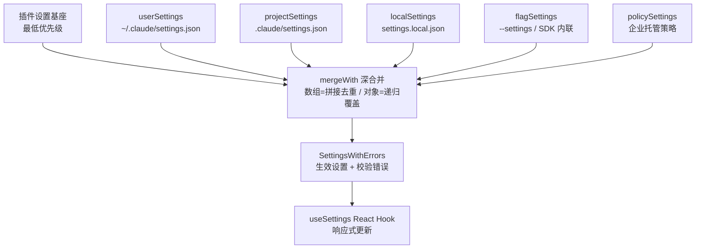
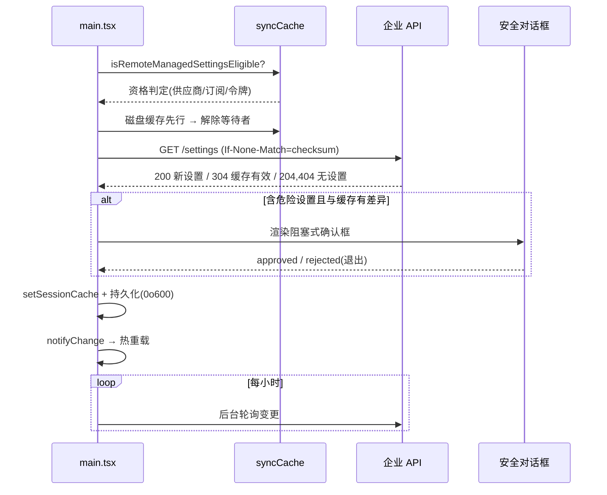
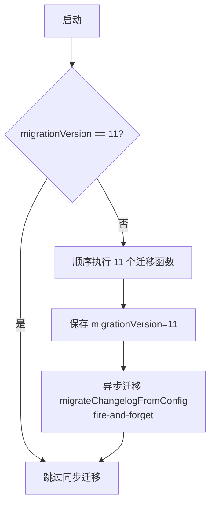
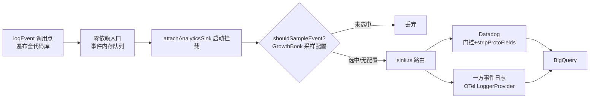

任何长生命周期的 CLI 工具都会面临同一个核心矛盾：**配置必须足够灵活以适应个人偏好，又必须足够可控以满足企业安全诉求**。本项目通过四套相互咬合的子系统回答了这一问题——五层优先级的设置合并体系、多源竞速的托管策略管道、版本门控的数据迁移框架，以及贯穿全程的分级遥测通道。本文从架构层面剖析这四套子系统的设计决策与实现细节，揭示"一次配置读取"背后隐藏的启动性能优化、安全信任分级与故障降级逻辑。

## 设置体系：五层优先级与三级缓存

### 分层模型

配置系统的第一性原理是**来源决定优先级**。代码库将所有可能的设置来源固化为一个有序常量数组，顺序即优先级——数组靠后的源在合并时覆盖靠前的源：用户全局设置（`~/.claude/settings.json`）→ 项目共享设置（`.claude/settings.json`）→ 项目本地设置（`.claude/settings.local.json`，自动加入 gitignore）→ CLI 标志设置（`--settings`）→ 策略设置（企业托管）。值得注意的是策略设置位于数组末尾，意味着**企业 IT 下发的配置拥有凌驾于用户偏好之上的最终决定权**。

| 来源 | 文件路径 | 写入权限 | 典型用途 |
|---|---|---|---|
| userSettings | `~/.claude/settings.json` | 用户 | 个人模型偏好、主题 |
| projectSettings | `$PROJ/.claude/settings.json` | 项目（可提交） | 团队统一权限规则 |
| localSettings | `$PROJ/.claude/settings.local.json` | 用户（gitignored） | 个人项目级覆盖 |
| flagSettings | 临时文件/SDK 内联 | 调用方 | 一次性注入 |
| policySettings | 系统级目录 | 管理员/远端 API | 企业策略强制 |

 cowork 模式下用户设置文件名切换为 `cowork_settings.json`，判定优先级为会话状态 > 环境变量 `CLAUDE_CODE_USE_COWORK_PLUGINS` > 默认值。

Sources: [constants.ts](utils/settings/constants.ts#L7-L39), [settings.ts](utils/settings/settings.ts#L264-L307)

### 合并语义：mergeWith 与数组拼接

主合并函数 `loadSettingsFromDisk` 以**插件设置基座为最低层**（仅含 allowlist 键），随后按优先级顺序逐源执行 `lodash mergeWith` 深合并。合并语义由 `settingsMergeCustomizer` 定制：**数组采用"拼接 + 去重"而非替换**——这意味着 `permissions.allow` 规则在多个源中是叠加生效的，而非高优先级覆盖低优先级。写入路径 `updateSettingsForSource` 的语义则相反：写入时数组总是整体替换，把"计算最终状态"的责任交还给调用方；删除记录字段中的键需显式设置为 `undefined` 而非 `delete`，因为 `mergeWith` 仅在键存在且值为显式 `undefined` 时才识别删除意图。

Sources: [settings.ts](utils/settings/settings.ts#L528-L547), [settings.ts](utils/settings/settings.ts#L645-L669), [settings.ts](utils/settings/settings.ts#L416-L524)

### 三级缓存与失效协议

性能是设置体系的关键约束——每次查询循环都可能读取设置，重复磁盘 I/O 不可接受。缓存采用**三级结构**：会话级缓存（`sessionSettingsCache`）存储最终合并结果、按源缓存（`perSourceCache`）存储单个源的解析结果、路径级缓存（`parseFileCache`）去重磁盘读取与 Zod 校验。三级缓存由同一个 `resetSettingsCache()` 统一失效，触发点包括设置写入、`--add-dir`、插件初始化与 Hooks 刷新。缓存条目返回时执行深拷贝，防止调用方在 `mergeWith` 中污染缓存对象。校验失败的文件采用**降级策略**：若 JSON 语法本身合法但 Schema 校验失败，写入路径会回退使用原始数据，避免单条无效规则导致整个文件被拒绝覆盖。

Sources: [settingsCache.ts](utils/settings/settingsCache.ts), [settings.ts](utils/settings/settings.ts#L182-L199), [settings.ts](utils/settings/settings.ts#L436-L471)

### 环境变量信任分级

设置中的 `env` 字段最终会注入 `process.env`，这构成了安全敏感面——恶意项目可通过 `.claude/settings.json` 的 `env.ANTHROPIC_BASE_URL` 将 API 流量重定向到攻击者服务器。防御机制是**两阶段信任模型**：`applySafeConfigEnvironmentVariables` 在信任对话框之前仅应用受信任源（用户/标志/策略）的全部环境变量，项目级源只能应用 `SAFE_ENV_VARS` 白名单中的安全变量；`applyConfigEnvironmentVariables` 在信任建立后才应用全部变量。此外还有三道针对性过滤：SSH 隧道变量剥离（防止远端设置覆盖转发认证）、宿主管控供应商变量剥离（`CLAUDE_CODE_PROVIDER_MANAGED_BY_HOST`）、CCD 桌面宿主 spawn 快照保护（防止 settings.env 覆盖宿主的 OTEL 传输配置）。

Sources: [managedEnv.ts](utils/managedEnv.ts#L39-L72), [managedEnv.ts](utils/managedEnv.ts#L100-L160)

### 变更检测与热重载

设置并非只在启动时读取一次。`settingsChangeDetector` 基于 chokidar 监听所有设置目录，配置 `awaitWriteFinish`（1 秒稳定阈值 + 500ms 轮询）过滤部分写入与快速连续变更。两个精巧机制值得关注：**内部写入标记**（`markInternalWrite` 后 5 秒内的变更视为自身写入，不触发通知循环）与**删除宽限期**（处理自动更新期间常见的"删除后重建"模式）。由于注册表/plist 无法用文件系统事件监听，MDM 源单独以 30 分钟间隔轮询快照比对。文件变更最终触发 `settingsChanged` 信号，驱动 React 层的 `useSettings` Hook 更新——组件通过 AppState Store 订阅，而非直接轮询 `getSettings()`。

Sources: [changeDetector.ts](utils/settings/changeDetector.ts#L27-L120), [useSettings.ts](hooks/useSettings.ts#L1-L18)

## 托管策略：多源竞速与远程同步

### 策略源内部优先级："首个非空源胜出"

`policySettings` 内部遵循与外层合并截然不同的语义——**不是合并而是竞速**。四个候选源按 remote（API 下发）> MDM（HKLM 注册表 / macOS plist）> 文件（`managed-settings.json` + drop-in 目录）> HKCU（用户可写注册表）排序，首个拥有非空内容的源**独占**策略层，其余源被完全忽略。这一设计避免了多源策略拼接产生的规则冲突——例如 MDM 下发的 `permissions.deny` 与文件策略合并后可能互相稀释。`getPolicySettingsOrigin` 将此逻辑暴露给 `/status` 命令，用户可看到策略实际来自 `(file)`、`(drop-ins)` 或 `(file + drop-ins)`。

文件策略自身支持 **systemd/sudoers 风格的 drop-in 目录**：基础文件 `managed-settings.json` 先合并，`managed-settings.d/*.json` 按字母序叠加合并（后者覆盖前者）。这让不同团队可以独立下发策略片段（如 `10-otel.json`、`20-security.json`）而无需协调编辑同一个管理员所有的文件。

| 平台 | 管理目录 | MDM 等价物 |
|---|---|---|
| macOS | `/Library/Application Support/ClaudeCode` | `/Library/Managed Preferences/` plist（root only） |
| Windows | `C:\Program Files\ClaudeCode` | `HKLM\SOFTWARE\Policies\ClaudeCode`（admin）/ `HKCU`（user） |
| Linux | `/etc/claude-code` | 无 MDM 等价物，仅文件策略 |

Sources: [settings.ts](utils/settings/settings.ts#L319-L407), [settings.ts](utils/settings/settings.ts#L74-L121), [managedPath.ts](utils/settings/managedPath.ts#L8-L34)

### 启动性能：MDM 子进程前置

MDM 读取依赖子进程（macOS 的 `plutil`、Windows 的 `reg query`），同步等待会拖慢启动。优化策略是**将子进程触发点前移到模块求值之前**——`main.tsx` 的前几行在所有重型 import 之前调用 `startMdmRawRead()`，使 plutil/reg query 与后续约 135ms 的模块加载**并行执行**。读取结果通过 Promise 缓存，`ensureMdmSettingsLoaded` 在首次设置读取前 await——若启动期已触发则立即返回。macOS 侧还有 plist 存在性快路径：非 MDM 机器上跳过 plutil 子进程（即使立即 ENOENT 也要约 5ms），直接返回空。模块结构刻意分层（`constants.ts` 零重型依赖 / `rawRead.ts` 仅子进程 I/O / `settings.ts` 承载解析与缓存）以维持"求值期即发射"的不变量。

Sources: [main.tsx](main.tsx#L1-L20), [rawRead.ts](utils/settings/mdm/rawRead.ts#L1-L80), [settings.ts](utils/settings/mdm/settings.ts#L60-L109)

### 远程托管策略：资格判定、ETag 缓存与安全对话框

远程策略从企业 API（`/api/claude_code/settings`）拉取，是最高优先级策略源。**资格判定**（`isRemoteManagedSettingsEligible`）在应用非策略环境变量之后计算，因为它依赖可经 settings.env 设置的 `CLAUDE_CODE_USE_BEDROCK`、`ANTHROPIC_BASE_URL`：第三方供应商或自定义 Base URL 用户不发请求；OAuth 用户的 `subscriptionType` 需为 enterprise/team；subscriptionType 为 null 的外部注入令牌（CCD/CCR/SDK）采取**乐观放行**——API 会对不合规组织返回空设置，误判的代价只是一次往返。

拉取流程体现三层韧性：**网络层**（10 秒超时、最多 5 次指数退避重试、认证错误跳过重试）、**缓存层**（ETag `If-None-Match` 协商缓存，304 直接复用缓存，204/404 返回空对象并删除陈旧缓存文件）、**应用层**（失败时回退磁盘缓存文件实现优雅降级，整体 fail-open）。启动采用**缓存先行**：磁盘有缓存时立即解除等待者阻塞，网络拉取继续在后台进行——为 print 模式启动节省约 77ms 的拉取等待。加载完成后启动每小时后台轮询，设置变更时触发 `notifyChange('policySettings')` 热重载。

最独特的是**危险设置安全确认**：远端下发的新设置若含危险项且与缓存存在差异，交互模式下会渲染阻塞式 `ManagedSettingsSecurityDialog` 要求用户明确批准；用户拒绝时调用 `gracefulShutdownSync(1)` 直接退出进程——将"企业策略推送"与"用户知情权"的冲突显性化，而非静默应用。等待其他系统初始化的 `loadingCompletePromise` 附加 30 秒超时，防止 Agent SDK 等非 CLI 上下文死锁。

Sources: [syncCache.ts](services/remoteManagedSettings/syncCache.ts#L49-L100), [index.ts](services/remoteManagedSettings/index.ts#L52-L66), [index.ts](services/remoteManagedSettings/index.ts#L209-L306), [index.ts](services/remoteManagedSettings/index.ts#L440-L555), [securityCheck.tsx](services/remoteManagedSettings/securityCheck.tsx#L22-L73)

### 用户级设置同步

与托管策略相对的是**用户设置的跨环境同步**（`services/settingsSync`）：交互式 CLI 将本地设置与记忆文件**增量上传**（仅上传与远端存在差异的条目），CCR 远程模式则在插件安装前**下载**远端设置到本地。同步键按 git remote hash 区分项目作用域（用户设置/用户记忆/项目本地设置/项目本地记忆四类），单文件上限 500KB 与后端一致。写入前调用 `markInternalWrite` 抑制变更检测循环，写入后失效设置与记忆双缓存。整个流程 fail-open——任何异常仅记录诊断日志，绝不阻塞启动。上传受 `tengu_enable_settings_sync_push` GrowthBook 门控，下载受 `tengu_strap_foyer` 门控，且都要求一方 OAuth 认证。

Sources: [index.ts](services/settingsSync/index.ts#L32-L105), [index.ts](services/settingsSync/index.ts#L175-L235)

## 数据迁移：版本门控与幂等设计

### 迁移框架结构

`migrations/` 目录下的迁移函数由 `main.tsx` 的 `runMigrations()` 统一编排，核心是**全局配置中的 `migrationVersion` 版本号门控**：当前版本为 11，存储值不等于当前版本时整套同步迁移重跑一次，全部成功后原子写入新版本号。这不是逐条记录的渐进迁移，而是"全有或全无"的幂等集合——任何一条失败都不会推进版本号，下次启动整体重试。有一条例外：`migrateChangelogFromConfig` 是异步迁移，fire-and-forget 执行，失败静默忽略（下次启动重试）。迁移集覆盖三类场景：**设置搬家**（全局配置键迁入 settings.json，如 autoUpdates、bypassPermissionsModeAccepted）、**模型字符串演进**（fennec→opus、sonnet1m→sonnet45→sonnet46、opus→opus1m 的别名链）、**语义重置**（重置 auto-mode 选择以重新展示默认提议）。

Sources: [main.tsx](main.tsx#L323-L352)

### 单个迁移的解剖模式

每个迁移遵循统一四步：**读取旧源 → 写入新源 → 记录遥测 → 清理旧键**。以 `migrateAutoUpdatesToSettings` 为例：先检查全局配置中 `autoUpdates === false` 且非原生保护性禁用（区分"用户显式禁用"与"系统自动保护"以保留用户意图）；将 `DISABLE_AUTOUPDATER=1` 写入用户设置的 `env` 字段并立即同步到 `process.env`；发送 `tengu_migrate_autoupdates_to_settings` 事件（含是否已有该环境变量的元数据）；最后从全局配置中剥离两个旧键。失败路径同样发送 `tengu_migrate_autoupdates_error` 事件，使迁移成功率可观测。

`migrateFennecToOpus` 展示了**免标志幂等**的精巧设计：仅读写同一个 `userSettings` 源，目标状态（`model: 'opus'`）读取时自然满足停止条件，无需完成标志。注释明确说明刻意**不读取合并后的设置**——那会导致无限重跑，且会把项目/策略层中的 fennec 别名静默提升为全局值。该迁移被 `USER_TYPE === 'ant'` 门控，仅内部用户生效。

Sources: [migrateAutoUpdatesToSettings.ts](migrations/migrateAutoUpdatesToSettings.ts#L13-L61), [migrateBypassPermissionsAcceptedToSettings.ts](migrations/migrateBypassPermissionsAcceptedToSettings.ts#L14-L40), [migrateFennecToOpus.ts](migrations/migrateFennecToOpus.ts#L6-L45)

### 设置体系的安全边界

迁移与托管之外，设置查询层还维护着一张**信任源白名单**：`hasSkipDangerousModePermissionPrompt`、`hasAutoModeOptIn` 等危险对话框跳过标志刻意排除 `projectSettings`——恶意项目若能通过项目设置自动跳过"危险模式确认"对话框，等同于 RCE 攻击向量。`getAutoModeConfig` 逐源解析并**聚合** autoMode 的 allow/soft_deny/environment 规则（叠加而非竞速），同样排除项目层。这些函数内部以 `feature('TRANSCRIPT_CLASSIFIER')` 编译期门控包裹，外部构建中被死代码消除。

Sources: [settings.ts](utils/settings/settings.ts#L878-L982)

## 遥测分析：双管道架构

### 分析事件管道：零依赖 Sink 模式

`logEvent` 是全代码库通用的分析事件入口，其架构核心是**入口零依赖 + 可替换 Sink**：`services/analytics/index.ts` 不 import 任何后端模块以杜绝循环依赖，事件在 Sink 附加前进入内存队列，`attachAnalyticsSink()` 在启动时挂载真正的路由实现，并通过 `queueMicrotask` 异步排空队列避免阻塞启动路径（ant 用户会额外收到携带队列长度的 `analytics_sink_attached` 事件用于调试初始化时序）。

路由实现（`sink.ts`）将事件分发至两个后端：**Datadog**（受 GrowthBook 门控 `tengu_log_datadog_events` 控制，门控未初始化时回退上一会话的磁盘缓存值防止初始化窗口丢数据）与**一方事件日志**（始终接收全量）。PII 防护通过**命名约定 + 集中剥离**实现：以 `_PROTO_` 为前缀的元数据键携带未脱敏的 PII 标记值，仅一方导出器可见并提升为 proto 字段；`stripProtoFields` 在 Datadog 分发前统一剥离——单一守卫点覆盖所有非一方后端，杜绝"某个后端忘记过滤"。类型系统以两个 `never` 标记类型（`AnalyticsMetadata_I_VERIFIED_THIS_IS_NOT_CODE_OR_FILEPATHS` 等）强制开发者在写入字符串时显式断言已验证不含代码片段/文件路径。

**动态采样**是成本控制的关键：GrowthBook 动态配置 `tengu_event_sampling_config` 按事件名映射采样率（0-1），采样命中的事件在元数据中附加 `sample_rate` 字段供下游分析时还原真实量级；未配置的事件 100% 记录。`sinkKillswitch` 提供按后端的紧急停机开关。

Sources: [index.ts](services/analytics/index.ts#L11-L58), [index.ts](services/analytics/index.ts#L80-L123), [sink.ts](services/analytics/sink.ts#L48-L72), [firstPartyEventLogger.ts](services/analytics/firstPartyEventLogger.ts#L27-L85)

### 一方导出与禁用边界

一方事件日志基于 OpenTelemetry `LoggerProvider` + `BatchLogRecordProcessor` 构建，批处理参数（延迟/批大小/队列容量/重试次数/上报路径）全部来自动态配置 `tengu_1p_event_batch_config`，GrowthBook 刷新时通过配置快照比对决定是否重建 Provider（`isEqual` 判断使未变更的刷新成为无操作）。进程退出前 `shutdown1PEventLogging` 强制冲刷，确保 API 响应中的迟到事件不丢失。

遥测的**退出边界**由 `isAnalyticsDisabled` 统一定义：测试环境、三方云供应商（Bedrock/Vertex/Foundry——企业自管推理不应有数据外流）、以及隐私级别设为 no-telemetry/essential-traffic 时全量禁用。反馈问卷的禁用条件刻意**更宽松**——不阻止三方供应商用户，因为问卷是纯本地 UI 提示、不涉及转录数据，企业客户可经 OTEL 自行采集响应。

Sources: [firstPartyEventLogger.ts](services/analytics/firstPartyEventLogger.ts#L87-L128), [config.ts](services/analytics/config.ts#L19-L38)

### OpenTelemetry 三信号：延迟加载与出口复用

面向企业的 **OTEL 标准通道**与内部分析管道完全并行，由 `instrumentation.ts` 管理 metrics/logs/traces 三信号。启动成本通过**多层延迟加载**压制：约 400KB 的 OpenTelemetry + protobuf 模块推迟到遥测实际初始化时才动态导入；约 700KB 的 gRPC 导出器再嵌套一层懒加载；OTLP/Prometheus 六种协议变体在 switch 语句内动态导入——每个进程每个信号至多使用一种变体，静态导入会让所有六种（约 1.2MB）在每次启动时加载。`bootstrapTelemetry` 将 ant 内部构建的 `ANT_OTEL_*` 变量映射为标准 OTEL 变量，并默认将 metrics 时间性（tempoity）设为 delta。导出协议栈覆盖 OTLP（HTTP/gRPC）、Console（调试，附资源属性输出）、BigQuery（`BigQueryMetricsExporter`）与 Perfetto 追踪。

事件经 `logOTelEvent` 以日志记录形式发射，携带单调递增的 `event.sequence` 序列号（会话内事件排序）、`prompt.id`（关联提示，但刻意不加到 metrics——无界基数）、以及 `redactIfDisabled` 控制的用户提示内容脱敏（默认 `<REDACTED>`，需 `OTEL_LOG_USER_PROMPTS` 显式开启）。工作区路径同样只出现在事件中不出现在 metrics——文件系统路径基数过高，且 **BQ metrics 管道绝不能看到它们**。

Sources: [instrumentation.ts](utils/telemetry/instrumentation.ts#L1-L71), [instrumentation.ts](utils/telemetry/instrumentation.ts#L87-L128), [init.ts](entrypoints/init.ts#L44-L105), [events.ts](utils/telemetry/events.ts#L21-L75)

### 可观测性自身的行为审计

配置与遥测系统的**自反监控**值得专门一提：设置加载本身被观测（`settings_load_started/completed` 携带时长、源数量、错误数）、MDM 加载记录时长与键数、远程同步全链路打点（skipped/starting/failed/success/empty）、迁移成败独立事件。托管策略下发的键列表经 `getManagedSettingsKeysForLogging` 处理——对 permissions/sandbox/hooks 三类嵌套设置展开一层（如 `permissions.allow`），仅保留 Schema 认可的有效嵌套键，排序后以逗号拼接发送 `tengu_managed_settings_loaded`，使企业策略覆盖面可被分析。所有诊断类日志统一走 `logForDiagnosticsNoPII` 通道（无 PII 保证），启动全程由 `profileCheckpoint` 打点（`mdm_load_start/end`、`loadSettingsFromDisk_start/end`）支撑启动性能回归分析。

Sources: [settings.ts](utils/settings/settings.ts#L558-L636), [main.tsx](main.tsx#L211-L229), [settings.ts](utils/settings/settings.ts#L645-L796), [settings.ts](utils/settings/mdm/settings.ts#L67-L98)

## 结语

纵观四个子系统，可以提炼出三条贯穿性的设计原则。**其一，信任显式化**——从设置源的优先级数组、环境变量的白名单过滤，到策略层的"首个非空源胜出"与危险设置确认对话框，每个可能被滥用的边界都有明确的信任声明。**其二，失败路径与成功路径同等精心**——远程策略的 ETag 缓存/磁盘回退/fail-open 三层降级、迁移的版本门控整体重试、设置校验失败时的原始数据回退，都假设"会出错"并预置了行为。**其三，可观测性内嵌于架构而非事后补丁**——事件队列解决初始化时序、采样配置控制成本、PII 前缀约定集中剥离、性能打点贯穿启动全程。理解这三条原则后，建议继续阅读[权限模型：模式切换、规则解析、Bash 分类器与自动模式](19-quan-xian-mo-xing-mo-shi-qie-huan-gui-ze-jie-xi-bash-fen-lei-qi-yu-zi-dong-mo-shi)（设置中 permissions 规则的消费端）、[启动引导流程：main.tsx 入口、CLI 参数解析与启动性能优化](5-qi-dong-yin-dao-liu-cheng-main-tsx-ru-kou-cli-can-shu-jie-xi-yu-qi-dong-xing-neng-you-hua)（本文多处启动优化的完整图景），以及[API 层与模型管理：Anthropic 客户端、多供应商支持与 OAuth 认证](29-api-ceng-yu-mo-xing-guan-li-anthropic-ke-hu-duan-duo-gong-ying-shang-zhi-chi-yu-oauth-ren-zheng)（远程策略依赖的认证体系）。