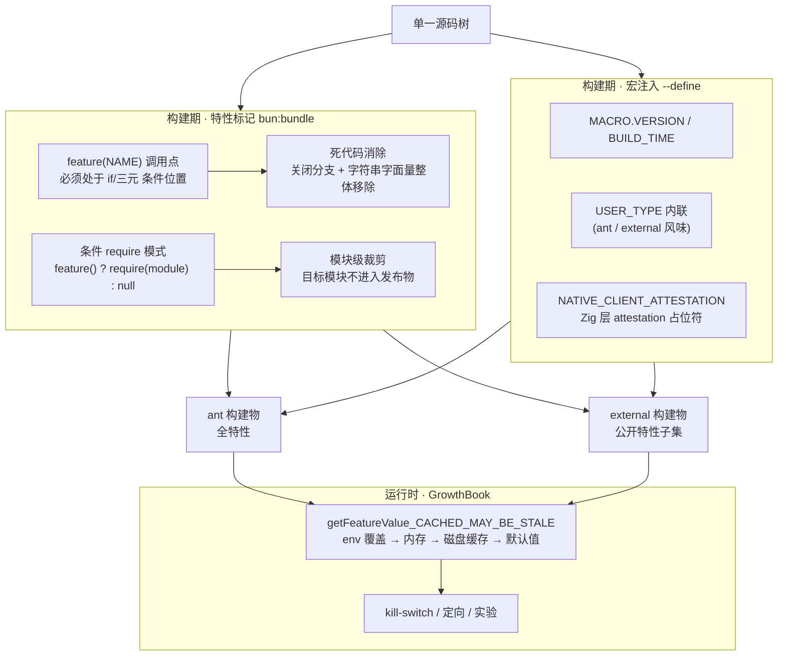
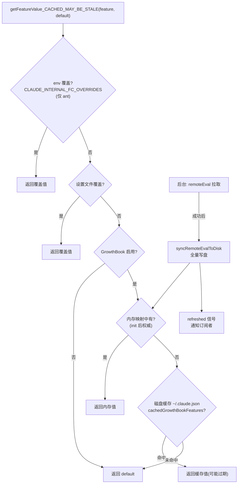

本页解剖这个 CLI 的"一个代码库、多种发布物"背后的工程机制：源码如何通过 `bun:bundle` 的 `feature()` 标记、Bun `--define` 宏注入与条件 `require` 三种构建期手段，配合 GrowthBook 运行时灰度，实现**编译期死代码消除（DCE）与运行时特性开关的双层门控**。全文基于本仓库源码快照中的可验证证据——包括约束注释、被裁剪模块的缺席痕迹，以及一处 define 内联的化石级残留。理解这套体系，是读懂后续所有功能页面中 `isEnabled()`、`feature()` 调用语义的前提。

Sources: [voiceModeEnabled.ts](voice/voiceModeEnabled.ts#L1-L27) · [tools.ts](tools.ts#L104-L135) · [growthbook.ts](services/analytics/growthbook.ts#L726-L773)

## 一、全景：三层门控架构

这个项目对"一个特性是否生效"的回答分三个层次，各有不同的生效时机与代价。**第一层是构建期特性标记**：`import { feature } from 'bun:bundle'` 引入一个由 Bun 打包器在编译期解析的虚拟模块，`feature('NAME')` 在打包时被替换为常量，使关闭分支中的代码（乃至整个模块）在发布物中彻底消失——既减小体积，也防止未公布特性的字符串字面量泄漏到外部二进制。**第二层是构建期宏注入**：`MACRO.VERSION` 等全局符号由 Bun `--define` 在构建时内联为字面量，配合 `process.env.USER_TYPE` 的 define 替换区分 ant（Anthropic 内部）与 external 两种构建风味。**第三层是运行时灰度**：GrowthBook 特性值在进程启动后异步拉取、落盘缓存，通过 `getFeatureValue_CACHED_MAY_BE_STALE()` 同步读取，支撑 kill-switch、按组织定向与 A/B 实验。

三层并非互斥而是**组合使用**：典型特性同时接受"构建期是否随附"与"运行时是否放行"两道关卡。入口文件 `entrypoints/cli.tsx` 中 Remote Control 快速路径的注释一语道破这种分工——"feature() must stay inline for build-time dead code elimination; isBridgeEnabled() checks the runtime GrowthBook gate"（feature() 必须内联以支持构建期 DCE；isBridgeEnabled() 检查运行时 GrowthBook 门）。

Sources: [cli.tsx](entrypoints/cli.tsx#L109-L115) · [bridgeEnabled.ts](bridge/bridgeEnabled.ts#L20-L36)

## 二、feature() 的调用约束：位置与极性

`feature()` 不是普通函数，它的返回值必须在打包器做静态分析时**可判定**。源码中反复出现两类约束注释，构成了使用这个 API 的军规。**约束一：位置约束**——`feature()` 必须直接出现在 `if` 或三元表达式的条件位置，不能先赋值给变量再判断。查询引擎中 withhold 逻辑的注释明确写道："feature() only works in if/ternary conditions (bun:bundle tree-shaking constraint), so the collapse check is nested rather than composed"（feature() 只在 if/三元条件中生效，因此 collapse 检查采用嵌套而非组合写法）——宁可嵌套两层 `if`，也不写成 `feature('X') && otherCheck` 之外的任何形式。权限对话框组件中同样标注："feature() must sit directly in an if/ternary (bun:bundle DCE constraint)"。

**约束二：极性约束（正向三元模式）**——这是更隐蔽的一条。`voiceModeEnabled.ts` 与 `bridgeEnabled.ts` 中的注释揭示了原因："Negative pattern (if (!feature(...)) return) does not eliminate inline string literals from external builds"（负向模式 `if (!feature(...)) return` 无法从外部构建中消除内联字符串字面量）。也就是说，`if (!feature('BRIDGE_MODE')) return` 这种写法虽然能消除后续代码路径，但分支体内**未被直接守卫的字符串常量**（如 GrowthBook 的特性键名）仍可能残留在产物中；而写成 `return feature('BRIDGE_MODE') ? guardedExpression : false` 的正向三元，能让打包器把 GrowthBook 键名字面量连同死分支一起整体移除。`BriefTool` 的附件上传函数采用了同一模式的变体：函数体第一行就是 `if (feature('BRIDGE_MODE')) { ...全部逻辑... }`，注释说明"Positive pattern so bun:bundle eliminates the entire body from non-BRIDGE_MODE builds"。

| 写法 | DCE 效果 | 字符串字面量 | 结论 |
|---|---|---|---|
| `return feature(X) ? expr : false` | 消除 `expr` 分支 | ✅ 一并消除 | **推荐（正向三元）** |
| `if (feature(X)) { 全部逻辑 }` | 消除整个块 | ✅ 一并消除 | **推荐（正向包裹）** |
| `if (!feature(X)) return` | 消除后续路径 | ⚠️ 可能残留 | 禁用于含敏感字面量的代码 |
| `const ok = feature(X); if (ok)` | ❌ 无法静态判定 | ❌ 残留 | 禁止 |

Sources: [query.ts](query.ts#L794-L806) · [ExitPlanModePermissionRequest.tsx](components/permissions/ExitPlanModePermissionRequest/ExitPlanModePermissionRequest.tsx#L143-L144) · [voiceModeEnabled.ts](voice/voiceModeEnabled.ts#L21-L27) · [bridgeEnabled.ts](bridge/bridgeEnabled.ts#L29-L36) · [upload.ts](tools/BriefTool/upload.ts#L96-L104)

## 三、条件 require：模块级消除与桩回退

当门控对象是**整个模块**而非一段逻辑时，静态 `import` 会使模块无条件进入依赖图，DCE 就失效了。此项目的解法是把静态导入改写为条件 `require()`——`tools.ts` 与 `commands.ts` 是这种模式最密集的现场。工具注册表中，`CtxInspectTool`、`TerminalCaptureTool`、`WebBrowserTool`、`SnipTool`、`ListPeersTool`、`WorkflowTool` 等全部以 `const X = feature('FLAG') ? require('...') : null` 的形式加载，并用 `/* eslint-disable @typescript-eslint/no-require-imports */` 显式豁免 lint 对 require 的禁令；命令注册表同理，`/voice`、`/ultraplan`、`/bridge`、`/buddy` 等二十余个命令各自绑定一个特性标记。

UI 层演化出更精细的**类型化桩回退**变体。`REPL.tsx` 对语音集成 hook 的处理是范本：`const useVoiceIntegration = feature('VOICE_MODE') ? require('...').useVoiceIntegration : () => ({ stripTrailing: () => 0, handleKeyEvent: () => {}, resetAnchor: () => {} })`——关闭特性时返回一个签名兼容的空实现，调用点代码无需任何条件分支，组件树在两种构建风味下结构一致。同一文件中，两个 ant-only 的 hook（挫败感检测、内部组织警告）采用 `"external" === 'ant'` 的判断条件，这个怪异的字面量对比正是构建期内联的化石证据（详见第四节），其注释还补充了消除动机：挫败感检测带有两个每次消息变更都运行的 O(n) useMemo 与一次 GrowthBook 拉取，而组织警告的 UUID 列表中有一个串处于"排除字符串"清单上——DCE 在这里同时服务性能与信息卫生。

这套机制的成效在本仓库的目录结构中**直接可观察**。本快照镜像的是 external 分发物，条件 require 引用的目标模块呈现清晰的在/缺席二分：

| 条件 require 引用目标 | 门控标记 | 本快照中 | 推论 |
|---|---|---|---|
| `commands/voice/`、`commands/brief.ts`、`commands/ultraplan.tsx`、`commands/bridge/`、`coordinator/coordinatorMode.ts` | VOICE_MODE、KAIROS_BRIEF、ULTRAPLAN、BRIDGE_MODE、COORDINATOR_MODE | ✅ 存在 | 该分发物随附这些特性 |
| `commands/buddy/`、`commands/fork/`、`commands/workflows/`、`commands/torch/`、`commands/peers/`、`commands/proactive`、`commands/subscribe-pr`、`daemon/` | BUDDY、FORK_SUBAGENT、WORKFLOW_SCRIPTS、TORCH、UDS_INBOX、PROACTIVE、KAIROS_GITHUB_WEBHOOKS、DAEMON | ❌ 缺席 | 模块未进入此分发物 |
| `tools/OverflowTestTool`、`tools/SnipTool`、`tools/WebBrowserTool`、`tools/TerminalCaptureTool`、`tools/ListPeersTool`、`tools/CtxInspectTool` | 对应工具标记 | ❌ 缺席 | 同上 |
| `components/FeedbackSurvey/useFrustrationDetection`、`hooks/notifs/useAntOrgWarningNotification` | USER_TYPE=ant | ❌ 缺席（全仓库无引用实现） | ant-only 模块被裁剪 |

Sources: [tools.ts](tools.ts#L104-L135) · [commands.ts](commands.ts#L59-L122) · [REPL.tsx](screens/REPL.tsx#L95-L115) · [skills/bundled/index.ts](skills/bundled/index.ts#L35-L50)

## 四、MACRO 宏与 USER_TYPE 内联：--define 的两副面孔

构建期注入的第二类机制是 Bun 的 `--define` 全局替换，源码中以两个形态出现。**形态一：`MACRO` 命名空间**。`MACRO.VERSION`、`MACRO.BUILD_TIME`、`MACRO.VERSION_CHANGELOG` 是三个构建期注入的常量，全仓库 150+ 处引用。入口的 `--version` 快速路径之所以能做到零模块加载，正是因为版本号在构建时已内联为字符串常量——注释直言 "MACRO.VERSION is inlined at build time"。`/version` 命令进一步展示了两级宏的组合：`MACRO.BUILD_TIME ? \`${MACRO.VERSION} (built ${MACRO.BUILD_TIME})\` : MACRO.VERSION`，在未注入构建时间的开发运行下优雅降级。由于 `MACRO` 在非打包环境（如直接以 tsx 运行单测）不存在，防御性写法 `typeof MACRO !== 'undefined'` 散见于诊断与洞察模块。这套机制还有一个已归档的坑：`sessionStorage.ts` 在模块级缓存了 `const VERSION = typeof MACRO !== 'undefined' ? MACRO.VERSION : 'unknown'`，注释指向 Bun 上游 issue #26168——`--define` 在异步上下文中存在替换失效的 bug，模块级快照是官方 workaround。

**形态二：`process.env.USER_TYPE` 的构建期内联**。上一节的 `"external" === 'ant'` 即其产物：源码写作 `process.env.USER_TYPE === 'ant'`，external 构建把 `process.env.USER_TYPE` define 为 `"external"`，比较式被常量折叠为永假，ant-only 分支连同其条件 require 一并消除。值得注意的是**同一符号的两种身份并存**——在 REPL.tsx 这类被 define 覆盖的文件中它是编译期常量，而在 `agentSwarmsEnabled.ts`、GrowthBook 调试日志等处它仍是运行时环境变量检查（外部用户可通过环境获得 ant 行为的少数路径由此而来，如 `--agent-teams` 标志对所有人的开放说明）。Chrome 扩展侧还有第三个变体：`import.meta.env.ANT_ONLY_BUILD` 门控整个 lightning 模块图，注释提到 `build:prod` 会 grep 产物中的标记字符串来**验证**裁剪确实发生——DCE 在那里是一道被 CI 强制执行的工序。

| 注入机制 | 符号 | 生效时机 | 典型用途 | 防御写法 |
|---|---|---|---|---|
| bun:bundle `feature()` | `feature('NAME')` | 打包期 DCE | 特性分支/模块裁剪 | 必须内联于条件位 |
| `--define` 宏 | `MACRO.VERSION` 等 | 构建期内联 | 版本号、构建时间 | `typeof MACRO !== 'undefined'` |
| `--define` 环境 | `process.env.USER_TYPE` | 构建期内联（部分文件） | ant/external 风味 | 运行时检查兜底 |
| Vite 式 env | `import.meta.env.ANT_ONLY_BUILD` | 扩展构建期 | 扩展产物裁剪 | build:prod grep 验证 |

Sources: [cli.tsx](entrypoints/cli.tsx#L36-L41) · [version.ts](commands/version.ts#L4-L9) · [sessionStorage.ts](utils/sessionStorage.ts#L97-L99) · [doctorDiagnostic.ts](utils/doctorDiagnostic.ts#L515-L518) · [REPL.tsx](screens/REPL.tsx#L104-L113) · [mcpServer.ts](utils/claudeInChrome/mcpServer.ts#L152-L160)

## 五、运行时层：GrowthBook 缓存优先级链

构建期标记决定"代码是否存在于产物中"，运行时灰度决定"存在的代码此刻是否放行"。`getFeatureValue_CACHED_MAY_BE_STALE()` 是运行时读取的唯一推荐入口，其函数名后缀 `_CACHED_MAY_BE_STALE` 本身就是 API 文档：**返回值可能过期**——它从不阻塞等待网络，启动关键路径可以放心同步调用。其内部是一条五级优先级链，逐级降级：环境变量覆盖（`CLAUDE_INTERNAL_FC_OVERRIDES`，仅 ant 用户生效，供评测装置注入固定配置）→ 设置文件覆盖 → 进程内 `remoteEvalFeatureValues` 内存映射（初始化后的权威来源）→ 磁盘缓存（全局配置中的 `cachedGrowthBookFeatures` 字段，跨进程存活）→ 调用方默认值。

数据流的上游同样经过防御性设计。远端评测响应由 `processRemoteEvalToDisk` 处理：它先做**空载荷守卫**（`{features: {}}` 这种瞬态服务端故障不得触发写盘，否则会把共享 `~/.claude.json` 的所有进程打入"全旗黑屏"），再修复 API 返回 `value` 而 SDK 期望 `defaultValue` 的格式错位，最后把服务端预评测的值绕过 SDK 本地重评测的 bug 直接缓存进内存映射。随后 `syncRemoteEvalToDisk` 以**全量替换**（非合并）方式落盘——服务端删除的特性在下次成功载荷后从磁盘消失，且注释确认 ant 构建的特征集是 external 的超集，切换构建风味是安全的。刷新节奏按风味分化：ant 每 20 分钟、external 每 6 小时（对齐被迁移的 Statsig 的间隔）。订阅者机制 `onGrowthBookRefresh` 用信号量通知长生命周期对象重建，并处理了一个真实的竞态——外部构建快网络下 init 约 100ms 完成而 REPL 挂载需 600ms，晚注册的订阅者通过微任务补发拿到首帧值。历史包袱方面，`checkStatsigFeatureGate_CACHED_MAY_BE_STALE` 与阻塞式 `getFeatureValue_DEPRECATED` 均被标注为迁移期兼容层，新代码一律使用非阻塞入口。

Sources: [growthbook.ts](services/analytics/growthbook.ts#L726-L773) · [growthbook.ts](services/analytics/growthbook.ts#L330-L405) · [growthbook.ts](services/analytics/growthbook.ts#L407-L420) · [growthbook.ts](services/analytics/growthbook.ts#L1005-L1016) · [growthbook.ts](services/analytics/growthbook.ts#L120-L160) · [growthbook.ts](services/analytics/growthbook.ts#L168-L205)

## 六、组合门控范式：三个案例与一个教训

真实特性极少只靠单一层门控。三个代表性案例展示了"构建期 + 运行时 + 身份/环境"的组合范式，而第四个案例是一次公开的事故复盘。**语音模式（VOICE_MODE）**采用三层叠加：`isVoiceModeEnabled() = hasVoiceAuth() && isVoiceGrowthBookEnabled()`，其中后者内部是 `feature('VOICE_MODE') ? !getFeatureValue_CACHED_MAY_BE_STALE('tengu_amber_quartz_disabled', false) : false`——构建期决定语音代码是否随附，GrowthBook 键做紧急 kill-switch（默认 `false` 意为"未杀死"，保证全新安装无需等待 GrowthBook 初始化即可用语音），OAuth 令牌校验兜住 claude.ai 独占端点的访问资格。React 渲染路径另有 `useVoiceEnabled()`：仅对昂贵的钥匙串读取按 `authVersion` 记忆化，便宜的 GB 查询留在 memo 外，使会话中翻转 kill-switch 能在下次渲染即时生效。**Remote Control（BRIDGE_MODE）**的 `isBridgeEnabled()` 是同一骨架加上订阅资格校验；它还提供阻塞变体 `isBridgeEnabledBlocking()`（磁盘缓存为 false 时最多等 5 秒取新值，用于"过期 false 会不公平拒人"的资格关口）与诊断变体 `getBridgeDisabledReason()`（返回可操作的错误文案，处理了缺 `user:profile` scope 导致组织属性为空的死胡同场景）。**代理团队（agent teams）**则展示环境 opt-in 层：ant 用户直通；外部用户须显式 `CLAUDE_CODE_EXPERIMENTAL_AGENT_TEAMS` 环境变量或 `--agent-teams` 标志，再过 `tengu_amber_flint` kill-switch——这是全仓库引用 teammates 时的唯一检查点。

**教训案例是 worktree 模式**。`isWorktreeModeEnabled()` 如今无条件返回 `true`，但函数注释保留了完整事故记录：此前由 GrowthBook 旗 `tengu_worktree_mode` 门控，而 `_CACHED_MAY_BE_STALE` 在首次启动、缓存未填充时返回默认值 `false`，导致用户显式传入的 `--worktree` 被静默吞掉（外部 issue #27044）。这条教训的本质是：**运行时缓存的语义（可能过期/可能缺失）与 CLI 显式参数的确定性语义天然冲突**——用户显式要求的开关不应被可能未就绪的远程配置否决。

| 特性 | 构建期标记 | 运行时门 | 身份/环境门 | 失败默认 |
|---|---|---|---|---|
| 语音模式 | `VOICE_MODE` | `tengu_amber_quartz_disabled`（反向 kill-switch） | Anthropic OAuth 令牌 | kill-switch 缺失读作"未杀死"（可用） |
| Remote Control | `BRIDGE_MODE` | `tengu_ccr_bridge` | claude.ai 订阅 | 未启用返回 false |
| 代理团队 | —（纯运行时） | `tengu_amber_flint` | ant 直通 / 外部需 env 或 flag | 外部默认关闭 |
| /ultrareview | —（命令文件随附） | `tengu_review_bughunter_config.enabled` | — | 未配置即隐藏命令 |
| worktree 模式 | — | ~~`tengu_worktree_mode`~~（已移除） | — | 教训：缓存默认值吞掉显式 flag |

Sources: [voiceModeEnabled.ts](voice/voiceModeEnabled.ts#L18-L55) · [useVoiceEnabled.ts](hooks/useVoiceEnabled.ts#L1-L26) · [bridgeEnabled.ts](bridge/bridgeEnabled.ts#L26-L59) · [agentSwarmsEnabled.ts](utils/agentSwarmsEnabled.ts#L20-L45) · [ultrareviewEnabled.ts](commands/review/ultrareviewEnabled.ts#L6-L15) · [worktreeModeEnabled.ts](utils/worktreeModeEnabled.ts#L1-L12)

## 七、运行形态检测与构建体系的特殊触点

门控体系之外，还有几个与构建直接耦合的触点值得单列。**运行时形态自检**由 `bundledMode.ts` 承担：`process.versions.bun !== undefined` 判定 Bun 运行时，`Bun.embeddedFiles` 数组非空则进一步判定是 **Bun `--compile` 产出的独立可执行文件**（原生安装）——嵌入式文件是编译产物独有的特征。**API 请求溯源**中的 `NATIVE_CLIENT_ATTESTATION` 标记展示了与定制 Bun 运行时（`bun-anthropic`，Zig 实现）的最深耦合：开启时归因头携带 `cch=00000` 占位符，发送前由 Bun 原生 HTTP 栈在序列化字节中把零覆写为计算的 attestation 哈希，服务端借此验证请求确实来自真实客户端；采用等长占位替换而非 Zig 侧注入，是为了避免 Content-Length 变化与缓冲区重分配。**入口级的 ablation 基线**展示了 feature() DCE 的另一种用法：`cli.tsx` 顶层用 `if (feature('ABLATION_BASELINE') && process.env.CLAUDE_CODE_ABLATION_BASELINE)` 注入七个禁用型环境变量（关闭思考、压缩、后台任务等），注释解释了为何内联在入口而非 init——下游工具在 import 时就把这些环境变量捕获为模块级常量，init() 执行为时已晚；而在 external 构建中该块被整体消除。最后，`listSessionsImpl.ts` 从反面示范了边界意识：这个 SDK 专用模块刻意保持"no analytics, no bun:bundle, no module-scope mutable state"——不引入 `bun:bundle` 使其可被 SDK 入口安全加载而不触发 CLI 初始化链条；同理 `cli/print.ts` 顶行的 biome 豁免注释 "ANT-ONLY import markers must not be reordered" 提醒：import 排序工具不得打乱被门控标记锚定的导入顺序。

Sources: [bundledMode.ts](utils/bundledMode.ts#L1-L23) · [system.ts](constants/system.ts#L60-L90) · [cli.tsx](entrypoints/cli.tsx#L18-L27) · [listSessionsImpl.ts](utils/listSessionsImpl.ts#L1-L8) · [print.ts](cli/print.ts#L1-L2)

## 八、在本快照中研究门控的观察指南

本仓库是发布物源码快照而非可构建工程（构建脚本、`package.json` 均不在树内），因此研究门控体系的正确姿势是**把约束注释当作规范、把模块缺席当作实验结果**。三个实用切入点：其一，`git grep` 任一特性名（如 `VOICE_MODE`、`CONTEXT_COLLAPSE`、`BRIDGE_MODE`）即可看到同一标记在工具注册、命令注册、UI 组件、系统提示词组装等多处的分布——`constants/betas.ts` 中甚至用 `feature('CONNECTOR_TEXT') ? 'summarize-connector-text-2026-03-13' : ''` 决定 API beta 头是否携带，未随附的 beta 头在外部构建中变成空串。其二，对照第二节的存在/缺席表逆向推断分发物特性集：快照中在场的 voice、bridge、ultraplan、coordinator 模块即 external 用户实际获得的功能面。其三，已验证的标记名清单可作为阅读地图：VOICE_MODE、CONTEXT_COLLAPSE、BRIDGE_MODE、DAEMON、KAIROS 家族（KAIROS/KAIROS_BRIEF/KAIROS_DREAM/KAIROS_GITHUB_WEBHOOKS）、ULTRAPLAN、BUDDY、TORCH、UDS_INBOX、FORK_SUBAGENT、WORKFLOW_SCRIPTS、HISTORY_SNIP、CCR_REMOTE_SETUP、COORDINATOR_MODE、TERMINAL_PANEL、WEB_BROWSER_TOOL、CHICAGO_MCP、MESSAGE_ACTIONS、OVERFLOW_TEST_TOOL、EXPERIMENTAL_SKILL_SEARCH、REVIEW_ARTIFACT、AGENT_TRIGGERS、TRANSCRIPT_CLASSIFIER、CONNECTOR_TEXT、ABLATION_BASELINE、DUMP_SYSTEM_PROMPT、NATIVE_CLIENT_ATTESTATION——命名风格（大写下划线、无 TENGU_ 前缀）与 GrowthBook 键（`tengu_` 前缀小写下划线）形成清晰区分：前者是编译期符号，后者是运行时键。

Sources: [betas.ts](constants/betas.ts#L25-L32) · [commands.ts](commands.ts#L59-L122) · [betas.ts](utils/betas.ts#L1-L14)

## 九、下一步阅读

门控体系是理解后续所有功能页面的"语法基础"：工具的 `isEnabled()`、命令的可见性、系统提示词的分节组装都建立在其上。建议按以下顺序推进——先读[工具注册表：内置工具清单、懒加载与循环依赖治理](11-gong-ju-zhu-ce-biao-nei-zhi-gong-ju-qing-dan-lan-jia-zai-yu-xun-huan-yi-lai-zhi-li)，看条件 require 模式如何与工具注册表协作；再读[斜杠命令体系：命令注册、参数解析与本地 JSX 命令模式](14-xie-gang-ming-ling-ti-xi-ming-ling-zhu-ce-can-shu-jie-xi-yu-ben-di-jsx-ming-ling-mo-shi)，理解命令级 `isEnabled` 过滤；若对运行时配置全貌感兴趣，[配置与可观测性：设置体系、托管策略、数据迁移与遥测分析](30-pei-zhi-yu-ke-guan-ce-xing-she-zhi-ti-xi-tuo-guan-ce-lue-shu-ju-qian-yi-yu-yao-ce-fen-xi)将展开 GrowthBook 所栖身的设置与遥测生态；而想回看构建产物如何在用户机器上自我识别，可回到[快速启动：环境搭建、构建与运行 CLI](2-kuai-su-qi-dong-huan-jing-da-jian-gou-jian-yu-yun-xing-cli)的安装类型判定一节。