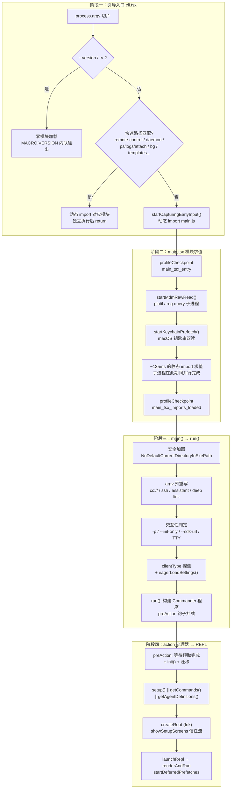

终端 AI 编程助手的启动流程是一个高度工程化的性能战场：用户敲下 `claude` 到看到可交互的 TUI 界面之间的每一毫秒都被精心编排。本文深入剖析启动引导的完整链路——从 `entrypoints/cli.tsx` 的零导入快速路径分发，到 `main.tsx` 模块求值期的三重子进程预取，再到 Commander 参数解析与 action 处理器中 setup()、命令加载、首屏渲染的交错并行。我们还将系统性地解构代码库中层层叠加的启动性能优化策略，包括编译期特性门控、API 预连接、采样式性能分析器等机制。理解这条链路是理解整个应用如何"活着"的第一性原理。

## 启动架构总览：四阶段流水线

整个启动过程可以抽象为四个阶段，每个阶段有明确的职责边界与性能特征。引导入口 `entrypoints/cli.tsx` 负责廉价地识别特殊模式（如 `--version`）并直接短路返回；`main.tsx` 的模块求值期通过顶层副作用提前发射子进程；`main()` 与 `run()` 完成环境判定、argv 预处理与 Commander 程序构建；最终 action 处理器将控制权移交给 Ink 渲染的 REPL。

**前置知识说明**：上图中的 `feature()` 来自 `bun:bundle`，是 Bun 编译器的编译期特性标记——当特性关闭时，相关代码块会在构建阶段被死代码消除（DCE），完全不进入产物。这套机制在[构建体系与特性门控](4-gou-jian-ti-xi-yu-te-xing-men-kong-bun-bian-yi-qi-te-xing-biao-ji-yu-si-dai-ma-xiao-chu)页面有独立详述。

Sources: [cli.tsx](entrypoints/cli.tsx#L33-L48) [main.tsx](main.tsx#L1-L20) [main.tsx](main.tsx#L585-L856)

## 阶段一：引导入口的快速路径分发

`entrypoints/cli.tsx` 是二进制的真正入口，它的设计哲学是**用最小的模块求值成本识别并分发特殊启动模式**。文件顶部先处理三个环境副作用：禁用 corepack 自动固定（防止污染用户 package.json）、在 CCR 容器环境为子进程设置 8GB 堆上限、以及实验基线模式下批量注入禁用环境变量。值得注意的是最后一项被刻意放在入口而非 `init()` 中——因为 BashTool 等模块在 import 时就会捕获这些环境变量到模块级常量，`init()` 执行得太晚了。

快速路径的核心是 `--version`：当参数恰好只有一个 `-v`/`--version`/`-V` 时，直接输出构建期内联的 `MACRO.VERSION` 常量并返回——**零额外模块加载**。这是 CLI 工具最高频的调用之一（脚本探测版本、shell 补全），为其付出全量模块求值成本是浪费。其余快速路径遵循统一模式：`feature()` 门控保证未启用的路径在编译期消失，匹配成功后动态 `import()` 对应模块、执行、`return`：

| 快速路径 | 触发参数 | 特性门控 | 典型延迟来源 |
|---|---|---|---|
| 版本探测 | `--version` / `-v` / `-V`（仅一个参数） | 无 | 零导入，宏内联 |
| 系统提示词转储 | `--dump-system-prompt` | `DUMP_SYSTEM_PROMPT` | prompt 敏感性评估 |
| Chrome MCP 桥 | `--claude-in-chrome-mcp` | 无 | 浏览器扩展通信 |
| 守护进程 worker | `--daemon-worker=<kind>` | `DAEMON` | 监督进程派生 |
| 远程控制 | `remote-control` / `rc` / `remote` / `sync` / `bridge` | `BRIDGE_MODE` | 含 OAuth/策略校验链 |
| 守护进程 | `daemon` | `DAEMON` | 长驻监督进程 |
| 后台会话管理 | `ps` / `logs` / `attach` / `kill` / `--bg` | `BG_SESSIONS` | 会话注册表操作 |
| tmux 工作树 | `--tmux` + `-w`/`--worktree` 组合 | 无 | exec 进入 tmux 前的短路 |
| 模板任务 | `new` / `list` / `reply` | `TEMPLATES` | Ink TUI 需 `process.exit` 清理 |

当没有特殊标志命中时，入口做两件收尾工作：将 `--update`/`--upgrade` 的常见误用重写为 `update` 子命令；若检测到 `--bare` 则提前设置 `CLAUDE_CODE_SIMPLE=1`——这必须发生在模块求值之前，因为特性门控会在求值期读取该变量。最后调用 `startCapturingEarlyInput()` 捕获用户在启动期间就迫不及待敲下的字符，然后动态导入 `main.js` 并调用其导出的 `main()`。

Sources: [cli.tsx](entrypoints/cli.tsx#L1-L48) [cli.tsx](entrypoints/cli.tsx#L53-L106) [cli.tsx](entrypoints/cli.tsx#L108-L303)

## 阶段二：模块求值期的三重副作用——子进程与导入赛跑

`main.tsx` 的头部是整个启动流程中最精妙的部分。文件第一行的注释明确宣告了设计意图：三个副作用**必须先于所有其他 import 执行**，让操作系统级子进程与后续约 135ms 的 JavaScript 模块求值并行赛跑。

**第一重**：`profileCheckpoint('main_tsx_entry')` 在任何重量级模块求值前打下第一个时间标记。**第二重**：`startMdmRawRead()` 发射 MDM（设备管理）配置读取子进程——macOS 上是 `plutil` 解析每个 plist 路径，Windows 上是 `reg query` 查询 HKLM/HKCU 两个注册表键。该模块刻意保持最小导入面（仅 child_process/fs/constants），并用同步 `existsSync` 快速跳过不存在 plist 的普通机器（省去约 5ms 的 plutil spawn 开销）。**第三重**：`startKeychainPrefetch()` 并行发射两个 macOS 钥匙串读取（OAuth 凭据 + 旧版 API key）。注释精确记录了动机：若不预取，`isRemoteManagedSettingsEligible()` 会在 `applySafeConfigEnvironmentVariables()` 中以同步 `execSync` **串行**读取这两个条目，每次 macOS 启动固定损耗约 65ms。

这三重预取的结果在后续 Commander 的 `preAction` 钩子中被 `Promise.all` 一次性收割——由于子进程在模块求值期间就已跑完，这个 await 几乎是免费的。此外，模块头部还用惰性 `require()` 包装了 teammate 相关模块（打破 `teammate.ts → AppState.tsx → ... → main.tsx` 的循环依赖），并用 `feature()` 条件 require 隔离了 COORDINATOR_MODE、KAIROS 等特性的模块加载。模块求值结束时打下 `main_tsx_imports_loaded` 标记，随后还有一个外部构建专属的防护：检测到 Node 调试器（`--inspect`、inspector URL）时直接 `process.exit(1)`。

Sources: [main.tsx](main.tsx#L1-L20) [main.tsx](main.tsx#L68-L81) [main.tsx](main.tsx#L208-L271) [rawRead.ts](utils/settings/mdm/rawRead.ts#L49-L123) [keychainPrefetch.ts](utils/secureStorage/keychainPrefetch.ts#L65-L98)

## 阶段三：main() 主函数——安全加固与 argv 预重写

`main()` 函数（第 585 行起）是进入业务逻辑的门槛。它首先处理三件事：设置 Windows 的 `NoDefaultCurrentDirectoryInExePath` 阻止从当前目录执行命令的 PATH 劫持攻击（必须在任何命令执行前设置）；初始化警告处理器并注册 `exit`/`SIGINT` 处理器（注意 print 模式下 SIGINT 交给 print.ts 自己的处理器以免抢占中止逻辑）；然后进入一段相当长的 **argv 预重写**逻辑。

argv 预重写的目的是让 `cc://` 直连 URL、`--handle-uri` 深度链接、`assistant` 与 `ssh` 子命令等特殊形态改写为**主命令路径**能理解的形状——这样用户得到完整的交互式 TUI 而非裁剪版子命令体验。以 SSH 为例，代码在 Commander 解析之前手工提取 `--local`、`--dangerously-skip-permissions`、`--permission-mode`、`-c`/`--continue`、`--resume`、`--model` 等标志并暂存到模块级 `_pendingSSH` 对象，供约第 3720 行的 REPL 分支消费，随后从 argv 中剥除使主命令处理器正常接管。

接着是决定后续一切走向的**交互性判定**：`isNonInteractive = hasPrintFlag || hasInitOnlyFlag || hasSdkUrl || !process.stdout.isTTY`。这个判定必须发生在 `init()` 之前，因为遥测初始化所调用的认证函数依赖该标志。`initializeEntrypoint()` 随后设置 `CLAUDE_CODE_ENTRYPOINT` 环境变量（区分 `mcp`、`sdk-cli`、`cli` 等来源），一个立即执行的 `clientType` 闭包进一步细分 github-action、各 SDK 语言、VSCode 扩展、桌面端、远程会话等客户端类型写入全局引导状态。

最后是 `eagerLoadSettings()`：它调用 `eagerParseCliFlag()` 从原始 `process.argv` 中提前解析 `--settings`（支持内联 JSON 字符串，写入内容哈希命名的临时文件以保住 API 提示词缓存）与 `--setting-sources` 两个标志。这些必须在 `init()` 前生效，因为它们影响配置加载的过滤行为。完成后 `main()` 调用 `run()` 交接给 Commander 世界。

Sources: [main.tsx](main.tsx#L585-L607) [main.tsx](main.tsx#L609-L700) [main.tsx](main.tsx#L702-L794) [main.tsx](main.tsx#L797-L856) [main.tsx](main.tsx#L432-L516) [cliArgs.ts](utils/cliArgs.ts#L13-L29) [bootstrap/state.ts](bootstrap/state.ts#L45-L80)

## 阶段四：run() 与 Commander 程序构建

`run()`（第 884 行起）构建 Commander 程序。程序实例配置了按长选项名排序的帮助系统与 `enablePositionalOptions()`，而最关键的结构是 **`preAction` 钩子**——它保证初始化只在"真正执行命令"时运行一次，显示帮助时则完全跳过，从而避免了环境变量信令的老方案。钩子内部的执行序列为：

1. `await Promise.all([ensureMdmSettingsLoaded(), ensureKeychainPrefetchCompleted()])` —— 收割模块求值期发射的子进程（注释明确指出此时几乎免费）；
2. `await init()` —— 核心初始化管线（下节详述）；
3. 设置 `process.title = 'claude'`（在 init 之后，让 settings.json 的环境变量也能门控此行为）；
4. 动态导入并调用 `initSinks()` —— PR #11106 之后 logEvent 事件会排队直到 sink 挂载，子命令（doctor、mcp、plugin、auth）从不调用 setup()，必须在此统一挂载以防事件静默丢失；
5. 透传 `--plugin-dir` 选项给 `setInlinePlugins()`（修复 gh-33508：该顶层选项对子命令不可见的问题）；
6. `runMigrations()` —— 版本号门控的配置迁移集合（`CURRENT_MIGRATION_VERSION = 11`，涵盖模型字符串迁移、自动更新设置迁移等 11 项）；
7. 非阻塞地启动 `loadRemoteManagedSettings()` 与 `loadPolicyLimits()`（fail-open 语义，失败则继续无远程设置运行）。

主命令通过一个巨大的链式 `.option()` 调用注册了数百个 CLI 选项，并在 `.action()` 中挂载约 2800 行的处理器（第 1006 行起），链尾以 `.version(MACRO.VERSION, '-v, --version')` 收束。随后是大量子命令注册：`mcp`（serve/add/remove/list 等）、`server`、`auth`（login/status/logout）、`plugin` 与 `marketplace`、`doctor`、`update`、`agents`、ant 专属的 `rollback`/`log`/`error` 等。

**Print 模式的注册跳过优化**是此处的一个经典性能手段（第 3875-3890 行）：`-p/--print` 模式下 52 个子命令（mcp、auth、plugin、task、config……）永远不会被分发——Commander 会把 prompt 路由给默认 action。注释记录了实测数据：子命令注册路径约 **65ms**，主要消耗在 `isBridgeEnabled()` 调用（25ms 设置 Zod 解析 + 40ms 同步钥匙串子进程，两者都被 try/catch 包裹并在 `enableConfigs()` 前恒返回 false）。因此 print 模式直接跳到 `parseAsync`，交互模式才注册全部子命令。最终 `program.parseAsync(process.argv)`（第 4504 行）触发解析、preAction 钩子与 action 处理器。

Sources: [main.tsx](main.tsx#L884-L967) [main.tsx](main.tsx#L323-L352) [main.tsx](main.tsx#L968-L1006) [main.tsx](main.tsx#L3875-L3890) [main.tsx](main.tsx#L4504-L4504)

## init()：核心初始化管线

`init()` 位于 `entrypoints/init.ts`，用 `memoize` 包装确保单次执行。它的执行序列体现了"**先安全配置、再网络预热、后台任务全部异步化**"的原则：

| 步骤 | 操作 | 性能语义 |
|---|---|---|
| 1 | `enableConfigs()` | 校验配置并解锁配置系统（此前所有配置读取被禁止） |
| 2 | `applySafeConfigEnvironmentVariables()` | 仅应用安全环境变量——完整应用要等信任对话框通过 |
| 3 | `applyExtraCACertsFromConfig()` | 必须在首次 TLS 握手前：Bun 启动时经 BoringSSL 缓存证书存储 |
| 4 | `setupGracefulShutdown()` | 注册退出时的刷新机制 |
| 5 | 1P 事件日志 + GrowthBook 异步初始化 | `void Promise.all([...]).then(...)`，不阻塞 |
| 6 | OAuth 账户信息填充、JetBrains 检测、GitHub 仓库探测 | 全部 `void` fire-and-forget，填充缓存供后续同步读取 |
| 7 | 远程托管设置/策略限额的加载 Promise 初始化 | 带超时防死锁，供插件钩子 await |
| 8 | `recordFirstStartTime()` + `configureGlobalMTLS()` + `configureGlobalAgents()` | 网络传输层定型 |
| 9 | **`preconnectAnthropicApi()`** | API 预连接（下详） |
| 10 | CCR 上游代理（`CLAUDE_CODE_REMOTE`）惰性导入初始化 | 非 CCR 启动零模块加载成本 |
| 11 | `setShellIfWindows()`、LSP 清理注册、团队清理注册、scratchpad 目录 | 收尾 |

**API 预连接**是网络层最值得注意的优化：`preconnectAnthropicApi()` 发射一个 fire-and-forget 的 `HEAD` 请求（10 秒超时，失败静默），让约 100-200ms 的 TCP+TLS 握手与 action 处理器的工作重叠。Bun 的 fetch 全局共享 keep-alive 连接池，真正的 API 请求会复用这条已预热的连接。调用位置经过精心校准——必须在 `applyExtraCACertsFromConfig()` 与 `configureGlobalAgents()` **之后**（否则会用错证书存储或错误传输层预热错误的连接池），且在配置了代理/mTLS/Unix socket/云供应商时全部跳过（SDK 的自定义 dispatcher 不会共享全局池）。遥测则被刻意延迟到信任建立之后（`initializeTelemetryAfterTrust`），其中约 400KB 的 OpenTelemetry 模块通过动态 import 推迟到真正初始化时才加载。

Sources: [init.ts](entrypoints/init.ts#L57-L151) [init.ts](entrypoints/init.ts#L153-L214) [init.ts](entrypoints/init.ts#L240-L341) [apiPreconnect.ts](utils/apiPreconnect.ts#L1-L71)

## action 处理器：交错并行与首屏渲染

主命令的 `.action()` 处理器是启动的最后冲刺。进入处理器后先处理 `--bare` 模式（设置 `CLAUDE_CODE_SIMPLE`，让所有既有门控生效）、忽略字面量 `code` 提示词等边界情况，然后解构出 debug、permissionMode、tools、mcpConfig 等数十个选项。真正的性能编排从 `setup()` 调用点开始（约第 1903-1936 行）：

**setup() 与命令/代理加载的三路并行**。`setup()` 的约 28ms 主要花在 UDS 消息服务器的 socket 绑定（约 20ms）上，是 I/O 绑定而非磁盘绑定，因此可以与 `getCommands()`、`getAgentDefinitionsWithOverrides()` 的文件读取安全并行。该并行有一个精巧的前置条件：在并行启动前先同步调用 `initBuiltinPlugins()` 与 `initBundledSkills()`——它们是纯内存数组压入（<1ms、零 I/O），若放在 setup() 内部的 await 之后执行，并行的 getCommands 会在空列表上完成记忆化。而当 `--worktree` 启用时会关闭并行，因为 setup() 可能 `process.chdir()` 到工作树路径，命令/代理加载需要 chdir 后的 cwd。

**非交互模式的早期预热**：print 模式下在 setup 完成后立即 kick `getSystemContext()`（git status/log/branch 子进程）、`getUserContext()`（CLAUDE.md 目录遍历）、`ensureModelStringsInitialized()`（Bedrock 下触发 100-200ms 的 profile 拉取）——让它们在约 280ms 的重叠窗口内跑完，print.ts 的后续 await 全部命中记忆化缓存。

**交互模式的首屏序列**（约第 2211-2330 行）：通过 `getRenderContext(false)` 获取渲染上下文（内含 FpsTracker 与 StatsStore，并为基准测试模式挂载逐帧 JSONL 计时）；动态导入 `createRoot` 建立 Ink 根节点；**在任何阻塞对话框渲染之前**记录 `tengu_timer startup` 遥测事件——旧实现从 REPL 首帧记录，p99 高达约 70 秒且被用户停留在信任/登录对话框的时间主导，无法反映代码路径本身的启动性能；然后进入 `showSetupScreens()` 信任流。信任流的核心顺序约束：信任对话框（已信任时走零导入快速路径）→ `setSessionTrustAccepted` → 重置并重新初始化 GrowthBook（获得认证头）→ 完整应用配置环境变量（含不可信来源的危险变量如 LD_PRELOAD，故必须后置）→ `setImmediate(initializeTelemetryAfterTrust)` → API key 确认、bypassPermissions 警告、自动模式 opt-in 等一系列条件对话框。LSP 管理器的初始化被刻意推迟到信任建立之后——防止插件 LSP 服务器在用户同意前于不受信目录执行代码。

处理器末尾，`launchRepl()` 动态导入 `App` 与 `REPL` 组件，调用 `renderAndRun(root, <App><REPL/></App>)` 完成交接。`renderAndRun` 的三步曲是：`root.render(element)` 触发首帧 → `startDeferredPrefetches()` 启动首帧后的延迟预取 → `await root.waitUntilExit()` 阻塞直至会话结束并优雅关机。SessionStart 钩子的 Promise 也被**未解析地**传入 REPL——避免为等待钩子完成阻塞约 500ms，REPL 先渲染、钩子消息解析后再注入，仅保证首次 API 调用前模型能看到钩子上下文。

Sources: [main.tsx](main.tsx#L1006-L1130) [main.tsx](main.tsx#L1855-L2054) [main.tsx](main.tsx#L2211-L2330) [main.tsx](main.tsx#L3707-L3807) [replLauncher.tsx](replLauncher.tsx#L12-L22) [interactiveHelpers.tsx](interactiveHelpers.tsx#L98-L103) [interactiveHelpers.tsx](interactiveHelpers.tsx#L104-L297)

## 启动性能优化策略全景

代码库的启动优化不是零散的技巧堆砌，而是一套分层体系。从编译期到运行期，每一层的优化对象和生效时机都不同：

| 层级 | 优化机制 | 生效时机 | 代表性收益（代码注释实测） |
|---|---|---|---|
| 编译期 | `feature()` 特性门控 + 死代码消除 | 构建产物生成时 | 未启用特性的模块完全缺席 |
| 编译期 | `MACRO.VERSION` 宏内联 | 构建时 | `--version` 零模块加载 |
| 入口分发 | 快速路径 + 动态 import | 进程启动 | 特殊命令跳过全量 CLI |
| 子进程并行 | MDM/钥匙串预取先于 import | 模块求值期 | 省去 macOS 串行钥匙串读约 65ms |
| 网络层 | API 预连接（HEAD + keep-alive 池） | init() 内 | TCP+TLS 握手 100-200ms 与处理器重叠 |
| 执行流 | setup() ∥ 命令 ∥ 代理三路并行 | action 处理器 | 约 28ms 重叠；-p 模式再叠约 280ms 预热窗口 |
| 执行流 | print 模式跳过 52 个子命令注册 | run() 内 | 实测约 65ms |
| 延迟加载 | OpenTelemetry(~400KB)/gRPC(~700KB)/teammate 惰性 require | 首次使用时 | 启动路径零成本 |
| 首帧后 | `startDeferredPrefetches()` | REPL 首帧后 | 隐藏在"用户打字窗口"内 |
| 交互体验 | 早期输入捕获 | 启动全程 | 启动期间敲的字符不丢失 |

其中**首帧后延迟预取**值得展开：`startDeferredPrefetches()` 在 REPL 完成首次渲染后启动一批"首轮响应性"的缓存预热——`initUser()`、`getUserContext()`、系统上下文（仅在信任已建立或非交互模式下运行，因为 git 命令可通过 hooks 执行任意代码）、提示词建议、Bedrock/Vertex 凭据、ripgrep 文件计数、分析门控、官方 MCP URL、模型能力刷新、设置与技能变更检测器。这些工作在交互模式下被用户的"打字窗口"天然隐藏；而在 `--bare`/`CLAUDE_CODE_EXIT_AFTER_FIRST_RENDER` 模式下全部跳过——脚本化调用没有打字窗口，这些纯属关键路径上的纯开销。

**早期输入捕获**是交互体验的守护者：`startCapturingEarlyInput()` 在 cli.tsx 动态导入 main.js 之前就把 stdin 设为 raw 模式并挂 readable 监听器。用户执行 `claude` 后立刻开始打字的每一个字符都会被缓冲（正确处理退格按字素簇删除、跳过转义序列、Ctrl+C 直接以退出码 130 退出——此时优雅关机机制尚未初始化），REPL 就绪时通过 `consumeEarlyInput()` 一次性取回。`--prefill` 选项的注入点也在这里（`seedEarlyInput`）。

Sources: [main.tsx](main.tsx#L354-L431) [main.tsx](main.tsx#L3875-L3890) [apiPreconnect.ts](utils/apiPreconnect.ts#L1-L24) [earlyInput.ts](utils/earlyInput.ts#L29-L67) [earlyInput.ts](utils/earlyInput.ts#L72-L136) [init.ts](entrypoints/init.ts#L44-L46)

## 可观测性：启动性能分析器

任何优化都依赖测量。`utils/startupProfiler.ts` 提供双模式性能分析：**采样遥测**（100% 内部用户 + 0.5% 外部用户采样率，将各阶段耗时上报 Statsig）与**详细模式**（`CLAUDE_CODE_PROFILE_STARTUP=1` 环境变量开启，输出含内存快照的完整报告）。采样决策在模块加载时一次性做出——未被采样的用户不付出任何分析成本，`profileCheckpoint()` 对他们是空函数。

检查点系统基于 Node.js 原生 `perf_hooks` 的 `performance.mark()`，内存快照按数组顺序与 mark 一一对应（刻意不用 Map——某些检查点如 `loadSettingsFromDisk_start` 会触发多次，Map 会覆盖首次的快照）。Statsig 上报的阶段定义为：`import_time`（cli_entry → main_tsx_imports_loaded，即模块求值耗时）、`init_time`（init 函数耗时）、`settings_time`（eagerLoadSettings 耗时）、`total_time`（cli_entry → main_after_run 全程）。详细报告写入 `~/.claude/startup-perf/<sessionId>.txt`，每行格式为 `[+总耗时ms] (+增量ms) 检查点名 [| RSS/Heap]`，由 `profilerBase.ts` 共享给启动/查询/无头三个分析器使用。

全链路检查点的命名本身就构成了一份启动时序文档：`cli_entry` → `cli_before_main_import` → `main_tsx_entry` → `main_tsx_imports_loaded` → `main_function_start` → `main_client_type_determined` → `run_function_start` → `preAction_start` → `preAction_after_mdm` → `preAction_after_init` → `action_handler_start` → `action_after_input_prompt` → `action_tools_loaded` → `action_before_setup` → `action_after_setup` → `action_commands_loaded` → `action_mcp_configs_loaded` → `action_after_plugins_init` → `action_after_hooks` → `run_after_parse`。渲染上下文层面，`getRenderContext()` 还为每帧挂载了 FPS 追踪与闪烁检测（跳过支持同步输出的终端——DEC 2026 缓冲使清屏重绘原子化），基准测试模式可通过 `CLAUDE_CODE_FRAME_TIMING_LOG` 逐帧输出渲染管线各阶段（yoga → 屏幕缓冲 → diff → 优化 → stdout）的 JSONL 计时。

Sources: [startupProfiler.ts](utils/startupProfiler.ts#L24-L60) [startupProfiler.ts](utils/startupProfiler.ts#L48-L54) [startupProfiler.ts](utils/startupProfiler.ts#L65-L153) [profilerBase.ts](utils/profilerBase.ts#L14-L46) [interactiveHelpers.tsx](interactiveHelpers.tsx#L299-L365)

## 关键设计决策剖析

从代码考古的视角，启动流程中有几个值得中级开发者反复品味的设计权衡。**副作用先于 import** 反直觉但正确：ES 模块的求值顺序由 import 图决定，把子进程发射放在文件顶部、其它 import 之前，才能保证 spawn 发生在事件循环被约 135ms 的模块求值占据之前——`rawRead.ts` 的注释明确维护着这个不变量（"execFilePromise must be the first await"）。**信任边界即执行边界**：LSP 服务器、完整环境变量、git 上下文预取、遥测初始化全部被信任对话框闸门隔开，因为 `.claude/settings.json` 与 git hooks 在不受信的克隆仓库中是攻击面。**记忆化即并行化的粘合剂**：`init()`、`getCommands()`、`getSystemContext()` 全部 memoize，使得"提前 kick、稍后 await"的模式成为可能——第二次 await 命中缓存，重叠窗口内的重复调用零成本。

另一个隐蔽而优雅的细节是 `--settings` 内联 JSON 的**内容哈希临时文件命名**：设置路径最终会进入 Bash 工具的沙箱 denyWithin 列表，而该列表是发送给 API 的工具描述的一部分。若用随机 UUID 命名，每次 SDK query() 派生的新进程都会改变工具描述、击穿 API 提示词缓存前缀，造成 12 倍输入 token 成本惩罚；内容哈希保证相同设置跨进程产生相同路径。这提醒我们：**启动参数的副作用可能延伸到网络请求成本**。

Sources: [rawRead.ts](utils/settings/mdm/rawRead.ts#L60-L68) [main.tsx](main.tsx#L2317-L2321) [main.tsx](main.tsx#L432-L457)

## 总结与延伸阅读

启动引导流程的完整叙事至此闭环：**cli.tsx 以零成本分发快速路径 → main.tsx 模块求值期让子进程与 import 赛跑 → main()/run() 完成安全加固与 Commander 构建（print 模式跳过子命令注册）→ preAction 收割预取并运行 init()（含 API 预连接）→ action 处理器三路并行 setup/命令/代理 → 交互模式经信任流后 createRoot → launchRepl 动态加载 App/REPL → renderAndRun 首帧后启动延迟预取**。每一环都同时服务于正确性（信任边界、安全加固）与性能（并行、预取、DCE、延迟加载）两条主线。

理解这条链路后，建议按以下顺序继续深入：

- **[构建体系与特性门控：Bun 编译期特性标记与死代码消除](4-gou-jian-ti-xi-yu-te-xing-men-kong-bun-bian-yi-qi-te-xing-biao-ji-yu-si-dai-ma-xiao-chu)** — 本文反复出现的 `feature()` 门控与 `MACRO.VERSION` 宏在此系统展开
- **[查询引擎 QueryEngine：会话编排、消息流转与状态管理](6-cha-xun-yin-qing-queryengine-hui-hua-bian-pai-xiao-xi-liu-zhuan-yu-zhuang-tai-guan-li)** — 启动流程交接的 REPL 内部，单轮查询如何被编排
- **[Ink 渲染引擎（自研分支）：React Reconciler、Yoga 布局与终端转义序列解析](15-ink-xuan-ran-ying-qi-zi-yan-fen-zhi-react-reconciler-yoga-bu-ju-yu-zhong-duan-zhuan-yi-xu-lie-jie-xi)** — `createRoot`/`renderAndRun` 之下的自研渲染栈
- **[斜杠命令体系：命令注册、参数解析与本地 JSX 命令模式](14-xie-gang-ming-ling-ti-xi-ming-ling-zhu-ce-can-shu-jie-xi-yu-ben-di-jsx-ming-ling-mo-shi)** — setup 阶段加载的 `getCommands()` 的注册体系
- **[应用状态管理：AppState Store、Selectors 与 React Context](17-ying-yong-zhuang-tai-guan-li-appstate-store-selectors-yu-react-context)** — `bootstrap/state.ts` 全局状态在 React 侧的延伸
- **[配置与可观测性：设置体系、托管策略、数据迁移与遥测分析](30-pei-zhi-yu-ke-guan-ce-xing-she-zhi-ti-xi-tuo-guan-ce-lue-shu-ju-qian-yi-yu-yao-ce-fen-xi)** — init() 中加载的设置层级、远程托管设置与迁移集合的全景