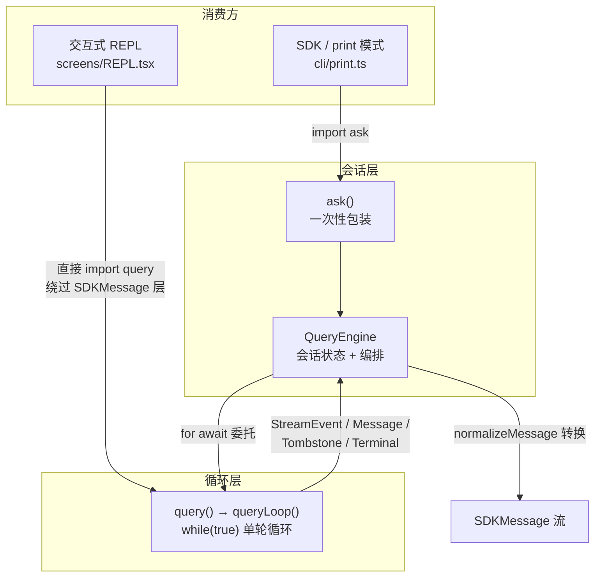
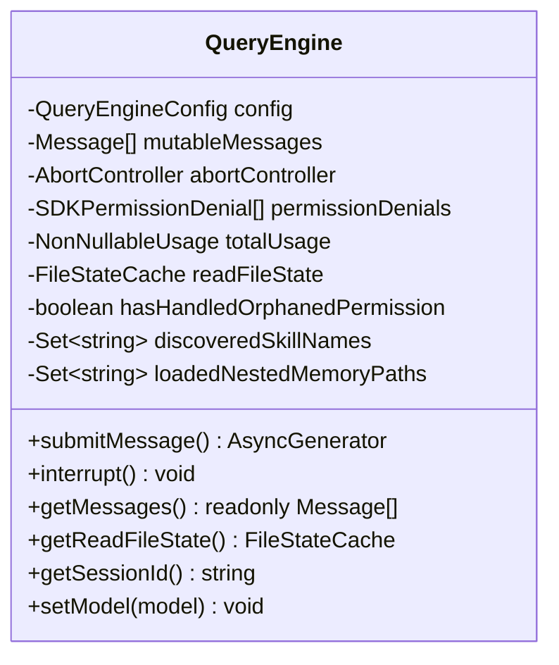
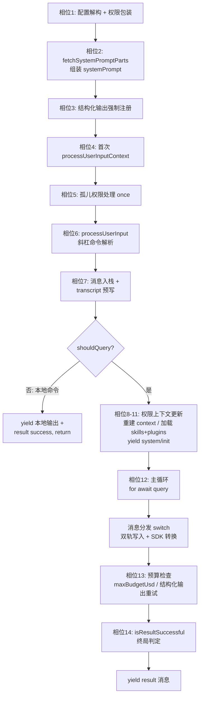

QueryEngine 是会话层（conversation-scoped）的核心协调器：它将一次完整的对话生命周期——用户输入解析、系统提示词组装、消息持久化、底层查询循环驱动、SDK 协议消息产出、用量统计与终局判定——封装为一个可跨回合（turn）复用的有状态对象。本文从架构分层入手，逐层拆解 `QueryEngine.ts`（1296 行）的编排流水线、消息双轨流转机制与状态管理设计，并界定其与底层 `query()` 单轮循环的委托边界。

## 架构定位：会话层与循环层的双层分离

代码库的查询体系呈现清晰的两层切分：**QueryEngine 拥有会话状态与 SDK 协议边界**，**query() 拥有单轮内的 API 调用循环**。类文档注释明确表述了这一设计意图——QueryEngine "owns the query lifecycle and session state for a conversation"，从 `ask()` 中提取核心逻辑成为独立类，供 headless/SDK 路径使用，并规划未来供 REPL 复用；关键约束是"One QueryEngine per conversation. Each submitMessage() call starts a new turn within the same conversation"，即消息数组、文件缓存、用量等状态跨回合持久。QueryEngine 在主循环中通过 `for await (const message of query({...}))` 将单轮执行整体委托给 `query()` 生成器，仅在收到消息后做协议转换与持久化。

这一分层带来两条已验证的消费路径：`cli/print.ts` 通过 `import { ask } from 'src/QueryEngine.js'` 走完整的 QueryEngine → SDKMessage 管线；而 `screens/REPL.tsx` 直接 `import { query } from '../query.js'` 并以 `for await (const event of query({...}))` 消费原始事件，完全绕开 QueryEngine 的 SDKMessage 转换层——REPL Remote Control 场景下的 `system/init` 消息由 `useReplBridge` 通过 `writeSdkMessages()` 单独发送，正因"REPL uses query() directly and never hits the QueryEngine SDKMessage layer"。

Sources: [QueryEngine.ts](QueryEngine.ts#L175-L207)
Sources: [QueryEngine.ts](QueryEngine.ts#L675-L686)
Sources: [print.ts](cli/print.ts#L91)
Sources: [REPL.tsx](screens/REPL.tsx#L2793-L2803)
Sources: [systemInit.ts](utils/messages/systemInit.ts#L41-L52)

## QueryEngineConfig：注入式配置契约

构造函数接收的 `QueryEngineConfig` 是一个"重依赖注入"对象——引擎本体不自行创建工具表、命令表或状态访问器，全部由调用方装配。配置项可分为四类：

| 类别 | 字段 | 职责 |
|---|---|---|
| **执行环境** | `cwd`、`tools`、`commands`、`mcpClients`、`agents` | 工作目录、工具注册表、斜杠命令、MCP 连接、子代理定义 |
| **状态访问** | `getAppState` / `setAppState`、`readFileCache`、`initialMessages` | 对 AppState Store 的读写闭包、文件状态缓存、恢复会话时的初始消息 |
| **模型与预算** | `userSpecifiedModel`、`fallbackModel`、`thinkingConfig`、`maxTurns`、`maxBudgetUsd`、`taskBudget`、`jsonSchema` | 模型选择与降级、思考模式、回合/美元/Token 三重预算、结构化输出 Schema |
| **协议与回调** | `canUseTool`、`handleElicitation`、`setSDKStatus`、`abortController`、`orphanedPermission`、`replayUserMessages`、`includePartialMessages`、`snipReplay` | 权限决策、MCP URL elicitation、SDK 状态上报、中断控制、孤儿权限恢复、回放与流式透传开关 |

其中 `snipReplay` 是一个值得注意的特征门控（feature-gated）回调设计：它接收 query 循环产出的每条 system 消息与可变消息存储，若判定为 snip 边界则返回重放结果。注释说明该回调由 `ask()` 在 `HISTORY_SNIP` 启用时注入，目的是"keeps QueryEngine free of excluded strings and testable despite feature() returning false under bun test"——即把门控字符串隔离在被排除的模块内，QueryEngine 本体保持零特性耦合。SDK 模式下 QueryEngine 在此处截断历史以约束长会话内存，而 REPL 保留完整历史仅在渲染时投影（`projectSnippedView`）。

Sources: [QueryEngine.ts](QueryEngine.ts#L130-L173)
Sources: [QueryEngine.ts](QueryEngine.ts#L158-L172)

## 实例状态：跨回合持久的六项私有字段

QueryEngine 的状态管理极度克制——仅六个私有字段承载全部跨回合状态，构造函数分别初始化：

各字段的语义边界值得逐一辨析：`mutableMessages` 是会话真相源（source of truth），初始值取 `config.initialMessages ?? []`，供恢复场景注入历史；`permissionDenials` 由包装后的 `canUseTool` 在每次决策结果 `behavior !== 'allow'` 时追加，最终随 result 消息上报给 SDK 调用方；`totalUsage` 从 `EMPTY_USAGE` 起步，仅在 `message_stop` 流事件时累积；`discoveredSkillNames` 与 `loadedNestedMemoryPaths` 是回合作用域集合，`submitMessage` 入口处 `clear()` 前者——注释明确指出这必须"persist across the two processUserInputContext rebuilds inside submitMessage, but is cleared at the start of each submitMessage to avoid unbounded growth"。公开 API 则极简：`interrupt()` 触发 abortController、`getMessages()` 暴露只读视图、`setModel()` 运行时改写配置中的模型字段。

Sources: [QueryEngine.ts](QueryEngine.ts#L184-L207)
Sources: [QueryEngine.ts](QueryEngine.ts#L243-L271)
Sources: [QueryEngine.ts](QueryEngine.ts#L1158-L1176)

## submitMessage 编排流水线：一次回合的完整相位

`submitMessage` 是一个返回 `AsyncGenerator<SDKMessage>` 的异步生成器，其 900 余行构成一条线性编排流水线。将其划分为可辨识的相位后，架构脉络如下：

### 相位 1–2：权限包装与系统提示词组装

流水线以 `setCwd(cwd)` 与 `persistSession` 判定开场，随后构造 `wrappedCanUseTool`——一个透明代理，先透传原始 `canUseTool` 的全部参数并等待结果，再依据 `behavior` 字段追加拒绝记录后原样返回。系统提示词组装调用 `fetchSystemPromptParts` 获取默认提示词、userContext 与 systemContext 三元组，叠加 COORDINATOR_MODE 特性门控注入的协调者上下文（`getCoordinatorUserContext` 在特性关闭时退化为返回空对象的恒等函数）；当 SDK 调用方同时提供 `customSystemPrompt` 且设置了 `CLAUDE_COWORK_MEMORY_PATH_OVERRIDE` 环境变量时，额外注入记忆机制提示词（`loadMemoryPrompt`），最终经 `asSystemPrompt` 合成 `[customPrompt | defaultSystemPrompt, memoryMechanicsPrompt?, appendSystemPrompt?]` 的有序数组。

Sources: [QueryEngine.ts](QueryEngine.ts#L238-L271)
Sources: [QueryEngine.ts](QueryEngine.ts#L273-L325)
Sources: [QueryEngine.ts](QueryEngine.ts#L110-L128)

### 相位 3–7：双次 context 构建与消息预持久化

结构化输出场景下，若工具表含 SyntheticOutput 工具且配置了 `jsonSchema`，引擎调用 `registerStructuredOutputEnforcement` 注册函数钩子。随后构建**第一次** `processUserInputContext`——其 `setMessages` 回调实现为 `this.mutableMessages = fn(this.mutableMessages)`，注释解释了原因：会变更消息数组的斜杠命令（如 `/force-snip`）在交互模式写回 AppState，而 print 模式写回 mutableMessages，"so the rest of the query loop (push at :389, snapshot at :392) sees the result"。孤儿权限处理被 `hasHandledOrphanedPermission` 布尔门控为引擎生命周期内仅执行一次。

`processUserInput` 以 `mode: 'prompt'`、`querySource: 'sdk'` 解析输入，产出 `messagesFromUserInput`、`shouldQuery`、`allowedTools`、`model`、`resultText`。新消息推入 mutableMessages 后立即快照为 `messages = [...this.mutableMessages]`。**transcript 预写**是此段最关键的工程决策：在进入查询循环前持久化用户消息，因为循环内的 `recordTranscript` 仅在 API 响应到达后才触发——若进程在响应前被杀（注释列举了用户在 cowork 中点击 Stop 的场景），transcript 只剩队列操作记录，`getLastSessionLog` 过滤后返回 null，`--resume` 将以 "No conversation found" 失败。预写使会话可从"用户消息被接受"的时刻恢复。性能权衡同样明确：`--bare`/SIMPLE 模式下改为 fire-and-forget，注释量化了代价"the await is ~4ms on SSD, ~30ms under disk contention"。

Sources: [QueryEngine.ts](QueryEngine.ts#L327-L395)
Sources: [QueryEngine.ts](QueryEngine.ts#L397-L431)
Sources: [QueryEngine.ts](QueryEngine.ts#L433-L463)

### 相位 8–11：上下文重建与非查询分支

用户输入处理可能更新权限规则与模型（斜杠命令副作用），因此引擎通过 `setAppState` 将 `allowedTools` 写入 `toolPermissionContext.alwaysAllowRules.command`，确定 `mainLoopModel = modelFromUserInput ?? initialMainLoopModel` 后**第二次**重建 `processUserInputContext`——此后 `setMessages` 退化为 no-op，因不再有调用方。skills 与插件以 `Promise.all` 并行加载，插件走 `loadAllPluginsCacheOnly()` 缓存独占路径——注释强调"headless/SDK/CCR startup must not block on network for ref-tracked plugins"。最后 `yield buildSystemInitMessage({...})` 产出本回合首条 SDK 消息，并打点 `headlessProfilerCheckpoint('system_message_yielded')`。

当 `shouldQuery === false`（纯本地斜杠命令），引擎进入旁路分支：遍历 `messagesFromUserInput`，将含 `<local-command-stdout>` 标签的用户消息包装为 `SDKUserMessageReplay`（`isReplay: !msg.isCompactSummary`），将 `subtype === 'local_command'` 的 system 消息经 `localCommandOutputToSDKAssistantMessage` 转为合成 assistant 消息——注释说明这是为了让移动端与 session-ingress 可解析，随后持久化 transcript 并 yield 一条 `subtype: 'success'` 的 result 消息后 return。

Sources: [QueryEngine.ts](QueryEngine.ts#L476-L527)
Sources: [QueryEngine.ts](QueryEngine.ts#L529-L554)
Sources: [QueryEngine.ts](QueryEngine.ts#L556-L639)

## 消息流转：内部 Message 与 SDKMessage 的双轨分发

主循环以 `for await (const message of query({ messages, systemPrompt, userContext, systemContext, canUseTool: wrappedCanUseTool, toolUseContext: processUserInputContext, ... }))` 驱动，循环体内以 `switch (message.type)` 完成三重职责：**持久化写入**、**内部状态更新**（mutableMessages / totalUsage / lastStopReason）、**SDK 协议转换产出**。各消息类型的处置差异构成一张精细的分发表：

| message.type | mutableMessages | transcript 持久化 | SDK 产出 |
|---|---|---|---|
| `tombstone` | 跳过 | 跳过 | 无（控制信号） |
| `assistant` | push | fire-and-forget `void recordTranscript` | `yield* normalizeMessage` |
| `progress` | push | 内联 `void recordTranscript`（messages 同步 push） | `yield* normalizeMessage`（agent/skill progress 展开） |
| `user` | push | `await recordTranscript` | `yield* normalizeMessage` |
| `stream_event` | 不入栈 | 不持久化 | 仅 `includePartialMessages` 时透传 |
| `attachment` | push | 内联 `void recordTranscript` | 结构化输出捕获 / max_turns 提前返回 / queued_command 回放 |
| `stream_request_start` | 跳过 | 跳过 | 无 |
| `system` | push（snip 重放时整体替换） | compact_boundary 走记录分支 | compact_boundary / api_retry 转换 |
| `tool_use_summary` | 不入栈 | 不持久化 | 直接映射为 SDK `tool_use_summary` |

两处持久化时序选择各有深意。**assistant 消息的 fire-and-forget**：`claude.ts` 流式产出时每 content block 生成一条 assistant 消息、随后在 `message_delta` 上原地修改最后一条的 `usage`/`stop_reason`，依赖写队列 100ms 的惰性 `jsonStringify`——若此处 await，会阻塞生成器消费，注释推演了后果："the drain timer (started at block 1) elapses first"，且写队列保序所以 fire-and-forget 安全。**progress/attachment 的内联记录**：若延迟记录，deferred progress 会与已记录的 tool_results 在 mutableMessages 中交错，下一次 `ask()` 的去重遍历会把 `startingParentUuid` 冻结在错误消息上——"forking the chain and orphaning the conversation on resume"。

Sources: [QueryEngine.ts](QueryEngine.ts#L687-L751)
Sources: [QueryEngine.ts](QueryEngine.ts#L757-L969)
Sources: [QueryEngine.ts](QueryEngine.ts#L717-L731)
Sources: [QueryEngine.ts](QueryEngine.ts#L771-L782)

### normalizeMessage：协议转换的节流与合成标记

`yield* normalizeMessage(message)` 是内部消息到 SDKMessage 的统一出口（`utils/queryHelpers.ts`）。assistant 分支经 `normalizeMessages` 归一并以 `isNotEmptyMessage` 滤除空消息；progress 分支仅展开 `agent_progress` / `skill_progress` 两类嵌套消息并以 `parentToolUseID` 填充 `parent_tool_use_id`，而 `bash_progress` / `powershell_progress` 仅在 Remote/容器环境（`CLAUDE_CODE_REMOTE` 或 `CLAUDE_CODE_CONTAINER_ID`）下以 30 秒节流（`TOOL_PROGRESS_THROTTLE_MS`）输出 `tool_progress`——节流表以 `parentToolUseID` 为键做 LRU 淘汰，容量上限 100 条（`MAX_TOOL_PROGRESS_TRACKING_ENTRIES`）。user 分支为每条消息标注 `isSynthetic: _.isMeta || _.isVisibleInTranscriptOnly` 与 `tool_use_result`（含 mcpMeta 合并）。

Sources: [queryHelpers.ts](utils/queryHelpers.ts#L96-L222)

### stream_event 相位：用量三段累积与 stop_reason 追踪

stream_event 不进入消息数组，但驱动两项会话状态。用量追踪呈三段式：`message_start` 重置 `currentMessageUsage = EMPTY_USAGE` 并吸收事件内 usage；`message_delta` 持续 `updateUsage` 累积；`message_stop` 时 `this.totalUsage = accumulateUsage(this.totalUsage, currentMessageUsage)` 完成回合内汇总。stop_reason 的捕获路径有两条——合成 assistant 消息可能在产出时即携带 stop_reason（在 `case 'assistant'` 分支捕获），而流式响应在 `content_block_stop` 时为 null，真实值仅在 `message_delta` 到达——注释直指缺陷后果："Without this, result.stop_reason is always null"。

Sources: [QueryEngine.ts](QueryEngine.ts#L788-L828)
Sources: [QueryEngine.ts](QueryEngine.ts#L761-L770)

## 压缩边界处理：持久化冲刷与内存回收

`system` 分支中最复杂的路径是 compact_boundary。写入前有一段**尾部冲刷**逻辑：压缩边界的 `compactMetadata.preservedSegment.tailUuid` 指向保留段末尾，引擎在 mutableMessages 中 `findLastIndex` 定位该消息并 `await recordTranscript(this.mutableMessages.slice(0, tailIdx + 1))`——注释解释了为何必要：若 SDK 子进程在边界写入前重启（claude-desktop 在回合间杀进程），tailUuid 将指向从未落盘的消息，`applyPreservedSegmentRelinks` 的 tail→head 链校验失败、放弃裁剪，resume 便会加载全部压缩前历史。

产出 SDK 边界消息后执行**内存回收**：将 mutableMessages 与局部 `messages` 各自 splice 至仅剩边界消息本身（"Release pre-compaction messages for GC"），因为 `query.ts` 内部已通过 `getMessagesAfterCompactBoundary()` 消费，后续仅需边界后消息。api_error 子类型则转换为 `subtype: 'api_retry'` 的 SDK 消息，携带 `retryAttempt`、`maxRetries`、`retryInMs` 与经 `categorizeRetryableAPIError` 分类的错误。snip 边界经注入的 `snipReplay` 回调判定——若 `executed` 为真，引擎以 `this.mutableMessages.length = 0; this.mutableMessages.push(...snipResult.messages)` 整体替换存储，注释点明不重放的后果是"markers persist and re-trigger on every turn, and mutableMessages never shrinks (memory leak in long SDK sessions)"。

Sources: [QueryEngine.ts](QueryEngine.ts#L693-L715)
Sources: [QueryEngine.ts](QueryEngine.ts#L897-L958)

## 循环内熔断：预算与结构化输出重试

循环体末尾挂载两道熔断检查，命中即 yield 对应 error result 并 return。**美元预算**：`maxBudgetUsd !== undefined && getTotalCost() >= maxBudgetUsd` 触发 `error_max_budget_usd`。**结构化输出重试**：仅对 user 消息检查（新的 API 请求即将发出时），以回合开始时快照的 `initialStructuredOutputCalls` 为基线做增量计数（`countToolCalls(this.mutableMessages, SYNTHETIC_OUTPUT_TOOL_NAME)`），达到 `MAX_STRUCTURED_OUTPUT_RETRIES`（默认 5）即产出 `error_max_structured_output_retries`。两处命中前均会按 `CLAUDE_CODE_EAGER_FLUSH` / `CLAUDE_CODE_IS_COWORK` 环境变量决定是否 `await flushSessionStorage()`——因为 desktop 应用收到 result 后立即杀进程，未冲刷的缓冲写入会丢失。

Sources: [QueryEngine.ts](QueryEngine.ts#L837-L893)
Sources: [QueryEngine.ts](QueryEngine.ts#L971-L1048)

## 终局判定：isResultSuccessful 与回合作用域错误诊断

循环自然结束后，引擎从 `messages` 中 `findLast` 检索类型为 `assistant | user` 的末条消息——注释说明这是为 stop hooks 产出的 progress/attachment 让路（#23537 将其内联 push 后 `last()` 可能不是 assistant），而 `isResultSuccessful` 同时理解两种合法终态。判定函数的三条规则：末条 assistant 的最后 content block 为 `text`/`thinking`/`redacted_thinking`；末条 user 的全部 block 为 `tool_result`；或 **end_turn 豁免**——API 完成（message_delta 设置了 stop_reason）但未产出内容块，此时末条仍是本回合 prompt，注释引用了真实观测"model returns stop_reason=end_turn, outputTokens=4, textContentLength=0"。

失败分支的 `errors[]` 构造体现**回合作用域水印**设计：循环开始前 `const errorLogWatermark = getInMemoryErrors().at(-1)` 持有引用，诊断时以 `all.lastIndexOf(errorLogWatermark) + 1` 切片——注释解释了为何不能用长度索引："A length-based index breaks when the 100-entry ring buffer shift()s during the turn — the index slides. If this entry is rotated out, lastIndexOf returns -1 and we include everything (safe fallback)"。此前实现会倾倒整个进程的 logError 缓冲（ripgrep 超时、ENOENT 等无关错误）。诊断首行以 `[ede_diagnostic]` 前缀携带 `result_type` / `last_content_type` / `stop_reason` 三个判定输入，便于定位误报。成功分支则从末条 assistant 提取 `textResult`（跳过 `SYNTHETIC_MESSAGES` 集合中的合成文本），连同 `structured_output: structuredOutputFromTool`、`permission_denials`、`usage`、`modelUsage`、`fast_mode_state` 一并产出。

Sources: [QueryEngine.ts](QueryEngine.ts#L1051-L1118)
Sources: [QueryEngine.ts](QueryEngine.ts#L1120-L1155)
Sources: [queryHelpers.ts](utils/queryHelpers.ts#L48-L94)

## 孤儿权限恢复：跨进程的权限决策续接

`orphanedPermission` 机制处理"权限对话框已展示、决策已做出、但进程在工具执行前被中断"的场景。`handleOrphanedPermission` 从 `permissionResult` 与 `assistantMessage` 中定位 `tool_use` block，构造 `finalToolUseBlock`（allow 决策下采纳 `updatedInput`，缺失时回退原输入并告警），再以恒等返回既有决策的合成 `canUseTool` 闭包绕过二次询问。此处有一处精细的**幂等防御**：向 mutableMessages 推入 assistant 消息前，先以 `tool_use_id`（而非 message.id）查重——注释给出完整推演：CCR resume 时 mutableMessages 由 transcript 种子化可能已含该 tool_use；流式产出会把 `[text, tool_use]` 拆为共享同一 message.id 的两条记录，id 检查会错误跳过 push 而下方 `runTools` 照常执行，"orphaning the result"；若重复 push 则 `normalizeMessagesForAPI` 会按同 id 合并 assistant、拼接 content 产生重复 tool_use ID，API 以 "tool_use ids must be unique" 拒绝。

Sources: [queryHelpers.ts](utils/queryHelpers.ts#L224-L299)

## ask()：一次性包装与文件缓存所有权交接

模块尾部导出的 `ask()` 是 QueryEngine 的便捷包装，面向单次非交互调用（"will not ask the user for permissions or further input"）。其结构揭示了文件缓存的所有权协议：入口处 `readFileCache: cloneFileStateCache(getReadFileCache())` 克隆注入，`try { yield* engine.submitMessage(...) } finally { setReadFileCache(engine.getReadFileState()) }` 在 finally 中回写——无论生成器被消费方 `.return()` 提前终止还是正常耗尽，回合内积累的文件状态（mtime 等）都会交还外层，保证下一次 ask 或 REPL 渲染看到一致缓存。`HISTORY_SNIP` 启用时同步注入 `snipReplay` 回调，将 `snipProjection.isSnipBoundaryMessage` 判定与 `snipCompactIfNeeded(store, { force: true })` 重放闭包进来。

Sources: [QueryEngine.ts](QueryEngine.ts#L1179-L1296)

## 委托边界之外：query/ 支撑模块群与循环层的衔接

QueryEngine 委托的 `query()` 及其内部 `queryLoop()` 属于下一页主题，但四个 `query/` 支撑模块直接服务于两层协作，在此给出概览。`config.ts` 的 `QueryConfig` 将会话 ID 与运行时门控（statsig 的 `streamingToolExecution`、env 的 `emitToolUseSummaries`、`isAnt`、`fastModeEnabled`）在 query 入口一次性快照——注释强调刻意排除 `feature()` 门控，因"those are tree-shaking boundaries and must stay inline at the guarded blocks"。`deps.ts` 以 `QueryDeps` 类型（`callModel` / `microcompact` / `autocompact` / `uuid` 四项）提供依赖注入，`typeof fn` 保持签名与实现自动同步，供测试直接注入替身。`tokenBudget.ts` 的 `checkTokenBudget` 实现 Token 预算的 continue/stop 决策：完成阈值 0.9、收益递减阈值 500 token（需连续 ≥3 次且两次增量均低于阈值）。`stopHooks.ts` 的 `handleStopHooks` 返回 `{ blockingErrors, preventContinuation }`，驱动 QueryEngine 上游的回合级续行决策。

queryLoop 的 `State` 结构体与 `transition` 字段是理解两层交接的最后一块拼图：跨迭代可变状态收敛为单对象（messages、toolUseContext、autoCompactTracking、恢复计数器、pendingToolUseSummary、turnCount 等），每个 continue 站点整体替换 `state = next` 并标注 `transition.reason`（`next_turn` / `reactive_compact_retry` / `max_output_tokens_recovery` / `stop_hook_blocking` / `token_budget_continuation` 等）——注释指出这让测试无需检查消息内容即可断言恢复路径是否触发。这些循环内部机制的完整解析见 [单轮查询循环：流式响应处理、工具调用与错误恢复](7-dan-lun-cha-xun-xun-huan-liu-shi-xiang-ying-chu-li-gong-ju-diao-yong-yu-cuo-wu-hui-fu)。

Sources: [config.ts](query/config.ts#L15-L46)
Sources: [deps.ts](query/deps.ts#L21-L40)
Sources: [tokenBudget.ts](query/tokenBudget.ts#L3-L93)
Sources: [stopHooks.ts](query/stopHooks.ts#L60-L80)
Sources: [query.ts](query.ts#L201-L217)

## transcript 持久化协议：前缀追踪与父链维护

`recordTranscript`（`utils/sessionStorage.ts`）的跳过追踪协议是 QueryEngine 持久化调用的底层语义：以会话内已记录 uuid 集合过滤增量，且**仅当被跳过消息构成前缀**（出现在任何新消息之前）时才将其 uuid 记为 `startingParentUuid`。注释列举了两类调用方的形态差异："Growing-array callers (QueryEngine, queryHelpers, LocalMainSessionTask, trajectory): recorded messages are always a prefix → tracked → correct parent chain"；而压缩场景（useLogMessages）新边界/摘要出现在前、保留消息在后，不构成前缀，因此压缩边界获得 `parentUuid=null`，"correct: truncates --continue chain at compact boundary"。函数返回最后一条实际记录的链参与者 uuid，或全部已记录时的前缀追踪 uuid，供调用方维持父链。`isChainParticipant` 将 progress 排除在链外——它写入 JSONL 但没有消息链向它。

Sources: [sessionStorage.ts](utils/sessionStorage.ts#L1400-L1449)

## 设计模式总结

QueryEngine 的实现集中体现四个可迁移的架构模式。**生成器管线**：`AsyncGenerator<SDKMessage>` 使流式产出、背压与提前终止（`.return()`）由语言机制统一承载，ask() 的 finally 块与 query() 的双层生成器关闭语义天然协作。**状态最小化**：跨回合状态收敛为六个字段，回合内状态（turnCount、lastStopReason、errorLogWatermark、initialStructuredOutputCalls）全部退化为 submitMessage 内的局部变量，杜绝跨回合泄漏。**注入式门控隔离**：`snipReplay` 回调与 `getCoordinatorUserContext` 三元降级把特性字符串挡在文件之外，使 QueryEngine 在 `bun test`（feature() 返回 false）下依然可测。**双写时序策略**：同一 `recordTranscript` API 在不同消息类型上分别采用 await、fire-and-forget、内联记录三种调用方式，每一处都有注释锚定的失效模式推演——这是该文件工程密度最高的部分，也是维护时的首要阅读对象。

Sources: [QueryEngine.ts](QueryEngine.ts#L209-L272)
Sources: [QueryEngine.ts](QueryEngine.ts#L657-L673)

---

**延伸阅读**：QueryEngine 委托的单轮循环内部——流式 API 消费、StreamingToolExecutor 并行执行与三类错误恢复路径——见 [单轮查询循环：流式响应处理、工具调用与错误恢复](7-dan-lun-cha-xun-xun-huan-liu-shi-xiang-ying-chu-li-gong-ju-diao-yong-yu-cuo-wu-hui-fu)；系统提示词的三元组组装来源见 [系统提示词与上下文组装：CLAUDE.md、记忆注入与模型配置](8-xi-tong-ti-shi-ci-yu-shang-xia-wen-zu-zhuang-claude-md-ji-yi-zhu-ru-yu-mo-xing-pei-zhi)；压缩边界触发的完整阈值与策略体系见 [上下文压缩：自动压缩、微压缩与 Token 预算管理](9-shang-xia-wen-ya-suo-zi-dong-ya-suo-wei-ya-suo-yu-token-yu-suan-guan-li)；`getAppState`/`setAppState` 闭包背后的状态容器见 [应用状态管理：AppState Store、Selectors 与 React Context](17-ying-yong-zhuang-tai-guan-li-appstate-store-selectors-yu-react-context)。