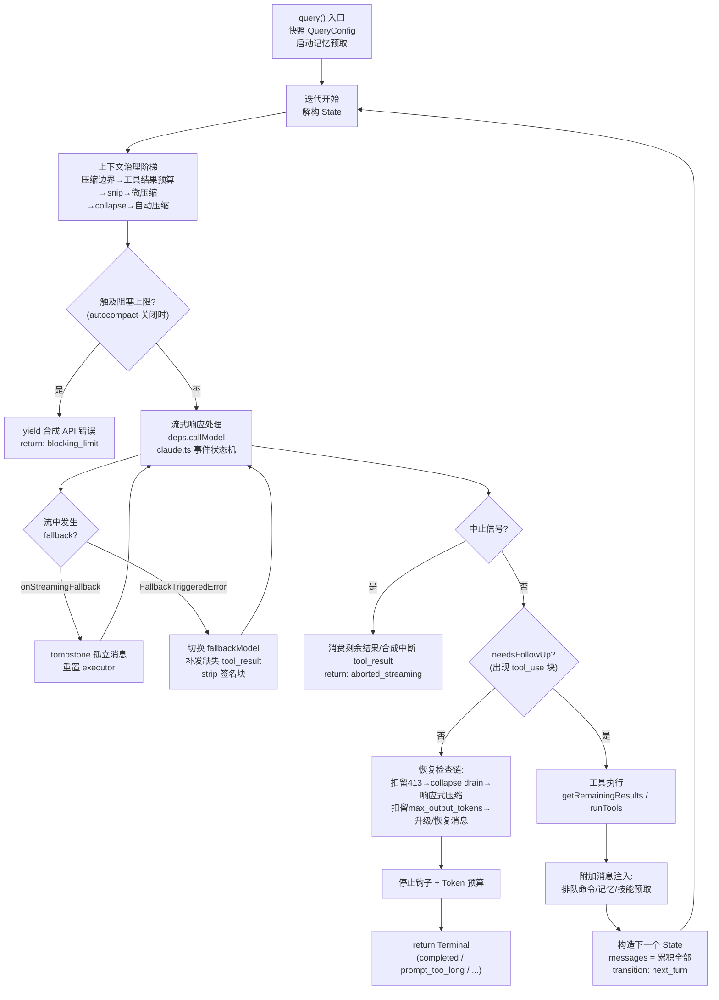

本文聚焦 Claude Code 代理引擎中最核心的执行单元——**单轮查询循环**（single-turn query loop）。一次"轮"（turn）指从用户提交一条提示开始，到模型产出最终无工具调用的回复为止的完整过程；期间可能发生任意次数的模型 API 调用与工具执行迭代。本文解析该循环的**状态机架构**、**流式响应的事件级处理**、**流中工具调度**，以及贯穿全链路的**多层错误恢复机制**。会话级编排（消息队列、transcript 持久化）属于 [查询引擎 QueryEngine：会话编排、消息流转与状态管理](6-cha-xun-yin-qing-queryengine-hui-hua-bian-pai-xiao-xi-liu-zhuan-yu-zhuang-tai-guan-li) 的范畴；压缩算法细节见 [上下文压缩：自动压缩、微压缩与 Token 预算管理](9-shang-xia-wen-ya-suo-zi-dong-ya-suo-wei-ya-suo-yu-token-yu-suan-guan-li)。

## 定位：QueryEngine 与 API 层之间的执行单元

循环的入口是 `query.ts` 导出的 `query()` 异步生成器。它包装内部的 `queryLoop()`：正常返回时，为所有已消费的排队命令补发 `completed` 生命周期通知（保证 started-without-completed 的对称信号仅在轮失败时出现）；异常抛出或消费者提前 `.return()` 时则直接穿透。上层 `QueryEngine.ask()` 通过 `for await` 逐条消费生成器产出的消息流，并同步写入 transcript——这意味着**循环的每一次 `yield` 都直接驱动 UI 渲染与会话持久化**，生成器的推进节奏就是整个应用的可观察节奏。

Sources: [query.ts](query.ts#L219-L239)、[QueryEngine.ts](QueryEngine.ts#L675-L686)

## 总体架构：async generator 驱动的状态机

`queryLoop` 的骨架是一个 `while (true)` 循环，每次迭代对应**一次模型调用 + 一次工具批次执行**。迭代的持续与终止不是通过递归实现（历史版本曾是递归调用），而是通过**状态对象重建**：每个"继续点"（continue site）构造一个全新的 `State` 对象并赋值给循环变量。`State` 携带跨迭代可变状态——消息数组、工具使用上下文、自动压缩追踪、`maxOutputTokens` 恢复计数器、挂起的工具摘要 Promise、停止钩子激活标记、轮次计数，以及一个 `transition` 字段记录"上一次迭代为何继续"（专为测试断言恢复路径而设计，无需检查消息内容）。

Sources: [query.ts](query.ts#L201-L217)、[query.ts](query.ts#L241-L321)

状态管理呈现清晰的三层分工。**`QueryParams`** 在整个循环中不可变（系统提示词、权限回调、fallback 模型等）；**`State`** 是跨迭代可变状态，每次迭代顶部解构后以裸名读取；**`QueryConfig`** 在循环入口一次性快照不可变的运行时门控（流式工具执行开关、工具摘要开关、fast mode 等）——刻意排除 `feature()` 编译期门控，因为后者是死代码消除边界，必须内联在守卫块中。**`QueryDeps`** 则以依赖注入形式暴露 I/O 边界（`callModel`、`microcompact`、`autocompact`、`uuid`），测试可直接注入 fake 而非逐模块 spyOn。

Sources: [query.ts](query.ts#L252-L295)、[query/config.ts](query/config.ts#L15-L46)、[query/deps.ts](query/deps.ts#L21-L40)

下图展示循环的完整生命周期：每个迭代从上下文治理阶梯开始，经过流式响应处理与工具执行，最终要么沿七个"继续迁移"（continue transition）回到循环顶部，要么以 `Terminal` 结果退出。阅读该图需要了解两个约定：**tombstone** 表示从 UI 与 transcript 中移除孤立消息的信号；**withheld（扣留）** 指可恢复错误在流中被扣留、暂不向 SDK 消费者产出的机制。

Sources: [query.ts](query.ts#L307-L365)、[query.ts](query.ts#L1715-L1728)

## 迭代前置：上下文治理阶梯

每次迭代在发起 API 调用前，依次通过一条**上下文治理阶梯**收缩消息集合：截取最后一个压缩边界之后的消息（`getMessagesAfterCompactBoundary`，HISTORY_SNIP 特性下还会投影 snip 视图）→ 按预算替换超限工具结果内容（`applyToolResultBudget`，按 `tool_use_id` 操作、与缓存微压缩正交）→ snip 裁剪 → 微压缩 → context collapse 投影 → 自动压缩。阶梯的执行顺序经过精心设计：collapse 先于 autocompact，若 collapse 已将 token 降至阈值以下则保留粒度化上下文而非生成单一摘要；`snipTokensFreed` 被下传给 autocompact，因为基于保护尾部 assistant 消息 usage 的估算无法感知 snip 已释放的 token。压缩完成后若 `compactionResult` 存在，压缩摘要消息被逐条 `yield` 并替换 `messagesForQuery`，同时重置压缩追踪状态。本节各机制的算法细节属于压缩专题。

Sources: [query.ts](query.ts#L365-L543)、[utils/messages.ts](utils/messages.ts#L4643-L4656)

阶梯之后是一个**阻塞上限预检**：当自动压缩关闭（用户显式配置）、且非 compact/session_memory 派生查询、且响应式压缩与 collapse 均未接管恢复职责时，客户端自行估算 token 是否已达硬阻塞线；若是，直接产出合成 API 错误并以 `blocking_limit` 终止——这一预检保留了用户手动 `/compact` 的操作空间。多个跳过条件的注释揭示了设计意图：合成预检错误若在 API 调用前返回，会**饿死**响应式压缩与 collapse 这两个依赖真实 413 的恢复路径。

Sources: [query.ts](query.ts#L592-L648)

## 流式响应处理：事件状态机与增量产出

模型调用通过 `deps.callModel`（生产实现为 `claude.ts` 的 `queryModelWithStreaming`）发起。该函数将内部 `queryModel` 包裹在 VCR 录制层中，返回一个产出 `StreamEvent | AssistantMessage | SystemAPIErrorMessage` 的异步生成器。**核心设计原则：queryModel 原则上不抛出 API 错误，而是将错误物化为合成 assistant 消息产出**——这使循环的错误处理统一在消息层面，避免异常控制流穿透生成器管道。

Sources: [query.ts](query.ts#L653-L708)、[claude.ts](services/api/claude.ts#L752-L780)

`queryModel` 内部维护一个**流事件状态机**，逐事件累积并即时向下游产出：

| 流事件 | 状态机动作 | 下游产出 |
|---|---|---|
| `message_start` | 捕获 `partialMessage` 模板、初始 usage、TTFT | `stream_event`（附带 `ttftMs`） |
| `content_block_start` | 按 `part.index` 建立内容块槽位（tool_use/server_tool_use 初始化 `input: ''`，text 清空，thinking 初始化空签名） | `stream_event` |
| `content_block_delta` | `text_delta` 追加文本；`thinking_delta` 追加思考；`input_json_delta` 增量拼接工具输入 JSON 字符串；`signature_delta` 累积签名 | `stream_event` |
| `content_block_stop` | 以 `partialMessage` 为壳、当前块为内容，构造**完整的 `AssistantMessage` 并 `yield`** | assistant 消息 + `stream_event` |
| `message_delta` | 将最终 usage 与 stop_reason **直接属性突变**写回最后一条已产出消息；处理 `max_tokens`/`model_context_window_exceeded` | 合成 API 错误消息（如触发）+ `stream_event` |
| `message_stop` | 无操作 | `stream_event` |

两个细节值得深究。其一，**每个内容块在 `content_block_stop` 时即刻产出一条独立的 assistant 消息**（而非等待整条消息完成），这是流中工具执行的前提——工具输入在 delta 阶段逐字符累积，块结束时已可解析执行。其二，`message_delta` 的写回采用**直接突变而非对象替换**：transcript 写队列持有 `message.message` 的引用并以 100ms 间隔惰性序列化，对象替换会使队列中的引用脱钩，直接突变保证最终 usage/stop_reason 被转录。`model_context_window_exceeded` 复用 `max_output_tokens` 恢复路径——从模型视角两者语义一致："响应被截断，从中断处继续"。

Sources: [claude.ts](services/api/claude.ts#L1940-L2052)、[claude.ts](services/api/claude.ts#L2192-L2211)、[claude.ts](services/api/claude.ts#L2213-L2293)

流健康度由两套机制监控。**闲置看门狗**（默认 90 秒，`CLAUDE_STREAM_IDLE_TIMEOUT_MS` 可调）以 `setTimeout` 主动杀死静默断连的流——SDK 的请求超时仅覆盖初始 `fetch()`，不覆盖流式响应体；触发后经非流式回退恢复而非当作完整流。**停顿检测**则被动记录事件间隔超过 30 秒的停顿（排除首块 TTFB），产出遥测事件用于诊断。流结束后还有**空流检测**：200 响应但无 `message_start`（代理返回非 SSE 体），或有 `message_start` 但无完成内容块且无 stop_reason，均抛错触发非流式回退——结构化输出场景下"第二轮 end_turn 且无内容块"是合法空响应，故 stop_reason 检查防止误报。

Sources: [claude.ts](services/api/claude.ts#L1868-L1929)、[claude.ts](services/api/claude.ts#L2337-L2364)

## 扣留机制：可恢复错误的延迟产出

循环在透传流消息前执行一层**扣留判定**：prompt-too-long（collapse 与响应式压缩各有一套独立判定）、媒体尺寸错误、`max_output_tokens` 错误——这三类错误**仍然进入 `assistantMessages` 数组**（供后续恢复检查发现），但**不 `yield` 给 SDK 消费者**。理由是 cowork/desktop 等 SDK 消费者在收到任何 `error` 字段时会终止会话；若提前泄漏中间错误，恢复循环仍在运行却已无人监听。扣留门控在流循环前**提升快照一次**（`mediaRecoveryEnabled`），因为 GrowthBook 的 `CACHED_MAY_BE_STALE` 值可能在 5-30 秒的流式期间翻转，扣留与恢复两侧必须一致，否则"扣留而不恢复"会吃掉这条消息。

Sources: [query.ts](query.ts#L788-L825)、[query.ts](query.ts#L621-L627)、[query.ts](query.ts#L164-L179)

## 流中工具调用：双模编排与循环的交互面

循环判定迭代是否继续的唯一信号是 `needsFollowUp`：流式期间任一 assistant 消息包含 `tool_use` 块即置位——**刻意不信任 `stop_reason === 'tool_use'`**，因为它并非总是被正确设置。`toolUseBlocks` 数组累积全部工具块，随后进入双模编排：

- **流式模式**（Statsig `tengu_streaming_tool_execution2` 门控）：`StreamingToolExecutor` 在 `tool_use` 块到达的**流式瞬间**即调用 `addTool` 排队执行——工具执行与模型后续 token 生成并行。循环在流的每次迭代中非阻塞地调用 `getCompletedResults()` 捞取已完成结果即时 `yield`；流结束后调用 `getRemainingResults()` 等待并产出全部剩余结果。
- **批处理模式**：`runTools` 事后处理——`partitionToolCalls` 将工具序列切分为**连续并发安全批**（Read/Grep 等只读工具，默认最多 10 路并发，`CLAUDE_CODE_MAX_TOOL_USE_CONCURRENCY` 可调）与**单元素串行批**（写类工具独占执行），并发批的上下文修饰器延迟到整批完成后统一应用以保证确定性。

Sources: [query.ts](query.ts#L551-L568)、[query.ts](query.ts#L553-L558)、[StreamingToolExecutor.ts](services/tools/StreamingToolExecutor.ts#L34-L71)、[toolOrchestration.ts](services/tools/toolOrchestration.ts#L19-L116)

流式 executor 的内部并发策略、`siblingAbortController` 级联中止链与合成错误消息（`sibling_error` / `user_interrupted` / `streaming_fallback` 三种原因）的完整语义属于 [工具执行编排：StreamingToolExecutor、并发控制与工具钩子](12-gong-ju-zhi-xing-bian-pai-streamingtoolexecutor-bing-fa-kong-zhi-yu-gong-ju-gou-zi)。循环层面只需理解其**生命周期契约**：流中 `addTool` → 流中 `getCompletedResults` 增量产出 → 流末 `getRemainingResults` 收尾；当流式回退发生时调用 `discard()` 丢弃并重建 executor，防止携带旧 `tool_use_id` 的孤儿 `tool_result` 泄漏进重试。

Sources: [StreamingToolExecutor.ts](services/tools/StreamingToolExecutor.ts#L412-L490)、[query.ts](query.ts#L730-L741)

与工具块产出相关的还有一处**克隆后补丁**（clone-before-yield）逻辑：当工具定义声明了 `backfillObservableInput`（如文件工具展开 `file_path`），循环在**克隆的消息**上执行回填后才 `yield`——原始消息对象原封不动进入 `assistantMessages` 并回流 API，任何字节级变更都会破坏提示词缓存。克隆仅在回填**新增**字段时发生：仅覆盖既有字段的回填会改变 transcript 序列化并破坏 VCR fixture 哈希，而 SDK 流并不需要它。

Sources: [query.ts](query.ts#L742-L787)

## 错误恢复体系

错误恢复分布在四个层次：API 客户端内重试、流协议内的降级、循环内的模型切换、以及循环级的上下文恢复。下表给出全景对照：

| 层次 | 触发条件 | 恢复动作 | 失败兜底 |
|---|---|---|---|
| **withRetry 自动重试** | 429/529、连接错误、云厂商凭证错误 | 指数退避重试（默认上限 10 次）、刷新 OAuth/Bedrock/Vertex 凭证、ECONNRESET 时禁用 keep-alive | `CannotRetryError` 携带原始错误抛出 |
| **fast mode 限流** | fast mode 活跃时 429/529 | 短 retry-after 保持 fast mode 保缓存；长延迟进入冷却切换标准速度 | 永久禁用 fast mode |
| **529 模型回退** | 连续 3 次 529（MAX_529_RETRIES）且配置 fallbackModel | 抛 `FallbackTriggeredError` | 外部用户抛 `CannotRetryError` |
| **流式→非流式回退** | 流错误/空流/看门狗超时/流创建 404 | `onStreamingFallback()` 通知 + 非流式重发（120-300 秒超时） | 错误物化为合成 assistant 消息 |
| **循环级模型切换** | `FallbackTriggeredError` 捕获 | 切换模型、tombstone/补发缺失 tool_result、strip thinking 签名块后重试 | — |
| **prompt-too-long 恢复** | 被扣留的 413 | 先 collapse drain（保粒度），后响应式压缩（全量摘要） | 产出扣留错误，`prompt_too_long` 终止 |
| **max_output_tokens 恢复** | 被扣留的截断错误 | 先升级至 64k 重发同一请求，再注入"直接续写"元消息最多 3 次 | 产出扣留错误 |

Sources: [withRetry.ts](services/api/withRetry.ts#L52-L89)、[withRetry.ts](services/api/withRetry.ts#L189-L253)、[claude.ts](services/api/claude.ts#L2504-L2594)、[query.ts](query.ts#L893-L951)、[query.ts](query.ts#L1062-L1183)、[query.ts](query.ts#L1185-L1256)

### API 层自动重试：withRetry

`withRetry` 是包裹所有 API 调用的异步生成器，产出 `SystemAPIErrorMessage`（重试过程中的状态消息）并返回操作结果。重试决策树的关键分支：**529 前台白名单**——仅 REPL 主线程、SDK、agent、compact、安全分类器等用户正在等待的 querySource 对 529 重试，后台调用（摘要、标题、建议）立即放弃，避免容量级联期间网关放大 3-10 倍；**`max_tokens` 上下文溢出 400**（向后兼容路径）——解析 inputTokens/contextLimit，将 `maxTokensOverride` 调整为 `contextLimit - inputTokens - 1000` 与 3000 下限、thinking 预算加一的最大值后重试；**无人值守持久重试**（`CLAUDE_CODE_UNATTENDED_RETRY`）——429/529 无限重试，退避上限 5 分钟、总等待上限 6 小时，期间周期性产出心跳消息防止宿主判定会话空闲。凭证刷新触发条件覆盖 401、OAuth 吊销、Bedrock CredentialsProviderError 与 Vertex 刷新失败，均在重试前强制重建客户端。

Sources: [withRetry.ts](services/api/withRetry.ts#L62-L89)、[withRetry.ts](services/api/withRetry.ts#L316-L382)、[withRetry.ts](services/api/withRetry.ts#L384-L427)、[withRetry.ts](services/api/withRetry.ts#L433-L463)

### 模型回退协议：FallbackTriggeredError

当连续 529 达到阈值且配置了 `fallbackModel`，`withRetry` 抛出携带原始/回退模型名的 `FallbackTriggeredError`。该错误**必须穿透** `claude.ts` 的捕获层直达 `query.ts`——若在 API 层吞掉，用户只会看到一条"Model fallback triggered"错误文本而无实际重试。循环捕获后的恢复序列：切换 `currentModel` 与上下文中的 `mainLoopModel` → 对已产出但未配对的工具调用补发合成错误 `tool_result`（`yieldMissingToolResultBlocks`）→ 清空本轮累积的三组数组 → 重建流式 executor → （内部用户）strip 签名块——**thinking 签名与模型绑定**，将受保护的 thinking 块（如 capybara）回放给未保护的 fallback 模型（如 opus）会得到 400 → 产出 warning 级系统消息告知用户切换原因 → 内层 `attemptWithFallback` 循环以新模型重发。

Sources: [withRetry.ts](services/api/withRetry.ts#L326-L365)、[claude.ts](services/api/claude.ts#L2598-L2618)、[query.ts](query.ts#L893-L951)、[query.ts](query.ts#L123-L149)

### 流式回退：tombstone 与孤儿清理

与模型回退不同，**流式回退**（streaming → non-streaming）由 `onStreamingFallback` 回调在流内通知。此时第一批部分消息（尤其 thinking 块，含无效签名）已被产出——循环为每条孤立消息 `yield` 一个 **tombstone**，指示 UI 与 transcript 将其移除，防止后续请求因"thinking blocks cannot be modified"类 API 错误失败。executor 被丢弃重建，且注意到非流式回退与流中工具执行存在**双重执行风险**（部分流已启动工具，非流式重试产生相同 tool_use 再执行一次），可通过 `CLAUDE_CODE_DISABLE_NONSTREAMING_FALLBACK` 或对应 Statsig 门控禁用。

Sources: [query.ts](query.ts#L709-L741)、[claude.ts](services/api/claude.ts#L2464-L2475)

### 循环级恢复：扣留错误的裁决

流结束后、进入停止钩子之前，循环对最后一条消息执行恢复裁决。**prompt-too-long 链**：先尝试 collapse drain（廉价的已暂存折叠提交，保留粒度化上下文；以 `state.transition !== 'collapse_drain_retry'` 防止同一恢复阶段重复触发），失败后交给响应式压缩（全量摘要 fork agent；`hasAttemptedReactiveCompact` 防螺旋）。两者均产出压缩后消息并重建 State 继续。**全部失败则产出扣留的错误并终止**——刻意**不落入停止钩子**：模型未产出有效响应，钩子评估它只会制造"错误→钩子阻断→重试→错误"的死亡螺旋，且每次循环注入更多 token。**媒体尺寸错误**跳过 collapse（collapse 不剥离图片），仅走响应式压缩的 strip-retry。

Sources: [query.ts](query.ts#L1062-L1183)

**max_output_tokens 链**是递进的两段式。第一段**升级重试**：若当前使用默认 8k 上限且用户未设置环境变量覆盖，直接以 64k（`ESCALATED_MAX_TOKENS`）重发**同一请求**——无元消息、无多轮操作，`maxOutputTokensOverride` 检查保证每轮只触发一次。第二段**恢复消息**：注入一条 `isMeta` 用户消息，内容为"直接续写——不要道歉、不要复述；若截断发生在句中就从句中接续；把剩余工作拆成更小块"，最多 3 次（`MAX_OUTPUT_TOKENS_RECOVERY_LIMIT`），计数器由 `maxOutputTokensRecoveryCount` 跨迭代跟踪。恢复耗尽后才产出扣留的错误。

Sources: [query.ts](query.ts#L1185-L1256)

### 用户中断的三时点处理

中断信号（`toolUseContext.abortController`）在循环中有三个检查时点，各时点行为不同。**流中**：若使用流式 executor，消费 `getRemainingResults()` 让其为排队/执行中的工具生成合成 `tool_result`（executor 在 `executeTool` 内检查中止信号），保证 API 协议要求的 tool_use/tool_result 配对完整；否则由 `yieldMissingToolResultBlocks` 补发"Interrupted by user"。**工具执行后**：同样先产出工具结果再检查。两个时点均产出 `createUserInterruptionMessage`，但 `signal.reason === 'interrupt'`（用户提交新消息打断而非 ESC）时跳过中断消息——紧随其后的排队用户消息已提供足够上下文。流式 executor 内部还区分工具的 `interruptBehavior`：`cancel` 类工具可被打断，`block` 类工具等待完成。

Sources: [query.ts](query.ts#L1011-L1052)、[query.ts](query.ts#L1484-L1516)、[StreamingToolExecutor.ts](services/tools/StreamingToolExecutor.ts#L210-L241)

### 循环级续推：停止钩子与 Token 预算

当模型不再调用工具，轮进入收尾裁决。**停止钩子**（`handleStopHooks`，详见 [Hooks 生命周期钩子](24-hooks-sheng-ming-zhou-qi-gou-zi-pei-zhi-mo-shi-shi-jian-zhu-ce-yu-http-agent-prompt-zhi-xing-qi)）若返回 blocking errors，错误消息被注入历史并以 `stop_hook_blocking` 迁移重启循环；`preventContinuation` 则以 `stop_hook_prevented` 终止。注意 `hasAttemptedReactiveCompact` 在此迁移中被**刻意保留**——重置曾导致"压缩→仍超限→错误→钩子阻断→再压缩"烧掉数千次 API 调用的死循环。**Token 预算续推**（`TOKEN_BUDGET` 特性）：主线程在预算使用低于 90% 且未出现收益递减（连续 3 次续推且增量 < 500 token）时，注入预算提醒元消息以 `token_budget_continuation` 迁移继续，直到阈值或递减判定停止——这让一个用户轮可以跨越 500k 级别的输出预算。

Sources: [query.ts](query.ts#L1267-L1306)、[query.ts](query.ts#L1308-L1357)、[query/stopHooks.ts](query/stopHooks.ts#L60-L98)、[query/tokenBudget.ts](query/tokenBudget.ts#L45-L93)

## 轮终止：Terminal 语义全景

循环的所有退出路径汇聚为 `Terminal` 返回值，其 `reason` 字段构成上层（SDK、REPL、遥测）判断轮结局的契约：

| reason | 触发路径 | 语义 |
|---|---|---|
| `completed` | 无工具调用且通过全部收尾裁决 | 正常完成（含 API 错误消息产出后的收尾） |
| `max_turns` / 附件 `max_turns_reached` | `turnCount + 1 > maxTurns` | 达到迭代上限（中止路径也先检查） |
| `aborted_streaming` / `aborted_tools` | 中止信号在流中/工具后检出 | 用户中断 |
| `model_error` | `callModel` 异常穿透（应当只发生 bug） | 物化错误消息后退出 |
| `prompt_too_long` | 扣留 413 恢复链全部失败 | 上下文超限且不可恢复 |
| `blocking_limit` | autocompact 关闭时的预检命中 | 保留手动 `/compact` 空间 |
| `image_error` | ImageSizeError/ImageResizeError 或扣留媒体错误恢复失败 | 媒体不可用 |
| `stop_hook_prevented` / `hook_stopped` | 停止钩子裁决 / hook_stopped_continuation 附件 | 钩子控制流 |
| —（异常抛出） | 生成器 throw | 穿透至 QueryEngine |

`model_error` 路径的注释记录了一个真实教训：曾经的中断处理将运行时故障误报为"[Request interrupted by user]"（如 Node 18 缺失 `Array.prototype.with()`），掩盖真实原因——因此该路径显式产出原始错误消息而非误导性中断文本。

Sources: [query.ts](query.ts#L641-L647)、[query.ts](query.ts#L955-L997)、[query.ts](query.ts#L1506-L1516)、[query.ts](query.ts#L1704-L1712)

## 下一迭代状态构造与后台工作隐藏

正常工具迁移（`next_turn`）的 State 构造是循环的**数据汇合点**：`messages = [...messagesForQuery, ...assistantMessages, ...toolResults]`——注意工具结果必须在工具全部完成后才能并入（API 不允许 tool_result 与普通用户消息交错）。构造前还有一组**延迟消费的后台工作**：排队命令按 `sleepRan` 决定 `next`/`later` 优先级排水（斜杠命令排除在外——必须经 `processSlashCommand` 走本地 JSX 路径而非发给模型；子代理只排水发给自己的 task-notification）；记忆预取以 `settledAt` 非阻塞消费（未就绪则留待下轮，`readFileState` 过滤模型已读过的记忆）；技能预取收集（预期 >98% 在模型流的 2-30 秒内完成解析，注释标注了 AKI@250ms / Haiku@573ms 的延迟预算）；`refreshTools` 刷新工具集使中途连上的 MCP 服务器下轮可用。

工具使用摘要（`generateToolUseSummary`，Haiku 生成）体现了**跨迭代延迟计算**模式：本轮工具批次完成后**异步发起**摘要生成（不阻塞下一次 API 调用），存入 `pendingToolUseSummary`；下一迭代流式结束后（此时 5-30 秒的模型流已为 1 秒级的 Haiku 调用提供了隐藏时间）`await` 并产出。子代理跳过（不在移动端 UI 呈现）。

Sources: [query.ts](query.ts#L1535-L1643)、[query.ts](query.ts#L1411-L1482)、[query.ts](query.ts#L1659-L1728)

## 思维块的守则

`query.ts` 中部保留了一段"魔法师注解"，陈述 thinking 块的三条协议规则：含 thinking/redacted_thinking 块的消息必须处于 `max_thinking_length > 0` 的查询中；thinking 块不能是消息块的最后一个；thinking 块必须在 assistant 轨迹（单轮，或含 tool_use 时的后续 tool_result 与下一条 assistant 消息）全程保留。这些规则解释了模型回退时 strip 签名块、tombstone 部分流消息等设计——任何对已签名 thinking 块的修改或跨模型回放都会触发 API 400。

Sources: [query.ts](query.ts#L151-L163)、[query.ts](query.ts#L924-L929)

## 延伸阅读

- 循环的宿主与消息消费侧：[查询引擎 QueryEngine：会话编排、消息流转与状态管理](6-cha-xun-yin-qing-queryengine-hui-hua-bian-pai-xiao-xi-liu-zhuan-yu-zhuang-tai-guan-li)
- 治理阶梯中各压缩机制的算法细节：[上下文压缩：自动压缩、微压缩与 Token 预算管理](9-shang-xia-wen-ya-suo-zi-dong-ya-suo-wei-ya-suo-yu-token-yu-suan-guan-li)
- StreamingToolExecutor 并发模型、工具钩子与 `runToolUse` 管线：[工具执行编排：StreamingToolExecutor、并发控制与工具钩子](12-gong-ju-zhi-xing-bian-pai-streamingtoolexecutor-bing-fa-kong-zhi-yu-gong-ju-gou-zi)
- 系统提示词如何进入 `fullSystemPrompt`：[系统提示词与上下文组装：CLAUDE.md、记忆注入与模型配置](8-xi-tong-ti-shi-ci-yu-shang-xia-wen-zu-zhuang-claude-md-ji-yi-zhu-ru-yu-mo-xing-pei-zhi)
- withRetry 之下的客户端构造、多供应商与 OAuth：[API 层与模型管理：Anthropic 客户端、多供应商支持与 OAuth 认证](29-api-ceng-yu-mo-xing-guan-li-anthropic-ke-hu-duan-duo-gong-ying-shang-zhi-chi-yu-oauth-ren-zheng)