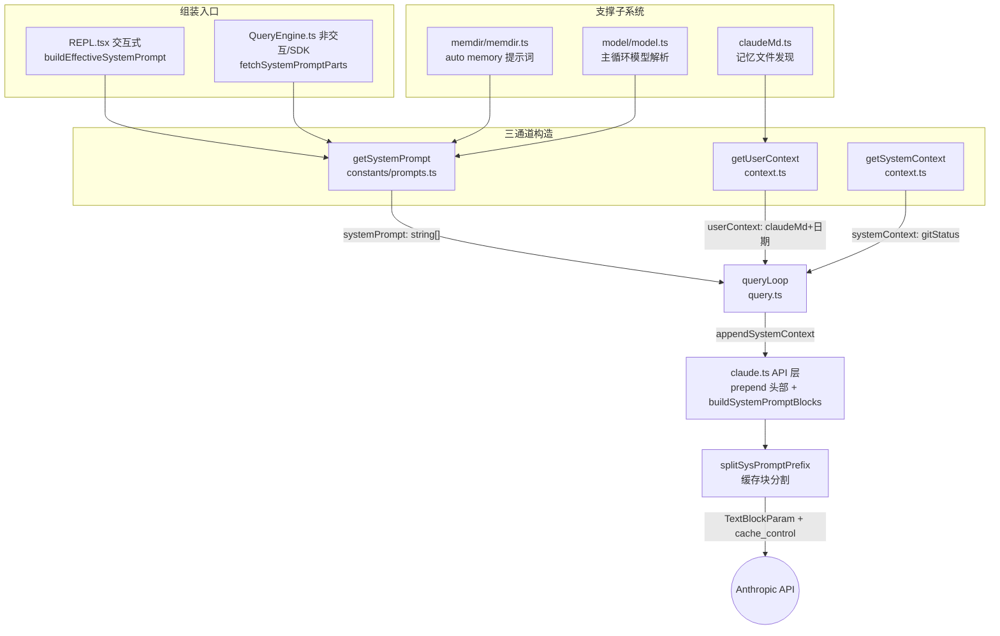

本文剖析 Claude Code 核心代理引擎中最关键的"输入构造"环节：系统提示词如何在多级优先级链中决策、`CLAUDE.md` 记忆文件如何被发现与解析、三类上下文（systemPrompt / userContext / systemContext）如何分别注入到 API 请求的不同位置，以及模型配置（主循环模型、上下文窗口、输出 token 上限）如何反向影响提示词内容。这一切的设计核心是一个矛盾：**内容要动态（模型、记忆、MCP 指令随时变化），但缓存要稳定（Anthropic prompt caching 依赖前缀不变）**。整个体系通过"品牌类型 + 段落注册表 + 缓存边界标记"三件套来解决该矛盾。

Sources: [systemPromptType.ts](utils/systemPromptType.ts#L1-L15), [systemPromptSections.ts](constants/systemPromptSections.ts#L1-L69)

## 组装管线总览

在深入各环节前，先建立整体心智模型。系统提示词并非一个字符串，而是一个 `readonly string[]` 品牌类型（`SystemPrompt`），由多个"块"（block）顺序拼接而成。交互式会话与非交互式（SDK/print）会话走两条不同的组装入口，但最终汇入同一个查询循环 `query()`，由 `query.ts` 在每轮迭代中调用 `appendSystemContext` 追加上下文块后传给 API 层。

**关键洞察**：`CLAUDE.md` 内容**不在** system prompt 中，而是作为 `userContext` 注入到对话首条 `<system-reminder>` 消息里；相反，memdir 记忆系统的**行为指令**（教你如何写记忆）才进入 system prompt。这个分离设计让 CLAUDE.md 内容（可能很大、随项目变化）不会污染系统提示词的缓存前缀。

Sources: [context.ts](context.ts#L116-L189), [constants/prompts.ts](constants/prompts.ts#L444-L577)

## SystemPrompt 品牌类型与优先级决策链

`SystemPrompt` 被定义为 `readonly string[] & { __brand: 'SystemPrompt' }` 的交叉类型，只能通过 `asSystemPrompt()` 构造。这个品牌化的意义在于强制所有组装路径显式声明——编译器阻止裸字符串数组流入 API 层，使每个块的来源可审计。该模块刻意保持零依赖，以便从依赖图的任何位置安全导入而不引发循环初始化。

Sources: [systemPromptType.ts](utils/systemPromptType.ts#L1-L15)

交互式会话的最终选择由 `buildEffectiveSystemPrompt` 完成，其优先级链从高到低为：**overrideSystemPrompt**（loop 模式等场景，直接替换一切）→ **Coordinator 模式提示词**（`CLAUDE_CODE_COORDINATOR_MODE` 环境变量激活）→ **Agent 提示词**（`mainThreadAgentDefinition` 存在时；proactive 模式下是"追加"到默认提示词之后，普通模式下是"替换"默认提示词）→ **customSystemPrompt**（`--system-prompt` CLI 参数）→ **默认提示词**。`appendSystemPrompt` 在除 override 外的所有分支末尾追加。

Sources: [systemPrompt.ts](utils/systemPrompt.ts#L28-L123)

非交互式路径在 `QueryEngine.ts` 中有一条平行逻辑：先经 `fetchSystemPromptParts` 并行获取默认提示词与两个上下文通道（`customSystemPrompt` 存在时跳过默认构建与 `getSystemContext`），再拼装 `[customPrompt ?? defaultSystemPrompt, memoryMechanicsPrompt?, appendSystemPrompt?]`。值得注意的是当 SDK 调用方同时设置了自定义提示词与 `CLAUDE_COWORK_MEMORY_PATH_OVERRIDE` 环境变量时，会显式注入记忆机制提示词——调用方已自建记忆目录，需要模型知道如何读写它。

Sources: [queryContext.ts](utils/queryContext.ts#L30-L74), [QueryEngine.ts](QueryEngine.ts#L284-L325)

启动路径（`main.tsx`）还有两处补充：非交互会话中自定义 Agent 的提示词直接赋给 `systemPrompt` 变量；tmux teammate 场景下自定义 Agent 提示词以 `# Custom Agent Instructions` 标题追加到 `appendSystemPrompt`。同时，若用户未指定模型但 Agent 定义了 `model` 字段（非 `inherit`），会在启动早期调用 `setMainLoopModelOverride` 覆盖主循环模型——**模型选择与提示词内容在启动时即耦合**，因为环境信息段落会内嵌模型 ID 与营销名。

Sources: [main.tsx](main.tsx#L2082-L2111), [main.tsx](main.tsx#L2140-L2173)

## 默认系统提示词：静态段、动态段与缓存边界

`getSystemPrompt(tools, model, additionalWorkingDirectories, mcpClients)` 是默认提示词的总装配函数。它返回的数组有明确的两段结构，由 `SYSTEM_PROMPT_DYNAMIC_BOUNDARY` 字面量（`'__SYSTEM_PROMPT_DYNAMIC_BOUNDARY__'`）分隔：

| 段落类别 | 内容 | 缓存特性 |
|---|---|---|
| **静态段（边界之前）** | intro（含 Output Style 描述）、System 通用规则、Doing Tasks、Actions、Using Your Tools、Tone and Style、Output Efficiency | 跨用户跨组织可复用 → `cacheScope: 'global'` |
| **动态段（边界之后）** | session_guidance、memory、ant_model_override、env_info、language、output_style、mcp_instructions、scratchpad、frc、summarize_tool_results 等 | 用户/会话特定 → `cacheScope: null`（不缓存） |

Sources: [prompts.ts](constants/prompts.ts#L444-L577), [prompts.ts](constants/prompts.ts#L105-L115)

两个特殊快捷路径值得注意：`CLAUDE_CODE_SIMPLE` 环境变量开启时直接返回一行极简提示词（CWD + 日期）；proactive/KAIROS 特性激活时返回精简的自主代理提示词（身份 + 记忆 + 环境 + 主动段落），此时 Agent 指令是追加而非替换。静态段中 `getSimpleDoingTasksSection` 受 Output Style 的 `keepCodingInstructions` 配置控制是否包含——Output Style 体系是用户重写提示词行为的官方出口。

Sources: [prompts.ts](constants/prompts.ts#L444-L489), [prompts.ts](constants/prompts.ts#L175-L197)

`computeSimpleEnvInfo` 构造环境段落时发生了**模型配置向提示词内容的渗透**：模型营销名与精确 ID（"You are powered by the model named X. The exact model ID is Y"）、按 canonical 名匹配的 knowledge cutoff 日期、最新模型家族 ID 列表、Fast mode 说明。ant 内部构建且 `isUndercover()` 激活时会全面抑制模型名引用，防止未发布模型泄露到公开提交中——这是通过在每个判断点内联 `process.env.USER_TYPE === 'ant'`（编译期 `--define`）让 bundler 常量折叠消除分支实现的。

Sources: [prompts.ts](constants/prompts.ts#L651-L710), [prompts.ts](constants/prompts.ts#L712-L730)

## 动态段落注册表：缓存与危险的缓存击穿

动态段的治理核心在 `systemPromptSections.ts`。`systemPromptSection(name, compute)` 创建**记忆化段落**——计算一次后缓存到 `bootstrap/state.ts` 的 `STATE.systemPromptSectionCache`（`Map<string, string | null>`），直到 `/clear` 或 `/compact` 才失效。与之相对，`DANGEROUS_uncachedSystemPromptSection(name, compute, reason)` 创建**每轮重算段落**，其命名本身就是一种 API 设计上的警示——参数 `_reason` 强制调用者书面解释为什么值得击穿 prompt cache。

Sources: [systemPromptSections.ts](constants/systemPromptSections.ts#L16-L58), [state.ts](bootstrap/state.ts#L1639-L1654)

目前唯一的 uncached 段落是 `mcp_instructions`，理由注明"MCP servers connect/disconnect between turns"。即便如此它也有优化：当 `isMcpInstructionsDeltaEnabled()` 时返回 null，指令改由持久化的 `mcp_instructions_delta` attachment 携带，避免晚连接的 MCP 服务器击穿缓存。相反，`token_budget` 段落曾经历从 uncached 到 cached 的反转——"When the user specifies..."的措辞使其在无预算时为 no-op，原先按 `getCurrentTurnTokenBudget()` 切换会在预算翻转时击穿约 20K token。

Sources: [prompts.ts](constants/prompts.ts#L508-L554), [systemPromptSections.ts](constants/systemPromptSections.ts#L60-L68)

`clearSystemPromptSections()` 在清空段落缓存的同时重置 beta header 锁存器（`clearBetaHeaderLatches`）——动态 beta 头（AFK/fast-mode/cache-editing）采用"sticky-on 锁存"策略：一旦发送就持续整个会话，防止中途切换改变服务端缓存键。两个失效机制在此刻联动，保证新会话获得全新评估。

Sources: [systemPromptSections.ts](constants/systemPromptSections.ts#L60-L68), [claude.ts](services/api/claude.ts#L1405-L1450)

## CLAUDE.md 层级发现与加载顺序

`utils/claudeMd.ts`（1480 行）实现了完整的记忆文件发现协议。文件头注释即规范：四级层级按 **Managed → User → Project → Local** 顺序加载，"Files are loaded in reverse order of priority, i.e. the latest files are highest priority"——越靠后加载的文件优先级越高，模型对末尾内容关注度更高。

| 层级 | 路径 | 特性 | 开关 |
|---|---|---|---|
| **Managed** | `/etc/claude-code/CLAUDE.md` + `rules/` 目录 | 全员全局策略，**永不**被 excludes 过滤 | 始终加载 |
| **User** | `~/.claude/CLAUDE.md` + `~/.claude/rules/*.md` | 私人全局指令 | `settingSources.userSettings` |
| **Project** | 各级目录的 `CLAUDE.md`、`.claude/CLAUDE.md`、`.claude/rules/*.md` | 签入代码库的团队指令 | `settingSources.projectSettings` |
| **Local** | 各级目录的 `CLAUDE.local.md` | 私人项目指令（gitignored） | `settingSources.localSettings` |
| **AutoMem** | memdir 入口 `MEMORY.md` | 跨会话自动记忆索引 | `isAutoMemoryEnabled()` |
| **TeamMem** | 团队记忆入口 | 跨组织同步（`<team-memory-content>` 包裹） | `feature('TEAMMEM')` |

Sources: [claudeMd.ts](utils/claudeMd.ts#L1-L26), [claudeMd.ts](utils/claudeMd.ts#L790-L1007)

Project/Local 的发现机制是从 CWD 向上遍历到根收集目录列表，然后**反转后从根向下处理**（`dirs.reverse()`）——这保证靠近当前目录的文件后加载、高优先级。一个精细的边界处理是嵌套 worktree 去重：当 worktree 位于主仓库内部（如 `.claude/worktrees/<name>/`）时，向上遍历会穿过 worktree 根与主仓库根，两处都有签入的 CLAUDE.md 导致重复加载，代码通过 `findGitRoot` 与 `findCanonicalGitRoot` 的差异检测跳过主仓库工作区内的 Project 型文件。

Sources: [claudeMd.ts](utils/claudeMd.ts#L849-L934)

`--add-dir` 显式添加的目录在 `CLAUDE_CODE_ADDITIONAL_DIRECTORIES_CLAUDE_MD` 环境变量开启时也会按 Project 型加载——注意这里**故意不检查** `projectSettings` 开关，因为 `--add-dir` 是显式用户动作，而 SDK 默认 `settingSources` 为空。另有两处全局短路：`CLAUDE_CODE_DISABLE_CLAUDE_MDS` 硬关闭；`--bare` 模式跳过自动发现但尊重显式 `--add-dir`（语义是"跳过我没要求的，而非忽略我要求的"）。

Sources: [claudeMd.ts](utils/claudeMd.ts#L936-L977), [context.ts](context.ts#L152-L172)

## 文件解析管线：@include、frontmatter globs 与 HTML 注释

单个记忆文件进入 `parseMemoryFileContent` 后经历一条纯函数解析管线：**扩展名白名单校验**（`TEXT_FILE_EXTENSIONS` 覆盖约 120 种文本格式，阻止二进制文件进入上下文）→ **frontmatter 解析**（`paths` 字段转为 glob 数组，`/**` 后缀被剥离因为 ignore 库的路径语义已包含递归；全 `**` 模式视为无条件规则返回 undefined）→ **marked Lexer 单次词法分析**（同时服务 HTML 注释剥离与 @include 提取，`gfm: false` 防止 `~/path` 被解析为删除线）→ **MEMORY.md 截断**（AutoMem/TeamMem 类型应用 `truncateEntrypointContent` 的行数与字节上限）。

Sources: [claudeMd.ts](utils/claudeMd.ts#L92-L227), [claudeMd.ts](utils/claudeMd.ts#L336-L399)

`@include` 指令支持 `@path`、`@./relative`、`@~/home`、`@/absolute` 四种形式，仅在叶子文本节点生效（跳过 code/codespan token，HTML 注释 token 先剥离注释再检查残余文本）。递归处理有 `MAX_INCLUDE_DEPTH = 5` 深度上限与 `processedPaths` 集合防循环，路径经 `normalizePathForComparison` 归一化以容忍 Windows 盘符大小写差异（`C:\Users` vs `c:\Users`）；symlink 提前解析并将原路径与解析后路径都加入已处理集。工作目录之外的 include 默认拒绝，需项目配置 `hasClaudeMdExternalIncludesApproved` 批准（User 层级例外，始终允许）。

Sources: [claudeMd.ts](utils/claudeMd.ts#L448-L535), [claudeMd.ts](utils/claudeMd.ts#L614-L685)

块级 HTML 注释剥离遵循 CommonMark type-2 HTML 块规则：仅剥离独占行的 `<!-- ... -->`，行内代码与围栏代码块内的注释保留；未闭合注释原样保留以防笔误吞掉文件其余部分；`-->` 同行后的残余文本保留（如 `<!-- note --> Use bun`）。`contentDiffersFromDisk` 标记记录注入内容是否经过变换（frontmatter 剥离/注释剥离/截断），此时 `rawContent` 保留原始磁盘字节——文件状态缓存可借此去重与变更检测，但 Edit/Write 工具仍要求先显式 Read。

Sources: [claudeMd.ts](utils/claudeMd.ts#L281-L334), [claudeMd.ts](utils/claudeMd.ts#L229-L243)

## 从文件到提示词：getClaudeMds 格式化与缓存失效

`getMemoryFiles` 是 memoize 包装的发现总入口，产出 `MemoryFileInfo[]`。`getClaudeMds` 将其格式化为最终字符串：每文件渲染为 `Contents of <path><description>:\n\n<content>`，description 按类型区分（Project 标注 "checked into the codebase"，Local 标注 "not checked in"，TeamMem 用 `<team-memory-content source="shared">` XML 包裹）。整个数组以 `MEMORY_INSTRUCTION_PROMPT` 开头——一段强调"这些指令覆盖默认行为、必须精确遵守"的指令文本。`MAX_MEMORY_CHARACTER_COUNT = 40000` 定义单文件推荐上限，`getLargeMemoryFiles` 供诊断用。

Sources: [claudeMd.ts](utils/claudeMd.ts#L89-L92), [claudeMd.ts](utils/claudeMd.ts#L1153-L1195)

缓存失效分两档，是本模块 API 设计的精髓：`clearMemoryFileCaches()` 仅清缓存**不触发**钩子（供 worktree 切换、设置同步、/memory 对话框等纯正确性场景使用）；`resetGetMemoryFilesCache(reason)` 同时设置一次性加载原因并重新武装 `InstructionsLoaded` 钩子（压缩后重载时上报 `compact` 而非误报 `session_start`）。两个 GrowthBook 实验旗标直接改变注入集合：`tengu_moth_copse` 开启时 `filterInjectedMemoryFiles` 剔除 AutoMem/TeamMem（改由 findRelevantMemories 预取以 attachment 呈现）；`tengu_paper_halyard` 开启时跳过 Project/Local。

Sources: [claudeMd.ts](utils/claudeMd.ts#L1042-L1130), [claudeMd.ts](utils/claudeMd.ts#L1136-L1151)

`claudeMdExcludes` 设置提供用户级排除（仅作用于 User/Project/Local，Managed 与记忆系统豁免），匹配前对绝对路径模式做 realpath 解析扩展——处理 macOS `/tmp → /private/tmp` 类 symlink 导致的两侧路径不一致；含 glob 字符的模式解析其静态前缀目录。

Sources: [claudeMd.ts](utils/claudeMd.ts#L539-L612)

## 三通道注入：userContext 与 systemContext 的不同归宿

`context.ts` 定义了两个 memoize 的上下文构造器。**`getUserContext`** 返回 `{ claudeMd, currentDate }`：前者是上节格式化的全部记忆文件内容，后者是本地化日期字符串；它同时把结果写入 `setCachedClaudeMdContent` 供 auto-mode 分类器读取（避免 yoloClassifier 直接导入 claudemd.ts 造成 `permissions/filesystem → permissions → yoloClassifier` 循环依赖）。**`getSystemContext`** 返回 `{ gitStatus, cacheBreaker? }`：gitStatus 并行执行 branch/default branch/status（2000 字符截断）/最近 5 条 commit/user.name 五组命令；CCR 远程模式或 git 指令禁用时跳过。

Sources: [context.ts](context.ts#L36-L111), [context.ts](context.ts#L113-L189)

两个通道在 `query.ts` 的查询循环中有不同的注入归宿，这是理解整个体系的关键分叉：

| 通道 | 注入函数 | 注入位置 | 缓存影响 |
|---|---|---|---|
| `systemContext` | `appendSystemContext`（query.ts:450） | **system prompt 数组末尾**追加 `key: value` 行 | 位于动态边界之后，不破坏静态前缀 |
| `userContext` | `prependUserContext`（utils/api.ts:449） | 对话**首条 meta user 消息**，包裹 `<system-reminder>` | 消息层缓存，与 system prompt 缓存独立 |

`prependUserContext` 生成的消息以 "As you answer the user's questions, you can use the following context:" 开头，各条目以 `# key` 标题组织，末尾强调 "this context may or may not be relevant... You should not respond to this context unless it is highly relevant"——这句免责声明抑制模型对注入上下文的过度反应。`isMeta: true` 标记使其不进入用户可见渲染。

Sources: [query.ts](query.ts#L449-L467), [api.ts](utils/api.ts#L437-L474)

`context.ts` 还藏着 ant 专用的调试设施：`setSystemPromptInjection` 设置的 cacheBreaker 字符串会以 `[CACHE_BREAKER: ...]` 形式进入 systemContext，用于瞬态调试时强制改变缓存键；设置时立即清空两个上下文的 memoize 缓存。

Sources: [context.ts](context.ts#L22-L34), [context.ts](utils/../context.ts#L130-L148)

## 记忆系统提示词：memdir 的行为指令注入

memdir 体系注入的不是记忆**内容**（内容经 CLAUDE.md 通道），而是教模型**如何使用记忆系统**的行为指令。`loadMemoryPrompt` 按特性分派：KAIROS 日常日志模式（`buildAssistantDailyLogPrompt`）→ TEAMMEM 组合提示词（`buildCombinedMemoryPrompt`，团队记忆要求 auto 记忆开启，故无 team-only 分支）→ 纯 auto 记忆（`buildMemoryLines`）→ 全部禁用时返回 null 并上报 `tengu_memdir_disabled` 遥测。

Sources: [memdir.ts](memdir/memdir.ts#L409-L507)

`buildMemoryLines` 构造约 15 个段落的完整行为规范：记忆目录位置（"Harness guarantees the directory exists so the model can write without checking"——目录由 harness 预创建，提示词措辞与之呼应）、封闭四类分类法（user/feedback/project/reference，排除可从项目状态推导的内容）、保存流程（skipIndex 时为单步写文件；否则两步——写独立文件 + 在 MEMORY.md 索引加单行指针，索引超行数上限截断）、与其他持久化机制（plan/tasks）的边界区分。Cowork 通过 `CLAUDE_COWORK_MEMORY_EXTRA_GUIDELINES` 环境变量注入额外策略文本。`buildSearchingPastContextSection`（`tengu_coral_fern` 旗标）追加 grep 检索指引——ant 原生构建中 grep 别名到内嵌 ugrep 时给出 shell 形式，否则给出 GrepTool 调用形式。

Sources: [memdir.ts](memdir/memdir.ts#L187-L266), [memdir.ts](memdir/memdir.ts#L372-L407)

KAIROS 日常日志模式的提示词有一个精妙的**缓存感知设计**：日志路径写作 `logs/YYYY/MM/YYYY-MM-DD.md` 模式而非内联当天字面路径，因为该段落被 `systemPromptSection('memory', ...)` 缓存且不因日期变化失效——模型从 `currentDate` 上下文自行推导日期，午夜翻转时由 `date_change` attachment（追加在尾部）通知，用户上下文消息中的日期则故意保持陈旧以跨午夜保留缓存前缀。

Sources: [memdir.ts](memdir/memdir.ts#L318-L370)

## API 层：前缀注入与缓存块分割

进入 `services/api/claude.ts` 后，系统提示词数组先被前置两个特殊块（L1358-1369）：**attribution header**（`getAttributionHeader`，`x-anthropic-billing-header: cc_version=...; cc_entrypoint=...`，原生证明开启时含 `cch=00000` 占位符由 Bun HTTP 栈覆写为 attestation token）与 **CLI sysprompt prefix**（`getCLISyspromptPrefix`，按交互性三选一）。随后按需追加 advisor 工具指令与 Chrome 工具检索指令。

Sources: [claude.ts](services/api/claude.ts#L1330-L1379)

CLI 前缀的三个变体定义在 `constants/system.ts`：交互式一律 `DEFAULT_PREFIX`（"You are Claude Code, Anthropic's official CLI for Claude."）；非交互有 appendSystemPrompt 时为 SDK preset 变体，否则为纯 Agent SDK 变体；Vertex 供应商强制 DEFAULT_PREFIX。`CLI_SYSPROMPT_PREFIXES` 集合供下游按**内容**（而非位置）识别前缀块。

Sources: [system.ts](constants/system.ts#L10-L46)

`buildSystemPromptBlocks` 调用 `splitSysPromptPrefix` 完成最终分割，输出带 `cache_control` 的 `TextBlockParam[]`。三种模式：

| 模式 | 触发条件 | 块结构 |
|---|---|---|
| 工具级缓存 | 全局缓存开启 + 存在 MCP 工具 | attribution(null) → prefix(**org**) → 其余合并(**org**)，边界标记剔除 |
| 全局缓存 | 全局缓存开启 + 边界标记命中 | attribution(null) → prefix(null) → 静态合并(**global**) → 动态合并(null) |
| 默认 | 3P 供应商或边界缺失 | attribution(null) → prefix(**org**) → 其余合并(**org**) |

注意注释中的硬约束："IMPORTANT: Do not add any more blocks for caching or you will get a 400"——API 对 cache_control 块数量有上限。`global` scope 使静态段可跨组织命中缓存，这是静态/动态二分的最终兑现。

Sources: [api.ts](utils/api.ts#L296-L360), [claude.ts](services/api/claude.ts#L3213-L3237)

## 模型配置：解析链、默认策略与运行时切换

主循环模型的解析链在 `utils/model/model.ts`，优先级为：**会话内 /model 覆盖**（`getMainLoopModelOverride`）→ **启动时 --model 参数** → **ANTHROPIC_MODEL 环境变量** → **持久化设置** → **内置默认**。`getUserSpecifiedModelSetting` 在返回前经 `isModelAllowed` 白名单校验，不在允许列表的指定被静默忽略。

Sources: [model.ts](utils/model/model.ts#L49-L98)

内置默认 `getDefaultMainLoopModelSetting` 体现订阅分层策略：ant 内部用户取旗标配置的 `defaultModel` 或 Opus+`[1m]`；Max 与 Team Premium 订阅者默认 Opus（`isOpus1mMergeEnabled` 时附 `[1m]` 后缀）；PAYG/Enterprise/Team Standard/Pro 一律默认 Sonnet。`getRuntimeMainLoopModel` 处理两个运行时别名：`opusplan` 在 plan 模式且未超 200K token 时升级为 Opus；`haiku` 在 plan 模式时替换为 Sonnet——**权限模式可以改变实际使用的模型**。

Sources: [model.ts](utils/model/model.ts#L140-L208)

模型字符串归一化经由 `firstPartyNameToCanonical` 纯字符串匹配（剥离日期/供应商后缀，如 `claude-3-7-sonnet-20250219` 与 `us.anthropic.claude-opus-4-6-v1:0` 归一到 canonical 短名），匹配顺序刻意"先具体后宽泛"（4-5 在 4 之前）。这套 canonical 名是整个代码库模型能力判断的统一键——knowledge cutoff、输出上限、1M 支持全部基于它。

Sources: [model.ts](utils/model/model.ts#L210-L280)

## 上下文窗口与输出 Token 限额

`utils/context.ts` 定义窗口解析的完整优先级：ant 用户的 `CLAUDE_CODE_MAX_CONTEXT_TOKENS` 环境变量覆盖一切（允许本地决策如 auto-compact 用更小窗口而端点仍是 1M）→ 模型名 `[1m]` 后缀显式声明（客户端 opt-in，优先于一切检测）→ `getModelCapability` 的 `max_input_tokens`（≥100K 才采信；`is1mContextDisabled` 时封顶回 200K）→ `CONTEXT_1M_BETA_HEADER` beta + `modelSupports1M`（当前限 sonnet-4 与 opus-4-6）→ Sonnet 1M 实验（`coral_reef_sonnet` clientDataCache）→ ant 内部模型表 → 兜底 `MODEL_CONTEXT_WINDOW_DEFAULT = 200_000`。`CLAUDE_CODE_DISABLE_1M_CONTEXT` 供 C4E 管理员满足 HIPAA 合规。

Sources: [context.ts](utils/context.ts#L8-L98)

输出 token 限额 `getModelMaxOutputTokens` 按 canonical 名分档返回 `{ default, upperLimit }`：Opus 4.6 为 64K/128K，Sonnet 4.6 与 Opus 4.5/Sonnet 4/Haiku 4 为 32K/64K（或 128K），Claude 3 世代各回 4K/8K。槽位预留优化引入 `CAPPED_DEFAULT_MAX_TOKENS = 8_000`——BigQuery p99 输出仅 4,911 token，32K/64K 默认值过度预留 8-16 倍槽位容量；命中上限的请求（<1%）获得一次 64K 的干净重试（见 query.ts 的 `max_output_tokens_escalate`）。`COMPACT_MAX_OUTPUT_TOKENS = 20_000` 单独服务压缩操作。

Sources: [context.ts](utils/context.ts#L12-L25), [context.ts](utils/context.ts#L146-L222)

## 多场景复用：组装函数的消费方

`getSystemPrompt` 的调用方图谱揭示了组装逻辑的复用广度：REPL 交互（含后台会话 Ctrl+B 路径，完整重建三通道后传 `startBackgroundSession`）、AgentTool 子代理（`runAgent.ts` 经 `enhanceSystemPromptWithEnvDetails` 追加绝对路径等代理注意事项与 `computeEnvInfo`）、Swarm 进程内 teammate（`inProcessRunner.ts`）、压缩操作（`compact.ts` 用相同提示词保证摘要请求的一致性）、SessionMemory、btw 旁路提问等。子代理路径的注释特别指出子代理会收到 skill_discovery attachment 但**不经过** getSystemPrompt，故需 `enhanceSystemPromptWithEnvDetails` 补齐相同的 DiscoverSkills 框架——两条路径的行为对齐靠人工维护而非结构保证。

Sources: [REPL.tsx](screens/REPL.tsx#L2533-L2572), [prompts.ts](constants/prompts.ts#L758-L791)

## 小结与延伸阅读

本页覆盖的组装体系可归纳为三条设计原则：**品牌类型强制显式构造**（SystemPrompt 不可裸拼）、**静态/动态二分换取缓存效率**（边界标记 + 段落注册表 + 三级 cacheScope）、**内容与行为指令分离**（CLAUDE.md 走消息层、memdir 指令走系统层）。当上下文超出窗口时，压缩系统接管——它如何在这些提示词约束下重写历史，是下一页主题。工具如何被注入提示词（Using Your Tools 段落的生成）与权限模型的关联则在工具系统章节展开。

**延伸阅读**：
- [上下文压缩：自动压缩、微压缩与 Token 预算管理](9-shang-xia-wen-ya-suo-zi-dong-ya-suo-wei-ya-suo-yu-token-yu-suan-guan-li) —— 压缩如何与 `clearSystemPromptSections` 和记忆重载联动
- [工具注册表：内置工具清单、懒加载与循环依赖治理](11-gong-ju-zhu-ce-biao-nei-zhi-gong-ju-qing-dan-lan-jia-zai-yu-xun-huan-yi-lai-zhi-li) —— `getUsingYourToolsSection` 的工具名来源
- [记忆系统：memdir 记忆扫描、相关性检索、团队记忆同步与自动固化](27-ji-yi-xi-tong-memdir-ji-yi-sao-miao-xiang-guan-xing-jian-suo-tuan-dui-ji-yi-tong-bu-yu-zi-dong-gu-hua) —— findRelevantMemories 预取如何替代 MEMORY.md 索引注入
- [API 层与模型管理：Anthropic 客户端、多供应商支持与 OAuth 认证](29-api-ceng-yu-mo-xing-guan-li-anthropic-ke-hu-duan-duo-gong-ying-shang-zhi-chi-yu-oauth-ren-zheng) —— betas 头与 prompt caching 的服务端协议