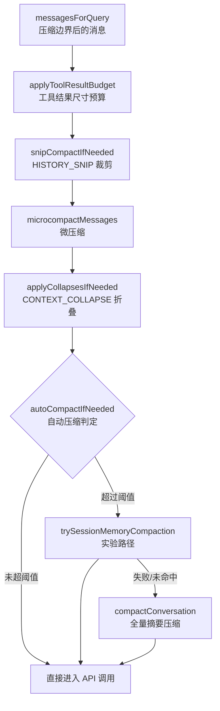
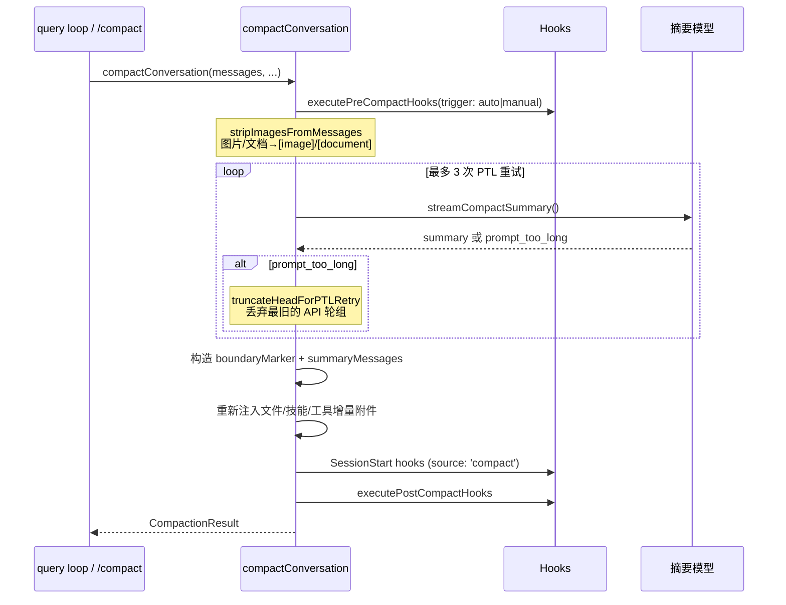

本文深入解析本代码库的**上下文生命周期管理**体系：当会话消息不断累积逼近模型上下文窗口上限时，系统如何通过分层机制——微压缩、自动压缩、全量摘要压缩、以及面向用户输入的 Token 预算控制——在"保留信息完整性"与"维持会话可用性"之间取得工程平衡。核心实现集中于 `services/compact/` 目录（11 个模块），并在查询循环 `query.ts` 中以固定顺序编排执行。本文面向高级开发者，将依次剖析：压缩管线的编排顺序、Token 计量的三种精度层级、阈值决策算法、摘要生成的容错重试机制、微压缩的两条路径（时间触发与缓存编辑）、实验性 Session Memory 压缩，以及 `TOKEN_BUDGET` 特性下的输出预算跟踪。

Sources: [query.ts](query.ts#L412-L468) · [autoCompact.ts](services/compact/autoCompact.ts#L1-L91)

## 压缩管线总览：查询循环中的固定编排顺序

整个上下文管理体系的核心切入点在 `query.ts` 的主循环内。每轮 API 请求前，消息数组会依次通过五个阶段，**顺序本身就是设计意图**——代价从低到高、侵入性从小到大排列：先做便宜的局部清理，只有当低层级手段无法解决压力时，才升级到昂贵的全量摘要。



这五个阶段的执行点都在 `query.ts` 主循环中显式标注了性能检查点（`queryCheckpoint`），从 `query_snip_start` 到 `query_autocompact_end`，可用于性能剖析。值得注意的是，contextCollapse 被刻意排在 autocompact **之前**：如果折叠已将上下文压回阈值以下，autocompact 就成了空操作，从而保留细粒度上下文而非退化为单一摘要。

Sources: [query.ts](query.ts#L365-L468) · [deps.ts](query/deps.ts#L21-L40)

## 依赖注入：`query/deps.ts` 的可测试性设计

`microcompactMessages` 与 `autoCompactIfNeeded` 并非被 `query.ts` 直接 import 调用，而是通过 `QueryDeps` 注入。`productionDeps()` 工厂返回真实实现，测试则可注入伪造版本。注释明确说明动机：这两个函数是测试文件中最常被 mock 的目标（各被 6-8 个测试文件 spyOn），依赖注入消除了逐模块 spy 的样板代码。类型签名直接用 `typeof fn` 与真实实现保持同步，无需维护手写接口。范围刻意控制在 4 个依赖（`callModel`、`microcompact`、`autocompact`、`uuid`），作为该模式的验证样板。

Sources: [deps.ts](query/deps.ts#L8-L40)

## Token 计量体系：三种精度层级

压缩决策的准确性完全取决于 Token 计量的准确性。系统采用三级计量策略：

| 层级 | 函数 | 精度 | 用途 | 位置 |
|---|---|---|---|---|
| 精确 | `tokenCountWithEstimation` | API usage + 增量估算 | **阈值判定的规范函数**（autocompact、session memory） | `utils/tokens.ts` |
| API 直计 | `countMessagesTokensWithAPI` | 服务端真实计数 | 需要精确值时（含 Bedrock/Vertex 降级） | `services/tokenEstimation.ts` |
| 粗估 | `roughTokenCountEstimation` | 字符数 ÷ 4 | 微压缩、PTL 重试的快速估算 | `services/tokenEstimation.ts` |

**`tokenCountWithEstimation` 是全库的规范函数**（源码注释称之为 "CANONICAL function"）。其算法是：从消息数组尾部向前扫描，找到最后一个携带 `usage` 的 assistant 消息，取 `input_tokens + cache_creation + cache_read + output_tokens`，再对之后新增的消息做粗估求和。注释特别处理了**并行工具调用的拆分场景**：当模型一次响应发出多个工具调用时，流式代码会为每个 content block 发出独立的 assistant 记录（共享同一 `message.id`），查询循环则将每个 `tool_result` 紧跟其 `tool_use` 交错排列。若只锚定最后一条记录，会漏掉之前交错的 tool_results——因此找到 usage 记录后会**向前回溯到同 `message.id` 的首个兄弟记录**，确保所有交错结果都纳入估算切片。

粗估函数 `roughTokenCountEstimation` 默认按 4 字节/token 换算，但 `bytesPerTokenForFileType` 对 JSON/JSONL/JSONC 密集文件使用 2 字节比率——密集 JSON 中大量单字符 token（`{`、`}`、`:`）使真实比率接近 2。微压缩中的 `estimateMessageTokens` 则逐块统计（text/tool_result/thinking/tool_use 各自规则，图片文档固定按 2000 token），最终**乘以 4/3 的保守系数**。

Sources: [tokens.ts](utils/tokens.ts#L226-L261) · [tokenEstimation.ts](services/tokenEstimation.ts#L203-L242) · [microCompact.ts](services/compact/microCompact.ts#L164-L205)

## 阈值阶梯：从有效窗口到阻塞极限

自动压缩的决策建立在一条精心设计的阈值阶梯之上。所有阈值都从 `getEffectiveContextWindowSize` 派生：

```
有效窗口 = min(模型上下文窗口, CLAUDE_CODE_AUTO_COMPACT_WINDOW 环境覆盖)
         - min(模型 max_output_tokens, 20_000)   ← 为摘要输出预留
```

20,000 的预留值基于压缩摘要输出的 **p99.99 分位数 17,387 tokens** 实测数据。模型上下文窗口本身由 `getContextWindowForModel` 决定：ant 用户可用 `CLAUDE_CODE_MAX_CONTEXT_TOKENS` 强制覆盖，`[1m]` 后缀显式启用 1M 窗口，能力表 `max_input_tokens`、`CONTEXT_1M_BETA_HEADER` beta、ant 内部模型表依次回退，最终默认 200,000。

在此基础上派生出五级阈值：

| 阈值 | 缓冲值 | 含义 |
|---|---|---|
| 自动压缩阈值 | 有效窗口 − 13,000 | `shouldAutoCompact` 触发全量压缩 |
| 警告阈值 | 自动阈值 − 20,000 | UI 显示 "Context left until auto-compact" 警告 |
| 错误阈值 | 自动阈值 − 20,000 | 更紧急的 UI 提示 |
| **阻塞极限** | 有效窗口 − 3,000 | 仅当**自动压缩关闭**时，阻止继续发送（为手动 `/compact` 保留空间） |
| 摘要输出预留 | min(maxOutputTokens, 20,000) | 窗口计算中扣除 |

`calculateTokenWarningState` 将这些阈值一次性计算为 `{percentLeft, isAboveWarningThreshold, isAboveErrorThreshold, isAboveAutoCompactThreshold, isAtBlockingLimit}` 供 UI 消费。当自动压缩启用时，警告/错误阈值锚定在自动压缩阈值上；禁用时则锚定在完整有效窗口——语义一致：警告总是指向"上下文即将耗尽"的最近事件。

Sources: [autoCompact.ts](services/compact/autoCompact.ts#L28-L91) · [autoCompact.ts](services/compact/autoCompact.ts#L93-L145) · [context.ts](utils/context.ts#L51-L98)

## 自动压缩的守门逻辑：递归防护与熔断器

`shouldAutoCompact` 在比较 token 之前执行一系列**递归防护**，每一条都对应一个真实故障场景：

- `session_memory` 与 `compact` 查询源自身就是 forked agent，递归压缩会死锁；
- `marble_origami`（上下文分析 agent）压缩时，`runPostCompactCleanup` 会调用 `resetContextCollapse()`，摧毁主线程共享的模块级提交日志；
- `REACTIVE_COMPACT` 实验模式下（GrowthBook 开关 `tengu_cobalt_raccoon`），主动压缩被抑制，改由反应式压缩捕获 API 的 prompt-too-long 错误；
- `CONTEXT_COLLAPSE` 模式下压缩被抑制，因为折叠系统的 90% 提交 / 95% 阻塞点已接管上下文管理，autocompact 的有效 13K 缓冲（约 93%）恰在两者之间，会抢跑并摧毁折叠正要保存的细粒度上下文。

`autoCompactIfNeeded` 内置**熔断器**：`MAX_CONSECUTIVE_AUTOCOMPACT_FAILURES = 3`。源码注释引用 BigQuery 数据——2026-03-10 单日有 1,279 个会话产生 50+ 次连续失败（最高 3,272 次），每天浪费约 25 万次全局 API 调用。失败计数通过 `AutoCompactTrackingState.consecutiveFailures` 在查询循环迭代间传递，成功时归零。主循环收到失败计数后会写入 tracking，下一轮熔断器直接跳过。

**失败时的静默策略**也值得注意：自动压缩失败不弹错误通知（下一轮会重试，届时成功的通知只会造成困惑）；只有手动 `/compact` 失败才向用户展示错误。

Sources: [autoCompact.ts](services/compact/autoCompact.ts#L160-L239) · [autoCompact.ts](services/compact/autoCompact.ts#L241-L352) · [compact.ts](services/compact/compact.ts#L749-L756)

## 全量压缩流程：`compactConversation` 的完整生命周期

`compactConversation` 是手动 `/compact` 与自动压缩共享的核心路径，其流程横跨钩子、摘要生成、状态恢复与遥测：



### 预处理：剥离无助于摘要的内容

`stripImagesFromMessages` 将用户消息中的 image/document 块（包括嵌套在 `tool_result` 内容数组中的）替换为 `[image]` / `[document]` 文本标记——图片对生成摘要毫无价值，却可能让压缩请求本身撞上 prompt-too-long 限制（CCD 场景用户频繁贴图）。`stripReinjectedAttachments` 则过滤掉 `skill_discovery` / `skill_listing` 附件消息：这些内容压缩后会被重新注入，喂给摘要模型纯属浪费 token 且会用过时的技能建议污染摘要。

### CC-1180：压缩请求自身的 prompt-too-long 逃逸

最棘手的边界情况是**压缩请求本身超出窗口限制**——此时用户被彻底卡死。`truncateHeadForPTLRetry` 作为兜底：按 `groupMessagesByApiRound` 将消息分组（以新 assistant `message.id` 为边界切分 API 轮次），从最旧的组开始丢弃直到覆盖 `getPromptTooLongTokenGap` 解析出的 token 缺口；无法解析时（某些 Vertex/Bedrock 错误格式）退化为丢弃 20% 的组。至少保留一组用于摘要。丢弃 group 0（前导消息）会留下 assistant 开头的序列，API 会拒绝（首消息必须是 `role=user`），因此前置合成 `isMeta` 用户标记 `[earlier conversation truncated for compaction retry]`；该标记自身在下一次重试前会被剥离，否则会独占 group 0 导致 20% 回退策略停滞。重试上限 `MAX_PTL_RETRIES = 3`。

### 压缩后恢复：重建模型的工作上下文

摘要完成后，系统需要重建必要的工作上下文。恢复预算被精确量化：

| 预算项 | 值 | 说明 |
|---|---|---|
| `POST_COMPACT_TOKEN_BUDGET` | 50,000 | 文件恢复总预算 |
| `POST_COMPACT_MAX_FILES_TO_RESTORE` | 5 | 最多恢复文件数 |
| `POST_COMPACT_MAX_TOKENS_PER_FILE` | 5,000 | 单文件上限 |
| `POST_COMPACT_SKILLS_TOKEN_BUDGET` | 25,000 | 技能总预算（约容纳 5 个技能） |
| `POST_COMPACT_MAX_TOKENS_PER_SKILL` | 5,000 | 单技能上限（verify=18.7KB、claude-api=20.1KB 场景） |

技能采用**截断而非丢弃**策略——源码注释解释：技能文件顶部的指令通常是关键部分。此外还重新注入延迟工具增量附件、agent 清单增量、MCP 指令增量（历史为空时退化为全量宣布），并执行 `SessionStart` hooks（source 为 `'compact'`）。**刻意不重置 `sentSkillNames`**：重新注入完整 skill_listing（约 4K token）纯属 cache_creation 浪费，已调用技能通过 `invoked_skills` 保留。

### 结果组装与遥测

`buildPostCompactMessages` 保证所有压缩路径输出一致的顺序：`boundaryMarker → summaryMessages → messagesToKeep → attachments → hookResults`。`annotateBoundaryWithPreservedSegment` 在 boundary 上标注保留段的 `headUuid/anchorUuid/tailUuid`，供磁盘加载器重链 parentUuid。遥测事件 `tengu_compact` 携带 `truePostCompactTokenCount`（结果上下文的消息级估算，区别于压缩 API 调用自身的总消耗）与 `willRetriggerNextTurn`——后者是强信号：若结果上下文仍超阈值，下一轮必然再触发压缩。

Sources: [compact.ts](services/compact/compact.ts#L387-L519) · [compact.ts](services/compact/compact.ts#L560-L748) · [compact.ts](services/compact/compact.ts#L122-L130) · [compact.ts](services/compact/compact.ts#L133-L223) · [compact.ts](services/compact/compact.ts#L230-L291) · [compact.ts](services/compact/compact.ts#L325-L367) · [grouping.ts](services/compact/grouping.ts#L18-L56)

## 部分压缩：`partialCompactConversation` 的方向语义

除全量压缩外，`partialCompactConversation` 支持围绕用户选中的消息索引做**定向压缩**，两种方向对 prompt cache 的影响截然不同：

- **`'from'`**（默认）：摘要 index 之后的消息，保留之前的。保留消息位于摘要**之前**，prompt cache 得以保留。
- **`'up_to'`**：摘要 index 之前的消息，保留之后的。摘要位于保留消息之前，cache 前缀失效——因此该方向还会过滤掉保留段中的旧压缩边界与摘要消息（否则旧 boundary 在 `findLastCompactBoundaryIndex` 的反向扫描中会胜出，丢弃新摘要）。

摘要提示词也有独立变体：`PARTIAL_COMPACT_PROMPT` 将分析范围限定为"recent messages"而非整段对话。`'up_to'` 的摘要请求直接命中缓存前缀；`'from'` 发送全量（尾部无法命中缓存）。两条路径都复用同一个 PTL 重试循环。

Sources: [compact.ts](services/compact/compact.ts#L765-L916) · [prompt.ts](services/compact/prompt.ts#L145-L150)

## 摘要提示词工程：`NO_TOOLS_PREAMBLE` 与九段式结构

压缩摘要的生成依赖精心设计的提示词。`BASE_COMPACT_PROMPT` 要求模型先在 `<analysis>` 标签中起草分析草稿（该块在进入上下文前被剥离），再输出九段式 `<summary>`：**主要请求与意图、关键技术概念、文件与代码段、错误与修复、问题解决、全部用户消息、待办任务、当前工作、可选下一步**。其中"全部用户消息"与"可选下一步"段要求逐字引用最近的用户指令，防止任务解读漂移。

提示词开头放置 `NO_TOOLS_PREAMBLE`——一段强硬的"仅文本响应"前导。源码注释揭示了动机：cache 共享的 fork 路径继承父级完整工具集（缓存键匹配所需），而 Sonnet 4.6+ 自适应思考模型有时无视结尾的弱化指令仍尝试调用工具；在 `maxTurns: 1` 下被拒绝的工具调用意味着零文本输出，落入流式回退（4.6 上 2.79% vs 4.5 上 0.01%）。将禁令**前置**并明确说明拒绝后果，可阻止这种浪费回合。

Sources: [prompt.ts](services/compact/prompt.ts#L12-L76) · [compact.ts](services/compact/compact.ts#L431-L443)

## 微压缩：不经过 LLM 的轻量级上下文回收

微压缩的理念与全量压缩正交：**不需要模型参与**，直接清理已失去价值的工具结果。`microcompactMessages` 入口按优先级尝试两条路径：

### 路径一：时间触发微压缩

服务器端 prompt cache 有 1 小时 TTL。当距上一条主循环 assistant 消息的间隔超过 `gapThresholdMinutes`（默认 60 分钟，GrowthBook 开关 `tengu_slate_heron`），缓存必然已过期——**反正全前缀都要重写**，不如在请求前就清理旧工具结果以缩小重写量。`maybeTimeBasedMicrocompact` 直接改写消息内容：保留最近 `keepRecent`（默认 5）个可压缩工具结果，其余 `tool_result` 的 content 替换为 `[Old tool result content cleared]`。`keepRecent` 下限钳制为 1——`slice(-0)` 会悖论式地返回全数组，全部清空又会让模型失去全部工作上下文。

触发后必须**重置 cached MC 状态**：模块级状态中记录的旧工具 ID 对应的服务端条目已不存在，若下轮 cached MC 基于过期状态执行 cache_edit 会失败。同时调用 `notifyCacheDeletion` 抑制缓存断裂检测的误报。

### 路径二：缓存编辑微压缩

`CACHED_MICROCOMPACT` 特性开启且模型支持 cache editing 时走此路径。与时间触发路径的本质区别：**不修改本地消息内容**，而是通过 `cache_edits` 块在 API 层移除工具结果，从而**不使已缓存的请求前缀失效**。触发与保留阈值来自 GrowthBook 的计数配置。约束条件是仅主线程运行（`isMainThreadSource` 前缀匹配 `repl_main_thread`，包括 outputStyle 变体）——forked agent 若向全局 `cachedMCState` 注册自己的 tool_results，会导致主线程尝试删除自己会话中不存在的工具。`pendingCacheEdits` 排队等待下个 API 请求插入，插入后通过 `pinCacheEdits` 固定到具体用户消息位置，后续请求在原位重发以维持缓存命中。边界消息**延迟到 API 响应之后**才产生，以便使用真实的 `cache_deleted_input_tokens`（API 返回的是累计值，需减去 `baselineCacheDeletedTokens` 基线）。

可压缩工具集 `COMPACTABLE_TOOLS` 覆盖：FileRead、Shell（Bash/PowerShell）、Grep、Glob、WebSearch、WebFetch、FileEdit、FileWrite。旧版基于 token 的微压缩路径已被移除——外部构建、非 ant 用户、不支持的模型或子代理场景下 `microcompactMessages` 直接原样返回，上下文压力完全由 autocompact 兜底。

### 服务端上下文管理：`apiMicrocompact.ts`

第三条路径是**服务端原生**的上下文编辑。`getAPIContextManagement` 构造 `context_management` 配置随请求发送：`clear_tool_uses_20250919` 策略（ant 专属，env `USE_API_CLEAR_TOOL_RESULTS` / `USE_API_CLEAR_TOOL_USES` 门控，默认触发阈值 180,000、保留目标 40,000——与客户端微压缩对齐）与 `clear_thinking_20251015`（保留思考块；`clearAllThinking` 时仅保留最后一轮思考，对应 >1h 空闲即缓存失效的场景）。

Sources: [microCompact.ts](services/compact/microCompact.ts#L253-L293) · [microCompact.ts](services/compact/microCompact.ts#L305-L399) · [microCompact.ts](services/compact/microCompact.ts#L422-L530) · [timeBasedMCConfig.ts](services/compact/timeBasedMCConfig.ts#L18-L43) · [apiMicrocompact.ts](services/compact/apiMicrocompact.ts#L14-L120)

## Session Memory 压缩：实验性的低损路径

`autoCompactIfNeeded` 与手动 `/compact` 都会**优先尝试** `trySessionMemoryCompaction`——一条不调用摘要模型、而是复用持续提取的会话记忆的压缩路径。其保留策略由三个参数控制（GrowthBook `tengu_sm_compact_config` 可远程覆盖）：`minTokens: 10_000`（压缩后至少保留的 token 数）、`minTextBlockMessages: 5`（至少保留的含文本块消息数）、`maxTokens: 40_000`（保留上限硬帽）。

该路径最精密的部分是 `adjustIndexToPreserveAPIInvariants`：从 `lastSummarizedMessageId` 起计算保留起点，然后**向后扩展**以满足最小值约束，同时修复两类 API 结构不变量破坏：

1. **tool_use/tool_result 配对**：源码给出具体故障场景——流式产生多个同 `message.id` 的 assistant 记录时，若切片起点落在中间，被保留的 `tool_result` 可能引用已被切掉的 `tool_use`（孤儿 tool_result 导致 API 拒绝）。修复方式是收集保留范围内全部 tool_result ID，向后查找包含匹配 tool_use 的 assistant 消息并纳入。
2. **同 message.id 的 thinking 块**：并行工具调用时 thinking 块和 tool_use 块是同 `message.id` 的独立记录，`normalizeMessagesForAPI` 按 id 合并——起点若切在中间，thinking 块会丢失。修复方式是向后查找同 id 的 assistant 记录一并保留。

成功后需要调用 `setLastSummarizedMessageId(undefined)`（旧消息 UUID 已不存在）并补上 `notifyCompaction` 调用——源码引用 BigQuery 数据：缺失该调用曾使 20% 的 `tengu_prompt_cache_break` 事件成为误报（`systemPromptChanged=true, timeSinceLastAssistantMsg=-1`）。

Sources: [sessionMemoryCompact.ts](services/compact/sessionMemoryCompact.ts#L44-L130) · [sessionMemoryCompact.ts](services/compact/sessionMemoryCompact.ts#L188-L329) · [autoCompact.ts](services/compact/autoCompact.ts#L287-L310) · [compact.ts](commands/compact/compact.ts#L54-L83)

## Token 预算管理：`TOKEN_BUDGET` 特性的输出侧控制

与压缩（控制**输入**上下文）对偶的是 Token 预算——控制单轮的**输出**消耗，让用户用自然语言声明目标预算并驱动模型持续工作。

### 预算解析：用户输入中的自然语言语法

`parseTokenBudget` 识别三种语法：**前导简写**（`+500k`，锚定输入开头）、**尾部简写**（`do X +2m.`，锚定结尾以避免自然语言误报）、**完整表达**（`use 2M tokens`，任意位置）。乘数支持 k/m/b（千/百万/十亿）。正则实现刻意规避了 lookbehind——源码注释指出它会绕过 JSC 的 YARR JIT，解释器扫描退化为 O(n)。`findTokenBudgetPositions` 返回匹配区间供 UI 高亮。

### 预算跟踪状态机

`BudgetTracker` 记录 `continuationCount`（连续催促次数）、`lastDeltaTokens`、`lastGlobalTurnTokens` 与 `startedAt`。`checkTokenBudget` 的决策逻辑有两个关键阈值：

- **`COMPLETION_THRESHOLD = 0.9`**：消耗达到预算 90% 即认为完成；
- **`DIMINISHING_THRESHOLD = 500`**：收益递减检测——连续催促 ≥3 次且最近两次增量均 <500 token，判定模型已无实质产出，提前终止。

决策为 `continue` 时返回催促消息 `Stopped at X% of token target (… / …). Keep working — do not summarize.`，由查询循环作为 `isMeta` 用户消息注入并继续循环（transition reason: `token_budget_continuation`）；为 `stop` 时若有 continuation 历史则发出 `tengu_token_budget_completed` 事件（含 `diminishingReturns` 标志）。子代理（`agentId` 非空）不参与预算控制。

### 跨层状态桥接

轮次级预算状态存放于 `bootstrap/state.ts` 的模块级变量：`snapshotOutputTokensForTurn(budget)` 在轮次开始时快照输出基线并设置预算（REPL 的 `onQuery` 在解析输入后调用），`getTurnOutputTokens()` 返回 `总输出 - 轮次基线`。查询循环消费 `getCurrentTurnTokenBudget()` 传入 `checkTokenBudget`。轮次结束后 REPL 用 `snapshotOutputTokensForTurn(null)` 清除预算，并收集 `budgetInfo`（tokens/limit/nudges）注入耗时消息（>30s 或有预算的轮次显示）。`utils/attachments.ts` 的 `getOutputTokenUsageAttachment` 将 `{turn, session, budget}` 作为 `output_token_usage` 附件注入模型上下文，让模型自身感知预算进度；Spinner 组件同样订阅该状态做进度展示。

Sources: [tokenBudget.ts](utils/tokenBudget.ts#L1-L73) · [tokenBudget.ts](query/tokenBudget.ts#L3-L93) · [state.ts](bootstrap/state.ts#L724-L743) · [REPL.tsx](screens/REPL.tsx#L2893-L2968) · [query.ts](query.ts#L1308-L1355) · [attachments.ts](utils/attachments.ts#L3828-L3844)

## 压缩后清理与 UI 状态恢复

`runPostCompactCleanup` 统一清理被压缩失效的缓存与追踪状态，所有压缩路径（auto/manual/reactive/session-memory）共用。核心约束是**子代理与主线程共享模块级状态**：`agent:*` 查询源运行于同进程，子代理压缩时若重置主线程的 context-collapse store、memory 文件缓存或 `getUserContext` 缓存，会损坏主线程状态——因此这些重置仅在 `querySource` 为 `repl_main_thread*` / `sdk` / undefined（真正的纯主线程调用方）时执行。清理清单包括：`resetMicrocompactState`、context-collapse 重置、`getUserContext.cache.clear()`（注释详细解释了外层 memoized 包装与内层 `getMemoryFiles` 缓存的清理配合——只清内层会让下轮命中外层缓存而绕过钩子触发）、系统提示词段、分类器批准、投机检查、beta 追踪、会话消息缓存。**刻意保留**已调用技能内容（需跨多次压缩存活以便重新注入）。

UI 侧的警告抑制通过 `compactWarningStore`（自定义轻量 store）实现：压缩成功后 `suppressCompactWarning()` 置 true——压缩后到下一次 API 响应之间没有准确的 token 计数，避免显示错误警告；下次压缩尝试开始时 `clearCompactWarningSuppression()` 复位。React 组件经 `compactWarningHook.ts` 的 `useSyncExternalStore` 订阅——该 hook 单独成文件是为了让 `compactWarningState.ts` 保持 React-free，避免 React 进入 print 模式启动路径的模块图。

Sources: [postCompactCleanup.ts](services/compact/postCompactCleanup.ts#L12-L77) · [compactWarningState.ts](services/compact/compactWarningState.ts#L1-L19) · [compactWarningHook.ts](services/compact/compactWarningHook.ts#L1-L17)

## 配置与环境变量参考

压缩体系的全部可调项汇总：

| 配置项 | 位置 | 默认值 | 作用 |
|---|---|---|---|
| `DISABLE_COMPACT` | env | — | 禁用全部压缩（含手动 /compact） |
| `DISABLE_AUTO_COMPACT` | env | — | 仅禁用自动压缩（保留手动） |
| `autoCompactEnabled` | globalConfig | — | 用户设置级自动压缩开关 |
| `CLAUDE_CODE_AUTO_COMPACT_WINDOW` | env | — | 钳制有效窗口上限（本地决策用） |
| `CLAUDE_AUTOCOMPACT_PCT_OVERRIDE` | env | — | 按百分比覆盖自动压缩阈值（测试用） |
| `CLAUDE_CODE_BLOCKING_LIMIT_OVERRIDE` | env | — | 覆盖阻塞极限（测试用） |
| `CLAUDE_CODE_MAX_CONTEXT_TOKENS` | env（ant） | — | 强制覆盖模型上下文窗口 |
| `CLAUDE_CODE_DISABLE_1M_CONTEXT` | env | — | HIPAA 合规禁用 1M 窗口 |
| `CLAUDE_CODE_ENABLE_TOKEN_USAGE_ATTACHMENT` | env | — | 注入 token_usage 附件 |
| `USE_API_CLEAR_TOOL_RESULTS` / `USES` | env（ant） | — | 启用服务端工具结果清理 |
| `API_MAX_INPUT_TOKENS` / `API_TARGET_INPUT_TOKENS` | env | 180k / 40k | 服务端清理触发与目标 |
| GrowthBook `tengu_sm_compact_config` | 远程 | 10k/5/40k | Session Memory 压缩参数 |
| GrowthBook `tengu_slate_heron` | 远程 | 关/60/5 | 时间触发微压缩参数 |

Sources: [autoCompact.ts](services/compact/autoCompact.ts#L40-L91) · [autoCompact.ts](services/compact/autoCompact.ts#L147-L158) · [context.ts](utils/context.ts#L31-L67) · [apiMicrocompact.ts](services/compact/apiMicrocompact.ts#L94-L110)

## 设计要点总结

纵观整套体系，可以提炼出几个贯穿性的设计原则：**分层降级**——从零成本的缓存编辑、内容清空，到有损的轮组丢弃，最后才是昂贵的 LLM 摘要，每一层都在推迟下一层的到来；**真实数据驱动的常量**——20K 摘要预留来自 p99.99 实测、3 次熔断来自 BQ 故障统计、60 分钟阈值对齐服务端 1h TTL；**缓存感知**——压缩的每个决策（方向选择、cache_edits、时间触发、notifyCompaction）都显式考虑对 prompt cache 前缀的影响，因为缓存断裂的代价以 token 计费；**故障场景前置**——从孤儿 tool_result 到 JSC 正则 JIT，注释中记录的每个边界处理都对应一个真实发生过的事故。

理解本页内容后，建议继续阅读 [查询引擎 QueryEngine：会话编排、消息流转与状态管理](6-cha-xun-yin-qing-queryengine-hui-hua-bian-pai-xiao-xi-liu-zhuan-yu-zhuang-tai-guan-li) 了解压缩结果如何汇入会话状态、[单轮查询循环：流式响应处理、工具调用与错误恢复](7-dan-lun-cha-xun-xun-huan-liu-shi-xiang-ying-chu-li-gong-ju-diao-yong-yu-cuo-wu-hui-fu) 了解反应式压缩与 prompt-too-long 的错误恢复交互，以及 [构建体系与特性门控：Bun 编译期特性标记与死代码消除](4-gou-jian-ti-xi-yu-te-xing-men-kong-bun-bian-yi-qi-te-xing-biao-ji-yu-si-dai-ma-xiao-chu) 理解 `feature()` 标记如何将这些实验路径从外部构建中剥离。